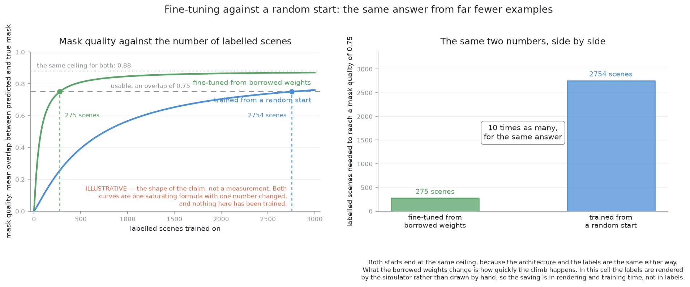
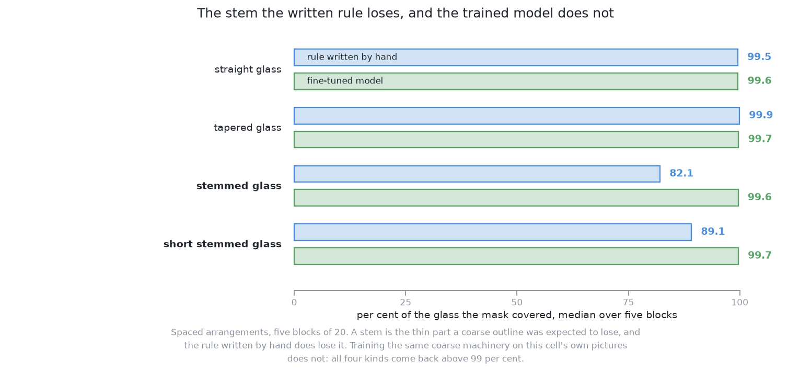

# How it works

This page explains what happens inside this solution, part by part. It follows
[the code](02_the-code.md), and explains what each part of that code is doing.

## Contents

1. [Fine-tuning — continuing somebody else's training](#1-fine-tuning--continuing-somebody-elses-training)
2. [What one class does](#2-what-one-class-does)
3. [Where the training set comes from](#3-where-the-training-set-comes-from)
4. [What training closes, and what it cannot touch](#4-what-training-closes-and-what-it-cannot-touch)
5. [The number beside each outline](#5-the-number-beside-each-outline)
6. [Two ways training on one cell's pictures goes wrong](#6-two-ways-training-on-one-cells-pictures-goes-wrong)

## 1. Fine-tuning — continuing somebody else's training

Because fine-tuning is the single thing that separates this solution from its
partner, it is worth setting out carefully and in plain words.

**Training** a network means showing it an example, comparing what it produced
against the answer that was wanted, and nudging every weight a little in the
direction that would have helped. Repeat that over many examples and the weights
settle at values that produce good answers. **Training from a random start**
means the weights begin as noise, so the nudges have to build every part of the
model out of nothing. **Fine-tuning** means the weights begin at values somebody
else's training already settled, so the nudges have much less to do.

The reason that is so much cheaper is that every weight in a model is a number
the training data has to determine, and fine-tuning hands most of those numbers
over already determined. A comparison from mathematics makes the shape of it
clear. Fitting from a random start is like solving for every coefficient of a
long polynomial with no idea of any of them. Fine-tuning is like being handed a
polynomial that already fits a similar curve and being asked to adjust its
coefficients a little. The second problem needs far fewer points to be well
determined, because most of the answer is already there.

There is a second saving, about time rather than data. A model fitted on
pictures holds, in its early layers, detectors for things common to all vision:
an edge, a corner, a shading that runs smoothly across a curved surface. Those
transfer almost completely, because an edge is an edge. A grey picture shaded
from depth is full of edges, since the rim of a glass against the table behind
it is a large jump in distance and therefore a large jump in grey, and a window
that finds a step from light to dark in a photograph finds the same step here. A
random start spends much of its training discovering those detectors again.
Fine-tuning does not, so only the later judgement — what counts as an object,
and where its edge lies — has to change.

What carries over best is therefore the cheap general machinery at the bottom of
the model, and what carries over worst is the judgement at the top, which was
fitted to decide between everyday categories using colour and texture this cell
does not render. Solution 3's score is the measurement of how badly that top
layer transfers. So fine-tuning here has more work to do than the usual advice
about borrowed models implies, and still far less work than a random start.

## 2. What one class does

The class list is the other thing this solution changes, and its effect is
sharper than it first looks.

The borrowed model names each object it finds from a list fixed when the model
was fitted. That list describes the ordinary contents of ordinary photographs,
and several of its entries are things a person drinks from, with a few near
neighbours beside them. Solution 3 has to accept a whole group of those
categories, because accepting only one of them would throw away every glass the
model happened to name with another. Replacing the list with a single class
removes that whole arrangement. The model is no longer asked **what** it is
looking at. It is asked only **where the instances are**, and each instance it
returns is either a glass or a mistake.

Two of solution 3's failures disappear with the list, and it is worth naming
them one at a time.

**A glass can no longer be lost to a name the filter does not accept.** This is
the one that mattered. A rendered glass seen from the top is a plain shaded
shape, and a model fitted on photographs calls such a shape a sports ball or a
frisbee far more readily than it calls it a cup. In solution 3 such an outline is
dropped and the glass missed. [The
examiner](../03_the-examiner/01_the-examiner.md) says that **missed** is the
count to watch hardest, because a missed glass leaves no trace at all, and
solution 3 misses 93.6 glasses per 100 almost entirely this way. With one class,
a found object cannot be named out of the answer.

**A glass can no longer be reported twice under two names.** In solution 3 a
single glass may be named under two neighbouring everyday categories, arriving
as two outlines of nearly the same pixels, and that duplicate then has to be
noticed and collapsed somewhere after the model. With one class there is only
one name available, so the two candidates covering one glass are two candidates
of the same class, and the model's own step for reducing overlapping candidates
to one answer deals with them inside the model. This removal is real and it was
not needed: the scorecard records no split for solution 3 in any block, so the
failure the removal prevents never occurred in the marked runs.

One thing the single class does not give is the kind of glass. The four kinds
are the straight glass, the tapered glass, the stemmed glass and the short
stemmed glass, and this solution distinguishes none of them, because it is
trained to answer "is this an instance" and nothing else. That is not a loss.
Every glass in one arrangement is the same kind and the kind is known, so
nothing this book asks for needs it.

## 3. Where the training set comes from

Fine-tuning needs examples, which means pictures with every glass already
outlined, and this is where this cell is unusually fortunate.

[The examiner](../03_the-examiner/01_the-examiner.md) renders an **id image** beside every picture: at
each pixel, which glass that pixel shows, or nothing. The examiner keeps that image
to itself at run time and never hands it to a solution, because a solution that
read one would not be answering the problem. However, the examiner does make it
available as a **training label**, and only on the training half of the
arrangements, so that nothing is ever tested on an arrangement it learned from.

From an id image every label this model needs is a selection over an array the
renderer produced anyway. The mask for one glass is the set of pixels carrying
that glass's identity, and the label written out for that glass is the outline
round those pixels, under a class that is always "glass". There is no person
drawing outlines, no budget for that person, and none of the mistakes that
person would make.

**This is a privilege of working in a simulator**, and it is the one
qualification every judgement on this page has to carry. On real photographs
labelling is the expensive part of the whole exercise, and usually the part that
decides whether a method is affordable at all.

Free labels are not the same as a good training set, and one choice still has to
be made well. The cell's own placement rule keeps glasses a comfortable distance
apart, so a training set drawn only from arrangements of that kind would never
show the model a pair that was hard to separate. The examiner also draws
**crowded** arrangements, which push the glasses as close as the cell allows,
and the training set should hold those in proportion with the ordinary ones. The
principle is general and worth remembering: **the edge of what the method will
be asked to handle should sit somewhere in the middle of its training set**, so
that the model has met worse than it ever will.

## 4. What training closes, and what it cannot touch

This is the section the matched pair exists for. Solution 3's weaknesses are
known, and training repairs some of them and inherits others untouched.

**The domain gap closes.** This is the large one. Solution 3 is shown a kind of
picture it was never fitted on, and a model used across such a gap fails in a
characteristic way: not by producing nonsense, but by producing confident,
plausible, wrong answers, which is worse because nothing downstream looks
suspicious. Fine-tuning removes the gap by construction, because the pictures
the model is fitted on are the pictures it will be asked about. The shaded grey,
the absent transparency, the missing highlight on a rim, the teardrop silhouette
leaning away from the point below the camera: all of those are simply what a
glass looks like, as far as the fine-tuned model is concerned, because that is
what every glass in its training set looked like. The marking puts a number on
it: 6.4 glasses found per 100 before training and 99.4 after, on the same
arrangements, marked the same way.

**The naming failures close**, for the reason the previous section gives. There
is one class, so a glass cannot be duplicated across two names or dropped
because of one.

**The confidence number gains a claim to mean something.** More on that in the
next section, including why the bar on it was nevertheless left exactly where
solution 3 set it by hand.

**The coarse outline does not close.** This is the limit worth understanding,
because it is the one that survives everything this solution does. A model of
this kind does not draw an outline pixel by pixel. It computes, once for the
whole picture, a short list of coarse pattern images, and then returns for each
object a short list of weights. The object's outline is the weighted sum of
those patterns, cut at a threshold, and then enlarged to the size of the
picture. The comparison from mathematics is the useful one: this is the same
move as approximating a curve by a short weighted sum of fixed basis functions.
A handful of terms captures the broad shape of almost anything, and no handful
of them will ever capture a fine detail that none of the basis shapes contains.

Two consequences were expected to follow, and the marking has now tested both.
One of them did not survive the test, and the other did.

**A thin part of a glass was expected to be the first thing lost.** A stem is
narrow compared with the bowl above it, so it looks like exactly the sort of
detail a coarse pattern cannot hold, and a solution built from rules written by
hand does lose it: over five blocks of spaced arrangements the written rule's
masks cover 82.1 per cent of a stemmed glass and 89.1 per cent of a short
stemmed one, against 99.5 and 99.9 for the two kinds with no stem. This one does
not lose it. After training it covers all four kinds at 99.6 to 99.7 per cent,
and the two with a stem are not the worst of the four. Teaching the model that
the stem is part of the glass turns out to be enough on its own, and the
coarseness of the outline machinery does not stand in the way of it.

**The edge of the outline stays approximate, and the width is read from the
edge.** The examiner reads a glass's width from how far its mask's points reach out
from its axis, so an outline that is slightly too generous reports a glass
slightly too wide and one slightly too tight reports it slightly too narrow. The
enlargement step tends to err the same way each time, so the error does not
average away over many glasses. Training moves where that error sits; it does
not remove the mechanism that produces it.

The marking shows this one from the other side. The model's masks almost always
cover the whole glass, and they almost always carry a thin margin of pixels that
are not the glass with them: 4.6 per cent of the mask at the median, against 0.0
for the written rule. That margin is the approximate edge, measured rather than
argued about, and it is the one thing the written rule does better. The rule
claims less of the glass and nothing that is not the glass; the model claims all
of the glass and a little of the table around it.

**A partly hidden glass stays a problem.** The outline this model returns is
**modal**, which means it marks only the pixels where the camera actually saw
the object. When one glass stands partly behind another, the outline of the one
behind stops where the one in front begins, so the examiner reads a glass whose
visible part is a slice of its true silhouette. A slice is both narrower than
the whole and sits off to one side, so the glass is reported as a smaller glass
in the wrong place. Training on masks of visible pixels cannot repair that,
because the training labels have the same limit the output does. Repairing it
means training the model towards a different target — the whole silhouette
rather than the visible part — and that is the choice [solution
6](../10_a-transformer-segmenter-fine-tuned/01_what-it-is.md) carries inside it.

**A completely hidden glass stays invisible**, for a reason no model can argue
with. That is its own section below.

## 5. The number beside each outline

Each outline arrives with a number the model offers as its confidence, and what
that number is worth is one of the smaller things training changes.

A number is a **calibrated** probability when its claims come true about as
often as it says they will: among the outlines it scores very highly, nearly all
should really be glasses, and among those it scores middling, a middling share
should be. Solution 3's number was calibrated, to whatever degree it was
calibrated at all, on photographs, and a model's confidence is the first thing
to drift when the input changes, usually becoming too sure rather than too
cautious. So a bar set on solution 3's number is a knob set by hand and nothing
more.

Here the number comes from weights fitted on this cell's own pictures, so it has
a much better claim to mean something. The bar could therefore be chosen
properly, on the training half of the arrangements and measured on the test half,
which is the split the examiner already enforces. **It was not.** The code holds
the bar at 0.25, which is solution 3's hand-set value, and holds the overlap
allowed between two candidates at solution 3's 0.7 as well. The reason is the
pair: a bar moved here would be a second difference between the two solutions,
and the gain from moving it could then be mistaken for the gain from training.
Where the bar sits is a trade, and it is the same trade in both solutions. Set it
low and bare table is reported as glass; set it high and faint glasses are
dropped. Choosing it on the training half is work this solution has left
undone on purpose, and it is the obvious thing to do first if the pair were ever
retired.

One warning applies to this solution unchanged, because training does not
affect it. The number is produced by the same weights that produced the outline,
so it is not an independent check on that outline. It is about whether the thing
is a glass, not about whether its outline is right, and a glass whose mask was
cut short by a neighbour standing in front of it can still be scored highly,
because it plainly is a glass.

## 6. Two ways training on one cell's pictures goes wrong

Fine-tuning is cheap and it is not free of risk, and the two risks have names
worth knowing.

**Catastrophic forgetting.** Continuing a model's training on a narrow set of
pictures moves its weights away from the general answer they held, so the model
becomes better at this cell and worse everywhere else. The general vocabulary of
everyday categories is gone in any case, because it was replaced by one class,
but the effect reaches further than the vocabulary: the fine-tuned weights
describe a world of shaded depth pictures of opaque glasses, and asking them
about an ordinary photograph would be asking them about a world they were
trained out of. Within this project that is not a loss, because the only
pictures this model will be shown are this cell's. It does mean the fine-tuned
weights are a thing with a narrow purpose, and it is one reason a weights file
has to be kept in step with the cell rather than treated as a fixed asset.

**Overfitting.** A model fitted on a small set of examples can learn the
examples instead of the thing the examples are of. Here that would mean learning
the arrangements rather than the glasses: which parts of the frame tend to hold
a glass, how many glasses tend to be present, which spacings are common. Such a
model scores well on the pictures it was trained on and poorly on new ones. Two
things guard against it, and both are already in place. The examiner divides the
arrangements into a training half and a test half and never marks a method on an
arrangement it learned from, so overfitting appears as a gap between the two
halves rather than hiding. And the labels being free means the training set can
be made large and varied at the cost of rendering time alone, which is the
cheapest defence against overfitting there is.

The two risks pull in opposite directions in one respect, and knowing that saves
confusion. Training longer and harder on this cell's pictures closes the domain
gap further while making both forgetting and overfitting more likely. So there
is a sensible amount of training rather than a maximum, and the test half of the
arrangements is what decides where it is.

← [The code](02_the-code.md) · [A worked example](04_a-worked-example.md) →
