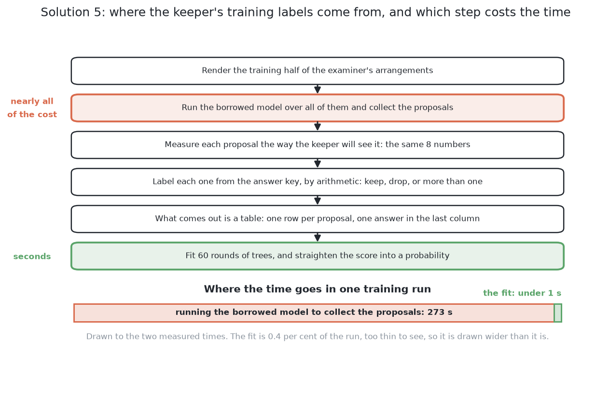

# What it is

> **What it uses** — SAM 2, the second generation of the Segment Anything
> model, at the `facebook/sam2.1-hiera-base-plus` size, loaded through Hugging
> Face `transformers` and never trained here; scikit-learn for the one small
> model that is fitted here; PyTorch underneath, which reaches this machine's
> integrated graphics through its MPS backend.
> **What it does** — SAM 2 outlines whatever is at a place it is pointed at,
> and it names none of what it outlines. Pointed at a plain grid of places
> spread over the whole picture, it therefore outlines everything the picture
> contains: the glasses, the table, the rim of a glass, two glasses that ran
> together into one shape. A small model fitted in this cell, called the
> **keeper**, is then handed each of those outlines on its own and decides
> whether it is one glass. So the half of the job that finds shapes is borrowed
> whole, and the half that decides what a shape is gets replaced.
> **How the output is produced** — the depth readings are shaded into a grey
> picture; SAM 2 reads that picture once; a grid of point prompts turns into a
> heap of outlines; scoring, stability and duplicate removal cut the heap down
> to a shortlist of **proposals**; each proposal's pixels and their depth
> readings become eight measurements on the table; the keeper reads those
> measurements and answers keep, drop, or more than one glass; what it keeps
> still has to pass a width check against the kind, which is known; and the
> proposals that survive all of that are the masks this solution reports.
> **What it costs** — no hand labelling, because the examiner's own answer key
> turns a proposal into a training label by arithmetic. Fitting the keeper is
> under a second of processor time with no graphics card; what takes real time
> is running SAM 2 over the arrangements to collect the proposals to fit it on.
> At run time it costs one pass of the picture encoder per picture and very
> little after that. The weights are 320 MB, are not owned by this project, and
> have to be fetched and pinned to a version. Their licence is Apache 2.0,
> which is something solutions 3 and 4 cannot say.

> **The cell is described once, in [the cell](../01_the-cell.md)** — the layout,
> the two places the camera works from, from the top and from the side, all four
> sensors, and the words this project uses them with. What follows is only what
> is specific to this solution.

## Contents

1. [Introduction](#1-introduction)
2. [The problem this solves](#2-the-problem-this-solves)
3. [The main idea](#3-the-main-idea)

## 1. Introduction

This document describes a way to do [the job this book sets
out](../02_the-problem/01_what-is-asked-for.md) in which almost nothing is
fitted in this cell. The other five solutions either write every rule down by
hand or fit a model to this cell's own pictures. This one does neither for the
part that finds objects: the finding is done by a very large model that somebody
else fitted, somewhere else, on photographs of the real world, and it is used
exactly as it downloads. The only numbers fitted here belong to the keeper,
which looks at what the large model produced and decides which parts of it are
glasses.

By the end you will understand what a foundation model is and what it means for
one to be promptable, how a plain grid of points turns such a model into a
proposer of everything in a scene, why the large model is never trained here and
what that buys, what the keeper is shown and why it is fitted rather than
written as a page of thresholds, why it must give three answers rather than two,
and what its probability has to have done to it before a threshold can be put on
it.

You will also understand the one design question this solution carries inside
itself, which is the most interesting part of the document. A newer generation
of the same borrowed model takes a **word** instead of a point: ask it for
"drinking glass" and it returns every instance of that concept. That would
delete the keeper completely. So this solution has two **ways**, meaning two
versions of one approach, one of them a generation newer than the other. The
last concept section weighs the two against each other, and the honest answer is
not simply that the newer one is better, because the keeper is the one place in
this whole set of six solutions where the deciding can be explained by printing
its inputs beside its answer.

## 2. The problem this solves

This book puts four to six glasses on the table. They are all of one kind, the
kind is known, and they are opaque, so the depth camera sees them. The job is to
say which pixels belong to which glass, and to give each glass a place on the
table and a rough footprint width. What is asked for is **instance
segmentation**, meaning one outline per object rather than one label per pixel,
because how many glasses there are is part of the answer. The difficulty is not
noticing that something is on the table but deciding **how many things are
there**, since two glasses standing clearly apart can still leave one connected
shape in a picture taken from the top.

Four of the other five solutions reach that answer at one of two prices, and
this one is an attempt to pay neither in full.

Solution 1 pays in **rules somebody has to write**. Every limit inside which it
is safe has to be worked out by a person and stated in code, so its cost is that
somebody must be able to state the rule at all.

Solutions 2, 4 and 6 pay in **fitting**. Each of them ends up with a file of
weights that is a second copy of this cell, produced by hours of rendering and
hours of training. That copy has a quiet failure mode: change the lighting,
change the table's surface, widen the range of sizes a kind is drawn from, and
the file is out of date in a way that no test of the code can notice.

This solution avoids the second price by borrowing weights that were never
fitted to this cell, so there is nothing in them that can fall out of step with
it, and it avoids most of the first price by fitting the one decision that is
left over.

The catch arrives with the first sentence of the design, and much of the rest of
this document is about it. **A model that was never fitted to this cell also
never saw this cell.** It does not know about splay, it does not know that
everything on the table is one kind of object, it does not know the gap the cell
guarantees between two glasses, and there is no way to tell it any of those
things.

## 3. The main idea

The main idea is to stop asking for glasses and start asking for everything,
then to throw away what is not a glass. Asking for everything is a grid of
points over the whole picture, because a model that answers one point with the
outline of whatever is at that point answers a grid of points with an outline of
everything. Throwing away what is not a glass is the keeper, which is shown
eight measurements of one proposal and answers whether that proposal is one
glass. The keeper is the only thing fitted here, it fits in under a second, and
the examples it learns from cost nothing, because the examiner already knows
which pixels belong to which glass in the arrangements it draws.

That split is not an accident of convenience, and it is the sentence worth
carrying through the rest of the document. **The job is divided along the line
that transfers best.** A shape is a shape everywhere: a step in distance between
one surface and the surface behind it is the same kind of evidence in a
photograph of a kitchen and in a grey picture shaded from depth, which is why
the proposing half can be borrowed from a model that never saw this cell. What
counts as a cup, on the other hand, is a judgement that somebody fitted to
somebody else's collection of pictures, and it has no reason to agree with what
counts as a glass here. So the proposing half is borrowed and the naming half is
replaced. **That is the opposite trade from solution 3**, which borrows both
halves and takes the borrowed model's names as the answer.

← [The same model, fine-tuned here — how it compares](../08_the-same-model-fine-tuned/06_how-it-compares.md) · [How it works](02_how-it-works.md) →
