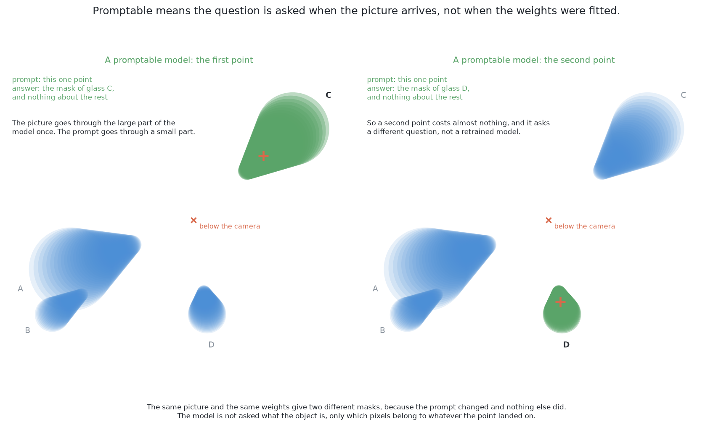
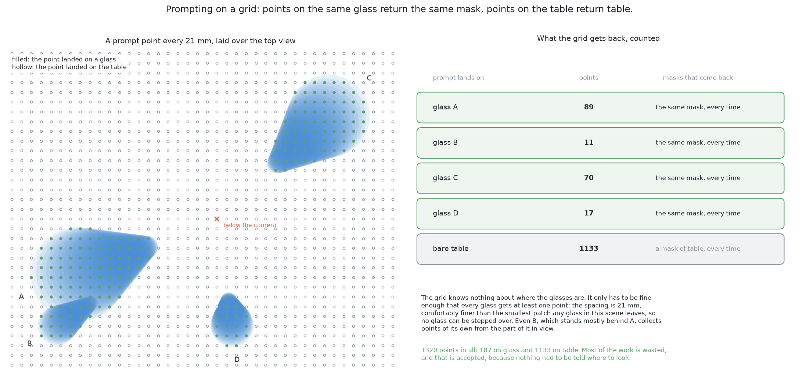
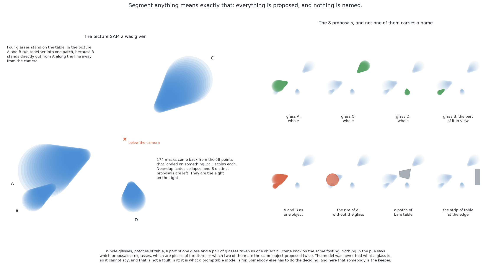

# SAM 2 with a keeper — how it works

This page explains what happens inside this solution, part by part. It follows
[what it is](01_what-it-is.md), which states the question the solution answers
and the single idea it rests on, and it assumes you have read that page first.
By the end of this one you will understand what the method is built from, what
each part does with what the part before it produced, and which part decides
the answer.

## Contents

1. [What a foundation model is](#1-what-a-foundation-model-is)
2. [Turning a promptable model into a proposer of everything](#2-turning-a-promptable-model-into-a-proposer-of-everything)
3. [Why the borrowed model is never trained here](#3-why-the-borrowed-model-is-never-trained-here)
4. [The picture the borrowed model is handed](#4-the-picture-the-borrowed-model-is-handed)
5. [The keeper](#5-the-keeper)
6. [The second rung — a word instead of a grid](#6-the-second-rung--a-word-instead-of-a-grid)

## 1. What a foundation model is

Before the main idea can be made precise, the word for the borrowed half has to
be defined, because everything this solution buys and everything it risks
follows from the definition.

A **foundation model** is a model fitted once, on a very large and very general
collection of data, at a cost nobody expects to repeat, and then used for many
tasks it was not fitted for in particular. The fitting is done by somebody with
a warehouse of machines, and the using is done by everybody else with a
download. A lens is the closest physical comparison: it was ground for no
particular photograph, it suits an enormous range of them, and it knows nothing
about the scene in front of it.

One property of SAM 2 is what makes it usable in this project at all. **It is
class-agnostic**, which means it returns regions with no labels attached to
them. It holds no list of object types and is never asked to recognise anything,
so it never needs the word glass, and the fact that it was fitted on pictures of
everyday things rather than on glasses in a simulated cell does not by itself
disqualify it.

SAM 2 has three parts, and the split between them matters twice later on. A
**picture encoder** turns the whole picture into a block of numbers, and this is
the expensive part, which runs once per picture. A **prompt encoder** turns one
prompt into a small block of numbers. A **mask decoder** combines the two and
produces a mask, and this part is cheap, running once per prompt.

### What promptable means

The word doing the work above is *promptable*, and it does not mean the same
thing as a network that takes a picture and returns an answer.

A **prompt** is a small extra input saying *which* thing in the picture you
mean. For SAM 2 it is a point, meaning "the thing here", or a box, meaning "the
thing inside this rectangle", or a rough mask. The picture and the prompt go in
together and one mask comes out, so changing the prompt while leaving the
picture alone gives a different mask from exactly the same weights. In
programming terms the model is a function of two arguments rather than one,
which is why one picture has as many answers as you care to ask for.

There is a second part of promptability, and it is the more useful part here.
**Ambiguity is returned rather than resolved.** A point on the wall of a glass
genuinely could mean three different things: that patch of wall, the whole
glass, or the glass together with whatever stands behind it. The model does not
guess between them. For one point it returns several masks at different extents
— roughly a part, a whole, and something larger — each with its own estimate of
how good that mask is, and the choice is handed back to whoever asked. That
behaviour is why the heap of proposals further down this document contains a rim
without its glass, and it is what gives the keeper something to choose between
rather than one answer to accept.

One more property has to be stated here, because a later section rests entirely
on it. **A prompt selects; it does not add information.** Pointing at a picture
says which part of that picture interests you. It cannot tell the model about
anything the picture holds no evidence of.

## 2. Turning a promptable model into a proposer of everything

If one prompt gives one thing, then many prompts give many things, and that is
the whole of the step which turns SAM 2 from a tool somebody points at objects
into something that finds the objects by itself.

The design is to lay a regular grid of points over the picture taken from the
top and to prompt once at every point of it. The grid aims at nothing, which is
the point of it: nothing has to know where the glasses are before they have been
found. Each point lands on whatever is under it — bare table returns the table,
a glass wall returns that wall and that glass and something larger, a mouth
returns the mouth — and a grid fine enough to put several points on the
narrowest glass the kind allows touches everything in the scene at least once.

What makes this affordable is the three-part split named above. The expensive
picture encoder runs **once**, and every prompt after it is one pass through the
small mask decoder, so prompting at every point of a grid costs very little more
than prompting at one.

### What comes back, and the cleanup that is not fitted

What comes back is not a list of objects but a heap, and there are three
problems in it. Many grid points land on the same glass, so the same region
arrives many times over with slightly different edges. For a single point the
model returns a part, a whole and something larger, so the heap holds a rim, the
glass that rim belongs to, and that glass together with its neighbour, all of
them defensible answers to the same prompt. And some masks are simply unstable,
which is the signature of a boundary the model is not really sure about.

The repairs are standard, and not one of them involves fitting anything. **Drop
the low-scoring masks**, using the quality estimate the model already returns
beside each one. **Drop the unstable ones**, by nudging the cut-off that turns
the model's output into a yes-or-no mask and keeping only those masks that
barely change when it moves. Then **remove the duplicates** with a step called
**non-maximum suppression**: sort the masks by score, walk down the list keeping
each one, and throw away any later mask that overlaps a mask already kept by
more than a chosen amount. The **overlap** of two masks means the area both of
them claim divided by the area either of them claims, which is one for identical
masks and zero when they share nothing.

The quality estimate and the stability earn their place here and nowhere else.
They are a **gate** rather than evidence: their job is to cut the heap down to a
shortlist before anything else looks at it, and the keeper is deliberately never
shown either of them, because what the keeper has to decide is what a region
*is*, not how sure the borrowed model was while drawing it.

After that cleanup there is a shortlist of regions, each with an outline and a
score, and **not one of them has a name**. The regions are there and they are
good regions, but nothing says which of them are glasses, nothing says the
largest one is the table, and nothing says that the pair which ran together into
one shape is two glasses rather than one very wide one.

So the borrowed model has answered a different question from the one the problem
asks. It says *where the regions are*, and the problem asks *which regions are
glasses, and how many*. The rest of this solution is about closing that gap
without ever training the borrowed model.

## 3. Why the borrowed model is never trained here

The obvious way to close that gap is to train the model, and this solution does
not. **Never trained** means the weights file is used exactly as it downloads:
no gradient is computed through it, no layer of it is replaced, and nothing
about this cell reaches its numbers. Running it is a forward pass and nothing
else.

Four things follow, and together they are the case for this solution. **There is
no training set for the part that finds objects**, because arrangements are
still rendered for the keeper's sake, but the keeper learns from a short table
of measurements per proposal rather than from pictures. **There is nothing that
can go out of date**, because the borrowed model never saw this cell, which is
the exact opposite of solutions 2, 4 and 6, whose weights record what this cell
looked like on the day they were fitted. **It cannot have fitted itself to the
renderer**, so it needs none of the randomisation that a model fitted here
needs. And **setting it up is a download rather than a training run**.

Against those, one cost lands immediately, and it shapes every section after
this one. **There is no way to teach it anything.** Every difficulty that is
specific to this cell has to be handled either **before** the model, by choosing
what picture to hand it, or **after** the model, by the keeper. Splay, the
single known kind, the guaranteed gap between two glasses, the wide range of
sizes inside one kind: the borrowed model knows none of it and cannot be told.
That is why the sections which follow are about the input and the output, and
why none of this document is about the model's insides.

Freezing a large borrowed model and fitting something small behind it is
ordinary practice, named with its citations in [the general ideas behind
this](06_how-it-compares.md#2-the-general-ideas-behind-this).

## 4. The picture the borrowed model is handed

One thing stands between the input this problem defines and the input the
borrowed model expects, and it is the riskiest choice in the whole design, so it
belongs before the keeper rather than after it.

The bench hands over a grey picture shaded from how far away each surface is,
the depth reading at every pixel, and the camera's own pose. SAM 2, like every
model of its kind, was fitted on ordinary colour photographs. So what it is
shown here is a picture of distances dressed up as a photograph, and the single
grey channel has to be repeated across all three colour channels to be a legal
input at all.

A **domain gap** is the difference between the examples a model was fitted on
and the examples it is used on. The physics comparison is exact and worth
holding on to: a formula fitted over one range of temperatures and then used
outside that range does not announce that it has left the range. It returns
numbers, confidently, and they are wrong. A model with a domain gap behaves the
same way, which is why a gap has to be looked for on purpose rather than waited
for.

Four things differ between the two kinds of picture, and they do not all point
the same way.

**Brightness means distance rather than surface.** In a photograph a step in
brightness is usually a step between materials, or a shadow edge, or a
highlight. Here it is a step in distance and nothing else. The two agree at a
glass's silhouette, where the wall and the table behind it really are at
different distances, and they disagree nearly everywhere else.

**There is no texture anywhere.** Photographs carry grain, wood, print and dirt,
while a picture shaded from depth is smooth by construction, so a model leaning
on texture boundaries finds none to lean on.

**Glass does not look like glass.** In a photograph it is transparent, carries
highlights and bends what is behind it, while shaded depth draws it as an opaque
solid with a clean outline. That happens to be in this solution's favour,
because the glasses in this problem are opaque anyway, and it is favour by
accident rather than by design.

**Missing readings leave holes.** Wherever the depth camera returns nothing, the
shading has to invent a brightness, and a hole filled with a constant is a
region with a crisp edge which the borrowed model will happily propose as an
object.

Three prescriptions follow, and they are prescriptions rather than descriptions
of anything built. Shade so that silhouettes are the strongest boundaries in the
picture, by normalising each picture's shading to the range of depth that
picture actually contains. Add some shape shading, since the slope of a surface
relative to the camera can be computed from the depth readings themselves, so
that a curved wall reads as curved rather than as a flat ramp. And fill the
holes from their neighbours rather than with a constant, so that a missing
reading does not become an object with an outline.

None of that closes the gap, and the honest claim is smaller: it makes the
picture more like the pictures the weights were fitted on. The description of
[what is asked for](../02_the-problem/01_what-is-asked-for.md) says that the
two kinds of glass with a stem are harder than the two without, and that the
stemmed glass is the hardest of the four, and that ordering is
exactly what a shaded depth picture makes worse, because a stem is thin and the
silhouette it offers is nearly nothing. Where the shading cannot be made good
enough, the remedy is not available inside this solution at all: it is solution
4 or solution 6, where the weights are allowed to move towards the pictures this
cell really produces.

## 5. The keeper

The keeper is where this solution stops being borrowed. It is to run once per
surviving proposal, read a short table of numbers about that proposal, and
return how likely it is that the proposal is exactly one glass.

### What the keeper is shown

The keeper is not shown pixels, and the reason is not cost. It is that the
useful facts about a proposal are not in its pixels but in what its pixels mean
on the table, and this project already has the arithmetic that works that out.

Every proposal's pixels carry depth readings, because the glasses here are
opaque, so each proposal becomes a set of points in the room. The points at the
top of the proposal give its middle, because seen from the top a rim leans
outwards while its own middle stays over the glass, and how far the cloud of
points reaches from that middle gives a width. The heights of those same points
say how far the proposal's surface stands above the table. The rest of the
measurements come from the shape of the outline, from the depth readings along
that outline, and from the other proposals lying beside it. The keeper would be
shown a handful of them, and they are worth walking through in order.

**Where the measured width falls inside the range this kind of glass allows** is
the strongest single input, because the kind is known and the range of widths
that kind is drawn from is known with it. A footprint narrower than the
narrowest glass of this kind can be is a part of something rather than a glass,
and one wider than the widest is more than one thing.

**How round the proposal is**, meaning its own area against the area its outline
could enclose, comes next. A filled disc is as round as a region can be, while a
ring, a crescent, and two footprints joined by a strip of table all fall well
short of that.

**How far its surface stands above the table** follows from the same points, and
it is what tells the table apart from everything standing on it, because bare
table lies at the table's own height and a glass stands clear of it.

**How far it sits from the point directly below the camera** is about the
viewpoint rather than about the glass. A glass directly below the camera is seen
straight down and shows almost none of its wall, while one far out from that
point leans away and shows a great deal of it, so the same glass gives a
differently shaped proposal in the two places, and the keeper is told which of
the two it is looking at.

**How many prompt points returned this same mask** is counted by the duplicate
removal already and costs nothing to keep, and a region that many points of the
grid agreed on is a firmer thing than one a single prompt found.

**Whether another proposal contains it, or it contains one**, which is called
the **containment** measurement from here on, is the input a hand-written rule
always forgets, and it is how a part declares itself. A rim is a proposal
sitting entirely inside a larger proposal whose own width is perfectly legal,
and that larger proposal is one holding a smaller one, so a single count read
both ways separates a part from the whole it belongs to.

**How much of its outline is a step in depth rather than a smooth run** is the
last thing the picture itself can offer. Where a glass ends, the depth reading
jumps from its wall to the table behind it, so an outline made of such jumps is
the outline of a thing standing on the table, while an outline running smoothly
across one surface is a boundary the cut-off drew rather than one the room
holds.

**How much table the proposal stands over** closes the list, and it is an area
on the table rather than a count of pixels, which is what separates the table
itself from anything that could be a glass of this kind.

| What the measurement says | Why it bears on the question |
| --- | --- |
| where the measured width falls in the range this kind allows | the kind's range of widths is known, so a width outside it is not one glass of this kind |
| how round it is, its own area against the area its outline could enclose | a glass seen from the top is a filled disc whatever the splay, while a rim is a ring and a joined pair has a waist |
| how far its surface stands above the table | a proposal lying at the table's own height is the table |
| how far it sits from the point directly below the camera | splay grows with that distance, so the same glass gives a different proposal near the camera and far from it |
| how many prompt points returned this same mask | a region the grid agreed on many times is firmer than one a single prompt found |
| whether another proposal contains it, or it contains one | a proposal inside a legal glass is a part of that glass, and the glass is the proposal that holds it |
| how much of its outline is a step in depth rather than a smooth run | a thing standing on the table ends where the depth jumps to the table behind it |
| how much table it stands over | the table stands over far more of itself than any glass of this kind can cover |

Every one of those is a **length, a count or a ratio, and not one of them is an
address in the picture**, which is a requirement rather than a preference. The
reason is plain: a pixel address means something different from every place the
camera can stand. The camera here is on the wrist, so it visits several stations
over the glass zone and the same glass appears at a different address in each
picture, while its footprint width, its roundness and its height above the table
are the same numbers from all of them. An input measured in pixels would
therefore teach the keeper about where the camera was parked when the
arrangements for fitting it were rendered, which is exactly the lesson it must
not learn. The one input that does speak about the camera speaks about it on
purpose, because how far a proposal sits from the point below the camera is how
much splay to expect in it.

One worry about that list is worth settling before the list is used, because the
list invites it. Seen from the top, the **mouth** of a glass is a filled disc
whose footprint is the footprint of the glass it belongs to: a width the kind
allows, as round as a footprint gets, and standing well clear of the table. On
every measurement taken from the footprint a mouth therefore looks exactly like
one glass, so the worry is that the keeper holds a mouth as a glass of its own
beside its own glass, and the report then names more glasses than the table
holds.

It does not, and the reason is where a mouth lands rather than what it measures.
A mouth's footprint is its own glass's footprint, so a mouth kept as a glass
would be reported at the place that glass already stands, and a rule of **one
report per place on the table** collapses the two into one. Two glasses of one
kind standing side by side are at least the narrowest width that kind allows
apart, so a second report nearer than that is the same glass arriving twice
rather than another glass. The keeper has its own way of noticing a part inside
a whole, which is the containment measurement, and where that is not enough the
geometry still holds the count.

### Why the keeper is fitted rather than written

Every one of those inputs could be a written threshold instead, so the case for
fitting them has to be made rather than assumed, and there are three parts to
it.

**The first is the nature of the evidence, and it is the real argument.** It is
several weak pieces at once, and not one of them is decisive on its own.
Consider a proposal roughly one glass wide, roughly round, and standing clear of
the table: that is one glass, or the near part of two, or a mouth, and no single
measurement separates the three. Consider a proposal slightly wider than the
kind allows: that is two glasses, or one glass whose mask leaked a little onto
the table. In both cases every measurement leans one way or the other and none
of them settles it. Combining several weak pieces of evidence is precisely what
a written threshold does worst and a small fitted model does best, because a
threshold has to commit to a cut on one measurement at a time while a fitted
model can learn that a width near the top of the range matters only when the
roundness is also low. Writing that down by hand means writing a cut for every
combination, and the number of combinations grows faster than anybody will
maintain.

The second part is this solution's own purpose. A page of thresholds over
regions is a programmed solution, and this book already has one of those in
[solution 1](../05_rules-on-the-table/01_what-it-is.md). The question this solution exists to
answer is how little has to be written down, so the last decision is fitted
rather than written.

The third part is that **the labels are free**, which is what makes the second
part affordable. The bench's answer key says which glass owns each pixel, so the
overlap between a proposal and each real glass's pixels is a subtraction and a
division: overlapping one glass well and no other is one glass, overlapping none
is not a glass, and overlapping two of them well is more than one glass. That is
arithmetic rather than judgement, with no annotator and no annotator's mistakes.
Those labels come only from the training half of the arrangements, and the
keeper is never run on the answer key.

### Three answers, not two

That third label is a real answer rather than a spare category, because in this
cell it is the ordinary way for a proposal to be wrong. So the keeper gives
three answers.

**Keep** means the proposal is one glass, so its pixels are that glass's mask
and go into the report.

**Drop** means the proposal is not a glass, which is what the table, a rim and
an unstable region all are.

**More than one glass** is the third, and it is to be handled rather than
discarded. The design is to prompt the borrowed model again with a fresh grid of
points placed only inside that one proposal. That can work where the whole
picture could not, because when one glass stands in front of another the near
glass's rim is much closer to the camera than the far glass's wall, and that
step in depth is the kind of boundary the borrowed model can find. If at least
two of the regions which come back stand at different places on the table with
widths inside the kind's range, the pair is reported as those two glasses.

If they do not, the pair is **reported as an unseparated pair**, carrying its
reason, and handed to [the job of pushing the glasses
apart](../../09_pushing-the-glasses-apart/01_the-problem/01_what-is-asked-for.md).
That is not a failure. This project's rule is that anything doubtful is reported
and never guessed, and a pair the arm cannot tell apart is stated as the input
to that next job rather than turned into one wide glass that everything
downstream would believe.

### What kind of model the keeper is

The keeper's input is a short table of numbers of different kinds — widths,
heights, distances, ratios and counts — and its answer is one of three
categories. That is the case **gradient-boosted decision trees** were made for
(Friedman, *Greedy Function Approximation: A Gradient Boosting Machine*, Annals
of Statistics, 2001), and scikit-learn provides them.

A tree asks threshold questions and lands in a leaf holding a prediction.
Boosting fits one weak tree, then fits the next tree to whatever the first one
got wrong, and adds them up. Trees suit this table for three reasons. They do
not care that a width measured as a length and a ratio between zero and one are
on different scales, so nothing has to be rescaled. They find combinations of
conditions by themselves, which is the whole argument of the section above. And
on a table of this size they would fit in well under a second on an ordinary
processor with no graphics card involved, which is a pleasant contrast with the
model in front of them.

**This is the only one of the six solutions where a classical model does the
deciding.** Solutions 2, 4 and 6 decide with a neural network fitted here,
solution 3 decides with a borrowed network's own list of names, and solution 1
decides with arithmetic a person wrote. Here a borrowed network proposes and a
small classical model disposes, which is also why the deciding can be explained:
the keeper's inputs are a short list of named measurements, so printing them
beside its answer is an explanation a person can read and argue with.

### Calibration, and why the probability needs it

The keeper returns a probability, and before any threshold is put on that
probability it has to be made to mean something.

A probability is **calibrated** when its claims come true about as often as it
says they will: among the proposals it scores very highly, nearly all should
really be one glass, and among those it scores middling, a middling share should
be. A model fitted to be right as often as possible is not fitted to be honest
about how sure it is, and boosted trees in particular tend to push their scores
towards the ends of the range, so a raw score of nine tenths is not a promise
that nine proposals in ten like it are glasses.

That matters here because the score is not used only to sort. It is compared
against a threshold, and a threshold on a number whose size means nothing is a
knob somebody turned until the result looked good. So a small correction from
the raw score to an honest probability is fitted as part of the keeper's own
fit, in **folds**: the table of proposals is cut into parts, and each part takes
its turn at being held back while the trees are fitted on the others and the
correction on it. No correction is therefore fitted on rows the trees behind it
were shown, because a correction fitted on the keeper's own training rows would
learn the keeper's optimism rather than correct it. The correction is
a handful of numbers more, and it is the cheapest honest thing in this
solution.

**One weakness in that is worth naming, because nothing in the run will show
it.** The folds cut the table of proposals row by row, and one arrangement
contributes many rows, so proposals of the same glasses on the same table can
land on both sides of a fold. Those rows are not independent of each other, so
the correction sees something a little easier than a fresh arrangement would be,
and the probability it produces is therefore a little kinder than the truth. The
cure is to cut the folds by arrangement rather than by row, so that every
proposal from one table stays together, and it is not expensive. It is simply
not what this code does today.

With a calibrated probability, the keeper can have **two thresholds rather than
one**, and the band between them means "I cannot tell". A proposal landing in
that band is neither quietly kept nor quietly dropped: it is a reason to take
another picture from another place, which costs arm time and is cheap compared
with being wrong. That band is also where a glass half hidden behind another one
should land, because a footprint fitted to a sliver of a glass is either
narrower than the kind allows or less round than a whole one, or both.

### The arithmetic still decides

One thing does not change from solution 1, and it is what keeps this solution
inside the same safety argument as the rest of the project.

A proposal the keeper wants to keep still has its width measured against the
kind, and if that width falls outside the range this kind of glass can be, the
proposal is **not reported as a glass**, whatever the keeper said. It becomes a
doubtful report carrying its reason instead.

**With one exception, and the exception is about the view rather than the
proposal.** At the cell's own survey height one picture does not hold the glass
zone, so a glass at the edge of a station's frame shows part of its footprint
and the width measured off that part is part of a width. Refusing on it refuses
the view, and that was measured on masks nothing can improve on: handed the
bench's own exact masks, one station at a time over 20 held-out spawned
arrangements, the kind's range of footprints refuses 66 of 297 glass sightings,
and **every one of those 66 reaches the frame edge**. So the check is not put to
a proposal whose mask reaches that edge. What answers such a proposal instead is
the survey rather than a refusal inside one picture: the cell stands at three
overlapping stations, and the report kept is the one from the station the glass
stood nearest the middle of.

A second piece of arithmetic settles what the width check cannot. **Two reports
at one place on the table are one glass reported twice**, because two glasses of
one kind standing side by side have their centres at least the narrowest width
that kind allows apart, so a report landing nearer than that to one already kept
is the same glass arriving a second time, and only the surer of the two keeps
the place. That is geometry the cell guarantees rather than a number somebody
tuned, and it is what holds the count honest when a mouth and the glass below it
are both kept.

So the borrowed model proposes, the keeper sorts, and the geometry disposes. A
fitted component chooses among regions and a rule nobody trained decides whether
the choice is believable, which is what makes a model this foreign safe to use
here at all.

## 6. The second rung — a word instead of a grid

Everything above is one generation of this solution. There is a second, and it
is the most interesting question this document carries, because it would delete
the keeper entirely.

SAM 3 is available through the same library, and it takes **open-vocabulary text
prompts**. Open-vocabulary means the model is not limited to a fixed list of
categories: the prompt is a phrase rather than a point, and the model returns
every instance of the concept that phrase names. So instead of a grid of points
and a keeper, the whole of this solution's finding and deciding would be a
single request for "drinking glass", answered with one outline per glass. There
is no heap to clean up, because nothing proposes the table or a rim in the first
place, and there is nothing to fit, because the naming is done inside the
borrowed model.

**Both rungs are the same solution.** Both borrow a promptable foundation model
and train nothing in this cell. They differ only in where the judgement "this is
a glass" lives: on the lower rung it lives in a small model fitted in this
cell, and on the upper rung it lives inside borrowed weights, reached through a
word.

What is gained is real and worth stating plainly. There is **less code**: no
grid, no scoring and stability gate, no duplicate removal, no table of
measurements, no classifier, no calibration, and no training step of any kind.
There is **nothing fitted at all**, so the solution has no training half of the
arrangements, nothing to keep in step with the cell, and nothing that can be
fitted to the renderer by mistake. And the proposals that do come back are
already about glasses, so the whole class of mistakes the keeper exists to catch
— the table proposed as an object, a rim proposed without its glass — does not
arise.

What is lost is one thing, and it is the thing this document values most. **The
keeper is the one place in the set of six where the deciding is explainable by
printing its inputs beside its answer.** When the keeper drops a region, the
reason is a short list of named measurements and the answer that followed from
them, and a person can read that list, disagree with it, and point at the
measurement that was wrong. A text prompt moves that judgement inside a model
nobody here can inspect, so when it misses a glass there is nothing to print:
the only available response is to try a different phrase and see what happens.
The difference is between a decision with a readable argument behind it and a
decision that can only be measured from the outside.

There is a second loss, and it is about where this solution then sits. **With a
text prompt this solution begins to resemble solution 3**, because both of them
then rely on a borrowed model's own idea of what a glass is. The resemblance is
only partial, because the two reach that idea differently — solution 3 can only
return a name from a list fixed before it was downloaded, while an open
vocabulary is not limited to any list — and the open vocabulary is a genuine
improvement on a fixed list, since the fixed list has to contain something close
enough to a drinking glass while the phrase can simply say so. But the
structural trade is the same one, and it is the trade this solution was built to
avoid: borrowing both halves rather than borrowing the half that transfers and
replacing the half that does not.

One practical note belongs here, because the licence is one of this solution's
advantages and that advantage is not automatically inherited. The terms a newer
generation of weights is released under have to be read for themselves rather
than assumed to match the generation before it, and here that matters more than
as a caution. **The upper rung has not been run on this machine.** The library
holds the model and the code for this rung is written against it, but the newer
weights are gated: the upload will not hand them over without an account that
has been granted access. So this rung has no scorecard, and none has been
invented for it: only the lower rung has been measured.

So the recommendation is still not to choose once. Fit the keeper, because it is
small and it fits in seconds, and run both rungs on the same held-out
arrangements on a machine whose account has been granted the newer weights. The
bench makes that comparison honest, and if the text prompt wins, the keeper is
still the thing that explains why a region was refused.

← [SAM 2 with a keeper — what it is](01_what-it-is.md) · [SAM 2 with a keeper — the code](03_the-code.md) →
