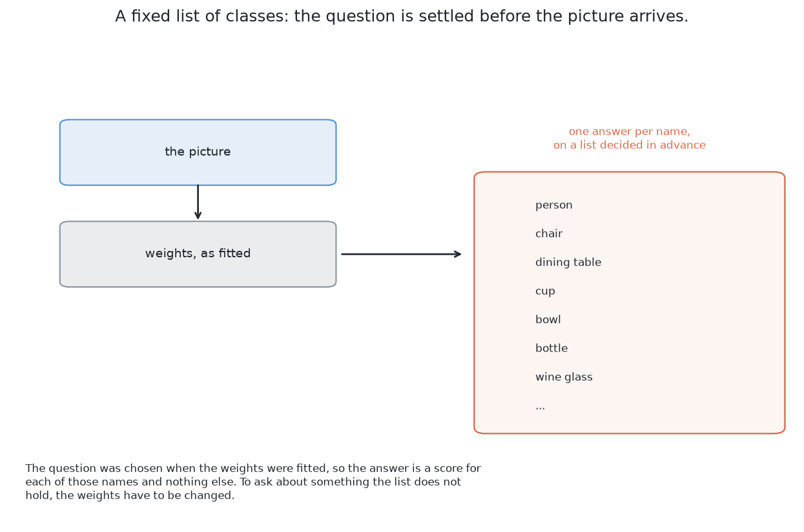
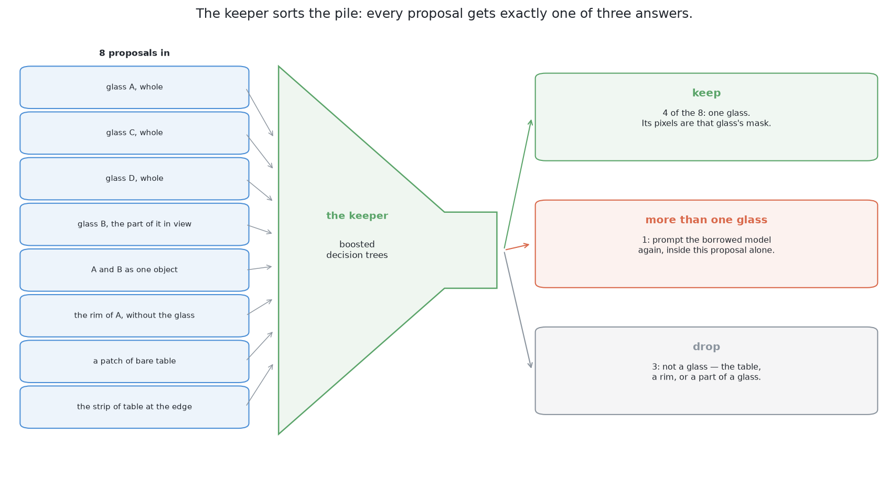
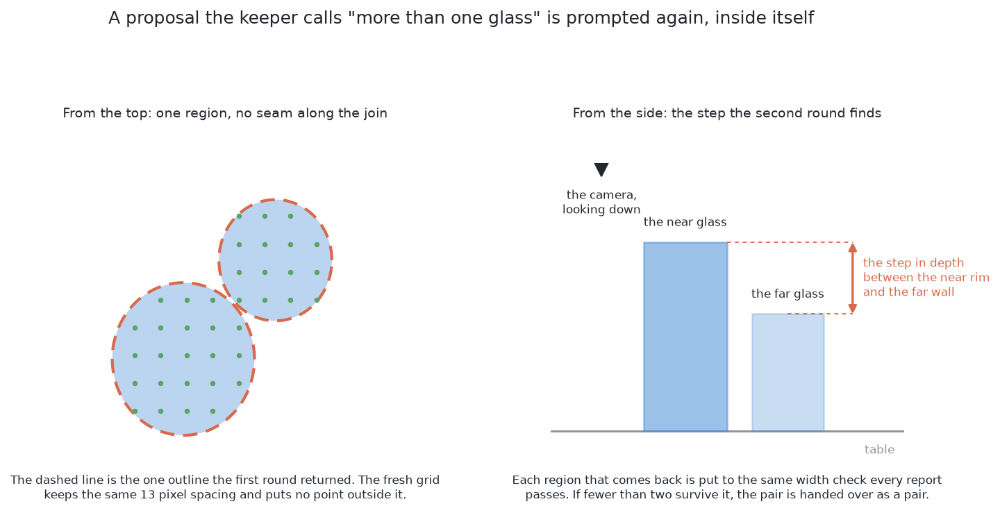
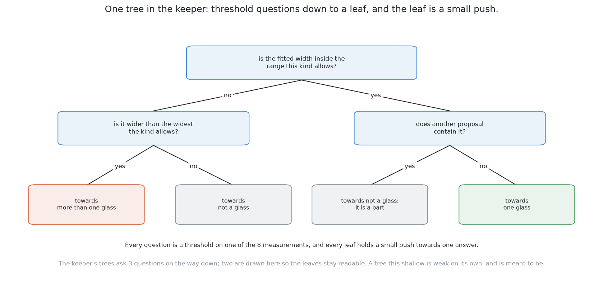
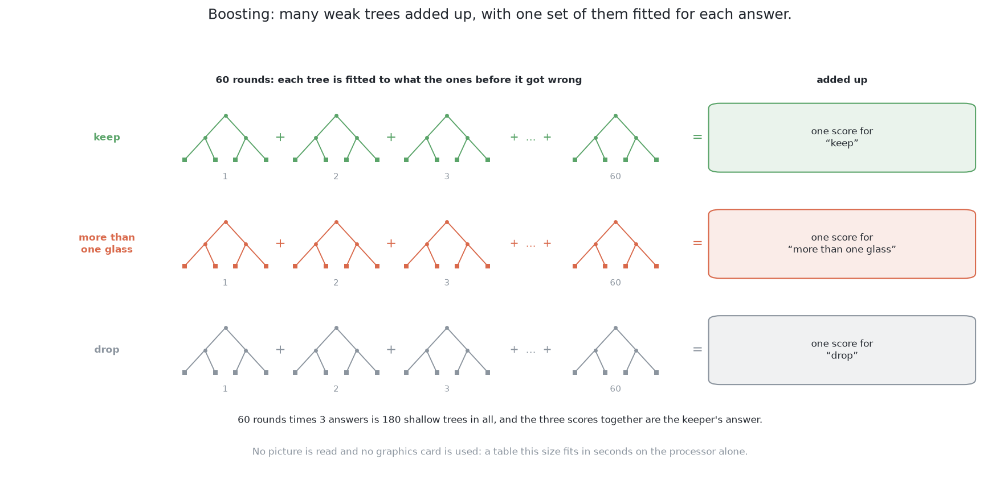
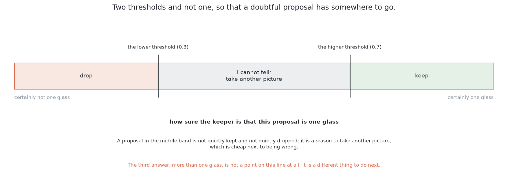

# How it works

This page explains what happens inside this solution, part by part. It
follows [what it is](01_what-it-is.md), which states the question the
solution answers and the single idea it rests on.

## Contents

1. [What a foundation model is](#1-what-a-foundation-model-is)
2. [Turning a promptable model into a proposer of everything](#2-turning-a-promptable-model-into-a-proposer-of-everything)
3. [Why the borrowed model is never trained here](#3-why-the-borrowed-model-is-never-trained-here)
4. [The picture the borrowed model is handed](#4-the-picture-the-borrowed-model-is-handed)
5. [The keeper](#5-the-keeper)
6. [A second way — a word instead of a grid](#6-a-second-way--a-word-instead-of-a-grid)

## 1. What a foundation model is

Everything this solution buys and everything it risks follows from what the
borrowed half is, so the word for it has to be defined first.

A **foundation model** is a model fitted once, on a very large and very general
collection of data, at a cost nobody expects to repeat, and then used for many
tasks it was not fitted for in particular. The fitting is done by somebody with
a warehouse of machines, and the using is done by everybody else with a
download.

One property of SAM 2 is what makes it usable in this project at all. **It is
class-agnostic**, which means it returns regions with no labels attached to
them. It holds no list of object types and is never asked to recognise anything,
so it never needs the word glass, and the fact that it was fitted on pictures of
everyday things rather than on glasses in a simulated cell does not by itself
disqualify it.

SAM 2 has three parts, and the split between them matters twice later on. A
**picture encoder** turns the whole picture into a block of numbers, and this is
the expensive part, which runs once per picture. A **prompt encoder** turns one
prompt into a small block of numbers. A **mask decoder** combines the two and
produces a mask, and this part is cheap, running once per prompt.

### What promptable means

The word doing the work above is *promptable*, and it does not mean the same
thing as a network that takes a picture and returns an answer.

The ordinary kind of network has a **fixed list of classes**, which is a list of
names chosen before the weights were fitted. Such a model answers one question
and only that one: for each name on the list, how strongly does this picture
show it. Asking about anything the list does not hold means fitting the weights
again.

A **prompt** is a small extra input saying *which* thing in the picture you
mean. For SAM 2 it is a point, meaning "the thing here", or a box, meaning "the
thing inside this rectangle", or a rough mask. The picture and the prompt go in
together and one mask comes out, so changing the prompt while leaving the
picture alone gives a different mask from exactly the same weights. In
programming terms the model is a function of two arguments rather than one,
which is why one picture has as many answers as you care to ask for.

There is a second part of promptability, and it is the more useful part here.
**Ambiguity is returned rather than resolved.** A point on the wall of a glass
could mean that patch of wall, the whole glass, or the glass together with
whatever stands behind it, and the model does not guess between them. For one
point it returns three masks at different extents — roughly a part, a whole, and
something larger — each with its own estimate of how good it is. That is why the
heap of proposals further down contains a rim without its glass, and it is what
gives the keeper something to choose between rather than one answer to accept.

One more property has to be stated here, because a later section rests entirely
on it. **A prompt selects; it does not add information.** Pointing at a picture
says which part of that picture interests you. It cannot tell the model about
anything the picture holds no evidence of.

## 2. Turning a promptable model into a proposer of everything

If one prompt gives one thing, then many prompts give many things, and that is
the whole of the step which turns SAM 2 from a tool somebody points at objects
into something that finds the objects by itself.

The design is to lay a regular grid of points over the picture taken from the
top and to prompt once at every point of it. The grid aims at nothing, which is
the point of it: nothing has to know where the glasses are before they have been
found. Each point lands on whatever is under it — bare table returns the table,
a glass wall returns that wall and that glass and something larger, a mouth
returns the mouth.

How fine the grid is, is the one number this step has to choose, and it is read
off the kind rather than tuned. The code asks for three points across the
narrowest glass the kind allows, which on a 320 by 240 picture of the table
comes to a point every 9 pixels for the straight glass and every 13 for the
tapered one — 972 prompts over the picture in the first case and 450 in the
second. A glass cannot fall between the points of a grid that fine. The picture
below draws the tapered kind's grid, at the spacing the code works out for it.

What makes this affordable is the three-part split named above. The expensive
picture encoder runs **once**, and every prompt after it is one pass through the
small mask decoder, so prompting at every point of a grid costs very little more
than prompting at one.

### What comes back, and the cleanup that is not fitted

What comes back is not a list of objects but a heap, and there are three
problems in it. Many grid points land on the same glass, so the same region
arrives many times over with slightly different edges. One point returns a part,
a whole and something larger, so the heap holds a rim, the glass it belongs to,
and that glass together with its neighbour. And some masks are unstable, which
is the signature of a boundary the model is not sure about.

The repairs are standard, and not one of them involves fitting anything. **Drop
the low-scoring masks**, using the quality estimate the model already returns
beside each one, which here has to reach 0.8. **Drop the unstable ones**, by
nudging the cut-off that turns the model's output into a yes-or-no mask up and
then down by the same amount and keeping only the masks whose smaller version is
still 0.92 of their larger one. Then
**remove the duplicates** with a step called **non-maximum suppression**: sort
the masks by score, walk down the list keeping each one, and throw away any later
mask that overlaps a mask already kept by more than 0.7. The **overlap** of two
masks means the area both of them claim divided by the area either of them
claims, which is one for identical masks and zero when they share nothing.

The quality estimate and the stability earn their place here and nowhere else.
They are a **gate** rather than evidence, and the keeper is deliberately never
shown either of them, because what the keeper has to decide is what a region
*is*, not how sure the borrowed model was while drawing it.

After that cleanup there is a shortlist of regions, each with an outline and a
score, and **not one of them has a name**. Nothing says which of them are
glasses, nothing says the largest one is the table, and nothing says that the
pair which ran together into one shape is two glasses rather than one very wide
one.

So the borrowed model has answered a different question from the one the problem
asks. It says *where the regions are*, and the problem asks *which regions are
glasses, and how many*.

## 3. Why the borrowed model is never trained here

The obvious way to close that gap is to train the model, and this solution does
not. **Never trained** means the weights file is used exactly as it downloads:
no gradient is computed through it, no layer of it is replaced, and nothing
about this cell reaches its numbers. Running it is a forward pass and nothing
else.

Four things follow, and together they are the case for this solution. There is
**no training set for the part that finds objects**, because arrangements are
still rendered for the keeper's sake, but the keeper learns from a short table
of measurements per proposal rather than from pictures. There is **nothing that
can go out of date**, because the borrowed model never saw this cell, which is
the exact opposite of solutions 2, 4 and 6, whose weights record what this cell
looked like on the day they were fitted. **It cannot have fitted itself to the
renderer**, so it needs none of the randomisation that a model fitted here
needs. And **setting it up is a download rather than a training run**.

Against those, one cost lands immediately, and it shapes every section after
this one. **There is no way to teach it anything.** Splay, the single known
kind, the guaranteed gap between two glasses, the wide range of sizes inside one
kind: the borrowed model knows none of it and cannot be told. Every difficulty
specific to this cell therefore has to be handled either before the model, by
choosing what picture to hand it, or after the model, by the keeper, which is
why the sections that follow are about the input and the output and none of this
document is about the model's insides.

Freezing a large borrowed model and fitting something small behind it is
ordinary practice, named with its citations in [the general ideas behind
this](06_how-it-compares.md#3-the-general-ideas-behind-this).

## 4. The picture the borrowed model is handed

One thing stands between the input this problem defines and the input the
borrowed model expects, and it is the riskiest choice in the design.

The examiner hands over the depth reading at every pixel and the camera's own
pose, and no colour at all. SAM 2, like every model of its kind, was fitted on
ordinary colour photographs. So the shared shading in `bench/pictures.py` turns
the distances into a grey value and repeats that one channel across all three
colour channels, and what the model is shown is a picture of distances dressed
up as a photograph.

A **domain gap** is the difference between the examples a model was fitted on
and the examples it is used on. A formula fitted over one range of temperatures
and then used outside it does not announce that it has left the range: it
returns numbers, confidently, and they are wrong. A model with a domain gap
behaves the same way, which is why a gap has to be looked for on purpose.

Four things differ between the two kinds of picture, and they do not all point
the same way.

**Brightness means distance rather than surface.** In a photograph a step in
brightness is usually a step between materials, or a shadow edge, or a
highlight. Here it is a step in distance and nothing else. The two agree at a
glass's silhouette, where the wall and the table behind it really are at
different distances, and they disagree nearly everywhere else.

**There is no texture anywhere**, so a model leaning on texture boundaries finds
none to lean on.

**Glass does not look like glass.** In a photograph it is transparent and bends
what is behind it, while shaded depth draws it as an opaque solid with a clean
outline. That is in this solution's favour, because the glasses here are opaque
anyway, and it is favour by accident rather than by design.

**A ray that hit nothing has no distance to shade**, so off the edge of the
table the shading has to invent a brightness.

The shading answers the first of those and leaves the rest. It stretches each
picture's greys over the range of depth that picture actually contains, so that
the nearest rim and the farthest table land at the two ends and a silhouette is
the strongest boundary in the picture; a fixed range would squeeze every scene
into a narrow band of grey and weaken exactly that edge. It gives the rays that
hit nothing a value of their own, below every real surface. Two repairs it does
not make are the obvious next things to try: shading by the slope of a surface
as well as by its distance, which the depth readings themselves can give, so
that a curved wall reads as curved rather than as a flat ramp; and filling holes
inside the table from their neighbours rather than leaving them as regions with
crisp edges.

None of that closes the gap, and the honest claim is smaller: it makes the
picture more like the pictures the weights were fitted on. The run shows where
it falls short, and the shortfall sorts by kind. Averaged over the five blocks
of held-out spaced arrangements, the masks this solution draws cover 99.1 per
cent of a tapered glass and 97.6 per cent of a straight one, but only 89.0 per
cent of a short stemmed glass and 85.9 per cent of a stemmed one. A stem is
thin, so the silhouette it offers in a shaded depth picture is nearly nothing,
and what the mask loses is the foot and the sliver of stem beside it — the same
thing [the written rule
loses](../11_the-results.md#3-what-the-numbers-mean), for the same reason. Where
the shading cannot be made good enough, the remedy is not available inside this
solution at all. It is solution 4 or solution 6, where the weights are allowed
to move towards the pictures this cell really produces.

## 5. The keeper

The keeper is where this solution stops being borrowed. It runs once per
surviving proposal, reads eight numbers about that proposal, and returns how
likely it is that the proposal is exactly one glass.

### What the keeper is shown

The keeper is not shown pixels, and the reason is not cost. It is that the
useful facts about a proposal are not in its pixels but in what its pixels mean
on the table, and this project already has the arithmetic that works that out.
Every proposal's pixels carry depth readings, because the glasses here are
opaque, so each proposal becomes a set of points in the room, and those points
give a middle, a width and a height above the table. The table below lists the
eight numbers in the order the code shows them, with the reason each one bears
on the question of whether this region is one glass.

| What the measurement says | Why it bears on the question |
| --- | --- |
| where the measured width falls in the range this kind allows | the kind's range of widths is known, so a width outside it is not one glass of this kind |
| how round it is, its own area against the area its outline could enclose | a glass seen from the top is a filled disc whatever the splay, while a rim is a ring and a joined pair has a waist |
| how far its surface stands above the table | a proposal lying at the table's own height is the table |
| how far it sits from the point directly below the camera | splay grows with that distance, so the same glass gives a different proposal near the camera and far from it |
| how many prompt points returned this same mask | a region the grid agreed on many times is firmer than one a single prompt found, and the duplicate removal has already counted it |
| how much of its outline is a step in depth rather than a smooth run | a thing standing on the table ends where the depth jumps to the table behind it, while an outline running smoothly across one surface is a boundary the cut-off drew |
| its area on the table, in square millimetres | the table stands over far more of itself than any glass of this kind can cover |
| whether another proposal contains it, or it contains one | a proposal inside a legal glass is a part of that glass, and the glass is the proposal that holds it |

The last of the eight, which this document calls the **containment**
measurement, is the input a hand-written rule always forgets, and it is how a
part declares itself: a rim is a proposal sitting entirely inside a larger
proposal whose own width is perfectly legal, so one count read both ways
separates a part from the whole it belongs to.

Every one of the eight is a **length, a count or a ratio, and not one of them is
an address in the picture**, which is a requirement rather than a preference.
A pixel address means something different from every place the camera can stand.
The camera here is on the wrist, so it visits three stations over the glass zone
and the same glass appears at a different address in each picture, while its
footprint width, its roundness and its height above the table are the same
numbers from all of them. An input measured in pixels would therefore teach the
keeper about where the camera was parked when the arrangements for fitting it
were rendered, which is exactly the lesson it must not learn. The one input that
does speak about the camera speaks about it on purpose, because how far a
proposal sits from the point below the camera is how much splay to expect in it.

One worry about that list is worth settling, because the list invites it. Seen
from the top, the **mouth** of a glass is a filled disc whose footprint is the
footprint of the glass it belongs to: a width the kind allows, as round as a
footprint gets, and standing well clear of the table. On every measurement taken
from the footprint a mouth looks exactly like one glass, so the keeper may well
hold it as one. What stops the report naming more glasses than the table holds
is where a mouth lands rather than what it measures: it is reported at the place
its own glass already stands, and the rule of one report per place on the table,
below, collapses the two into one.

### Why the keeper is fitted rather than written

Every one of those inputs could be a written threshold instead, so the case for
fitting them has to be made rather than assumed, and there are three parts to
it.

**The first is the nature of the evidence, and it is the real argument.** It is
several weak pieces at once, and not one of them is decisive on its own. A
proposal roughly one glass wide, roughly round, and standing clear of the table
is one glass, or the near part of two, or a mouth, and no single measurement
separates the three. Combining several weak pieces of evidence is what a written
threshold does worst and a small fitted model does best, because a threshold has
to commit to a cut on one measurement at a time while a fitted model can learn
that a width near the top of the range matters only when the roundness is also
low. Writing that down by hand means writing a cut for every combination, and
the number of combinations grows faster than anybody will maintain.

The second part is this solution's own purpose. A page of thresholds over
regions is a programmed solution, and this book already has one of those in
[solution 1](../05_rules-on-the-table/01_what-it-is.md). The question this
solution exists to answer is how little has to be written down, so the last
decision is fitted rather than written.

The third part is that **the labels are free**, which is what makes the second
part affordable. The examiner's answer key says which glass owns each pixel, so
labelling a proposal is a subtraction and a division. A glass counts as held by
a proposal when more than half the glass is inside it, and the proposal counts
as being about glasses at all when more than half of it is covered by the
glasses it holds, which is what stops a mask of the whole table being called
"more than one glass" because the glasses stand on it. Holding one glass is one
glass, holding none is not a glass, and holding two is more than one glass. That
is arithmetic rather than judgement, with no annotator and no annotator's
mistakes, and it is done only on the training half of the arrangements.

### Three answers, not two

That third label is a real answer rather than a spare category, because in this
cell it is the ordinary way for a proposal to be wrong. So the keeper gives
three answers.

**Keep** means the proposal is one glass, so its pixels are that glass's mask
and go into the report.

**Drop** means the proposal is not a glass, which is what the table, a rim and
an unstable region all are.

**More than one glass** is the third, and it is handled rather than discarded.
The borrowed model is prompted again with a fresh grid of points placed only
inside that one proposal. That works where the whole picture could not, because
when one glass stands in front of another the near glass's rim is much closer to
the camera than the far glass's wall, and that step in depth is the kind of
boundary the borrowed model can find. The regions that come back are put through
exactly the checks every other report passes, and if at least two of them
survive, the pair is reported as those two glasses.

If fewer than two survive, the pair is **reported as an unseparated pair**,
carrying its reason, and handed to [the job of pushing the glasses
apart](../../09_pushing-the-glasses-apart/01_the-problem/01_what-is-asked-for.md).
That is not a failure. This project's rule is that anything doubtful is reported
and never guessed, and a pair the arm cannot tell apart is stated as the input
to that next job rather than turned into one wide glass that everything
downstream would believe. Over the five blocks of held-out arrangements it
happened twice on the crowded set and never on the spaced one.

### What kind of model the keeper is

The keeper's input is a short table of numbers of different kinds — widths,
heights, distances, ratios and counts — and its answer is one of three
categories. That is the case **gradient-boosted decision trees** were made for
(Friedman, *Greedy Function Approximation: A Gradient Boosting Machine*, Annals
of Statistics, 2001), and scikit-learn provides them through
`HistGradientBoostingClassifier`.

A tree asks threshold questions and lands in a leaf holding a prediction. Each
question is a threshold on one of the eight measurements, and each leaf holds a
small push towards one of the three answers.

Boosting fits one weak tree, then fits the next tree to whatever the first one
got wrong, and adds them up. Here that is 60 rounds of trees three questions
deep, one set of trees per answer, so 180 shallow trees in all.

Trees suit this table because they do not care that a width measured as a length and a ratio
between zero and one are on different scales, because they find combinations of
conditions by themselves, and because a table of this size fits in well under a
second on an ordinary processor with no graphics card involved.

**This is the only one of the six solutions where a classical model does the
deciding**, and that is why the deciding can be explained: the keeper's inputs
are a short list of named measurements, so printing them beside its answer is an
explanation a person can read and argue with.

### Calibration, and why the probability needs it

The keeper returns a probability, and before any threshold is put on that
probability it has to be made to mean something.

A probability is **calibrated** when its claims come true about as often as it
says they will: among the proposals it scores very highly, nearly all should
really be one glass, and among those it scores middling, a middling share should
be. A model fitted to be right as often as possible is not fitted to be honest
about how sure it is, and boosted trees in particular tend to push their scores
towards the ends of the range, so a raw score of nine tenths is not a promise
that nine proposals in ten like it are glasses.

That matters here because the score is compared against a threshold, and a
threshold on a number whose size means nothing is a knob somebody turned until
the result looked good. So a small correction from the raw score to an honest
probability is fitted as part of the keeper's own fit, in **folds**: the table
of proposals is cut into three parts, and each part takes its turn at being held
back while the trees are fitted on the others and the correction on it. No
correction is therefore fitted on rows the trees behind it were shown, because a
correction fitted on the keeper's own training rows would learn the keeper's
optimism rather than correct it. Which shape of correction is used depends on
how much data there is: a free-form staircase only when the rarest of the three
answers reaches 200 rows, and a two-parameter curve below that. The run behind
this solution's scorecard had far fewer, so it used the curve.

**One weakness in that is worth naming, because nothing in the run will show
it.** The folds cut the table row by row, and one arrangement contributes many
rows, so proposals of the same glasses on the same table can land on both sides
of a fold. Those rows are not independent, so the correction sees something a
little easier than a fresh arrangement would be and the probability it produces
is a little kinder than the truth. The cure is to cut the folds by arrangement
rather than by row, and it is not expensive. It is simply not what this code
does today.

With a calibrated probability, the keeper has **two thresholds rather than
one**. Above 0.7 the proposal is kept, below 0.3 it is dropped, and between them
the answer is "I cannot tell". A proposal landing in that band is neither
quietly kept nor quietly dropped: it is a reason to take another picture from
another place, which costs arm time and is cheap compared with being wrong. That
band is also where a glass half hidden behind another one should land, because a
footprint fitted to a sliver of a glass is either narrower than the kind allows
or less round than a whole one, or both. It is a wide band in practice: over the
five blocks of spaced arrangements the solution handed over 634 proposals it
could not tell about, against 85 glasses it missed altogether.

### The arithmetic still decides

One thing does not change from solution 1, and it is what keeps this solution
inside the same safety argument as the rest of the project.

A proposal the keeper wants to keep still has its width measured against the
kind, and if that width falls outside the range this kind of glass can be, the
proposal is **not reported as a glass**, whatever the keeper said. It becomes a
doubtful report carrying its reason instead.

**With one exception, and the exception is about the view rather than the
proposal.** At the cell's own survey height one picture does not hold the glass
zone, so a glass at the edge of a station's frame shows part of its footprint
and the width measured off that part is part of a width. Refusing on it refuses
the view, and that was measured on masks nothing can improve on: handed the
examiner's own exact masks, one station at a time over 20 held-out spawned
arrangements, the kind's range of footprints refuses 66 of 297 glass sightings,
and **every one of those 66 reaches the frame edge**. So the check is not put to
a proposal whose mask reaches that edge. What answers such a proposal instead is
the survey rather than a refusal inside one picture: the cell stands at three
overlapping stations, and the report kept is the one from the station the glass
stood nearest the middle of. With the exception in place, the width check now
refuses almost nothing: 4 reports over the five blocks of spaced arrangements
and 8 over the crowded ones.

A second piece of arithmetic settles what the width check cannot. **Two reports
at one place on the table are one glass reported twice**, because two glasses of
one kind standing side by side have their centres at least the narrowest width
that kind allows apart, so only the surer of two reports nearer than that keeps
the place. That is geometry the cell guarantees rather than a number somebody
tuned, and it is what holds the count honest when a mouth and the glass below it
are both kept.

So the borrowed model proposes, the keeper sorts, and the geometry disposes. A
fitted component chooses among regions and a rule nobody trained decides whether
the choice is believable, which is what makes a model this foreign safe to use
here at all.

## 6. A second way — a word instead of a grid

There is a second way to build this solution, and it would delete the keeper
entirely. SAM 3, through the same library, takes an **open-vocabulary text
prompt**: the prompt is a phrase rather than a point, and the model returns
every instance of the concept that phrase names. So the grid, the shortlist and
the keeper would all be replaced by one request for "drinking glass", answered
with one outline per glass, with nothing fitted in this cell at all. The code
for it is written, in `sam3_words.py`, against the library's documented
interface.

What that loses is the thing this solution is valued for. **The keeper is the
one place among the six where the deciding can be explained by printing its
inputs beside its answer.** A text prompt moves that judgement inside borrowed
weights nobody here can inspect, so when it misses a glass there is nothing to
print and the only response is to try another phrase. It also makes this
solution resemble solution 3, because both then rely on somebody else's idea of
what a glass is.

**It has not been run.** SAM 2's weights are Apache 2.0 and download without an
account; SAM 3's are released under terms of their own and the upload is gated,
and this machine's account has not been granted them. So this way has no
scorecard and none has been invented for it. A permissive licence on one
generation is not inherited by the next, which is worth knowing before a project
plans around one.

← [What it is](01_what-it-is.md) · [The code](03_the-code.md) →
