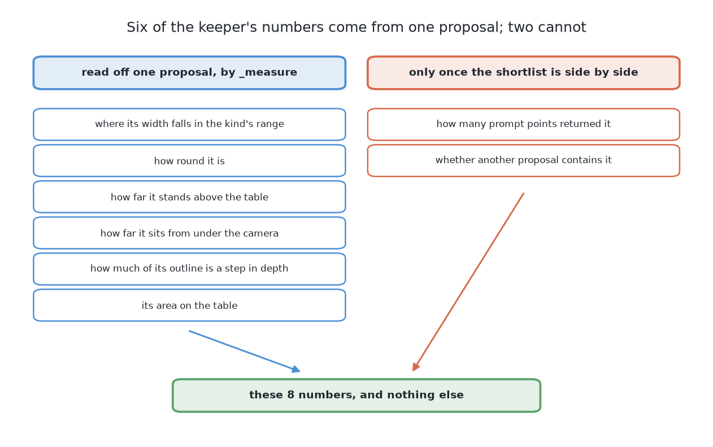

# The code

This page shows the code at the heart of this solution, and says what the
solution hands back to the rest of the cell. It follows [what it
is](01_what-it-is.md), and [how it works](03_how-it-works.md) explains, part by
part, what the code below is doing.

## Contents

1. [The code at the heart of it](#1-the-code-at-the-heart-of-it)
2. [The masks are what this contributes](#2-the-masks-are-what-this-contributes)
3. [Three things to hold on to](#3-three-things-to-hold-on-to)

## 1. The code at the heart of it

This solution is two models meeting at one place, so that place is worth seeing.
On one side a grid of point prompts goes into the borrowed model. On the other a
short row of measurements comes back out of what the borrowed model returned,
and that row is the only thing the fitted model ever reads.

Going in, in `05-sam2-with-a-keeper/sam_keeper.py`, four steps turn the kind of
glass into masks.

1. Measure the narrowest glass that kind allows, in pixels, and divide that
   width so three prompt points land across such a glass. That division is the
   grid's spacing.
2. Pick the rows and the columns the grid falls on, starting half a step in from
   the edge of the picture, and pair every row with every column to get the list
   of points to prompt with.
3. Wrap each point in a prompt of its own, so every point asks its own question,
   scale those points to the size the picture encoder was given, and move them
   onto the processor the model runs on.
4. Send the prompts sixty-four at a time into the one call that reaches the
   borrowed model, which answers each point with three masks.

```python
def prompt_spacing(kind: str) -> int:
    ...
    # Step 1: how wide the narrowest glass is, in pixels -- the grid must catch the smallest one
    narrowest = data.widths(kind)[0] / _metres_per_pixel()
    # Step 1: divide it so three points land across that glass -- that is the grid's spacing
    return max(1, int(narrowest / POINTS_ACROSS_SMALLEST))

def _grid(spacing: int, inside: np.ndarray | None = None) -> list[list[float]]:
    """Prompt points (column, row) on a regular grid, optionally only where ``inside`` is true."""
    # Step 2: pick the rows and columns of the grid -- it starts half a step in from the edge
    rows = np.arange(spacing // 2, render.HEIGHT, spacing)
    columns = np.arange(spacing // 2, render.WIDTH, spacing)
    # Step 2: pair every row with every column -- this is the list of points to prompt with
    points = [[float(column), float(row)] for row in rows for column in columns]
    ...

    def at(self, points: list[list[float]]) -> tuple[np.ndarray, np.ndarray, np.ndarray]:
        ...
        # Step 3: wrap each point in a prompt of its own -- not one prompt holding every point
        asked = [[[point] for point in points]]
        # Step 3: scale the points to the size the encoder saw -- the pixels are not read again
        prepared = self.processor(original_sizes=self.sizes, input_points=asked, return_tensors="pt")
        # Step 3: move the points onto the model's processor -- and into a type it will take
        all_points = _onto(prepared["input_points"], self.where)
        ...
            # Step 4: send the prompts 64 at a time -- all their masks at once need too much memory
            for start in range(0, all_points.shape[1], PROMPTS_AT_ONCE):
                chunk = all_points[:, start : start + PROMPTS_AT_ONCE]
                # Step 4: ask the borrowed model for masks -- three per point, encoder already run
                out = self.model(image_embeddings=self.embeddings, input_points=chunk, multimask_output=True)
```

Coming out, in the same file, one more step turns a region that survived the
cleanup into numbers measured on the table rather than in the picture.

5. Take the rows and the columns of the pixels the fitted footprint covers, turn
   those pixels into real points on the table, find the one-pixel ring just
   inside the mask, which is the mask's own outline, and hand back the six
   numbers.

```python
def _measure(picture, mask, found, jumps, step, camera, widths) -> list[float]:
    ...
    # Step 5: take the rows and columns of the footprint's pixels -- places in the picture
    rows, columns = found.pixels[:, 0], found.pixels[:, 1]
    # Step 5: turn those pixels into real points on the table -- not pixels in a picture
    points = render.to_world(picture, rows, columns)

    low, high = widths
    # Step 5: find the one-pixel ring just inside the mask -- where a depth step would show
    edge = mask & ~cv2.erode(mask.astype(np.uint8), np.ones((3, 3), np.uint8)).astype(bool)
    # Step 5: hand back the six numbers -- six of the eight the keeper reads; two come later
    return [
        (found.width - low) / (high - low),  # where its width falls in the kind's range
        _roundness(mask),
        float(np.median(points[:, 2]) - TABLE_TOP_Z),  # how far its surface stands off the table
        float(math.dist((found.x, found.y), camera)),  # how far it sits from under the camera
        float(np.mean(jumps[edge] > step)) if edge.any() else 0.0,  # how much of its edge is a step
        _table_area(points),
    ]
```

That function returns six numbers and the keeper reads eight, and the gap is not
an oversight. Six of the eight can be worked out from one proposal on its own,
and two of them cannot be worked out from one proposal at all. How many prompt
points returned this same mask is a count the duplicate removal already made
while comparing the whole shortlist. Whether another proposal contains this one,
or this one contains another, is a statement about a pair. Both are added by
`_proposals`, which holds the whole shortlist, after `_measure` has done its
work on each region separately.



Two things show in those two blocks. The borrowed half is one call,
`self.model(...)` on a `Sam2Model` loaded through Hugging Face `transformers`,
and every line written around it belongs to this project. And the fitted half
never sees a pixel: what reaches scikit-learn — a
`HistGradientBoostingClassifier` wrapped in a `CalibratedClassifierCV` — is the
list the second block returns. That is what borrowing the seeing and fitting the
deciding looks like in code.

## 2. The masks are what this contributes

Everything above produces masks, and nothing above produces a place or a width.

Turning a mask into a place on the table and a rough width is the examiner's
job, shared by all six solutions and set out in [how a mask becomes a
record](../12_how-a-mask-becomes-a-record.md). **So this solution contributes
only the masks, and any difference in its score belongs to the mask.** It
cannot win by measuring more cleverly and it cannot lose by measuring worse.

One consequence is worth stating because it removes a question this solution
invites. **No model here produces a pose.** The borrowed model produces regions,
the keeper produces a decision about a region, and the pose comes from depth and
the camera's own pose by arithmetic. A glass standing upright on a flat table
has no orientation left to find.

## 3. Three things to hold on to

**The only fitted stage is the keeper**, which reads a table of numbers rather
than pictures, so everything that finds objects is borrowed and none of it knows
anything about this cell.

**The riskiest stage is the shading**, because it is the only place where a
choice that no arithmetic can check changes what every later stage sees.

**The width check sits after the keeper rather than before it**, so a wrong
answer from the keeper still has to get past a rule nobody fitted, and a wrong
keep therefore becomes a doubtful report rather than a wrong glass.

← [What it is](01_what-it-is.md) · [How it works](03_how-it-works.md) →
