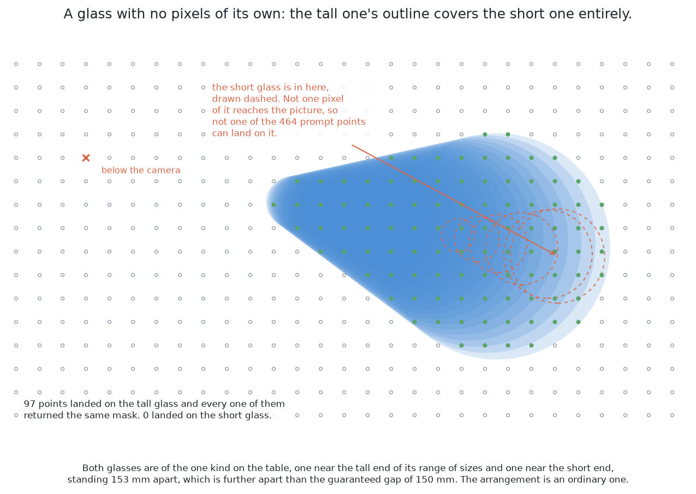
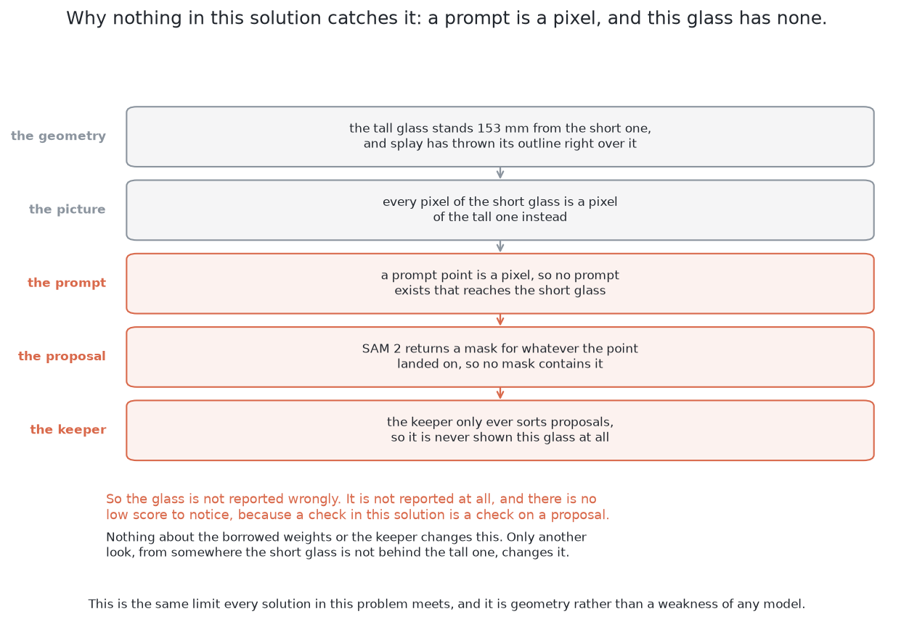

# A worked example

This page follows this solution through one real picture, with the numbers the
code prints, and then through the case this book keeps returning to, a glass
that is completely hidden, because a worked example that shows only the easy
case teaches the wrong lesson.

## Contents

1. [When the glasses are completely hidden](#1-when-the-glasses-are-completely-hidden)
2. [What the keeper was shown, and what it answered](#2-what-the-keeper-was-shown-and-what-it-answered)

## 1. When the glasses are completely hidden

A glass can be covered completely, and then it contributes no pixel to any
picture. [What is asked for](../02_the-problem/01_what-is-asked-for.md) gives
the geometry and says how close two glasses have to stand for it, and [looking
again at what was
hidden](../02_the-problem/02_looking-again-at-what-was-hidden.md) is the shared
answer: work out from arithmetic where a glass could have been standing unseen,
and go and look there. **No method that reads pictures can do better**, because
the arrangement with the hidden glass and the same arrangement with it removed
produce the same picture, pixel for pixel. What follows is only what is this
solution's own.

**The keeper is never consulted**, which is worth following because it closes
the escape route this solution seems to offer. The borrowed model grows a mask
from the picture's own content at the place the prompt points at, so a prompt
anywhere over the hidden glass lands on the covering glass and returns the
covering glass — and that answer is correct. Prompting harder does not help,
because **a prompt selects and does not add information**: there is no point,
no box and no rough mask that makes a model return a glass which cast no
pixels. With no proposal for the hidden glass, the keeper's three answers are
never asked for, and every check here is a check on a proposal.

The first picture is the arrangement itself, seen from above. The short glass
stands entirely inside the tall one's outline, so not one of the 464 prompt
points can land on it.



The second picture follows that geometry through the solution, one step at a
time, to show that there is no stage at which anything could have noticed.



One temptation is worth naming, because this solution invites it. A foundation
model's strength is that it generalises to objects it never saw, and it is easy
to hope that covers this. It does not. The difficulty is not an unfamiliar
object but **an absent one**, and generalisation handles evidence of a new
kind, while here there is no evidence of any kind.

## 2. What the keeper was shown, and what it answered

`show_keeper.py` prints, for every proposal in one real picture, the eight
measurements the keeper was given, the three calibrated chances it answered
with, what the arithmetic after it then did, and what the simulator says the
proposal really was. What follows is its output on held-out arrangement 10000,
the first of the survey's three stations. Five straight glasses stand on the
table, the grid lays 972 prompt points over the picture, and six proposals
survive the cleanup. Here are the first two.

```
proposal 1: 63070 pixels at (0.434, -0.347) m, 585 mm wide
          12.002  how wide the circle fitted to it is, against the range this kind allows
           0.357  how round it is: its area against the area its outline could enclose
           0.000  how far its surface stands above the table, from the depth reading
           0.047  how far it sits from the point directly below the camera
         813.000  how many prompt points returned this same mask
           0.245  how much of its outline is a step in depth rather than a smooth run
      165557.845  its area on the table, in square millimetres
           0.000  whether another proposal contains it, or it contains one
              ->  not a glass, from not a glass 0.73, one glass 0.16, more than one glass 0.11
              so  dropped
       the truth  not a glass

proposal 2: 4270 pixels at (0.574, -0.396) m, 67 mm wide
           0.484  how wide the circle fitted to it is, against the range this kind allows
           0.886  how round it is: its area against the area its outline could enclose
           0.164  how far its surface stands above the table, from the depth reading
           0.103  how far it sits from the point directly below the camera
          59.000  how many prompt points returned this same mask
           1.000  how much of its outline is a step in depth rather than a smooth run
        3708.171  its area on the table, in square millimetres
           0.000  whether another proposal contains it, or it contains one
              ->  keep, from not a glass 0.01, one glass 0.85, more than one glass 0.14
              so  reported as a glass
       the truth  one glass
```

**The first proposal is the table**, and every one of the eight numbers says so.
A straight glass of this kind is between 45 and 90 mm across, and the first
number is where the measured width falls in that range: nought would be the
narrowest glass and one the widest, so 12.002 means a circle of 585 mm, about
twelve glasses wide. It lies at the table's own height, to the nearest
millimetre. It is barely round, because a patch of table with glasses standing
out of it is full of bites. It covers 165,557 square millimetres of table, which
is four fifths of everything the picture holds. And 813 of the grid's 972 points
returned it, which is what a plain grid over a mostly empty table does. The
keeper gave it 0.73 for *not a glass*, which is under the lower threshold, so it
was dropped.

**The second proposal is one glass**, and the contrast is the point. Its width
is just under half way up the kind's range, 67 mm. It is 0.886 round, which is
close to a filled disc. Its surface stands 164 mm above the table. Every pixel
of its outline is a step in depth rather than a smooth run, which is what the
edge of a thing standing on a table looks like. It covers 3,708 square
millimetres. The keeper gave it 0.85 for *one glass*, above the upper threshold,
so it went to the width check, passed it, and was reported.

The last line of each block is what the simulator says the proposal really was,
and on both of these the keeper agreed with it. That line is there so that a
disagreement would be printed rather than hidden, which is the point of the
tool: the explanation is the whole of the deciding, eight named numbers and
three chances and an answer, and a person who disagrees can point at the number
that was wrong. No other solution in this book offers that.

The rest of the chain does not appear in a printout of one station, so it is
worth stating in words. A proposal the keeper answers "more than one glass" is
not put to the width check at all; it is prompted again with a grid laid only
inside itself, and the regions that come back are each put to the same checks
every report passes. A proposal that lands between the two thresholds is handed
over as a reason to take another picture, and that is the common outcome: over
the five blocks of held-out spaced arrangements, 634 proposals landed in that
band, against 85 glasses missed altogether. Where two reports land at one place
on the table, only the surer of them survives, which is what stops a mouth being
counted as a second glass above its own.

**What it costs.** Running the borrowed model is the whole of the cost to within
a rounding error: the picture encoder runs once per picture, every prompt after
it is cheap, and what the keeper adds is too small to see beside them. On this
machine's integrated graphics one picture took about eight seconds, which is a
survey of three stations in half a minute, and still far less than one movement
of the arm.

← [The code](03_the-code.md) · [What it needs](05_what-it-needs.md) →
