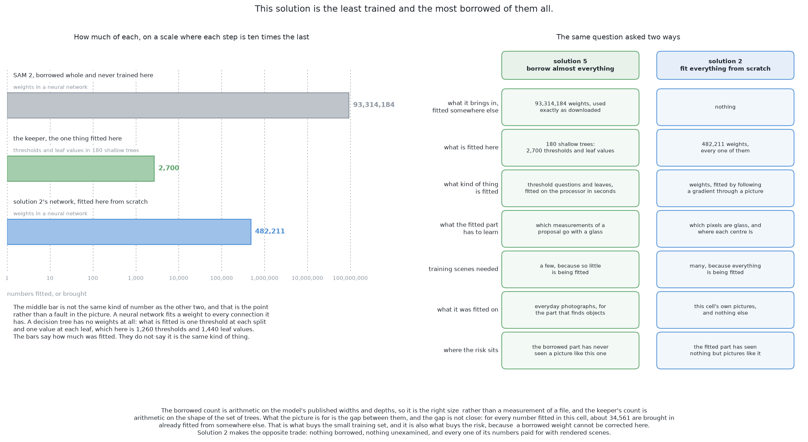

# SAM 2 with a keeper — how it compares

This page is the judgement on this solution. It says where the solution is
strong and where it breaks, names the general ideas it is built from so that
you can read about them outside this book, and places it beside the other five.
By the end you will know when this is the solution to reach for, and when it is
the wrong one.

## Contents

1. [Where it is strong and where it breaks](#1-where-it-is-strong-and-where-it-breaks)
2. [The general ideas behind this](#2-the-general-ideas-behind-this)
3. [Where it sits among the other five](#3-where-it-sits-among-the-other-five)

## 1. Where it is strong and where it breaks

**Almost nothing is fitted here, and what is fitted is small, fast and
inspectable.** Everything that finds objects is borrowed whole, and the borrowed
part cannot fall out of step with this cell because it never knew anything about
it. The keeper fits in seconds on a processor, its inputs are a short list of
named measurements, and printing those beside its answer is an explanation a
person can read. No other solution in this set has that property.

**It needs the least data of the four that fit anything**, because a model
learning from a short table of measurements needs a small fraction of the
arrangements a model learning from pictures does.

**It splits the job along the line that transfers.** Shapes are shapes
everywhere, so the proposing half is borrowed with confidence; what counts as a
cup is somebody else's judgement fitted to somebody else's pictures, so the
naming half is replaced. That is the opposite trade from solution 3, and it is
the clearest reason to prefer this solution to that one.

**It notices things nobody described**, because the grid of prompts proposes
every region in the scene, so a spoon left on the table arrives as a proposal
and is answered "not a glass" rather than passed over in silence. Every other
solution in this set is blind to whatever falls outside the one class it knows.

**Its doubt is cheap and explicit.** Three answers rather than two, two
thresholds rather than one, a width check after the keeper and one report per
place on the table: each of those turns a wrong answer into a doubtful report
rather than into a wrong glass, which is what this project asks for.

Against those, the weaknesses are not small.

**The domain gap is the largest risk and it cannot be closed from inside.** The
weights were fitted on photographs and they are being shown depth dressed up as
a grey picture, the two stemmed kinds are where a shaded silhouette offers
least, and the only levers available are the shading and the grid, because
nothing here is trained. Where those levers are not enough, the answer is
solution 4 or solution 6.

**It cannot be taught this cell's hard cases.** Pairs standing closer than the
cell's rule allows, pairs actually touching, a glass half hidden behind another:
all of those can go into a training set for solutions 2, 4 and 6, and none of
them can be communicated to the borrowed model at all.

**Every part of it works by finding regions and the boundaries between them**,
so it inherits what every boundary method inherits: where the evidence holds no
boundary, nothing finds one. Two glasses that run together with no seam anywhere
along the join are proposed as one region, for the same reason that a rule
following connected pixels would join them.

**It depends on depth twice over.** The keeper's best inputs — the footprint
width and the height above the table — come from depth readings, and so does the
picture itself, because the picture *is* shaded depth. So on the day the glasses
become real transparent glass and the depth camera stops returning anything
through them, this solution has no input at all, not even a picture.

**It is blind to a glass hidden completely**, for the reasons worked out above,
and that is a fact about the input rather than about the model.

## 2. The general ideas behind this

Nothing here is new. It is a foundation model used zero-shot, a grid of prompts,
a standard cleanup, a small classifier on top and a calibration step, and each
one has a literature and a set of cases where it is the right answer.

### Foundation models — one very expensive fit, reused many times

A very large model is fitted once on a very broad collection of data and then
used, unchanged or lightly adapted, for many tasks it was not fitted for. The
term and the argument are set out by Bommasani and colleagues, 2021
([arXiv:2108.07258](https://arxiv.org/abs/2108.07258)); the general mechanism is
[transfer learning](https://en.wikipedia.org/wiki/Transfer_learning).

It is normally the right tool when the fit is far too expensive to repeat, when
your own labels are scarce, and when your task is one of many similar ones. It
is normally the wrong tool when the task is narrow, the labels are free, and the
borrowed model's world differs from yours — which is exactly the argument
solution 2 makes for fitting a small network here from nothing.

### Promptable segmentation — Segment Anything

The model takes a picture and a prompt — a point, a box or a rough mask — and
returns a mask, with several masks and a quality estimate for each when the
prompt is ambiguous. It is class-agnostic, so it outlines without naming.
Kirillov and colleagues, 2023
([arXiv:2304.02643](https://arxiv.org/abs/2304.02643)) introduced it, and the
second generation extends the same idea to video by carrying a memory between
frames (Ravi and colleagues, 2024,
[arXiv:2408.00714](https://arxiv.org/abs/2408.00714)). The video memory is not
used here, because this problem is answered one picture at a time, but the
second generation's stronger picture encoder is the reason to prefer it.

It is normally the right tool when you need the outline of something you cannot
name in advance, when a person is choosing among the proposals, or as the first
stage of something that classifies. It is normally the wrong tool when you need
a decision rather than an outline, because it names nothing; when objects are
defined by something other than their appearance boundaries; and when the input
is not a photograph, which is the risk this document gives a whole section to.

### Open-vocabulary segmentation — a phrase instead of a point

A model takes a phrase in ordinary language and returns every instance of the
concept that phrase names, rather than choosing from a fixed list of categories.
The idea that a phrase and a picture can be matched in one space became
mainstream with CLIP (Radford and colleagues, 2021,
[arXiv:2103.00020](https://arxiv.org/abs/2103.00020)), and the segmentation
models built on it are the second rung of this solution.

It is normally the right tool when the thing you want is easy to say and hard to
write a rule for, and when nobody needs to audit the decision. It is normally
the wrong tool when the decision has to be explainable, because the judgement
lives inside weights nobody can inspect, and when the concept you mean is
narrower than the phrase you have, since you cannot tell the model which of
several readings you meant.

### Propose, then classify

Producing many candidate regions with a cheap general method and then deciding
about each one separately is an old structure. It is how R-CNN worked (Girshick
and colleagues, 2013, [arXiv:1311.2524](https://arxiv.org/abs/1311.2524)), with
selective search (Uijlings and colleagues, *International Journal of Computer
Vision*, 2013) as the proposer. This solution is that structure with a far
better proposer and a far smaller decider.

It is normally the right tool when missing an object at the first stage is much
worse than proposing too many, because a later stage can always reject. It is
normally the wrong tool when the proposer and the decider disagree about what
counts as one object, which is this document's "more than one glass".

### Zero-shot transfer — using a model on a task it was never fitted for

A model is applied to a task, or to data, it was not fitted on, with no further
fitting. The general notion is [zero-shot
learning](https://en.wikipedia.org/wiki/Zero-shot_learning).

It is normally the right tool when you have no labels at all, and as the first
thing to try before anything is fitted, because it costs a download. It is
normally the wrong tool when you do have labels and the task is narrow, because
fine-tuning then wins nearly always, which is the argument solutions 4 and 6
make against this one.

### A small head on frozen features

Freeze a large borrowed model, take what it produces, and fit something small on
top of it. This was shown to work early and well (Donahue and colleagues, 2013,
[arXiv:1310.1531](https://arxiv.org/abs/1310.1531); Razavian and colleagues,
2014, [arXiv:1403.6382](https://arxiv.org/abs/1403.6382)), and it is the
standard first thing to try with any borrowed model. The keeper is this pattern
with one difference: it is shown measurements computed from each proposal rather
than the model's own internal numbers, because measurements on the table mean
the same thing from every viewpoint and can be read by a person.

It is normally the right tool when data is small and the borrowed features
already contain what the task needs. It is normally the wrong tool when they do
not, because no small head recovers a distinction the frozen part threw away,
and at that point the weights themselves have to move.

### Gradient-boosted decision trees

Many weak trees are fitted one after another, each to the errors of the ones
before it, and added up (Friedman, *Greedy Function Approximation: A Gradient
Boosting Machine*, Annals of Statistics, 2001).

It is normally the right tool for a short table of numbers of mixed kinds with a
category to predict, which is exactly the keeper's job, and it needs no
rescaling of the inputs. It is normally the wrong tool for raw pixels, sound or
text, where a network that can learn its own features wins easily.

### Calibration — making a score mean what it says

A model's output is turned into an honest probability by fitting a small
correction on data the model was not fitted on, either a shape with two
parameters (Platt, 1999) or a monotone staircase ([isotonic
regression](https://en.wikipedia.org/wiki/Isotonic_regression), Zadrozny and
Elkan, 2002). Boosted trees are a standard example of a model that needs it,
because boosting pushes scores towards the ends of the range.

It is normally the right tool whenever a threshold or a cost is going to be
applied to a score, which is the keeper's case exactly. It is normally
unnecessary when only the ordering is used, because a correction that never
decreases cannot change an ordering, and it is not a repair for a model that is
simply wrong: a calibrated bad model is honestly unsure rather than secretly
unsure.

### The domain gap, and sim-to-real

A model carries the habits of the collection it was fitted on, argued memorably
by Torralba and Efros, *Unbiased Look at Dataset Bias*, CVPR 2011; the general
problem is [domain adaptation](https://en.wikipedia.org/wiki/Domain_adaptation).
There are three usual repairs: make the synthetic pictures look more like real
ones, make the model insensitive to the difference by varying everything that is
not the task (domain randomisation, Tobin and colleagues, 2017,
[arXiv:1703.06907](https://arxiv.org/abs/1703.06907)), or translate one
appearance into the other with a fitted model (Zhu and colleagues, 2017,
[arXiv:1703.10593](https://arxiv.org/abs/1703.10593)).

Two things are unusual about the gap in this solution. It runs **the opposite
way** from the usual sim-to-real direction, because the weights come from
photographs while the pictures come from a renderer. And the standard repair is
**not available**, because randomisation happens while training and nothing here
is trained, so the only lever is the input.

Randomisation is normally the right tool when you control the training and want
robustness against an appearance you cannot predict, and appearance translation
when you have examples of both appearances and nothing simpler works. Neither is
right when the model cannot be trained at all, and then the honest options are
to change the input or to stop borrowing.

## 3. Where it sits among the other five

The comparison worth making first is against **solution 3**, because the two are
the only solutions here that fit nothing that finds objects, and they make
opposite choices about what to borrow. Solution 3 borrows a model's shapes and
its names together, so the whole answer is the borrowed model's own idea of what
a glass is. This solution borrows the shapes and replaces the names with
something fitted here and readable. That is the better half to replace, because
a boundary between one surface and the surface behind it transfers from
photographs to this cell far better than a category boundary does. The second
rung of this solution gives that advantage back, which is why the section about
it is careful rather than enthusiastic.

Against **solution 4** the comparison is about where the adaptation happens.
Solution 4 moves the borrowed weights towards this cell's pictures, which is the
honest remedy for the domain gap and the only remedy this solution does not
have. What it costs is a training run that has to be repeated whenever the cell
changes, and a weights file that is a second copy of the cell. This solution has
no such file and therefore nothing that can go stale, and it pays for that with
a worse outline wherever the shading serves the kind badly.

Against **solutions 2 and 6** the two sit at opposite ends of one axis. Those
borrow nothing and fit everything; this borrows everything and fits almost
nothing. Their weights are produced here and are a second copy of this cell,
which has to be kept in step with it; this solution's weights are large, owned
by somebody else, and know nothing about this cell to be out of step with. They
cost hours of rendering and fitting; this costs a download and minutes. And the
honest half of that comparison is that they can be taught this cell's hard cases
and this one cannot.

Against **solution 1** the comparison is the least flattering, and it should be
stated plainly. Solution 1 is a page of arithmetic: no training set, no weights,
a cost in run time too small to be worth naming beside a pass of a picture
encoder, and its failures explained by printing one number of its own. On any
day the depth readings work it is the simpler tool, and this solution does not
survive the loss of depth either, since it needs depth for the keeper's inputs
*and* to make the picture at all. So this is not the solution that survives real
glassware. It is the solution that survives having almost no training data,
which is a different and narrower virtue.

What this solution is genuinely for is to find out how far borrowed weights get
in this cell with almost nothing fitted behind them, and to find out at what
point an explainable decision is worth more than a shorter program. The bench
answers the first question by running it beside the other five on the same
arrangements. The second question is the one the two rungs of this solution ask
of each other, and it is a judgement rather than a measurement.

← [SAM 2 with a keeper — what it needs](05_what-it-needs.md) · [RF-DETR-Seg, fine-tuned here — what it is](../10_a-transformer-segmenter-fine-tuned/01_what-it-is.md) →
