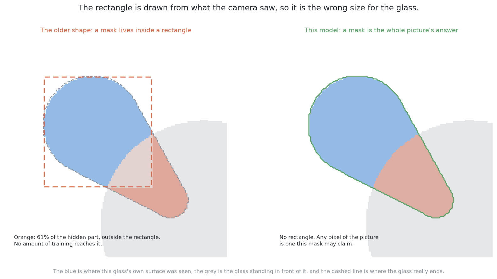
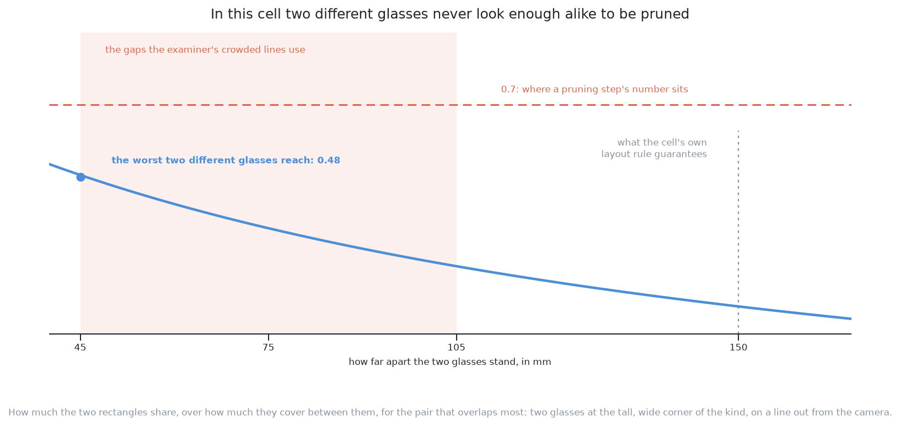
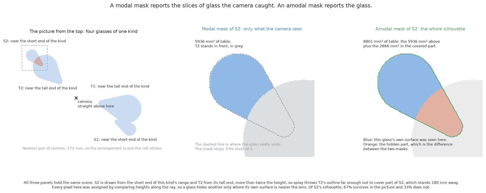

# How it works

This page explains what happens inside this solution, part by part. It follows
[the code](02_the-code.md), and explains what each part of that code is doing.

## Contents

1. [What a transformer segmenter does differently](#1-what-a-transformer-segmenter-does-differently)
2. [Why that matters for this problem](#2-why-that-matters-for-this-problem)
3. [One class](#3-one-class)
4. [Set prediction](#4-set-prediction)
5. [Fine-tuning this model here](#5-fine-tuning-this-model-here)
6. [A second way — training against the whole silhouette](#6-a-second-way--training-against-the-whole-silhouette)

## 1. What a transformer segmenter does differently

Everything above says what is wanted. This section says how this model's shape
differs from the older shape, because the difference is the reason the rest of
the document is possible.

**The older shape is propose, then refine.** A detector of that kind first looks
over the picture and proposes rectangles that might hold an object, with no
claim about what the object is. It then takes each proposed rectangle on its
own, decides what is inside it, tightens the rectangle round it, and paints a
mask of the object's pixels **inside that rectangle only**. The mask is produced
on a small grid covering the rectangle and then stretched to the rectangle's
size, so it physically cannot reach past the rectangle's edge. The list of
proposals has no fixed length: it starts long, it is cut down, and the cutting
down is a step of its own.

**This model's shape is a fixed set of slots.** It carries a fixed number of
**queries**. A query is not a rectangle and not a region; it is a small list of
numbers that the model carries along and updates as it reads the picture, and
its job is to ask one question over the whole picture: *is there an object here,
and which pixels are it?* The number of queries is decided before training and
never changes, and it is chosen to be comfortably larger than the number of
objects any picture is expected to hold.

The programming comparison is exact enough to be worth using. The older shape is
a list that grows: candidates are appended as they are found, and the list is
then pruned down to the answers. This shape is a **fixed-size array of optional
values**, declared once. Every slot is either filled in with one object or left
empty, the array is the same length for every picture, and nothing is appended
and nothing is removed. A picture with two glasses and a picture with six
glasses produce arrays of the same length, differing only in how many slots are
filled.

The masks follow from that. Each filled slot's query is turned into a short list
of numbers describing the object it found, and separately the model produces a
description of every pixel in the picture. The mask for that object is then
"which pixels of the whole picture match this query's description", computed
pixel by pixel across the whole frame. So a mask is a statement about the entire
picture from the start, and **there is no rectangle for a mask to escape**, for
the simple reason that the mask was never drawn inside one. The model does also
report a rectangle round each object, because a rectangle is a convenient thing
to have, but the rectangle is a result of the answer rather than a container the
answer was built in.

## 2. Why that matters for this problem

That difference matters here for two reasons, one immediate and one that this
solution's second way depends on entirely.

The immediate reason is that two glasses whose outlines join are two different
slots from the beginning. The queries work over the whole picture at once, so
nothing ever considered the joined region as one thing, and nothing has to
notice a seam or decide where to cut it. Two masks come out, and they are
allowed to overlap, because each one says "these pixels are part of me" about a
different object rather than putting one label on each pixel.

The reason that matters more is about room to grow. A glass partly covered by
the glass in front of it has evidence in the picture only on one side, so the
smallest rectangle round the pixels the camera saw of it is smaller than the
glass really is. In the older shape, that rectangle is the frame the mask is
painted in, so a mask that should cover the whole glass is clipped at an edge
the evidence drew. The picture below measures how much that costs on one glass
of this cell: of the part of it nothing in the picture shows, 61% falls outside
the rectangle its visible pixels draw, so a mask painted in that rectangle could
reach at most the other 39% however it was trained.

Here there is no such edge. A mask may claim any pixel in the picture it likes,
so asking the model for the whole shape of a glass is a request the architecture
can express rather than one it has to be forced into. That request is [the
second way](#6-a-second-way--training-against-the-whole-silhouette), and it is
the reason this architecture was chosen for this place in the set.

## 3. One class

Before the training can be described, one small change to the model has to be
stated, because it is the same change [the same YOLO fine-tuned
here](../08_the-same-model-fine-tuned/01_what-it-is.md) makes and it is easy to overstate.

A borrowed detector arrives knowing a general category list: many kinds of
everyday object, each with its own name. Here that list is replaced by a single
entry, "glass". So each query's class answer is a choice between two things
only, "glass" and "nothing", and the model is no longer being asked what sort of
object it has found. It is being asked only whether it has found one and which
pixels it is.

Two things follow, and they pull in opposite directions. In this solution's
favour, the question is easier: there is no chance of calling a glass a vase,
and the general category list was a description of a world this cell does not
contain anyway. Against it, the class answer stops being useful information. A
model with a category list can be read as saying "I am sure this is a glass
rather than a bowl", while here a high score means only "I am sure something is
here", so the score cannot be read as agreement about the kind. That is no loss
in this problem, because the kind on the table is already known, but it would be
a loss in the harder job where several kinds of glass stand on the table at once
and naming the kind is the question.

One thing does not follow. Cutting the class list down does not make the model
smaller or the training shorter in any important way, because almost all of the
weights are in the part that reads the picture and that part does not know what
the class list is.

## 4. Set prediction

With the slots and the single class in place, the next question is how the
training gets one answer per glass instead of several, and this is where this
family of models differs most sharply from the older one.

**Set prediction** means that the model's whole output is treated as one set of
answers to be compared against the set of real objects, rather than as a pile of
candidates to be sorted out afterwards. At each training step, the model's
filled slots are matched to the real glasses in the picture **one to one**: each
real glass is assigned exactly one query, each query gets at most one real
glass, and the pairing chosen is the one that fits best overall. Every query
left over is told that the right answer for it was "nothing".

The consequence is the part worth remembering. A query that reports a glass that
another query has already been matched to is not rewarded for being nearly
right; it is told that its answer should have been "nothing". So the duplicate
answers are trained out of the model rather than removed from its output. The
model learns, over the whole training set, that the slots must divide the
objects between themselves, and a picture with four glasses comes back with four
filled slots because that is what the training rewarded.

Compare that with the older shape, where several proposals land on one object
because several reference rectangles at neighbouring positions all really do
contain most of it. All of them score highly, so the output holds a cluster of
overlapping claims about one object, and a separate arithmetic step has to
reduce the cluster to one answer: sort the claims by score, keep the best,
discard every claim overlapping it by more than a chosen amount, and repeat.
That step is called non-maximum suppression, and it has one setting and one
assumption. The setting is how much overlap counts as duplication. The
assumption is that heavy overlap means duplication.

It is worth being exact about how much trouble that assumption is here, because
the obvious fear turns out not to be the real cost. Splay pushes one glass's
stretched outline across another's, so two genuinely different glasses really do
overlap in this cell. They do not overlap enough to be pruned. Taking the pair
that overlaps most — two glasses at the tall, wide corner of the kind, standing
on a line out from the camera — and standing them as close as the examiner's
crowded arrangements ever stand them, their two rectangles share 0.48 of what
they cover between them, against the 0.7 the fine-tuned YOLO's pruning step
uses.

So the setting is not currently throwing glasses away. What it is instead is a
number somebody had to pick with that geometry in mind, and would have to pick
again if the camera moved, the survey height changed, or a taller kind came to
the table.
Set prediction removes the setting and the assumption together. There is no
overlap amount to choose, so there is one fewer number to justify against the
geometry of this cell, and two heavily overlapping objects are never in
competition, because each occupies its own slot.

The cost of set prediction is also real and worth naming. Matching the slots to
the objects one to one is a decision the training step has to make before it can
score anything, and which query ends up responsible for which glass can change
from one step to the next early in training. Models of this family are therefore
known to need patience in training, and the published work on them is largely
about making that matching settle faster.

## 5. Fine-tuning this model here

The architecture is settled, so this section is about where its numbers come
from, because that is the other half of the design and it decides whether the
model is reasonable to build at all.

**Training** a network means showing it an example, comparing what it produced
against the answer wanted, and nudging every weight in the direction that would
have helped. **Training from a random start** means every weight begins as
noise, so the nudges have to build the whole model from nothing, including the
parts that merely find edges. **Fine-tuning** means the weights begin somewhere
useful, so the nudges have far less to do. This model arrives fitted to a large
collection of ordinary labelled pictures, and almost all of its weights are in
the part that reads a picture rather than in the queries on top, so what is
borrowed is mostly a general-purpose answer to "what is in this part of this
picture".

Why that needs less data is best said in terms of what the data has to pay for.
Every weight is a number the training data has to determine, and a weight the
data cannot pin down ends up fitted to accidents of the particular examples
given, which is called **overfitting** and shows as a model scoring well on its
training pictures and badly on new ones. The amount of data needed therefore
grows with the number of weights determined from nothing, and fine-tuning
changes that sum: most of the weights already sit at values that work and only
have to be adjusted. This is why a few hundred pictures is a sensible training
set for a model of this size, and a few hundred pictures is what this cell can
produce without difficulty.

The labels are where this cell is unusually fortunate. In the ordinary case a
person draws every mask by hand, which is why labelled data is the scarce
resource in this field. Here nothing is drawn. The examiner renders, beside every
picture, an image saying which glass owns each pixel, described in [the test
examiner](../03_the-examiner/01_the-examiner.md), so one glass's mask is the set of pixels carrying its
identity and the class is always "glass". Every label is a selection over an
array the examiner produced anyway. The examiner hands those labels out only for the
training half of its arrangements and marks on the other half, so no model is
ever tested on an arrangement it learned from.

There is one honest warning about the pictures themselves. The cell's renderer
produces no colour: it produces a depth reading for every pixel, and the picture
the model is given is that depth shaded into grey. The borrowed weights were
fitted to ordinary pictures, which have colour varying between their channels,
edges from paint and print and shadow as well as from geometry, and texture
inside every surface. A shaded depth picture has none of that and all of its
edges are geometric. The name for that difference is the **domain gap**, meaning
the gap between the world a model was fitted on and the world it is asked to run
in. Fine-tuning does not remove the gap, but it does the one thing that matters
most: the grey pictures are not an unfamiliar input the model must survive at
run time, they are the input it is fitted on. So the gap is expected to cost
accuracy and training effort rather than correctness. That is reasoning about
the design and not a result.

The training arrangements themselves need one deliberate choice. The cell's own
placement rule keeps glasses a comfortable distance apart, so a training set
drawn only from that rule would never show the model a pair that was hard to
separate. The examiner therefore builds arrangements that stand glasses closer
than the rule allows, on lines running out from under the camera, and half of
every training set is drawn from those. The principle is worth remembering:
**the edge of the specification should sit somewhere in the middle of the
training set**, so that the model has met worse than it ever will. The held-out
arrangements this solution is scored on are drawn the same two ways, and the
crowded table is the one where the architecture earns its keep.

## 6. A second way — training against the whole silhouette

There is a second way to train this model, and it belongs to this solution
rather than to any of the other five, because this is the architecture whose
masks have room to hold it. The step is one sentence: **train each mask against
the glass's whole silhouette — the shape it would have if nothing stood in
front of it — instead of against only the pixels the camera can see.** A mask
of that sort is called an **amodal** mask. A sense delivers what is modally
present, so the part of a glass whose own surface the camera sees is modal;
what the perceiver has although no sense delivered it is amodal, which is the
part hidden behind another object. The amodal mask always contains the modal
one, and the difference between them is the **hidden part**.

It helps because the failure it answers is a quiet one. Put one glass partly
behind another, and a mask marking only visible pixels loses every pixel behind
the near glass's surface. What is left is a slice, cut along one side. Hand that
slice to the shared arithmetic and it reads a glass narrower than the truth, and
nothing objects, because a kind whose footprints run from 65 to 105 mm has room
for a short measurement. A slice does not look like an error; it looks like a
shorter glass. Compare that with two glasses coming back as one region, where
the width exceeds anything the kind allows, the check fires, and the region is
reported as doubtful. A loud failure is a result; a quiet one is a trap, and
[the worked example](04_a-worked-example.md#2-a-worked-example) measures how
much room the quiet one has.

The architecture suits the request because asking for the whole silhouette
changes only what the mask is scored against. Nothing about the model's shape
moves, which is worth knowing generally: **one network answers a different
question by changing its target rather than its shape.** The task is not small
even though the change is, because tracing a boundary that is not in the picture
needs the model to have learned the shape of the kind and to get the
near-and-far relation right.

One rule is absolute. A mask claiming pixels the camera never saw the glass at
must say which pixels those are, because the depth reading at such a pixel
belongs to whatever stood in front. [How a mask becomes a
record](../12_how-a-mask-becomes-a-record.md#4-why-a-mask-that-asserts-pixels-must-say-which-ones)
measures what that costs when it is got wrong, and the examiner leaves those
readings out rather than guessing values for them.

Two checks on such a model come free in a simulator. On a glass with nothing in
front of it the amodal mask must equal the modal one, so measuring what the
model adds to unobstructed glasses tests directly for a model that completes a
little everywhere. And the measure to watch during training is the **overlap
over the hidden part alone**, which the examiner can supply by subtracting one
of its own masks from the other. Overlap against the visible truth punishes the
model for working, since every pixel of a correct completion lies outside that
truth, so the best score would go to a model that ignores the amodal target
entirely: **a score that rewards doing nothing will be optimised by a model that
does nothing.**

**This way was never fitted to completion, so it claims no number.** Its
fine-tune reached four epochs of ten, with the validation score still rising,
before a machine full of other training runs stopped it. Everything in this
section is therefore a specification, and the row this solution has in the
results is the first way, trained against the pixels the camera can see.

← [The code](02_the-code.md) · [A worked example](04_a-worked-example.md) →
