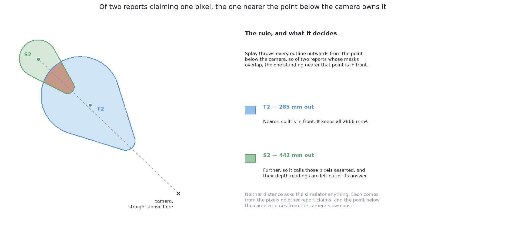

# The code

This page shows the code at the heart of this solution, and says what the
solution hands back to the rest of the cell. The second explains the first,
which is why they are on one page.

## Contents

1. [The code at the heart of it](#1-the-code-at-the-heart-of-it)
2. [The masks are what this contributes](#2-the-masks-are-what-this-contributes)
3. [How the concepts fit together](#3-how-the-concepts-fit-together)

## 1. The code at the heart of it

Two pieces of code carry this solution, and both are worth seeing before the
document explains them. The first is the **fine-tune**, which is what turns a
model fitted on everyday photographs into a finder of glasses in this room. The
second is the **split**, which separates the pixels of a mask the camera really
saw from the pixels the model only asserts, and neither way could be let near
the arm without it.

The fine-tune is two steps, in `06-rf-detr-fine-tuned/rf_detr_seg.py`. The
borrowed weights are built into a model, and the package's own training loop is
then run over the folder of pictures and labels this cell wrote for it, with the
list of classes cut down to one entry.

```python
def fresh():
    ...
    weights.borrowed()
    import rfdetr

    return getattr(rfdetr, SIZE)(device=str(device.pick()))
    ...
    model = fresh()
    model.train(
        dataset_dir=str(folder / "dataset"),
        output_dir=str(folder / "run"),
        epochs=epochs,
        batch_size=batch,
        lr=LEARNING_RATE,
        class_names=[labels.CLASS],
        tensorboard=False,
    )
```

The split is this project's own arithmetic, in the same file, and it asks the
simulator nothing. A camera looking down throws every outline outwards from the
point below it, so of two reports whose masks overlap the one standing nearer
that point is the one in front, and every pixel the two both claim belongs to
it. What comes back is, per report, the pixels of it some nearer report covers.

```python
def hidden_by_others(picture, masks: list[np.ndarray], nadir: tuple[float, float]) -> list[np.ndarray]:
    ...
    usable = [mask & np.isfinite(picture.depth) for mask in masks]
    ...
    contested = np.sum(np.stack(usable), axis=0) > 1
    away = []
    for mine in usable:
        alone = masks_to_glasses.one_glass(picture, mine & ~contested)
        away.append(np.inf if alone is None else float(np.hypot(alone.x - nadir[0], alone.y - nadir[1])))

    behind = []
    for index, mine in enumerate(usable):
        theirs = np.zeros_like(mine)
        for other, nearer in enumerate(usable):
            if other != index and away[other] < away[index]:
                theirs |= nearer
        behind.append(mine & contested & theirs)
    return behind
```



The two blocks are the two halves of what this solution costs. The first is the
borrowed work: the `rfdetr` package with PyTorch under it, and one `train` call
doing everything this document means by fine-tuning. The second is the part
nobody can borrow, and what it returns is handed to
`masks_to_glasses.one_glass` as pixels whose depth readings are to be left out
of the measurement. A second, smaller set of asserted pixels is named by the
check described further down, and it is left out the same way.

The split is not only for the second way. On the crowded arrangements, where the
model is trained against the pixels the camera can see, 876 of 1313 reports
across the five scored blocks still had an asserted part named and left out, and
the least visible of them was 11% observed. A predicted mask bleeds over the
glass in front of it whether or not it was trained to, and the reading under the
bleed belongs to that other glass either way.

## 2. The masks are what this contributes

Everything above is about producing masks, and this section says plainly where
this solution stops, because it is the same place all six stop and it is what
makes the six comparable at all.

Turning a mask into a place on the table and a rough width is **the examiner's job,
not this solution's**. [How a mask becomes a record](../12_how-a-mask-becomes-a-record.md) sets that
step out in full. The same function does it for every one of the six.

Two things follow and neither is re-derived here. **A difference in the score
belongs to the mask**, because nothing else is allowed to differ, so no solution
can win by measuring more cleverly and none can lose by measuring worse. And
**no model in this book produces a pose.** Models produce masks. The place
comes from the depth readings and the camera's own pose, by arithmetic, and a
glass standing upright on a flat table has no orientation left to find.

The one thing this solution owes that step, beyond the masks themselves, is the
split described in [the
trap](../12_how-a-mask-becomes-a-record.md#4-why-a-mask-that-asserts-pixels-must-say-which-ones): when a mask
claims pixels the camera never saw the glass at, it must say which ones. That
page measures what skipping it costs — with exact masks and no model anywhere, a
partly hidden glass lands 12.2 mm from the truth when the asserted pixels are
named and 42.7 mm when they are fed in.

## 3. How the concepts fit together

Everything above is one chain, and it is worth reading in order, because each
stage inherits what the one before it produced.

A **grey picture**, shaded from the depth reading at every pixel, goes in. The
body of the model reads it and produces a description of every part of it, using
weights that arrived fitted to a large collection of ordinary pictures and were
then nudged on this cell's own pictures. A fixed number of **queries** read that
description, and each one returns either "nothing" or one object: a class, which
here is only ever "glass", a rectangle, and a **mask** computed pixel by pixel
over the whole picture rather than inside the rectangle. Because the training
matched queries to real glasses **one to one**, the filled slots do not
duplicate each other, so no step afterwards has to reduce overlapping claims to
one answer.

On the second way the mask covers the glass's **whole silhouette** rather than
only what the camera saw. Either way it is then split into its **observed
part**, where no nearer report claims the pixel, and its **asserted part**,
which is the rest. The observed pixels go to the shared
arithmetic and become points on the table. The asserted pixels are named and
excluded, because the reading under each of them belongs to whatever stood in
front. Out of that come a **place** and a **rough width**, both measurements of
the part that was seen, and the **visible fraction**, which is the observed
share of a report's own mask. Every report carries it, because every consumer
further down has its own tolerance for how much of an answer was asserted and
none of them can apply it once the two parts have been merged.

Then the two checks, each of which can only refuse. The width must lie inside
the range the kind allows, unless the mask it was measured from reaches the edge
of the frame, where the width belongs to the part of the glass the picture held.
And no part of the mask may be asserted over a patch the camera plainly saw
something else at. A glass passing both is reported with its place, its width
and its visible fraction; a glass failing either is reported as doubtful, with
the check it failed. Last, where two surviving reports land at one place on the
table only the surer of them keeps the place, which is the shared rule every
solution in this book ends with.

Three things are worth holding on to. The **shape of the output** is what
answers the hardest part of the problem, because a fixed set of slots filled one
to one holds separate objects without anything having to divide a joined region.
The **absence of a rectangle round each mask** is what makes the second way a
change of target rather than a change of architecture. And the **separation of
observed from asserted pixels** is what keeps either way honest, because the
arithmetic and both checks need the two kinds of pixel kept apart.

← [How it works](02_how-it-works.md) · [A worked example](04_a-worked-example.md) →
