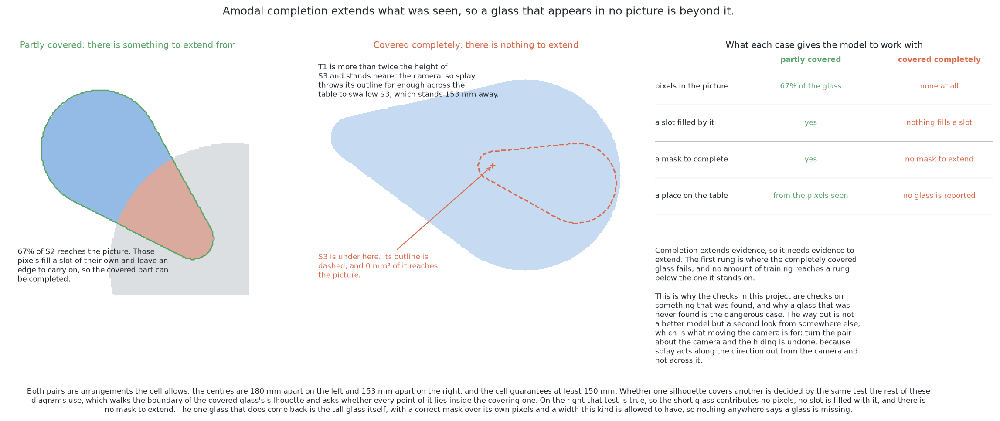

# A worked example

This page follows this solution through one arrangement of glasses with real
numbers, and then through the case this book keeps returning to, a glass that is completely hidden,
because a worked example that shows only the easy case teaches the wrong
lesson.

## Contents

1. [When the glasses are completely hidden](#1-when-the-glasses-are-completely-hidden)
2. [A worked example](#2-a-worked-example)

## 1. When the glasses are completely hidden

A glass can be covered completely, and then it contributes no pixel to any
picture. [What is asked for](../02_the-problem/01_what-is-asked-for.md) gives
the geometry and says how close two glasses have to stand for it, and [looking
again at what was
hidden](../02_the-problem/02_looking-again-at-what-was-hidden.md) is the shared
answer: work out from arithmetic where a glass could have been standing unseen,
and go and look there. **No method that reads pictures can do better**, because
the arrangement with the hidden glass and the same arrangement with it removed
produce the same picture, pixel for pixel. What follows is only what is this
solution's own.

**This solution moves the boundary without removing it**, and that is the one
thing its second way contributes here. Completion extends evidence: the model
sees a boundary that stops, sees a surface in front of where it stopped, and
continues the boundary behind that surface the way a glass of this kind would
continue. Every part of that begins with something in the picture. Take the
sliver away and there is no boundary that stops and nothing to extend, so a
model that extends nothing produces nothing. What completion does buy is that
it needs less of a glass than anything else here, so the point at which hiding
becomes complete is further out with it than without it.

A model **could** be trained to mark a glass that might be behind this one,
since the examiner can supply that label too, and it is worth saying what such
a model would be doing. It would report where glasses tend to stand in
arrangements like this one, which is a statement about the range of
arrangements rather than about this one — **inventing a scene rather than
reading a picture** — and it would mark a glass behind every tall glass,
including all the times there is nothing there.

## 2. A worked example

Everything below follows from the cell's own geometry and from the design above.
It is a walk through the design rather than a record of a run, and nothing in it
is a measurement.

**The arrangement.** Five glasses of one kind stand on the table, and the camera
looks down from the top. Three of them stand clear of each other. The other two
stand much closer together than the cell's rule allows, roughly along the line
running out from the point below the camera, with the taller one nearer that
point, so splay stretches the taller one's outline across part of the shorter
one. In the picture their two outlines join into one region with no seam along
it.

**What the first way would return.** The queries work over the whole picture,
so the two close glasses occupy two different slots, and the joined region is
never considered as one thing. Five slots come back filled, and because the
training matched slots to glasses one to one, no sixth slot reports either of
the close pair a second time and nothing has to discard a duplicate. The two
masks of the close pair overlap where the taller glass covers the shorter one,
and that is allowed, because each mask says "these pixels are part of me" about
a different glass. Nothing separated the two, and that is the point worth taking
away: there was never a joined region for anything to divide.

**What the first way would still get wrong.** The shorter glass's mask stops
where the taller one begins, so it is a slice lying all to one side. Handed to
the shared arithmetic, that slice gives a width under the truth and a place off
to one side of where the glass stands, and the width is still one this kind
allows, so nothing objects. Five glasses are reported, one of them smaller than
it is and standing where it is not.

**What the second way would return instead.** The shorter glass's mask covers
the part behind the taller one as well, so the shorter glass is a region of its
own and its visible slice is credited to it rather than absorbed into the taller
glass's region. The mask is then split: the observed part is the slice, and the
asserted part is the rest. The asserted pixels carry the taller glass's depth
readings, so they are named and the examiner leaves them out, and the place and the
width come from the slice alone. The place is good enough to send a camera to.
The width is still under the truth, and the visible fraction travelling with the
answer says so. The asserted part lies in the taller glass's own shadow, where
the camera could not see, so nothing is claimed where the camera had a clear
view, and neither prescribed check has anything to refuse.

**What the flag then buys.** Because the visible fraction is low, the reported
width plans and does not grip. The arm goes round to the side, stands back at
the measuring standoff and looks level, and from there nothing is in front of
the shorter glass, so its two masks coincide and its footprint is measured
rather than asserted. The completion decided **where to look**, and the look
from the side decides **what is true**.

**Now the case neither of them answers.** Push the shorter glass directly behind
the taller one along that line, close enough that the taller one's stretched
outline covers it completely. The picture holds no pixel of it, so no slot is
filled with it and there is no sliver to extend. Four glasses are reported where
five stand, every report correct, every width legal, every score confident, and
no check fires, because every check here is a check on something that was found.
That is the case handed to the geometry.

← [The code](03_the-code.md) · [What it needs](05_what-it-needs.md) →
