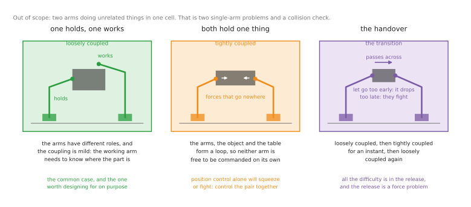
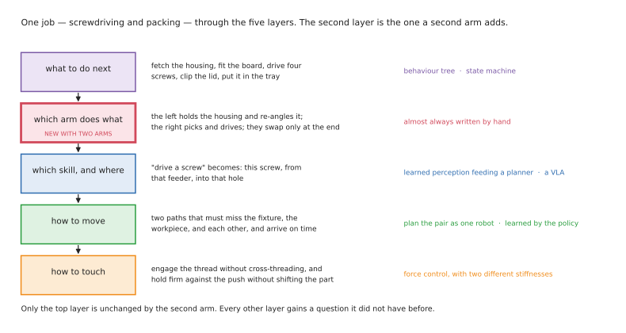

# Training two arms to work together

One arm picks things up and puts them down. Two arms **cooperating** can do the
things that actually fill a working day: hold a garment open and fold it, steady a
housing while driving a screw into it, pass a part from one hand to the other to
get a better grip, carry something too big for one gripper.

The moment the arms have to agree with each other, the question stops being "how do
I move the arm" and becomes "how do these two get one job done between them" — and
that is a genuinely different problem, with its own failure modes and its own
literature. This folder is about that problem and nothing else.

**What is in scope, stated precisely.** Coordinated two-arm work: the arms are
cooperating on one job, and what each does depends on what the other is doing. Two
arms doing unrelated things in a shared cell are **out of scope**, because that is
not a two-arm problem. It is two single-arm problems plus a collision check, and
the standard survey of the field puts it bluntly — uncoordinated two-arm work has
"no intrinsic difference to single-arm systems". Solve it by running
[the one-arm methods](../07_one-arm-training/01_overview.md) twice and keeping the arms
apart.

**Read the one-arm documents first**, including
[what is changing and why](../07_one-arm-training/05_what-is-changing.md) for the
direction the whole field is moving. Almost every method here is a single-arm
method with a coordination problem bolted on, and the coordination problem is only
legible once you know the method. This folder does not repeat them; it says what
changes.

## The four documents

**[When two arms are really useful](02_when-two-arms-help.md).** Whether your task
needs a second arm at all — the fixture comparison, how rare dual-arm robots
actually are, the counter-evidence, the task catalogue, and a checklist. Read this
first. It may well send you back to one arm, which is a good outcome.

**This document — the map.** How two arms can be coupled, the layer a second arm
adds, which method suits which coordinated task, and what is realistic to build.

**[Programmed methods](03_programmed-methods.md).** What changes in teaching, offline
programming, behaviour trees, motion planning and feedback control when two arms
must cooperate. This is where the hardest and least-discussed material is, because
coordinated control is a solved problem in theory and a poorly-tooled one in
practice.

**[Learned methods](04_learned-methods.md).** What changes in imitation learning,
reinforcement learning and pretrained policies. This is where two-arm work is
actually happening, and where the published numbers are.

## Contents

1. [The two ways two arms can be coupled](#1-the-two-ways-two-arms-can-be-coupled)
2. [The handover, which is both](#2-the-handover-which-is-both)
3. [The same ideas in the words the literature uses](#3-the-same-ideas-in-the-words-the-literature-uses)
4. [The layer a second arm adds](#4-the-layer-a-second-arm-adds)
5. [Which method for which coordinated task](#5-which-method-for-which-coordinated-task)
6. [What coordination costs you, method by method](#6-what-coordination-costs-you-method-by-method)
7. [What real coordinated systems actually do](#7-what-real-coordinated-systems-actually-do)
8. [What you can realistically build in the next year](#8-what-you-can-realistically-build-in-the-next-year)

---

## 1. The two ways two arms can be coupled

How tightly the arms are tied to each other is the single most important design
decision in this folder. It determines whether you can treat them as two ordinary
robots that must agree occasionally, or whether you need software that thinks of
them as one machine. Everything else follows from it.

### Loosely coupled: one holds, one works

One arm grips the workpiece and holds it steady, or presents it at a convenient
angle; the other does the fine work on it. The two arms have different roles, and
the roles are not interchangeable — the holding arm needs to be stiff and stay put,
the working arm needs to be precise and compliant.

**This is the most common useful pattern**, it covers most of the tasks in the
[task catalogue](02_when-two-arms-help.md#5-the-tasks-two-arms-are-asked-to-do), and
it mirrors what people do without thinking: your off hand holds the jar while your
other hand turns the lid.

The coupling is real but mild. The working arm needs to know where the holding arm
put things, and the holding arm must not give way when pushed — but the two can
still be controlled largely separately, which is why almost everything that works
today is built this way.

That separation is worth designing for deliberately rather than stumbling into.
One research system built exactly on this idea — one arm stabilises the object, a
learned component decides when it needs re-stabilising, and the other arm acts —
reached **77% across four tasks from twenty demonstrations**, well above an
unstructured policy given the same data. Telling the system which arm holds is
information you have for free, and it is worth roughly as much as a lot of extra
data.

### Tightly coupled: both hold one thing

Both grippers grip the same rigid object, and now the arms, the object and the
table form a closed loop. **This is the case that breaks ordinary software**, and
it is worth being precise about why, because the reason is not a bug anywhere.

If you command each arm to a position independently and the two commands disagree
by even a millimetre, the arms do not split the difference. They fight, squeezing
or stretching the object between them with forces that can be enormous and that no
camera will show you. The object's position is over-specified, and something has to
give — the object, the grippers, or the arms.

The arithmetic makes it unavoidable. Two six-joint arms have twelve degrees of
freedom between them; the object they hold has six. The other six dimensions do not
disappear — **they become force**. That is the *internal* or *squeeze* force: the
part of what the arms exert that produces no motion at all, only compression or
tension in the object between them. You cannot choose not to have it. You can only
choose whether you command it deliberately or discover it when something is
crushed.

Handling this properly means controlling the pair as one system, usually by
commanding the *object's* motion and the squeeze separately.
[The feedback control section](03_programmed-methods.md#5-feedback-control-and-the-closed-chain) works
through how.

### The practical advice

**Keep the coupling as loose as the task permits.** Use hold-and-work wherever the
arms can cooperate that way, and accept the closed chain only where the object
genuinely has to be carried or stretched by both — because everything from motion
planning to policy learning gets harder in that order. A surprising number of tasks
that look like they need a closed chain do not, once you are willing to let one arm
be a fixture.

## 2. The handover, which is both

A handover — an object passing from one gripper to the other — deserves its own
treatment, because it is the transition between the two cases and the one place
every two-arm system eventually goes wrong.

For most of the motion it is loosely coupled: one arm carries, the other
approaches. Then for a moment **both arms hold the object**, and you are briefly in
the closed-chain case with all of its problems. Then one lets go.

The difficulty is concentrated entirely in that instant of release. Let go too
early and the object drops; too late and the arms fight, dragging the object out of
the receiving gripper or deforming it. Doing it by position is guesswork — the two
grippers' positions are known to about a millimetre and the timing to about a
control cycle, and neither is good enough. Doing it by **watching the force fall as
the other arm takes the weight** is measurable, which is why the release is a force
problem rather than a planning problem.

It is also the single most useful thing to build first if you are learning this.
It is short, it fails visibly, the failure is instructive, and every open two-arm
benchmark includes one.

## 3. The same ideas in the words the literature uses

The plain names above are the ones this folder uses, but you will meet the formal
versions and they are worth recognising — with one caveat that comes at the end.

The [2012 dual-arm survey](https://doi.org/10.1016/j.robot.2012.07.005) that most
papers cite splits the field into **non-coordinated** manipulation, where the arms
do two different tasks — the case this folder excludes — and **coordinated**
manipulation, where they work on the same one. It then divides coordinated work
into **goal-coordinated**, where the arms contribute to the same goal without
touching each other or the same object, and **bimanual**, reserved for arms
physically interacting with the same object. So "bimanual" in that vocabulary is
narrower than "two arms": it means the closed chain. (That survey popularised the
taxonomy but did not invent it; it credits
[a 2010 paper by Surdilović and colleagues](https://doi.org/10.1109/ICHR.2010.5686273).)

The modern reference is
[Krebs and Asfour's bimanual manipulation taxonomy](https://h2t.iar.kit.edu/pdf/Krebs2022.pdf)
from 2022, which is the one to read if you read one. It separates **loosely
coupled** actions, connected only by shared waypoints in space or moments in time,
from **tightly coupled** ones, where contact creates forces that constrain both
arms together — exactly the distinction in
[section 1](#1-the-two-ways-two-arms-can-be-coupled), and the source of the names
used there.

It also gives the hold-and-work pattern its proper name, **role-differentiated
bimanual manipulation**, borrowed from a model of human handedness in which the
non-dominant hand stabilises the object and sets the frame of reference that the
dominant hand then works in. It is reassuring that the ergonomics literature
arrived at the same arrangement first.

One nuance from that work is worth keeping against
[section 4](#4-the-layer-a-second-arm-adds): in human manipulation the roles are
*not* statically assigned to a particular hand, but swap to suit each step. Robot
systems today almost always fix them, which is a simplification rather than a
principle.

A separate and often-confused distinction is **symmetric** against **asymmetric**
coordination — whether the two arms are doing the same thing to the same object, or
different things. It comes from
[a 2004 paper by Zöllner, Asfour and Dillmann](https://h2t.iar.kit.edu/pdf/Zollner2004.pdf),
which is also where the closed kinematic chain first enters the taxonomy, and it is
a **different axis** from how tightly the arms are coupled. Conflating the two is a
common error: two arms can be symmetric and loosely coupled, or asymmetric and
tightly coupled.

**One honest caveat about all of this: there is no standard here.** No ISO or IEEE
document defines a dual-arm coordination taxonomy — the international vocabulary
for robots offers only "simultaneous motion" and "robot cooperation", and reserves
"collaborative" for humans working with robots, so do not borrow that word for two
arms working together. Recent papers do not agree either: some reuse the 2012
terms, some independently reinvent "loosely and tightly coupled" without citing
anyone, some use "master–slave versus symmetric", and at least one survey explicitly
declines to propose a taxonomy at all. Treat the vocabulary above as a good map
rather than an agreed standard, and expect any paper you read to have picked its
own words.

One practical vocabulary is worth knowing because it appears in working code: the
data-generation tool DexMimicGen splits two-arm subtasks into **parallel** (each arm
runs independently), **coordination** (both arms' timing is synchronised so their
relative pose is maintained) and **sequential** (one arm waits for the other to
finish, as in a handover). Those are the same ideas again, expressed as scheduling
rules.

## 4. The layer a second arm adds

A single arm doing a real job answers four questions over and over, set out in
[the one-arm overview](../07_one-arm-training/01_overview.md#3-the-four-layers-of-an-arm-system):
what to do next, which skill and where, how to move, and how to touch. Coordinated
two-arm work adds a fifth, and it sits near the top.

**Which arm does what** — who holds, who works, and when they swap. Take a
screwdriving-and-packing job. The sequence is: fetch the housing, fit the board,
drive four screws, clip the lid, put it in the tray. The new question is that the
left arm holds the housing throughout and re-angles it between screws, the right
arm does all the picking and driving, and they swap only when the finished unit is
lifted into its box.

**Role assignment is almost always written by hand**, and in a well-designed system
it is written once and never changes: this arm holds, that arm works. Fixing the
roles in advance costs you some flexibility and buys an enormous simplification,
because each arm can then be given a single job that a single-arm method already
solves. A system that decides dynamically which arm should do the next step is more
capable and much harder to build, and outside research it is rare.

The other four layers all change too, and each method document says how. In short:
**how to move** becomes two paths that must miss each other and arrive at agreed
times; **how to touch** gains the internal force problem; **which skill and where**
gains the question of which arm can reach it. Only **what to do next** is largely
unchanged.

## 5. Which method for which coordinated task

Read a row to plan a system; read a column to see where a method earns its keep.

The columns are the same nine as in
[the one-arm grid](../07_one-arm-training/01_overview.md#5-which-method-for-which-task),
and that document explains what each one *is* and what you would install. This
section says something different and more useful here: **what actually changes for
each when the arms must cooperate, and which of those tools support two arms at
all.** The short answer is that about half of them do not, and knowing which half in
advance will save you weeks.

### The nine columns, for two coordinated arms

**Teach / offline programming.** Still how coordinated two-arm robots are
programmed in industry, and **there is no open-source equivalent whatsoever**. The
capability lives in vendor controllers — ABB's MultiMove is the one to study, with
its independent, semi-coordinated and coordinated-synchronised modes and its rule
that the number of motion instructions between synchronisation on and off must be
*identical* in both arms' programmes. Offline programming handles the loose case
through **synchronisation points** ("arm one waits here until arm two reaches
there"), which commercial tools have supported for decades and which is enough for
most hold-and-work tasks. The open industrial stack —
[Tesseract](https://github.com/tesseract-robotics/tesseract),
[Noether](https://github.com/ros-industrial/noether) — has no two-arm coordination
concept at all. Read
[the programmed methods document](03_programmed-methods.md#1-teaching-two-arms) for why
that lockstep rule tells you everything about the difficulty.

**Motion planning.** The method that changes most, and the one where the tooling
gap is sharpest. MoveIt 2's maintained
[dual-arm Panda configuration](https://github.com/moveit/moveit_resources/tree/ros2/dual_arm_panda_moveit_config)
is the reference to copy, but it defines two planning groups and plans **one at a
time** — no shipped configuration plans them as one twelve-joint robot, the default
inverse-kinematics solvers are chain solvers so a closed loop cannot be solved at
all, and there is no constraint type relating two grippers to each other.
[cuRobo](https://github.com/NVlabs/curobo) genuinely plans for two arms at once and
ships a dual-arm configuration — it is the best open answer here — though it too
cannot express a constraint *between* the grippers, and it needs an NVIDIA card. For
a real closed chain, [Drake](https://github.com/RobotLocomotion/drake) and
[Pinocchio](https://github.com/stack-of-tasks/pinocchio) are the two libraries with
genuine closed-kinematic-chain support and are worth switching to. **There is no
maintained ROS 2 dual-arm coordination package at all.**

**Force control.** The column that is never empty in the grid below, because loads
pass between the arms whatever else you use.
[ros2_control](https://github.com/ros-controls/ros2_control) and
[cartesian_controllers](https://github.com/fzi-forschungszentrum-informatik/cartesian_controllers)
give you per-arm admittance and Cartesian impedance, which is enough for the loosely
coupled case — and note it needs **two different stiffness settings at once**, stiff
for the holding arm and soft for the working arm, which is easy to get backwards.
For the closed chain you need a controller that commands the object's motion and the
squeeze separately, and **no open implementation of a cooperative two-arm controller
exists**. You write it from the papers — search for the *symmetric formulation*,
*cooperative task space*, *virtual linkage*, *augmented object* and *object impedance
control* — using Drake or Pinocchio for the model. This is the single biggest piece
of work in coordinated two-arm robotics, and it is why serious work still runs on
vendor software.

**Learned perception.** The networks are unchanged — Segment Anything,
FoundationPose and grasp proposers neither know nor care how many arms will use
their output. What the second arm adds is **the choice made with that output**:
which arm takes which grasp, whether both are reachable, whether taking this one
with the left arm leaves the right able to reach the next, and whether the resulting
pair of motions collide. That selection is ordinary code between the network and the
planner, and it is where most of the two-arm engineering in such a system lives. It
is also a good first two-arm project precisely because the hard part is code you
write rather than a model you train.

**Imitation.** The column where coordinated two-arm work actually happens, and the
best-supported one. [LeRobot](https://github.com/huggingface/lerobot) supports pairs
directly through its `bi_so_follower` robot and `bi_so_leader` teleoperator, which
compose two single arms with observations prefixed `left_` and `right_`. The
standard design is one network emitting both arms' commands — fourteen numbers per
step — though [the evidence for that being better is a tie](04_learned-methods.md#2-one-policy-or-two-and-what-the-evidence-says).
What *is* measured: the grippers' pose relative to each other must be in the input.
To practise: [gym-aloha](https://github.com/huggingface/gym-aloha) has exactly two
environments and both are coordinated;
[RoboTwin 2.0](https://github.com/RoboTwin-Platform/RoboTwin) is the most complete
open two-arm stack, with 50 dual-arm tasks and over 100,000 pre-generated
trajectories. Watch the licences:
[DexMimicGen](https://github.com/NVlabs/dexmimicgen) is research-only, and
[PerAct2](https://github.com/markusgrotz/peract_bimanual) inherits RLBench's
academic-use restriction and has been dormant since early 2025.

**Reinforcement learning in simulation.** Harder for two arms in a specific and
instructive way: the space to explore is the *product* of both arms' possibilities
rather than the sum, and the useful behaviours only pay off when both arms do the
right thing **at the same moment** — a handover earns nothing unless one arm has
arrived and the other releases on time. Random exploration essentially never
stumbles on that, so the reward is not merely sparse but sparse in two dimensions at
once. [robosuite](https://github.com/ARISE-Initiative/robosuite) has four two-arm
tasks — lift, peg-in-hole, handover, transport — and one property nothing else
offers: **you can run the same task with one two-armed robot or with two independent
single arms**, which is as close to a controlled experiment on "what does
coordination change" as exists. Use this column as a *second* stage after
demonstrations, not a first.

**Real-robot reinforcement learning.** [HIL-SERL](https://github.com/rail-berkeley/hil-serl),
inside LeRobot, is the method — but be clear that **its published results are
single-arm**. The correction rig for two arms is the same leader-arm pair you
collected with, so a person can grab whichever arm went wrong, and the failures
worth correcting are coordination failures rather than single-arm ones: the holding
arm drifted, the handover released early, the arms pulled the cloth out of each
other's grip. Treat the two-arm case as the same method with less evidence behind it
rather than as a proven recipe.

**Vision-language-action models.** Check what is **downloadable** rather than what
is supported, because for two arms they differ.
[openpi](https://github.com/Physical-Intelligence/openpi) has a configuration for the
two-armed ALOHA platform with no published checkpoint behind it;
[GR00T](https://github.com/NVIDIA/Isaac-GR00T) carries embodiment definitions for
two-armed platforms with separate left and right entries, but every released
fine-tuned checkpoint is single-arm. The exception is
[RDT](https://github.com/thu-ml/RoboticsDiffusionTransformer) and its successor
[H-RDT](https://github.com/HongzheBi/H_RDT), which were **designed bimanual first** —
RDT splits its state vector into left and right halves and tells you to write a
single arm's values into the *right-arm* portion, the opposite of everyone else. The
base models are genuinely usable for two arms; you will be fine-tuning one yourself.

**Language planner.** The interesting two-arm possibility is that the model assigns
the **roles** — deciding the left arm holds the bag while the right fills it —
rather than a person writing that down. Of the three shapes, the code-writing one
fits two arms best, because a short program can state plainly which arm does what
and in which order, and you can read it before running it. As with one arm there is
no framework: you build it from a language-model API plus
[BehaviorTree.CPP](https://github.com/BehaviorTree/BehaviorTree.CPP). Treat this as a
promising direction rather than how systems are built — role assignment in working
two-arm systems is written by hand.

### The grid

**★** the usual choice today · **✓** used, and works · **~** emerging, or used in
part · **–** not used

The second column is the coupling from
[section 1](#1-the-two-ways-two-arms-can-be-coupled) — **hold** for loosely
coupled, **chain** for tightly coupled — because it predicts the rest of the row
better than anything else does.

| Task | Coupling | Teach / offline | Motion planning | Force control | Learned perception | Imitation | RL in sim | Real-robot RL | VLA | Language planner |
| --- | --- | --- | --- | --- | --- | --- | --- | --- | --- | --- |
| **A. Screwdriving and packing** | hold | ★ | ✓ | ★ | ✓ | ~ | ~ | ~ | – | – |
| **A. Connector / harness insertion** | hold | ✓ | ✓ | ★ | ✓ | ✓ | ★ | ★ | ~ | – |
| **A. Kitting and packing** | hold | ✓ | ★ | ~ | ★ | ~ | – | – | ~ | ~ |
| **B. Bin picking with a re-grip** | chain | – | ★ | ✓ | ★ | ~ | ~ | – | ~ | – |
| **B. Unloading a dishwasher or crate** | hold | – | ✓ | ✓ | ✓ | ★ | – | – | ★ | ✓ |
| **B. Mating two held parts** | chain | ~ | ✓ | ★ | ✓ | ✓ | ★ | ★ | ~ | – |
| **C. Laundry folding** | chain | – | ~ | ✓ | ✓ | ★ | ~ | ~ | ★ | ~ |
| **C. Cable and harness routing** | hold | ~ | ✓ | ★ | ✓ | ★ | ~ | ~ | ~ | – |
| **C. Bag and container handling** | hold | – | ✓ | ✓ | ★ | ★ | – | – | ✓ | ~ |
| **D. Stacking irregular stones** | hold | – | ★ | ★ | ✓ | ~ | ~ | ~ | – | ~ |
| **D. Building from rubble** | hold | – | ★ | ✓ | ✓ | ~ | ~ | – | – | ~ |

Four things fall out of the grid.

**Force control is the one column that is never empty.** Whatever else you use, two
arms working on one object means loads passing between them, and something has to
manage that. If you take one thing from this folder, take that.

**Group A is where the two families meet.** Force control does the work today,
learned methods are arriving specifically for the precise phase, and the 2026
approach — demonstrations to get the shape of the task, then a short burst of
reinforcement learning to make it reliable — was demonstrated on exactly these jobs.
This is the group to watch if you care about manufacturing.

**Groups C and D cannot be done any other way.** There is no CAD model of a shirt,
and no published system folds laundry by planning. Where the object's shape is
decided by where the two arms hold it, learning is not an improvement but the only
option.

**The "chain" rows are the hard ones, and the pattern is visible.** Where both arms
hold the same object, teaching and offline programming drop out entirely, force
control becomes essential, and the learned methods take over. That is the whole
argument of this folder in one column.

## 6. What coordination costs you, method by method

This is the table this folder exists for: what the **second arm** adds to each
method's bill, over and above what
[the single-arm version](../07_one-arm-training/01_overview.md#8-what-each-method-costs-you)
already demanded.

The eight families are the same as in that document, which explains what each one is
and what you would install. Before the table, here is the question that actually
decides your project plan: **does the open tooling support two arms, or will you be
writing it?**

### Does the open tooling support two arms?

| Family | Two-arm support in open tools | What you write yourself |
| --- | --- | --- |
| **Teach & replay** | **none** — this lives entirely in vendor controllers (ABB MultiMove and its equivalents) | everything, or you buy the controller |
| **Offline prog. + planner** | none in the open industrial stack; synchronisation points are a commercial-tool feature | the waits and the arm-to-arm calibration |
| **TAMP** | [PDDLStream](https://github.com/caelan/pddlstream) can express which arm does what in principle | the domain model, and in practice you assign roles by hand anyway |
| **Classical control** | per-arm admittance and impedance from [ros2_control](https://github.com/ros-controls/ros2_control) and [cartesian_controllers](https://github.com/fzi-forschungszentrum-informatik/cartesian_controllers); **no cooperative two-arm controller exists** | the closed-chain controller, from the papers, on [Drake](https://github.com/RobotLocomotion/drake) or [Pinocchio](https://github.com/stack-of-tasks/pinocchio) |
| **Imitation** | **good** — [LeRobot](https://github.com/huggingface/lerobot) `bi_so_follower` / `bi_so_leader`, [gym-aloha](https://github.com/huggingface/gym-aloha), [RoboTwin 2.0](https://github.com/RoboTwin-Platform/RoboTwin) | nothing; the algorithm is unchanged, the data collection is the work |
| **RL (sim → real)** | [robosuite](https://github.com/ARISE-Initiative/robosuite) has four two-arm tasks and a one-robot-or-two-arms switch | a reward that two arms can actually stumble into |
| **VLA fine-tune** | configurations exist, **checkpoints mostly do not**; [RDT](https://github.com/thu-ml/RoboticsDiffusionTransformer) / [H-RDT](https://github.com/HongzheBi/H_RDT) are bimanual-first | the fine-tune, on your own two-arm data |
| **Learned pieces in a classical stack** | the networks are arm-count agnostic, so full support | the grasp-assignment logic — which arm takes which grasp |

Read that table down the middle column and the plan writes itself: **start in the
imitation row, because it is the only one where the open tooling genuinely supports
two arms out of the box**, and treat the classical-control row as the serious
engineering project it is.

### Planning motion for the pair

Motion planning is split across two rows above because it sits under several
families, so it is worth stating separately. The reference to copy is MoveIt's
[dual-arm Panda configuration](https://github.com/moveit/moveit_resources/tree/ros2/dual_arm_panda_moveit_config),
which plans the arms one at a time; [cuRobo](https://github.com/NVlabs/curobo) is the
one open planner that genuinely plans both at once. Neither can express a constraint
between the two grippers, and there is no maintained ROS 2 dual-arm coordination
package. Budget for that rather than assuming you have misconfigured something.

| | Teach & replay | Offline prog. + planner | TAMP | Classical control | Imitation | RL (sim → real) | VLA fine-tune | Learned pieces in a classical stack |
| --- | --- | --- | --- | --- | --- | --- | --- | --- |
| **1. Extra work for the second arm** | teach both, then insert the waits | model both arms, check arm against arm | the search grows sharply | a coordinated controller, written once | collect two-arm demonstrations; the algorithm is unchanged | exploration gets much harder | none worth naming | choose which arm takes which grasp |
| **2. Demonstrations needed** | one per arm, by hand | none | none | none | 50–1000+, and harder to record | none | 10–500, and harder to record | none |
| **3. Handles *one holds, one works*** | yes, with waits | yes | yes | yes, and needs two different stiffnesses | yes, naturally | yes | yes | yes |
| **4. Handles *both hold one object*** | no | no | rarely | **yes — this is its job** | yes, learned implicitly from demos | yes, in simulation | yes | not applicable |
| **5. Handles a handover** | no | no | in principle | yes, by force | yes, and it is the standard demo | hard: the reward is sparse | yes | not applicable |
| **6. How the arms stay in step** | explicit waits you write | synchronisation points in the programme | the planner schedules both | one controller commanding the pair | one policy predicts both arms at once | a shared reward | one policy predicts both arms | your own code decides |
| **7. Typical two-arm failure** | the arms collide, or a wait is in the wrong place | the model differed from reality, now twice over | no plan found, or too slow | the pair fight and crush what they hold | the arms drift out of step and drop it | never discovers the coordinated behaviour at all | confidently wrong with both arms at once | the wrong arm was given the grasp |

Read row 4 across and the shape of the field appears: **the closed-chain case is
handled by exactly two things** — a coordinated controller written by an engineer,
or a policy that learned it from demonstrations. Everything in between is silent on
it. That is why this folder has two method documents and not five.

## 7. What real coordinated systems actually do

A few worth understanding properly — and note the pattern, because it is the honest
summary of this whole folder: **the deployed systems are single-arm, and the
coordinated two-arm systems are the learned ones.** Nobody has put a two-armed robot
into production doing coordinated work by programming it, and nobody has needed to,
because the tasks that justify two arms are exactly the tasks that resist being
written down.

**ALOHA with ACT** is the two-arm reference point. Two arms, a pair of leader arms
for a person to drive them with, fifty demonstrations, one policy that outputs both
arms' commands, and no model of anything. It is the counter-example to most of this
folder: sometimes copying really is enough, and the fact that it works at all on two
arms is why the field went in this direction.

**DexMimicGen** uses programming to *manufacture the data that training needs*: a
classical routine turns a handful of two-arm demonstrations into thousands by
re-composing them around the objects' positions, splitting subtasks into parallel,
coordinated and sequential kinds so that the relative timing survives the
re-composition.

**Figure's Helix** splits by speed: a vision-language model at 7–9 Hz to understand
the scene, and a separate visuomotor policy at 200 Hz to move. Thinking and
reacting have different timescales, so they are different models.

**SpeedFolding** is the counterweight everyone forgets. A two-armed system built the
classical way — learned perception feeding planned motions — it reported **93%
success on a known t-shirt and 80–87% on unseen garments, at thirty to forty folds
an hour** from a crumpled start, and won a best-paper award in 2022, three years
before the current wave. Nobody has run the classical and learned approaches
against each other on the same garments, so "learning won here" is the direction of
travel rather than a measured result.

| System | Programmed part | Learned part | Why the split falls there |
| --- | --- | --- | --- |
| [MimicGen](https://mimicgen.github.io/) / [DexMimicGen](https://dexmimicgen.github.io) | the routine that multiplies demonstrations | the final policy, by imitation | programming manufactures the data training needs |
| [RoboTwin 2.0](https://github.com/RoboTwin-Platform/RoboTwin) | expert data generation, randomisation, evaluation | the policies under test | the benchmark is programmed, the subject is learned |
| [Figure's Helix](https://www.figure.ai/news/helix) | the low-level stack | a VLM at 7–9 Hz, a visuomotor policy at 200 Hz | thinking and reacting run at different rates |
| [TRI's Large Behavior Models](https://toyotaresearchinstitute.github.io/lbm1/) | data collection and evaluation | one diffusion model pretrained on ~1,700 hours, fine-tuned per task | pretraining reportedly cuts the data a new task needs several-fold |
| [ALOHA / ACT](https://tonyzhaozh.github.io/aloha/) | almost nothing above the controller | the entire task, from 50 demonstrations per task | the counter-example: sometimes copying is enough — 84–93% on four tasks, but 20% on the hardest |
| [ALOHA Unleashed](https://aloha-unleashed.github.io/) | nothing | the entire task, from 26,241 demonstrations across five tasks | 100× the data for success rates no higher; nothing released |
| [SpeedFolding](https://pantor.github.io/speedfolding/) | the folding plan and both arms' motions | where to grasp the garment | the classical two-arm system that folds laundry, and predates the learned ones |

---

## 8. What you can realistically build in the next year

The economics that make dual-arm *industrial* robots a poor buy do not apply to a
pair of cheap arms on a desk, and that is the single reason this folder is worth
your time. Here is what is actually achievable.

**Start in simulation, because coordinated two-arm tasks simulate unusually well.**
The two things that make simulation misleading — contact physics and deformable
objects — are exactly what a handover does not involve. You need no hardware to
build and evaluate a handover policy.
[gym-aloha](https://github.com/huggingface/gym-aloha) has precisely two
environments and both are coordinated: transferring a cube between the arms, and a
two-arm insertion. That is the right first project, and it is free.

**Then run the one controlled experiment this field offers.**
[robosuite](https://github.com/ARISE-Initiative/robosuite) lets you run the same
task with one genuinely two-armed robot or with two independent single arms. Almost
nothing else in robotics gives you a clean A/B on "what does coordination actually
change". If you want to understand this folder rather than have read it, that is the
afternoon to spend.

**If you want real hardware, two cheap arms is now a few-hundred-dollar
proposition.** [LeRobot](https://github.com/huggingface/lerobot) supports bimanual
setups directly — its `bi_so_follower` robot and `bi_so_leader` teleoperator compose
two single arms into a pair, with observations prefixed `left_` and `right_`. In
India the
[so101-india-guide](https://github.com/prathamv0811/so101-india-guide) documents
sourcing a leader-and-follower pair domestically for roughly **₹25,000–27,000**
excluding tax with no customs; a bimanual rig is two of those, so budget around
**₹50,000** plus a frame. Check the prices, which were last verified in April 2026.

**Do not buy into the ALOHA hardware lineage.** This is the most expensive mistake
available here. The Trossen arms that essentially every 2023–2025 bimanual tutorial
targets — WidowX 250 S, ViperX 300 S, ALOHA Stationary — are **discontinued**, and
the Interbotix ROS packages underneath them have had no meaningful commit in over a
year, with no deprecation notice anywhere saying so. The replacement products exist
and are good, but they are a different software stack: a Trossen Workbench, the
bimanual station that replaces ALOHA Stationary, runs **$12,490 to $30,495**
depending on arms and cameras. Following an ALOHA tutorial in 2026 means buying
hardware you cannot buy and running code nobody maintains.

**What is realistic as a project.** Build the handover first, in simulation, then on
cheap hardware — it is short, it fails visibly, the failure is instructive, and
every open two-arm benchmark includes one. Then attempt something loosely coupled
where one arm holds and the other works, because that is the pattern almost all
useful systems use and it decomposes into two single-arm problems you already know
how to solve. Leave the closed chain until you have felt the other two, and when you
do reach it, expect to write the cooperative controller yourself, because
[no open implementation exists](03_programmed-methods.md#5-feedback-control-and-the-closed-chain).

**What is not realistic.** Cloth. Folding laundry is the flagship two-arm task and
the reason the field exists, and a frontier model evaluated properly at 300 trials
per task scored **6.7% at folding a towel in half**. Attempting it will teach you
how hard it is and not much else. Similarly: do not attempt to pretrain a policy,
and do not expect a downloadable two-arm checkpoint to exist for your hardware — the
base models support two arms, but you will be fine-tuning one yourself.

**One honest expectation to set.** Coordinated two-arm work is, right now, a
research skill rather than a billable one — the hiring evidence in
[the one-arm overview](../07_one-arm-training/01_overview.md#10-what-you-can-realistically-do-in-the-next-year)
finds vision-language-action and related terms at essentially zero across thousands
of job postings, including in the corpora most biased towards this kind of work.
Learn this because the unsolved problems live here and because every humanoid is
bimanual, not because someone is about to pay you for it. The thing that pays is in
the other folder.

---

Next: [programmed methods](03_programmed-methods.md) for what changes in the
classical stack, or [learned methods](04_learned-methods.md) for where the two-arm
results actually are. If you have not yet decided whether your task needs two arms,
go back to [when two arms are really useful](02_when-two-arms-help.md).
