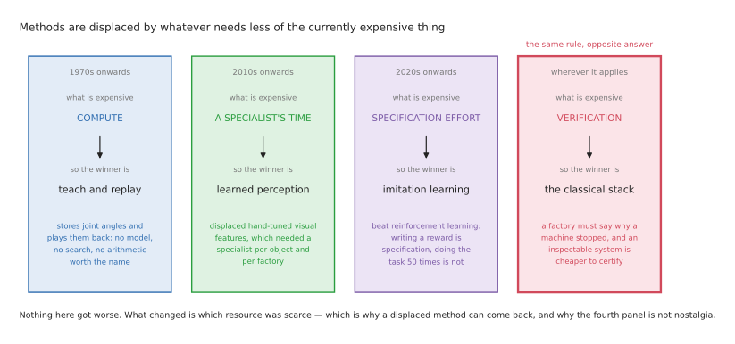
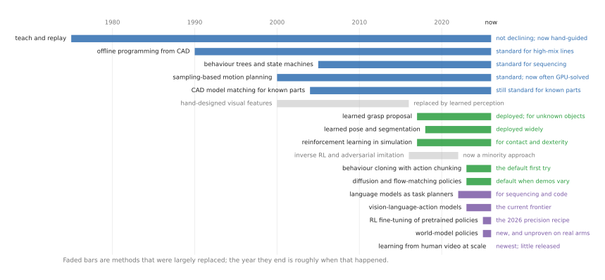
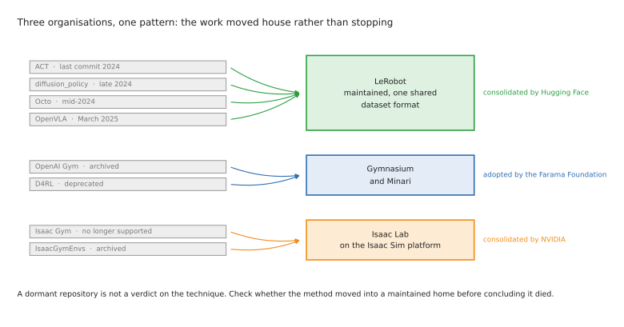

# What is changing in robot manipulation, and why

Every list of "what is hot in robotics" goes stale within about a year. The reasons
behind such a list do not go stale, which is why this document spends most of its
length on why things move rather than on what has moved. If you understand the
mechanism, you can read next year's announcements yourself and work out which of
them matter.

This is the long version of
[the overview's status section](01_overview.md#7-what-is-current-and-what-is-fading), so
read that one first if all you want is the summary.

This document is meant to do two things for you. The first is that when you come
across a tutorial, a repository or a paper, you should be able to place it —
current, superseded, or never actually released in the first place. The second is
that when something genuinely new appears, you should be able to ask the right
question about it, and the right question is almost never "is this better?" but
almost always "what does this need less of?"

## Contents

1. [The one mechanism behind every shift](#1-the-one-mechanism-behind-every-shift)
2. [The five forces driving 2026](#2-the-five-forces-driving-2026)
3. [What has clearly been superseded, and why](#3-what-has-clearly-been-superseded-and-why)
4. [What is quietly fading rather than deprecated](#4-what-is-quietly-fading-rather-than-deprecated)
5. [What is not moving at all, and why that matters](#5-what-is-not-moving-at-all-and-why-that-matters)
6. [What is arriving now, and what it can actually do](#6-what-is-arriving-now-and-what-it-can-actually-do)
7. [How to tell a real shift from a fashion](#7-how-to-tell-a-real-shift-from-a-fashion)
8. [What this means for what you learn](#8-what-this-means-for-what-you-learn)

---

## 1. The one mechanism behind every shift

Methods in this field rarely die because somebody proved them wrong. They are
displaced by something that needs less of whatever happens to be expensive at the
time.

That single sentence explains almost every transition described in this document,
and it carries a useful corollary. Because what is expensive changes over the
decades, a method can be displaced without ever having become worse at its job — and
it can come back later, if the economics move again.

Three eras make the point clearly enough.

**When compute was the expensive thing**, the methods that won were the ones that
computed almost nothing at all. Teach-and-replay simply stores a list of joint
angles and plays them back, needing no model of the robot, no search through
possible paths, and no arithmetic worth the name. That is why it won in the 1970s,
and — this is the part people tend to find surprising — it is also why it has never
gone away. Its cost profile is unbeatable, and nothing that has happened since has
made it any worse at what it does.

**When hand-written perception was the bottleneck**, the thing that had become
expensive was a specialist's time. Hand-designed visual features had to be tuned by
a computer-vision engineer for each object, for each lighting condition, and for
each factory they were installed in. Learned perception needed a great deal of data
instead, and no specialist, and by the middle of the 2010s data had become the
cheaper of those two things. That is the entire reason bin picking of mixed items
turned from a research problem into a product. It was not that the networks were
clever. It was that the engineering cost per object fell to roughly zero.

**Now the expensive thing is human specification effort** — somebody sitting down
and writing out what the robot should do, in a form precise enough for a machine to
execute. Every current shift points in the same direction: away from methods where a
person has to describe the behaviour, and towards methods where the behaviour comes
out of examples instead. This is why imitation learning beat reinforcement learning
for arms, despite being the theoretically weaker of the two. Writing a reward
function is specification work, and doing the task fifty times yourself is not.

There is a corollary here that keeps you honest, and it is worth stating plainly. A
method that needs less of what is expensive can still be worse in every other
respect and win anyway. And in the places where **verification** is the expensive
thing — a factory that has to certify in advance what a machine will do — the
classical methods are still winning, because an inspectable system costs far less to
verify than a learned one. That is not nostalgia on anyone's part. It is the same
mechanism producing the opposite answer under a different cost structure, and it is
why [the deployed systems look nothing like the papers](01_overview.md#9-what-real-systems-actually-do).

## 2. The five forces driving 2026

Five specific pressures are doing the work at the moment, and each of them predicts
several of the individual changes described further down.

**The first force is that data is the binding constraint, and everybody knows it.**
The single most sobering result anywhere in this repository is that ALOHA Unleashed
collected 26,241 demonstrations — roughly a hundred times the original ALOHA's fifty
per task — and did not end up with higher success rates than the original. That is a
scaling curve flattening out in public view. If more data of the same kind does not
help, then the field has to go and find *different* data, and that single pressure
explains four separate directions at once: learning from ordinary human video,
data-generation tools that multiply demonstrations, cheap hardware that lets far
more people collect data in the first place, and world models that learn from video
with no action labels at all.

**The second force is that pretrained perception made generalisation purchasable.**
You can now download a model that segments objects it has never seen, and another
that estimates their pose without having been trained on them. The consequence of
that is structural rather than incremental: the part of a robot system that used to
require bespoke engineering for every customer turned into a dependency you install.
That is what turned modular learned-perception pipelines into the most deployed use
of machine learning on arms, and it is why that rather unglamorous family keeps
winning against end-to-end approaches.

**The third force is consolidation into one maintained home**, and it is badly
underappreciated — it explains more apparently dead repositories than any technical
argument does. A research repository exists in order to support a paper, and once
the paper is published the incentive to maintain the code largely disappears. What
changed recently is that [LeRobot](https://github.com/huggingface/lerobot) became a
single maintained library with a shared dataset format, so the methods moved there
and the original repositories went quiet. Those methods are not dead. Their homes
changed. Reading a dormant star count as a verdict on a technique is the most common
mistake people make in this area.

**The fourth force is verification pressure, and it is why adoption is so uneven.** A
factory has to be able to say why a machine stopped. A method that cannot explain
itself therefore carries a verification cost that is often larger than the
engineering effort it saves. This force runs *against* the other four, and it is the
reason the timeline below shows classical methods persisting for decades alongside
learned ones that are only a few years old. Expect it to be the slowest-moving of
the five, and expect regulation such as
[the EU Machinery Regulation coming in January 2027](01_overview.md#and-be-honest-about-where-the-paid-work-is)
to strengthen it rather than weaken it.

**The fifth force is that the shape of available compute changed.** Massively
parallel graphics cards made two things possible that had not been before. The first
was simulating thousands of robots at once, which is what made reinforcement
learning in simulation practical at all. The second is quieter and arguably more
useful: solving motion plans fast enough to replan continuously rather than planning
once and executing. A planner that replans fifty times a second is not simply a
faster planner — it is a reactive controller, which is a different capability
altogether.

## 3. What has clearly been superseded, and why

Before working through the individual cases, here is the shape of the whole field on
a single axis: roughly when each method became common, and which ones are now on the
way out. The long blue bars are the point of the picture, because several of the
oldest methods are still entirely current, which is exactly what
[section 1](#1-the-one-mechanism-behind-every-shift) predicts.

Everything in this section has either an explicit deprecation notice or an archived
repository behind it. In each case the reason is the part worth remembering, because
the reasons generalise and the specific names do not.

**Isaac Gym gave way to [Isaac Lab](https://github.com/isaac-sim/IsaacLab).**
NVIDIA's own page says that Isaac Gym "is no longer supported", and
[its example repository](https://github.com/NVIDIA-Omniverse/IsaacGymEnvs) has been
archived. The reason is not that anything was wrong with it. Isaac Gym was a
standalone research prototype, and NVIDIA consolidated its simulation work onto the
Isaac Sim platform so that a single physics and rendering stack could serve both
research and product. This was a consolidation rather than a capability gap. If you
meet a tutorial that uses Isaac Gym, it is out of date.

**[D4RL](https://github.com/Farama-Foundation/D4RL) gave way to
[Minari](https://github.com/Farama-Foundation/Minari).** The offline
reinforcement-learning benchmark suite was formally deprecated, and the reason is the
same consolidation force again: the Farama Foundation took over maintenance of the
scattered reinforcement-learning ecosystem and rebuilt the dataset format properly.
The benchmarks did not become wrong. They became unmaintained, and then somebody
responsible adopted them.

**[OpenAI Gym](https://github.com/openai/gym) gave way to
[Gymnasium](https://github.com/Farama-Foundation/Gymnasium).** Same story, same
foundation, and the single most common stale import you will find in old tutorials.

**[SERL](https://github.com/rail-berkeley/serl) gave way to
[HIL-SERL](https://github.com/rail-berkeley/hil-serl)**, and this one was deprecated
by its own authors. It is the most informative deprecation in the list, because
unlike the others it is a genuine capability jump rather than a maintenance move.
SERL did reinforcement learning on a real robot. HIL-SERL added human intervention,
meaning that a person takes over when the robot is about to fail, and those
take-overs then become the learning signal. That one change took the method from
working on some tasks to 100% success on every task it was tried on, within one to
two and a half hours of training on the real robot. When authors deprecate their own
work, it is worth believing them.

**[RT-1](https://github.com/google-research/robotics_transformer) was archived and
RT-2 was never released at all.** The reason here is not technical: Google's robotics
work moved into a closed product line. This is a pattern worth naming rather than a
one-off, because the frontier of this field is increasingly announced rather than
released, which is why
[separating announced from downloadable](01_overview.md#11-how-to-read-the-numbers-in-this-field)
has become a core skill.

**ROS 1 gave way to ROS 2**, with ROS 1 reaching end of life in May 2025. This was a
genuine architectural rewrite, bringing real-time support, security, and a middleware
that works properly across multiple machines. The cost of that rewrite has been real,
though: several industrial vendor drivers never made the transition, and there is
still no maintained open-source ROS 2 driver for FANUC or Motoman, which is a live
gap rather than an oversight.

**Hand-designed visual features gave way to learned perception**, which is simply the
second force arriving a decade early. The features were the bottleneck, and they
needed a specialist for every deployment.

**[PyBullet](https://github.com/bulletphysics/bullet3) gave way to
[MuJoCo](https://github.com/google-deepmind/mujoco)**, and PyBullet now has an
enormous tutorial legacy and roughly one commit a year. This one is almost pure
licensing history rather than anything technical. MuJoCo was commercial software
with a paid licence until DeepMind acquired it in 2021 and open-sourced it in 2022.
PyBullet's main advantage had always been that it was free, so the moment the better
simulator was also free, the reason to choose PyBullet evaporated. Nothing about
PyBullet got worse.

### The one everybody gets wrong

CAD model matching was not replaced by learned grasping. It was replaced for mixed
and unknown items only. If you know the part you are picking, the industry still
matches its model, and the major 3D-vision vendors describe their products in
exactly those terms.

The reason comes down to what each method hands back to you. When you match a CAD
model against a depth picture, what you get is the object's full position and
orientation — where it sits along three axes, and how it is turned about each of
them, which together are called its six degrees of freedom. But you also get
something less obvious and considerably more useful: a number describing how closely
the model actually fitted the measured points. That number is a self-check. If the
fit is poor the number is large, and the system can stop and say so rather than
picking up something it has misunderstood.

A learned grasp proposer hands back something different. It gives you a ranked list
of places where the gripper could close, each with a confidence score attached to
it. A confidence score is the network's own opinion about its own answer, and a
network that is wrong is quite often confidently wrong, which makes that score a
much weaker guarantee than a measured geometric fit. Under verification pressure —
the fourth force — the answer you can check wins over the answer that generalises
better.

Both methods are entirely current in 2026, and which one you use is decided by
whether the object is in your catalogue, not by which one is more modern.

## 4. What is quietly fading rather than deprecated

Nothing in this section carries a deprecation notice. Each of these is simply not
being developed any more, and the reason differs from case to case in ways that
matter for whether you should still use it.

**The imitation-learning originals.** [ACT](https://github.com/tonyzhaozh/act) has
had no commits since 2024,
[diffusion_policy](https://github.com/real-stanford/diffusion_policy) since late
2024, [Octo](https://github.com/octo-models/octo) since mid-2024, and
[OpenVLA](https://github.com/openvla/openvla) since March 2025. The reason in every
one of those cases is the third force, consolidation: the methods themselves are
alive and maintained inside [LeRobot](https://github.com/huggingface/lerobot). Use
LeRobot's versions and treat the originals as historical references. OpenVLA is the
interesting case among them, because it is still the most-downloaded robotics model
and the baseline in most papers, and yet it is absent from LeRobot's policy list
entirely. It is a reference point rather than a foundation.

**The classical grasping repositories.**
[Contact-GraspNet](https://github.com/NVlabs/contact_graspnet) has not been touched
since 2024 and depends on a long-dead generation of TensorFlow;
[GraspNet-1Billion](https://graspnet.net/) is most valuable now as a dataset rather
than as code; and Dex-Net along with its `gqcnn` implementation have been dead since
2022. The reason here is different from the one above and the distinction is worth
drawing. The research line moved on, to diffusion models that generate grasps, of
which NVIDIA's [GraspGen](https://github.com/NVlabs/GraspGen) is the current
example. Meanwhile the commercial line moved closed: AnyGrasp has real traction and
ships as a licence-gated binary, and it is not open source despite appearing to be.
Treat this whole corner as concepts and datasets rather than as code to build on.

**Inverse reinforcement learning and adversarial imitation.** The flagship library
[imitation](https://github.com/HumanCompatibleAI/imitation) has had no commits since
January 2025. The generality of the approach is real, and so is its fragility, and
the preference-learning branch of the work found a better home tuning language
models instead. Surveys still treat the family as live, so calling it declining is
fairer than calling it dead — but do not expect to meet it inside a working arm
system.

**Task and motion planning.** [PDDLStream](https://github.com/caelan/pddlstream) last
committed in 2023. It is the most capable purely-programmed approach there is for
long tasks, and it also demands the most before it will do anything, because
somebody has to write a symbolic model of the domain. Industry uses behaviour trees
instead, for the straightforward reason that a tree is free to write, and the
research energy moved to language models doing the same sequencing job with far less
modelling effort.

**Industrial ROS glue.** The ROS-Industrial vendor drivers for FANUC, Motoman, ABB
and KUKA are all dormant ROS 1 code. `moveit_calibration`, which most tutorials still
recommend, has had no commits in a year, so use
[industrial_calibration](https://github.com/ros-industrial/industrial_calibration) or
OpenCV's hand-eye function directly instead. The reason in this case is the least
satisfying in the whole document and the most commonly encountered: this is
unglamorous maintenance work with no paper attached to it and no vendor obliged to
do it.

## 5. What is not moving at all, and why that matters

A document about change ought to say what has not changed, because that list is
where the durable skills are.

**Force control.** The mathematics of impedance and admittance control has been
settled for decades, and it is still the answer to contact-rich assembly. The reason
nothing has displaced it is simply that the physics did not change and the theory was
already correct. Every major vendor sells this as a product. A learned policy that
outputs positions still needs this underneath it, which means that learning to do it
well has a longer shelf life than anything in section 6.

**Behaviour trees.** Still standard for sequencing, and the only competitor is a
language model choosing which subtree to invoke — with the tree still underneath,
doing the actual running. Nothing has beaten them at being inspectable while
remaining readable at fifty branches.

**Teach and replay, which is growing rather than shrinking.** Collaborative-robot
hand-guiding made it easier rather than obsolete: you guide the torch along the seam
and press start. That amounts to more teaching being done by less specialised people,
which is a cost structure moving in the right direction rather than the wrong one.

**Motion planning.** Healthy and standard, and the only axis on which it is moving is
speed.

**Calibration.** Still the unglamorous thing that decides whether a cell works at
all, still mostly hand-rolled, and still what separates a demonstration from a
deployment.

Four of those five sit in the programmed family, and all five are things you can
learn once and then use for a decade. Section 6 below is where the excitement is.
This section is where the compound interest is.

## 6. What is arriving now, and what it can actually do

Each of the following says what the new capability lets you do that the previous
generation could not, and then why it emerged, which in every case is one of the
five forces. Treat the whole section as a weather report rather than a forecast:
several of these will not survive contact with real deployments.

### Reinforcement learning as polish, not as training

This is the most important arrival of the year, and
[the learned-methods document explains how it works](03_learned-methods.md#3-learning-from-large-scale-pretraining).
What belongs here is why it appeared and why you should believe it.

It appeared because demonstrations and practice fail in exactly complementary ways.
Demonstrations give you the *shape* of a task cheaply but not the last few percent
of reliability. Practice cannot find the shape on its own, because a coordinated
behaviour is almost never stumbled upon by chance, but it polishes beautifully once
the shape is already there. Pair them and each covers the other's weakness.

You should believe it because nobody designed the pairing. It was discovered
independently by four separate groups in a single year, on four unrelated tasks:
laundry and box assembly, shoe-lacing, precision insertion, and a garment-folding
competition. Convergence like that is the strongest evidence this document contains,
and it is a better reason to trust a method than any single headline result.

### Flow matching, and an honest doubt about it

Flow matching is now the action-generating component inside essentially every large
policy, and it too is
[explained in the learned-methods document](03_learned-methods.md#11-behaviour-cloning).
It is listed here for a different reason: it is the clearest example in the field of
something that everybody adopted before anybody justified it.

A 2026 study called [MINERVA](https://arxiv.org/abs/2609.03715) found that flow
matching gave no detectable advantage over plain regression on its benchmarks, while
being several times slower to run. That does not make it wrong. It makes it an open
question that the field has stopped asking, which is worth noticing, because a
method can spread through a field on elegance and convenience rather than on
measured benefit.

### World models

These learn to predict what will happen next and then act through that prediction,
which — and this is the crucial part — means they can learn from data that has no
action labels attached to it at all, such as ordinary video.

The reason is the first force. If robot demonstrations are the binding constraint,
and collecting more of them has stopped helping, then the way out is to learn from
data that is not robot demonstrations. Video is abundant; action-labelled robot
episodes are not.

They are now a first-class category in LeRobot and have not yet been proven on
production arms. Worth watching, but not worth betting on.

### Learning from human video, and recording without a robot

This uses people doing tasks as training data. The scaling behaviour looks
promising, almost nothing has been released, and so the honest status is
"interesting" rather than anything stronger.

The reason is the same data constraint taken to its logical conclusion, and the
numbers make the motivation obvious. Open X-Embodiment, the famous pooled corpus,
contains about 2.4 million robot episodes, set against an effectively unlimited
supply of video showing humans manipulating things.

The practical spin-off from this research is more immediately interesting than the
research itself. [Grabette](https://huggingface.co/blog/grabette) (Apache-2.0, €490)
is a handheld recorder — cameras, an inertial sensor and a gripper encoder — that
you hold in your own hand while doing the task, with browser-based reconstruction
producing six-degree-of-freedom trajectories in LeRobot format. Its ancestor is
[UMI](https://github.com/real-stanford/universal_manipulation_interface). What this
means in practice is that you can collect training data before owning a robot at
all, which removes the single most common blocker for somebody trying to learn this.

### Verification at run time

Instead of trusting the policy's first answer, this generates several candidate
actions and checks them before acting on any of them. At least one 2026 result
claims that scaling up the checking beats scaling up the policy.

The reason is the first force again, approached from a different angle. If a hundred
times the data buys no improvement, then spending compute at run time rather than at
training time is the obvious remaining lever, and there is a suggestive precedent in
how much language models gained from reasoning at test time. It also sits well
alongside the fourth force, because a system that checks its own candidates is a
system that can explain why it rejected one.

### Data generation as a first-class tool

This turns a handful of demonstrations into thousands, by re-composing them around
wherever the objects happen to be, and then trains on the result.

It is the purest expression of the first force, and it involves a rather pleasing
inversion: programming is being used to manufacture the data that training needs.
The classical stack earns its keep by generating exactly what the learned stack is
short of.

The open tools are [MimicGen](https://github.com/NVlabs/mimicgen) and its two-arm
successor [DexMimicGen](https://github.com/NVlabs/dexmimicgen), both of which are
research-only under NVIDIA's licence, so check carefully before building anything
commercial on them.

### Small models for cheap hardware

This gives you a pretrained vision-language-action policy that you can actually
fine-tune and run on consumer hardware, rather than one that needs more memory than
a consumer card has.

The reason it exists is that a community with tens of thousands of shared datasets
and hundred-dollar arms needed a model sized for it, and the large policies are not.
This is democratisation arriving as a technical requirement rather than as a slogan.

The open tool is [SmolVLA](https://huggingface.co/blog/smolvla), which sits inside
LeRobot and was trained on community data. For anyone learning on a cheap arm, it is
the realistic entry point to the whole vision-language-action family.

### Tactile foundation models

These aim at a single model that works across many different touch sensors, rather
than one model per sensor type.

The reason is that touch data has always been locked to the specific geometry and
physics of one sensor, so nobody could pool it — which is exactly the fragmentation
that pretrained vision models escaped a decade ago. Whether touch has enough shared
structure for the same trick to work is genuinely unknown at this point.

## 7. How to tell a real shift from a fashion

Five questions, arranged roughly in order of how much signal each one carries.

**Did the authors deprecate their own previous work?** This is the strongest signal
there is, because researchers do not willingly retire their own contributions. SERL
giving way to HIL-SERL is the model case.

**Did independent groups converge on the same shape of solution?** Four different
groups arriving at demonstrate-then-polish, on four different tasks, within a single
year, is worth considerably more than any one impressive result.

**Is there a checkpoint you can download, or only a paper?** Several of 2026's most
impressive models have no released code and no released weights. Read about them by
all means, but do not plan on using them. Checking this before anything else will
save you more time than any other habit in this list.

**Did the benchmark move, or only the leaderboard?** A new number on an old benchmark
is incremental progress. A new benchmark, or a paper that reports success rates
per stage rather than as a single total, usually signals that the field has noticed
it was measuring the wrong thing.

**Does the new thing need less of what is currently expensive?** This is the
mechanism from [section 1](#1-the-one-mechanism-behind-every-shift). If a method is
better but needs more demonstrations, more specification or more verification, it
will lose to a worse method that needs less of those things — and you are better off
planning for that than being surprised by it.

There is also one anti-signal worth holding on to. A dormant repository proves
nothing by itself. Check whether the method moved into a maintained home before
concluding that it died.

## 8. What this means for what you learn

**Learn the things in [section 5](#5-what-is-not-moving-at-all-and-why-that-matters)
first.** Force control, behaviour trees, motion planning and calibration have not
changed in a decade and will not change much in the next one, and they are also what
people are actually paid to do.

**Within the learned family, learn the loop rather than the architecture.** Collect
data, train, evaluate, work out what failed, then collect more of whatever failed.
The architecture will be different in eighteen months. The loop will not. This is
also why the cheap hardware matters more than it appears to, because going round that
loop once will teach you things that no paper can.

**Assume that the specific model names in section 6 will be wrong within a year, and
that the reasons behind them will not be.** If you remember one thing from this
document, make it the question rather than any of the answers: what does this need
less of?

---

Back to [the overview](01_overview.md), or on to
[the programmed methods](02_programmed-methods.md) and
[the learned methods](03_learned-methods.md). For what changes when two arms have to
cooperate, see [the two-arm folder](../10_two-arm-training/01_overview.md).
