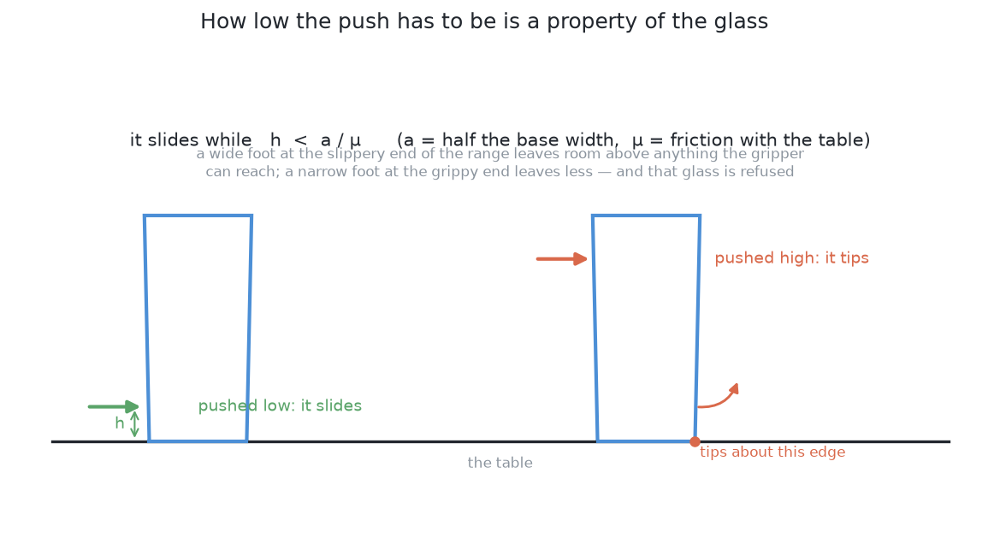
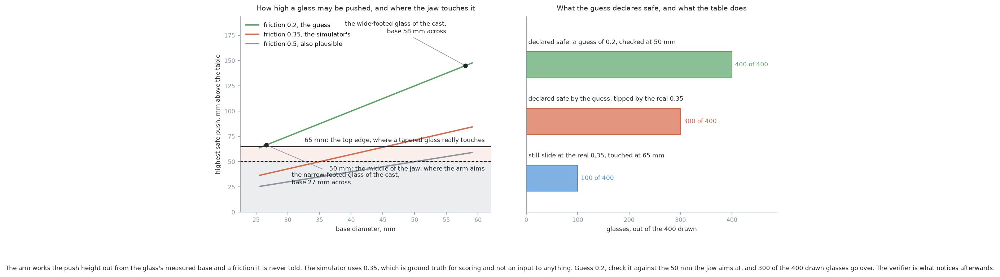
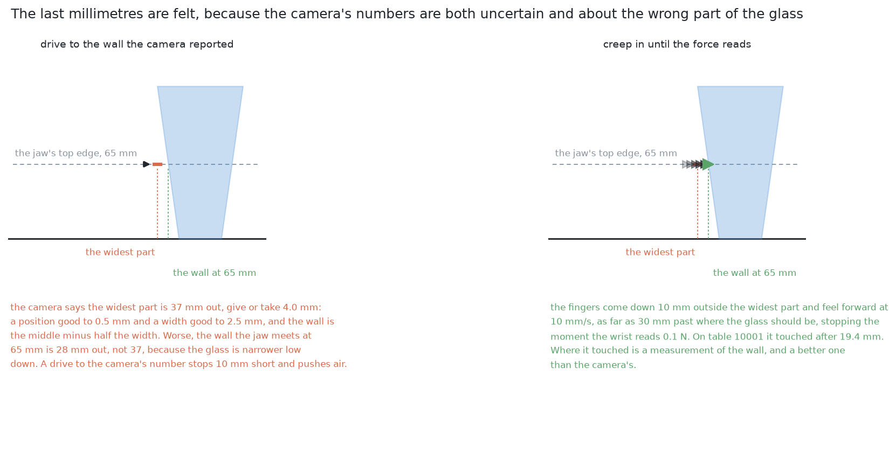
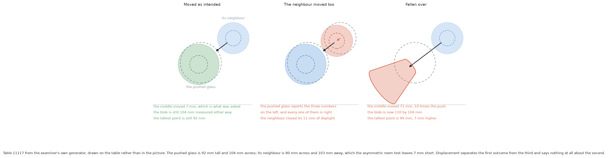
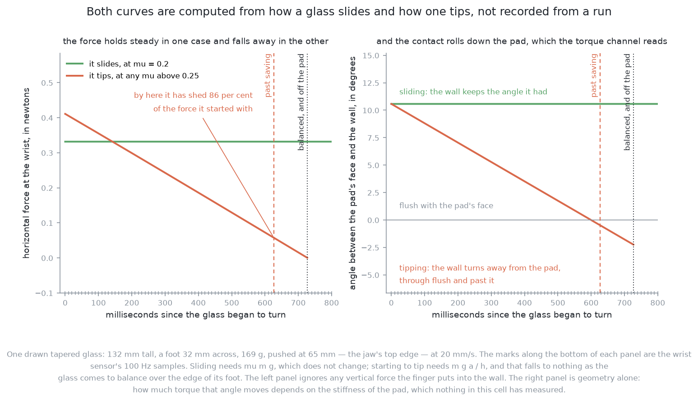
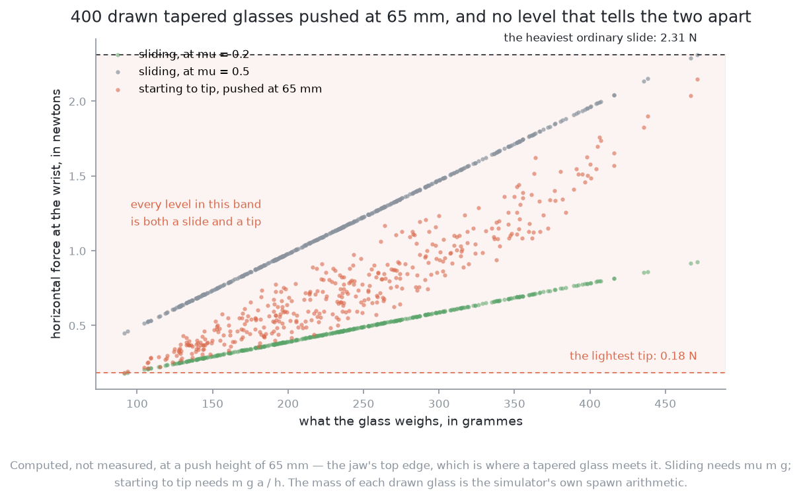

# Pushing without toppling

## 1. Introduction

A glass pushed sideways across a table either slides or falls over, and which
of the two happens is not luck. It is settled before the arm moves, by how far
up the glass the jaw touches it. This document explains the rule that settles
it, why that rule has to be worked out again for every glass rather than agreed
once, why some glasses have to be refused rather than pushed, and what the arm
does about the fact that the rule contains a number nothing in this cell can
measure. It is deliberately separate from the six solutions because **every one
of them needs it and none of them differs in it**. By the end you will
understand why the height that matters is not the height the arm aims at, why a
refusal is a result rather than a failure, why every solution here acts and then
measures instead of acting on a prediction, and where a trained model can sit
inside that loop without being able to break it.

## Contents

1. [Introduction](#1-introduction)
2. [Why no solution can answer this on its own](#2-why-no-solution-can-answer-this-on-its-own)
3. [The limit: slide, or tip](#3-the-limit-slide-or-tip)
4. [The number nobody has](#4-the-number-nobody-has)
5. [The loop: plan, feel, look again](#5-the-loop-plan-feel-look-again)
6. [The honest limit](#6-the-honest-limit)
7. [Where to go next](#7-where-to-go-next)

## 2. Why no solution can answer this on its own

The six solutions differ in how they choose a push: which glass to move, in
which direction, and how far. That difference stops at the edge of this
document, for two reasons.

The first is that the table does not know which method chose the push. A glass
touched above its own limit goes over whether a few lines of geometry picked the
contact or a large trained policy did, because what decides the outcome is the
contact and the glass, not the reasoning behind them. So the limit is a property
of the situation rather than of the method, and it has to hold for all six in
the same form.

The second is that none of the six can predict where a pushed glass ends up.
Friction under a foot is not the same everywhere on that foot, the contact
between a flat jaw and a curved glass is a small patch rather than a point, and
a glass turns as well as travels. Planar pushing is a well studied problem and
the honest summary is that predicting an outcome precisely needs numbers nobody
here has. So every solution has to act, measure what really happened, and
correct — and that loop, like the limit, is shared.

This document therefore holds those two things: **the limit, which says whether
a push may happen at all**, and **the loop, which runs around every push that
does**.

## 3. The limit: slide, or tip

Start with what a push has to overcome, because the whole rule falls out of
comparing two numbers.

A glass standing on a table is held down by its own weight and held still by
friction. Push it horizontally at some height and two different things can give
way. The foot can **slide** over the table, which happens once the push exceeds
the friction holding it, and friction is the friction coefficient multiplied by
the weight. Or the glass can **tip**, turning about the bottom edge furthest
from the jaw, which happens once the turning effect of the push about that edge
exceeds the turning effect of the weight holding the glass down on its foot.

Those two give way at different pushes, and the one that gives way first is the
one that happens. Write `h` for the height the jaw touches the glass and `a` for
half the width of the foot the glass stands on, and write `μ` for the friction
coefficient between the glass and the table. Sliding needs a push of `μ` times
the weight. Tipping needs a push of the weight times `a / h`, because the push
acts at `h` from the table and the weight acts at `a` from the edge the glass
would turn about. Sliding comes first while

    h  <  a / μ

and tipping comes first above it.

Two things about that rule are worth noticing straight away, because they are
what make pushing attractive in the first place. The weight appears on both
sides and cancels, so **the limit does not depend on how heavy the glass is**,
which is exactly as well, since nothing weighs a glass before it is pushed. And
nothing in it depends on how hard or how fast the jaw pushes, so a gentler push
does not make a high contact safe. A push that is too high tips the glass over
slowly instead of quickly.

### The push height is worked out per glass

Because `a` is half the foot width, and every glass has its own foot, the
highest safe contact is a different number for every glass on the table.

That is why the push height is **computed from the measurement rather than
chosen once**. The camera work hands over [how wide each glass is at its
foot](../../08_seeing-the-glasses/02_the-problem/01_what-is-asked-for.md#4-what-must-come-out),
so the limit can be evaluated for that glass before the arm commits to touching
it. Agreeing a single safe height for the whole kind would mean choosing it low
enough for the narrowest foot the kind allows, which refuses glasses that were
perfectly pushable, or choosing it higher, which pushes glasses that were not.
This is the pattern the whole project uses: compute what the measurement
allows, rather than assume a tolerance that has to cover every case at once.

### The height that counts is the top edge of the jaw

The arm does not get to choose `h` freely either, and the value to put in the
rule is not the obvious one.

The jaw is a solid object with a height of its own. Its middle rides as low as
the gripper can go, which is 50 mm above the table, and the fingers are 30 mm
tall, so the jaw's top edge stands at 65 mm. Those are the gripper's own
numbers and they do not change between glasses. What changes is which part of
the jaw the glass meets, and **a glass that is wider higher up meets the top
edge before any other part of the jaw touches it**. The tapered kind is wider
higher up by definition, so for those glasses the contact is at the top edge.

So `h` is 65 mm for a glass of that shape, not the 50 mm the arm aims at. The
difference is 15 mm on a limit that is itself often only a few tens of
millimetres, so it is not a rounding question: checking the rule at the middle
of the jaw declares far more glasses safe than really are. And the mistakes all
point the same way.
Every glass that the lenient check wrongly admits is a glass that will be
touched above its limit and will go over, while the stricter check's mistakes
are glasses left alone that could have been moved. One of those two errors
costs a glass and cannot be undone; the other costs a refusal that can be
reported. **Getting this wrong errs in the direction that cannot be recovered**,
which is why it is stated here rather than left to each solution.

### Some glasses cannot be pushed at all

Put the two previous sections together and a third consequence follows that is
easy to miss, because it looks like a gap rather than an answer.

The limit `a / μ` is small when the foot is narrow or the friction is high. It
can be smaller than 65 mm, and it can even be smaller than the 50 mm the jaw
rides at, which is already the lowest the gripper reaches without fouling the
table. For such a glass there is no contact height the arm can offer that is
below the limit. The glass tips before it slides, whatever the arm does.

**The only correct answer for that glass is to refuse it**, and a refusal is a
result rather than a failure. The run ends as *correct but incomplete*: the
glass is left standing where it was and reported with the reason it could not
be moved. This matters because the alternative is worse in a way that cannot be
repaired. A glass that was refused is still a glass standing on a table, and
anything later in the project may yet move it, measure it or be told to leave
it. A glass that was pushed and went over is finished, and the arm carries on
working beside it. The project takes the same line wherever contact is
involved: anything doubtful ends with the glass untouched and a line in the
report, and no solution may add a fallback that tries anyway.

**How a solution reaches that refusal is not the same for all six.** Five of
them evaluate the rule above from the measured foot width before any model is
consulted, which is what puts a ceiling on how badly a model can fail. The
solution that learns what a push does holds no friction value to put in the
rule, so it refuses instead when every push its search examined was turned down
by its own learned model. That refusal rests on more evidence, and its ceiling
comes from the model rather than from the arrangement. The limit is the same
either way; what differs is what is trusted to apply it.

## 4. The number nobody has

Everything above rests on `μ`, so it is time to be plain about where that
number comes from, which is nowhere.

**The friction coefficient is never told to any solution, and nothing in the
cell measures it.** The cell has four sensors, and none of them reports how
slippery the table is. The examiner holds the coefficients it runs the physics with
privately, and uses them to move the glasses and to score the outcome, but they
are never an input to any decision the arm makes. The arm's situation is
therefore not that it knows the friction imprecisely. It is that it has to
supply a number the world never gave it.

That matters because glass on a dry wooden top plausibly spans a range from
roughly 0.2 to 0.5, and `a / μ` at the top of that range is less than half what
it is at the bottom. So the limit a solution computes is only as good as its
guess, and the guess can be wrong by a factor that decides whether a glass
should have been pushed at all.

Two habits follow, and both of them are followed by all six solutions.

**Push as low as the gripper can reach, always.** Since the height is fixed at
the lowest the hardware allows, the arm is never trading safety for anything,
and the only remaining question is whether even that lowest contact is below the
glass's limit. There is nothing to tune, and there is no case where pushing
higher would help.

**Watch what actually happens, rather than trusting the prediction.** If the
guessed friction is too low, the limit comes out too generous, and the only
thing that can catch it is evidence from the table itself. That evidence arrives
while the arm is pushing and just after it has finished, which is what the rest
of this document is about.

## 5. The loop: plan, feel, look again

So no solution here acts on a prediction and walks away. Every one of them acts,
senses what really happened, and then decides again from what it sensed.

The programming comparison is exact. A plan computed once and then executed
blindly is a list of instructions written before the run and carried out
without reading anything back, like unrolling a loop into a fixed sequence
because you believe you know how many times it will run. What these solutions
do instead is keep **state that is re-read**: the table's arrangement is a value
that the arm measures, acts on, and then measures again, and the loop continues
while that value says there is still work to do. The arm is not following a
script of pushes. It is repeating one step — look at the table, choose one
push, make it, look again — until every glass has the room it needs, or until
the
glasses that are left have all been refused.

Each pass through that loop has three parts.

**Plan.** From the measurements, choose which glass to move, where to move it
to, and which way the jaw comes in. The topple limit is checked here, and a
glass that fails it never reaches the next part.

**Feel.** The jaw does not drive to a computed contact point, because every
measurement carries error and a step that drives to a computed position is a
step that strikes a glass the day a measurement is a couple of millimetres out.
Instead the closed jaw comes down behind the glass, moves forward slowly until
it touches, pushes, backs off, and **reports what it felt**. The last
millimetres are felt rather than driven, which is how this project handles
contact everywhere. The programmed approach built here goes one step further and
makes a small test push first, to see how the glass responds before committing
to the full one.

**Look again.** Fresh measurements say where the glass really ended up, which
is compared with where it was sent. The difference is the only honest
information anyone has about a push, since no model in the cell could have
produced it in advance. The loop then starts over with the arrangement as it
now is, not as it was planned to be.

Inside that loop there is room for two learned helpers, and because they sit
inside a loop rather than replacing it, they can be judged by what a wrong
answer from them would cost. **Neither of them is a solution in its own right.**
Neither chooses a push, neither chooses a destination, and neither can approve
anything. They are checkers, placed either side of the moment the jaw moves.
Both are **prescriptions in this project rather than built code**: they are
described here because every solution could use them and none of them would use
them differently, not because the repository contains them.

### A change verifier, placed after the action

The first would answer the question the looking step asks, which is harder than
it sounds: did this push do what it was meant to do?

The geometry answers part of that well. It can say how far the glass travelled
and compare it with how far it was sent. What it answers badly is the part that
matters most, because a camera looking straight down at a glass that has fallen
over sees a blob that is wider than before — and a glass that merely slid a
long way also leaves a blob somewhere new. A small trained model, shown the
scene before the push and the scene after it, would answer three questions
instead:
did the intended glass move as intended, did anything else move, and has
anything fallen over.

**Where that model sits is the reason it is safe to have.** It runs after the
push, so it can only ever be wrong about something that has already happened. It
cannot cause a topple, because by the time it speaks the push is over. It cannot
cause a collision, because it does not choose where the arm goes. The worst a
wrong verdict costs is a few seconds of arm movement, when it reports a problem
that was not there and the arm takes another look to settle it, or a run stopped
when it need not have been. Compare that with a model placed *before* the
action, which would be choosing contacts, and whose mistakes would be made with
the arm. A checker after the fact has a ceiling on how bad it can be, and the
ceiling comes from the arrangement rather than from the model being good.

### An early abort, acting during the push

The second helper answers a different question, and the difference is entirely
one of timing.

The jaw reports the force it feels while it is pushing, at a far higher rate
than any camera reports pictures. A glass that is sliding and a glass that has
begun to turn over do not feel the same through that signal, because the two do
not develop the same way as the push continues.

A monitor reading that signal could stop the arm the moment the contact stops
behaving like a slide, back the jaw off a short way along the line it was
pushing, and hand over. A single force level would not do it: across the
glasses a kind allows, every force a tip produces is a force some slide
produces too, which is why the signal has to be read as it develops rather than
compared against a threshold.

**That is what separates it from the verifier: it acts during the push rather
than after it.** The verifier can only describe a glass that is already on its
side, because its evidence is a picture and the picture cannot be taken until
the arm has finished moving and carried the camera somewhere useful. The monitor
is in contact with the glass while the glass is still deciding what to do. So
**an early abort would be the only thing in this problem that could prevent a
topple rather than report one**, and that is the whole argument for building
one. It is an argument and not a description: nothing in this project
implements it, and the solutions that topple glasses topple them for want of
it. [Solution 6](../09_the-same-model-fine-tuned-here/01_what-it-is.md),
which is the only one that topples glasses often, is the measurement of what its
absence costs.

Its own powers are deliberately small. It cannot steer, it cannot choose a
target and it cannot approve a push; it can only stop one. A monitor that fires
when it should not have costs a push abandoned and a few seconds spent finding
out why, which is the same shape of cost as a wrong verdict from the verifier,
and for the same reason: neither of them can do anything except interrupt or
describe.

The two belong together rather than in competition. The monitor knows only that
the contact stopped feeling like a slide, and cannot say what the glass did or
whether a neighbour was involved, because a force signal has one contact in it
and the table has several glasses on it. The verifier can say exactly that, from
a viewpoint chosen for the question, and it would be the natural thing to ask
after an abort.

## 6. The honest limit

Looking again is what recovers the run from a bad prediction, and it is worth
being precise about which failures it recovers and which it does not.

A push that fell short, a push that went too far, a glass that turned as it
travelled, a glass that landed in a new crowd: all of these are states of the
table, and the next pass through the loop measures them and plans against them.
Nothing is lost, because the arrangement is re-read rather than assumed, and a
wrong guess at the friction shows up here as a push that did not go where it was
aimed.

**But nothing in this loop stands a toppled glass back up.** No step in this
book lifts anything, the arm has no way to right a glass lying on its side, and
everything downstream carries on working beside it. That single fact is why the
topple limit is written as a refusal rule rather than as a risk to be weighed
against the value of moving the glass. A risk worth taking is one whose bad
outcome the system can absorb. This one it cannot, so the arithmetic is used to
say no, and the two helpers above exist to catch the cases where the arithmetic
said yes on the strength of a number nobody had.

## 7. Where to go next

- [The problem](01_what-is-asked-for.md) — why dragging rather than lifting, the distances
  that matter, and what "done" means.
- [The examiner](../02_the-examiner.md) — the shared input, output and marking.
- [The target layout](02_the-target-layout.md) — where the glasses should end up,
  and the least movement the task needs.
- [The six solutions](../03_the-six-solutions/01_how-the-six-compare.md) — what each one puts between the
  measurements and the pushes.

← [The target layout — where the glasses should end up](02_the-target-layout.md) · [The examiner — the same question for every answer](../02_the-examiner.md) →
