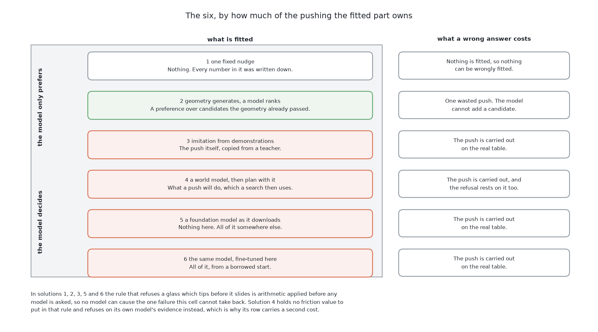
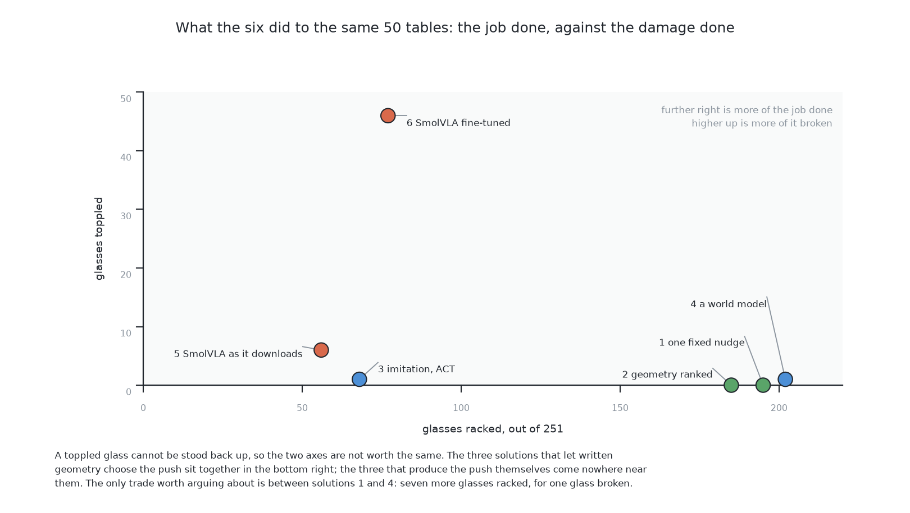
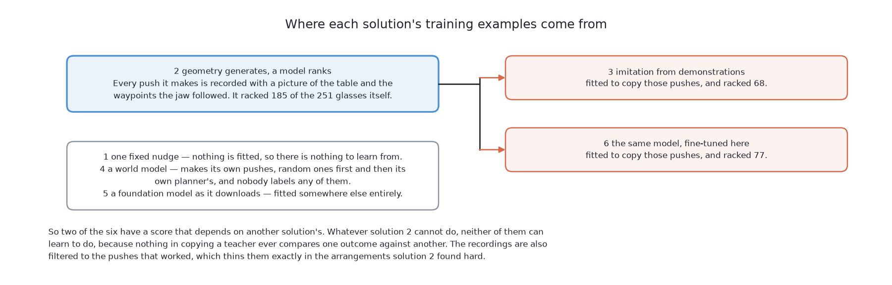

# The six solutions — same table, six ways to push

## 1. Introduction

This book asks the arm to drag crowded glasses apart until each one has room
for the gripper, without knocking any of them over. [What is asked
for](../01_the-problem/01_what-is-asked-for.md) sets out that question in full.
This chapter answers it six times over, with six quite different methods, and
the point of having six is **not** that one of them is the answer. The point is
to be able to compare them, and then to choose one knowing what the choice
costs.

This page is the map of all six, and it is three tables. The first says **what
each one is built from**, which is the model, the library and the licence. The
second says **how each one works**, in a few sentences each. The third says
**what each one scored**, and the prose after it explains the results that are
worth more than the rest.

After this page, **this chapter holds a short page for each of the six**, about
eight minutes each, and six separate chapters later in the book treat the same
six in full at roughly an hour each. So the order to read in is this page, then
the short page for any solution that interests you, and only then the chapter
that derives it.

## Contents

1. [Introduction](#1-introduction)
2. [What all six share](#2-what-all-six-share)
3. [What each one is built from](#3-what-each-one-is-built-from)
4. [How each one works](#4-how-each-one-works)
5. [What each one scored](#5-what-each-one-scored)
6. [Two things that cut across the six](#6-two-things-that-cut-across-the-six)
7. [Where to go next](#7-where-to-go-next)

## 2. What all six share

All six are given the same tables, the same measurements of them, the same push
budget and the same scorecard, which is what lets a gap between two scores be
read as a statement about the method. [The examiner](../02_the-examiner.md)
describes that arrangement in full and is the page to read before any solution
document.

The one part of it worth repeating here is the part the tables below rest on.
**The score is the table afterwards, not the push that changed it.** Three
numbers and fifty waypoints are not the same kind of thing, so there is no
shared language for an action here — but the table is the same table either
way. A solution may therefore choose any action space it likes, and the
outcome is measured identically for all six.

Two parts of the job belong to no solution and are described elsewhere: where
the glasses should end up, in [the target
layout](../01_the-problem/02_the-target-layout.md), and the limit that decides
whether a glass slides or tips, in [pushing without
toppling](../01_the-problem/03_pushing-without-toppling.md).

## 3. What each one is built from

This is the shopping list. Read the right column as what you would have to
install, collect and train in order to run that solution, and the order of the
rows as how much of the pushing is fitted, from nothing fitted at the top to
everything fitted at the bottom.

| Solution | What it is built from |
|---|---|
| **1. [One fixed nudge](02_one-fixed-nudge.md)** | NumPy, and nothing else. Nothing is fitted, so there is no model, no training set and no weights file. No licence condition of any kind. |
| **2. [Geometry generates, a model ranks](03_geometry-generates-a-model-ranks.md)** | Gradient-boosted regression trees from scikit-learn, about two hundred of them, three levels deep, sitting on top of solution 1's own candidate geometry. Needs a few thousand candidate-and-outcome pairs, which the examiner labels for free. Permissively licensed. |
| **3. [Imitation from demonstrations](04_imitation-from-demonstrations.md)** | ACT, an action chunking transformer, taken from LeRobot and fitted here from random numbers. Needs demonstrations, which solution 2 produces. A second way swaps ACT for Diffusion Policy. Apache-2.0, and nothing is downloaded but the library. |
| **4. [A world model, then plan with it](05_a-world-model-then-plan-with-it.md)** | Five copies of a small network written for this cell, in PyTorch, with a sampling search on top. Needs tens of thousands of pushes made in a physics engine, which nobody labels. A second way would use TD-MPC2 off the shelf, and is not built. Permissively licensed. |
| **5. [A foundation model as it downloads](06_a-foundation-model-as-it-downloads.md)** | SmolVLA from LeRobot, about 450 million parameters, used exactly as it downloads. Nothing is fitted here, so there is no training set and no training run. The library is Apache-2.0 and **the weights carry their own terms**, which this project does not record. |
| **6. [The same model, fine-tuned here](07_the-same-model-fine-tuned-here.md)** | The same SmolVLA and the same downloaded weights as solution 5, with a low-rank correction of about four million numbers trained on this cell's own pushes. Needs the demonstrations solution 2 produces. The same terms on the weights, inherited by anything trained from them. |

## 4. How each one works

The same six in the same order, now by what actually happens when the arm looks
at a table. Each one is a different answer to the single difficulty this book
sets, which is that nobody in this cell knows what a push will do: where a
pushed glass comes to rest depends on the friction between its base and the
table, and nothing here measures that.

| Solution | How it works |
|---|---|
| **1. One fixed nudge** | It stops predicting. The geometry writes down every push that is safe for the glass in front of it — every heading, every travel, with the arm's reach, the glass zone, the neighbours and the tipping rule all checked — and a printed rule takes the shortest one that leaves a glass with room. Then it looks again. Nothing is fitted and nothing is drawn at random, so it behaves the same way on the hundredth table as on the first. |
| **2. Geometry generates, a model ranks** | The same geometry writes down the same candidates, and a fitted model puts them in order instead of the printed rule. The model can never add a push to the list and never bring back one the geometry rejected, so the worst a badly fitted model can do is waste a push. Its scored candidates are recorded pushes, which makes it the teacher for solutions 3 and 6. |
| **3. Imitation from demonstrations** | A view of the table from the top goes in and a short run of jaw waypoints comes out. Nobody writes down how to push a glass: solution 2's successful pushes are recorded, a network is fitted to copy them, and the fitted network's answer is carried out directly. Nothing in it ever evaluates an outcome, so it cannot discover that a different push would have been better. |
| **4. A world model, then plan with it** | It learns what a push *does* rather than what to do. Five copies of a small network are fitted on pushes really made in the simulator, each answering "if I make this push, what will the table look like afterwards?". Before every push the arm makes, about fifteen hundred candidates are drawn, put to all five copies, discarded if any copy thinks something might topple, and scored by how much room is still missing. The best one is carried out. |
| **5. A foundation model as it downloads** | A model somebody else trained on hundreds of real robot datasets is shown the table from the top, told in plain English what to do, and asked for actions. Its answer is read as waypoints and carried out. There is no training step, no data collection and no fitted parameter anywhere in the chain. |
| **6. The same model, fine-tuned here** | The same chain as solution 5, with a training step put in front of it. The borrowed weights stay as they are and a small correction is learned beside them, from solution 2's recorded pushes, so that the chunks come out in this cell's own range. The correction then folds into the weights, so running it costs exactly what running solution 5 costs. |

Reading that ladder downwards is reading from a model that only *prefers* to a
model that *decides*, and the cost of a wrong answer grows as you go down it.

## 5. What each one scored

Every solution is given the same **50 tables holding 251 glasses, 193 of which
have no room at the start**, spends the same budget of 4 pushes per glass and
16 per table, and is judged by the same scorecard. A table is **done** when
every glass on it could be picked up. A glass is **racked** when it was picked
up and put away, and **toppled** when it ended the run lying down, which is the
one failure this cell cannot take back.

Solutions 3, 5 and 6 fit something and then draw their actions from it, so the
examiner runs each of them three times. Their figures below are the middle run
with the lowest and highest in brackets, and where those brackets overlap this
test has not separated two solutions. Solutions 1, 2 and 4 are reported from a
single run and carry no brackets: nothing in the first two is drawn at random
at all, and solution 4's sampling search draws from a generator seeded by the
table number, so its run repeats exactly. [The results](../10_the-results.md)
has the full numbers with every column.

| Solution | Tables done, of 50 | Glasses racked, of 251 | Glasses toppled | Why those results |
|---|---|---|---|---|
| **1. [One fixed nudge](02_one-fixed-nudge.md)** | **33** | 195 | **0** | The geometry refuses rather than guesses whenever the arithmetic is unsure, so it never breaks anything, and it finishes the most tables of the six. What it gives up is the 56 glasses it refused rather than racked. |
| **2. [Geometry generates, a model ranks](03_geometry-generates-a-model-ranks.md)** | 31 | 185 | **0** | Same candidates, same refusals, same safety — and the fitted ranker loses to the printed rule it was meant to improve, on both columns, using more pushes to do it. The ordering could not help, because within one glass's job-finishing candidates the room gained is tied at the median, so there is nothing there for an ordering to tell apart. |
| **3. [Imitation from demonstrations](04_imitation-from-demonstrations.md)** | 3 (3–6) | 68 (67–82) | 1 (0–5) | It places the start of a push roughly right and gets the heading about thirty degrees out, and the jaw's own body then meets a neighbour on the way down. That is the policy averaging over teacher pushes that disagree, not a shortage of examples: four times the data removed the memorising and left the error. |
| **4. [A world model, then plan with it](05_a-world-model-then-plan-with-it.md)** | 31 | **202** | 1 | It racked more glasses than anything else in the book, in 114 pushes against the geometry's 229, because a push aimed with a model of where the glass will stop rarely has to be tried again. It also toppled a glass, and the model had rated that push safe. |
| **5. [A foundation model as it downloads](06_a-foundation-model-as-it-downloads.md)** | 0 (0–0) | 56 (52–57) | 6 (5–8) | About nine of its pushes in ten touch nothing at all, because the trajectories it returns hold the jaw well above the glasses. It is not choosing badly among pushes; it is mostly not arriving at the table. That is the domain gap arriving exactly as predicted. |
| **6. [The same model, fine-tuned here](07_the-same-model-fine-tuned-here.md)** | 4 (3–4) | 77 (74–85) | 46 (38–49) | The training brought the jaw down to the table without teaching it where to put the jaw down. In the middle run, 247 of its 400 pushes are blocked coming down, and the glasses that go over are what that costs. |

Three results in that table are worth more than the others.

**The first is that nothing learned beats the written geometry here.** The
fixed nudge finishes the most tables and breaks nothing, and the only solution
that racks more glasses is the world model. Everything built on a borrowed
model finishes almost nothing. That is the result, not a disappointment: the
control was built first precisely so that the five expensive answers would have
something honest to be measured against, and only one of them got anywhere near
it.

**The second is solution 2 against solution 4, and it is the most useful
comparison in the book.** Both fit a model, both keep the written geometry
around it, and they fit models of different quantities. Solution 2 fits a model
of *how much a push would help*, which the geometry already computes exactly
from the destination. Solution 4 fits a model of *what a push will actually
do*, which is the quantity the geometry gets wrong, because predicting where a
pushed glass stops needs the friction nobody here has measured. The first lost
to a printed rule; the second racked more glasses than anything else in the
book. **The learning that paid attacked the quantity the geometry gets wrong,
not the quantity it gets right.** So the useful question is not whether to
learn, but which quantity is worth learning.

**The third is solution 5 against solution 6, and it is the cleanest pair.**
Same library, same model, same downloaded weights, same examiner, same input,
same output, same marking and the same cost per push. The only difference is
that one of them has had its training continued on this cell's own pushes. The
fine-tuned half finishes four tables where the borrowed half finishes none, and
it topples 46 glasses a run where its partner topples 6, which puts 38 of its
50 tables in the "wrong" column against its partner's 5. **Fine-tuning bought
enough competence to act and not enough to act safely**, and on a scorecard
where a toppled glass cannot be undone that is worse than inaction. The
fine-tuned model is also the one with the heaviest caveat on its row: it
received about one part in three hundred of the training its own library's
recipe asks for.

One cost does not appear in any of the three tables. Solutions 5 and 6 carry
whatever terms the SmolVLA weights carry, and a file produced by continuing
their training inherits those terms. Nothing in this project records what they
are, and a reader taking this work forward would have to read them before
anything shipped. Everything else here is permissively licensed.

All six are built, and all six have been run by the examiner. Two things are
designed rather than coded and are named where they belong: solution 1's own
rule for choosing a heading and a distance, which [one fixed
nudge](02_one-fixed-nudge.md) is careful about, and solution 4's second way.
Where something could not be run, the result is absent and the reason is
written down, because no number in this project is an estimate.

## 6. Two things that cut across the six

### Where the refusal lives

The refusal that matters is the one for a glass that tips before it slides,
because a toppled glass is the failure this cell cannot take back. In five of
the six, that refusal is arithmetic applied **before** any model is consulted,
so no model can cause it: a better model makes bad pushes rarer, and only the
arrangement puts a ceiling on how bad they get. Solution 4 is the exception. It
holds no friction value to put in the limit and refuses on its own model's
evidence instead, so there the ceiling comes from the model after all, and the
one glass it toppled is what that is worth. [Pushing without
toppling](../01_the-problem/03_pushing-without-toppling.md) sets out both
arrangements.

### Where the demonstrations come from

Solutions 3 and 6 learn by copying, and what they copy is solution 2's ranked
geometric pushes. That is cheap, because a push on the examiner's tables costs
milliseconds and nobody holds a controller at any point. It also has a
consequence worth stating plainly.

**Those two inherit solution 2's ceiling**, because nothing in copying a
teacher ever compares one outcome against another. Filtering the recordings to
the pushes that worked then trains them on the half of its experience the
teacher found easy. So **solutions 3 and 6 are the only ones whose score
depends on another solution's**. Solution 2 labels its own candidates from the
examiner, and solution 4 collects its own pushes — random ones first, then its
own planner's — so neither owes anything to a sibling. That is a real asymmetry
in the comparison, not a detail.

## 7. Where to go next

- [The examiner](../02_the-examiner.md) — the shared input, output and marking.
  **Read this before any solution document.**
- [The problem](../01_the-problem/01_what-is-asked-for.md) — what is asked for, and what makes it hard.
- [The target layout](../01_the-problem/02_the-target-layout.md) — where the glasses should end
  up, and the least movement the task needs.
- [Pushing without toppling](../01_the-problem/03_pushing-without-toppling.md) — the limit and
  the loop, shared by all six.
- Then the six short pages of this chapter, in order: [one fixed
  nudge](02_one-fixed-nudge.md), [geometry generates, a model
  ranks](03_geometry-generates-a-model-ranks.md), [imitation from
  demonstrations](04_imitation-from-demonstrations.md), [a world model, then
  plan with it](05_a-world-model-then-plan-with-it.md), [a foundation model as
  it downloads](06_a-foundation-model-as-it-downloads.md), and [the same model,
  fine-tuned here](07_the-same-model-fine-tuned-here.md). Each one ends with a
  link to the chapter that treats it in full.
- [The results](../10_the-results.md) — the full scorecard, with every column.

← [The examiner — the same question for every answer](../02_the-examiner.md) · [One fixed nudge](02_one-fixed-nudge.md) →
