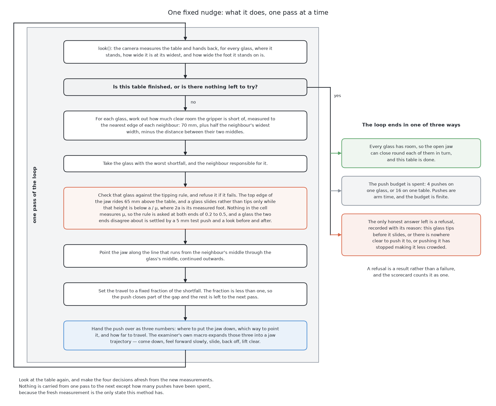
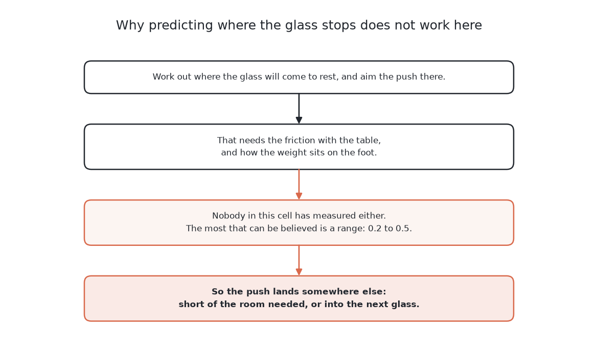
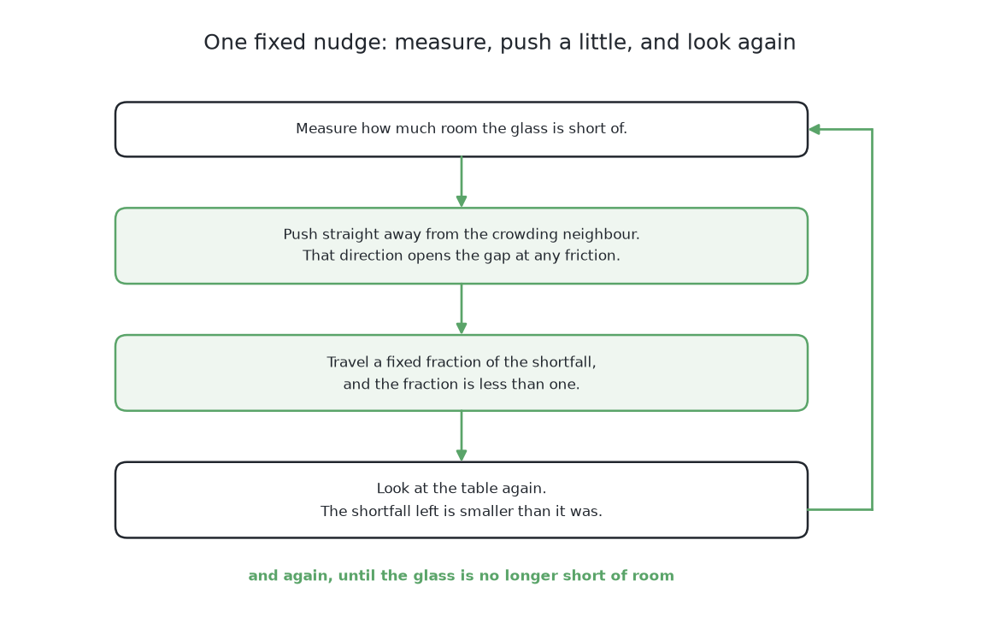
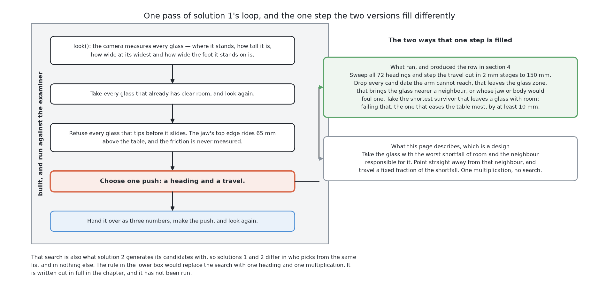

# One fixed nudge

This page describes the first of the six solutions in about eight minutes of
reading. It is the one solution that holds no fitted numbers at all, and it is
also, on this book's scorecard, the one that finished the most tables and broke
nothing. By the end of this page you will know the one idea it rests on, the
loop it runs, what it costs, what it scored on the shared examiner, which part
of it was run and which part is a design, and the three things it cannot do
that the other five were built to try. The full method is in [the chapter on
this solution](../04_one-fixed-nudge/01_what-it-is.md), which is about an hour
of reading.

## Contents

1. [What it is](#1-what-it-is)
2. [How it works](#2-how-it-works)
3. [What it needs](#3-what-it-needs)
4. [What it scored](#4-what-it-scored)
5. [Where it is strong and where it breaks](#5-where-it-is-strong-and-where-it-breaks)
6. [When to choose it](#6-when-to-choose-it)

## 1. What it is

The problem this book sets is that glasses stand too close together for the
gripper to close round any of them, so the arm has to drag them apart first,
without knocking any of them over. [What is asked
for](../01_the-problem/01_what-is-asked-for.md) states that in full.

The hard part is that nobody in this cell knows what a push will do. Where a
pushed glass comes to rest depends on the friction between its base and the
table and on how its weight is distributed, and neither of those has been
measured. Every solution in this book is a different answer to that one
difficulty, and this solution's answer is the simplest available: **do not
predict anything.**

Instead of working out where the glass will stop, it moves the glass a little
way in a direction that must be an improvement, looks at the table again, and
repeats. A direction away from the neighbour that is crowding a glass is an
improvement for any friction whatever, so the direction cannot be wrong. The
distance is deliberately too small, so overshooting is impossible. What remains
is a method that makes no claim it could be wrong about.

That is what makes it the control for the whole comparison. It cost no data, no
training time and no hardware, so a solution that merely matches it has earned
nothing.

The two pictures below say why the loop has that shape. The first is the method
this one refuses: aiming the push at where the glass will stop. The second is
what this solution does instead.

So this solution makes no prediction at all. It measures, pushes a little way in
a direction that is right whatever the friction turns out to be, and then looks
at the table again.

## 2. How it works

The loop runs five steps, and only the fourth one is interesting.

**It looks.** The camera reports, for every glass, where it stands, how tall it
is, how wide it is at its widest, and how wide the foot it stands on is. Every
one of those readings carries a measurement error.

**It takes every glass that already has clear room**, which leaves more space
for the rest, and looks again. Sometimes no pushing is needed at all.

**It refuses every glass that tips before it slides.** A push applied too high
up a glass tips it over instead of sliding it, and the height at which that
happens follows from the glass's foot width and from the friction. The jaw
rides at a fixed height belonging to the gripper, so the method can ask the
question in advance — but the friction is never measured, so it asks at both
ends of the believed range. A glass the two ends disagree about is settled by a
5 mm test push and a look before and after. The refusal is arithmetic, not a
judgement, and it happens before any choosing.

**It chooses one push.** This is the step the rest of this page is about, and
it is also the step where what was run and what this solution proposes part
company.

**It makes that push and looks again.** The push is handed over as three
numbers — where to start, which way, how far — and the examiner's own macro
expands those into the jaw trajectory every solution in this book is judged on.
The loop ends when every glass has room, when the push budget is spent, or when
the only honest answer left is a refusal.

### The rule, and the planner that ran in its place

The rule this solution proposes is one quantity and one multiplication. For
each glass it works out the **shortfall**: how much clear room the gripper is
short of, measured to the nearest *edge* of each neighbour rather than to the
neighbour's middle, because it is the neighbour's edge that the fingers would
hit. It takes the glass with the worst shortfall and the neighbour responsible
for it, points the jaw along the line from that neighbour's middle through the
glass's middle, and sets the travel to a fixed fraction of the shortfall.
Pushing a fraction means the glass always moves less than it needs to, so the
method never overshoots; the remaining shortfall is simply smaller next time.
That fraction is the entire configuration of the method.

**That rule is a design, and the row in section 4 was not produced by it.** The
planner that exists in the repository chooses by searching instead: it sweeps
every heading round the glass, steps the travel out to a limit, drops every
candidate that fails one of four geometric tests, and takes the shortest
survivor that leaves a glass with room. Everything round that step — the
examiner, the room test, the shortfall, the tipping rule, the loop and the
refusals — is built and has been run. [What is built and what is a
design](../04_one-fixed-nudge/02_how-it-works.md#5-what-is-built-and-what-is-a-design)
separates the two line by line.

That search is also what [geometry generates, a model
ranks](03_geometry-generates-a-model-ranks.md) produces its candidates with, so
solutions 1 and 2 differ in who picks from the same list and in nothing else.
It is worth knowing which of the two you are reading about, because the rule
and the search have different weaknesses and section 5 keeps them apart.

## 3. What it needs

Everything it needs is either already produced by the camera work or is a
constant belonging to the gripper, which is why it could be built first.

It needs **the measurements, and nothing beyond them**: each glass's position
and widest width, which the room test and the shortfall need, and each glass's
foot width and height, which the tipping rule needs. It does not use the view
of the table from the top, and it never reads the simulator's record.

It needs **the gripper's own numbers**, such as the clear room the fingers need
and the height the jaw rides at. These belong to the hardware rather than to
any glass, so the project allows them to be written down, and none of them is
tuned.

It needs **no labelled data, no training run and no weights file**, because
nothing in it is fitted. There is nothing to keep in step with the cell when
the cell changes.

It needs **one library, and it is NumPy**. Nothing is downloaded, so there is
no licence inherited from anybody else's training data.

It needs **no accelerator, and the figure is zero.** The whole decision is a
few hundred arithmetic operations over four to six glasses, and it finishes
long before the arm has moved anywhere. On the compute column of the scorecard
this solution is the zero the others are read against.

What it does need is **arm time**, paid in pushes and in looks, and the budget
is what bounds them.

## 4. What it scored

Every solution is given the same 50 tables holding 251 glasses, of which 193
have no room at the start, spends the same push budget, and is judged by the
same scorecard, which [the examiner](../02_the-examiner.md) describes. A table
is **finished** when every glass on it could be picked up, and **wrong** when
the run ended in a state the cell should never reach.

The row below is the searching planner described in section 2, not the fixed
fraction rule. It is quoted here because it is what the repository runs, and
because the two share everything except the one step.

| tables finished | tables wrong | glasses racked | toppled | pushes |
|---|---|---|---|---|
| **33** | **0** | 195 | **0** | 213 |

**It finished more tables than any of the other five, and it broke nothing.**
Those are the two columns that matter most, and this solution holds the best
figure in both. The only solution that racked more glasses is [a world model,
then plan with it](05_a-world-model-then-plan-with-it.md), which did it in half
the pushes and toppled one glass doing so.

It left 17 tables unfinished and refused 56 glasses, which is where its score
goes. A refusal is an acceptable answer on this scorecard, so none of those 56
cost it a wrong table.

One more property of this row is worth knowing. Nothing in this method was
fitted and nothing in it is drawn at random, so it behaves the same way on the
hundredth table as on the first. The repeated runs the examiner requires of the
trained solutions, because their training and their actions both vary, are not
needed here, so this is the one row in the book that carries no spread. The
full table for all six is in [the results](../10_the-results.md).

## 5. Where it is strong and where it breaks

Its strengths follow from how little it claims, and so do its weaknesses, which
is what makes it a clean control rather than merely a weak solution.

It cannot be wrong about pushing, because it says nothing about pushing. Every
other solution has a prediction somewhere that can be wrong. This one has a
direction that is right for any friction and a distance that is deliberately
too small.

Its answer can be read. Every step is a number that can be printed, and every
refusal has a reason that can be checked with a ruler.

Short pushes are safe pushes. Every millimetre of travel is a millimetre in
which something can be knocked, so a method whose instinct is to move a glass
as little as possible has a good instinct, and the small fraction gives it that
instinct for free.

It exercises the whole contact sequence with no planning code in the way. When
something falls over while this book's work is being built, this method tells
you the fault was in the contact, because there was no plan to be wrong.

The weaknesses are real and they are structural. Two of them belong to the
fixed fraction rule in particular, and the third belongs to both versions.

**The rule has one heading to offer, and sometimes there is nowhere to stand.**
The approach runs along the same line as the push, so pushing a glass straight
away from its neighbour asks the arm to put a long tool where the neighbour is.
The jaw is 270 mm long behind its fingertips and 90 mm across, so in a tight
group that is impossible. The searching planner can look for another heading
and the rule cannot, which is the clearest difference between them — and the
56 refusals in the run show the constraint biting even with all 72 headings
available.

**The rule cannot help a glass crowded from two sides**, because a push away
from one neighbour is a push towards the other. No value of the fraction fixes
that; the difficulty is in the direction, and it is the main reason the
searching planner exists.

**Neither version learns anything from what the jaw felt.** How far a glass
moved for a given push is the only evidence this cell can produce about the
friction, and nothing here keeps it. The one exception is the small test push,
which reads whether the glass moved at all in order to settle the tipping
question, and then throws the rest away. That is exactly why every other
solution has something to improve on.

## 6. When to choose it

Choose this first, always. It is the cheapest way to get a real push happening
against a real glass, every later solution needs the same contact sequence and
the same refusals, and it gives the comparison its floor before anything
expensive is built.

Think hard before shipping it, and the reason is not its score. It never asks
whether a better push exists than the shortest one that works, and it has no
way to tell that a glass should have been moved out of the way first so that a
second glass had somewhere to go. On this book's fifty tables those limits cost
it seventeen unfinished tables and nothing worse, because a refusal is an
acceptable answer here. In a cell where a refusal is not acceptable, they would
matter much more.

Read it in both directions. The usual reading is about the other five: if a
model cannot beat a fixed nudge, it has earned nothing. The other reading is
about the problem. This method works at all only because the glasses stand
upright on a flat table, the gripper's clear room is a known constant, the
camera reports a position and a width for every glass, and a refusal is an
acceptable answer. **Each of the other five needs fewer of those promises than
this one does**, and that is what they are for.

The code is in
[`src/09_pushing-the-glasses-apart/01-one-fixed-nudge/`](../../../code/src/09_pushing-the-glasses-apart/01-one-fixed-nudge)
and it writes its own `results.json` beside itself. The full treatment, with
open and closed loop explained, why the push is a fraction rather than all of
the shortfall, why repeating replaces predicting, and which parts are code and
which are design, starts at [what it
is](../04_one-fixed-nudge/01_what-it-is.md).

← [The six solutions — same table, six ways to push](01_how-the-six-compare.md) · [Geometry generates, a model ranks](03_geometry-generates-a-model-ranks.md) →
