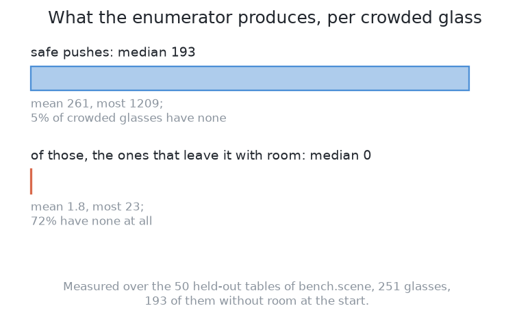
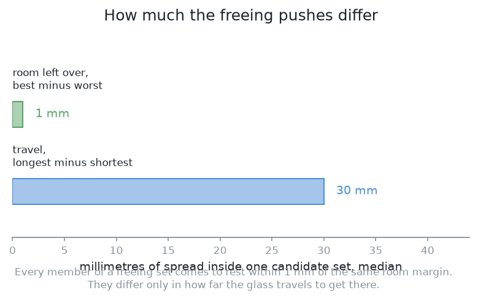
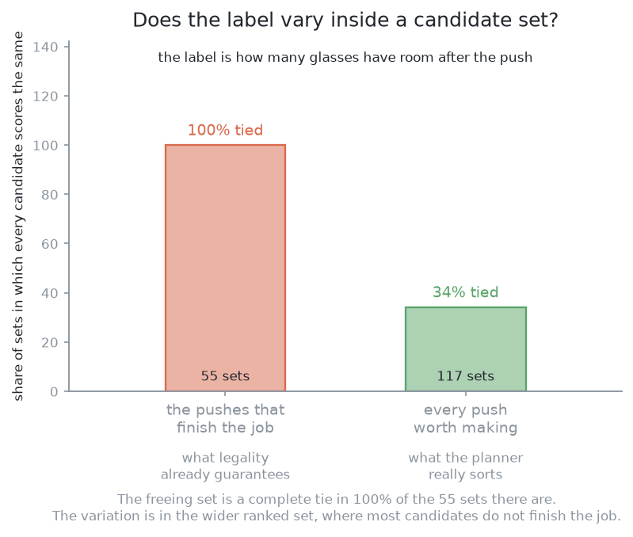

# How it works

This page explains what happens inside this solution, part by part. It
follows [what it is](01_what-it-is.md), which states the question the
solution answers and the single idea it rests on.

## Contents

1. [What the geometry proposes](#1-what-the-geometry-proposes)
2. [What the filter removes before the model is asked](#2-what-the-filter-removes-before-the-model-is-asked)
3. [The model: boosted trees that score one candidate at a time](#3-the-model-boosted-trees-that-score-one-candidate-at-a-time)
4. [The inputs are lengths, counts and ratios](#4-the-inputs-are-lengths-counts-and-ratios)
5. [How it is trained](#5-how-it-is-trained)
6. [Where the learned part sits is what makes it safe](#6-where-the-learned-part-sits-is-what-makes-it-safe)
7. [It is the teacher](#7-it-is-the-teacher)

## 1. What the geometry proposes

The enumerator is the built half of this solution, so it comes first, and its
exact shape decides what the model is later handed.

For one crowded glass it sweeps **72 headings**, one every 5°, all the way
round. Along each heading it steps the travel out in **2 mm steps to 150 mm**.
At every step it asks four questions: does the moving glass's own path clear
every other glass, does the swept path of the fingers clear them, does the
swept path of the wrist and the gripper body clear them, and is the destination
both inside the glass zone and inside the ring the arm reaches comfortably. The
first step that fails ends that heading, because a clash found at one length is
still there at any greater length along the same line.

Two properties of that loop decide everything that follows, and both are
structural rather than accidental.

**Each heading stops at the first travel that gives the glass room.** Once a
push works, no longer push along the same heading is offered. So a heading
offers at most one job-finishing push, which puts a ceiling of 72 on how many
of them one glass can have, and every one of them is the shortest push that
works along its own line.

**The pushes that do not finish the job are kept as well.** A push that leaves
the glass still crowded, but less crowded than it was, is kept as long as it
cuts the table's total shortfall of room by at least 10 mm. The printed rule
uses this second kind only when there is no job-finishing push anywhere on the
table. This set is the large one, because every 2 mm step along every heading up
to the first clash is in it. `spread.json` holds the counts: over 269 crowded
glasses on the training tables the middle one is offered 84 candidates, and over
101 whole-table decisions the middle one is offered 261.

The consequence of the first property is the most important thing in this
document. Because each heading stops the moment the push works, **every
job-finishing candidate lands on the same contour**: just past the line where
the glass has the room it needs, plus the 10 mm of aiming margin the planner
adds so that a push landing a little short still clears. They are the same
achievement reached from different directions. So on the question the run is
scored on — how many glasses have room afterwards — those candidates are a
**tie**, and they differ only in how far the glass has to travel, which the
geometry prints for nothing.

**A ranking problem in which the candidates within a group are tied carries no
information.** A model fitted to that group would return the same value for
every member of it, which is the correct answer and a useless one. So the
signal a ranker could use does not live in the job-finishing set at all. It
lives in the wider set of pushes that only ease the crowding, where the
candidates genuinely differ from one another, and where the geometry is
guessing at a sequence of pushes rather than finishing the job in one.

Three measurements over fifty held-out tables say how far that goes, and the
three pictures below take them one at a time.

The first counts what the enumerator produces for each crowded glass. The gap
between the two bars is the whole story of this cell: the geometry can almost
always find a push that is safe, and it can rarely find one that finishes the
job, so 72 per cent of the time the planner falls back on a push that only helps
a little.

The second asks how much the job-finishing pushes differ from one another when
there are several. A freeing push stops at the first travel that works, so every
survivor comes to rest within a millimetre of the same room margin. They differ
only in how far the glass travels to get there, and the geometry prints that
number for nothing.

The third asks whether the thing a ranker would be fitted to varies inside a
candidate set at all. In the job-finishing set it never does. In the wider set
of pushes that only ease the crowding it does, which is the only place a ranker
could find anything to learn.

That is a sharp conclusion to reach before the model has been described, and it
is the honest shape of this solution. The arrangement is excellent. The question
it is asked here is one the arithmetic has largely answered already.

## 2. What the filter removes before the model is asked

One of those four tests deserves its own section, because it is the one that
can cause the failure nothing can repair, and because the height it is
evaluated at is easy to get wrong.

[Pushing without toppling](../01_the-problem/03_pushing-without-toppling.md) sets out the rule in
full, and the short form is that a glass pushed at height `h`, standing on a
foot `2a` across, on a table it rubs against with friction `μ`, slides while

    h  <  a / μ

and tips over above that. The height that counts is the **top edge of the
jaw**, not its middle, because a glass that is wider higher up meets the top
edge first. The middle of the jaw rides at 50 mm, which is as low as the
gripper reaches without fouling the table, and the fingers are 30 mm tall, so
the top edge stands at 65 mm. Those are the gripper's own numbers and they do
not change from one glass to the next. What changes is `a`, because every glass
has its own foot, so **the limit is computed for each glass from its measured
foot width** rather than agreed once for the whole kind.

The term nobody has is `μ`. Nothing in the cell measures friction and the examiner
never tells any solution the coefficients it runs the physics with, so the
limit a solution computes is only as good as a guessed number. The geometry
already in this repository handles that by carrying the whole range it is
willing to believe, **0.2 to 0.5 for glass on a dry wooden top**, and asking a
three-way question of every glass. If the limit clears the jaw's top edge even
at the most pessimistic friction in that range, the glass is safe to push. If
it fails even at the most generous one, the glass is refused. If the two ends of
the range disagree, the arm settles it by making a **5 mm push** and looking
before and after: a glass that slid has moved, and a glass that leaned instead
fell back where it stood.

All of that runs inside the filter, which means it runs **before** the model.
So a glass that would tip never reaches the ranker, and no score the model can
produce brings it back. The rule behind the safety claim in the introduction is
that everything which can reject a push is arithmetic, and the model comes after
all of it.

## 3. The model: boosted trees that score one candidate at a time

Now the fitted half. The model has to turn a short list of quantities into one
number, so this section explains what kind of model does that and why this kind
was chosen.

**A decision tree** is a sequence of threshold questions arranged as a tree.
Each internal point of the tree asks one question about one input, such as "is
the travel more than 50 mm?", and sends the candidate left or right depending
on the answer. A candidate falls through the questions until it reaches a leaf,
and the leaf holds a number, which is the tree's prediction. A single tree of
this kind is a crude predictor: it can only produce as many distinct answers as
it has leaves, and its answer changes in steps rather than smoothly.

**Boosting** is how a crowd of crude predictors is turned into a good one. Fit
one shallow tree to the data. Work out what it got wrong, candidate by
candidate. Then fit the next tree not to the original target but to those
errors, so that the second tree's job is to correct the first. Add the two
together, work out what the sum still gets wrong, and fit a third tree to that.
Repeat. Each tree is weak, each one is fitted to whatever the sum of the
previous ones has left over, and the sum of all of them is the model. It is
gradient descent, where each step down the slope is taken by adding a small tree
rather than by adjusting a coefficient. Two hundred trees, each three questions
deep, is an ordinary size for the 4,844 rows this solution has.

This solution uses the **regression** form, which predicts a number, and it
uses it **pointwise**, which means the model is shown one candidate at a time
and scores it on its own without being told what it is competing against. Each
candidate gets one scalar score, and the candidates are then sorted by it. That
is the simplest of the three ways a ranking can be fitted, and the section on
general ideas below says what the other two are and what the choice costs.

### Why trees rather than a network

A number predicted from a short table of quantities of different kinds — an
angle, several lengths, a count, a ratio — is the case decision-tree boosting
was made for, and three properties of a tree are the reason.

A tree does not care that its inputs are on different scales. An angle in
radians, a distance in millimetres and a count of neighbours have three
different ranges, and a network has to be handed them on comparable scales,
because every input enters through a weighted sum and a large-valued input would
otherwise dominate that sum before training begins. A tree never sums its
inputs. It compares one input against one threshold, so rescaling any of them
changes nothing at all.

A threshold is also the natural shape of the answer here. Much of what makes a
push good in this cell is a comparison against a limit: is the destination clear
by more than the gripper needs, is the push height below the topple limit for
this foot, is the destination further from the zone edge than the aiming error.
A tree is built out of exactly those comparisons and expresses each in one
question, where a network has to build a sharp comparison out of smooth weighted
sums and needs rows of data to do it. And a boosted-tree model reports how much
each input contributed to its predictions, so a wrong answer can be
investigated by a person reading a printed candidate list.

**A network would also work**, and the trade is worth stating rather than
dismissing. On this input a small network needs more rows to reach the same
accuracy and explains nothing about why it answered as it did, which is a loss
on both counts. But the input would not have to stay as it is. Hand the model an
**occupancy grid** — a picture of the zone, with the glasses marked on it —
rather than a short list of numbers, and a network becomes the right choice and
a tree the wrong one, because a network reads a grid naturally and a tree would
have to ask threshold questions about individual cells of it. So the real choice
is not trees against networks. It is a short list of relations against a picture
of the table, and the model follows from that choice rather than the other way
round. This solution chooses the short list, for the reason the next section
gives.

## 4. The inputs are lengths, counts and ratios

Every input this model is shown is a length, an angle, a count or a ratio, and
**none of them is an address on the table**. That is the most important design
decision in the fitted half, and it is a decision about generalisation rather
than about convenience.

The list is short. For each candidate push the model is shown, in the order
`features.py` writes them:

- **the contact angle**, measured relative to the line from the glass's middle
  to the nearest neighbour's edge, so that "pushing straight away from the
  crowd" is one value of one input rather than a different value for every
  place on the table;
- **the push distance**, which is how far the glass is to travel once the jaw
  has touched it;
- **how much clear room the destination would have**, which is every clearance
  recomputed with the glass moved to where this push would put it;
- **how far the destination is from the edge of the glass zone**, and **how far
  it is from the rack**, because a push that is legal but lands close to either
  has very little margin for the error a push actually carries;
- **how many neighbours sit within a radius** of the glass being moved, which
  is the one input that describes the crowd rather than the push, and describes
  it as a count;
- **the foot width of the glass being moved**, which is what the topple limit
  is computed from and also what decides how the glass turns as it slides;
- **the push height as a fraction of the topple limit**, which is the jaw's top
  edge divided by the limit for this glass's measured foot at the most
  pessimistic friction in the believed range. The height itself is fixed, so
  this ratio varies only with the glass, and it says how close to the line this
  push is standing.

Each of those is a relation between two things in the scene, or a property of
the glass being moved, or a comparison against a limit. Not one of them is "this
push happens at x = 430, y = −290".

**That exclusion is deliberate, and the reason is what a position would teach
the model.** The examiner's crowded tables are drawn by standing most glasses
deliberately close to a glass already down and the rest anywhere they fit, as
[the examiner](../02_the-examiner.md) describes. Over many tables that produces a
distribution: crowds form more often in some parts of the zone than others,
purely because of where the arm reaches, where the rack sits and how the
placement rule happens to work. Give the model the position and it will find
that distribution, because it is real and it predicts the training labels. The
model would then be scoring a push by **where on this cell's table it happens to
be**, which is a fact about this examiner's placement rule and not a fact about
pushing. Change the rack, move the zone, or draw the tables by another rule, and
the model is quietly describing a cell that no longer exists, while nothing
errors and nothing looks suspicious.

The relational inputs make most of the right thing true by construction instead.
Take any arrangement and slide it across the zone, and six of the eight inputs
are unchanged, because each of those six is a relation between parts of the
scene that moved together. The contact angle, the push distance, the room at the
destination, the neighbour count, the foot width and the topple ratio are the
same numbers in the new place as in the old one. A model given coordinates would
have to learn that from data, and it would learn it imperfectly from a finite
number of tables.

The other two do move, and they should. The distance to the edge of the glass
zone and the distance to the rack are measured to features of the cell that did
not slide with the glasses, so sliding the arrangement changes both. They are
still relations rather than addresses, which is the distinction that matters: a
destination 15 mm from a boundary has 15 mm of margin wherever that boundary is,
and a push with very little margin really is a worse push than one with plenty.
A coordinate pair carries no such meaning. The rule to carry away is that a
model should be shown the quantities the physics depends on, and the physics of
a push depends on distances, angles and widths. It does not depend on where the
table's origin was put.

## 5. How it is trained

The training set follows from the two halves above, and the pleasant part is
that collecting it needs no extra work.

**Generate the candidates geometrically, on the training tables.** The examiner
numbers its tables and splits those numbers, with everything above a fixed
dividing line reserved for testing, so training draws only from below it and no
solution is ever marked on a table it was fitted on. For each crowded table the
enumerator produces its candidate set exactly as it would at run time.

**Execute every candidate on the examiner's tables.** Reset the table, make the
push, measure the result. This is the step that would be unaffordable on a real
arm and costs almost nothing here, because a push in MuJoCo is cheap and the
examiner runs faster than real time. The 4,844 candidate-and-outcome pairs this
solution was fitted on came from 190 training tables in minutes of examiner
time, which is the single reason its data cost is near zero.

**Label each one with what happened.** The label has two parts. The first is
**how much clear room was gained**, measured over the whole table rather than
over the pushed glass alone, so that a push which frees one glass by crowding
another is not rewarded for half of its effect. The second is **whether the
glass toppled**, which is recorded for every push and makes a push the worst
possible candidate when it is true.

**Fit the regression on those labels.** One row per candidate, one number per
row, and the ordering of the model's predictions is all that is used
afterwards.

Two things about that labelling deserve more than a line.

**Toppling appears in the training set even though the filter rejects unsafe
pushes**, and this is not a contradiction. The filter rejects a push whose
contact height is above the limit **as the geometry computes it**, and that
computation contains a guessed friction. When the guess is too generous the
limit comes out too high, the filter passes a push it should have refused, and
the glass goes over: 57 of the 4,844 rows are of that kind. They are exactly the
rows worth having, because they teach the model to prefer pushes that stand
further from the limit even among pushes the arithmetic called safe. So the
ratio of push height to topple limit earns its place in the input list. It is
the input through which the model can express caution about a number nobody
measured.

**The label is only as honest as the examiner**, and the honest part of that
sentence is the friction. The examiner's coefficients decide every topple in the
training set, and they are three fixed numbers rather than a measurement of
anything real. A model fitted on these labels has learned what topples on this
examiner, and carrying it to a different table would mean carrying an assumption
about friction that was never checked.

One guard belongs on retraining, and it is the ordinary failure of every
feedback loop built on a model's own choices. **Only the chosen candidate is
ever executed for real during a run.** So a log collected while the model is
driving the arm holds outcomes only for the region the model already prefers,
and retraining on that log locks in whatever the model believed first. The
standard repair is to take the second-ranked candidate occasionally, which
costs a little and keeps the data honest. Retraining itself belongs between
runs and never during one, because a model that changes during a run makes that
run impossible to reproduce, and a run that cannot be reproduced cannot be
debugged.

## 6. Where the learned part sits is what makes it safe

The two previous sections described a fitted model inside a machine that
handles glass, so the obvious question is what happens when it is wrong. The
model's output is a permutation of a set, so the only mistake available to it is
putting a worse candidate before a better one. The arm then makes a push that
was safe, legal and less useful than another safe legal push would have been,
looks at the table, and chooses again. That costs seconds of arm movement and
one entry in the push count. Toppling, leaving the glass zone, leaving the arm's
reach and striking the rack are all settled before the model is consulted, and
nothing later reads a score back into a rejection. **So the ceiling on how badly
this can fail comes from the arrangement and not from the model's accuracy.** A
better model makes wasted pushes rarer. Only the geometry decides how bad things
can get.

This is precisely the position a learned ranker occupies in the work of telling
the glasses apart in a picture. There, the shared machinery for [looking again
at what was
hidden](../../08_seeing-the-glasses/02_the-problem/02_looking-again-at-what-was-hidden.md)
has to decide which of several places to stand the camera should be tried first.
The geometry works out every candidate position and rejects the ones that are
unreachable or whose line of sight is blocked, and a small fitted model orders
what is left by how much it would be worth looking from there. The reason given
there is the reason here: where the model sits is why it is safe to have at all,
because a bad ordering costs one wasted look and nothing worse.

The two cases differ in one respect, and it raises the bar here rather than
lowering it. A wasted look costs seconds of arm movement. **A wasted push costs
seconds and a contact with a glass**, and contact is where things break. So a
push ranker has to be better than a viewpoint ranker to be worth the same
amount.

## 7. It is the teacher

The second thing that makes this solution matter more than its score is that
two other solutions cannot start without it, and this is the largest single
thing it contributes.

[Solution 3](../06_imitation-from-demonstrations/01_what-it-is.md) and [solution
6](../09_the-same-model-fine-tuned-here/01_what-it-is.md) both learn from
**demonstrations**, which are recorded examples of the task being done. A
demonstration is one run of a crowded table, from the measurements through a
sequence of pushes to a table where every glass has room, with the action
recorded at each step. Collecting them is normally the expensive part of
imitation learning, because normally a person has to drive the arm through the
task by hand, and that expense is why imitation learning is often judged on how
few demonstrations it needs.

**Here they cost nothing.** This solution can be run over as many training
tables as the examiner can draw, and each run records a complete demonstration
without a person present. The pushes in it are safe by construction, because the
same filter that protects a real run protects a recorded one. Two hundred
training tables gave 896 pushes in 52 seconds. So the cost of the demonstration
set is examiner time, and nothing else.

That is a real contribution and it has to be stated with its cost, because the
cost is not obvious and it reaches both of the solutions that learn from it.

**Those two inherit this solution's ceiling.** A policy fitted on
demonstrations is fitted towards reproducing the behaviour in them. Every
demonstration here was produced by ordering candidates the enumerator wrote
down, so the demonstrations contain only the pushes the enumerator can express.
If the heading sweep is too coarse to include the push a situation really
wanted, or if one of the tests rejects something that would in fact have been
fine, that push appears in no demonstration and the policy fitted on them has
no way to discover it. A learner trained purely on this teacher therefore has
this teacher's ceiling, whatever its own capacity. The usual repair is to let
the policy act, score what happens, and learn from that as well, which stops
being imitation learning and starts being something more expensive.

**And filtering the demonstrations to successes trains on a biased sample.**
The natural thing to do with a recorded set is to keep the runs that finished
the table and discard the rest, because a policy fitted on failures learns to
fail. But the runs that finished are not a random sample of the tables. They
are the tables this solution happens to be good at: the ones where the
enumerator found a job-finishing push, where the crowding was the kind its
inputs describe well, where the glasses were not close to the topple limit. The
tables it struggles with — the ones where the geometry runs out of useful pushes
before every glass has room, which is 61 of the 66 refusals in its own
`results.json` — are the ones most likely to be discarded. So a policy fitted on filtered successes is fitted
on an easier distribution of tables than the one it will be marked on, and it
will look better in training than it turns out to be. Keeping the failures with
their outcomes recorded is one answer, and weighting the kept runs so that hard
tables are not under-represented is another. Doing neither is the mistake worth
naming here, because it is the default thing to do.

← [What it is](01_what-it-is.md) · [The code](03_the-code.md) →
