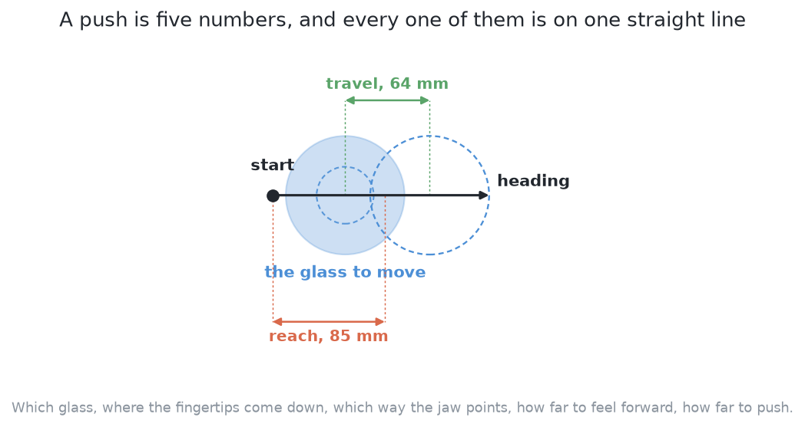

# The code

This page shows the code at the heart of this solution, and says what the
solution hands back to the rest of the cell. It follows [what it
is](01_what-it-is.md), and [how it works](03_how-it-works.md) explains, part by
part, what the code below is doing. The second explains the first,
which is why they are on one page.

## Contents

1. [The code at the heart of it](#1-the-code-at-the-heart-of-it)
2. [The pushes are what this contributes](#2-the-pushes-are-what-this-contributes)
3. [How the concepts fit together](#3-how-the-concepts-fit-together)

## 1. The code at the heart of it

Everything this solution adds to [solution
1](../04_one-fixed-nudge/01_what-it-is.md) sits in two places, and they are small
enough to read here. The first is the model itself: scikit-learn's boosted
trees, fitted once and then asked for one number per candidate so that the
candidates can be sorted. The second is the number those trees are asked to
predict, which is measured by making the push on the examiner and reading the
table afterwards. The candidates themselves are not this solution's own — they
come from solution 1's enumerator unchanged — so the choosing is the only thing
that differs, and the label is what the choosing is taught to want.

The borrowed library does its work in a constructor and one call to `fit`, and
the sort that follows is the model's entire effect on the run. Both are in
`src/09_pushing-the-glasses-apart/02-geometry-ranked/ranker.py`, and the steps
below are marked in it with the same numbers.

The file runs in two bursts. The first happens once, before any run of the arm.
Step 1 sets up the trees without showing them anything, fixing how many there
are, how deep each one asks its questions, and how small a correction each one
may add. Step 2 fits them to the training table, which is one row of numbers per
candidate and one measured outcome per row. Step 3 hands the fitted trees back
wrapped in an object that answers with one score per candidate.

The second burst runs once per push. Step 4 asks the geometry for every safe push
on the table, along with the reason any refused glass has none. Step 5 returns
straight away when the geometry allowed nothing, because there is then nothing to
put in order. Step 6 turns each surviving push into its eight numbers and asks
the model to score it. Step 7 sorts those scores highest first, by a stable sort,
so that candidates the model scored equally keep the order the geometry wrote
them in. Step 8 hands back the sorted pushes, their scores in the same order, and
the refusals.

```python
from sklearn.ensemble import GradientBoostingRegressor
...
TREES = 200
DEPTH = 3
LEARNING_RATE = 0.05
...
    @classmethod
    def fit(cls, rows: np.ndarray, labels: np.ndarray, seed: int = 0) -> Ranker:
        # Step 1: set up the trees, untrained -- how many, how deep, how small a step each one takes
        trees = GradientBoostingRegressor(
            n_estimators=TREES, max_depth=DEPTH, learning_rate=LEARNING_RATE, random_state=seed
        )
        # Step 2: fit them to one row of numbers per candidate and the room that candidate gained
        trees.fit(rows, labels)
        # Step 3: hand back the fitted model -- from here it answers with one score per candidate
        return cls(trees)
...
def ranked(
    seen: list[Seen], skip: set[int], score: Scorer
) -> tuple[list[Candidate], np.ndarray, dict[int, str]]:
    """Every safe push on the table, best first, with its score and the refusals.
    ...
    """
    # Step 4: ask the geometry for every safe push on the table, and why a refused glass has none
    kept, why = survivors(seen, skip)
    # Step 5: stop here if the geometry allowed nothing -- there is nothing for the model to order
    if not kept:
        return [], np.zeros(0), why
    # Step 6: describe each surviving push as its eight numbers and ask the model to score it
    scores = np.asarray(score(features.rows(seen, kept)), dtype=np.float64)
    # Step 7: sort by score, highest first; a stable sort leaves tied candidates in their old order
    order = np.argsort(-scores, kind="stable")
    # Step 8: hand back the pushes best first, their scores in the same order, and the refusals
    return [kept[i] for i in order], scores[order], why
```

What `labels` holds is the whole design decision, and it is produced by making
one candidate on the examiner's tables and measuring what it did, in
`src/09_pushing-the-glasses-apart/02-geometry-ranked/rollout.py`. Its steps are
numbered from one again, because this is a separate file and it runs before any
of the eight above.

Step 1 puts the table back exactly as it was, so that every candidate is judged
from the same arrangement. Step 2 makes the push for real and keeps what the jaw
felt while it pushed. Step 3 looks at the table again with the camera, exactly as
the arm would during a run. Step 4 measures the room gained, by taking the
table's shortfall of room afterwards away from its shortfall before. Step 5 asks
whether any glass is now leaning further than a standing glass ever leans. Step 6
writes the label down: a topple scores worse than any push can be good, and
anything else scores the room it gained.

```python
def roll(table: Bench, before: Before, candidate: Candidate) -> Rolled:
    """Put the table back as it was, make the push, and measure what it did."""
    # Step 1: put the table back exactly as it was -- every candidate is judged from the same start
    restore(table, before)
    # Step 2: make the push for real, and keep what the jaw felt while it was pushing
    felt = table.push(candidate.push)
    # Step 3: look at the table again with the camera, exactly as the arm would during a run
    after = table.look()
    # Step 4: measure the room gained: the table's shortfall of room before, less its shortfall now
    gained = nudge.shortfall(before.layout) - nudge.shortfall(truth(table))
    # Step 5: ask whether any glass is now leaning further than a standing glass ever leans
    fell = any(table.tilt(i) >= STANDING_TILT_DEG for i in table.on_table())
    return Rolled(
        # Step 6: a topple scores worse than any push can be good; anything else scores room gained
        label=TOPPLED if fell else gained,
        ...
    )
```

Two things are visible in those blocks together. `survivors` is called before
the model and `score` only reorders what it returns, which is the safety
argument this whole document rests on. And the label is `gained`, metres of
room the whole table gained, while the run is marked on how many glasses end up
grippable — the mismatch that costs the ranker the comparison with the printed
rule.

## 2. The pushes are what this contributes

One point about the output has to be clear, because it decides what a
comparison with the other five is a comparison of.

This solution thinks in **parameterised pushes**: which glass to move, where to
put the fingertips down, which way to point the jaw, how far to feel forward and
how far to push once it has touched. That is exactly what the examiner's
`push()` already accepts, and **the expansion of those numbers into a jaw
trajectory is a macro the examiner owns.** The examiner brings the closed jaw
down at the chosen start point, feels forward slowly until the force passes a
small threshold, pushes the asked-for distance, backs off a couple of centimetres
and lifts clear. Every parameterised push is expanded the same way by the same
code, so this solution gains nothing and loses nothing in that step.



So **what this solution contributes is the choice of push and nothing else**.
The trajectory is the examiner's, the physics is MuJoCo's, and the marking reads
the table afterwards rather than the action, which is what lets a five-number
push and a chunk of waypoints from a learned policy be compared at all. [The
examiner](../02_the-examiner.md) states that once so that no solution has to
argue it again.

The limitation that follows is genuine rather than a formality. A parameterised
push is a straight drag along one heading. A policy that emits waypoints
directly can describe a push that curves, slows, or changes direction partway
through, and no member of this solution's candidate set can express any of
those. That is part of the ceiling named in the previous section, and it is the
clearest example of what the enumeration costs.

## 3. How the concepts fit together

The pieces now join into one loop, and the loop is the one [pushing without
toppling](../01_the-problem/03_pushing-without-toppling.md) describes: plan, feel, look again.

Before any of it, and once, the model is fitted. Candidates are generated
geometrically on the training tables, every one of them is executed on the
examiner, each is labelled with the clear room the table gained and with whether
the glass toppled, and a few hundred boosted regression trees are fitted to
those labels on a table of a few thousand rows.

At run time, one pass of the loop goes like this. `look()` hands over where each
glass stands and how wide it is at its widest and at its foot, carrying the
measurement error [the camera work
reports](../../08_seeing-the-glasses/11_the-results.md). Any glass that already
has room is racked and removed from the problem. For each glass that is still
crowded, the topple limit is evaluated from its measured foot across the believed
range of friction, and a glass that tips before it slides at every friction in
that range is refused with the reason. For the glasses that remain, the
enumerator sweeps the headings, steps the travel out, applies its four tests and
keeps the survivors. Each survivor is turned into the short list of lengths,
angles, counts and ratios described above, the model scores it, and the
candidates are sorted. The highest-scoring push is handed to the examiner, which
expands it into a trajectory, carries it out, and reports what the jaw felt. Then
the arm looks again, and the loop repeats with the arrangement as it now is
rather than as it was planned to be.

Two things are worth holding on to from that.

**The loop is what recovers from a bad prediction.** Nothing here trusts that a
push lands where it was aimed. The arrangement is re-read after every push, so a
push that fell short, went too far or turned the glass is simply the state of the
table that the next pass plans against. That is why a wrong ordering costs a push
rather than a run.

**What the loop cannot recover is a toppled glass**, because nothing here lifts
anything. That single fact is why the topple limit is a refusal rule rather than
a risk weighed against the value of moving the glass, and it is why the model's
position after the refusal matters more than the model's accuracy.

← [What it is](01_what-it-is.md) · [How it works](03_how-it-works.md) →
