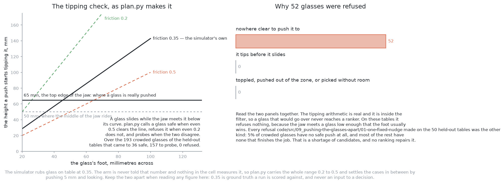

# A worked example

This page follows this solution through one arrangement of glasses with real
numbers, and then through the case this book keeps returning to, a glass that cannot be pushed safely,
because a worked example that shows only the easy case teaches the wrong
lesson.

## Contents

1. [When a glass cannot be pushed safely](#1-when-a-glass-cannot-be-pushed-safely)
2. [A worked example](#2-a-worked-example)

## 1. When a glass cannot be pushed safely

Every solution document answers this question, and this one's answer is that
**the refusal belongs entirely to the arithmetic and the model is never
consulted about it.**

There are two reasons a glass is refused here, and they are the two [the
problem](../01_the-problem/01_what-is-asked-for.md) names.

**It tips before it slides.** The limit `a / μ` is small when the foot is
narrow or the friction is high, and it can come out below the 65 mm at which
the jaw's top edge touches the glass — which is already the lowest contact the
gripper can offer, since the middle of the jaw rides at 50 mm and cannot go
lower without fouling the table. For such a glass there is no contact height
the arm can offer below the limit, so it tips whatever the arm does. Because the
friction is a guess rather than a measurement, the test is made at both ends of
the believed range: safe if the limit clears the jaw's top edge even at the most
pessimistic friction, refused if it fails even at the most generous one, and
settled by a 5 mm push and a look when the two ends disagree — and refused even
then if the lean such a push could cause is not small compared with the angle
the glass would fall past. That test runs inside the filter, so a glass it
refuses produces no candidates and the model is handed nothing.

**There is nowhere clear to push it to.** Every candidate along every heading
clashed with a neighbour, left the glass zone or left the arm's reach. The
candidate set is empty, and **a ranking over an empty set is still empty**.
This is the commoner refusal by a wide margin in the record this solution
extends: all 56 of the glasses that run left on the table were refused for this
reason, and not one for tipping. This solution's own run reports the same
glasses in two groups rather than one, separating those that had no candidate
at all from those whose candidates were all too slight to be worth making, so
its own results file spells the reason differently and counts the same
refusals.

Both refusals are reported with their reason, which makes the run **correct but
incomplete** rather than wrong. That distinction is the project's position
wherever contact is involved: a glass that was refused is still a glass
standing on a table, and anything later may yet move it or measure it, while a
glass that was pushed over is finished and the arm carries on working beside
it. So no fallback may be added that tries anyway, and the model is not a
fallback: it has no input through which to disagree with a refusal.

## 2. A worked example

Follow one crowded table through the whole method, because the argument is
easier to recognise once the candidate set has a shape.

**The table.** Four tapered glasses stand in the glass zone, drawn at
proportions from across that kind's range, so they are not all the same size.
Two of them stand comfortably clear of everything. The other two stand close
enough together that neither has the room the open jaw needs, and because the
room test measures to the neighbour's edge rather than to its middle, the two
are short by slightly different amounts even though they stand the same
distance apart — the narrower of the pair is the more crowded, because its
wider neighbour's rim reaches further into the gap.

**Two glasses leave before any push is planned.** The two that already have
room are racked and taken away, so the push planner is asked about a two-glass
table rather than a four-glass one. That is worth noticing because it is the
cheapest thing in this whole problem and it happens first on every table.

**The topple limit runs next, and defers.** Both remaining glasses stand on
feet whose measured width puts the limit above the jaw's top edge at the
pessimistic end of the believed friction range and below it at the generous
end, so the arithmetic returns neither "safe" nor "refused" but "try". The arm
therefore makes a 5 mm push on each and looks before and after. Both move, so
both are proven to slide and the run continues. Nothing about this step involves
the model, and if either glass had failed at both ends of the range it would
have been refused here with its reason and the model would never have seen a
candidate for it.

**The geometry proposes, at length.** For each of the two glasses the
enumerator sweeps 72 headings and steps the travel out in 2 mm to 150 mm,
discarding every step at which the glass's path, the fingers' swept path, the
body's swept path, the zone or the reach fails. What survives is a large set,
running to dozens of pushes for each glass and to hundreds across the table,
because most headings admit many lengths before anything clashes.

**A minority of those finish the job.** For each glass the job-finishing pushes
fall into two arcs: one pointing roughly away from the neighbour, and one
pointing round the neighbour the other way. There is at most one per heading, so
there are at most 72 of them per glass however many headings admit one.

**And every one of them scores the same.** Each leaves both glasses with room,
so the label is the same whichever is chosen, and each comes to rest just past
the line it had to clear plus the planner's 10 mm of aiming margin, because the
enumerator stopped each heading the moment the push worked. The only thing
separating them is how far the glass has to travel, and the geometry prints
that number for every candidate without being asked.

**The printed rule takes the shortest.** A model asked to order those
candidates can agree with that choice, or disagree with it and prefer a longer
push, or take longer to produce the same answer. There is no fourth thing it can
do, because the candidates are not distinguishable on the quantity the model was
fitted to predict.

**The wider set is where the model would have something to say.** Beyond the
job-finishing arcs, each glass has a large number of pushes that ease the
crowding without clearing it, and those do differ from one another. They are
also the pushes whose real outcome depends most on the friction and on how the
weight sits under the glass — which is to say on exactly the quantities a ranker
is not being asked about, and exactly the quantities [solution
4](../07_a-world-model-then-plan-with-it/01_what-it-is.md) fits a model of.

← [The code](03_the-code.md) · [What it needs](05_what-it-needs.md) →
