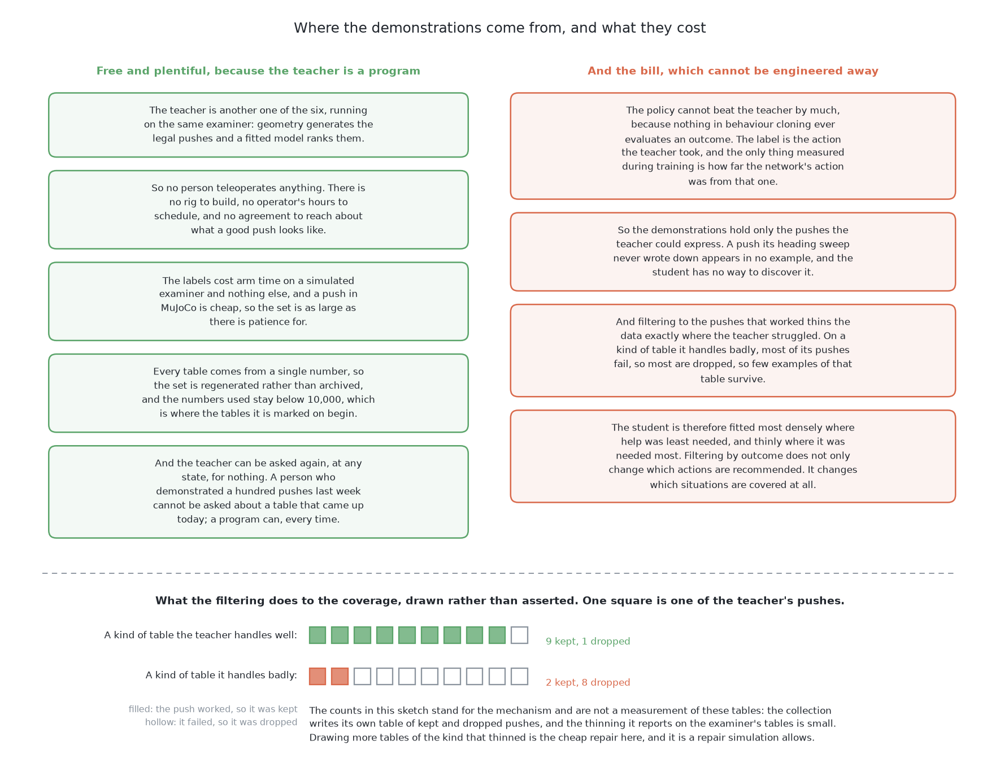

# What it is

> **What it uses** — [LeRobot](https://github.com/huggingface/lerobot), which
> holds reference implementations of this whole family of policies, with
> PyTorch underneath. No rented accelerator: this one fitted on the machine the
> project is written on, an Apple M4 with no NVIDIA card. The model is **ACT**,
> an action chunking transformer: it predicts a short run of future actions in
> one go rather than one action at a time. A second way uses **Diffusion
> Policy**, also in LeRobot, which reaches the same kind of answer by starting
> from noise and denoising towards an action chunk. Nothing is downloaded
> except the library: both models are fitted here, from random numbers, on
> demonstrations produced inside this project.
> **What it does** — the arm is shown what a good push looks like, many times
> over, and a network is trained to copy it. The demonstrations come from
> [geometry generates, a model ranks](../05_geometry-generates-a-model-ranks/01_what-it-is.md),
> which generates legal candidate pushes and ranks them, so they cost nothing
> but arm time on the examiner's tables. The trained policy then maps what the camera sees
> straight to a short run of jaw waypoints, with no geometry, no friction model
> and no candidate list anywhere inside it. Nobody writes down how to push a
> glass; the examples carry that, and the fitting extracts it.
> **How the output is produced** — a view of the table from the top goes in.
> The policy returns an **action chunk**: a short run of consecutive jaw
> waypoints, predicted together in one pass. The examiner carries those waypoints
> out directly, because there is nothing to expand — a chunk is already a jaw
> trajectory. The arm then looks again, and the fresh picture is the next
> input. One push is one chunk, and the loop runs until every glass has room,
> or the glasses that are left have been refused, or the push budget is spent.
> **What it costs** — the demonstrations are free in money and cheap in time,
> because the teacher is a program and the tables are simulated, so the whole
> dataset is arm time on the examiner's tables rather than human hours at a teleoperation
> rig. Training runs in hours — on this machine's own graphics processor, as it
> turned out, so the rental this document first budgeted for was not needed.
> The licence position is as simple as it gets here: LeRobot is Apache-2.0,
> which is the same permissive kind of licence as everything else this project
> depends on, and because no borrowed weights are used, the weights file this
> solution produces inherits no terms from anybody. The real price is paid
> elsewhere, in two parts named plainly below: the policy cannot be much better
> than its teacher, and the examiner has to grow two things it does not have.

> **The cell is described once, in [the cell](../../08_seeing-the-glasses/01_the-cell.md)** — the
> layout, the two places the camera works from, from the top and from the
> side, all four sensors, and the words this project uses them with. What
> follows is only what is specific to this solution.

## Contents

1. [Introduction](#1-introduction)
2. [The problem this solves](#2-the-problem-this-solves)
3. [The main idea](#3-the-main-idea)

## 1. Introduction

This document explains how to [push the glasses
apart](../01_the-problem/01_what-is-asked-for.md) by showing the arm examples
of good pushes and training a model to copy them. The method has a name,
**behaviour cloning**, and it is the plainest kind of learning there is: no
reward, no exploration, no physics, only a large table of situations and the
action somebody took in each one. The model that does the copying is ACT, an
action chunking transformer, taken from LeRobot, and a second way replaces it
with Diffusion Policy, which arrives at the same kind of answer by a different
route.

**This is built, and it is worth being exact about which parts.** [The test
examiner](../02_the-examiner.md) is built, the programmed geometry that picks a
landing spot for one glass at a time is built, and so is the ranker that turns
that geometry into [geometry generates, a model
ranks](../05_geometry-generates-a-model-ranks/01_what-it-is.md), which is this solution's
teacher. The two things the examiner was missing are built as well: the
straight-down rendered view this policy reads, as `bench/top_view.py`, and the
path that carries out a chunk of waypoints, as `Bench.follow`. ACT has been
fitted here, from random numbers, on demonstrations recorded off that
solution's own pushes, and run over the held-out tables. The code is in
`code/src/09_pushing-the-glasses-apart/03-imitation-from-demonstrations/` and
the numbers it scored are in that folder's `README.md`, not here: this document
is the design, and a measurement quoted in two places drifts.

Three things below are still prescriptions rather than code, and each says so
where it appears: the DAgger round, the force monitor that would watch a chunk
while it runs, and deliberately over-representing the crowded corner cases in
the demonstration set.

The reason this solution is worth writing out in full is that it is the
cheapest way of asking a question the other five cannot ask. The teacher,
[geometry generates, a model ranks](../05_geometry-generates-a-model-ranks/01_what-it-is.md), is
a program that chooses pushes well. If a network trained only to copy that
program comes close to it, then the mapping from a picture of a crowded table
to a good push is learnable, and the remaining error belongs to the teacher
rather than to the idea. If the student falls a long way short, that is
evidence about the policy class itself, and it is evidence gathered before any
of the expensive solutions is attempted.

By the end of this document you will understand what behaviour cloning is, why
it is unusually attractive in this cell and where it is fragile; where the
demonstrations come from and why they cost almost nothing; what an action chunk
is and why committing to a short run of actions beats re-deciding at every
instant; what a denoising policy adds when more than one push would have been
good; what compounding error is, why it is the characteristic failure of
copying, and what in this problem's own loop blunts it; and the three honest
costs this solution carries, none of which can be engineered away.

## 2. The problem this solves

[The problem](../01_the-problem/01_what-is-asked-for.md) asks for a jaw trajectory, and then another, until
every glass has about 70 mm of clear room in every direction or the glasses
that are left have been refused with a reason. So the thing to be produced is a
function: from the arrangement of a crowded table, to a motion of the jaw.

That function is hard to write down, and [pushing without
toppling](../01_the-problem/03_pushing-without-toppling.md) says exactly why. The relation
between a push and the slide it produces runs through the friction coefficient
between the glass and the table, **nothing in this cell measures friction**,
and the examiner never tells any solution what it is. On top of that, the contact
between a flat jaw and a curved glass is a small patch rather than a point, and
a pushed glass turns as well as travels. Planar pushing is a well studied
problem and the honest summary is that predicting an outcome precisely needs
numbers nobody here has.

[Geometry generates, a model ranks](../05_geometry-generates-a-model-ranks/01_what-it-is.md)
answers that difficulty by not predicting much. It enumerates pushes that are
legal by construction, scores each one, and takes the best. That works, and it
has a price that is easy to overlook: somebody has to write the enumeration,
choose which features the ranker sees, and keep both in step with the cell.
Every one of those choices is a place where a person's model of pushing enters
the method, and a person's model of pushing is the thing that is known to be
incomplete.

**This solution attacks the same difficulty from the other end.** Nobody can
write the function from a crowded table to a good push. But an examiner can tell
afterwards whether a push was good, because [the examiner](../02_the-examiner.md)
marks the outcome and not the action. So good pushes can be collected even
though they cannot be derived, and a network can be fitted to the collection.
The function is not written; it is measured into existence.

Two further things follow from doing it this way, and they are what make this
solution different in kind from its teacher rather than merely cheaper.

**The policy learns the motion, not only the choice.** The teacher emits a
parameterised push — which glass, where to put the jaw down, which way to
point, how far to feel, how far to push — and [the test
examiner](../02_the-examiner.md) owns the macro that expands those numbers into
a descent, a feel, a slide, a back-off and a lift. Every parameterised push is
expanded the same way. A policy that emits waypoints is not limited to motions
that macro can express. It can slow where a neighbour is close, lean the slide
away from a glass it is passing, or stop short of the distance it set out to
cover. Whether any of that helps is exactly the sort of thing this book exists
to measure, but the freedom is real and only the trajectory solutions have it.

**The policy reads the picture.** The teacher works from the numeric readings
`look()` returns. A policy of this family takes an image, and the examiner hands
one over for that reason. An image holds things the readings do not: the shape
of the gap between two glasses, how a third glass sits behind them, where the
edge of the glass zone is relative to all of it. None of that is in a list of
positions and widths, and none of it has to be named in advance for a network
to use it.

## 3. The main idea

The idea is one sentence long: **run [geometry generates, a model
ranks](../05_geometry-generates-a-model-ranks/01_what-it-is.md) over the training tables, keep
the pushes that worked, and fit a network that maps the picture of the table to
the next short run of jaw waypoints.**

Three things follow from that sentence, and the rest of this document is those
three things.

**The teacher is a program.** The demonstrations are not recorded from a person
driving the arm. They are produced by another one of the six, which generates
candidate pushes and ranks them, running on the same examiner, on tables drawn
from numbers below the dividing line that separates training from testing. That
single fact changes almost everything about the economics of this method, and
the next section is about it.

**The answer is a chunk, not an action.** The policy does not return one target
and wait to be asked again. It returns a short run of consecutive waypoints,
predicted together. This is not a convenience. It is the mechanism that keeps
the motion committed, and the section on action chunking explains why a push in
particular needs that.

**The loop is unchanged.** [Pushing without
toppling](../01_the-problem/03_pushing-without-toppling.md) describes the loop every solution
here runs: plan, feel, look again. This solution replaces the planning step and
nothing else. The arm still feels its way to contact rather than driving to a
computed point, still looks again afterwards, and still refuses a glass it
cannot push safely. That the loop stays is what makes copying survivable at
all, for a reason the section on compounding error gives.

← [Geometry generates, a model ranks — how it compares](../05_geometry-generates-a-model-ranks/06_how-it-compares.md) · [How it works](02_how-it-works.md) →
