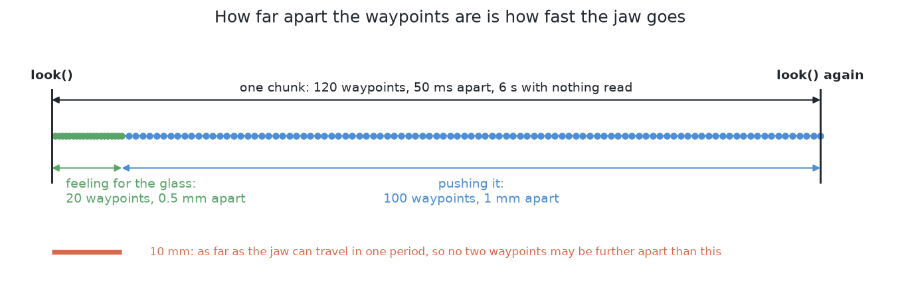
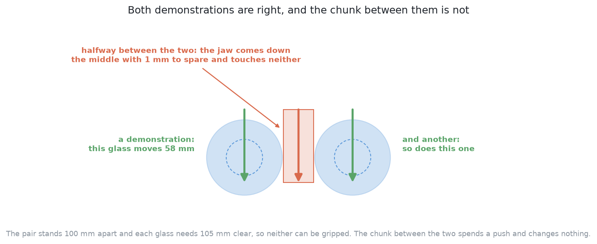

# How it works

This page explains what happens inside this solution, part by part. It
follows [what it is](01_what-it-is.md), which states the question the
solution answers and the single idea it rests on.

## Contents

1. [Behaviour cloning — learning a policy by copying](#1-behaviour-cloning--learning-a-policy-by-copying)
2. [Where the demonstrations come from](#2-where-the-demonstrations-come-from)
3. [Choosing which demonstrations to keep, and the bias it buys](#3-choosing-which-demonstrations-to-keep-and-the-bias-it-buys)
4. [Action chunking, and why it matters](#4-action-chunking-and-why-it-matters)
5. [A second way — Diffusion Policy](#5-a-second-way--diffusion-policy)
6. [Compounding error](#6-compounding-error)

## 1. Behaviour cloning — learning a policy by copying

Behaviour cloning is the whole of this solution, so it is worth setting out in
plain words before anything is built on it.

A **policy** is a function from what the arm can see to what the arm should do.
**Behaviour cloning** is fitting that function from examples of somebody else
doing the job. Each example is a pair: what was seen at some moment, and what
the demonstrator did at that moment. The first half of the pair is the input,
the second half is the label, and fitting proceeds exactly as it would for any
other supervised problem — show an example, compare what the network produced
against what the demonstrator did, and nudge every weight a little in the
direction that would have closed the gap.

The programming comparison is a close one. Behaviour cloning is fitting a
lookup table that was given to you, and then being asked to answer queries that
are not in it. The table holds situations and the right answer for each. The
network is a compressed, smooth stand-in for the table, and the whole hope of
the method is that smoothness between the entries is a good guess at what
belongs there.

Three things make this attractive here, and all three are things the method does
not have to do.

**There is no reward to design.** Reinforcement learning needs a number that
says how good an outcome was, and writing such a number is its own difficulty,
because a learner optimises what the number says rather than what the number was
meant to say. A number that rewards moving glasses apart quickly rewards
shoving. A number that punishes toppling heavily teaches the arm to stop
touching anything. Behaviour cloning never needs one. The label is the action,
and the only thing measured during training is how far the network's action was
from the demonstrator's.

**There is no exploration.** A learner that discovers by trying has to try bad
things, and in this problem one class of bad thing cannot be undone: nothing in
this project stands a toppled glass back up. Behaviour cloning never tries
anything during training. It only reads.

**There is no physics to model.** Friction does not appear anywhere in this
method. Not as a constant, not as a guess, not as a quantity to be estimated.
The demonstrations were produced in a world with friction in it, so the
consequences of friction are in the data, and the network learns whatever of
them it can use without ever representing the number. Compare that with [a
world model, then plan with it](../07_a-world-model-then-plan-with-it/01_what-it-is.md), whose
whole business is learning how the world changes and planning through it. This
solution does not predict what a push will do. It only predicts what the
teacher would have done.

Against those three, one fragility, and it is the only one that matters because
everything else about this method follows from it.

**A cloned policy only knows situations the demonstrator visited.** The fitted
function was determined by the examples, and the examples cover a region of its
input. Inside that region, smoothness between examples is a reasonable guess.
Outside it, the network still returns an answer — a network always returns an
answer — and that answer is an extrapolation with nothing behind it. Worse,
**nothing in the output says which case you are in.** The policy emits a chunk
of waypoints either way, with the same confidence, because it has no way of
expressing doubt. A method whose mistakes announce themselves can be guarded;
this one's do not.

## 2. Where the demonstrations come from

Behaviour cloning needs examples, and in most of robotics that is the sentence
that kills it. Here it is almost free, and it is worth being clear about why,
because the judgement of whether this method is worth its price depends on it.

**The teacher is [geometry generates, a model
ranks](../05_geometry-generates-a-model-ranks/01_what-it-is.md).** That solution generates
candidate pushes from geometry — pushes that are legal by construction, aimed
at destinations [the target layout](../01_the-problem/02_the-target-layout.md)
computed — and ranks them with a fitted model, taking the best. Run it on a
table and it produces a push. Run it on many tables and it produces many
pushes. Each one is carried out by the examiner, which expands the parameterised
push into the waypoints the jaw actually followed, and marks what happened to
the table afterwards. So **every push that solution makes is a finished
demonstration already**: a picture of the table before it, the waypoints that
were followed, and the examiner's own verdict on whether it worked.

Five consequences follow, and together they are why supplying demonstrations is
what earns that solution its place beyond being a baseline.

**The cost is arm time on a simulated examiner, and nothing else.** There is no
teleoperation rig, no operator, no scheduling of a person's hours, and no
agreement to be reached about what a good push looks like. The examiner is
MuJoCo, which is fast for exactly this reason, and [the test
examiner](../02_the-examiner.md) records that a learned approach needs thousands of
pushes while Gazebo would run each one at the speed of real time.

**The demonstrations are reproducible.** Every table comes from a single
number, so the same number always gives the same table, and the dataset can be
regenerated rather than archived. A demonstration set recorded from a person is
a one-off artefact that can never be made again; this one is a function of a
list of numbers.

**Training and testing cannot be confused.** The examiner's table numbers are
split, with numbers above a fixed dividing line reserved for testing.
Demonstrations are drawn only from below it, so no policy here is ever marked
on a table it learned from.

**The teacher can be asked again, at any state.** A person who demonstrated a
hundred pushes last week cannot be asked what they would have done on a table
that came up today. A program can, every time, for nothing. This is the single
most useful property of a programmed teacher, and the section on compounding
error is where it is spent.

**And the teacher is itself one of the six.** So the comparison between the two
is a student against the program it copied, measured on the same tables with
the same scorecard, and the six were arranged deliberately so that it could be
taken.

One honest qualification belongs with all of that. **This is a privilege of
working in a simulator with a programmed teacher.** On a real arm with a human
demonstrator, collecting demonstrations is the dominant cost of the whole
method, and usually the thing that decides whether it is affordable. Any
judgement made here about whether imitation is worth its price should carry
that qualification with it.

## 3. Choosing which demonstrations to keep, and the bias it buys

Free demonstrations are not the same as a good demonstration set, and the
choice of which pushes to keep is the place where this solution's second honest
cost enters.

Start with why any filtering happens at all. **A cloned policy copies
everything in its data.** It has no notion of a good action and a bad one; it
has only a label to reproduce. If the set holds a push that toppled a glass,
that push is a label like any other, and the fitting moves the weights towards
producing it. The teacher is not perfect — no solution here is — so some of its
pushes topple a glass, push one out of the glass zone, or jam. Keeping those
teaches the student to make them. So the set is filtered by the examiner's own
verdict, and only the pushes that worked are kept.

That is clearly right, and it has a consequence that is clearly uncomfortable.

**Filtering by outcome does not only change which actions are recommended. It
changes which situations are covered.** Suppose there is a kind of table the
teacher handles badly — glasses crowded in a corner of the glass zone, say,
where the legal destinations are few and the teacher's candidates are poor.
Most of the teacher's pushes on such tables fail, so most of them are dropped,
so the training set holds few examples of that kind of table. The student is
therefore fitted most densely on the situations where the teacher was already
strong, and thinly or not at all on the situations where help was most needed.
The filtering removes the examples exactly where the examples would have been
most valuable.

That is the mechanism, and it is worth saying straight away that on these
tables it turned out to be small. Most of what the collection drops is not a
failure at all: it is the teacher's own 5 mm test push, the one it makes to
settle whether a glass slides before it commits to a real push, and that is not
a push at the task. Of the real pushes, a few in a hundred were dropped. The
counts, by reason and by kind of glass, are in the code folder's `README.md`.

Three things can be done about the bias anyway, because it is small here rather
than absent. Two are now code and the third is still a prescription.

**Keep the teacher's refusals, as refusals.** A glass the teacher declined to
push is not a failure and should not be dropped as one; [pushing without
toppling](../01_the-problem/03_pushing-without-toppling.md) is explicit that a
refusal is a result. A dataset that silently omits those tables teaches the
student nothing about them, and silence in a dataset is not a label. **Done**:
the refusals and their reasons are counted beside the demonstrations.

**Record what the filtering removed, broken down by table.** The thinning is
invisible unless it is counted. A table of kept and dropped pushes, grouped by
the kind of table and by the way the dropped ones failed, says where the
student's coverage is thin before the student is ever run. **Done**: the
collection writes exactly that table, and it is what the paragraph above
reports. The teacher is clean enough on these tables that the thinning is far
smaller than this section assumed when it was written.

**Weight the hard tables up, and gather more of them.** Because tables are
drawn from numbers and cost only time, a thin region can be filled by drawing
more tables of that kind rather than by accepting the thinness. That is the
cheapest defence available here and it is unavailable on real hardware.
**Not done**: the demonstration set is drawn from consecutive table numbers,
so it holds whatever mixture the examiner produces.

None of the three removes the problem. The ceiling stays where the next
sections put it.

## 4. Action chunking, and why it matters

The policy's output is the second thing that defines this solution, and the
word for it is the one in ACT's own name.

**Action chunking** means predicting a short run of future actions in one go,
rather than one action at a time. Ask the network once and it returns a
sequence: this waypoint, then this one, then this one, several of them,
produced together in a single pass. The arm then carries out that whole
sequence before anything is asked again.

The programming comparison is exact and it is worth stating plainly, because
the difference sounds smaller than it is. One way to write a controller is a
function called on every tick that returns the single next thing to do; the
plan exists only as whatever that function happens to decide each time. The
other way is a function called once that returns a few steps of a plan, which
are then carried out. The second **commits**. It cannot change its mind partway
through, and that is both what it costs and what it buys.

Here is the reason committing helps, and it is specific to pushing rather than
general.

**A push is one continuous motion, and it only works if it is sustained.** A
glass does not move because the jaw touched it; it moves because the jaw kept
travelling in one direction, in contact, for some distance. A policy that
re-decides at every instant has no record of why it was going that way, so each
decision is made afresh from a picture that has barely changed. Two failures
follow, and both are commonly seen in policies that predict one action at a
time. The first is **dithering**: tiny disagreements between consecutive
decisions turn into a motion that wanders instead of travelling, and a wandering
jaw in contact with a glass is doing something nobody designed. The second is
worse and quieter. At the moment of choosing, the arm has usually seen a
demonstration that pushed left and a demonstration that pushed right from a
situation that looked much the same, and a network asked for the single best
next step minimises its error by producing something between the two. **The
average of two commitments is not a commitment.** Chunking does not remove that
difficulty but it moves it to where it does least damage: the averaging now
happens once per push, over whole pushes, rather than at every instant over
every step.

Two more things follow from chunking, one good and one a genuine cost.

**Errors do not compound inside a chunk.** The waypoints of a chunk were
produced together, so they are consistent with each other by construction.
Nothing inside the chunk is a decision made on top of an earlier mistake. A
step-by-step policy has one decision per tick, and every one of them is made
from a state its own previous decisions produced, which is the mechanism the
section after next is about.

**A chunk is open-loop while it runs.** Nothing is being read during it. The
arm is carrying out a motion it decided on from a picture that is now out of
date, and if something unexpected happens three waypoints in, the remaining
waypoints do not know. So the chunk's length is a real trade and not a
formality: a long chunk is committed and blind, a short chunk is responsive and
prone to dither. And it is a trade in speed as well as in length, because
waypoints are consumed at a fixed rate: how far apart they are is how fast the
jaw goes. The examiner caps that at the fastest the cell ever moves the jaw, so a
chunk whose waypoints are further apart than the arm can cover in one control
period is taken slower rather than at a speed the arm does not have. A policy
copying this teacher never meets the cap, because the teacher's own waypoints
are about a millimetre apart and the cap is at ten, but a policy that learned
to emit coarser chunks would be slowed by it.

What makes the trade bearable is set by `Bench.follow`, and it is less than the
loop gives a parameterised push. Coming down to the chunk's first waypoint is
the examiner's own move and it stops if the jaw touches anything on the way, so
a chunk that starts over an obstacle comes back as blocked rather than being
driven through. But **once the jaw is travelling across the table the examiner
does not feel for the glass.** A chunk is carried out as it was given, which is
the whole point of accepting one, and the only thing that stops it is the jam
threshold. So the slow approach to contact is not the cell's behaviour here; it
is part of the chunk, copied from the teacher's own feel. That is the one place
where this solution leans on the demonstrations for safety rather than on the
examiner.

Chunking is also the reason [the examiner](../02_the-examiner.md) accepts
waypoints at all. Requiring every solution to emit the same three or four push
parameters sounds like the fairest possible rule, and it would be the unfair
one, because squeezing a chunking policy down to a handful of parameters
removes the mechanism that makes it work.

## 5. A second way — Diffusion Policy

There is a second way to fit this solution, and it exists to attack the
weakness the section above just named. **Diffusion Policy starts from a chunk
of pure noise and removes a little of what it judges to be noise, again and
again, until a plausible run of waypoints is left.** Because where it arrives
depends on where the noise started, asking twice can give two different good
answers.

That is the whole argument for it. A model trained to predict one answer
averages the answers it was shown, and this problem has several good answers
nearly everywhere. The picture below works one of them out. Two glasses stand
too close to grip, each needs more clear room than it has, and the teacher's
two answers are mirror images: move one glass aside, or move the other. Both
are right. The chunk halfway between them threads the jaw down the gap between
the two glasses, touches neither, and spends a push for nothing.

ACT's measured failure has that shape: a heading about thirty degrees away from
the teacher's, which is close to what averaging the teacher's alternatives
would give.

**It is written and it runs, and it has not been fitted here.** It sits in
`policy.py` beside ACT on the same demonstrations, so only the model differs,
and the two are about the same size. What stopped it was the compute: a
training step costs about twice as much, one chunk at run time is sixteen
denoising passes rather than one, and a result from a single seed is not a
result. So there is no scorecard for it, and the gap this section argues for
has not been measured.

## 6. Compounding error

Behaviour cloning has one characteristic failure, and it follows directly from
the fragility named earlier: a cloned policy only knows situations the
demonstrator visited.

Here is the mechanism, in order. The policy acts slightly differently from the
teacher — a little short, a little off the demonstrated heading, because no
fitted function reproduces its labels exactly. That small difference puts the
arm in a state the teacher would not have reached. In that state the policy is
a little further outside the region its examples covered, so its next action is
a little worse, which puts the arm in a state further out still. **The error is
not added once; it is fed back into its own input.** This is **compounding
error**, and it is why a policy that looks excellent on held-out single
decisions can still fail over a whole run.

The comparison from programming is the difference between a rounding error in a
calculation and a rounding error inside a loop that reads its own last result.
The first stays the size it was. The second grows with the number of
iterations.

**What mitigates it here is the loop, and the mitigation is substantial.**
[Pushing without toppling](../01_the-problem/03_pushing-without-toppling.md) describes every
solution in this book as acting, measuring what really happened, and then
deciding again from what it measured. The arm is not following a script of
pushes; it repeats one step — look at the table, choose one push, make it, look
again — until the work is done. For a cloned policy that arrangement is worth
more than it is for anybody else, because **the state the policy is asked about
is always a measured table and never a predicted one.** Drift inside a chunk is
cut off at the end of the chunk. The policy is re-anchored on a fresh reading
before it is asked anything again, so the feedback path that makes error
compound is broken once per push.

It is blunted, not removed, and two ways it still bites are worth naming.

**Inside a chunk, nothing is read.** The chunk is carried out as decided, so
whatever drift accumulates over its waypoints accumulates unobserved. This is
the cost of chunking from the previous section, seen from the other side, and it
is bounded by the chunk being short.

**Across pushes, the arrangement itself drifts.** This is the real one. Looking
again tells the policy where the glasses are; it does not make those positions
ones the teacher ever produced. A policy whose first push went further than the
teacher's would have leaves a table the teacher never generated, and the second
push is then chosen on a table outside the demonstration set. Repeated over a
run, the policy walks its own table into territory its data does not cover.
Measuring positions accurately does not help with that at all, because the
problem is not that the state is unknown but that the state is unfamiliar.

**The standard repair for this is called DAgger, and it is unusually cheap
here.** The idea is to collect demonstrations where the policy actually goes
rather than only where the teacher went: run the policy, and at every state it
visits, ask the teacher what it would have done there, and add that answer to
the training set as a label. Retrain, and repeat. The set then covers the
policy's own drift, which is exactly the region plain cloning leaves empty.

It is affordable here for the reason named two sections ago. The teacher is a
program, so it can be asked about any state, at any time, for nothing, and a
human demonstrator cannot answer "what would you have done on this table that
my policy produced last Tuesday". So the one serious weakness of behaviour
cloning has a cheap repair available in this particular arrangement, and that
is a consequence of the teacher being code rather than a property of imitation
learning in general.

← [What it is](01_what-it-is.md) · [The code](03_the-code.md) →
