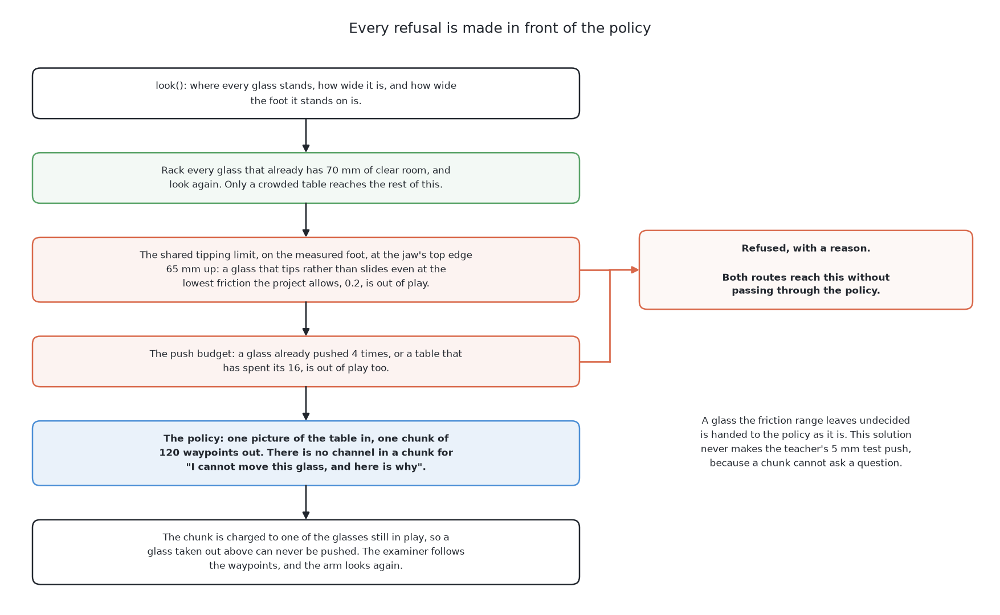
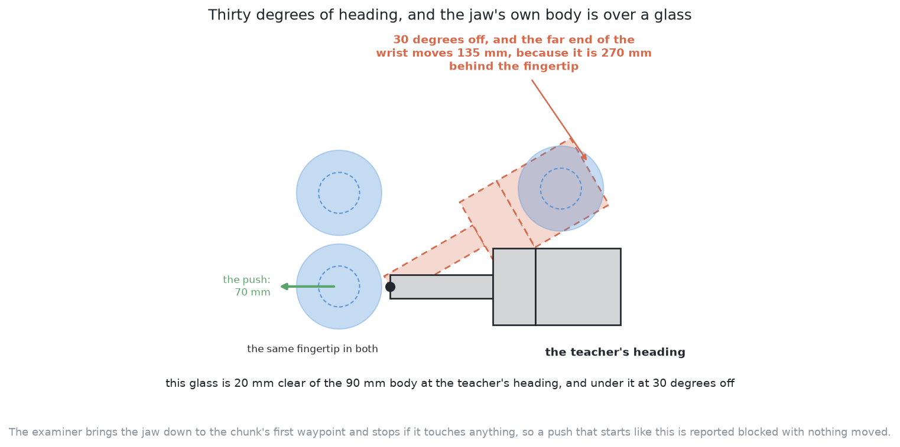

# A worked example

This page follows this solution through one arrangement of glasses with real
numbers, and then through the case this book keeps returning to, a glass that cannot be pushed safely,
because a worked example that shows only the easy case teaches the wrong
lesson.

## Contents

1. [When a glass cannot be pushed safely](#1-when-a-glass-cannot-be-pushed-safely)
2. [A worked example](#2-a-worked-example)

## 1. When a glass cannot be pushed safely

A glass slides while the jaw touches it below half its foot width divided by
the friction, and tips above that. The height that counts is the jaw's **top
edge** at 65 mm, not the 50 mm its middle rides at, and for a glass whose foot
is narrow enough there is no contact height the arm can offer below the limit.
The only correct answer for such a glass is to refuse, with the reason
recorded, which marks the run *correct but incomplete* rather than wrong.
[Pushing without toppling](../01_the-problem/03_pushing-without-toppling.md)
sets all of that out once, including what is done when the unknown friction
leaves the limit undecided, and it is **arithmetic applied before any model is
consulted** in five of the six solutions. What follows is only what is this
solution's own.

**A policy of this kind has no way to refuse**, and the reason is a good
illustration of what a cloned policy cannot express. Its output is a chunk of
waypoints, and there is no channel in it for "I cannot move this glass, and the
reason is that it tips before it slides". The examiner requires a refusal to
carry a reason, so the thing it wants is a kind of answer this policy cannot
produce.

It is tempting to hope the policy learns to refuse by itself. It does not, and
it is worth being exact about why. The teacher refuses those glasses, so the
dataset contains no push on them — but **the absence of an example is not a
label.** The network was never shown such a situation paired with an
instruction to do nothing; it was shown nothing at all. Asked about one, it
returns a chunk, because returning a chunk is the only thing it does. The one
case where the arm must not act is the case where the policy is least anchored
and least able to warn.

So the refusal is made in front of the policy, by the same arithmetic the two
solutions before this one use, and the policy is never asked about a glass that
fails it. Everything else that takes a glass out of play — the push budget, and
a glass that has been pushed its allowance of times — sits in front of the
policy too.

One difference from the teacher belongs here, because it is a cost of the same
limitation. When the believed range of friction leaves the limit undecided,
the teacher settles it with a 5 mm test push and a look before and after. This
solution makes no test push: a chunk cannot ask a question, so the gate refuses
only the glasses that tip rather than slide even at the lowest friction the
project allows, and an undecided glass is handed to the policy as it is.

**The early abort matters more here than anywhere else.** A chunking policy is
open-loop while its chunk runs, so a monitor reading the jaw's force during a
push would be the only thing observing at all during that window. It is a
prescription rather than built code, and this is the solution with the
strongest reason to want it.

## 2. A worked example

Follow one table through, because the places where this solution differs from
its teacher are easier to recognise on a concrete arrangement than in the
abstract. This example was written before the policy had been fitted, so it is
what the design says the method would do. The last part of the section says
which of it turned out to be true.

**The table.** Five straight glasses stand in the glass zone, drawn at
proportions from across that kind's range, so they are not all the same size.
Two of them stand deliberately close — closer than the gripper can work with,
with a little daylight still between them — and one of that pair is also fairly
near the edge of the glass zone. The other three have room. The examiner accepted
the table because at least one glass on it has no room, so there is work to do.

**What happened offline.** Long before this table was drawn, the teacher was
run over many tables below the dividing line. On each, it generated legal
candidate pushes, ranked them, pushed, and the examiner recorded the picture, the
waypoints and the verdict. The failures were dropped and counted. What was left
was fitted into ACT, several times with different seeds. None of that involves
this table, which comes from above the dividing line.

**The first push.** The arm takes the view from the top and the policy returns
one chunk: a descent behind the outer glass of the crowded pair, a slow feel
forward, a committed slide outward along a heading away from its neighbour, a
back-off, and a lift to travel height. Notice what the chunk is free to do that
a parameterised push is not. It can lean the slide as it travels, so the glass
leaves its neighbour at a slightly different angle from the one it started on,
and it can slow as it approaches the end rather than stopping at speed. Whether
either of those is worth anything is a thing to measure rather than to assert.
The freedom is real, it belongs to the trajectory solutions only, and this is
the kind of place it would show up.

**What the push actually does.** The glass goes further than the teacher's aim
would have put it, because the friction under this glass's foot is not what any
of the demonstrations happened to sit at, and no part of this method models
friction. Nothing is lost by that: the arm looks again, and the fresh reading
says where the glass really is.

**And here is compounding error, in one concrete form.** The table the policy
now faces has a glass closer to the edge of the glass zone than the teacher
would ever have left one, because the teacher aimed at a destination the layout
computed and this push overshot it. If the demonstration set happened to hold
tables with a glass in roughly that position, the policy is on familiar ground
and the second push is as good as the first. If it did not — and the filtering
makes that more likely, because overshoots near the zone edge are exactly the
pushes that failed and were dropped — then the policy is being asked about a
table outside its data. It will answer. The answer will arrive as a chunk of
waypoints like any other, with nothing to distinguish it from a confident one.
This is the failure to watch for in this solution, and the DAgger repair is
aimed precisely at it: ask the teacher what it would have done on this table,
and the gap closes.

**And the refusal.** Take a different table, of stemmed glasses this time, one
of them drawn with a foot narrow enough that half its width divided by any
plausible friction falls below the jaw's top edge. The shared arithmetic
evaluates that from the measured foot width before the policy is consulted, and
refuses the glass with its reason. The policy never sees it. The other glasses
on the table are pushed as usual, and the run ends *correct but incomplete*,
which is the right result. The important part of this example is the negative
one: nothing the policy could have learned would have improved it, and nothing
the policy might have produced was allowed to make it worse.

**One correction to all of the above, now that it has been run.** The refusal
behaves exactly as described. The first push does not. What the fitted policy
actually returns on a table it has not seen is a chunk that starts in roughly
the right neighbourhood — within a centimetre or two of where the teacher put
the fingertips — but points about thirty degrees away from where the teacher
pointed. That matters more than it sounds, because the jaw is 270 mm of finger,
body and wrist behind its fingertips, and turning it thirty degrees about the
fingertips swings the far end of the wrist 135 mm sideways. On a crowded table
that puts the 90 mm body over a glass the teacher's own heading cleared
comfortably.

The examiner brings the jaw down to the chunk's first waypoint and stops if it
touches anything on the way, so almost every push ends there, before any glass
is touched. Nothing in the example about leaning the slide or slowing near the
end was reached, because the motion never got that far. The code folder's
`README.md` has the counts.

← [The code](03_the-code.md) · [What it needs](05_what-it-needs.md) →
