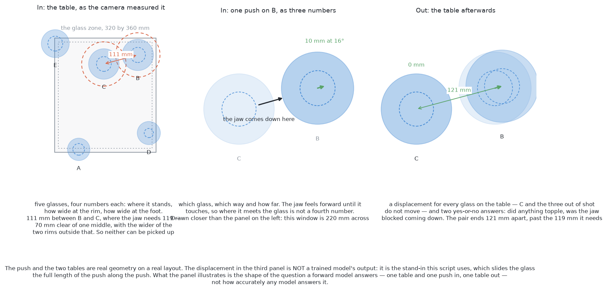

# What it is

> **What it uses** — PyTorch, and MuJoCo through [the test
> examiner](../02_the-examiner.md). Rung one is a small network written for this cell
> and trained here, five copies of it, with no downloaded weights of any kind.
> Rung two would be TD-MPC2, the model-based entry in LeRobot, trained here as
> well. **Rung two is not built**, so no number anywhere in this document is
> its. Neither rung borrows a model from anybody, so the only licences in play
> are the libraries' own.
> **What it does** — it learns what a push does, and then looks for a good push
> by trying candidate pushes against that learned model instead of against the
> table. The model takes the table as the camera measured it and one push, and
> answers with the table afterwards: where every glass moves, whether anything
> topples, and whether the jaw is blocked on the way down. Because the answer
> is a table rather than a score, the same answer can be fed back in as the
> next question, which is what would let this solution plan a *sequence* of
> pushes — move one glass out of the way first so that a second glass has
> somewhere to go. The built planner's horizon is one push, so the sequence is
> an extension this document designs rather than code that runs.
> **How the output is produced** — `look()` hands over one reading per glass;
> the shared topple limit that refuses a glass that tips before it slides
> belongs in front of all of this, and the built planner does not have it yet;
> the readings and a candidate push are encoded
> into one row of numbers in the push's own frame; the five copies of the model
> each answer; a candidate is thrown away if any copy thinks it might topple
> something, or if the predicted table breaks the map; the survivors are scored
> by how much room is still missing afterwards; a sampling search refines the
> good ones and returns the best push; that push is handed to the examiner as a
> parameterised push, and the examiner's own macro expands it into a jaw
> trajectory.
> **What it costs** — pushes made in the simulator and recorded, which is the
> only training data either rung needs and which nobody has to label. Rung one
> trains on an ordinary processor in minutes and needs no rented hardware at
> all. Rung two is reinforcement learning and wants an accelerator: a weekend
> of rented time, of order a hundred dollars, and a month of a small one, of
> order five hundred, if several training seeds are to be run. At run time both
> rungs are the expensive end of the six, because the search asks the model
> about hundreds of candidate pushes before every single push the arm makes.

> **The cell is described once, in [the cell](../../08_seeing-the-glasses/01_the-cell.md)** — the
> layout, the two places the camera works from, from the top and from the side,
> all four sensors, and the words this project uses them with. What follows is
> only what is specific to this solution.

## Contents

1. [Introduction](#1-introduction)
2. [The problem this solves](#2-the-problem-this-solves)
3. [The main idea](#3-the-main-idea)

## 1. Introduction

This document explains how to [push the glasses
apart](../01_the-problem/01_what-is-asked-for.md) by learning a model of what a
push does, and then choosing pushes by trying them out against that model
rather than against the table.

The idea worth holding on to while reading is a small one with large
consequences. Every other solution here learns, or writes down, **what to do**.
This one learns **what will happen**, and works out what to do from it. That
single difference is what gives this solution the one capability none of the
other five could have: it can be extended to plan a sequence. It can choose a
push whose only value is that it makes room for the push after it — move one
glass aside so a second glass has somewhere to be pushed to — because a model
that returns a table can be asked again about the table it just returned. A
method that scores a push without saying where the glasses end up has nothing
to ask the second question of.

By the end you will understand five things. You will understand what a forward
model is and why it is a different kind of object from a policy. You will
understand how a push is chosen by sampling candidates and refining the good
ones, which is a search called the cross-entropy method, and why that search
suits a problem where the cost is not smooth. You will understand why a model
that is wrong in small ways is still useful, which turns on planning several
pushes ahead but executing only the first. You will understand why a
disagreement between several copies of the same model is a usable measurement
of the model's own ignorance, which is the most transferable idea in this
document. And you will understand what the two rungs buy against each other:
a small hand-built model that can be inspected, against a stronger off-the-shelf
one that brings a maintained implementation.

Read [the examiner](../02_the-examiner.md) first, because what `look()` hands over
and what `push()` accepts are assumed throughout, and read [pushing without
toppling](../01_the-problem/03_pushing-without-toppling.md), because the refusal rule this
solution adds learned evidence to is stated there.

## 2. The problem this solves

[The problem](../01_the-problem/01_what-is-asked-for.md) has already been
stated in full, and this section narrows it to the single difficulty this
solution is aimed at.

Four to six glasses stand on a table, some of them closer together than the
gripper can work with. The arm has to push them apart without knocking any of
them over. [The target layout](../01_the-problem/02_the-target-layout.md) has already settled
where the glasses should end up, because that is plain geometry with no
unknowns in it. What is left is the half that has unknowns in it: **what a
given push will actually do**.

That half is hard for one reason above all others, and [pushing without
toppling](../01_the-problem/03_pushing-without-toppling.md) states it plainly. The rule that
decides whether a glass slides or tips compares the contact height against half
the foot width divided by the friction coefficient, and **nothing in this cell
measures friction**. The examiner holds the coefficients privately and never tells
anybody. So any solution that writes the rule down is writing down a rule with a
guessed number in it, and the guess can be wrong by a factor that decides
whether a glass should have been touched at all.

There are two honest ways out of that. One is to guess carefully, act, look at
what happened, and correct — which is what [one fixed
nudge](../04_one-fixed-nudge/01_what-it-is.md) and [geometry generates, a model
ranks](../05_geometry-generates-a-model-ranks/01_what-it-is.md) do. The other is the one this document is about:
**never write the rule down, and learn its consequences instead.** Push glasses
thousands of times, record what happened each time, and fit a function to it.
The friction coefficient is then not a number the solution holds. It is a
regularity in the recorded pushes, absorbed along with everything else nobody
wrote down — that the jaw has a body behind its fingers, that a tapered glass
meets the jaw's top edge, that a glass turns as well as travels.

There is a second difficulty, and it is the one the sequence capability
answers. A glass pushed out of one crowd can easily land in another, and a
glass pushed into its own clear spot can block the route the next glass needed.
**Choosing which glass to move, and in which order, needs the whole
arrangement**, not the crowded pair. That is a question about tables rather
than about pushes, and only a method that can say what a table will look like
afterwards can ask it.

## 3. The main idea

The main idea is a separation, and the whole of this solution follows from it.

**Separate knowing what will happen from deciding what to do.** Fit one
function that answers *given this table and this push, what is the table
afterwards*. Keep it completely free of any opinion about what a good push is.
Then write the opinion separately, as plain arithmetic over tables: a table
where every glass has its 70 mm of clear room is good, a table where something
has fallen over is unacceptable, and a shorter push is better than a longer
one. Finally, put a search between the two: propose pushes, ask the model what
each one leads to, score the answers with the arithmetic, and make the best
one.

The reason that separation is worth making is that the two halves have
completely different sources of truth. What will happen is a fact about the
world, and it can only be learned from the world — which here means pushing
glasses in the simulator and recording the result. What counts as good is a
fact about the task, and it is already written down in [the
problem](../01_the-problem/01_what-is-asked-for.md): 70 mm of clear room, nothing knocked over, as few
pushes as possible. Mixing them produces a thing that has to be retrained when
the task changes. Keeping them apart means **the same model serves a different
goal by changing only the arithmetic**. If the task later became spreading the
glasses evenly rather than clearing them, the model would not be touched; a
trained policy would have to be trained again.

← [Imitation from demonstrations — how it compares](../06_imitation-from-demonstrations/06_how-it-compares.md) · [How it works](02_how-it-works.md) →
