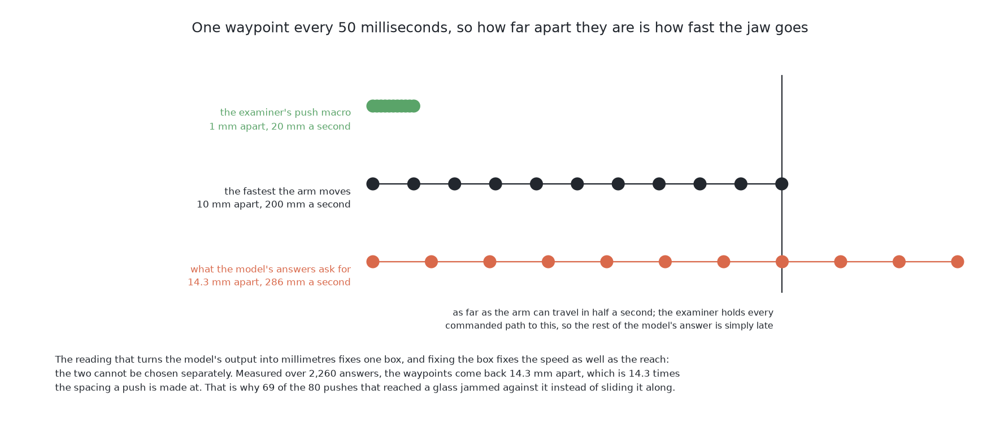

# The code

This page shows the code at the heart of this solution, and says what the
solution hands back to the rest of the cell. It follows [what it
is](01_what-it-is.md), and [how it works](03_how-it-works.md) explains, part by
part, what the code below is doing.

## Contents

1. [The code that does the work](#1-the-code-that-does-the-work)
2. [The pushes are what this contributes](#2-the-pushes-are-what-this-contributes)
3. [How the concepts fit together](#3-how-the-concepts-fit-together)

## 1. The code that does the work

Nothing here is fitted, so the only code this project wrote is the join between
what the borrowed model emits and what this cell's jaw is. [How it
works](03_how-it-works.md#4-the-actions-arrive-with-no-units-in-them) explains
why that join turned out to be the whole solution: the released checkpoint
saves its normalisation statistics under keys the normaliser never looks up, so
the actions arrive as z-scores with no units in them at all, and a scale had to
be chosen rather than converted.

The borrowed library does its work in one call, in
[`05-smolvla-as-it-downloads/policy.py`](../../../code/src/09_pushing-the-glasses-apart/05-smolvla-as-it-downloads/policy.py).
`predict_action_chunk` is LeRobot's; `self.pre` and `self.post` are the
processors the checkpoint ships, which are the ones that do nothing here; and
`to_jaw` is this project's.

That call runs five steps. Step 1 turns the straight-down picture into the
array the model takes, with the colour channels first and the values between 0
and 1 instead of 0 and 255. Step 2 puts the jaw's own pose in beside it,
written in the same units the answers come back in. Step 3 adds the
instruction, which is the same sentence every time. Step 4 is the single
forward pass, which draws 50 actions. Step 5 reads those 50 actions as
waypoints for this cell's jaw, and that step is the whole of `to_jaw`.

```python
    def ask(self, picture: np.ndarray, jaw: Waypoint) -> np.ndarray:
        ...
        batch = {
            # Step 1: the picture, as the model takes it -- colour first, and 0 to 1 not 0 to 255
            CAMERA: torch.from_numpy(picture.copy()).permute(2, 0, 1).float() / 255.0,
            # Step 2: where the jaw is standing -- the model answers in these same units
            "observation.state": torch.from_numpy(to_state(jaw, self.up)).float(),
            # Step 3: the instruction -- the same sentence on every table and every push
            "task": INSTRUCTION,
        }
        # Step 4: one pass through the borrowed model -- it draws 50 actions from fresh noise
        with torch.no_grad():
            actions = self.policy.predict_action_chunk(self.pre(batch))
        # Step 5: read those 50 actions as waypoints for this jaw -- joining.py sets the scale
        return to_jaw(self.post(actions)[0].numpy().astype(float), self.up)
```

The scale that `to_jaw` applies is in
[`05-smolvla-as-it-downloads/joining.py`](../../../code/src/09_pushing-the-glasses-apart/05-smolvla-as-it-downloads/joining.py),
and the whole of the choice is one constant and the four lines that spend it.

Step 5 opens out into five smaller steps. Step 6 divides every action by
`ACTION_SPAN` and clips what is left over, so two standard deviations of the
model's output reach the edge of the picture's frame and nothing reaches past
it. Steps 7 and 8 turn two of the six slots into a position on the table,
measured from the centre of that frame. Step 9 turns a third slot into a height
between the height the jaw pushes at and the height it travels at. Step 10
turns a fourth slot into a heading. The remaining two slots are dropped,
because this cell holds the jaw level and closed and offers no way to change
either.

```python
# Which of SmolVLA's six slots carries what, in the reading above.
ACROSS, OUT, UP, TURN = 0, 1, 2, 4

...

# How many standard deviations of the model's own action space the picture's
# frame covers. Two, because a z-score of two is the edge of what a normally
# spread quantity does, so the whole frame is reachable without the great
# majority of the model's output pinning itself against the edges.
ACTION_SPAN = 2.0

...

def to_jaw(action: np.ndarray, up: float = UP_HIGHER) -> np.ndarray:
    ...
    # Step 6: divide by ACTION_SPAN and clip -- two standard deviations become the frame's edge
    unit = np.clip(action / ACTION_SPAN, -1.0, 1.0)
    return np.stack(
        [
            # Step 7: the across slot sets the position across the table -- from the frame's centre
            VIEW_CENTRE[0] + unit[:, ACROSS] * TOP_VIEW_HALF_FRAME,
            # Step 8: the out slot sets the position out from the arm -- the frame's other axis
            VIEW_CENTRE[1] + unit[:, OUT] * TOP_VIEW_HALF_FRAME,
            # Step 9: the up slot sets the height -- between the pushing and the travel height
            PUSH_HEIGHT + (up * unit[:, UP] + 1.0) / 2.0 * (TRAVEL_HEIGHT - PUSH_HEIGHT),
            # Step 10: the turn slot sets the heading -- a half turn either way, in radians
            unit[:, TURN] * math.pi,
        ],
        axis=1,
    )
```

The only object in this solution that has both a metric extent and is seen by
the model is the frame of the straight-down picture, which is 717 mm across the
table top. So `ACTION_SPAN = 2.0` is the decision that two standard deviations
of the model's output span that frame, which makes one standard deviation 179
mm across the table and 62 mm of height. That is the reading that lets the
model put the jaw anywhere it can see and nowhere it cannot, and it is the one
property a join has to have if the score is to be about the model rather than
about the join.

It has a price that is easy to miss. The examiner consumes waypoints a fixed
period apart, 50 milliseconds, so **how far apart the waypoints are is how fast
the jaw is being asked to travel**. Fixing the frame therefore fixes the speed
as well as the reach, and the two cannot be chosen separately. Measured, the
model's waypoints come back 14.3 mm apart, which asks for more than the arm's
own top speed and fourteen times the speed the examiner's push macro moves at.



Nothing in this solution clips that to something gentler, because a gentler
limit would be a number chosen to make this solution look better and this
solution fits nothing. The examiner does hold a commanded path to the fastest
speed the cell ever moves the jaw, which is a different thing: that limit
belongs to the arm, it applies to all six solutions, and it never binds on a
path the examiner itself produced.

## 2. The pushes are what this contributes

It is worth stating plainly where this solution stops, because the boundary is
the same for all six and is what makes them comparable.

The input is fixed by [the examiner](../02_the-examiner.md). This solution may
read what `look()` returns and the rendered view of the same table from the
top. In practice it reads mostly the picture, because the picture is what the
model takes. It may not read the simulator's record of what was placed, and it
is not told the friction, and neither of those exceptions is relaxed for a
borrowed model.

The output is fixed too: **a jaw trajectory**. This solution emits one
directly, as a run of 50 waypoints, rather than as a parameterised push
expanded by the examiner's macro. Both forms are accepted and the examiner
treats them alike, because **what is scored is the table afterwards rather than
the push that changed it**. That is the only arrangement under which a push
described by three numbers and a run of fifty waypoints can be compared at all.

One consequence of that is worth naming, because it changes how one column of
the scorecard should be read. The examiner records how far a pushed glass
landed from where the solution aimed it. The other five solutions supply that
aim as a prediction. This one cannot, because the model was never asked where
it expected a glass to end up, so the aim is read back off the path afterwards
as the point where the path ends. The 74 mm median this solution reports is
therefore the distance from the end of a trajectory to the glass it happened to
move, which is not the same quantity as solution 1's 1.0 mm. It is bookkeeping
rather than a failed prediction.

One thing about the repeats is specific to this solution. The examiner requires
every trained solution to be trained with several seeds and evaluated over
several runs, because training varies with its seed and one run is not a
measurement. **This solution has no training seed**, since it trains nothing,
so its only variation is in how its actions are drawn when it answers: the
policy denoises from fresh noise every time. Its spread should therefore be
narrower than solution 6's, and it is. Over three runs this solution racked 52,
57 and 56 glasses, a standard deviation of 2.6, against solution 6's 5.7 on the
same count.

## 3. How the concepts fit together

The pieces now connect into one picture, and it is a short picture because the
solution is short.

A model fitted on an enormous pool of real teleoperation across many robots and
many tasks is downloaded unchanged and shown this examiner's rendered view of
the table from the top, together with one unvarying English sentence and the
jaw's own pose. It returns 50 actions, which somebody has to read as waypoints
for this jaw, because the numbers it emits carry no units of their own. The
examiner carries those waypoints out, the table changes, fresh measurements are
taken, and the model is asked again.

What the model brings to that loop is a general sense of how manipulation goes,
and nothing about this cell. What it is denied is the force reading, because
its three inputs do not include one for force. And what stands between its
general competence and this particular table is a large domain gap: it learned
from real cameras, real light and cluttered rooms, and it is shown flat pale
blue shapes on an empty rectangle. Across that gap it produces movement
unrelated to this table — in the measured case, movement that stays about 200
mm in the air and crosses most of a metre of table in one answer.

Every one of those is a consequence of one decision: **fit nothing here**. That
decision is what makes the solution free to try, and it is also what removes
every lever that would normally be pulled to fix the problems above. Pulling
exactly one of those levers is [solution
6](../09_the-same-model-fine-tuned-here/01_what-it-is.md).

← [What it is](01_what-it-is.md) · [How it works](03_how-it-works.md) →
