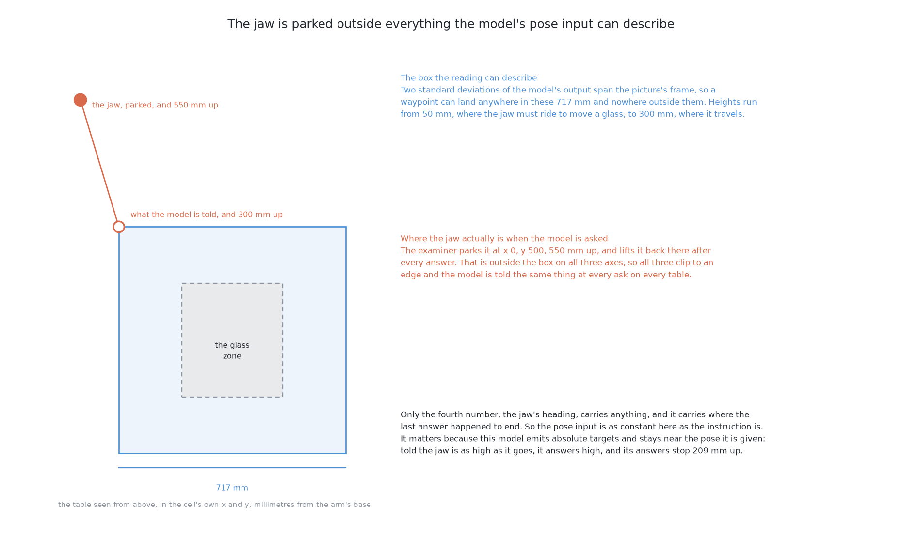

# How it works

This page explains what happens inside this solution, part by part. It follows
[what it is](01_what-it-is.md), which states the question the solution answers
and the single idea it rests on.

## Contents

1. [A model that sees, is told, and acts](#1-a-model-that-sees-is-told-and-acts)
2. [Where such a model gets its competence](#2-where-such-a-model-gets-its-competence)
3. [What is borrowed, and what is not](#3-what-is-borrowed-and-what-is-not)
4. [The actions arrive with no units in them](#4-the-actions-arrive-with-no-units-in-them)
5. [Two of the three inputs say the same thing every time](#5-two-of-the-three-inputs-say-the-same-thing-every-time)
6. [The force reading has nowhere to go](#6-the-force-reading-has-nowhere-to-go)
7. [The domain gap, which is the heart of this document](#7-the-domain-gap-which-is-the-heart-of-this-document)
8. [What was expected, and what happened](#8-what-was-expected-and-what-happened)
9. [The price of the model, and why this model](#9-the-price-of-the-model-and-why-this-model)

## 1. A model that sees, is told, and acts

The kind of model being borrowed needs explaining before anything else,
because the rest of this document depends on what goes into it and what comes
out.

Three things go in together. The first is **what the camera sees**, as an
ordinary picture. The second is **an instruction in ordinary words**, written
the way a person would write it, such as "pick up the red block" or "push the
glasses apart". The third is **the robot's own joint readings**, which say
where each joint is at this moment, so the model knows the shape the arm is
currently in and not only what is in front of it.

One thing comes out: **robot actions**. The model returns targets for the robot
to move to, at the rate a controller consumes them, so a single answer is a
short run of movement rather than a single pose. SmolVLA returns 50 of them at
a time.

A model with those three inputs and that one output is called a
**vision-language-action model**, and the name is simply the three parts listed
in order. The useful thing about the name is that it says where the model sits
in a system. It is not a perception component that reports what it sees and
leaves the acting to something else, and it is not a controller that is handed
a goal in numbers. It takes the raw picture and the human sentence at one end
and emits movement at the other, with nothing in between that a person writes.

That is a different shape from the other learned solutions in this book.
Solution 4's learned part is a model of how the world changes, and a separate
search uses it to choose. Solution 2's learned part is a ranker, and
hand-written geometry proposes what it ranks. Here there is one network and it
does the whole job, which is why a single borrowed file can be a complete
answer to the problem, and also why there is no small piece of it that can be
corrected when it is wrong.

## 2. Where such a model gets its competence

A model with no knowledge of this cell can only be worth trying if it knows
something general, so it is worth being precise about where that general
knowledge comes from.

It comes from **pretraining on very many recorded demonstrations, across many
different robots and many different tasks**. Somebody collected an enormous
pool of recordings in which a robot arm was driven by a person through some
piece of manipulation — reaching for things, grasping them, moving them,
putting them down — with the camera picture, the instruction and the joint
readings all recorded together, and the model was fitted on all of it at once.
SmolVLA's pool is **487 community datasets of real teleoperation**, which means
real robots in real rooms, driven by real people.

What a model learns from a pool like that is not any one of those tasks. It is
the shape that manipulation has in general: that an arm approaching an object
slows as it arrives, that a gripper closes when it is on the object and not
before, that movement near a surface stays near the surface, that a push is a
contact followed by travel in one direction rather than a jerk in several. The
comparison from programming is a library of general routines rather than a
program for one job: nothing in it solves your problem, but the parts it offers
are the parts most problems of that family are built from.

**So what this model brings to this problem is a general sense of how
manipulation goes, and nothing whatever about this cell.** It has no idea that
this table has a glass zone, that a rack sits in one corner, that the arm
reaches comfortably between 300 and 780 mm from its base, or that pushing a
glass above a certain height tips it over instead of moving it. Those are facts
about this cell, published once in [the
cell](../../08_seeing-the-glasses/01_the-cell.md) and [the
problem](../01_the-problem/01_what-is-asked-for.md), and a model fitted
elsewhere has never met any of them.

## 3. What is borrowed, and what is not

That division matters enough to state flatly, because it is what makes this
solution the baseline it is meant to be.

**Nothing whatsoever is fitted here.** The weights are downloaded and used
unchanged. There is no training run, no fine-tuning, no small correction fitted
on this cell's data, and no threshold tuned on the examiner's training tables.
If a number in this solution came from somewhere, it came from somebody else's
robots.

So the model has never seen this cell. It has never seen these glasses — not
the straight glass, not the tapered glass, not the stemmed glass and not the
short stemmed glass. It has never seen this jaw, which is two fingers and two
pads held closed and level, 30 mm tall, riding as low as the gripper reaches.
And it has never seen a table rendered the way this examiner renders one.

What **is** borrowed is everything else: the architecture, the weights, the
convention by which pictures are read, the convention by which words are read,
and the convention by which actions are emitted. Every one of those was fixed
by somebody else, for somebody else's robots, before this project existed. That
is the trade this solution makes, and the next three sections are the three
places where the trade bites.

## 4. The actions arrive with no units in them

The first place it bites is at the output, and this section was written
expecting a practical difficulty of translation. The difficulty turned out to
be worse than that, and the measured version is the one worth reading.

The expectation was this. A model fitted on recordings of particular robots
emits actions in the layout and the units those robots used. The arm here is a
UR5e with a two-finger gripper, and it is not the arm the recordings were made
on, so the numbers coming back would be in somebody else's units and somebody
would have to convert them.

**What the checkpoint actually emits has no units at all.**
`lerobot/smolvla_base` declares six action slots and six state slots, both
normalised by mean and spread, and it ships three sets of statistics for them —
SO-100 follower-arm joint angles in degrees, under the names `so100`,
`so100-blue` and `so100-red`. But those statistics are saved under keys such as
`so100.buffer.action.mean`, and LeRobot's normaliser looks up `action` and
`observation.state`. A key it cannot find is passed through unchanged, so with
the released checkpoint both the normaliser and the un-normaliser do nothing.
The state goes in as a z-score and the actions come out as z-scores: six
numbers that say how many standard deviations from some mean, with no statement
anywhere of what a standard deviation is worth in millimetres.

So the scale had to be **chosen** rather than converted. There is no conversion
to do, because there is nothing to convert from.
[`joining.py`](../../../code/src/09_pushing-the-glasses-apart/05-smolvla-as-it-downloads/joining.py)
makes that choice and writes down the reasoning, and [the code](02_the-code.md)
shows the four lines that spend it.

This matters for the comparison in a specific way. A bad reading would make the
model look worse than it is, and the result would then be a measurement of the
reading rather than of the model. So the reading is **chosen once and used by
both solution 5 and solution 6**, because the pair is only clean while
everything except the training is held still.

It is also worth noting that this is the step the examiner's own arrangement
was designed to allow. [The examiner](../02_the-examiner.md) accepts a run of
waypoints directly, without the push macro, precisely so that a policy which
thinks in movement is not squeezed into three numbers describing a push. Both
that path and the rendered view from the top exist in the examiner, and this
solution uses them as they come.

## 5. Two of the three inputs say the same thing every time

The second place the trade bites is at the input. Section 1 says the model
takes three things. In this problem two of them never change, and the second of
those two was not foreseen at all.

**The instruction is the one that was foreseen.** A model of this kind earns
its middle word by taking different instructions for different tasks. That is
the whole reason the language half is there: one set of weights can be asked to
pick a thing up, or to put a thing down, or to open a drawer, and the sentence
is what selects which. This problem has one instruction. Every table, every
push, every look again: the same sentence, because the task never changes. A
quantity that takes the same value every time carries no information, in
exactly the sense information is normally meant — knowing the instruction tells
you nothing you did not already know about the situation. So the language half
of this model, in this problem, does no work.

**The pose is the one that was not foreseen, and the reason is the cell rather
than the model.** The reading that turns z-scores into millimetres gives the
model one box it can describe: the frame of the straight-down picture, 717 mm
across the table, and heights from 50 mm, where the jaw must ride to move
anything, up to the 300 mm it travels at. Between actions the examiner parks
the jaw out of the way, at 500 mm along the table from the picture's frame and
550 mm up. That spot is outside the box on all three axes, so all three clip to
the edge, and the model is told the same thing at every ask on every table: the
jaw is in the far corner, as high as it goes. Only the heading varies, carrying
whatever the last run of waypoints ended on.

That has a consequence worth stating before the section on the domain gap,
because it explains part of what happened. SmolVLA emits absolute targets and
stays near the state it is given, so being told the jaw is as high as it goes
makes it answer high. The folder measures how much: asked the same picture six
times with the parked pose, the lowest point of a run of waypoints has a median
of 182 mm, and asked with an all-zero pose instead, 122 mm. So the pinned pose
raises the answers by about 60 mm. It is not the whole story, because 122 mm is
still far above the 50 mm the jaw has to be at and above most of a glass, but
it is a real part of it.

Two things follow from both inputs being constant, and the second is the
important one.

The first is that **the model is being used here as an expensive visuomotor
policy**: a thing that looks at a picture and produces movement. That is
precisely what solution 3 fits from demonstrations, with a far smaller network
and nothing borrowed. So the natural question — what is the extra size buying?
— has an answer that does not involve language at all. It is buying the
pretraining, and only the pretraining.

The second is a warning about reading the result. If this solution scores
badly, it has not been shown that vision-language-action models are a poor
idea. It has been shown that one such model, used with a constant instruction
and a constant pose, on rendered pictures unlike its training pictures, with
nothing fitted, scores badly — which leaves the model's actual selling point
untested, because this problem never asks it to do the one thing the language
half exists for. A single-task cell is simply not where that capability can be
seen.

## 6. The force reading has nowhere to go

The third place the trade bites is the most interesting, because it is a
mismatch between what this problem gives a solution and what this model is able
to accept.

[The examiner](../02_the-examiner.md) is emphatic that the force reading is the
single most valuable thing it reports. Friction is never told to any solution
and nothing in the cell measures it, so how much force it took to start a glass
moving, and how far the glass travelled for that push, are the only evidence
about friction that exists anywhere.

**This model has three input slots, and force is not one of them.** It takes a
picture, a sentence and a pose. The jaw's report of what it felt — whether it
was blocked on the way down, how far it travelled before touching, whether it
jammed, the most force it felt, how far the glass moved after contact — has
nowhere to enter. The examiner still produces that report when it carries out a
run of waypoints; there is simply no slot to put it in. So the one channel
through which friction is observable at all is, for this solution, closed.

That does not leave the solution blind, and it is worth being exact about what
remains. The arm looks again after every push, so the **outcome** of a push is
visible in the next picture. What is lost is everything that happened *during*
the push, which is where the force signal lives, and which is the part that
distinguishes a glass that slid from a glass that leaned and settled back. So
this solution can learn nothing from a push except where the glasses ended up,
and it cannot even do that, because it learns nothing at all — it only sees the
new arrangement and answers again.

This is also the clearest statement of what solution 6 has to gain, and of how
little. Continuing the training here cannot add an input slot. What it can do
is fit the model's response on pushes whose outcomes are known, so that this
examiner's own friction ends up absorbed into the weights as a constant. That
is not a way of observing friction, and [solution
6](../09_the-same-model-fine-tuned-here/01_what-it-is.md) names it as a
liability away from this examiner rather than as a repair for the closed
channel.

## 7. The domain gap, which is the heart of this document

Everything above assumes the borrowed model works at all on the pictures this
examiner shows it, and that assumption is the one that failed. It deserves the
longest section here, because the difference between what the model was fitted
on and what it is given is large.

A **domain gap** is the difference between the data a model was fitted on and
the data it is used on. Here the two sides of that gap can be set out plainly.

**What it was fitted on is real teleoperation.** 487 community datasets of real
robots, driven by real people, in real rooms. That means real cameras, with the
noise, the blur and the colour a real lens produces. It means real lighting,
with shadows that say where an object meets the surface it stands on, and
highlights that curve the way a curved surface makes them curve. It means real
scenes, which are cluttered: a workbench with other objects on it, a background
that is a room, texture everywhere, and the particular visual mess that tells a
model what is near and what is far.

**What this examiner offers is a rendered view from the top of pale blue
glasses on a tan table.** The glasses are built as stacks of cylinders and
shaded as solid objects, the table is a flat rectangle, there is nothing else
in the frame, and nothing in the picture was produced by light passing through
a lens. Every glass is the same colour, so nothing in the picture tells one
kind from another. There is no clutter, almost no texture, and nothing of the
transparency a real drinking glass has, which in a photograph is the strongest
single clue that a glass is what you are looking at.

So the model is asked about pictures quite unlike the ones it learned from,
with much of the evidence it learned to use simply absent.

**The way models fail across such a gap** is usually not nonsense. Nonsense
would be convenient, because nonsense is easy to detect and easy to refuse.
What is normally produced instead is confident, plausible, wrong action:
movement that looks like a push, aimed somewhere reasonable, at a sensible
speed, that is simply not the push this table needed. That is the failure this
document was written to expect, and the next section says what happened
instead.

One thing about direction survives whatever the failure turns out to be. A push
aimed at the wrong place is recoverable, because the arm looks again and the
next pass starts from where the glasses really are. A push that topples a glass
is not, because nothing in this problem stands a glass back up. That asymmetry
is the whole reason the topple limit is taken out of the model's hands
entirely, which [a worked example](04_a-worked-example.md) sets out.

## 8. What was expected, and what happened

The expectation, reasoned from what the model brings and what it is given, was
roughly this. The model should produce well-formed movement, because producing
well-formed movement is what its pretraining is for and that capability does
not depend on recognising the scene. It should sometimes produce a sensible
push. And it should often choose the wrong glass, or the wrong direction, or a
distance unrelated to what the arrangement needed, because choosing correctly
needs the picture to be read accurately and the picture is the part that does
not match.

**The measured failure is blunter than that, and easier to see.** Over three
runs of the 50 held-out tables, the model was asked 2,260 times. The median run
made 754 pushes and **674 of them never touched anything at all.** The reason
is height. The median run of waypoints has its lowest point 209 mm above the
table, while the jaw has to be at 50 mm to move a glass and the glasses on
these tables stand 90 to 230 mm tall, so the jaw sweeps through the air above
them. The same run of waypoints travels 844 mm across the table in its 50
steps, which is more than the width of the picture's frame, so the movement is
large as well as high.

Of the 80 pushes in that run that did touch something, 69 jammed. That is the
other half of the measurement and it has the same cause: the waypoints come
back 14.3 mm apart, and the examiner consumes one every 50 milliseconds, so
they ask for the jaw to travel at more than the arm's own top speed and
fourteen times the speed the push macro uses. A jaw arriving at a glass that
fast wedges against it rather than sliding it along, and that is where the
toppled glasses come from.

So the chain of consequence runs the other way round from the one this document
argued for. It is not choosing badly among pushes. It is mostly not arriving at
the table, and when it does arrive it arrives too fast. The reasoning about the
domain gap stands — the pictures are nothing like the model's own, and that is
why it produces movement unrelated to this table — but the guess about which
way that would show was wrong.

One claim in section 7 has to be withdrawn with it. The failure this document
feared was one that nothing downstream would notice. This one is noticed: the
examiner counts a push that never touched anything, and the count is in the
results file. A reader looking at the scorecard can see at once that the
problem is not aim.

**And that is this solution's job.** It is the baseline for the sharpest
comparison in the set, and a baseline is useful in proportion to how cleanly it
isolates one variable, not in proportion to how well it scores. Solution 6 is
the same library, the same weights and the same examiner, with its training
continued on this cell's own pushes. If this solution scored well, the pair
would measure very little. A poor score here is what gives that comparison its
range.

## 9. The price of the model, and why this model

Before leaving the model itself, it is worth being clear about what it costs to
run, because the cost is low and that is part of why it is the first thing to
try.

**The model is about 450 million parameters.** It uses a few gigabytes of
memory while answering, and it runs on a laptop. There is no accelerator to
rent, no cluster, and no special hardware of any kind. Combined with the fact
that nothing is collected and nothing is trained, that makes this **the
cheapest of the learned solutions in this book to try** by a wide margin: the
whole setup cost is a download.

What it does cost is time per push, and that belongs on the scorecard. Measured
on this laptop's Metal, each answer takes about a second, against 0.06 s for
solution 1's arithmetic and 0.41 s for solution 4's search. Those timings were
all taken on a busy machine and are good for the order of magnitude and nothing
finer, but the order of magnitude is the point: this is the only solution here
whose thinking time a person standing beside the cell would notice. The
examiner carries a compute column for exactly this reason, because a solution
that wins while taking a hundred times longer has not obviously won.

**Why this model and not a larger one** is worth answering, because larger
robot foundation models exist and the obvious question is whether a bigger one
would close the domain gap. The alternative considered is π0, which is about
3.3 billion parameters — roughly seven times the size. The difficulty is not
running it but training it, and training it is what [solution
6](../09_the-same-model-fine-tuned-here/01_what-it-is.md) has to do: π0's
low-rank fine-tuning needs more than 22 GB of accelerator memory, and a full
fine-tune more than 70 GB. Those floors decide the matter. A pair of solutions
is only worth building if both halves can actually be built, and **SmolVLA is
chosen here because it is the one whose fine-tuning is affordable**. It was
affordable by a wider margin than expected: solution 6's low-rank fine-tune of
this model held 1.02 GiB while it ran, on this laptop. π0.5 appears in this book
only as a further way inside solution 6, reached by low-rank adaptation, to ask
whether a markedly larger model is worth it.

← [The code](02_the-code.md) · [A worked example](04_a-worked-example.md) →
