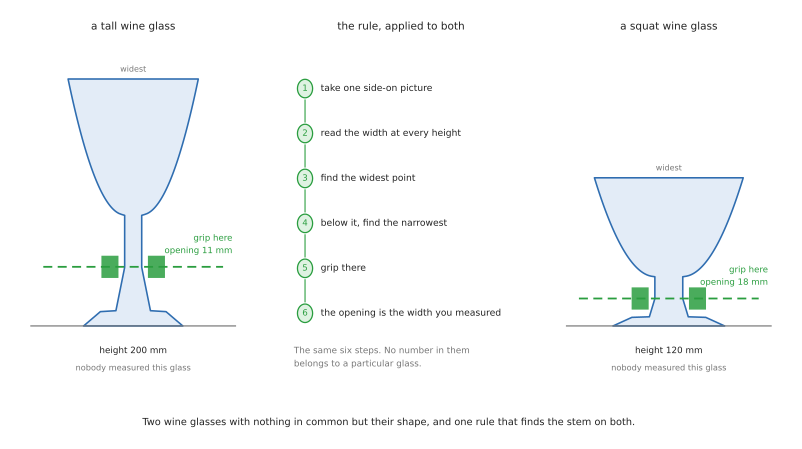

# Version 1: pick up a glass and stand it upside down

## What this project is

A robot arm stands beside a table. Glasses are standing the right way up on that
table. A drying rack sits on the same table, with six slots in it. The robot picks up
each glass, turns it completely over, stands it mouth-down in a free slot, and says
when each one is done.

That is the whole job. One arm, one gripper, two cameras, and a force sensor at the
wrist.

The moving part of it is simple. Everything difficult about it comes from the object.
A glass is transparent, so a depth camera cannot see it properly. It has to be turned
right over, which most arms cannot do from any starting position. It breaks if you
squeeze it too hard. And no two glasses of the same kind are quite the same size.

## What this version is for

This version exists to get one thing right: **pick a glass up and invert it, without
breaking it or dropping it.**

The hard part is that the robot is not told the size of the glass it is looking at.

It knows the **kinds** of glass it might meet. A straight glass is a tube. A stemmed
glass has a bowl above a narrow stem above a foot. A mug has a handle. Those shapes
are fixed, and the robot can be told about them in advance.

It does **not** know the proportions. One wine glass has a long thin stem and a small
bowl. The next has a short thick stem and a bowl twice the size. Both are wine glasses.
A pint glass and a shot glass are both straight glasses. If the robot works from
measurements typed into a file, it works for the glass that was measured and fails for
its neighbour.

So the robot measures each glass while it is standing there, and works out where to
hold it from that measurement.
[Section 4](#4-measuring-the-glass-while-it-stands-there) is how it measures.
[Section 5](#5-choosing-the-grip-point) is how it decides where to grip. Those two
sections are the heart of this document.

Adding a new kind of glass should then mean writing one short rule, not measuring
anything. [Section 7](#7-adding-a-new-kind-of-glass) is how that works, and how you
prove it in simulation across many sizes.

## What is in scope, and what is not

**In scope.** Finding the glasses and the rack. Working out which kind each glass is.
Measuring its actual size. Working out where to hold it and how hard. Picking it up.
Turning it over. Standing it in a slot. Reporting what happened, one glass at a time.
Recovering when a step fails.

**Not in scope, on purpose.**

*Anything inside the glass.* Every glass here is empty, and nothing checks what is in
one. [The case study](01_place-glass.md) is where that is worked out.

*Learning the task.* Nothing here is trained to pick anything up. Perception uses a
trained model, which is a different thing: a network recognises the glass, and ordinary
code decides what to do about it. No policy, no demonstrations.

*Kinds of glass with no rule.* If a glass does not match any known shape, the robot
leaves it alone and says so. That is correct behaviour, not a failure.

## Who this is for

Somebody about to build this. It says what happens first, what happens next, and which
named tool does each step.

The reasoning behind the choices — why a depth camera cannot see a glass, why the turn
has to be planned backwards — lives in [the case study](01_place-glass.md), which is
the longer document this one condenses. Read that for the argument. Read this for the
sequence.

Every tool named here is open source, and
[section 9](#9-every-framework-and-why-it-was-chosen) gives the licence of each. One of
them has a licence that will matter if this ever becomes paid work, and it is called
out there rather than buried.

## Contents

1. [What is known and what is not](#1-what-is-known-and-what-is-not)
2. [The shape of the solution](#2-the-shape-of-the-solution)
3. [The glass library: shapes, not sizes](#3-the-glass-library-shapes-not-sizes)
4. [Measuring the glass while it stands there](#4-measuring-the-glass-while-it-stands-there)
5. [Choosing the grip point](#5-choosing-the-grip-point)
6. [How hard to squeeze when the weight is unknown](#6-how-hard-to-squeeze-when-the-weight-is-unknown)
7. [Adding a new kind of glass](#7-adding-a-new-kind-of-glass)
8. [The workflow, step by step](#8-the-workflow-step-by-step)
9. [Every framework, and why it was chosen](#9-every-framework-and-why-it-was-chosen)
10. [How the robot reports each glass](#10-how-the-robot-reports-each-glass)
11. [When a step fails](#11-when-a-step-fails)
12. [Build it in this order](#12-build-it-in-this-order)
13. [Where to read more](#13-where-to-read-more)

---

## 1. What is known and what is not

This split decides almost every choice further down. Anything in the first column can
be written in a file. Anything in the second column has to be worked out by a camera or
a sensor, on every single run.

| Known in advance | Measured or worked out every run |
| --- | --- |
| The kinds of glass, and their shape | The height of this particular glass |
| Where to hold each kind, as a rule | Its width at every height |
| The rack has six slots, and how far apart | Its weight |
| The height of the rack and the size of a slot | Where it is standing, and which way it is turned |
| Where the arm and the table camera are bolted down | How many glasses are on the table |
| The gripper's finger range and force limits | Which slots are already taken |

Compare that with the obvious design, where a person measures five glasses and types
the numbers into a file. The first three rows of the right-hand column would move to
the left. That design is simpler, and it breaks the first time somebody puts a taller
wine glass on the table.

The five kinds it starts with are a **straight glass**, such as a rocks or a pint
glass; a **stemmed glass**, such as a wine glass, with a bowl above a narrow stem above
a foot; a **handled glass**, such as a beer mug; a **tapered glass**, such as a
milkshake glass, wider at the top than at the bottom; and a **short-stemmed glass**,
such as an Irish coffee glass, which is a stemmed glass that sometimes has a handle
too.

Notice that those names describe shapes rather than drinks. That is deliberate. A pint
glass and a shot glass are the same shape at different sizes, so they are one kind, and
the robot tells them apart by measuring rather than by recognising.

---

## 2. The shape of the solution

The robot runs one loop. The loop handles one glass from start to finish before it
looks at the table again.

```
find the rack, and which of its six slots are free
look at the table and list the glasses, with a kind for each
while there is a known glass on the table and a free slot:
    choose the next glass, and the slot it will go in
    move the wrist camera to a side view and measure the glass
    work out where to hold it, and how wide the fingers must open
    pick it up, and find out what it really weighs
    turn it 180 degrees, mouth down
    lower it into the slot until it touches
    let go, retreat, and check it is standing
    report this glass as done
    look at the table again
report what is left and why
```

The two lines in the middle are what this version adds over the obvious design. They
cost about a second per glass, and they are what lets the robot handle a glass nobody
measured.

Looking again after every glass is also worth its second. Glasses get nudged. A person
puts another one down. A plan made once at the start would be wrong by the third glass.

---

## 3. The glass library: shapes, not sizes

Everything the robot knows in advance about glasses lives in one file. The rule for
what may go in it is strict:

> **The library may hold rules and limits. It may not hold the size of any glass.**

A rule is something like "hold the narrowest part below the bowl". That is true of
every stemmed glass ever made. A size is something like "hold it 90 mm up", which is
true of exactly one glass.

If you find yourself wanting to write a millimetre figure that describes a glass, the
rule is missing. If you find yourself writing `if kind == "wine"` in code, the library
is missing a field.

### What one record holds

Write it as [YAML](https://yaml.org/), which is a plain text format a person can edit
and a program can read.

```yaml
stemmed_glass:
  # how to recognise it
  model_class:        stemmed_glass
  expects_handle:     false

  # where to hold it, as a rule over the measured profile
  grip_rule:          narrowest_below_widest
  search_band:        [0.10, 0.60]   # fraction of total height to look in
  min_band_height_mm: 12             # the flat part must be at least this tall

  # limits, so a silly answer is rejected rather than attempted
  min_opening_mm:     5
  max_opening_mm:     40
  wall:               thin           # sets the force cap, see section 6

  # placement
  needs_empty_neighbour: auto        # decided from the measured width
```

Every number there is a **limit or a fraction**, never a measurement of a glass.
`search_band` says to look in the lower half. `min_opening_mm` says the fingers cannot
usefully close tighter than 5 mm. Neither would change if you swapped every wine glass
in the house.

### The five starting kinds

| Kind | What defines the shape | Grip rule | Handle? |
| --- | --- | --- | --- |
| Straight | walls roughly parallel from base to rim | lowest section where the wall is vertical | no |
| Stemmed | a narrow waist between a wide bowl and a wide foot | the narrowest part below the widest part | no |
| Handled | a straight glass with something sticking out of one side | as straight, but approach square to the handle | yes |
| Tapered | width grows steadily from base to rim | the lowest section where the wall is closest to vertical | no |
| Short-stemmed | a short waist, thicker walls, sometimes a handle | as stemmed, with the handle rule if one is found | maybe |

Every one of those rules is a sentence about shape. None mentions a number belonging to
a particular glass. That is what makes the design survive a new glass.

### The rack file

The rack is known, but where it is standing is not. So a second file holds the rack's
own measurements: six slots, the spacing between them, the slot height, and where each
slot sits relative to a corner of the rack. At run time the camera finds the rack once,
and every slot position follows from that one measurement.

Spacing is what limits how a slot can be used. With slots 100 mm apart, a glass 80 mm
across leaves 10 mm of clearance on each side. Because a glass is tall, that clearance
is used up by tilt much faster than by sideways error. The arm can be 10 mm out
sideways, or tilted by `atan(10 / 90)`, which is 6.3 degrees, but not both.

A wider or taller glass gets a smaller angle. At 90 mm across and 175 mm tall the same
sum gives 1.6 degrees, which no arm should be asked for. So the robot computes this for
each glass **after measuring it**, and sets `needs_empty_neighbour` itself. Leaving a
gap turns 1.6 degrees into 17.4 degrees, which is a placement that works. This is one
more thing that cannot be decided in advance when sizes vary.

---

## 4. Measuring the glass while it stands there

The robot needs three things before it can pick a glass up: how tall it is, how wide it
is at every height, and whether it has a handle. All three come from one extra camera
shot.

### Why this is possible at all

Almost every drinking glass is a **solid of revolution**. Spin a flat outline around a
vertical axis and you have the glass. Handles are the exception, and they are dealt
with below.

That matters because of what it means for a photograph. Look at a solid of revolution
from the side and its outline tells you the whole shape. The width you see at any
height *is* the diameter at that height. One side-on picture gives you the full profile,
and it does not matter which side you take it from.

So the measurement is: take one side-on picture, find the outline, and read the width
off it at every height.

### Why the overhead camera cannot do it

The camera above the table sees the glass from above. It sees the rim as a circle and
almost nothing of the wall below. Height barely registers, and a tall glass and a short
one with the same rim look nearly identical.

The overhead camera is still the right tool for finding **where** the glasses are and
**which kind** each one is. It is the wrong tool for measuring one.

### How the wrist camera does it

The wrist camera is on the end of the arm, so the robot can put it wherever it likes.
Move it to one side of the chosen glass, at about the height of the middle of the
glass, looking horizontally. Take one picture.

Segment that picture with the same model used on the table, which gives the outline of
the glass against the background. Reading the width at each height down that outline
gives a list of numbers: the width profile.

### Turning pixels into millimetres

An outline in a picture is measured in pixels. The robot needs millimetres.

Two things make the conversion possible. The first is that the camera is calibrated, so
the robot knows how many degrees each pixel covers. The second is that the glass is
standing on the table, and the depth camera has already measured where the table is.
The base of the glass is therefore at a known place in the room, and the distance from
the wrist camera to that point is known too.

Knowing the distance turns an angle into a length. A pixel covering a small angle at
300 mm covers a known number of millimetres. Because the glass is a flat-on silhouette
at roughly one distance, a single scale factor is close enough over the whole outline,
with a small correction for the parts nearer to and further from the camera.

This is the one place where the transparency of glass helps rather than hurts. The
robot never needs a depth reading *of the glass*, which it could not get. It needs a
depth reading of the **table**, which is opaque and easy.

### Finding a handle

A handle is the part of a glass that is not a solid of revolution, and that is exactly
how the robot finds it.

Take a second picture from ninety degrees around. If the glass is a solid of revolution,
the two profiles match. If one view has a lump on one side that the other does not, that
lump is a handle, and its position across the two views says which way it points.

Only kinds whose record sets `expects_handle` need the second picture. For the others
one view is enough, and the robot saves a second per glass.

### What comes out

| Measurement | What it is used for |
| --- | --- |
| Total height | the search band, and the tilt budget for placing |
| Width at every height | choosing the grip point, and the finger opening |
| Widest point | rack clearance, and whether a neighbouring slot must stay empty |
| Base width | checking the glass is standing on its base and not on its side |
| Handle direction, if any | the approach direction for the grasp |

**Confirmed by:** the outline reaching the table plane at the bottom, a height inside a
sane range, and a profile that is smooth rather than ragged. A ragged profile usually
means the segmentation caught a reflection, and the right response is another picture
from a different side.

---

## 5. Choosing the grip point

This section answers the question the whole design turns on: **if the robot was never
told the size of this glass, how does it know exactly where to close the fingers?**

It reads the answer off the profile it has just measured, using the rule from the
library for that kind of glass.



### The three things a good grip point has

These are the same three whatever the glass, and they are why the per-kind rules look
the way they do.

**It is low on the glass.** The glass is about to be turned upside down, so whatever
the fingers hold ends up in the air. Hold it near the base, and after the turn the
fingers are high above the rack rather than down among the pegs and the neighbouring
glasses.

**It is on a strong part.** Thin bowls crack. Stems, thick walls, and the area just
above a foot do not.

**It is where the wall is vertical.** Two flat fingers closing on a slope push the glass
along that slope, the way a wet bar of soap squirts out of your hand. On a vertical wall
they just press.

### The features the robot finds in the profile

The profile is a list of widths, one per height. Everything below comes from looking at
that list, and none of it needs to know how big the glass is.

| Feature | How it is found | What it means |
| --- | --- | --- |
| Base | the lowest height where the outline meets the table plane | where the glass stands; heights are measured up from here |
| Rim | the highest point of the outline | the top of the glass |
| Widest point | the height where the width is greatest | usually the rim, or the bowl on a stemmed glass |
| Waist | a local minimum in width, with wider parts above and below | the stem of a stemmed glass |
| Foot | a local maximum below the waist | the base of a stemmed glass |
| Vertical sections | runs of height where the width barely changes | where flat fingers can press without sliding |

"Barely changes" needs a number, and it is a property of the gripper rather than of the
glass. Within about two degrees of vertical is flat enough for a silicone pad. That
figure belongs in the gripper's own configuration, not in a glass record.

### The rules, applied

Each kind's `grip_rule` names one of a handful of procedures. All of them return a
height, and the finger opening is then simply the measured width at that height.

**`lowest_vertical_section`** — used by the straight and handled glasses. Look through
the search band from the bottom up. Find the first run of heights, at least
`min_band_height_mm` tall, where the wall is within two degrees of vertical. Grip in the
middle of that run.

**`narrowest_below_widest`** — used by the stemmed and short-stemmed glasses. Find the
widest point. Below it, find the narrowest point. That is the stem. Grip in the middle
of the stem, where it is straightest.

**`flattest_in_band`** — used by the tapered glass, which has no vertical section
anywhere because the whole wall slopes. Find the run of heights inside the search band
where the wall is closest to vertical, even though it is not vertical. On a tapered
glass that is always near the bottom.

**The handle rule**, applied on top of any of the above when a handle was found. The
grip height does not change. The approach direction does: come in square to the handle,
so that neither finger lands on it.

### Reading off the opening

Once the height is chosen, the finger opening is the width the robot measured at that
height. It is not looked up anywhere.

This is worth pausing on, because it is what makes the design work. On a wine glass the
opening comes out at roughly the width of the stem, which might be 7 mm or 14 mm
depending on the glass, and the robot does not care which. On a tapered glass the
opening comes out far narrower than the rim, because the grip point is near the bottom
where the glass is narrow. Nobody typed either number.

### Checking the answer before trusting it

A rule can return a silly answer on an odd glass, so every grip point is checked before
the arm moves.

| Check | Why |
| --- | --- |
| The opening is between `min_opening_mm` and `max_opening_mm` | catches a waist found in a reflection, and a glass too wide for the gripper |
| The opening is inside the gripper's own range | the gripper has a physical limit, and it is not the same as the rule's limit |
| The flat band is at least `min_band_height_mm` tall | the pads need somewhere to sit; a band thinner than the pad will slip |
| The grip height is below half the total height | rule one, enforced rather than assumed |
| Nothing else is within the finger swing | a neighbouring glass in the way |

If any check fails, the robot does not pick that glass up. It reports it as ungrippable
and moves on. **A glass left standing is a far better outcome than a glass picked up
badly**, and this is where that decision is made.

### Why this beats a table of measurements

It is worth being explicit, because the table of measurements is the obvious design and
it looks simpler.

A table of measurements is right for the glasses that were measured and wrong for all
the others. It is wrong *silently*: the fingers close to the width in the file, meet
nothing, and report success. Adding a new glass means an afternoon with a ruler.

Measuring at run time costs one camera shot and some arithmetic over a list of numbers.
In exchange, a pint glass and a shot glass are handled by the same rule, an unfamiliar
wine glass works the first time, and adding a kind means writing a sentence about shape.

---

## 6. How hard to squeeze when the weight is unknown

A glass held between two fingers is not resting on anything. It hangs there, and the
only thing stopping it sliding down is friction between the pad and the glass. Press
harder and there is more friction. Press too hard and the glass cracks.

The force needed depends on the weight. The robot does not know the weight, because it
does not know the size. So it estimates first, then measures.

### The sum, when you do know the weight

> the force each pad presses with = (the weight of the glass × a safety factor)
> ÷ (2 × the grip factor)

The **weight** in newtons is the mass in kilograms times 9.81. The **2** is there
because two pads each do half the holding. The **grip factor** says how grippy the pad
is against glass; for a soft silicone pad on dry glass, 0.6 is a reasonable starting
figure and one to measure yourself. The **safety factor** of 2 means squeezing twice as
hard as the sum says, which covers a small knock.

So a 250 g glass needs 2.45 × 2 ÷ (2 × 0.6) = 4.1 N per pad.

### Stage one: estimate the weight from the profile

The robot has just measured the outline, so it knows roughly how big the glass is.
Spinning that outline gives the volume it occupies. A glass is a shell rather than a
solid, so multiply by a wall thickness from the kind's record and by the density of
glass, which is about 2500 kg per cubic metre.

That estimate is rough. It will be wrong by a third either way, because wall thickness
varies more than anything else about a glass. It does not need to be better, because it
is only used to get into the right range before the real measurement.

Put the estimate through the sum and you have a starting force.

### Stage two: take up the slack and find the true width

Close the fingers slowly, commanding a small force, and stop the moment contact is
detected. The finger width at that moment is the **true width of the glass at the grip
point**, measured by touch rather than by camera.

Compare it with the width the camera predicted. They should agree within a couple of
millimetres. If the fingers close much further than predicted, there is nothing there,
so open and start again. This is the cheapest error check in the job.

### Stage three: weigh it

Squeeze to the estimated force. Lift the glass ten millimetres and hold still. The wrist
force sensor now reads the weight of the glass plus the gripper, and subtracting the
gripper gives the glass.

**That is the true weight**, and it arrives while the glass is still a centimetre above
the table, which is the last moment where a mistake is free.

Put the true weight through the sum. If the applied force is already enough, carry on.
If it is not, set the glass down, increase the force, and grip again. Setting it down
and re-gripping is safe. Increasing the force while holding it is not, because the extra
squeeze arrives as a shock.

### The cap, and refusing a glass

Every kind's record carries a `wall` setting of thin, normal or thick, and that sets the
maximum force the robot will apply to that kind.

If the true weight needs more force than the cap allows, the robot has found a glass it
cannot safely hold: heavy, with thin walls. The correct response is to put it down and
report it, not to squeeze harder and hope.

This is the one place where the design accepts a worse outcome in exchange for never
breaking anything. A glass left on the table is a result. A cracked rim is not.

### Watching for slip

One more check before the turn. Tilt the glass twenty degrees, slowly, and watch the
finger width. A width that creeps means the glass is sliding. It is still recoverable at
twenty degrees and it is not at a hundred and eighty, so this is where to catch it.

If it creeps, put it down, raise the force by one newton, and grip again. Two attempts,
then give up on that glass.

### Command a force, not a width

Throughout the above, the gripper is commanded by force and never by width. That is
[gripper_controllers](https://control.ros.org/jazzy/doc/ros2_controllers/gripper_controllers/doc/userdoc.html)
in [ros2_controllers](https://github.com/ros-controls/ros2_controllers), driven by
[ros2_control](https://github.com/ros-controls/ros2_control), doing what it is for.

Commanding a width would undo everything in this section. Glasses of the same kind vary
by millimetres, which is the whole problem being solved here. And if the width is
commanded and perception was wrong, the fingers reach that width without touching the
glass, and nothing reports a problem, because the gripper did exactly what it was told.

---

## 7. Adding a new kind of glass

Because the library holds rules rather than sizes, adding a kind is smaller work than it
would otherwise be. There is usually nothing to measure at all.


### Part one: is it really a new kind?

Ask first whether an existing rule already covers it, because most of the time one does.

A champagne flute is a stemmed glass. A shot glass is a straight glass. A tall thin
highball is a straight glass. None of those needs anything new, and the right test is to
put one in front of the robot and see whether it works. **If it does, you are finished,
and this is the design paying off.**

You need a new kind only when the *shape* is new in a way the rules cannot describe. A
teacup on a saucer. A stemless wine glass. A conical cocktail glass whose widest point
is the rim and which has no vertical section anywhere.

### Part two: write the rule

A new record says how to recognise the shape and where to hold it. If one of the
existing grip rules fits, the record is four or five lines and you are done.

If none fits, you are writing a new grip rule, which is a short procedure over the width
profile. That is real work, but it is bounded: the input is a list of widths, the output
is a height, and you can test it against saved profiles with no robot anywhere. Keep the
rule general. "The narrowest point above the widest point" is a rule. "85 mm up" is not.

### Part three: put it in the simulator, in many sizes

The new kind needs a model to be tested against. A glass is easy to make, because it is
symmetrical about its vertical axis: draw the outline of one side and spin it.
[trimesh](https://github.com/mikedh/trimesh) does this in a few lines and is MIT
licensed. [Blender](https://www.blender.org/) does it interactively.

**Make the collision shape separately, and keep it simple.** The collision shape is what
the physics engine uses for contact. It does not have to look like the glass, and it
should not be the detailed mesh, because detailed meshes make contact slow and unstable.
A stack of two or three cylinders is usually enough. Where the shape genuinely is not
convex, such as a mug handle, [CoACD](https://github.com/SarahWeiii/CoACD) (MIT) breaks
it into convex pieces automatically.

Then the part that matters most here. **Do not make one model. Make a family.**

Write the outline as a small script with the proportions as parameters, and generate
twenty glasses of the new kind across the range you expect to meet: short and tall, thin
and fat, thin-walled and thick-walled, narrow stems and wide ones. This costs almost
nothing once the script exists, and it is the only way to find out whether your rule is
really a rule or just a description of the one glass you had in mind.

### Part four: prove it across the family

Do not put a new kind in front of the real robot until it has passed a scripted test.
The test is the same every time.

| What to vary | Over what range | Why |
| --- | --- | --- |
| **The proportions of the glass** | the whole family you generated | this is the point: the rule must work on all of them |
| Where it stands on the table | anywhere the arm can reach | the grasp pose is computed, so it must work everywhere |
| Which way it is turned | 0 to 360 degrees | catches a handle rule that only works from one side |
| How close its neighbours are | from clear to nearly touching | catches an approach that swings into the glass next door |
| Which slot it goes to | every slot, including the end ones | catches a tilt budget that only works in the middle |

Run at least fifty attempts, spread across the family rather than concentrated in the
middle of it. Record five numbers, because they fail for different reasons and one
combined number hides which part is broken.

| Number | What it means | A reasonable gate |
| --- | --- | --- |
| Measurement success | a clean profile, and a grip point that passed its checks | 98% |
| Grasp success | the fingers closed, and the touched width matched the camera | 95% |
| Lift success | it came off the table and the wrist twist stayed small | 95% |
| Invert success | it turned 180 degrees without shifting in the fingers | 98% |
| Place success | it is standing in the slot afterwards | 90% |

When a gate fails, **look at which members of the family failed**, because that is the
diagnosis.

- **Failures at one end of the size range** — the search band is wrong. A band of 0.10
  to 0.60 of the height can miss the stem on a very tall glass.
- **Failures on thin-walled members only** — the force cap is too low, or the wall
  thickness in the record is too high and the estimate is overshooting.
- **Measurement failures scattered anywhere** — usually reflections rather than the
  rule. Try the second viewpoint.
- **Failures spread evenly across the whole family** — the rule itself is wrong.

### What simulation will not tell you

Be clear about the limit, because trusting the simulator here is the expensive mistake.

**The grip force is not simulated usefully.** Rigid fingers closing on a thin rigid
shell is close to the worst case for any physics engine. The contact force the simulator
reports is not a number to act on.

So take the measurement, the rule, the reach, the clearances and the tilt budget from
simulation, all of which it models well. Take the force from the sum in
[section 6](#6-how-hard-to-squeeze-when-the-weight-is-unknown) and the weighing step,
and confirm it on ten real picks.

### The checklist

- [ ] An existing kind was tried first, and genuinely does not fit
- [ ] A record exists, holding rules and limits and no glass measurements
- [ ] A parameterised script generates at least twenty glasses of the new kind
- [ ] The perception model recognises the new kind
- [ ] Fifty simulated attempts across the family pass all five gates
- [ ] Ten real picks, on at least three different glasses of that kind
- [ ] No code was changed, unless a genuinely new grip rule was needed

---

## 8. The workflow, step by step

Each step says what happens, which tools it uses, and how the robot knows the step
worked. That last part is what turns a demonstration into something you can leave
running.

### Step 1: find the rack and count the free slots

The robot takes one picture from the table camera and finds the rack in it. The reliable
way is a printed marker, an [AprilTag](https://github.com/AprilRobotics/apriltag), glued
to the rack base. A tag is a flat black-and-white pattern that a camera can locate
exactly, in both position and rotation, from a single frame. Given the tag, every slot
position follows from the rack file.

Then it works out which slots are already occupied. Run the same segmentation model over
the rack area, and mark a slot as taken if a glass outline covers it.

**Uses:** [apriltag_ros](https://github.com/AprilRobotics/apriltag_ros) to read the
marker, running inside [ROS 2](https://docs.ros.org/en/jazzy/index.html), the Robot
Operating System; the table camera read through
[image_pipeline](https://github.com/ros-perception/image_pipeline).

**Confirmed by:** a tag pose inside the table area that has not jumped since the last
cycle, and a free-slot count between zero and six. If the tag cannot be seen at all,
stop, because there is nowhere to put anything.

### Step 2: find the glasses and say which kind each one is

One picture of the table, one pass of a segmentation model, and the result is an outline
and a kind for every glass. Segmentation means the model returns the shape of each
object rather than just a box around it.

A depth camera is nearly useless for the glass itself. Most of its light goes straight
through, and the rest is bent by the curved wall, so the depth picture has a hole exactly
where the glass is. Depth is used for the **table plane** instead. The outline comes from
the ordinary colour picture, and where the outline meets the table plane is where the
glass is standing.

Note what this step does not do. It does not measure the glass. It says "there is a
stemmed glass at roughly here", which is all the next step needs.

**Uses:** a segmentation model trained on a few hundred pictures of your own glasses —
see [section 9](#9-every-framework-and-why-it-was-chosen) for which one and why the
licence matters; [SAM 2](https://github.com/facebookresearch/sam2) to outline those
training pictures quickly; [Open3D](https://github.com/isl-org/Open3D) to fit the table
plane.

**Confirmed by:** every detection having a kind and a position on the table plane. No
match means it is not a glass the robot knows, and the right response is to leave it
alone.

### Step 3: choose the next glass and its slot

Take the glass nearest the robot with nothing standing between it and the arm. Give it
the free slot whose neighbours are emptiest, working outward from the far end so that
placed glasses are never between the arm and the next slot.

The slot choice is provisional, because the width that decides whether a neighbour must
stay empty has not been measured yet. Step 4 may send this back.

**Uses:** ordinary [Python](https://www.python.org/). This is arithmetic over six slots.

### Step 4: measure the glass

Move the wrist camera to a side view of the chosen glass and take a picture. Extract the
width profile, as in [section 4](#4-measuring-the-glass-while-it-stands-there). If the
kind expects a handle, take a second picture ninety degrees round.

Now confirm the slot. The measured widest point says whether this glass needs an empty
neighbour, and if the provisional slot cannot take it, choose another.

**Uses:** the wrist camera through
[image_pipeline](https://github.com/ros-perception/image_pipeline); the same
segmentation model; [MoveIt 2](https://github.com/moveit/moveit2) to move the camera
there; [NumPy](https://numpy.org/) for the profile arithmetic, which is a few dozen
lines over a list of widths.

**Confirmed by:** an outline that reaches the table plane, a height in a sane range, and
a smooth profile. A ragged profile usually means a reflection was caught, and the right
response is another picture from a different side.

### Step 5: choose the grip point

Apply the kind's rule to the profile, as in [section 5](#5-choosing-the-grip-point), and
run the checks. This is arithmetic rather than movement, and it takes no measurable
time.

**Uses:** [NumPy](https://numpy.org/), and the glass library.

**Confirmed by:** all five checks passing. If any fails, report the glass as ungrippable,
leave it standing, and go back to step 3 for a different one.

### Step 6: pick it up and find out what it weighs

The arm goes to the grasp pose and runs the three stages from
[section 6](#6-how-hard-to-squeeze-when-the-weight-is-unknown): take up the slack and
compare the touched width against the camera, squeeze to the estimated force, then lift
ten millimetres and weigh it. Adjust the force if the true weight demands it.

One detail is easy to get wrong and expensive to discover late. **Turn the wrist
backwards before closing the fingers**, so that the 180 degrees of turn still fits
inside the wrist's travel. Most arms have a last joint that stops near 175 degrees, and a
turn planned after the grasp is a turn that does not fit.

**Uses:** [MoveIt 2](https://github.com/moveit/moveit2) to plan the reach;
[MoveIt Task Constructor](https://github.com/moveit/moveit_task_constructor) to plan the
grasp, the turn and the placement as one problem rather than three;
[gripper_controllers](https://control.ros.org/jazzy/doc/ros2_controllers/gripper_controllers/doc/userdoc.html)
commanded as a force;
[force_torque_sensor_broadcaster](https://control.ros.org/jazzy/doc/ros2_controllers/force_torque_sensor_broadcaster/doc/userdoc.html)
for the weighing.

**Confirmed by:** the touched width matching the camera, and a weight the force cap can
hold.

### Step 7: turn it over

Tilt twenty degrees first and watch the finger width for creep. If it is steady, rotate
the wrist through 180 degrees. The glass is now mouth-down. The move was planned as part
of step 6's problem, not as a separate one, which is the reason for using MoveIt Task
Constructor at all.

**Uses:** [MoveIt Task Constructor](https://github.com/moveit/moveit_task_constructor).

**Confirmed by:** the finger width steady through the tilt, and the wrist twist unchanged
before and after the turn.

### Step 8: lower it into the slot

The arm moves above the chosen slot, then comes straight down, vertically. It does not
descend to a commanded height. It descends until the force sensor says the rim has met
the rack. The rack is light plastic and the exact height of its base is not worth
trusting to a measurement.

The descent must be vertical and upright. This is where the tilt budget is spent, and a
tilted descent is what knocks over the glass in the next slot.

**Uses:** the
[admittance_controller](https://control.ros.org/jazzy/doc/ros2_controllers/admittance_controller/doc/userdoc.html)
in [ros2_controllers](https://github.com/ros-controls/ros2_controllers), or
[cartesian_controllers](https://github.com/fzi-forschungszentrum-informatik/cartesian_controllers).
Either moves on a force instead of to a position.

**Confirmed by:** contact force arriving within the expected range of heights, which the
robot now knows because it measured the glass.

### Step 9: let go, back off, and look

Before the fingers open, read the wrist force again. If the rack is carrying the glass,
the load has gone. If it has not, the glass is caught on something and opening the
fingers will drop it, so lift away and try the slot again.

After the fingers open and the arm has retreated, take one more picture and ask the
step 2 model whether there is a glass standing in that slot.

**Confirmed by:** the load transfer, then the picture. Both have to agree.

### Step 10: report and loop

Publish one message for this glass, then go back to step 1. When there are no known
glasses left, or no free slots, stop and publish a summary.

---

## 9. Every framework, and why it was chosen

Everything here is open source. The table gives the licence of each, because the licence
is part of choosing a tool and it is easier to check now than after you have built on
it.

| Job | What we use | Licence | Rather than |
| --- | --- | --- | --- |
| Run everything and let the parts talk | [ROS 2](https://docs.ros.org/en/jazzy/index.html) | Apache-2.0 | writing your own message passing, and then your own tooling for it |
| Describe the arm | [URDF](https://docs.ros.org/en/jazzy/Tutorials/Intermediate/URDF/URDF-Main.html) | — | a bespoke model no other tool can read |
| Try it before the hardware exists | [Gazebo](https://github.com/gazebosim/gz-sim) | Apache-2.0 | [MuJoCo](https://github.com/google-deepmind/mujoco), whose contact model is better but which makes cameras and ROS harder, and here those matter more |
| Describe a glass to the simulator | [SDF](https://github.com/gazebosim/sdformat) | Apache-2.0 | hard-coding shapes in the world file, which cannot be reused |
| Generate a family of glass meshes | [trimesh](https://github.com/mikedh/trimesh) | MIT | modelling each by hand, which makes twenty variants unthinkable |
| Simplify a mesh for contact | [CoACD](https://github.com/SarahWeiii/CoACD) | MIT | letting the physics engine use the detailed mesh, which is slow and unstable |
| Find the rack | [AprilTag](https://github.com/AprilRobotics/apriltag) via [apriltag_ros](https://github.com/AprilRobotics/apriltag_ros) | BSD-2-Clause | recognising the rack itself, which is more work for a thing you may glue a marker to |
| Get corrected pictures from the cameras | [image_pipeline](https://github.com/ros-perception/image_pipeline) | BSD | opening the camera device yourself, then writing your own lens correction |
| Label the training pictures | [SAM 2](https://github.com/facebookresearch/sam2) | Apache-2.0 | outlining a few hundred glasses by hand |
| Find the glasses and their kind | see the note below | — | colour thresholding, which has nothing to work with on a transparent object |
| Fit the table plane | [Open3D](https://github.com/isl-org/Open3D) | MIT | [PCL](https://github.com/PointCloudLibrary/pcl), which is capable and heavier than this needs |
| Measure the profile and apply the rules | [NumPy](https://numpy.org/) | BSD-3-Clause | a geometry library, when the data is a list of widths and the work is arithmetic |
| Plan reach, turn and place as one | [MoveIt Task Constructor](https://github.com/moveit/moveit_task_constructor) | BSD-3-Clause | planning each stage separately, and finding that the grasp makes the turn impossible |
| Plan an ordinary move | [MoveIt 2](https://github.com/moveit/moveit2) | BSD-3-Clause | hand-written waypoints, which stop working the day the rack moves |
| Drive the joints | [ros2_control](https://github.com/ros-controls/ros2_control) | Apache-2.0 | your own control loop, where the hard part is the timing |
| Squeeze without breaking | the gripper controller in [ros2_controllers](https://github.com/ros-controls/ros2_controllers), commanded as a force | Apache-2.0 | commanding a finger width, which is exactly what fails when sizes vary |
| Weigh the glass | [force_torque_sensor_broadcaster](https://control.ros.org/jazzy/doc/ros2_controllers/force_torque_sensor_broadcaster/doc/userdoc.html) | Apache-2.0 | a scale in the table, which cannot weigh a glass the arm is holding |
| Come down onto the rack | the [admittance_controller](https://control.ros.org/jazzy/doc/ros2_controllers/admittance_controller/doc/userdoc.html) or [cartesian_controllers](https://github.com/fzi-forschungszentrum-informatik/cartesian_controllers) | Apache-2.0 | commanding a height into a rigid plastic base |
| Sequence the steps and recover | [BehaviorTree.CPP](https://github.com/BehaviorTree/BehaviorTree.CPP) | MIT | a state machine, which becomes unreadable as soon as recovery branches multiply |
| Hold the rules | one [YAML](https://yaml.org/) file, one record per kind | — | constants spread through the code |
| Record every attempt | [rosbag2](https://github.com/ros2/rosbag2) | Apache-2.0 | log lines, which cannot show you the frame before the drop |

### The one licence that will catch you out

The obvious choice for segmentation is
[Ultralytics YOLO](https://github.com/ultralytics/ultralytics). It is excellent, it is
the easiest to train, and nearly every tutorial uses it.

**It is licensed AGPL-3.0.** That is an open source licence and a strong one. In plain
terms: if you run AGPL software as part of a service other people use over a network,
you have to offer them the complete source of your system. Fine for a hobby project. For
consulting work, or anything delivered to a client, it is a decision to take deliberately
rather than discover later. Ultralytics sells
[a commercial licence](https://www.ultralytics.com/license) for exactly this reason.

If you would rather stay permissive, these do the same job:

| Alternative | Licence | What it is |
| --- | --- | --- |
| [torchvision](https://pytorch.org/vision/stable/models.html) Mask R-CNN | BSD-3-Clause | segmentation built into PyTorch. Fewest new dependencies, and the plainest code |
| [Detectron2](https://github.com/facebookresearch/detectron2) | Apache-2.0 | Meta's detection library. More capable, more to learn |
| [mmdetection](https://github.com/open-mmlab/mmdetection) | Apache-2.0 | a large model library with many architectures behind one configuration system |

For five shapes on one table, torchvision is enough and is the one to reach for first.
The labelling job is a few hundred pictures either way, and SAM 2 produces the labels.

### The hardware

A **two-finger parallel gripper with soft silicone pads**. The pads raise friction, and
friction is the only thing that lets you hold a glass gently. Suction is no use on a
curved object you are about to turn over.

**Two cameras, and both now do real work.** One above the table, which finds where the
glasses are and which kind each is. One on the wrist, which takes the side-on picture
that every measurement in this document comes from. The wrist camera also removes the
camera-to-arm calibration error over the last few centimetres, which is the error that
actually sinks this task.

**A force reading at the wrist**, needed three times: to detect contact when taking up
the slack, to weigh the glass, and to stop the descent onto the rack.

---

## 10. How the robot reports each glass

The requirement is a confirmation per glass, one at a time. That is a
[ROS 2 action](https://docs.ros.org/en/jazzy/Concepts/Basic/About-Actions.html), not a
topic. An action is the ROS call that runs for a while, sends progress while it runs,
and ends in success or failure, which is the shape of this job exactly.

| Field | What it carries |
| --- | --- |
| Goal | the glass identifier, its kind, and the slot chosen for it |
| Feedback | the current step, the measured height and width, the chosen grip height, the measured weight |
| Result | placed, refused as unrecognised, refused as ungrippable, or failed at step N |

Two different refusals, because they mean different things. *Unrecognised* means no kind
matched, so somebody may want to add one. *Ungrippable* means the kind was known and the
grip checks failed, which usually means a rule needs widening.

A refusal is a result, not an error. A glass the robot left alone is the system working,
and it should be reported in the same words every time so that a day's log can be
counted.

Record every attempt with [rosbag2](https://github.com/ros2/rosbag2): the camera frames,
the measured profile, the force trace, the finger width, and the planned and actual
poses. **Save the profile especially**, because a saved profile lets you test a changed
rule against every glass the robot has ever seen, with no robot involved.

---

## 11. When a step fails

Decide these before writing the code, because they change its shape.

| What happens | What the robot does |
| --- | --- |
| No glass where perception said | abandon this glass, take a new picture, carry on |
| The profile is ragged | take another picture from a different side, then give up on this glass |
| The grip checks fail | leave the glass standing, report it as ungrippable |
| Touched width does not match the camera | open, abandon this glass, take a new picture |
| The true weight needs more force than the cap allows | set it down, report it as ungrippable |
| Glass slides during the tilt | set it down, raise the force by one newton, try twice, then give up |
| Rim meets the rack too early | lift away, try the same slot once, then mark the slot bad |
| Load does not transfer before release | do not open the fingers, lift away, try again |
| Nothing standing in the slot afterwards | stop the cell and call a person |
| Anything breaks | stop the cell and call a person |

The last two are deliberately blunt. Broken glass leaves shards, and an arm that will
carry on moving through them, so a drop is never a retry. Stopping and calling somebody
is the correct response, and deciding that now changes the shape of the recovery code
you write.

---

## 12. Build it in this order

Four sittings, each of which ends with something that runs.

1. **One glass, everything known.** Mark a spot on the table, measure the rack once, and
   hard-code both. No cameras. This gets the grasp, the turn, the force descent and the
   release working, and it is the rig everything else is tested on. Do it in
   [Gazebo](https://github.com/gazebosim/gz-sim) first, where a dropped glass costs
   nothing.
2. **Add the cameras and the measuring.** Steps 1 to 5 of section 8, so the glass can be
   anywhere and any size. This is the heart of the version and most of the work. Test it
   by generating the same glass at five different sizes and checking that the grip point
   moves sensibly.
3. **Add the force stages.** Section 6: estimate, take up the slack, weigh, adjust, cap.
   You find out here whether your force sum is right. Take the geometry from simulation
   and the force from a real glass.
4. **Add the reporting and the recovery.** Sections 10 and 11, moved into a behaviour
   tree. Only now is it something you can leave running.

Do not start one of these until the previous one fails for a reason you can say out
loud.

After all four, the next version is the one that deals with what is inside the glass,
and [the case study](01_place-glass.md) is where that is worked out.

---

## 13. Where to read more

- [The case study](01_place-glass.md) is the reasoning behind every choice here,
  including [what to use for each job](01_place-glass.md#4-which-part-uses-what),
  [where to hold a glass and why the middle is wrong](01_place-glass.md#where-to-hold-it),
  and [what to do about a glass with no record](01_place-glass.md#5-when-an-unfamiliar-glass-turns-up).
- [Tools and libraries](../../09_tools-and-libraries.md) explains each of the tools in
  section 9 properly, with code, including
  [MoveIt 2](../../09_tools-and-libraries.md#5-moveit-2-planning-a-safe-path),
  [ros2_control](../../09_tools-and-libraries.md#6-ros2_control-driving-the-motors) and
  [behaviour trees](../../09_tools-and-libraries.md#11-behaviour-trees-putting-a-task-in-order).
- [Programmed methods](../02_programmed-methods.md) covers the
  [force control](../02_programmed-methods.md#6-feedback-control) that sections 6 and 8
  depend on.
- [The glossary](../06_glossary.md) explains any term used here.
- [One-arm training](../01_overview.md) is the map of every other way this job could
  have been built, and
  [why the programmed route suits this one](../01_overview.md#5-which-method-for-which-task).
