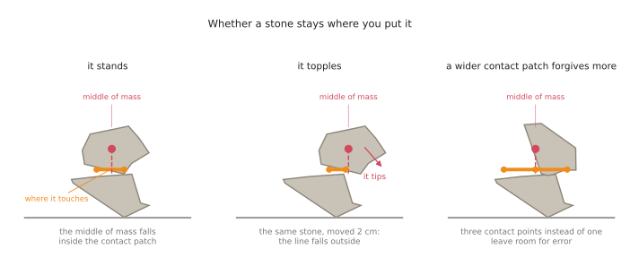
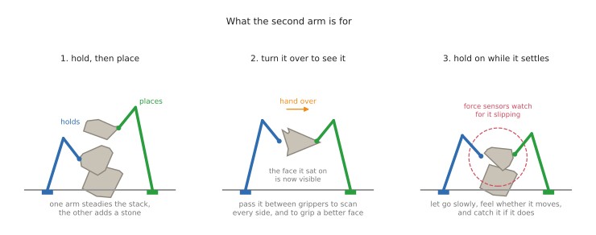
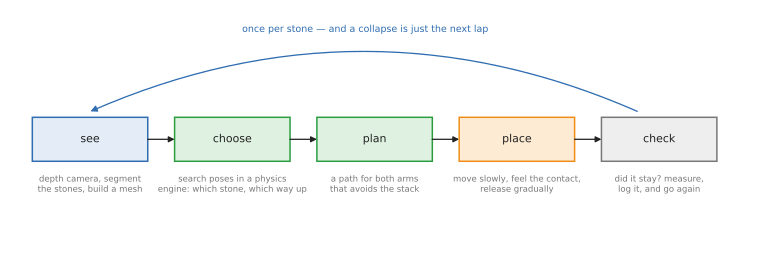

# Stone stacking with two arms

Balancing rough stones on top of each other is one of the best teaching tasks in
robotics. It is easy to describe, impossible to fake, and it fails honestly: at
the end of every attempt the tower either stands or it does not.

This doc is the high-level picture — what the system looks like, which parts are
programmed and which are trained, and which open frameworks do each job. It is
deliberately not code. It assumes any two open arms in simulation: two Franka
Panda arms, two UR5s, or the ALOHA pair from the
[two-arm doc](11_two-arm-manipulation.md), whichever your simulator already has.

## Contents

1. [Why stones are hard](#1-why-stones-are-hard)
2. [What makes a stack stand up](#2-what-makes-a-stack-stand-up)
3. [What the second arm is for](#3-what-the-second-arm-is-for)
4. [The system, end to end](#4-the-system-end-to-end)
5. [The frameworks for each stage](#5-the-frameworks-for-each-stage)
6. [Programmed, or trained?](#6-programmed-or-trained)
7. [A staged plan](#7-a-staged-plan)
8. [What to measure](#8-what-to-measure)
9. [What will bite you](#9-what-will-bite-you)
10. [Prior work worth reading](#10-prior-work-worth-reading)

---

## 1. Why stones are hard

A stone is the opposite of the box in this repo's camera area. The box is a
known shape, with flat faces, in a colour nothing else shares. Take that away
and almost every convenience goes with it:

- **No model.** Each stone is a different shape, so there is no CAD file to
  match against, and "where is the stone" has to mean "what shape is it, and how
  is it lying", worked out from the camera every time.
- **No good faces.** A box has six flat faces and you may pick any. A stone has
  a few nearly-flat patches, and which of them can carry weight depends on the
  stone underneath it.
- **The goal is a physical property, not a position.** "Stacked" does not mean
  the stone reached a pose. It means the tower is still standing a few seconds
  later. You cannot check that by looking at the commanded position; you have to
  let go and watch.
- **Errors accumulate upwards.** A stone placed one degree off tilts everything
  above it. The third stone is far harder than the first, and this is the single
  most reported finding in the published work on the task.
- **Contact is the whole task.** The interesting physics — friction, the exact
  contact points, whether it rocks — happens in the last millimetres, which is
  exactly where simulators are least accurate and position control is least
  useful.

---

## 2. What makes a stack stand up

One idea carries most of the reasoning. A stone stays put when the vertical line
down from its **middle of mass** falls inside the **contact patch**: the area
enclosed by the points where it touches what is below it. If the line falls
outside, there is nothing holding it, and it tips.

Two consequences run through the whole design.

**More contact points are worth more than perfect placement.** A stone resting
on three spread-out points forgives a few millimetres of error; one balanced on
a single high point forgives nothing. So "find a stable pose" really means "find
a pair of surfaces that touch in several places, well spread, under the middle
of mass".

**Friction decides the rest.** A slightly sloped contact holds if friction is
high and slides if it is not, which is why sim-to-real transfer on this task
lives or dies on the friction numbers, and why real systems place slowly and
feel for slip rather than trusting a plan.

That is the whole of the physics you need to follow the rest of this doc. The
system does not reason about it with formulas, mostly — it tries poses in a
physics engine and keeps the ones that survive.

---

## 3. What the second arm is for

One arm can stack stones. Two arms do three things one arm cannot, and they map
onto the coordination kinds in the
[two-arm doc](11_two-arm-manipulation.md#1-what-the-second-arm-adds):

1. **One holds, one places.** The steadying arm keeps the tower from moving
   while the other adds to it. This is the asymmetric case, and it is what makes
   a four-stone tower plausible instead of lucky.
2. **Turn it over to see it, and to grip it better.** A stone lying on the table
   hides the face it is lying on — which may be the face you most want to rest
   it on. Passing it from gripper to gripper lets the camera see every side, and
   lets the second arm take it by a face that leaves the good one free. This is
   a handover, the timing-critical case.
3. **Hold on while it settles.** Release is not a moment, it is a process: open
   slowly, watch the force, and if the stone starts to go, close again and try a
   different pose. Two arms mean the tower has a hand on it during the most
   dangerous second.

---

## 4. The system, end to end

The whole system is one loop, run once per stone. Nothing in it is exotic; the
difficulty is that every stage has to tolerate the previous stage being wrong.

**See.** A depth camera looks at the table and the tower. Segment the scene into
separate stones, and turn each one into a small 3D mesh. If an arm turns the
stone over, merge the views into one closed mesh, which is what the next stage
needs.

**Choose.** The interesting stage. Given the stones you have, the tower so far,
and the meshes of both, decide **which stone to add, which way up, and where**.
The practical way to answer is not to derive it but to *try* it: put the
candidate pose into a physics engine, simulate a few seconds, and see whether it
falls. Score many candidates and keep the best. This is exactly what the ETH
group did in 2017 ([section 10](#10-prior-work-worth-reading)).

**Plan.** Now it is an ordinary two-arm motion problem: get one gripper to the
stone, the other to the tower, without the arms hitting each other, the tower or
the table. Standard planners do this, given a description of both arms.

**Place.** Move slowly, switch from position control to force-aware control as
contact approaches, let the stone settle into its contacts, then open the
gripper gradually while watching whether anything moves.

**Check.** Wait a few seconds. Still standing? Record everything — the stones,
the chosen pose, the measured outcome. That record is free training data,
whichever learning method you use later. Fell over? That is also data, and the
next lap starts.

---

## 5. The frameworks for each stage

All of these are open source, and all of them have been used together on tasks
of this shape.

| Stage | The question | What does the job |
| --- | --- | --- |
| simulator | what physics do I develop against? | [MuJoCo](https://github.com/google-deepmind/mujoco) for contact-rich work, Gazebo if you want the full ROS stack, whichever your arms already have |
| arms | which robot? | any open description: two Panda or UR5 arms, or the ALOHA pair; ROS 2 drives them through [ros2_control](https://github.com/ros-controls/ros2_controllers) |
| segmenting the scene | which pixels are which stone? | [Segment Anything](https://github.com/facebookresearch/segment-anything) for the mask, then the depth picture to lift each mask into points |
| making a mesh | what shape is this stone? | [Open3D](https://www.open3d.org/): merge point clouds from several views, then surface reconstruction; [CoACD](https://github.com/SarahWeiii/CoACD) or [V-HACD](https://github.com/kmammou/v-hacd) to split the mesh into convex pieces, which is what a physics engine needs to simulate it quickly |
| choosing a pose | where does it go, and which way up? | a physics engine used as a search: sample poses, simulate, score. MuJoCo again, because it is the same engine you will run the robot in |
| planning the motion | how do both arms get there safely? | [MoveIt 2](https://moveit.ai/), which supports [two arms as separate planning groups](https://moveit.picknik.ai/main/doc/examples/dual_arms/dual_arms_tutorial.html) plus a combined group for moves that use both |
| placing it | how do I touch without knocking it over? | force-aware control: the [admittance controller](https://control.ros.org/rolling/doc/ros2_controllers/admittance_controller/doc/userdoc.html) in ros2_control, driven by a force-torque sensor at the wrist |
| learning, if you want it | can a policy do better than my rules? | [LeRobot](https://github.com/huggingface/lerobot) for imitation from demonstrations; a simulator benchmark such as [RoboTwin](https://github.com/RoboTwin-Platform/RoboTwin) if you want a ready-made two-arm training setup |

---

## 6. Programmed, or trained?

You have three honest options, and the third is the one most working systems
actually use. (For the full set of methods these three are drawn from, and how
they compare, see
[ways to programme or train two arms](09_two-arm-training/01_overview.md).)

**Programme all of it.** Perception, a physics-engine search for the pose,
planning, compliant placement — no learning anywhere. This is how the published
stone-stacking systems work, and it is the right first build: every stage is
inspectable, and when the tower falls you can say which stage was wrong. Its
weakness is the last centimetre, where contact is unpredictable and a scripted
approach is brittle.

**Train all of it.** Collect demonstrations by teleoperating both arms, and
train a policy that maps camera pictures straight to arm motion, the way the
[two-arm doc's step 2](11_two-arm-manipulation.md#42-step-2-copy-demonstrations)
does with ACT. It learns contact behaviour that nobody can write down. Its
weakness is that stacking is long and the failure comes at the end, so the
policy needs a lot of demonstrations to learn *why* something fell, and it will
not tell you when it is about to fail. The
[full-training folder](12_full-training/01_overview.md) follows this route all the
way: the rig, the demonstrations, the dataset, the training run and the
evaluation.

**Programme the thinking, train the touching.** Keep the physics search for
"which stone, which way up, where" — that part is well suited to search, and it
is easy to check. Learn the final approach, the settling and the release, from
demonstrations or from trial and error in simulation, because that part is
contact-rich and is where hand-written rules break. This split plays to what
each method is good at, and it leaves you with a system you can still debug.

Whichever you pick, the "check" stage gives you labelled data for free: every
attempt is a pose, a scene and an outcome. After a few hundred attempts you can
train a **stability predictor** — does this pose hold, yes or no — and use it to
throw out bad candidates before wasting a physics simulation or a real attempt.
That is usually the highest-value piece of learning in the whole system.

---

## 7. A staged plan

Do this in simulation, and change one thing at a time, the same loop as the
[two-arm doc](11_two-arm-manipulation.md#3-how-to-work-through-a-step).

| Stage | The scene | What you are proving | Done when |
| --- | --- | --- | --- |
| 1 | cubes, known poses given to you | the two arms can place and release without knocking anything over | three cubes stacked, ten times out of ten |
| 2 | cubes, found by the camera | perception is good enough to place on | same result, with nothing hand-fed |
| 3 | a few fixed irregular meshes, known in advance | the pose search works: which way up, and where | a three-stone tower that survives ten seconds, most attempts |
| 4 | irregular meshes the system has never seen | the perception-to-mesh path holds up | same, with stones drawn at random |
| 5 | shaken table, friction varied, stones nudged | it is robust, not lucky | success rate barely moves when you vary friction |
| 6 | real stones, real arms | sim-to-real | one tower, on video |

Stage 5 is the one people skip and should not: if success collapses when you
change the friction number, the policy has learned the simulator, not the task.

---

## 8. What to measure

Stacking gives better measurements than most tasks, so use them:

- **Tower height**, in stones. The headline number.
- **Survival time** after release — five seconds, thirty, a minute. A tower that
  falls after ten seconds was never stacked, it was balanced.
- **Attempts per stone.** How often it has to try again. This shows improvement
  long before height does.
- **Where the failures are**: grasping, the pose choice, the approach, or the
  release. Recording that split is what turns "it fell over" into work you can
  do next.
- **Robustness**: success against friction, against stone size, against a small
  nudge.

---

## 9. What will bite you

- **The release.** Opening a gripper moves the object. This ruins more attempts
  than bad pose choices, and it is why compliant control and a slow release
  matter more here than anywhere else.
- **Friction in simulation.** It is one number in a file, and it decides whether
  your tower stands. Vary it during training or you are tuning to a fiction.
- **Meshes that physics engines hate.** Reconstructed stone meshes are messy;
  engines want convex pieces. Convex decomposition is a required step, and it
  changes the shape slightly — which changes the contacts, which changes
  everything.
- **The third stone.** Expect success to fall off a cliff after two. That is the
  error accumulation, and it is the real research problem in this task.
- **Perception of plain grey rock.** No colour to threshold, little texture to
  match. Depth and shape do the work, not colour — the opposite of the
  [camera basics area](05_camera/02_finding-objects.md).
- **Two arms, one tower.** The steadying arm is touching the thing you are
  measuring. It can hold a tower up that would otherwise fall, so decide whether
  "success" means standing while held, or standing after both arms let go. Say
  which one you measured.

---

## 10. Prior work worth reading

- **[Autonomous robotic stone stacking with online next best object target pose
  planning](https://doi.org/10.1109/ICRA.2017.7989272)** (Furrer, Wermelinger,
  Yoshida, Gramazio, Kohler, Siegwart and Hutter, ICRA 2017) — the closest thing
  to this doc's task: an arm builds balancing towers from four arbitrarily
  placed rocks, scanning them, then searching for the next best stacking pose
  with a physics engine. [A readable
  summary](https://spectrum.ieee.org/incredibly-soothing-robot-makes-towers-of-balanced-stones).
- **[Autonomous dry stone](https://doi.org/10.1007/s41693-020-00037-6)**
  (Construction Robotics, 2020) and the ETH excavator that later built a
  [six-metre dry stone
  wall](https://ethz.ch/en/news-and-events/eth-news/news/2023/11/autonomous-excavator-constructs-a-six-metre-high-dry-stone-wall.html)
  — the same problem at building scale, with weight and centre of gravity
  estimated on site. The machine is [HEAP](https://arxiv.org/abs/2106.05059).
- **[The MIT Jenga robot](https://news.mit.edu/2019/robot-jenga-0130)** (Fazeli
  and colleagues, Science Robotics 2019) — not stacking, but the best worked
  example of the other half of this task: learning from force and vision
  together when the whole game is in the contact.

Then, for the two-arm side of it: this repo's
[two-arm manipulation doc](11_two-arm-manipulation.md), which lists the open
simulators, datasets and policies you would build any of this on, and says which
of them run without an NVIDIA card.

---

This doc is a map, not a manual: no part of it has been built here. The
[camera area](05_camera/01_basics.md) covers the perception ideas it leans on, the
[arm area](03_arm/01_overview.md) the frames and transforms, and the
[ROS basics](01_ros/02_ros-basics.md) the actions and controllers that would drive it.
