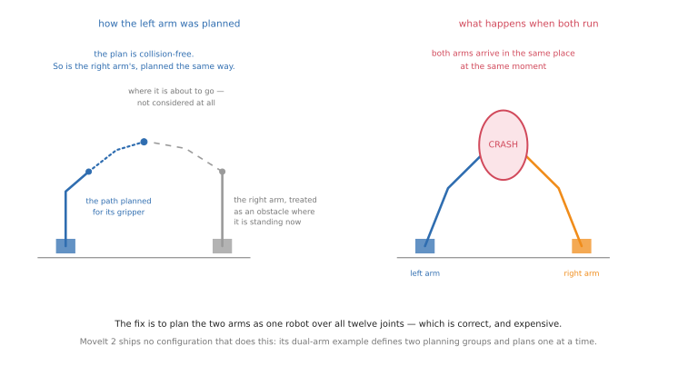
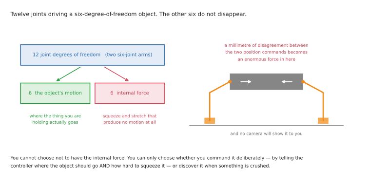

# Programmed methods for two coordinated arms

This document assumes you know
[the single-arm versions](../09_one-arm-training/02_programmed-methods.md) of these
methods. It does not repeat them. It says what changes when two arms have to
cooperate — and the honest summary is that **one of these five methods handles the
hard case and the other four work around it**.

That is not a criticism of the other four. Teaching, offline programming, behaviour
trees and motion planning all extend to two arms perfectly well as long as the arms
take turns, or stay out of each other's way, or one simply holds still while the
other works. What none of them can express is two arms holding the same object at
the same time. That belongs to feedback control, which is
[section 5](#5-feedback-control-and-the-closed-chain) and the reason to read this.

Remember the scope: this is about **coordinated** work. Two arms doing unrelated
things in one cell need nothing from this document — plan each with the single-arm
methods and check they do not collide.

## Contents

1. [Teaching two arms](#1-teaching-two-arms)
2. [Offline programming and synchronisation points](#2-offline-programming-and-synchronisation-points)
3. [Behaviour trees, where role assignment lives](#3-behaviour-trees-where-role-assignment-lives)
4. [Motion planning for a pair](#4-motion-planning-for-a-pair)
5. [Feedback control and the closed chain](#5-feedback-control-and-the-closed-chain)
6. [What to take from all five](#6-what-to-take-from-all-five)

The task group letters — A to D — are from
[the task catalogue](02_when-two-arms-help.md#5-the-tasks-two-arms-are-asked-to-do).

---

## 1. Teaching two arms

Teaching and replaying is still perfectly workable with two arms, and it is how
dual-arm industrial robots are actually programmed. You teach the holding arm its
one pose, you teach the working arm its sequence, and you insert waits so that
neither moves while the other is in its space. For a loosely coupled
hold-and-work task where the holding arm never moves during the work, this is
genuinely all you need.

What it leaves out is continuously coordinated motion, and **industrial controllers
have a specific answer for it that is worth studying, because it shows exactly what
coordination demands.**

ABB's dual-arm facility offers three modes. The first is independent — out of scope
here. The second is semi-coordinated, where one arm moves relative to a coordinate
frame that the other arm is holding, but only one moves at a time. The third is
coordinated-synchronised, where both move together as one motion.

**Turning on the synchronised mode imposes a rule that tells you everything about
the difficulty.** The number of motion instructions between switching
synchronisation on and off **must be identical in both arms' programmes**, and
matching instructions are paired by an identifier so that the controller can step
them together. Two arms moving as one is not two programmes running side by side.
It is one programme written twice, in lockstep, and the controller enforces the
lockstep because nothing else can.

The same manual is candid about the consequences, and they are worth knowing before
you design around this. If one arm faults during synchronised motion, **the other
stops too** — it cannot meaningfully continue, because its motion was defined
relative to the other's. And when a collision is detected, the default is to stop
*every* robot in the cell, on the sensible grounds that the most likely thing a
robot in a two-robot cell has collided with is the other robot.

**Good for:** the free-space parts of Group A, and any coordinated task where one
arm holds a known part in a known place while the other works.
**Useless for:** Groups B, C and D, because there is nothing stable to record
against — and useless for anything where the arms must adapt to each other, because
a recording cannot adapt.
**Status in 2026:** standard, and the only way coordinated two-arm motion is
programmed in industry today.
**Worth learning now?** Read the MultiMove documentation even if you will never
touch an ABB controller. It is the clearest existing statement of what two arms
moving as one actually requires, and it is free.
**Code to look at:** none — this lives in vendor software, and the concepts do not
transfer to open tooling because the open tooling does not have them.

## 2. Offline programming and synchronisation points

This is the natural home for the problem teaching cannot handle, because the
simulation contains both arms and can therefore check the one thing that matters
most in a coordinated cell: that the arms never occupy the same space at the same
time.

Multi-robot cells have been modelled this way for decades, and the standard tools
handle **synchronisation points** — markers saying "arm one waits here until arm
two reaches there". That is exactly the loose coupling the hold-and-work pattern
needs, and it is expressive enough for a surprising amount of real work.

It remains a poor fit for continuously coordinated motion, and it inherits all of
its single-arm brittleness twice over: now *two* sets of waypoints are wrong if the
fixture moves, and the errors interact, because an arm that is three millimetres
off relative to the world may be six millimetres off relative to the other arm.

**That last point deserves emphasis, because it is the quiet killer of two-arm
precision.** What matters in coordinated work is not each arm's accuracy relative to
the world, it is their accuracy **relative to each other**, and that is the sum of
two calibration errors rather than one. An arm that repeats to a tenth of a
millimetre in its own frame may be a millimetre out relative to its partner. Any
task that mates two parts held by different arms — Group B's "assembling two parts
brought together" — is limited by this number, not by the arms' specifications.
Calibrating the two arms to each other is a real and separate job.

**Good for:** the planned motions of Group A, and any coordinated cell where the
layout is fixed and the sequence is known in advance.
**Status in 2026:** standard.
**Worth learning now?** The arm-to-arm calibration problem is the transferable part
and is worth understanding properly. The rest is the same skill as the single-arm
case.

## 3. Behaviour trees, where role assignment lives

**This is where the layer a second arm adds actually gets written**, and it is the
most important thing in this section.

The tree is what says "left arm holds, right arm works". It sequences the two, and
it expresses the waiting — *do not start driving the screw until the holding arm
reports it has the part*. Each arm's behaviour can be its own subtree, with a small
amount of shared state between them, so you can read off which arm is doing what
and when.

Two arms also make the recovery logic sharply more valuable, because there are more
ways to fail and the failures are less obvious. A handover can drop the object. The
holding arm can lose its grip while the other pushes. Either arm can be the one that
got stuck, and the tree has to know which. A single-arm system has one thing that
can be wrong; a coordinated pair has the two arms and the relationship between
them.

**The practical advice** is to make the role assignment explicit in the tree even
when it is obvious and fixed, rather than leaving it implicit in which arm each
subtree happens to command. When you later want to swap the roles — and you will,
because the reachability will be wrong somewhere — you want that to be one change
rather than a rewrite.

**Good for:** the sequencing and role-assignment layers of every coordinated task in
every group, and especially the twenty-step jobs in Group A.
**Status in 2026:** standard, and the default answer for the top two layers.
**Worth learning now?** Yes. This is the cheapest thing in this folder to learn and
the one you will use in every coordinated system you build.
**Code to look at:** [BehaviorTree.CPP](https://www.behaviortree.dev/) and
[py_trees](https://py-trees.readthedocs.io/), as for one arm. There is nothing
two-arm-specific to install, which is itself the finding: the coordination is
something you express, not something a library gives you.

## 4. Motion planning for a pair

Motion planning is the method that changes most, in three ways — and then there is
a fourth case it cannot express at all.

**The space to search doubles.** Two six-joint arms make a twelve-dimensional
configuration space, and the volume to be searched grows exponentially with
dimension, so a planner that solved one arm comfortably can become slow or fail to
find a path at all. The standard answer is to plan the two arms as one robot — a
combined group over all twelve joints — which is correct but expensive.

**Each arm is the other's moving obstacle.** Self-collision checking now includes
arm against arm, and unlike a table or a fixture, that obstacle moves during the
plan. This produces the classic two-arm bug, and it is worth stating exactly: when
the left arm is planned, the right arm is treated as an obstacle **at the position
it is in right now**, not along the path it is about to follow. Each plan is
collision-free on its own. Together they collide. The diagram above shows why —
the two paths never intersect in space at the same *planning* time, but they do in
execution time.

**Timing becomes part of the answer.** For one arm, a path is a sequence of
configurations and the speed is a separate matter settled afterwards. For two arms
that must meet — a handover, or a joint carry — *when* each arm is where is part of
the specification, so the planner has to produce two **time-synchronised**
trajectories rather than two paths.

**And the case a planner cannot express at all is the closed chain.** When both arms
grip one object, their positions are no longer free to choose independently — the
object's rigidity ties them — and an ordinary planner has no way to represent that
constraint. This is not a gap in any particular planner; it is a gap in the
representation.

### Exactly where the standard tools stop

This is not theoretical, and knowing the boundary will save you weeks.

In MoveIt 2, the maintained dual-arm example defines the two arms as two separate
planning groups and plans for **one at a time**; no shipped configuration plans
them as one. The inverse-kinematics solvers are chain solvers, and the documentation
says so outright — the default one "only works with serial chains" — so a loop
through both arms and the object **cannot be solved at all**. There is no constraint
type for "keep these two grippers a fixed distance apart", because every constraint
relates one link to a frame rather than two links to each other. A maintainer's own
summary of the situation is the sentence to remember: *nobody seems to have made
tools that specifically go this far to assist you in formulating these problems.*

One more trap in the same tooling, which produces the other classic two-arm bug:
**the arms do not start at the same moment.** The layer that executes a two-arm
trajectory splits it by joint name and dispatches each arm's half in sequence,
without stamping a common start time, so each arm begins when its own command
arrives. For a loosely coupled motion this does not matter. For a coordinated carry
it is the difference between working and dropping the object. The fix is to give
both halves the same future start time yourself.

**Good for:** Groups A, B and C, and the "how to move" layer of D.
**Status in 2026:** standard and healthy for one arm, and genuinely
under-tooled for two. The live development is speed — GPU planners replan
continuously rather than planning once, which matters disproportionately for two
arms, because continuous replanning is what lets one arm get out of the other's way
rather than waiting for it.
**Worth learning now?** Yes, and expect to hit the limits above quickly. Budget
time for them rather than assuming you have configured something wrongly.

**Code to look at.** Start from MoveIt's maintained
[dual-arm Panda configuration](https://github.com/moveit/moveit_resources/tree/ros2/dual_arm_panda_moveit_config)
and copy its structure — it is simulated only, but it is the reference that works.
[cuRobo](https://github.com/NVlabs/curobo) genuinely supports planning for two arms
at once and ships a dual-arm configuration, though it too has no way to express a
constraint *between* the two grippers. If your task involves a real closed loop,
[Drake](https://github.com/RobotLocomotion/drake) and
[Pinocchio](https://github.com/stack-of-tasks/pinocchio) are the two libraries with
genuine support for closed kinematic chains, and are worth the switch.

Be warned that open two-arm *hardware* support is thin: there is **no maintained
ROS 2 dual-arm coordination package at all**, and ABB's YuMi — the one dual-arm
robot still in general production — has no ROS 2 driver, only two archived ROS 1
attempts.

### A note on task and motion planning

With two arms the appeal of [TAMP](../09_one-arm-training/02_programmed-methods.md#5-task-and-motion-planning)
grows, because "which arm should do this step" is exactly the kind of decision a
symbolic planner could make instead of a person — and re-grasping, the thing two
arms are best at, is naturally expressed as a symbolic action with geometric
preconditions.

That is the theory. In practice the search gets harder for the same reason motion
planning does, and the honest position is that **role assignment in working systems
is written by hand**. Know that this is the principled answer; do not expect to use
it.

## 5. Feedback control and the closed chain

This is the section that matters. Everything above works around the closed chain;
this is the thing that actually solves it.

**The closed chain has to be controlled, not planned.** When both grippers hold one
object, commanding both arms by position guarantees a fight, because no two position
commands agree to the precision that the object's rigidity demands. The control
literature is blunt about this: with independent joint control, the tracking errors
that violate the closed-chain constraint "lead to building of large internal
forces". A classic textbook puts the same thing more vividly — the two chains
"fight against each other and apply forces which cause no net wrench".

The arithmetic in the diagram above makes it clear why this is unavoidable rather
than a tuning failure. Two six-joint arms have twelve degrees of freedom between
them, and the object they are holding has only six. The other six dimensions do not
disappear: **they become force**. That is the *internal* or *squeeze* force — the
part of what the arms exert that produces no motion at all, only compression or
tension in the object between them. You cannot choose not to have it; you can only
choose whether you command it deliberately or discover it when something is
crushed.

**So the standard fix is to stop thinking about two arms and think about one
object.** Command where the *object* should go and how hard the arms should squeeze
it, and let the controller work out what each arm does. Those are two separate
commands over two separate sets of coordinates, and separating them is the whole
idea.

If you go looking for this in the literature, the names to search for are the
**symmetric formulation**, which treats the pair even-handedly and is what the
reference handbook chapter on cooperative manipulation adopts; **cooperative task
space**, the same idea in a different parameterisation; the **virtual linkage** and
**augmented object** models; and **object impedance control**, which makes the held
object behave like a spring. The older alternative is **master–slave**, where one
arm leads and the other follows — simple, and largely superseded by the symmetric
approaches.

**The holding arm needs the opposite setting to the working arm.** An arm that
steadies a part while the other pushes into it should be **stiff**, so the part does
not move. An arm that pushes a connector home should be **soft**, so a small
misalignment is absorbed rather than jamming. That means two different control
configurations running at once, which is ordinary to set up and very easy to get
backwards. If your hold-and-work task is failing in a way that looks like the part
"wandering", check this first.

**Release timing is a force problem.** A handover, or setting a stone down and
letting go, comes down to transferring load from one arm to the other or to the
world. Doing it by position is guesswork; doing it by watching the force fall as the
other support takes the weight is measurable. This is the single most reusable idea
in two-arm control.

### An open gap worth knowing about

Control theory has had a proper mathematical treatment of two cooperating arms for
decades — formulations that describe the pair as a single system, with one set of
coordinates for the object's motion and another for the internal squeeze, so that
the two can be commanded separately.

**Learned policies do not use any of it.** A search for work combining a trained
policy with an explicit cooperative formulation turns up essentially nothing. The
learned side reinvents the idea informally, by putting each gripper's position
relative to the other into the network's input and hoping the constraint is picked
up from the data. Whether the formal structure would help a learned policy is, as
far as this document could establish, an unanswered question rather than a settled
one — which makes it an unusually accessible thing to be curious about.

**Good for:** Group A is force control's home — insertion, screwdriving, anything
where a part is held while another is fitted — and it underlies the release in
Group D. It is also the bottom layer under every learned method in this folder.
**Status in 2026: standard, essential, and still the answer to contact-rich
coordinated work.**
**Worth learning now?** Yes, and more than anything else here. The closed chain is
the one genuinely distinctive technical problem in two-arm manipulation, and
understanding it is what separates someone who has thought about two arms from
someone who has read about them.
**Code to look at:** [ros2_control](https://control.ros.org/) including its
ready-made admittance controller, and [Drake](https://drake.mit.edu/) or
[Pinocchio](https://github.com/stack-of-tasks/pinocchio) for the model-based side
with genuine closed-chain support. Be aware of where the open stack stops:
`ros2_control` gives you admittance control and a force-torque broadcaster, and
there is **no open implementation of a cooperative two-arm controller** to pick up
and use. You write it from the papers or you buy it from the robot vendor. That gap
is real, and it is the main reason serious coordinated work still runs on vendor
software.

---

## 6. What to take from all five

**Four of the five methods handle coordination by avoiding it.** Waits,
synchronisation points, taking turns, one arm holding still. That is not a
criticism — it is good engineering, and most tasks that look like they need
simultaneous motion do not. Reach for the avoidance first.

**The tooling gap is real and specific.** There is no maintained ROS 2 dual-arm
coordination package, no constraint type relating two grippers, no chain-capable
default IK solver, no common start time on a two-arm trajectory, and no open
cooperative controller. Every one of those is a thing you will have to work around,
and knowing the list in advance is most of the value of this document.

**Relative accuracy is the number that limits you**, not each arm's own
repeatability, and it is the sum of two calibration errors.

**Force is how the arms talk to each other.** Position tells each arm where to go;
force is the only channel that tells it what the other arm is doing to the object
they share. Every hard problem in this document — the closed chain, the release, the
stiff-versus-soft pairing — is solved by paying attention to force rather than
position.

Next: [learned methods](04_learned-methods.md), or back to
[the overview](01_overview.md).
