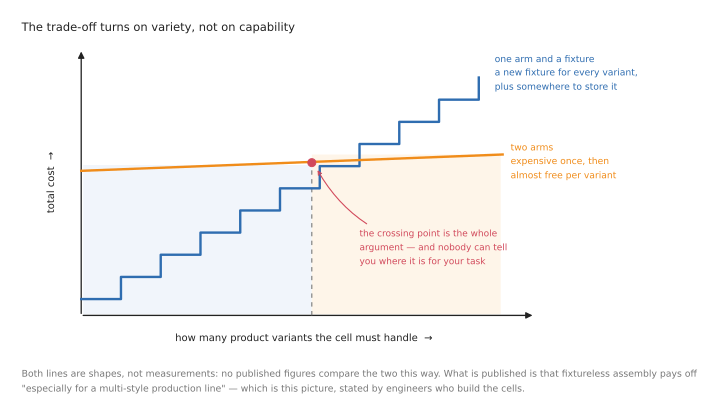

# When two arms are really useful

A second arm is not free. It doubles the hardware, doubles the number of joints
some piece of software has to reason about, adds a collision problem that did not
exist before, and makes almost every method in this folder harder. It has to earn
that, and quite often it does not.

This document is the honest answer to whether your task needs one. It is
deliberately the first thing in this folder, because the most useful thing these
documents can do for most readers is talk them out of a second arm and back to
[one arm and a fixture](../10_one-arm-training/01_overview.md). The rest of the folder is
for the cases where that answer is no.

**What this folder covers, and what it does not.** Everything here is about
**coordinated** two-arm work — two arms cooperating on one job, where what each arm
does depends on what the other is doing. Two arms that happen to share a cell while
doing unrelated things are not covered, and deliberately so: that is not a two-arm
problem at all. It is two single-arm problems plus a collision check, it is solved
by running [the one-arm methods](../10_one-arm-training/01_overview.md) twice, and the
standard survey of the field says as much, noting that uncoordinated two-arm work
has "no intrinsic difference to single-arm systems". If your two arms never need to
agree with each other about anything, you are in the wrong folder, and that is good
news.

It ends with the question that matters for anyone reading this to learn rather than
to build: **if two-arm robots are genuinely rare, why is two-arm work worth
studying at all?** There is a good answer, and it is not the obvious one.

## Contents

1. [The cheap alternative is a fixture](#1-the-cheap-alternative-is-a-fixture)
2. [How rare two-arm robots actually are](#2-how-rare-two-arm-robots-actually-are)
3. [The four things a fixture cannot do](#3-the-four-things-a-fixture-cannot-do)
4. [The counter-arguments, which are real](#4-the-counter-arguments-which-are-real)
5. [The tasks two arms are asked to do](#5-the-tasks-two-arms-are-asked-to-do)
6. [A checklist: do you need a second arm?](#6-a-checklist-do-you-need-a-second-arm)
7. [So why learn this at all?](#7-so-why-learn-this-at-all)

---

## 1. The cheap alternative is a fixture

Start here, because it is the comparison every two-arm proposal has to survive.

A jig, a vice or a clamp is a second hand that costs a fraction of an arm, never
drifts, needs no software, cannot collide with anything, and does not have to be
programmed. It also holds far more. The two best-known dual-arm industrial robots
carry **half a kilogram and two kilograms per arm** respectively — less than a full
mug of tea. A twenty-pound machinist's vice holds a hundred times that, forever,
without a control cabinet.

So whenever the object is rigid, always the same shape, and the job repeats often
enough to justify making the jig, the sensible engineering is a fixture and one
arm. That is not a grudging admission, it is the default, and departing from it
needs a reason.

**What the trade-off actually turns on is variety, not capability.** The research
area even has a name — *fixtureless assembly*, or *jigless* in aerospace — and
engineers at a large car maker put the economics plainly: holding parts with robots
instead of fixtures pays off **"especially for a multi-style production line or
when new styles are frequently introduced"**. A fixture is cheaper for one product
and a liability for twenty, because each new variant needs a new fixture, a place
to store it, and a changeover.

The vendors' own marketing agrees, and is revealing about what they are really
selling. The stated arguments for dual-arm robots are that they fit in the space of
one human workstation, need no safety fence, and can be dropped into a line built
for people without redesigning it. Those are arguments about **space and
flexibility**, not about doing something a fixture cannot do.

## 2. How rare two-arm robots actually are

This is worth stating properly, because the evidence is unusually clean and it
sets realistic expectations for everything that follows.

**The body that counts the world's industrial robots does not have a category for
them.** Its published methodology classifies every one of the roughly 542,000
robots installed in 2024 by mechanical structure — articulated, cartesian,
cylindrical, parallel, SCARA, or "others" — and "dual-arm" appears nowhere in that
methodology, nor as a field on the forms manufacturers fill in. The data does not
exist at source, which means **nobody can honestly quote you a dual-arm market
share**, and anyone who does is making it up.

This is not an oversight of a fast-moving area, either. The same body added a
separate category for humanoids once those became numerous enough to warrant one.
The nearest niche it does publish is collaborative robots, at about a tenth of
installations.

**The vendor catalogues say the same thing.** Of the major industrial robot makers
— FANUC, KUKA, Yaskawa, Universal Robots, Doosan, Techman, Comau, ABB — **exactly
one still lists a purpose-built dual-arm robot as a current global product**, ABB's
YuMi. Kawasaki's duAro is still sold in Japan but its robot pages disappeared from
the Americas site in 2026. Yaskawa's dual-arm series is gone from the US catalogue
and the controller it runs on is officially phased out. And the most telling detail
of all: when ABB wanted to grow the YuMi line after launching it, it added a
**single-arm** version.

**The cautionary tale is worth knowing in full**, because it is usually told
wrongly. The most famous two-armed robot ever built was Baxter, from a company that
raised around $150 million and shipped a couple of thousand machines before closing
in 2018. The brand was bought, relaunched in 2024, and shut down again in September
2025; the website is now a parked domain. But "two arms" was not what went wrong.
Baxter's joints were deliberately springy so that it would be safe near people, and
that cost it the precision to do useful work — one robotics professor's summary was
that the design compromised accuracy in favour of safety, and that the company then
spent too long trying to fix hardware problems in software. Meanwhile a competitor
selling a conventional *single* arm outsold them roughly twenty-five to one over
the same period. The lesson is that the second arm doubled the cost without doubling
the set of jobs it could pay for.

**So the honest framing is this: two-arm manipulation is a fast-growing research
field and a shrinking industrial product category at the same time.** That is not a
contradiction. It means the tasks two arms are good at are mostly tasks nobody has
yet automated profitably — which is a statement about opportunity as much as about
failure, and [section 7](#7-so-why-learn-this-at-all) takes it seriously.

## 3. The four things a fixture cannot do

Here is where a second arm genuinely earns its keep. If your task does none of
these four things, it does not need two arms.

**The hold itself has to change during the task.** A fixture grips one way, once.
If the part must be turned over, re-seated, lifted to a new angle or held
differently at each stage, a fixture becomes a *sequence* of fixtures, which is a
machine nobody wants to build. A second arm is a grip that can move.

**The object has no fixed shape.** You cannot build a jig for a shirt. A garment, a
cable, a bag or a sheet takes whatever shape the places you hold it imply, so
holding it in two places is not a convenience — it is the only way to control what
shape it is in. This is the strongest single argument for two arms, and it is why
cloth is the flagship two-arm task.

**The grip has to change mid-task.** Picking something up in the orientation it
happens to be lying in, and then needing a different grip to use it, is extremely
common. With two arms you hand it over in mid-air. With one arm you put it down,
let go, and pick it up again — slower, and sometimes impossible, because the object
may not sit stably in any orientation you can then pick up from.

**Two things must be true at the same moment.** Keeping a cable in tension while
routing it into a clip; holding a lid down while driving the screw that fixes it;
supporting a stone while releasing it at exactly the right instant. No sequence of
one-arm motions is equivalent to two constraints holding simultaneously, and this
is the one that cannot be worked around by being clever.

## 4. The counter-arguments, which are real

This document would be dishonest to skip these, and each of them is a published
result rather than a hypothetical.

**Two arms are not reliably better at re-grasping.** One careful study compared
re-grasping with two arms against re-grasping with one arm that puts the object
down and picks it up again — using the table as the fixture — and concluded that
two arms are not reliably better. When the two grasps have room, the second arm
wins; when they overlap, it is worse.

**Jigless assembly has been done with one arm.** Another group showed that
"completely jigless" assembly is achievable with **one** ordinary
position-controlled arm, if the gripper is designed so that the act of grasping
self-aligns the part. That is a mechanical solution to a problem people reach for a
second arm to solve, and mechanical solutions are usually cheaper.

**Even the flagship task has a single-arm solution.** Garment folding, the task
this whole field points at, has a published single-arm result.

**The one direct speed comparison is weaker than it sounds.** A study found a
dual-arm cell about 20% faster than a single-arm one and less energy-efficient,
paying for itself in eight months — but it was a simulation study, and the
single-arm alternative was not given an optimised fixture.

None of this makes two arms useless. It makes the burden of proof sit on the second
arm, which is where it belongs.

## 5. The tasks two arms are asked to do

Here is the spread of real jobs where two arms *are* the right answer, in four
groups ordered by how much is known in advance — the same lettering used throughout
this folder and in
[the one-arm documents](../10_one-arm-training/01_overview.md#1-what-an-arm-is-actually-asked-to-do).
Every row says **what the second arm is actually for**, because if you cannot
answer that for your own task, the honest conclusion is that you do not need it.

### Where one arm is enough, and two would be waste

Before the four groups, the exclusion. Spot and arc welding, machine tending,
palletising, painting and dispensing, polishing a fixtured part, moving tubes
between laboratory instruments: in all of these the work is held by a jig, the
geometry is known from a drawing, and the job is to be accurate and fast a million
times over. There is nothing for a second arm to hold that a fixture is not already
holding better. These tasks are the bulk of installed industrial robots and they
are solved. Where two such arms do appear near each other, they are usually two
independent robots sharing a cell rather than two arms cooperating on one part.

### Group A: the parts are known, but the fit decides everything

You have the drawings and the parts arrive in feeders, yet the job still fails,
because success is settled in the last millimetre by contact rather than by
position. **This is where most industrial difficulty lives**, and where a second
arm replaces a fixture that would have to keep changing its grip.

| Task | What the two arms do | What makes it hard |
| --- | --- | --- |
| **Screwdriving and packing an assembly** | one arm holds the housing and re-angles it for each fastener; the other picks screws and drives them, then both place the finished unit in its packaging | the tolerance is tighter than the arm's repeatability; twenty steps must all succeed; and the holding arm must not give way when the driving arm pushes |
| **Connector and harness insertion** | one arm holds the cable or connector, the other presents the socket or supports the board | clearances under a millimetre, the contact hidden from view, and now *both* ends of the mating pair can move |
| **Kitting and packing** | one holds the carton open or steadies the tray, the other places items into it | many small motions, items starting in different places, and a container that will not stay open by itself |

### Group B: the objects are known, but their arrangement is not

The catalogue is fixed, or nearly so, but nothing is where you left it. This is the
class that learned perception unlocked, and where machine learning is genuinely in
production today — though usually with one arm doing the picking.

| Task | What the two arms do | What makes it hard |
| --- | --- | --- |
| **Bin picking that needs a re-grip** | one arm extracts the part however it can be reached, then hands it to the other, which takes the grip the next step actually needs | clutter and occlusion, plus a handover in mid-air between two moving grippers |
| **Unloading a dishwasher or a crate** | one holds the rack, door or crate steady, the other lifts items out | clutter, fragility, many steps, and a container that moves if you pull against it |
| **Assembling two parts brought together** | each arm holds one part and they are mated in mid-air, with no fixture at all | the accuracy of two arms relative to *each other*, which is worse than either arm's own repeatability |

### Group C: the object itself has no fixed shape

The object's shape is decided by where you hold it. This group is the reason
two-arm manipulation is a research field rather than a footnote.

| Task | What the two arms do | What makes it hard |
| --- | --- | --- |
| **Laundry folding** | both arms grip the garment; lifting, shaking, flattening and folding are all done by moving the two grip points relative to each other | a cloth has effectively infinite configurations, it changes shape as you grip it, and most of it is hidden under itself |
| **Cable and harness routing** | one arm keeps the cable in tension and feeds it, the other seats it into each clip along the route | the cable moves while you work, tension is invisible, and the task is long, so failures compound |
| **Bag and container handling** | one holds the bag open, the other puts things in | a bag has no shape of its own and closes the moment you let go |

### Group D: the geometry is unknown and physics decides the outcome

The hardest class, and the one this repo's worked example lives in.

| Task | What the two arms do | What makes it hard |
| --- | --- | --- |
| **Stacking irregular stones** | one arm steadies the tower or holds the stone level while the other adjusts and lets go | no model of the object, and success is only known a second after both grippers release |
| **Building from rubble or scrap** | one supports a piece while the other wedges the next in against it | every piece differs, errors accumulate upwards, and support must be released gradually |

## 6. A checklist: do you need a second arm?

Run your task through these in order. The first "yes" is your reason; if you reach
the end with no yes, use one arm.

1. **Does the object change shape depending on where you hold it?** Cloth, cable,
   bag, sheet, food. If yes, you need two arms, and no amount of cleverness with
   one will fix it. This is the strongest case there is.
2. **Must two constraints hold at the same instant?** Tension while clipping, hold
   while releasing, support while fastening. If yes, you need two arms, because no
   sequence of single-arm motions is equivalent.
3. **Must the grip change mid-task, and can the object not be safely set down and
   re-picked?** If it cannot sit stably in any pose you can then pick from, you
   need a handover, which needs two arms. If it *can* be set down, check the
   re-grasping evidence in [section 4](#4-the-counter-arguments-which-are-real)
   first — the table may be a better second hand than an arm.
4. **Does the hold have to change at every stage, across many product variants?**
   If yes, you are in fixtureless-assembly territory and the economics may work.
   Count how many fixtures you would otherwise build; that is the number the second
   arm has to beat.
5. **Is the argument really about floor space or fencing?** If the honest reason is
   that a two-armed robot fits a human workstation, say so. That is a legitimate
   reason, and it is a facilities argument, not a manipulation one.
6. **Otherwise: one arm and a fixture.** Read
   [the one-arm documents](../10_one-arm-training/01_overview.md) and spend the saved
   money on better perception.

## 7. So why learn this at all?

If two-arm industrial robots are this rare, an obvious question follows: why does
this folder exist, and why should anyone spend time on it? Four honest reasons,
which matter more if you are learning the field than if you are buying a robot next
week.

**Because every humanoid is bimanual.** The form factor that the current wave of
money is going into has two arms by construction, and the manipulation problems it
faces are exactly the ones in this folder: coordination, handovers, closed chains,
deformable objects. Two-arm manipulation being a small industrial product category
and a central research topic at the same time is explained entirely by this.

**Because the unsolved tasks are the two-arm ones.** Section 5's Groups C and D are
where automation has not reached, and they are not there because nobody wants them
automated. Laundry, cables, food, harvesting, unstructured assembly — the reason
these are still done by hand is that they need the thing a fixture cannot provide.
If you want to work on something that is not already solved, this is where it is.

**Because two arms are where the interesting failure modes are.** The closed chain,
the internal force that no camera shows you, the arms drifting out of step, the
handover that releases too early — these are genuinely instructive, and they teach
you what the control layer underneath a policy is actually doing. Someone who
understands why two position-controlled arms holding one object will crush it
understands force control better than someone who has only read about it.

**Because the cheap hardware arrived.** The economics that make dual-arm industrial
robots a poor buy do not apply to a pair of few-hundred-dollar open-source arms on
a desk. The practical barrier to learning this has fallen by about two orders of
magnitude in three years, which is why the research output has not.

What none of that means is that you should propose two arms for a customer's
problem. Keep the two questions separate: *what should this task use*, answered by
the checklist above, and *what is worth learning*, answered here. They have
different answers, and being clear about which one you are answering is most of
what distinguishes good advice in this field from bad.

Next: [the two-arm overview](01_overview.md) for what actually changes, or
[the one-arm documents](../10_one-arm-training/01_overview.md) if the checklist sent you
back there.
