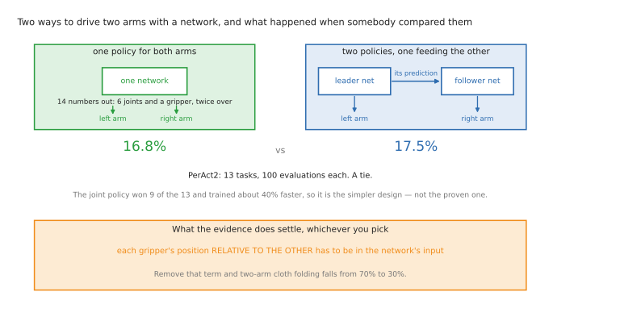
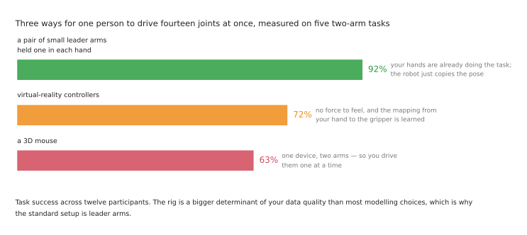

# Learned methods for two coordinated arms

**This is where coordinated two-arm work is actually happening.** The tasks that
justify a second arm — cloth, re-grasping, holding one thing while working on
another — are exactly the tasks nobody can write down, and the best-known bimanual
system was built for two arms from the start rather than adapted to them.

This document assumes you know
[the single-arm versions](../10_one-arm-training/03_learned-methods.md) of these methods.
It does not repeat them. It says what changes when two arms have to cooperate, and
it is unusually specific about evidence, because **three claims that sound obviously
true about two-arm learning turn out not to be supported** and each of them is
repeated constantly.

## Contents

1. [Why copying is the method that fits two arms](#1-why-copying-is-the-method-that-fits-two-arms)
2. [One policy or two, and what the evidence says](#2-one-policy-or-two-and-what-the-evidence-says)
3. [Collecting two-arm demonstrations](#3-collecting-two-arm-demonstrations)
4. [What the numbers actually look like](#4-what-the-numbers-actually-look-like)
5. [Correcting a two-arm policy as it goes](#5-correcting-a-two-arm-policy-as-it-goes)
6. [Why reinforcement learning struggles with coordination](#6-why-reinforcement-learning-struggles-with-coordination)
7. [Pretrained policies, and the data problem](#7-pretrained-policies-and-the-data-problem)
8. [Learned pieces: which arm takes which grasp](#8-learned-pieces-which-arm-takes-which-grasp)
9. [Where to practise](#9-where-to-practise)
10. [What to take from all of it](#10-what-to-take-from-all-of-it)

---

## 1. Why copying is the method that fits two arms

There is a structural reason imitation learning dominates this field, and it is
worth stating because it explains the whole shape of the literature.

**Copying is the one approach that does not need the coordination to be described.**
Every other method requires you to say something about how the arms relate: a
planner needs the constraint written down, a controller needs the object's frame and
the squeeze specified, a behaviour tree needs the waits placed. You never write down
that the left hand should hold the shirt taut while the right hand smooths it. You
just do it, several hundred times, and the coordination is in the data.

That is why the best-known bimanual learning work is not a two-arm adaptation of a
one-arm method — it was built for two arms from the start. And it is why the field
jumped from "two arms are too hard" to "two arms fold laundry" without ever solving
the coordination problem in the classical sense. It went around it.

The cost of going around it is that you cannot inspect what was learned, and you
cannot transfer it. A cooperative controller you write once works for any object;
a policy that learned to fold shirts has learned shirts.

## 2. One policy or two, and what the evidence says

The normal design is a **single network whose output is the commands for both arms
at once**. For two six-joint arms with a gripper each, that is fourteen numbers per
step. The argument is that the coordination then sits inside one prediction, so the
policy cannot produce a left-arm motion that contradicts its own right-arm motion.

That argument is persuasive and it is what most systems do. **It has also been
measured, once, cleanly, and the result is a tie.** PerAct2 compared a single
two-arm network against two separate networks where one arm's prediction is fed to
the other, on thirteen tasks with a hundred evaluations each, and got **16.8% for
the joint policy against 17.5% for the pair**. The joint policy won on nine of the
thirteen tasks and trained in about 40% less time, which is a real advantage — but
"one policy beats two" is not something the numbers support. Treat the joint policy
as the **simpler** design rather than the proven one.

**What is measurably true is that the arms must see each other's state.** The one
clean bimanual ablation available comes from UMI: removing the term that tells the
policy where each gripper is *relative to the other* dropped two-arm cloth folding
from **70% to 30%**. Whatever architecture you choose, the coupling between the arms
has to be in the input. This is the same idea as
[the cooperative control formulations](03_programmed-methods.md#5-feedback-control-and-the-closed-chain)
arrived at informally — relative pose is the quantity that matters — and it is the
closest the learned side comes to using that theory.

**A third claim to drop: chunking is not a two-arm technique.** Action chunking was
demonstrated on a two-arm robot, so it is often said that it exists to keep the arms
coherent. The paper does not say that — its argument is about compounding error and
applies identically to one arm — and as of 2026 no published study isolates a
two-arm-specific benefit. If anything the evidence points the other way: a follow-up
that looked specifically at two arms argued plain chunking is *insufficient* for
them, and added machinery for the dependencies between the arms on top. Chunking
needing extra help for two arms is not the same as chunking mattering more.

## 3. Collecting two-arm demonstrations

**Demonstrating is genuinely harder with two arms**, and this is the part people
underestimate. Somebody has to drive fourteen joints at once, in a coordinated way,
for hundreds of episodes, without the fatigue showing up in the data.

The rig choice is not a matter of taste — it has been measured. A controlled study
with twelve participants across five two-arm tasks compared three ways of doing it:

**Leader arms at 92% task success, virtual-reality controllers at 72%, and a 3D
mouse at 63%.** That is why the standard rig is a pair of small leader arms held one
in each hand, with the real arms following. The gap is large enough that the rig is
a bigger determinant of your data quality than most modelling choices.

**You also need cameras that can see the pair.** One overhead view plus one camera
on each wrist is the usual arrangement, and the reason is specific: the overhead
view shows the *relation* between the arms, which is the thing
[section 2](#2-one-policy-or-two-and-what-the-evidence-says) says must be in the
input, and the wrist views show what each arm is about to touch. Dropping the
overhead view to save a camera removes exactly the information the coordination
depends on.

This repo covers the practicalities in
[where the data comes from](../15_frontier/03_data-and-demonstration.md), which
goes through the rigs people actually use and what each one costs.

## 4. What the numbers actually look like

This is worth setting out properly, because the headline impression of two-arm
imitation is considerably rosier than the tables in the papers.

**The original ALOHA work** is where "fifty demonstrations is enough" comes from.
Over 25 trials per task it reported: sliding a bag closed **86%**, slotting a
battery **93%**, opening a cup **84%**, putting on a shoe **92%**, preparing tape
**64%** — and threading velcro **20%**, from twice as many demonstrations as the
rest. The summary "80–90% success" that gets quoted covers four of those six.

Look at the stages rather than the totals and it is sharper still: the velcro task
lifts successfully 92% of the time, grasps 40% of the time, and inserts 20% of the
time. **The failures are concentrated exactly where the two arms have to agree with
each other.**

**Then the scaling result, which is the most sobering number in this folder.**
ALOHA Unleashed collected **26,241 demonstrations across five tasks** — roughly a
hundred times the original's fifty per task, gathered on ten robots over eight
months by thirty-five operators. It reported hanging a shirt at **75%**, tying a
shoelace at **40%** on the harder variant, and inserting gears at 95% for one gear,
75% for two and **40% for three**. Stacking kitchen items went 95% for one item, 65%
for two, **25% for three**.

Two things follow, and both matter for anyone planning a project. Success rates did
not end up higher than the fifty-demonstration results. And **compounding error
across a sequence survived both action chunking and diffusion**, which were the two
techniques meant to address it. Nothing from that work was released.

**One more number for calibration.** A 2026 evaluation of a frontier
vision-language-action model on a simulated ALOHA — run properly, at 300 trials per
task with confidence intervals — scored **99% at handing an object from one arm to
the other** and **6.7% at folding a towel in half**. The gap between those two
numbers is the gap between a brief closed chain with a clear success condition and a
deformable object whose state you cannot even represent.

## 5. Correcting a two-arm policy as it goes

The correction rig is the same leader-arm pair used to collect the demonstrations,
so a person can grab either arm the moment it goes wrong — which is usually the arm
that was *not* being watched.

**The failures worth correcting are mostly coordination failures rather than
single-arm ones:** the holding arm drifted, the handover released early, the two
arms pulled the cloth out of each other's grip. These are hard to anticipate when
collecting data and obvious the moment you see them, which is exactly what this
method is for.

**Status in 2026:** this is how a good two-arm policy is made reliable, and the
technique has merged with reinforcement learning — the human's take-overs become the
learning signal. The strongest published results in this area
([HIL-SERL, 100% on every task after one to two and a half hours](../10_one-arm-training/03_learned-methods.md#12-interactive-imitation-correcting-it-as-it-goes))
are single-arm, so treat the two-arm case as the same method with less evidence
behind it rather than as a proven recipe.

**Worth learning now?** Yes, and it is the highest-leverage thing you can do with a
cheap pair of arms. Collecting fifty two-arm demonstrations is a weekend; correcting
the resulting policy for an hour will teach you more about where coordination breaks
than reading every paper cited here.

## 6. Why reinforcement learning struggles with coordination

Two arms make reinforcement learning harder in a way that is worth understanding
properly, because it explains why the field went the imitation route.

The robot learns by trying things and keeping what worked. With two arms the space
of things to try is the **product** of both arms' possibilities rather than the sum.
That alone would be bad enough.

**The real problem is worse and more specific.** Most useful coordinated behaviours
only pay off when both arms do the right thing *at the same time*. A handover gives
no reward at all unless one arm has arrived and the other releases at the right
moment. Random exploration will essentially never stumble on that combination, so
there is no gradient to climb — the reward is not merely sparse, it is sparse in a
way that requires two independent things to be simultaneously correct.

This is the technical reason coordinated two-arm systems are taught by demonstration
rather than by practice: **the demonstration supplies the coordinated behaviour that
exploration cannot find**, and practice is then used to polish it.

**Good for:** as a *second* stage after demonstrations, on Group A contact skills.
Not as a first stage, and not on its own.
**Status in 2026:** consistent with the single-arm picture — training from scratch
is now the exception, and fine-tuning a demonstrated policy is the norm.

## 7. Pretrained policies, and the data problem

**Are the large pretrained models bimanual? Mostly by accommodation rather than by
design, and the data explains why.**

It is tempting to assume that a model trained on everything has seen plenty of
two-arm work. It has not. Open X-Embodiment, the pooled cross-robot corpus the first
generation of these models was built on, labels just **two of its seventy-two
datasets as bimanual** — about **520 episodes out of 2.4 million, roughly two
hundredths of one percent**. Counting a third, misfiled two-arm dataset barely
changes it.

The field's flagship shared corpus is, in effect, entirely single-armed, and that is
the plainest available explanation of why two-arm learning lagged behind single-arm
learning. If you have read that these models are "bimanual by default because their
training data is", that is the claim this number refutes.

**That history is visible in how the models are built.** Most of them define one long
action vector and pad it out to whatever the robot needs, so two arms are an
accommodated special case. One model inverts this: **RDT was designed bimanual
first**, splitting its state vector into a right-arm half and a left-arm half, and
its documentation instructs you that if your robot has one arm you should write its
values into the *right-arm* portion — single-arm as the padded special case, which
is the opposite of everyone else. Its 2026 successor H-RDT continues that line. It
is a good illustration that "supports two arms" and "is built for two arms" are
different claims.

**The data situation is now changing quickly, and this is the most useful thing in
this section.** Purpose-built two-arm datasets have arrived at a scale the old
pooled corpus never had:

- [AgiBot World](https://github.com/OpenDriveLab/AgiBot-World), gathered on a
  dual-arm platform and published at IROS 2025. **Released under CC BY-NC-SA 4.0 —
  non-commercial**, which rules it out of client work; check this yourself before
  building on it, because the repository carries no licence file and the terms live
  in the README.
- [RoboMIND 2.0](https://arxiv.org/abs/2512.24653), bimanual by deliberate design —
  over **310,000 dual-arm trajectories across 739 tasks and six platforms**, with
  even its single-arm robots re-rigged as pairs. Apache-2.0, but a preprint with no
  venue and around 112 TB to download.
- [Galaxea's open dataset](https://arxiv.org/abs/2509.00576), 500-plus hours on one
  dual-arm platform, in LeRobot format.
- [Amazon's ABC-130k](https://huggingface.co/datasets/XDOF/ABC-130k), new in June
  2026 and the largest openly licensed one: **130,703 episodes, roughly 3,591
  hours**, collected on a bimanual station, **Apache-2.0**, with a published
  reproduction stack. If you want permissively licensed two-arm data at scale, start
  here.

**If you are training anything two-armed, these rather than Open X-Embodiment are
where the data is — and check the licence of each one, because they differ and the
most cited is the most restrictive.**

**One practical warning about checkpoints.** Check what is *downloadable* rather
than what is supported, because for two arms they differ. GR00T's code carries
embodiment definitions for two-armed humanoid platforms, with separate left-arm and
right-arm entries — but every fine-tuned checkpoint released for it is single-arm.
On the openpi side there is a configuration for the two-armed ALOHA platform with
no published checkpoint behind it. The base models are genuinely usable for two
arms; you will be fine-tuning one yourself rather than downloading a two-arm policy
someone else trained.

## 8. Learned pieces: which arm takes which grasp

With two arms, one thing is added to the modular pattern, and it is **not**
perception itself. The networks are the same, and they neither know nor care how
many arms will use their output.

What changes is the *choice* made with their output. A grasp proposer returns many
candidate grasps, and with two arms you are choosing which arm takes which one:
whether both can be reached, whether taking this one with the left arm leaves the
right arm able to reach the next, and whether the resulting pair of motions collide.

That selection is ordinary code sitting between the network and the planner, and it
is **where most of the two-arm engineering in such a system lives**. It is also
where the classic failure is: the perception was right and the assignment was wrong,
so the arms end up crossed over the bin and the second grasp is unreachable.

**Worth learning now?** Yes, and it is a good first two-arm project precisely
because the hard parts are ordinary code. You can build the grasp-assignment logic
without touching a policy.

## 9. Where to practise

**Benchmarks, with the licences that matter.**

[RoboTwin 2.0](https://github.com/RoboTwin-Platform/RoboTwin) (2.9k stars, MIT,
active) is the most complete open two-arm stack — 50 dual-arm tasks including
handovers and joint lifts, with over 100,000 pre-generated trajectories. This is the
one to start with.

[gym-aloha](https://github.com/huggingface/gym-aloha) (Apache-2.0) is the small one,
with exactly two environments: transfer a cube between the arms, and a two-arm
insertion. Both are coordinated tasks, which makes it a good minimal test bed.

[robosuite](https://github.com/ARISE-Initiative/robosuite) (2.6k, MIT) has four
two-arm tasks — lift, peg-in-hole, handover, transport — and one property that makes
it unusually good for learning: **you can run the same task with one genuinely
two-armed robot or with two independent single arms**, which is as close to a
controlled experiment on "what does coordination actually change" as anything
available. If you want to understand this folder empirically rather than by reading,
that is the experiment to run.

**Be careful with licences** before building on
[MimicGen](https://github.com/NVlabs/mimicgen) or
[DexMimicGen](https://github.com/NVlabs/dexmimicgen), which are research-only under
NVIDIA's licence, and with anything built on
[RLBench](https://github.com/stepjam/RLBench), which is academic-use only —
[PerAct2](https://github.com/markusgrotz/peract_bimanual), the main two-arm
benchmark in that family, inherits the restriction and has been dormant since early
2025.

**Code.** [LeRobot](https://github.com/huggingface/lerobot) supports two arms
directly: the `bi_so_follower` robot and `bi_so_leader` teleoperator compose two
single arms into a pair, with observations prefixed `left_` and `right_`. ALOHA
hardware support now lives in a separate
[Trossen plugin](https://github.com/TrossenRobotics/lerobot_trossen) rather than in
LeRobot itself. For the bimanual-first alternative see
[RDT](https://github.com/thu-ml/RoboticsDiffusionTransformer) and its successor
[H-RDT](https://github.com/HongzheBi/H_RDT) (MPL-2.0).

## 10. What to take from all of it

**Three widely repeated claims are not supported by the evidence**, and knowing
which is worth more than knowing any individual result:

1. "One joint policy beats two policies plus a link." Measured once: 16.8% against
   17.5%. A tie.
2. "Action chunking matters more for two arms." The paper's argument is arm-count
   agnostic, and a follow-up says plain chunking is *insufficient* for two arms.
3. "Pretrained policies are bimanual by default because their data is." Open
   X-Embodiment is about 0.02% bimanual.

**One claim that is supported:** the relative pose of the two grippers must be in
the policy's input. 70% to 30% when it is removed.

**Imitation dominates because it is the only method that does not require the
coordination to be described.** That is a genuine advantage and also the reason
nothing learned transfers between tasks.

**The data has moved.** Two-arm pretraining data now exists at scale, in
purpose-built datasets rather than the famous pooled corpus. That is the single
biggest change in this area during 2026.

Next: back to [the overview](01_overview.md), or to
[the programmed methods](03_programmed-methods.md) for the control theory the learned
side has not yet absorbed.
