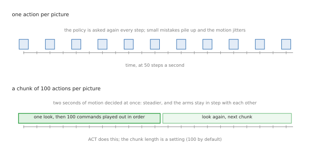

# Training and evaluating

This is phases 4 and 5 of the [overview](01_overview.md): turning the dataset from
[collecting the data](02_collecting-data.md) into a policy, and then finding out
honestly whether it works.

## Contents

1. [Which policy, and why it predicts chunks](#1-which-policy-and-why-it-predicts-chunks)
2. [What training actually does](#2-what-training-actually-does)
3. [The training run](#3-the-training-run)
4. [Evaluating honestly](#4-evaluating-honestly)
5. [The improvement loop](#5-the-improvement-loop)
6. [Growing the task](#6-growing-the-task)
7. [What it costs, and what you get](#7-what-it-costs-and-what-you-get)

---

## 1. Which policy, and why it predicts chunks

Three families are worth considering, and for a first system the choice is
easy.

| Policy | What it is | Use it when |
| --- | --- | --- |
| **ACT** | a transformer that predicts a *chunk* of future actions from one observation | first system, tens to hundreds of demonstrations — start here |
| **diffusion policy** | generates the action sequence by denoising; handles demonstrations that disagree with each other better | your demonstrators used several strategies and ACT averages them into mush |
| **a vision-language-action model** | a large pretrained model fine-tuned on your data, told what to do in words | you have many tasks, or want "stack the flat one next" to work |

The idea that makes all of them work on contact-rich two-arm tasks is **action
chunking**.

A policy that emits one command per camera frame has to be asked again fifty
times a second, and every answer is a fresh chance to be slightly wrong. Those
small disagreements accumulate into jitter, and jitter is what knocks a stone
off a tower. Instead, ACT predicts the **next hundred commands at once** and
plays them out in order, then looks again. A hundred steps at 50 Hz is two
seconds: enough to cover a whole touch-down and release with one coherent
decision, and — the part that matters for two arms — with both arms planned
together, so they stay in step.

The defaults in [LeRobot's ACT
implementation](https://github.com/huggingface/lerobot) are a reasonable
starting point and worth knowing rather than guessing at:

| Setting | Default | What it means |
| --- | --- | --- |
| `chunk_size` | 100 | how many future actions are predicted at once |
| `n_action_steps` | 100 | how many of them are actually executed before looking again |
| `n_obs_steps` | 1 | the policy sees only the current frame, not a history |
| `vision_backbone` | `resnet18` | one small image encoder per camera |
| `dim_model` | 512 | the width of the transformer |
| `n_encoder_layers` / `n_decoder_layers` | 4 / 1 | its depth |
| `use_vae`, `latent_dim`, `kl_weight` | true, 32, 10.0 | the part that copes with demonstrators being inconsistent |
| `optimizer_lr` | 1e-5 | learning rate |

Two of these are worth thinking about for stone stacking. **`n_obs_steps` is 1**,
so the policy cannot see that a stone is *already* sliding — it sees one frozen
frame. If slip matters, that is an argument for feeding it force readings or a
short history. And **temporal ensembling is off by default**: it averages
overlapping chunks for smoother motion, but it requires re-running the policy
every single step, which costs compute. It is worth trying when motion looks
steppy at chunk boundaries.

## 2. What training actually does

Training is supervised learning, and it is simpler than it sounds.

Take a random frame from a random episode. Feed the model the pictures from that
frame and the arm state. Ask it for the next hundred actions. Compare them with
what the demonstrator actually did over the next hundred frames. Adjust the
model so the answers get closer. Repeat a hundred thousand times.

Three things matter around that loop:

**Normalisation.** Joint angles are radians, pixel values are 0 to 255. The
statistics in the dataset's `meta/stats.json` are used to put everything on a
comparable scale. Getting this wrong silently ruins training, which is why the
format computes it for you.

**The loss is not the score.** The training loss measures how closely the model
copies the demonstrator. It says nothing about whether the tower stands. A model
whose loss keeps falling can get worse at the actual task, and the only way to
know is to run it.

**The model never sees its own mistakes.** It only ever learns from frames where
the demonstrator was in control. So the first time it drifts somewhere no
demonstrator ever was, it has no idea what to do — and its next action takes it
further out. This is the fundamental weakness of learning by copying, and it is
why [section 5](#5-the-improvement-loop) is about feeding it the states where it
goes wrong.

## 3. The training run

LeRobot's training defaults, which are a sane place to start:

| Setting | Default |
| --- | --- |
| `steps` | 100,000 |
| `batch_size` | 8 |
| checkpoint saved every | 20,000 steps |
| logged every | 200 steps |
| `seed` | 1000 |

What it costs, from LeRobot's own hardware guide and the model card of its
published ACT checkpoint:

- **ACT needs about 2–6 GB of GPU memory** at batch size 8 — a modest GPU is
  enough; this is not a large model by 2026 standards.
- **About 1 hour 45 minutes on an A100** for 80,000 steps. Half an hour to an
  hour on a consumer 4090.
- **6 to 14 hours on Apple Silicon**, using `--policy.device=mps`. Start it
  before bed.
- A diffusion policy is roughly double; a vision-language-action model is ten to
  twenty times, and fine-tuning the larger ones wants 24 GB or more.

While it runs, watch three things: that the loss falls at all (if it does not,
the normalisation or the data is wrong), that nothing has exploded, and — most
importantly — **evaluate a mid-training checkpoint**. Do not wait until the end
to discover the dataset was broken.

## 4. Evaluating honestly

This is where end-to-end projects most often fool themselves, and stone stacking
gives you an unusually honest measurement, so use it properly.

**Define success before you look.** For this task: the stone is still in place
**ten seconds after both grippers have let go and moved away**. Not "it reached
the pose". Not "it stayed while the second arm held it". Decide, write it down,
and never quietly change it.

**Run enough attempts.** Twenty episodes cannot tell 40 % from 60 %. Fifty is a
minimum and a hundred is better; the published two-arm checkpoints are scored
over hundreds of episodes for exactly this reason.

**Fix the starting states.** Keep a list of seeds that set out the stones, and
use the same list for every policy you compare. Otherwise you are comparing
scenes, not policies.

**Record where it failed, not just that it failed.** Every attempt ends in one
of a few ways, and the breakdown tells you what to do next:

| Failure | What it looks like | What it usually means |
| --- | --- | --- |
| missed the grasp | closes on nothing, or knocks the stone | perception, or not enough grasp variety in the data |
| chose a bad face | stone is stable in the gripper but cannot rest | the policy is copying a pose, not judging stability |
| knocked the tower on approach | hits what is already there | not enough demonstrations with a tall tower |
| dropped it on release | stood while held, fell when let go | the release itself — the thing you are here to learn |
| settled then toppled | stood for a second, then went | balance was marginal; the placement was lucky, not right |

That table, with a count in each row, is worth more than the success rate alone.
Benchmarks are moving this way too: DuoBench, in the
[two-arm doc](../12_two-arm-manipulation.md#44-step-4-measure-generalisation),
scores by stage rather than pass or fail for the same reason.

## 5. The improvement loop

You have a number and a failure breakdown. Now the loop from the
[overview](01_overview.md#2-the-five-phases), and the rule is that **the data is
what you change**.

1. **Read the breakdown.** Say most failures are "dropped it on release".
2. **Go and demonstrate that.** Not more towers from scratch — more releases.
   Set up the scene as it looks just before release, with the tower at the
   heights where it fails, and record fifty of those.
3. **Retrain and re-evaluate on the same seeds.**
4. **Keep the change or drop it.** Then read the new breakdown, which will point
   somewhere else.

The strongest version of this is to collect demonstrations **from the states the
policy itself gets into**: run the policy, and when it is about to fail, take
over and finish the job correctly. That directly attacks the weakness in
[section 2](#2-what-training-actually-does) — the policy has never seen its own
mistakes — and a few dozen such recoveries are usually worth several hundred
fresh demonstrations.

Resist changing the model. Bigger backbones, longer chunks and new architectures
feel like progress and rarely are, at this scale. Change them only when the
failure clearly points there — steppy motion at chunk boundaries points at
chunking; "does the same wrong thing confidently" points at the demonstrations
disagreeing.

## 6. Growing the task

Once "add one stone" works, the interesting extensions, in order of difficulty:

**Build a real tower.** Call the policy in a loop and check after each stone.
This is ordinary code around a learned skill, and it is where the modular and
trained approaches meet.

**Condition on what to do.** Add the instruction to the observation — "place the
flat stone next", "make it taller" — and train on episodes labelled that way.
This is what the vision-language-action policies are for.

**Randomise the world during training.** Different stone shapes, table heights,
lighting, friction. A policy trained on one friction value has learned your
simulator. The two-arm benchmarks randomise deliberately along several axes, and
it is the difference between a demo and something that transfers.

**Cross the gap to real stones.** Expect the trained policy to fail on first
contact with reality, mostly because of friction and the exact feel of release.
The published route is to fine-tune on a small number of real demonstrations
after training on a large simulated set, and it works better than either alone.

## 7. What it costs, and what you get

| | Training everything | The modular system |
| --- | --- | --- |
| code to write | little — most of it is data plumbing | a lot: perception, search, planning, control |
| data needed | hundreds to thousands of episodes | none |
| compute | a GPU for hours, repeatedly | almost none |
| time to a first standing tower | weeks | days |
| when it fails | you get a number, not a reason | you get the stage that was wrong |
| the last centimetre | learned, and better than hand-written rules | brittle |
| gets better with more data | yes, that is the point | no |

The honest summary: training all of it is not the fast way to a standing tower,
and if a tower is all you want, build the modular system. Train the whole thing
when you want the system to keep improving as you feed it, and when the
behaviour you need is the kind nobody can write down.

---

Back to [the overview](01_overview.md), or out to
[stone stacking](../11_stone-stacking.md), which this folder is one branch of.
