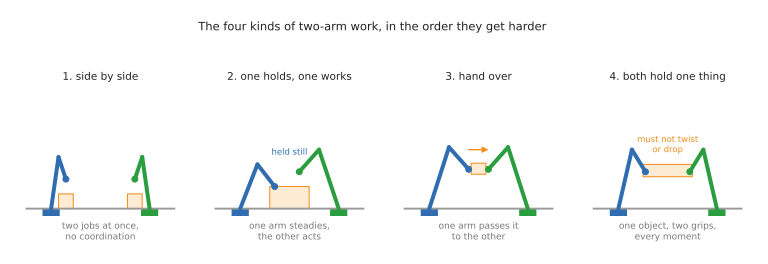
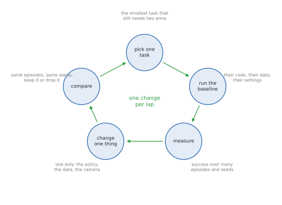
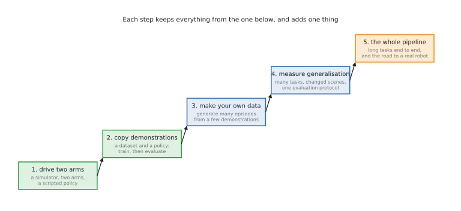

# Two-arm manipulation: open projects, in five steps

Most of this repo is about one arm. Two arms are not twice as much work: they
are a different problem, because the arms share a workspace, share an object,
and have to agree about time. This doc is a route through that problem in five
steps, from "make two arms move at all" to "a long task, done end to end and
measured properly".

Every project listed here has to pass four tests, and a surprising number of
well-known ones do not:

- **it runs in simulation**, so nothing can break and a failed grasp costs
  nothing but seconds
- **the code is open source**, under a licence you can read
- **the simulator itself is open source**, not free-to-download-but-closed
- **the data is open**: either downloadable, or generated by a script you run

[Section 8](#8-projects-that-look-open-but-are-not) lists the ones that fail,
and why, because knowing that is half the skill.

If you would rather do one project from start to finish than assemble a route
from several, go straight to
[section 5](#5-projects-that-cover-all-five-steps): two projects cover most or
all of the five steps on their own, and it says step by step what each one does
and does not give you.

Everything below was checked on 2026-09-17, and
[section 11](#11-what-was-checked-and-when) says what was run here versus what
was only read.

## Contents

1. [What the second arm adds](#1-what-the-second-arm-adds)
2. [What "open" has to mean](#2-what-open-has-to-mean)
3. [How to work through a step](#3-how-to-work-through-a-step)
4. [The five steps](#4-the-five-steps)
   1. [Step 1: drive two arms](#41-step-1-drive-two-arms)
   2. [Step 2: copy demonstrations](#42-step-2-copy-demonstrations)
   3. [Step 3: make your own data](#43-step-3-make-your-own-data)
   4. [Step 4: measure generalisation](#44-step-4-measure-generalisation)
   5. [Step 5: the whole pipeline](#45-step-5-the-whole-pipeline)
5. [Projects that cover all five steps](#5-projects-that-cover-all-five-steps)
   1. [ALOHA sim + ACT + LeRobot](#51-aloha-sim--act--lerobot--the-one-to-do-first)
   2. [RoboTwin 2.0](#52-robotwin-20--the-one-project-that-covers-all-five)
   3. [Nearly, but not quite](#53-nearly-but-not-quite)
   4. [Which to actually do](#54-which-to-actually-do)
6. [Every project at a glance](#6-every-project-at-a-glance)
7. [What runs on this Mac, and what needs a Linux box](#7-what-runs-on-this-mac-and-what-needs-a-linux-box)
8. [Projects that look open but are not](#8-projects-that-look-open-but-are-not)
9. [Pitfalls that cost days](#9-pitfalls-that-cost-days)
10. [How this repo's areas connect](#10-how-this-repos-areas-connect)
11. [What was checked, and when](#11-what-was-checked-and-when)

---

## 1. What the second arm adds

One arm reaching for a box has one question to answer: where is the box. Two
arms have three more, and each is a field of its own.

**Who does what.** Two arms in one workspace can hit each other, so something
has to decide which arm goes where, and in which order.

**When.** A handover only works if the receiving gripper closes before the
giving one opens. The timing is part of the task, not a detail of the code.

**Together.** When both grippers hold the same rigid object, the arms are no
longer free: the object fixes the distance between the grippers, and any
disagreement between the arms becomes a force that squeezes, twists or drops it.

The vocabulary for sorting these tasks comes from a 2012 survey by Smith and
colleagues, [Dual arm manipulation — a
survey](https://portal.research.lu.se/en/publications/dual-arm-manipulation-a-survey)
(Robotics and Autonomous Systems 60(10), 1340–1353): tasks are
**uncoordinated**, where each arm does its own job, or **coordinated**, where
the arms must agree; and coordinated tasks are **asymmetric**, where the arms
play different roles, or **symmetric**, where they share the load.

Today's benchmarks use four practical buckets, which is also the order in which
they get harder, and the order this doc follows:



| Kind | What it looks like | Why it is harder than the one before |
| --- | --- | --- |
| side by side | each arm does a separate job in its own space | it is two one-arm problems, plus not colliding |
| one holds, one works | one arm steadies the object, the other acts on it | the working arm depends on the holding arm not moving |
| hand over | one arm passes the object to the other | both arms must agree on a place **and** a moment |
| both hold one thing | both grippers on one object, throughout | the object couples the arms: one arm's error is a force on the other |

[DuoBench](https://duobench.github.io/), one of the 2026 benchmarks below, names
exactly these four — asymmetric support, bimanual, sequential handoff, parallel
execution — and reports scores per category, which is the most useful way to
read any two-arm result.

---

## 2. What "open" has to mean

"Open source" is used loosely in robotics. Four separate things have to be open
before you can actually work through a project, and a project can fail on any
one of them.

| The part | The question | How it fails in practice |
| --- | --- | --- |
| the code | is there a licence file, and what does it allow? | "research and evaluation only", or no licence file at all, which grants you nothing |
| the simulator | is the engine itself open source? | the code on top is Apache-2.0, but it will not run without a closed component |
| the data | can the demonstrations be downloaded, or regenerated by a script? | the paper reports 26,000 episodes and releases none |
| the policy | are the trained weights published? | the benchmark table was produced by a model you cannot have |

The simulators these projects sit on, which is the test most write-ups skip:

| Simulator | Licence | Genuinely open? | Runs on |
| --- | --- | --- | --- |
| [MuJoCo](https://github.com/google-deepmind/mujoco) | Apache-2.0 | yes | Linux, macOS (Apple Silicon included), Windows |
| [SAPIEN](https://github.com/haosulab/SAPIEN) | Apache-2.0 | yes | Linux; no macOS |
| [PyBullet](https://github.com/bulletphysics/bullet3) | zlib | yes | everywhere |
| [CoppeliaSim](https://www.coppeliarobotics.com/) | proprietary; the free "Edu" build is for schools and universities only | no | Linux, macOS, Windows |
| [Isaac Sim](https://github.com/isaac-sim/IsaacSim) | the source is Apache-2.0, but building or running it needs the closed Omniverse Kit SDK | no, in effect | Linux, Windows, NVIDIA GPU |

That table decides more than any leaderboard. A MuJoCo project is one you can
run on the machine you already own. A SAPIEN project needs a Linux box with an
NVIDIA card. An Isaac Sim project is not something you can rebuild from source,
whatever the licence on the repository says.

---

## 3. How to work through a step

Each step is the same loop, run until the step's question is answered. The loop
matters more than the project list: the projects change every year, this does
not.



1. **Pick one task.** The smallest one that still needs two arms. Not a suite,
   not a leaderboard: one task.
2. **Run their baseline, unchanged.** Their code, their data, their settings,
   their seeds. If it does not reproduce, that is the work for today, and it is
   normal for it to take a day.
3. **Measure.** Success rate over enough episodes to mean something. Twenty
   episodes cannot tell 40 % from 60 %; a hundred can. Published two-arm numbers
   are usually over 50 to 500 episodes for this reason.
4. **Change one thing.** The policy, or the amount of data, or the camera, or
   the randomisation. One only, or the difference tells you nothing.
5. **Compare on the same episodes and seeds**, and keep the change or drop it.

Then go round again.

**Write down every lap**, because you will not remember: the task, the commit of
the code, the dataset and how many episodes of it, the policy and its settings,
how many evaluation episodes, the seeds, the success rate, and one sentence
about what you think happened.

---

## 4. The five steps



Each step keeps everything from the step below it and adds one thing. Step 1 is
an evening. Step 5 is months, and is where research actually lives.

The steps are described here one project at a time, because each step has a
project that teaches it best. If you would rather stay inside one project for
the whole route, [section 5](#5-projects-that-cover-all-five-steps) says which
projects can do that.

### 4.1 Step 1: drive two arms

**The question:** what does it even mean to command two arms at once?

**Use [robosuite](https://github.com/ARISE-Initiative/robosuite)** (MIT, MuJoCo,
[docs](https://robosuite.ai/docs/overview.html)). It has four two-arm tasks —
`TwoArmLift`, `TwoArmPegInHole`, `TwoArmHandover`, `TwoArmTransport` — which
between them cover three of the four coordination kinds, and it installs with
`pip`. Two arms can be placed side by side (`env_configuration="parallel"`) or
facing each other (`"opposed"`).

This is the step I ran here, on this Mac mini, to check the advice is real:

```
two-arm tasks: ['TwoArmHandover', 'TwoArmLift', 'TwoArmPegInHole', 'TwoArmTransport']
action size: 14
observations: ['gripper0_to_handle0', 'gripper1_to_handle1', 'handle0_xpos', 'handle1_xpos',
 'pot_pos', 'pot_quat', 'robot0_eef_pos', 'robot0_eef_quat', ...]
stepped 200 times, reward sum 0.000, success False
```

Fourteen numbers per step: for each arm, six for where the gripper should go and
one for the gripper itself. The observation is a dictionary, with the two arms
named `robot0` and `robot1`, and 200 steps of random actions achieve exactly
nothing, which is the first useful lesson.

**The lap:** run all four tasks with random actions; print the observation keys
and work out which number belongs to which arm; then write a scripted policy
that opens one gripper, moves one arm to `handle0_xpos`, and closes it. Then do
it with both arms and watch what happens to the pot when the two arms disagree.

**Done when** you can say, without looking it up, what every number in the
action vector does, and you have made both grippers hold the same object.

**Also worth seeing:** [gym-aloha](https://github.com/huggingface/gym-aloha)
(Apache-2.0, MuJoCo) has two tasks, `AlohaTransferCube-v0` and
`AlohaInsertion-v0`, on the ALOHA two-arm workcell. It is the environment step 2
uses, so meeting it here costs nothing. It also installs with `pip`, and it ran
here too:

```
gym_aloha/AlohaTransferCube-v0: action (14,), state (14,), picture (480, 640, 3)
   300 steps in 3.11 s = 96 steps/second, last reward 0
gym_aloha/AlohaInsertion-v0: action (14,), state (14,), picture (480, 640, 3)
   300 steps in 3.06 s = 98 steps/second, last reward 0
```

Fourteen numbers again — six joints and a gripper per arm, this time as joint
positions rather than gripper poses — and a 480 × 640 picture from the overhead
camera, which is the policy's only sight of the scene. The reward is staged 0 to
4 in these tasks, and random actions never leave 0.

**Cost:** an evening. Runs on this Mac; no GPU needed.

### 4.2 Step 2: copy demonstrations

**The question:** given demonstrations of a two-arm task, can a policy learn to
repeat it — and how do you know?

**Use [LeRobot](https://github.com/huggingface/lerobot)** (Apache-2.0) with
gym-aloha. This is the only fully open two-arm stack where the environment, the
data, the training code **and** trained weights are all published:

| Piece | What | Link |
| --- | --- | --- |
| environment | `AlohaTransferCube-v0`, `AlohaInsertion-v0` | [gym-aloha](https://github.com/huggingface/gym-aloha) |
| data | 50 episodes, about 20,000–25,000 frames each set | [`lerobot/aloha_sim_transfer_cube_human`](https://huggingface.co/datasets/lerobot/aloha_sim_transfer_cube_human) and the seven sibling sets |
| policy | ACT, diffusion policy, and VLA policies | in LeRobot |
| weights | ACT, trained on the transfer-cube set | [`lerobot/act_aloha_sim_transfer_cube_human`](https://huggingface.co/lerobot/act_aloha_sim_transfer_cube_human) |

The published checkpoint's own card reports **83.0 % success over 500
episodes**, against **68.0 %** for the weights from the original ACT repo — a
reproduction that is *better* than the original, which is a rare and instructive
thing to look at.

**The lap:** download the dataset and look at it first — 14 numbers of state, 14
of action, one camera. Evaluate the published checkpoint and see whether you get
about 83 %. Then train ACT yourself from the same data and compare. Then halve
the data and compare again.

**Done when** your own training lands within a few points of the published
number, and you can say how many episodes were needed to get there.

**Cost:** the dataset is small (tens of megabytes). Training ACT is about
**2–6 GB of GPU memory**; LeRobot's own hardware guide gives roughly **1 h 45 on
an A100** for the full 80,000 steps, half an hour to an hour on a 4090, and
**6–14 hours on Apple Silicon** using `--policy.device=mps`. So: start it here
overnight, or rent a GPU for an hour.

**Two traps.** The model cards still tell you to run `python
lerobot/scripts/eval.py`; that path is gone, and the commands are now
`lerobot-train` and `lerobot-eval`. And LeRobot's tutorials have moved on to
other simulators, so the ALOHA path works but is no longer the documented one.

**A second dataset, if you want a harder one:**
[robomimic](https://github.com/ARISE-Initiative/robomimic) (MIT) publishes
**Transport**, a genuine two-arm robosuite task, in proficient-human and
multi-human versions, downloaded with `download_datasets.py --tasks transport`.

### 4.3 Step 3: make your own data

**The question:** where does the data come from, and how much of it do you need?

This is the step most people skip, and it is the one that decides whether
anything works. Three open ways to make two-arm data, in order of effort:

**Scripted experts.** The original
[ACT repo](https://github.com/tonyzhaozh/act) (MIT) ships scripted policies for
its two tasks and a script that records episodes:
`record_sim_episodes.py --task_name sim_transfer_cube_scripted --num_episodes 50`.
You write the expert by hand, the simulator runs it, and you have a dataset.
This is the cheapest way to learn what a demonstration *is*. Be warned that the
repo has not moved since July 2024 and pins Python 3.8 and MuJoCo 2.3.7, so keep
it in its own environment, separate from gym-aloha.

**Teleoperated demonstrations.** [BiGym](https://github.com/NeuracoreAI/bigym)
(Apache-2.0, MuJoCo) has 40 mobile two-arm household tasks on a Unitree H1, and
ships **human VR demonstrations in a 123 MB download** — three orders of
magnitude smaller than the other benchmarks, because it stores states and
actions and re-renders the pictures on demand at whatever resolution you ask
for. Its own README warns that not every demonstration succeeds, so validating
them is part of the exercise.

**Generated data.** [DexMimicGen](https://github.com/NVlabs/dexmimicgen) takes
60 human demonstrations and turns them into about 21,000, across nine two-arm
tasks (`TwoArmThreading`, `TwoArmTransport`, `TwoArmLiftTray`, `TwoArmPouring`
and others) on robosuite/MuJoCo. It is the clearest demonstration of the idea
that data can be multiplied rather than collected. **Licence warning:** the code
is under NVIDIA's research-and-evaluation-only licence, and the dataset is
tagged CC-BY-4.0 in the README but CC-BY-NC-SA-4.0 on Hugging Face. Use it to
learn; do not build a product on it.

**The lap:** generate 10, 50 and 200 episodes of one task, train the same policy
on each, and plot success against the number of episodes. That curve is the most
useful thing you will draw all month, and it is different for every task.

**Done when** you can predict, roughly, how many demonstrations a new task of
that kind will need.

### 4.4 Step 4: measure generalisation

**The question:** does it still work when the scene is not the one it trained
on?

**Use [RoboTwin 2.0](https://github.com/RoboTwin-Platform/RoboTwin)** (MIT,
SAPIEN, [project page](https://robotwin-platform.github.io/),
[paper](https://arxiv.org/abs/2506.18088)). It is the most complete open two-arm
benchmark there is: 50 tasks, five robot platforms, over 100,000 generated
trajectories, and randomisation along five deliberate axes — clutter, lighting,
background, table height and the wording of the instruction. Its policy zoo,
[XPolicyLab](https://github.com/XPolicyLab/XPolicyLab) (Apache-2.0), plugs in
about forty policies including ACT, diffusion policy, RDT, π₀ and SmolVLA, with
published checkpoints.

Two honest notes. The full dataset is **1.38 TB**, but the standard setting is
50 demonstrations per task, which is a much smaller download. And although all
50 tasks run on a two-arm robot, not all 50 *need* two arms — `handover_block`,
`lift_pot`, `place_dual_shoes` and `stack_bowls_three` do; `open_laptop` does
not. Report them separately or you will fool yourself.

**Also at this step:**

- **[DuoBench](https://github.com/RobotControlStack/duobench)** (Apache-2.0,
  MuJoCo, 2026) — 11 tasks in the four coordination categories, on a Franka FR3
  Duo, with **stage-based scoring** that tells you *which part* of the task
  failed instead of a yes or no. Its data is 4.5 GB in LeRobot format, and it
  installs with `pip install duobench`. It is new and small, and it depends on
  `rcs-core`, which is **AGPL-3.0** — fine for learning, a real decision for
  anything else.
- **[BiGym](https://github.com/NeuracoreAI/bigym)** again, for the same policy
  across 40 tasks.

**The lap:** take the policy that worked in step 3, run it across a coordination
category rather than one task, then turn on one randomisation axis at a time and
watch where it falls over.

**Done when** you can state your policy's success per coordination category, and
name the axis that breaks it first.

**Cost:** this is where the Mac stops being enough. SAPIEN needs Linux and an
NVIDIA card, so RoboTwin means a rented machine or a desktop.

### 4.5 Step 5: the whole pipeline

**The question:** can you take a long two-arm task from nothing to a measured
result, and explain every failure?

**Use [BiCoord](https://github.com/buaa-colalab/BiCoord-Bench)** (MIT, built on
RoboTwin 2.0, so SAPIEN, [project page](https://buaa-colalab.github.io/BiCoord/),
[paper](https://arxiv.org/abs/2604.05831)). It exists precisely because the
earlier benchmarks are short and loosely coordinated: its 18 tasks — building a
bridge, a jigsaw, cooking — need continuous dependency between the arms and
swap which arm leads part-way through. It ships checkpoints for diffusion
policy, RDT, π₀ and OpenVLA-OFT, and the paper's finding is that all four
struggle, which means there is real work left rather than a solved leaderboard.

**Then one of these, depending on what you want to learn:**

- **A vision-language-action policy, end to end.**
  [openpi](https://github.com/Physical-Intelligence/openpi) (Apache-2.0)
  publishes `pi0_aloha_sim`, a π₀ model fine-tuned on the gym-aloha transfer-cube
  task, with weights that download without a login, and an example that runs it
  against the simulator over a websocket. Inference needs about **8 GB of GPU
  memory**, LoRA fine-tuning **22.5 GB**, full fine-tuning **70 GB**. Note the
  weights build on PaliGemma, so check the model terms before assuming they are
  as open as the code.
- **A harder evaluation suite with no training wheels.**
  [google-deepmind/aloha_sim](https://github.com/google-deepmind/aloha_sim)
  (Apache-2.0 code, BSD-3 robot assets, CC-BY objects) has 20 ALOHA 2 tasks —
  folding a towel, spelling with blocks, handing over a pen — and **no
  demonstrations and no policies at all**. The published scores come from a
  closed Gemini Robotics model. That makes it useless as a tutorial and
  excellent as a target: bring your own data and your own policy.
- **Two arms on a whole body.**
  [HumanoidBench](https://github.com/carlosferrazza/humanoid-bench) (MIT,
  MuJoCo) puts two arms with dexterous hands on a Unitree H1 and asks for
  whole-body manipulation, with TD-MPC2, DreamerV3, SAC and PPO baselines and a
  documented CPU-only path.

**The lap, and it is a long one:** pick one long task; generate or download
data; train a policy; evaluate it with a fixed protocol; and then write the
failure analysis — how many failures were grasping, how many were timing between
the arms, how many were the object slipping because the arms disagreed. That
analysis is the deliverable, not the success rate.

**Done when** you can explain a number you produced yourself to someone who did
not run it.

---

## 5. Projects that cover all five steps

The five steps above are a route, not a shopping list, and two projects walk
most or all of it on their own. If the aim is to see the whole process once,
start with one of these and only go shopping later.

Each gets the same treatment: what it is, then step by step, what it covers and
what it does not.

### 5.1 ALOHA sim + ACT + LeRobot — the one to do first

The ALOHA two-arm workcell, the ACT policy that was written for it, and
LeRobot's packaging of both. It is the smallest complete loop in two-arm
manipulation: environment, data, training, evaluation, and a published result to
check yourself against.

- LeRobot: https://github.com/huggingface/lerobot
- ALOHA simulation environment: https://github.com/huggingface/gym-aloha
- Pretrained ACT checkpoint (cube transfer): https://huggingface.co/lerobot/act_aloha_sim_transfer_cube_human
- Original ACT code: https://github.com/tonyzhaozh/act
- ALOHA project page: https://tonyzhaozh.github.io/aloha/

| Step | Covered? | How, exactly |
| --- | --- | --- |
| 1. drive two arms | **yes** | `gym-aloha` gives `AlohaTransferCube-v0` and `AlohaInsertion-v0`, 14 numbers of action, verified running on this Mac at about 97 steps a second |
| 2. copy demonstrations | **yes, fully** | 8 `lerobot/aloha_sim_*` datasets, ACT in LeRobot, `lerobot-train` and `lerobot-eval`, and a published checkpoint reporting 83.0 % over 500 episodes to reproduce |
| 3. make your own data | **yes, but in the old repo** | the original ACT repo has scripted experts and `record_sim_episodes.py --task_name sim_transfer_cube_scripted --num_episodes 50`. LeRobot's own "imitation learning in sim" tutorial records with `gym-hil`, which is a **single** Panda arm, so it does not fill this gap |
| 4. measure generalisation | **no** | two tasks, one camera, no scene randomisation, no protocol across tasks. You can vary the data and the policy, but not the world |
| 5. the whole pipeline | **partly** | both tasks are short. For a modern policy on the same task, openpi publishes `pi0_aloha_sim` (π₀ fine-tuned on the transfer cube), which is a real step-5 exercise; there is no long-horizon task here |

**Where it runs out:** steps 4 and 5. Two short tasks cannot tell you whether a
policy generalises, and nothing in this stack changes the lighting, the clutter
or the table.

**Pair it with:** RoboTwin 2.0 below, once you want those answers.

**Cost:** steps 1–3 run on this Mac. Training ACT here is 6–14 hours; the same
run is about 1 h 45 on an A100. Watch the version split: the original ACT repo
pins Python 3.8 and MuJoCo 2.3.7, gym-aloha wants Python 3.10 and MuJoCo 3.x, so
keep them in two environments.

### 5.2 RoboTwin 2.0 — the one project that covers all five

A 50-task dual-arm benchmark on SAPIEN that is also a data generator and a
policy zoo, MIT-licensed throughout.

- Code: https://github.com/RoboTwin-Platform/RoboTwin
- Documentation: https://robotwin-platform.github.io/doc/
- Policies: https://github.com/XPolicyLab/XPolicyLab
- Paper: https://arxiv.org/abs/2506.18088

| Step | Covered? | How, exactly |
| --- | --- | --- |
| 1. drive two arms | **yes** | 50 tasks on five platforms, from an ALOHA-style dual arm to two separate arms whose spacing you set; the docs have "Control Robot" and an API tutorial |
| 2. copy demonstrations | **yes** | over 100,000 trajectories to download, and about forty policies in XPolicyLab — ACT, diffusion policy, RDT, π₀, SmolVLA — with published checkpoints. The standard setting is 50 demonstrations per task, not the full 1.38 TB |
| 3. make your own data | **yes, this is its core** | a "Collect Data" pipeline that generates expert demonstrations, and "Expert Code Gen" that writes the expert for a **new** task with a language model and refines it in the simulator |
| 4. measure generalisation | **yes, this is its other core** | randomisation across five axes — clutter, lighting, background, table height, wording of the instruction — plus one evaluation protocol and a leaderboard to compare against |
| 5. the whole pipeline | **mostly** | train a VLA on generated data and evaluate it under randomisation; the paper reports a policy trained on synthetic data plus 10 real demonstrations beating the 10-demo baseline by a wide margin, which is the sim-to-real half of step 5. Its tasks are medium-length rather than long-horizon |

**Where it runs out:** long, tightly coupled tasks, and the honest caveat that
not all 50 tasks truly need two arms — `handover_block`, `lift_pot` and
`place_dual_shoes` do, `open_laptop` does not. Separate them when you report.

**Pair it with:** [BiCoord](https://github.com/buaa-colalab/BiCoord-Bench),
which is the same stack with 18 long-horizon, tightly coordinated tasks and
checkpoints for four policies — it inherits steps 1–4 from RoboTwin and adds the
step-5 difficulty.

**Cost:** Linux with an NVIDIA card. SAPIEN has no macOS build, so this is a
rented machine or a desktop, not this Mac.

### 5.3 Nearly, but not quite

- **[DuoBench](https://github.com/RobotControlStack/duobench)** covers step 1
  (11 tasks in the four coordination kinds), step 3 (teleoperation tools, and a
  replay interface that re-renders recorded episodes with different visuals),
  and step 4 unusually well (stage-based scoring that says *which* stage failed,
  plus 4 of the tasks reproduced on real hardware, which is step 5's sim-to-real
  question). It ships **no training code and no baseline policies**, so step 2
  has to come from LeRobot. Its data is already in LeRobot format, which makes
  that pairing easy.
- **[BiGym](https://github.com/NeuracoreAI/bigym)** covers steps 1 and 3 nicely —
  40 tasks and human demonstrations in a 123 MB download — but ships no policies
  or training code either.

### 5.4 Which to actually do

Do **5.1 first**, all the way through, even though it stops at step 3. It is the
only one of these you can run end to end on the machine you already own, the
loop is short enough to go round several times in a week, and there is a
published number to check yourself against — which is the single most valuable
thing a first project can give you.

Then move to **5.2** on a rented Linux box when you want to know whether any of
it generalises.

---

## 6. Every project at a glance

Step is the step it belongs to. "Open throughout" means code, simulator and data
all pass [section 2](#2-what-open-has-to-mean).

| Project | Step | What it gives you | Licence | Simulator | Data | Open throughout |
| --- | --- | --- | --- | --- | --- | --- |
| [robosuite](https://github.com/ARISE-Initiative/robosuite) | 1 | 4 two-arm tasks, `pip` install | MIT | MuJoCo | none of its own | yes |
| [gym-aloha](https://github.com/huggingface/gym-aloha) | 1–2 | the 2 ALOHA tasks as a Gym env | Apache-2.0 | MuJoCo | via LeRobot | yes |
| [LeRobot](https://github.com/huggingface/lerobot) | 2 | datasets, ACT and VLA policies, published weights | Apache-2.0 | MuJoCo (with gym-aloha) | 8 `aloha_sim_*` sets | yes |
| [robomimic](https://github.com/ARISE-Initiative/robomimic) | 2 | the two-arm **Transport** dataset and baselines | MIT | robosuite/MuJoCo | download script | yes |
| [ACT](https://github.com/tonyzhaozh/act) | 3 | scripted experts that record their own data | MIT | MuJoCo | you generate it | yes (but stale since 2024) |
| [BiGym](https://github.com/NeuracoreAI/bigym) | 3–4 | 40 mobile two-arm tasks, 123 MB of human demos | Apache-2.0 (some assets CC BY-NC) | MuJoCo | ships with it | code yes; check assets |
| [DexMimicGen](https://github.com/NVlabs/dexmimicgen) | 3 | 9 two-arm tasks, 21k generated demos | **non-commercial** | robosuite/MuJoCo | ~60 GB on HF | no — research only |
| [RoboTwin 2.0](https://github.com/RoboTwin-Platform/RoboTwin) | 4 | 50 tasks, 100k+ trajectories, ~40 baselines | MIT | SAPIEN | 1.38 TB, or 50 demos/task | yes |
| [DuoBench](https://github.com/RobotControlStack/duobench) | 4 | 11 tasks in 4 coordination kinds, stage-based scoring | Apache-2.0 (depends on AGPL `rcs-core`) | MuJoCo | 4.5 GB, LeRobot format | yes, with a copyleft dependency |
| [BiCoord](https://github.com/buaa-colalab/BiCoord-Bench) | 5 | 18 long, tightly coordinated tasks, with checkpoints | MIT | SAPIEN (via RoboTwin) | on HF | yes |
| [openpi](https://github.com/Physical-Intelligence/openpi) | 5 | π₀ fine-tuned on an ALOHA sim task, weights public | Apache-2.0 code; check weight terms | MuJoCo (gym-aloha) | uses LeRobot sets | code yes; weights need reading |
| [aloha_sim](https://github.com/google-deepmind/aloha_sim) | 5 | 20 ALOHA 2 tasks, no data, no policy | Apache-2.0 + BSD-3 + CC-BY | MuJoCo | **none** | simulator yes; nothing to copy |
| [HumanoidBench](https://github.com/carlosferrazza/humanoid-bench) | 5 | two arms on a humanoid, whole-body, RL baselines | MIT | MuJoCo | RL, not demos | yes |

---

## 7. What runs on this Mac, and what needs a Linux box

This matters more than it should. Half the interesting work assumes Linux with
an NVIDIA card, and finding that out after a week of installing is a bad day.

| Project | On this Mac mini (Apple Silicon) | Notes |
| --- | --- | --- |
| robosuite | **yes — verified here today** | 163–289 simulation steps a second, headless, no GPU |
| gym-aloha | **yes — verified here today** | both tasks, about 97 steps a second including the 480 × 640 pictures |
| ACT, BiGym, DuoBench, HumanoidBench | should, all MuJoCo; not verified here | set `MUJOCO_GL=egl` on Linux; on macOS the interactive viewer needs `mjpython` |
| LeRobot training | yes, slowly | `--policy.device=mps`; ACT is roughly 6–14 hours here against 1 h 45 on an A100 |
| RoboTwin 2.0, BiCoord | **no** | SAPIEN has no macOS support: Linux with an NVIDIA GPU |
| ManiSkill3 | not really | its own docs contradict themselves — the support table says macOS does CPU simulation and rendering, the prose on the same page says macOS is not supported |
| openpi (π₀) | **no** | NVIDIA only, 8 GB of GPU memory to run, far more to train |
| anything on Isaac Sim | **no** | Linux or Windows, NVIDIA GPU, plus closed components |

**One verified trap**, found here today: `pip install robosuite` installs
robosuite 1.5.2 together with MuJoCo 3.13, and the pair crashes on `env.reset()`
with an `AssertionError` in `get_joint_qpos_addr`. Installing `mujoco<3.10`
afterwards fixes it; the robosuite repository has since pinned `mujoco>=3.3,<3.10`
but the release on PyPI has not caught up.

---

## 8. Projects that look open but are not

These come up in every list of "open source bimanual manipulation". Each fails
one of the four tests, and it is worth knowing which.

- **[PerAct2](https://github.com/markusgrotz/peract_bimanual)** — 13 tasks and
  23 variations, the most deliberately coordinated task set of the lot. Its own
  code is Apache-2.0, but it is built on RLBench, whose licence allows
  "non-commercial, internal or academic research purposes" only, and it runs on
  **CoppeliaSim Edu**, which is free only for schools and universities. It also
  needs three custom forks, Python 3.8 and Ubuntu 20.04, and has not moved since
  February 2025. Excellent tasks; not an open stack.
- **The Isaac Sim family** — [RoboDojo](https://github.com/RoboDojo-Benchmark/RoboDojo)
  (MIT, 42 simulated tasks, from the RoboTwin team),
  [Isaac Lab](https://github.com/isaac-sim/IsaacLab) (BSD-3, with a few two-arm
  environments) and [BEHAVIOR-1K](https://github.com/StanfordVL/BEHAVIOR-1K)
  (MIT, with the largest two-arm demonstration set anywhere). The repositories
  are permissively licensed and the work is serious; they all need Isaac Sim,
  whose source is Apache-2.0 but which cannot be built or run without NVIDIA's
  closed Omniverse Kit. Worth using if you accept that; not "fully open".
- **[MimicGen](https://github.com/NVlabs/mimicgen) and
  [DexMimicGen](https://github.com/NVlabs/dexmimicgen)** — NVIDIA's licence is
  research and evaluation only. (MimicGen is also single-arm; only DexMimicGen
  is two-arm.)
- **[ManiSkill3](https://github.com/haosulab/ManiSkill)** — Apache-2.0 code on
  Apache-2.0 SAPIEN, which is good, but many assets are CC BY-NC, and its two-arm
  offering is two separate Panda arms in `TwoRobotPickCube-v1` and
  `TwoRobotStackCube-v1` rather than a two-arm robot.
- **[AgiBot World](https://github.com/OpenDriveLab/AgiBot-World)** — a huge and
  genuinely useful dataset, but CC BY-NC-SA on both code and data, and the
  flagship data is real-robot rather than simulated.
- **ALOHA Unleashed** — [a paper](https://arxiv.org/abs/2410.13126) and nothing
  else: no code, no data, no weights. Its results are frequently cited as though
  they were reproducible. They are not.
- **[Bi-DexHands](https://github.com/PKU-MARL/DexterousHands)** — Apache-2.0,
  but welded to Isaac Gym, which NVIDIA has deprecated.
- **Repositories with no licence file at all.** A few 2025–2026 two-arm
  projects ship no `LICENSE`. No licence means no rights granted, whatever the
  README says.

---

## 9. Pitfalls that cost days

- **Evaluation noise.** A policy that scores 55 % over 20 episodes can score
  35 % on the next 20. Use enough episodes, fix the seeds, and distrust any
  improvement smaller than about ten points.
- **"Success" means different things.** One benchmark counts the object landing
  in the box; another wants it still there a second later. Numbers from two
  papers are usually not comparable, and neither are yours if you change the
  protocol.
- **Two arms, two conventions.** Which arm is `robot0`, which camera is which,
  which half of the action vector is the left arm: every one is a chance to be
  quietly wrong. Drive one arm alone before trusting any dataset.
- **Action space mismatch.** A dataset recorded as joint positions cannot train
  a policy that emits end-effector poses without a conversion, and the
  conversion is where the bugs live.
- **Version pins are load-bearing.** The robosuite/MuJoCo crash above, ACT's
  Python 3.8, gym-aloha's `mujoco<3.9`, DexMimicGen needing a special robomimic
  branch: keep one environment per project and pin everything.
- **Contact physics flatters you.** Both arms holding one rigid object is
  exactly where simulators disagree with each other and with the world. A policy
  can succeed on a quirk.
- **Downloads are enormous.** 1.38 TB for all of RoboTwin, 168 GB for PerAct2 at
  128 pixels. Always check whether there is a small standard subset first —
  there usually is.

---

## 10. How this repo's areas connect

Nothing here is a prerequisite for this repo, but the areas do line up with the
pieces you will meet:

- **[ROS basics](01_ros/02_ros-basics.md)** — topics, services and especially
  **actions** are how a real two-arm robot is commanded: a long job with
  feedback and the ability to cancel is exactly what "move both arms there" is.
- **[The arm area](03_arm/01_overview.md)** — frames and transforms. With two arms
  there are two chains, and the interesting quantity is the transform *between*
  the two grippers, which is what stays fixed when both hold one object.
- **[The camera area](05_camera/01_basics.md) and
  [finding objects](05_camera/02_finding-objects.md)** — every policy above eats
  pictures. Knowing what a depth picture is, and how a pixel becomes metres, is
  what makes a policy's input legible instead of magic.
- **[NumPy](04_numpy/01_numpy-intro.md)** — the datasets are arrays: 14 numbers of
  state, 14 of action, per frame, per episode.

For one hard task worked through from end to end, see
[stone stacking](12_stone-stacking.md): balancing rough stones needs all four
coordination kinds, and it shows where the pieces above actually go. For the
wider map — every way of programming or training an arm, compared — see
[ways to programme or train two arms](11_two-arm-training/01_overview.md).

---

## 11. What was checked, and when

Everything above was verified on **2026-09-17**. Licences were read from the
repositories' own licence files rather than from summaries, because several
projects are described incorrectly elsewhere — SAPIEN's PyPI metadata says MIT
while its licence file is Apache-2.0, and Isaac Sim is widely called proprietary
when its source is actually Apache-2.0 with closed dependencies.

**Run here, on this Mac mini:** robosuite 1.5.2 with MuJoCo 3.9.0 under Python
3.12 — the four two-arm tasks, their action sizes, their observation keys, the
step rates in [section 7](#7-what-runs-on-this-mac-and-what-needs-a-linux-box),
and the MuJoCo 3.13 crash and its fix. Also gym-aloha 0.1.4 with MuJoCo 3.8.1:
both tasks, their action and observation shapes, and their step rates. Both were
installed into throwaway virtual environments, not into this repo.

**Read, not run:** everything else. In particular the success rates (83.0 % and
68.0 %), the training times, the dataset sizes and the memory figures are taken
from the projects' own model cards, READMEs and papers.

**Not confirmed, and worth checking yourself before relying on it:** the
licences of six of the eight `lerobot/aloha_sim_*` datasets (the two that are
labelled disagree with each other, MIT against Apache-2.0); whether BiGym,
DuoBench and HumanoidBench really do run on Apple Silicon; and the memory needed
to train on RoboTwin, which none of its documentation states.

Project lists go stale fast: this is a snapshot of 2026, and the right habit is
to re-check the licence and the last commit date of anything here before
building on it.
