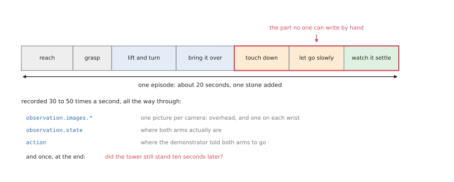

# Collecting the data

This is phases 1 to 3 of the [overview](01_overview.md): the rig, the
demonstrations, and turning them into a dataset. It is also where most of the
calendar time goes. Training takes an afternoon; collecting what to train on
takes a week.

## Contents

1. [What one demonstration contains](#1-what-one-demonstration-contains)
2. [How a person drives two arms](#2-how-a-person-drives-two-arms)
3. [The fork: a person, or a program](#3-the-fork-a-person-or-a-program)
4. [How many demonstrations](#4-how-many-demonstrations)
5. [What makes a demonstration good](#5-what-makes-a-demonstration-good)
6. [The dataset format](#6-the-dataset-format)
7. [Curation, which is not optional](#7-curation-which-is-not-optional)

---

## 1. What one demonstration contains

One demonstration is one episode: a person adds one stone to the tower, and lets
go. About twenty seconds.



Thirty to fifty times a second, all the way through, three things are written
down:

- **the pictures**, one per camera. An overhead camera sees the tower; a camera
  on each wrist sees what that gripper is about to touch, which the overhead
  view cannot.
- **the state**: where both arms actually are, as joint angles, plus the
  grippers. For two 6-joint arms with a gripper each, that is 14 numbers.
- **the action**: where the demonstrator *told* both arms to go, in the same 14
  numbers.

The action is the label. Training is teaching the model to produce that action
when it sees those pictures and that state.

**State and action are not the same**, and the difference matters. The state is
where the arm is; the action is where it was asked to be. When a gripper presses
a stone down, the command is below the surface and the arm never gets there, and
that gap is exactly the "press gently" behaviour you want the model to learn.
Record both.

**And one thing at the end of the episode:** did the tower still stand ten
seconds later? One bit, recorded once, worth more than any other number in the
file. Without it you cannot tell a good demonstration from a bad one, and you
cannot measure anything later.

## 2. How a person drives two arms

Driving two arms at once is the part people underestimate. The options, best
first:

**A pair of leader arms.** Two small copies of the arms sit on the desk; the
person holds one in each hand, and the real arms follow. This is how the ALOHA
data everyone trains on was made, and it is the only method where a person can
comfortably control fourteen joints at once and feel what they are doing.
LeRobot supports this directly for bimanual setups with its `bi_so_leader` and
`bi_so_follower` configurations.

**VR hand tracking.** A headset tracks both hands and maps them to the
grippers. No hardware to build, and it works in simulation, but there is no
force feedback, which matters for a task that is about touch.

**A gamepad or 3D mouse, one arm at a time.** Cheap, and hopeless for anything
where the arms have to move together. Usable for the reach-and-grasp part, bad
for placing.

**Keyboard.** Fine for testing the recording pipeline. Nobody stacks stones with
it.

For this task, wrist cameras and some sense of force matter more than precision
of motion, so a leader-arm rig is worth the trouble if you are going to spend a
week collecting.

## 3. The fork: a person, or a program

There is a second way to get demonstrations, and in simulation it is often the
right one.

**Let a program demonstrate.** The modular system from the
[stone stacking doc](../12_stone-stacking.md#4-the-system-end-to-end) — segment the
scene, search for a stable pose in a physics engine, plan, place — is slow and
fussy to run, but it does not get tired. Run it a few thousand times overnight,
keep the attempts where the tower stood, and you have a dataset. Then train the
policy on that, and you end up with something that does in one forward pass what
took the modular system thirty seconds of search.

This is the standard trick in simulated robot learning, and it is how the large
two-arm benchmarks make their data: RoboTwin generates its hundred thousand
trajectories this way rather than collecting them by hand.

| | A person demonstrates | A program demonstrates |
| --- | --- | --- |
| cost per episode | 30 seconds of someone's attention | a few seconds of computer time |
| how many you can get | hundreds | tens of thousands |
| quality | good strategies, inconsistent execution | consistent, and only as good as the program |
| contact behaviour | the real thing, including hesitation and correction | whatever the controller does, which may be unlike a person |
| works in simulation | needs a teleoperation bridge | naturally |
| works on real hardware | naturally | needs the modular system to work first |

**The honest answer for a first project in simulation:** use a program. You get
more data, it is reproducible, and it does not require building a teleoperation
rig. Use people when you have real hardware, or when the program cannot do the
task at all — which, for the last centimetre of stone placement, may well be the
case.

## 4. How many demonstrations

There is no formula, but there are useful reference points.

- The ALOHA sim tasks that everyone starts with — transfer a cube, insert a peg
  — ship **50 episodes** each, and ACT reaches roughly 90 % on the easier one
  and about half that on the harder one from exactly that.
- The two-arm benchmark leaderboards use **50 demonstrations per task** as their
  standard setting, across fifty different tasks.
- Stone stacking is harder than either, because the scene is never the same
  twice. Plan for **several hundred** episodes of "add one stone", and expect the
  first hundred to teach you mostly about your rig.

The number that matters is not the total but the **coverage**: how many
genuinely different situations the policy has seen. Two hundred episodes with
the same three stones in the same three places is a smaller dataset than fifty
with stones drawn at random, whatever the file size says.

The practical method is to stop guessing and measure: train on 50, then 100,
then 200, and plot success against dataset size. That curve tells you whether
more data is still worth collecting — and it is the single most useful
experiment in this whole folder.

## 5. What makes a demonstration good

- **One strategy, repeated.** If you sometimes place from above and sometimes
  slide in from the side, the policy sees both and may average them into
  something that is neither. Pick a way and stick to it.
- **Smooth, deliberate motion.** Dithering while you think teaches the policy to
  dither.
- **Include the slow part.** The temptation is to rush the settle-and-release,
  because it is boring. That part is the reason you are doing this.
- **Include recoveries, deliberately.** If the stone starts to tip and you catch
  it and re-seat it, keep that episode — as long as it ends in success. A policy
  that has only seen perfect placements has no idea what to do when the stone
  moves, and a stone always moves eventually.
- **Vary what you want it to tolerate.** Different stones, different starting
  positions, different tower heights. Whatever you keep constant, the policy is
  allowed to assume.

## 6. The dataset format

Use the [LeRobotDataset](https://huggingface.co/docs/lerobot/main/en/lerobot-dataset-v3)
format. Not because it is magic, but because it is what the training code, the
visualisers and the published datasets all already speak, so nothing has to be
converted.

The keys are exactly the three things from section 1:

```
observation.images.overhead     one frame per camera, stored as video
observation.images.wrist_left
observation.images.wrist_right
observation.state               where both arms are:  14 numbers
action                          where they were told to go:  14 numbers
timestamp, frame_index, episode_index, task
```

Around them the format keeps a `meta/` folder: `info.json` with the frame rate
and the shape of every field, `stats.json` with the mean and spread of each one
(which training uses to normalise), `tasks.jsonl` with the sentence describing
each task, and per-episode records. Frames live in Parquet files and pictures in
MP4 shards, many episodes per file.

Two practical notes. **Pictures are stored as video**, which is why a few hundred
episodes are megabytes rather than gigabytes, and why decoding is the slow part
of training. And **the frame rate is part of the data**: if you record at 30 and
run the policy at 50, every learned motion happens at the wrong speed.

## 7. Curation, which is not optional

Raw recordings are not a dataset. Before training:

- **Drop the failures** — unless you are deliberately training something to
  predict failure, in which case keep them, labelled. What you must not do is
  leave them in unlabelled, teaching the policy to do the thing that did not
  work.
- **Drop the ones where you fumbled the controls.** Your rig's problems are not
  the task.
- **Trim the ends.** The five seconds before you started moving and the ten after
  you finished are dead frames that the policy will happily learn to reproduce.
- **Check the balance.** Count episodes per stone, per tower height, per starting
  layout. Whatever is rare will fail first.
- **Look at it.** Actually watch twenty episodes end to end, with the recorded
  actions drawn on them. A camera that drifted, a gripper that never closed, an
  episode labelled a success that plainly was not: these are obvious to the eye,
  cheap to find this way, and expensive to find after a training run.

---

Next: [training and evaluating](03_training-and-evaluating.md).
