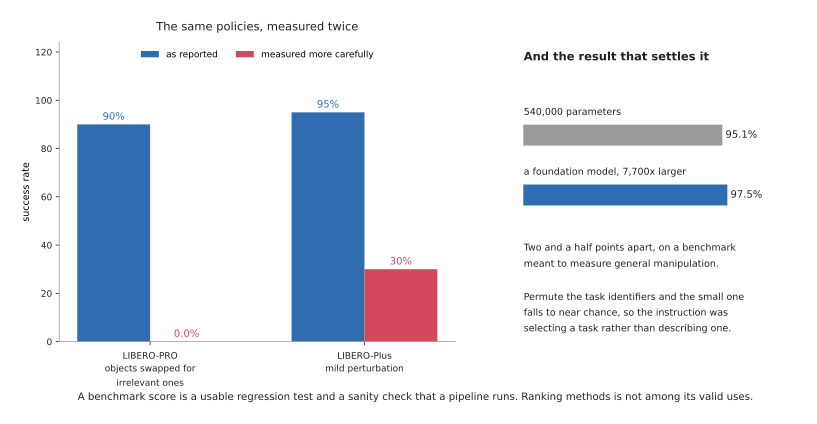
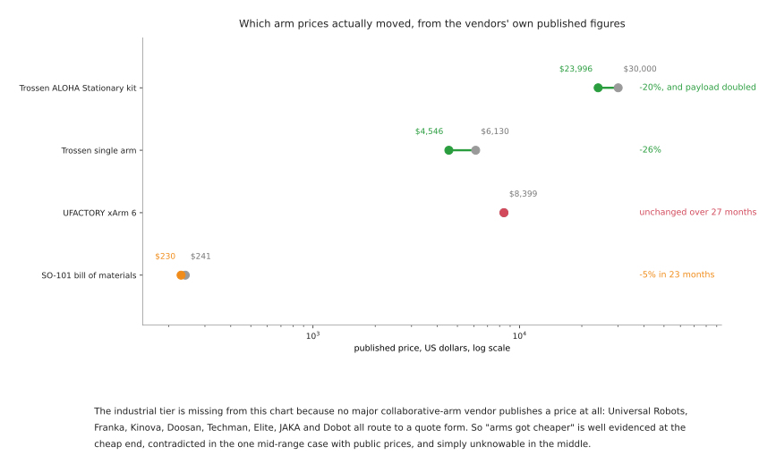

# The frontier: what changed in 2026

This folder is a record of what actually happened to robot arm manipulation in
2026, written in September of that year. It is deliberately a different kind of
document from the rest of the repository. Everything else here explains how
something works and will still be true in five years. This will not. It is dated
on purpose, and the date is at the top of every claim in it.

There is a companion that ages better and is worth reading first if you have time
for only one: [what is changing, and
why](../10_one-arm-training/05_what-is-changing.md) explains the *mechanisms*
that move this field and deliberately avoids listing what moved. This folder is
the list. Overlap between the two is intentional.

## Who this is for, and what it is for

Someone who knows roughly how a robot arm works, has read some of the rest of
this repository, and wants to know what is genuinely new rather than what is
being announced. It is written to be *used for judging claims*, which shapes it
in three ways.

**Every development is written the same way**: what it was before, what changed,
how it was achieved, why that matters, and what it still cannot do. The third of
those is the one most write-ups skip, and it is the one that tells you whether a
result will generalise. The fifth is not optional — a development with no stated
limits has not been understood.

**Every item carries a maturity label**, because a great deal of robotics
reporting does not distinguish a video from a product. Section 2 defines them.

**Every number is sourced or computed**, with the conditions it was measured
under. Where something could not be established, the documents say so rather than
filling the gap.

## Contents

1. [The one thing to take from 2026](#1-the-one-thing-to-take-from-2026)
2. [How to read a claim in this field](#2-how-to-read-a-claim-in-this-field)
3. [The year, before and after](#3-the-year-before-and-after)
4. [What genuinely changed](#4-what-genuinely-changed)
5. [What did not change, and matters most](#5-what-did-not-change-and-matters-most)
6. [What this means if you are learning](#6-what-this-means-if-you-are-learning)
7. [The five documents that follow](#7-the-five-documents-that-follow)

---

## 1. The one thing to take from 2026

If you read nothing else here, read this.

**The binding constraint moved from "can a model do this at all" to "can anyone
tell whether it did".** Models got much better and the ability to measure them
did not, and the gap between those two is now the most important fact about the
field.

That is not an opinion assembled from a mood. Two of the documents in this folder
were researched independently, on different subjects, and arrived at it from
opposite ends. The
[simulation and evaluation](04_simulation-and-evaluation.md) document set out to
survey benchmarks and found that three separate 2026 studies show benchmark
scores collapsing under mild perturbation. The
[data](03_data-and-demonstration.md) document set out to survey where
demonstrations come from and concluded that evaluation, not collection, is the
real bottleneck. Neither was looking for the other's answer.

The sharpest single number is this. A policy with **540,000 parameters** scores
95.1% on LIBERO over 2,000 rollouts — **2.4 points below a foundation model with
7,700 times more parameters**. Permute the task identifiers and it drops to near
chance, which means the instruction was working as a task selector rather than as
an instruction. Whatever that benchmark is measuring, it is not what its users
believe.

## 2. How to read a claim in this field

Five labels, used on every item in this folder. The distinction between them is
the single most useful thing to hold on to, because press coverage collapses all
five into "robots can now do X".

| Label | What it means | What you can do with it |
| --- | --- | --- |
| **Shipped** | a product you can buy, with a price or a quote path | plan around it |
| **Downloadable** | open weights or code, licence named | try it today |
| **Demonstrated** | shown working, not obtainable | believe the capability exists, once |
| **Paper only** | results published, no artefact | believe the measurement, not the product |
| **Announced** | stated, nothing shown | note the date and wait |

The worked example that justifies the whole apparatus is Meta's Digit 360 tactile
sensor, announced as "available for purchase in 2025" and, as of today, never
sold. It is a real device with a real paper. It is not a thing you can have.

A second habit is worth building alongside the labels: **when a number is
quoted, ask what it is the average of.** Skild's widely repeated "66% against 9%"
turns out, in Skild's own post, to be an average of *per-step* success with
human intervention used to recover from failures during rollouts. No whole-task
figure is published. The number is not false; it is not what readers take it
for.

## 3. The year, before and after

The table is the whole folder in one screen. Read each row as: where the field
stood at the start of 2026, and where it stands now. The documents behind each
row carry the evidence.

| | At the start of 2026 | In September 2026 |
| --- | --- | --- |
| **Generalist policies** | a handful of VLAs, mostly closed; open shelf was essentially OpenVLA | ten-plus families; several open; pretraining on human video at million-hour scale |
| **Where data comes from** | teleoperation rigs, one robot at a time | handheld capture matching teleoperation; phone apps collecting 30 minutes of video per second |
| **Simulators** | Isaac Sim as a monolith; MuJoCo separate | Isaac Lab came apart into swappable physics and rendering; DeepMind's Newton is a supported backend |
| **Benchmarks** | reported as though comparable | three studies showing collapse under perturbation; the field now writes papers about this |
| **Arms, cheap end** | roughly $6,000 for a research arm | $1,650 to $4,545, with payload doubled at the top of that range |
| **Arms, industrial end** | quote-only, no public prices | quote-only, no public prices, and one verified model unchanged for 27 months |
| **On-robot compute** | falling in price | **rising**, because memory prices rose |

Two rows in that table are the interesting ones, and they are the two that point
the opposite way from the story. Industrial arm prices did not move, and compute
got more expensive.

## 4. What genuinely changed

Four things, each covered properly in its own document.

**Human video became training data at scale.** The claim that matters is not that
models improved but that a scaling law now appears to hold *across the embodiment
gap*: robot performance rising monotonically as purely human video grows, from
1,000 hours to a million. If that holds, the data problem has a route round it
that does not involve robots at all. See
[foundation models](02_foundation-models.md).

**Handheld capture caught up with teleoperation.** A policy trained only on data
from a handheld gripper matched in-domain teleoperation on a real robot. Since
handheld rigs cost a fraction of a teleoperation setup and need no robot to
collect, this changes who can produce data. See
[data and demonstration](03_data-and-demonstration.md).

**The simulator stack came apart, in a good way.** Physics, rendering and
visualisation became independent choices rather than one bundle, and the physics
engine underneath the biggest framework can now be DeepMind's. See
[simulation and evaluation](04_simulation-and-evaluation.md).

**The cheap end of the arm market genuinely fell, and the rest did not.** This is
the row most often reported as a single trend and it is two opposite trends. See
[hardware](05_hardware.md).

## 5. What did not change, and matters most

**Evaluation.** Section 1.

**Joint torque sensing.** No arm gained it this year. Where a price collapse
looks like it delivered torque sensing, the specification turns out to be
current-based estimation, which the vendor's own footnote admits.

**The six-axis force-torque price floor.** Unmoved.

**Dataset licensing, which got worse rather than better.** The largest open robot
dataset in the world is non-commercial. The most widely used one publishes no
licence at all — no file, no statement, nothing in the bucket. The standard
mixture that most people train on is 72 separate licences with no central record,
and at least one non-commercial dataset sits inside it. There is no maintained
index anywhere that lists robot datasets with their licences; the two community
attempts have one star and zero stars between them.

If you intend to ship something, that paragraph is the most expensive one in this
folder.

## 6. What this means if you are learning

Three practical conclusions, which are the reason this folder exists rather than
a news feed.

**Do not choose what to learn from benchmark tables.** They cannot rank methods.
They are a usable regression test and a sanity check that a pipeline runs, and
that is the whole of their valid use.

**The cheap end of the hardware market is now genuinely accessible**, and that is
new. A capable research arm at $1,650 to $4,500, with handheld data collection
that needs no robot at all, puts real manipulation work within reach of one
person. That was not true two years ago.

**Read licences before you read benchmarks.** A model or dataset you cannot use
is not a shortlist candidate, whatever it scores, and the licences in this field
are unusually hostile and unusually badly documented.

## 7. The five documents that follow

| | What it covers |
| --- | --- |
| [Foundation models](02_foundation-models.md) | generalist policies and vision-language-action models: what each lab shipped, on what data, and what it cannot do |
| [Data and demonstration](03_data-and-demonstration.md) | where manipulation data comes from, what it costs, and the licences that stop you using it |
| [Simulation and evaluation](04_simulation-and-evaluation.md) | the simulators, the world models, and the evidence that benchmark numbers do not mean what is reported |
| [Hardware](05_hardware.md) | arms, grippers, tactile sensing and on-robot compute, with the prices that are published and the ones that are not |
| [What is coming](06_what-is-coming.md) | 2027 and after, separated by how well evidenced each claim is, with track records |

A closing note on how to use this folder in a year. Most of it will be stale, and
the parts that go stale first are the model comparisons, because that is the
fastest-moving section. The parts that will still hold are the mechanisms, the
licences and the regulatory dates. [What is
coming](06_what-is-coming.md#8-how-to-read-this-document-in-a-year) says which of
its own claims it expects to look wrong first, which is a habit more documents in
this field should adopt.
