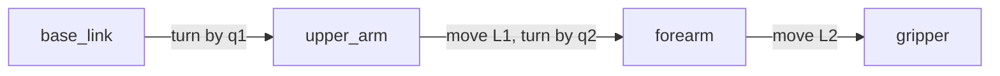

# Position, frames and transforms

A two-joint robot arm, used to work out where its gripper is.

This area is about the maths under every robot: how you say where something is,
and how you move between one part's point of view and another's. It builds up
over five small programs you can run.


## Contents

1. [What this area is about](#1-what-this-area-is-about)
2. [The maths, one piece at a time](#2-the-maths-one-piece-at-a-time)
   · [Turning a point](#turning-a-point)
   · [A transform: a turn and a shift](#a-transform-a-turn-and-a-shift)
   · [Joining two transforms](#joining-two-transforms)
   · [Going backwards](#going-backwards)
3. [The arm](#3-the-arm)
   · [The frames](#the-frames)
   · [Where the gripper ends up](#where-the-gripper-ends-up)
   · [Pseudo code](#pseudo-code)
4. [The five steps](#4-the-five-steps)
5. [Running it](#5-running-it)
6. [Notes](#6-notes)

---

## 1. What this area is about

A position is two numbers in 2D, or three in 3D. On their own they mean
nothing. "The gripper is at (0.43, 0.65)" is only useful once you say *measured
from where*.

That starting point is a **frame**: a spot with axes attached to one physical
thing. The table has one. So does the shoulder, the elbow, the gripper, the
camera.

The job, over and over, is moving between them:

- The camera sees a screw 20 cm ahead of itself. Where is it on the table?
- The gripper holds a screwdriver. Where is the tip?
- The arm should reach a point on the table. What must each joint do?

All of these are the same small piece of maths, used in different directions. A
**transform** is that piece: it says where one frame sits inside another.

---

## 2. The maths, one piece at a time

Only one formula needs remembering. Everything else is built from it.

### Turning a point


To turn a point around the origin by an angle:

```
x' = x · cos(angle) - y · sin(angle)
y' = x · sin(angle) + y · cos(angle)
```

Check it by hand. Take the point `(1, 0)` and turn it a quarter turn, 90°.
`cos(90°)` is 0 and `sin(90°)` is 1, so:

```
x' = 1 · 0 - 0 · 1 = 0
y' = 1 · 1 + 0 · 0 = 1
```

which is `(0, 1)`. The point that was along X is now along Y. That is what a
quarter turn should do.

In the code: `rotate_point()` in `arm_math.py`.

### A transform: a turn and a shift

A transform is a turn followed by a shift, kept together as one thing. Three
numbers describe it completely: `x`, `y` and an angle.

To move a point from the child frame out into the parent frame:

```
turn the point by the angle
then add the shift
```

Written out:

```
x' = x · cos(angle) - y · sin(angle) + shift_x
y' = x · sin(angle) + y · cos(angle) + shift_y
```

**The order matters.** Turning and then shifting is not the same as shifting and
then turning. If you shift first, the later turn swings that shift around the
origin too, and the point lands somewhere else.

In the code: `Transform2D` and its `apply()` method.

### Joining two transforms

This is the part that makes frames worth using.

If you know A→B and B→C, you can get A→C without measuring anything new:

```
joined angle  = A's angle + B's angle
joined offset = apply A to B's offset
```

Angles add. Offsets get carried through the earlier turn.

That second line is why the order matters again: B's offset was measured in B's
own tilted frame, so it has to be turned into A's before adding.

In the code: `Transform2D.then()`.

### Going backwards

Every transform can be flipped. If you know where the gripper is on the table,
you also know where the table is from the gripper's point of view:

```
flipped angle  = -angle
flipped offset = turn the offset by -angle, then negate it
```

You undo the turn, then undo the shift, in that order — which is why the shift
gets turned on the way out.

A useful check: flipping twice must give back what you started with. The tests
do exactly that.

In the code: `Transform2D.inverse()`.

---

## 3. The arm

### The frames

Two joints, two links, flat on a table. Four frames:



| Frame | Attached to |
| --- | --- |
| `base_link` | the table the arm is bolted to |
| `upper_arm` | the first link, turned by the shoulder |
| `forearm` | the second link, turned by the elbow |
| `gripper` | the tip, at the end of the forearm |

Each link is described **on its own**. The elbow knows it is `L1` along the
upper arm, turned by `q2`. It does not know or care where the shoulder is
pointing.

### Where the gripper ends up

Join the three links and this falls out:

```
gripper_x = L1 · cos(q1) + L2 · cos(q1 + q2)
gripper_y = L1 · sin(q1) + L2 · sin(q1 + q2)
```

Look at `q1 + q2`. Nobody wrote that. It appeared on its own, because joining
adds the angles. The forearm's angle on the table is its own joint angle plus
everything the joints before it contributed.

That is the whole benefit. With a third joint you would get `q1 + q2 + q3`
without doing any new thinking.

Quick check with both joints straight, `q1 = q2 = 0`. Every cosine is 1 and
every sine is 0, so the gripper is at `L1 + L2 = 0.9 m` straight along X. A
straight arm reaching its full length. Step 1 prints exactly that.

### Pseudo code

The whole area, in shorthand:

```
to turn a point by an angle:
    x' = x·cos(angle) - y·sin(angle)
    y' = x·sin(angle) + y·cos(angle)

to apply transform T to a point:
    turn the point by T's angle
    add T's shift

to join transform A with transform B:
    angle  = A.angle + B.angle
    shift  = apply A to B's shift

to flip transform A:
    angle  = -A.angle
    shift  = turn A's shift by -A.angle, then negate

to find the gripper on the table:
    result = nothing (no shift, no turn)
    for each link from base_link to gripper:
        result = join(result, link)
    return result
```

Four small operations. Everything in this area is one of them.

---

## 4. The five steps

Read and run them in order. Each file explains itself at the top.

| Step | File | What it adds |
| --- | --- | --- |
| 1 | `step1_positions.py` | position worked out with plain trigonometry |
| 2 | `step2_frames.py` | the same answer, by joining frames instead |
| 3 | `step3_chain.py` | flipping a transform, and carrying a point across |
| 4 | `step4_broadcast.py` | publishing the frames to TF, so RViz can draw them |
| 5 | `step5_lookup.py` | asking TF for an answer nobody published |

Steps 1 to 3 are plain Python. No ROS. You can read them top to bottom.

Step 2 checks itself against step 1 and prints the difference, which is zero.
Two different routes, same numbers.

Step 5 is the point of the whole area. Open it and look for trigonometry: there
is none. No `cos`, no `sin`, no `q1 + q2`. It does not know how long the links
are, or that the arm has two joints. It asks TF for `base_link` → `gripper`, and
TF joins the chain that step 4 published one link at a time.

---

## 5. Running it

```
make arm.learn     steps 1 to 3: the maths, printed, then it exits
make arm.demo      step 4: publish the arm and draw it in RViz
make arm.watch     step 5: ask TF where the gripper is (needs arm.demo running)
```

`make arm.learn` prints a table of joint angles and where the gripper lands,
then joins the links one at a time so you can watch the numbers build up, then
flips a transform and carries a screwdriver tip from the gripper onto the table.

`make arm.demo` opens RViz with the arm swinging. The two joints move at
different speeds, so the arm keeps finding new poses instead of looping. You
should see two blue bars, yellow balls at the joints, a red ball at the gripper,
and the frame arrows moving with them.

`make arm.watch` prints a line a second, like this:

```
gripper at (+0.852, -0.028) facing   +19.2°   tool tip at (+0.899, -0.011)
```

The tool tip is always 5 cm from the gripper, whatever the arm is doing. That
distance is fixed because the tip is described *in the gripper frame*, and it
never changes there.

---

## 6. Notes

The arm here is flat, to keep the maths to one angle. Real arms are 3D, and a
3D transform needs three. The four operations do not change — there is just
more arithmetic in each one, which is why real code uses matrices and a library.

ROS stores rotations as four numbers, a **quaternion**, rather than as angles.
Three angles have awkward cases in 3D where two axes line up and a degree of
freedom quietly disappears. Four numbers avoid that. `yaw_to_quaternion()`
converts, and you can use it without following the theory.

Notice that step 4 publishes only the three individual links. It never publishes
`base_link` → `gripper`. That is deliberate: publish each fact once, in the place
that knows it, and let TF answer the questions.

The RViz area, [docs/rviz/overview.md](../rviz/overview.md), covers markers and
the viewer itself. It is the easier of the two to start with.
