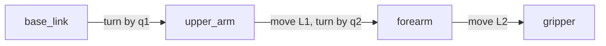

# Position, frames and transforms

A robot arm has to answer one question, over and over: **where is my hand right
now?**

That sounds easy. It is not, and the way robots answer it is the foundation for
almost everything else they do. This area works up to the answer over five small
programs you can read and run.


## Contents

1. [The question this area answers](#1-the-question-this-area-answers)
2. [Meet the arm](#2-meet-the-arm)
3. [Step 1: work it out by hand](#3-step-1-work-it-out-by-hand)
4. [Step 2: describe each part once](#4-step-2-describe-each-part-once)
   · [What a frame is](#what-a-frame-is)
   · [What a transform is](#what-a-transform-is)
   · [Turning a point](#turning-a-point)
   · [Joining two transforms](#joining-two-transforms)
   · [Where the added angles come from](#where-the-added-angles-come-from)
5. [Step 3: backwards, and carrying a point](#5-step-3-backwards-and-carrying-a-point)
   · [Flipping a transform](#flipping-a-transform)
   · [Carrying a point](#carrying-a-point)
6. [Step 4: hand the arm to ROS](#6-step-4-hand-the-arm-to-ros)
7. [Step 5: ask instead of working it out](#7-step-5-ask-instead-of-working-it-out)
8. [All the maths on one page](#8-all-the-maths-on-one-page)
9. [Running it](#9-running-it)
10. [Notes](#10-notes)

---

## 1. The question this area answers

Say the arm's hand is at `(0.43, 0.65)`.

Those two numbers are useless on their own. Measured from where? From the table
the arm is bolted to? From the elbow? From a camera on the far wall? Each gives
a different pair of numbers for the same hand in the same place.

So a position always comes with a starting point. Robots have a lot of them: the
table has one, the shoulder has one, the elbow, the hand, every camera.

The work is nearly always moving between those starting points:

- A camera sees a screw 20 cm in front of it. Where is that screw on the table?
- The hand holds a screwdriver. Where is the tip of it?
- You want the hand at a spot on the table. What should each joint do?

These look like three problems. They are one problem, asked three ways. This
area builds the piece of maths that answers all three, then hands it to ROS.

---

## 2. Meet the arm

The arm is flat, like it is lying on a table. That keeps it to one angle instead
of three, and none of the ideas change.

It has two joints and two rigid links:

| Name | What it is | Value |
| --- | --- | --- |
| `q1` | the shoulder angle — how far the first joint has turned | changes |
| `q2` | the elbow angle — how far the second joint has turned | changes |
| `L1` | the length of the upper arm | 0.5 m, fixed |
| `L2` | the length of the forearm | 0.4 m, fixed |

`q1` and `q2` are the two things the robot controls. `L1` and `L2` were decided
when the arm was built.

So the question at the top becomes a concrete one: **given `q1` and `q2`, where
is the hand?**

---

## 3. Step 1: work it out by hand

File: `step1_positions.py`. Plain Python, no ROS.

Start with the elbow. The upper arm leaves the shoulder at angle `q1` and is
`L1` long. A point `L1` away at angle `q1` sits at:

```
elbow_x = L1 · cos(q1)
elbow_y = L1 · sin(q1)
```

That is what `cos` and `sin` are for. They turn "this far away, at this angle"
into "this far across, this far up". Nothing more.

Now the hand. It is `L2` from the elbow, so we add another step onto the elbow's
position. The only catch is the angle. `q2` is measured against the upper arm,
not against the table. The upper arm is already turned by `q1`. So on the table
the forearm points at `q1 + q2`:

```
hand_x = elbow_x + L2 · cos(q1 + q2)
hand_y = elbow_y + L2 · sin(q1 + q2)
```

Try it with both joints straight, `q1 = 0` and `q2 = 0`. Every cosine is 1 and
every sine is 0, so the hand is at `L1 + L2 = 0.9` metres straight out. A
straight arm at full stretch. That is right, and step 1 prints exactly that.

**This works. So why not stop here?**

Because those two formulas were worked out by hand, for this arm, to answer this
one question. Change anything and you do it again:

- add a third joint, and you rewrite them
- move to 3D, and every step needs three angles instead of one
- ask a different question — "where is the table, from the hand's point of
  view?" — and you work out a fresh set backwards

Step 2 gets the same numbers without working out anything.

---

## 4. Step 2: describe each part once

File: `step2_frames.py`. Still plain Python.

The idea is to stop describing the whole arm at once. Describe each piece on its
own, and let the pieces be combined.

### What a frame is

A **frame** is a starting point with axes, stuck to one physical thing. It
travels with that thing.

This arm has four:



| Frame | Stuck to |
| --- | --- |
| `base_link` | the table the arm is bolted to |
| `upper_arm` | the first link, so it turns with the shoulder |
| `forearm` | the second link, so it turns with the elbow |
| `gripper` | the hand, at the far end of the forearm |

### What a transform is

A **transform** says where one frame sits inside another. Three numbers say it
completely: a shift across, a shift up, and an angle.

The arm is then just three of them, and each one is short:

| From | To | The transform |
| --- | --- | --- |
| `base_link` | `upper_arm` | turn by `q1`, no shift |
| `upper_arm` | `forearm` | shift `L1` across, turn by `q2` |
| `forearm` | `gripper` | shift `L2` across, no turn |

Read the middle row as a sentence: *the forearm starts `L1` along the upper arm,
turned by `q2` from it*. That is a fact about the elbow alone. It stays true
whatever the shoulder is doing, so nobody has to update it.

### Turning a point

To combine transforms we need one formula: turning a point about the origin.


A point sits some distance out, at some angle. Turning it by `t` leaves the
distance alone and adds `t` to the angle. Writing that out in x and y gives:

```
x' = x · cos(t) - y · sin(t)
y' = x · sin(t) + y · cos(t)
```

Check it on a point you can picture. Take `(1, 0)`, which is one metre along X,
and turn it a quarter turn, so `t = 90°`. Then `cos(90°) = 0` and
`sin(90°) = 1`:

```
x' = 1 · 0 - 0 · 1 = 0
y' = 1 · 1 + 0 · 0 = 1
```

The answer is `(0, 1)`: one metre along Y. The point that pointed along X now
points along Y, which is what a quarter turn should do.

This is `rotate_point()` in `arm_math.py`, and it is the only formula in the
area. Everything below is built from it.

### Joining two transforms

Now the useful part. Two transforms end to end can be replaced by one.

Take the first two rows of the table above, with `q1 = 30°` and `q2 = 60°`:

- `base_link` → `upper_arm` is: shift `(0, 0)`, turn `30°`
- `upper_arm` → `forearm` is: shift `(0.5, 0)`, turn `60°`

To get `base_link` → `forearm` directly, there are two rules.

**The angles add.** `30° + 60° = 90°`.

**The second shift has to be turned first.** The `(0.5, 0)` was measured along
the upper arm, and the upper arm is tilted by 30°. So turn `(0.5, 0)` by 30°
before using it:

```
x = 0.5 · cos(30°) - 0 · sin(30°) = 0.433
y = 0.5 · sin(30°) + 0 · cos(30°) = 0.250
```

Then add the first shift, which here is `(0, 0)`. So `base_link` → `forearm` is
a shift of `(0.433, 0.250)` and a turn of `90°`.

Join the third row on the same way and you get `base_link` → `gripper`: a shift
of `(0.433, 0.650)` and a turn of `90°`. Step 2 prints this build-up one line at
a time, so you can watch it happen.

This is `Transform2D.then()`.

### Where the added angles come from

Step 2 finishes by checking itself against step 1, and prints the difference.
The difference is zero, at every pose.

That is worth pausing on. Look back at step 1, where we had to notice that the
forearm points at `q1 + q2` and write it in ourselves. Nothing in step 2
mentions `q1 + q2`. Each transform only knows its own joint.

The `q1 + q2` appeared anyway, because joining adds the angles. That is the
whole benefit: a third joint would produce `q1 + q2 + q3` on its own, with no
new thinking and no new formulas.

---

## 5. Step 3: backwards, and carrying a point

File: `step3_chain.py`. Still plain Python.

Two more moves, and both were awkward in step 1.

### Flipping a transform

If you know where the hand is on the table, you already know where the table is
from the hand's point of view. You do not measure anything new. You undo the
turn, and undo the shift:

```
flipped angle = -angle
flipped shift = turn the shift by -angle, then flip its sign
```

With the arm at `q1 = 30°`, `q2 = 60°` from before, `base_link` → `gripper` was
a shift of `(0.433, 0.650)` and a turn of `90°`. Flipped, `gripper` →
`base_link` is a shift of `(-0.650, 0.433)` and a turn of `-90°`. Step 3 prints
both, one under the other.

This is how a robot answers "where is the table, from the camera?" when all
anyone told it is where the camera sits on the robot.

A good check: flip it twice and you must get back exactly what you started with.
The tests do that at several poses.

This is `Transform2D.inverse()`.

### Carrying a point

A hand holding a screwdriver cares about the tip, not the hand.

The tip is easy to describe in the `gripper` frame: 5 cm straight ahead. And it
stays `(0.05, 0)` there forever, no matter how the arm moves, because it is
bolted to the hand.

To find the tip on the table, apply `base_link` → `gripper` to that fixed point:
turn it, then add the shift. With the arm in the pose above, the tip lands at
`(0.433, 0.700)`.

Move the arm and run step 3 again. The description in the `gripper` frame does
not change. The answer on the table does. This is the same idea as the ball in
the [RViz area](../rviz/overview.md): you do not move the thing, you move the
frame it is attached to.

This is `Transform2D.apply()`.

---

## 6. Step 4: hand the arm to ROS

File: `step4_broadcast.py`. This is the first one that uses ROS.

So far everything has been one program talking to itself. Nothing else on the
robot could ask where the hand was.

**TF** fixes that. It is the part of ROS that keeps track of frames, and the
name is just short for *transform*. Programs publish the transforms they know
about, and TF joins them up for anyone who asks.

Step 4 publishes the arm's three transforms, thirty times a second, as the
joints swing:

```
base_link -> upper_arm      turn by q1
upper_arm -> forearm        move L1, turn by q2
forearm   -> gripper        move L2
```

The maths did not change at all. Step 4 imports the same list of transforms
step 2 used, and only turns each one into a ROS message before sending it.

Two things are worth noticing.

**Each link is published on its own.** Step 4 never publishes `base_link` →
`gripper`, even though it could work it out easily. Each program publishes only
what it actually knows.

**The shapes are drawn in their own frames.** The bar for the upper arm is
described inside `upper_arm`, and it never moves there. TF moves the frame, and
the bar goes along with it. Five shapes, none of which are ever repositioned.

---

## 7. Step 5: ask instead of working it out

File: `step5_lookup.py`. This is where it pays off.

Nobody published `base_link` → `gripper`. This program asks for it anyway:

```python
buffer.lookup_transform('base_link', 'gripper', Time())
```

TF joins the three published links and answers.

Now open the file and look for trigonometry. There is none. No `cos`, no `sin`,
no `q1 + q2`. It never imports `arm_math`. It does not know how long the links
are, how many joints there are, or that the arm is flat.

It only knows two frame names.

That is the reason for all the work in steps 2 and 3. Describe each part once,
in the one place that knows it. Publish that. Then any other program can ask
about any pair of frames, without knowing how the robot is built.

---

## 8. All the maths on one page

Four operations. Everything above is one of them.

```
to turn a point by an angle:
    x' = x·cos(angle) - y·sin(angle)
    y' = x·sin(angle) + y·cos(angle)

to apply a transform T to a point:
    turn the point by T's angle
    then add T's shift

to join transform A with transform B:
    angle = A's angle + B's angle
    shift = apply A to B's shift

to flip transform A:
    angle = -A's angle
    shift = turn A's shift by -A's angle, then flip its sign
```

And the arm's answer, built from them:

```
to find the hand on the table:
    answer = no shift, no turn
    for each transform from base_link to gripper:
        answer = join(answer, that transform)
    return answer
```

In 3D there are three angles instead of one, so each line has more arithmetic in
it. The four operations stay exactly the same, which is why real code keeps them
in a matrix library and stops thinking about them.

---

## 9. Running it

```
make arm.learn     steps 1 to 3: the maths, printed, then it exits
make arm.demo      step 4: publish the arm and draw it in RViz
make arm.watch     step 5: ask TF where the hand is (needs arm.demo running)
```

`make arm.learn` runs the three plain-Python steps back to back. Step 1 prints a
table of joint angles and where the hand lands. Step 2 prints the link-by-link
build-up, and its check against step 1. Step 3 flips a transform, and carries
the screwdriver tip onto the table.

`make arm.demo` opens RViz with the arm swinging. The two joints move at
different speeds, so it keeps finding new poses instead of repeating a short
loop. You should see two blue bars, a yellow ball at each joint, a red ball at
the hand, and the frame arrows moving along with them.

`make arm.watch` prints one line a second:

```
gripper at (+0.852, -0.028) facing   +19.2°   tool tip at (+0.899, -0.011)
```

Watch the two pairs of numbers. They both keep changing, but the gap between
them is always 5 cm, whatever the arm does. That is the screwdriver tip from
step 3, still described as `(0.05, 0)` in the `gripper` frame, still never
touched.

---

## 10. Notes

The arm here is flat on purpose, so there is one angle to follow instead of
three. Real arms are 3D and have more joints. The ideas do not change.

ROS stores a rotation as four numbers, called a **quaternion**, rather than as
angles. Three angles have an awkward case in 3D: at certain poses two axes line
up and one direction of movement quietly disappears. Four numbers have no such
case. `yaw_to_quaternion()` does the conversion for you, and you can use it
without following the theory.

If you have not read the [RViz area](../rviz/overview.md) yet, it covers markers
and the 3D viewer itself. It is the easier of the two, and it shows you what you
are looking at before this area explains the maths underneath.
