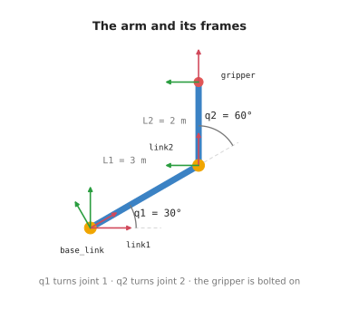
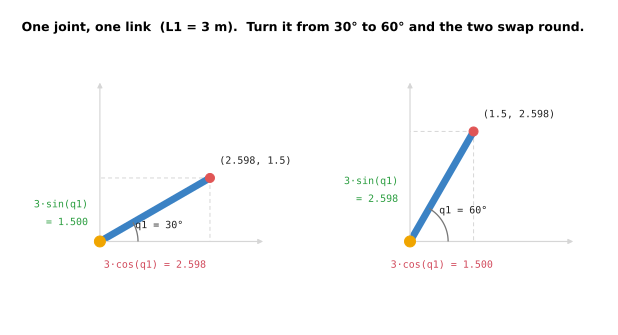
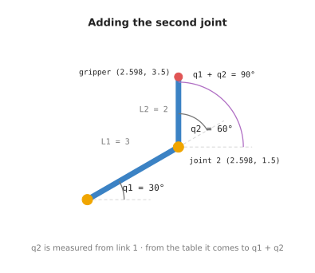
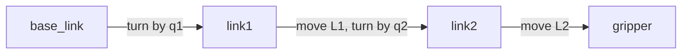
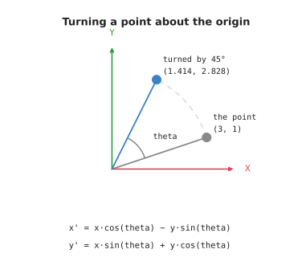
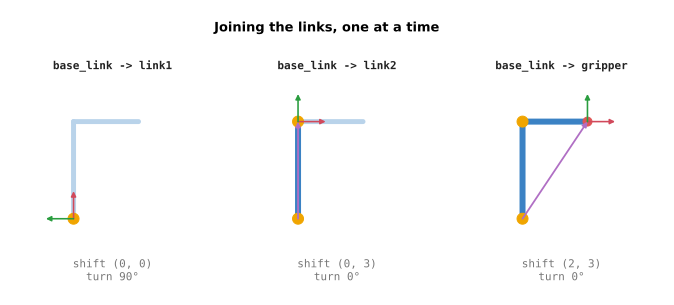
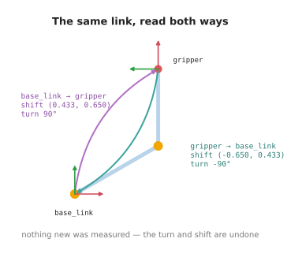
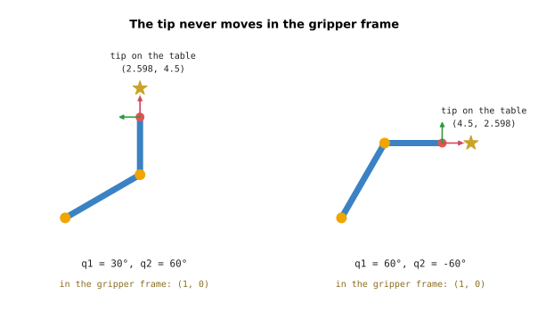
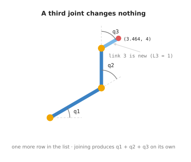

# Position, frames and transforms

A robot arm has to answer one question, over and over: **where is my gripper
right now?**

That sounds easy. It is not, and the way robots answer it is the foundation for
almost everything else they do. This area works up to the answer over five small
programs you can read and run.

## The arm used in this doc

Everything below is explained on one example arm. It is worth fixing in your
head before going on:

- **2 joints**, numbered from the base outwards, called `q1` and `q2`
- **2 rigid links**, called `L1` and `L2`
- **a gripper**, bolted to the far end of link 2 — it is *not* a joint

The arm is flat, as if lying on a table. That keeps it to one angle instead of
three, and none of the ideas change.



| Name | What it is | Value |
| --- | --- | --- |
| `q1` | angle of joint 1, the one attached to the base | changes |
| `q2` | angle of joint 2, at the far end of link 1 | changes |
| `L1` | length of link 1 | 3 m, fixed |
| `L2` | length of link 2 | 2 m, fixed |

`q1` and `q2` are the two things the robot controls. `L1` and `L2` were decided
when the arm was built. The gripper never moves relative to link 2, because it
is bolted to it.

The lengths are 3 m and 2 m, and every worked example below uses right angles.
That is on purpose. `cos` and `sin` of 0° and 90° are 0 and 1, so every position
comes out a whole number you can check in your head. An angle like 30° drags in
`sqrt(3)/2 = 0.866...` and the numbers stop being tidy without teaching you
anything extra.

We build up to this arm rather than starting there. Section 2 uses a simpler one
first: a single joint with a single link.

## Contents

1. [The question this area answers](#1-the-question-this-area-answers)
2. [Start simple: one joint, one link](#2-start-simple-one-joint-one-link)
3. [Step 1: two joints, worked out by hand](#3-step-1-two-joints-worked-out-by-hand)
4. [Step 2: describe each part once](#4-step-2-describe-each-part-once)
   · [What a frame is](#what-a-frame-is)
   · [What a transform is](#what-a-transform-is)
   · [Turning a point](#turning-a-point)
   · [Joining two transforms](#joining-two-transforms)
   · [Where the added angles come from](#where-the-added-angles-come-from)
5. [Step 3: backwards, and carrying a point](#5-step-3-backwards-and-carrying-a-point)
   · [Flipping a transform](#flipping-a-transform)
   · [Carrying a point](#carrying-a-point)
6. [Step 4: hand the arm to ROS](#6-step-4-hand-the-arm-to-ros)
7. [Step 5: ask instead of working it out](#7-step-5-ask-instead-of-working-it-out)
8. [Making the arm bigger](#8-making-the-arm-bigger)
9. [All the maths on one page](#9-all-the-maths-on-one-page)
10. [Running it](#10-running-it)
11. [Notes](#11-notes)

---

## 1. The question this area answers

Say the gripper is at `(0.43, 0.65)`.

Those two numbers are useless on their own. Measured from where? From the table
the arm is bolted to? From joint 2? From the far end of link 1? Each gives a
different pair of numbers for the same gripper in the same place.

So a position always comes with a starting point. Robots have a lot of them: the
table has one, each joint has one, and the gripper has one.

The work is nearly always moving between those starting points:

- The gripper holds a tool. Where is the tip of it?
- A part is sitting at a known spot on the table. Where is it, measured from the
  gripper?
- You want the gripper at a spot on the table. What should each joint do?

These look like three problems. They are one problem, asked three ways. This
area builds the piece of maths that answers all three, then hands it to ROS.

---

## 2. Start simple: one joint, one link

Before the two-joint arm, take the smallest arm there is. One joint, one link,
the gripper bolted straight onto the end:



The link leaves the base at angle `q1` and is `L1` long. So where is the
gripper?

```
gripper_x = L1 · cos(q1)
gripper_y = L1 · sin(q1)
```

That is all `cos` and `sin` do here. They turn "this far away, at this angle"
into "this far across, this far up". Nothing more.

The picture above shows both of those as the two sides of a right-angled
triangle: `L1·cos(q1)` across the bottom, `L1·sin(q1)` up the side.

Try `q1 = 90°`, straight up. `cos(90°)` is 0 and `sin(90°)` is 1, so the gripper
is at `(3 · 0, 3 · 1)`, which is `(0, 3)`. Three metres up, nothing across.

The picture shows that case on the right, and an untidy one on the left: at
`q1 = 30°` the answer is `(2.598..., 1.5)`, because `cos(30°)` is `0.866...`.
Both are correct. Only one is worth doing in your head, which is why the rest of
this area sticks to right angles.

Step 1 prints a table of both kinds before it does anything else.

One joint is easy. The interesting part starts when there are two.

---

## 3. Step 1: two joints, worked out by hand

File: `step1_positions.py`. Plain Python, no ROS.

Now add joint 2 and link 2. Joint 2 sits at the far end of link 1, which is
exactly where the one-joint arm's gripper was:



So the first half is already done. With `q1 = 90°`, joint 2 is at `(0, 3)`,
same as the one-joint arm's gripper.

The catch is the angle of link 2, and the picture shows it. There are two arcs
at joint 2. The grey one is `q2`, measured from link 1. The purple one is the
angle from the table, and it is the bigger of the two.

`q2` is measured against link 1, not against the table. Link 1 is already turned by `q1`. So measured from the table, link 2
points at `q1 + q2`:

```
gripper_x = joint2_x + L2 · cos(q1 + q2)
gripper_y = joint2_y + L2 · sin(q1 + q2)
```

The picture uses `q2 = -90°`, which swings link 2 back down to horizontal. From
the table, link 2 then points at `q1 + q2 = 0°`, so the gripper sits `L2` further
along X: `(0 + 2, 3) = (2, 3)`.

Try it with both joints straight instead, `q1 = 0` and `q2 = 0`. Every cosine is
1 and every sine is 0, so the gripper is at `L1 + L2 = 5` metres straight out. A
straight arm at full stretch. That is right, and step 1 prints exactly that.

**This works. So why not stop here?**

Because those two formulas were worked out by hand, for this arm, to answer this
one question. Change anything and you do it again:

- add a third joint, and you rewrite them
- move to 3D, and every step needs three angles instead of one
- ask a different question — "where is the table, from the gripper's point of
  view?" — and you work out a fresh set backwards

Step 2 gets the same numbers without working out anything.

---

## 4. Step 2: describe each part once

File: `step2_frames.py`. Still plain Python.

The idea is to stop describing the whole arm at once. Describe each piece on its
own, and let the pieces be combined.

### What a frame is

A **frame** is a starting point with axes, stuck to one physical thing. It
travels with that thing.

This arm has four:



| Frame | Stuck to |
| --- | --- |
| `base_link` | the table the arm is bolted to |
| `link1` | link 1, so it turns with joint 1 |
| `link2` | link 2, so it turns with joint 2 |
| `gripper` | the gripper, at the far end of link 2 |

Notice that every frame has exactly one parent, the part it is attached to. That
is what lets them be joined up in order.

### What a transform is

A **transform** says where one frame sits inside another. Three numbers say it
completely: a shift across, a shift up, and an angle.

The whole arm is then three of them, and each one is short:

| From | To | The transform | Changes? |
| --- | --- | --- | --- |
| `base_link` | `link1` | turn by `q1`, no shift | yes, joint 1 |
| `link1` | `link2` | shift `L1` across, turn by `q2` | yes, joint 2 |
| `link2` | `gripper` | shift `L2` across, no turn | no, bolted on |

Read the second row as a sentence: *link 2 starts `L1` along link 1, turned by
`q2` from it*. That is a fact about joint 2 alone. It stays true whatever joint 1
is doing, so nobody has to update it.

The last row never changes at all. It was measured once, when the arm was built.
TF does not treat it differently from the joints — a transform is a transform.

### Turning a point

To combine transforms we need one formula: turning a point about the origin.



A point sits some distance out, at some angle. Turning it by `t` leaves the
distance alone and adds `t` to the angle. Writing that out in x and y gives:

```
x' = x · cos(t) - y · sin(t)
y' = x · sin(t) + y · cos(t)
```

Check it on a point you can picture. Take `(1, 0)`, which is one metre along X,
and turn it a quarter turn, so `t = 90°`. Then `cos(90°) = 0` and
`sin(90°) = 1`:

```
x' = 1 · 0 - 0 · 1 = 0
y' = 1 · 1 + 0 · 0 = 1
```

The answer is `(0, 1)`: one metre along Y. The point that pointed along X now
points along Y, which is what a quarter turn should do.

The picture uses `(3, 1)` turned by 90°, which lands on `(-1, 3)`. That is the
same turn joint 1 applies to link 1, and again both numbers come out whole.

This is `rotate_point()` in `arm_math.py`, and it is the only formula in the
area. Everything below is built from it.

### Joining two transforms

Now the useful part. Two transforms end to end can be replaced by one.

Take the first two rows of the table above, with `q1 = 90°` and `q2 = -90°`:

- `base_link` → `link1` is: shift `(0, 0)`, turn `90°`
- `link1` → `link2` is: shift `(3, 0)`, turn `-90°`

To get `base_link` → `link2` directly, there are two rules.

**The angles add.** `90° + (-90°) = 0°`.

**The second shift has to be turned first.** The `(3, 0)` was measured along
link 1, and link 1 is turned by 90°. So turn `(3, 0)` by 90° before using it:

```
x = 3 · cos(90°) - 0 · sin(90°) = 3 · 0 - 0 = 0
y = 3 · sin(90°) + 0 · cos(90°) = 3 · 1 + 0 = 3
```

Then add the first shift, which here is `(0, 0)`. So `base_link` → `link2` is a
shift of `(0, 3)` and a turn of `0°`.

That `(0, 3)` should look familiar. It is where joint 2 was in section 3, and
where the one-joint arm's gripper was in section 2. Same point, reached three
different ways.

Join the third row on the same way — shift `(2, 0)`, no turn — and you get
`base_link` → `gripper`: a shift of `(2, 3)` and a turn of `0°`.



Each panel adds one link. The frame walks out along the arm, and the shift and
turn underneath it are the answer so far. Step 2 prints exactly these three
lines, so you can watch it happen.

This is `Transform2D.then()`.

### Where the added angles come from

Step 2 finishes by checking itself against step 1, and prints the difference.
The difference is zero, at every pose.

That is worth pausing on. Look back at section 3, where we had to notice that
link 2 points at `q1 + q2` and write it in ourselves. Nothing in step 2 mentions
`q1 + q2`. Each transform only knows its own joint.

The `q1 + q2` appeared anyway, because joining adds the angles. That is the
whole benefit: a third joint would produce `q1 + q2 + q3` on its own, with no
new thinking and no new formulas.

---

## 5. Step 3: backwards, and carrying a point

File: `step3_chain.py`. Still plain Python.

Two more moves, and both were awkward in step 1.

### Flipping a transform

If you know where the gripper is on the table, you already know where the table
is from the gripper's point of view. You do not measure anything new. You undo
the turn, and undo the shift:

```
flipped angle = -angle
flipped shift = turn the shift by -angle, then flip its sign
```

This one needs a pose with a turn left in it, so step 3 uses `q1 = 180°`,
`q2 = -90°`: link 1 goes left, link 2 goes up. There `base_link` → `gripper` is
a shift of `(-3, 2)` and a turn of `90°`.

Flipped, `gripper` → `base_link` is a shift of `(-2, -3)` and a turn of `-90°`.
Step 3 prints both, one under the other.

Look at what happened to the shift. `(-3, 2)` did not simply change sign. It
came back as `(-2, -3)`, because it had to be turned by `-90°` on the way out.



Same two frames, same arm, no new measurement. Only the direction of the
question changed, and the numbers are completely different because they are now
measured along the gripper's axes instead of the table's.

This is how a robot answers "where is the table, from the gripper?" when all
anyone told it is how far each joint has turned.

A good check: flip it twice and you must get back exactly what you started with.
The tests do that at several poses.

This is `Transform2D.inverse()`.

### Carrying a point

A gripper holding a tool cares about the tip, not the gripper itself.

The tip is easy to describe in the `gripper` frame: 1 m straight ahead. And it
stays `(1, 0)` there forever, no matter how the arm moves, because it is bolted
to the gripper.

To find the tip on the table, apply `base_link` → `gripper` to that fixed point:
turn it, then add the shift. At the main pose the tip lands at `(3, 3)`; at the
`q1 = 180°` pose it lands at `(-3, 3)`.



Two poses, one point. The bottom line is `(1, 0)` in both, because that is the
tip's description in the `gripper` frame and it never changes. The number by the
star is different in each, because that is the table's answer.

Move the arm and run step 3 again. The description in the `gripper` frame does
not change. The answer on the table does. This is the same idea as the ball in
the [RViz area](../rviz/overview.md): you do not move the thing, you move the
frame it is attached to.

This is `Transform2D.apply()`.

---

## 6. Step 4: hand the arm to ROS

File: `step4_broadcast.py`. This is the first one that uses ROS.

So far everything has been one program talking to itself. Nothing else on the
robot could ask where the gripper was.

**TF** fixes that. It is the part of ROS that keeps track of frames, and the
name is just short for *transform*. Programs publish the transforms they know
about, and TF joins them up for anyone who asks.

Step 4 publishes the arm's three transforms, thirty times a second, as the
joints swing:

```
base_link -> link1      turn by q1              (joint 1)
link1     -> link2      move L1, turn by q2     (joint 2)
link2     -> gripper    move L2                 (bolted on)
```

The maths did not change at all. Step 4 imports the same list of transforms
step 2 used, and only turns each one into a ROS message before sending it.

Two things are worth noticing.

**Each link is published on its own.** Step 4 never publishes `base_link` →
`gripper`, even though it could work it out easily. Each program publishes only
what it actually knows.

**The shapes are drawn in their own frames.** The bar for link 1 is described
inside `link1`, and it never moves there. TF moves the frame, and the bar goes
along with it. Five shapes, none of which are ever repositioned.

---

## 7. Step 5: ask instead of working it out

File: `step5_lookup.py`. This is where it pays off.

Nobody published `base_link` → `gripper`. This program asks for it anyway:

```python
buffer.lookup_transform('base_link', 'gripper', Time())
```

TF joins the three published links and answers.

Now open the file and look for trigonometry. There is none. No `cos`, no `sin`,
no `q1 + q2`. It never imports `arm_math`. It does not know how long the links
are, how many joints there are, or that the arm is flat.

It only knows two frame names.

That is the reason for all the work in steps 2 and 3. Describe each part once,
in the one place that knows it. Publish that. Then any other program can ask
about any pair of frames, without knowing how the robot is built.

---

## 8. Making the arm bigger

Everything above was shown on two joints. Here is what actually changes when the
arm grows.

**A third joint and a third link.** Add one row to the list of transforms:

```
link2 -> link3     move L2, turn by q3
link3 -> gripper   move L3
```

Nothing else changes. Joining still adds the angles, so `q1 + q2 + q3` appears
on its own. Step 5 does not change at all — it still asks for two frame names.



The picture adds a third link 1 m long, turned by `q3 = -90°`, and the tip lands
at `(2, 2)` — still whole, still no new formula.

**A gripper that can turn.** Right now the gripper is bolted on, so its row
never changes. Give it a joint and that row starts changing with `q3` like any
other. Nothing else cares: TF treats a moving transform and a fixed one exactly
the same.

**Moving to 3D.** A position becomes three numbers, and a rotation needs three
angles instead of one. Each of the four operations gets more arithmetic inside
it, but there are still only four of them. This is the point where real code
stops writing the formulas out and calls a matrix library instead.

The pattern holds at every size: describe each part once, against its immediate
parent, and let the joining do the rest.

---

## 9. All the maths on one page

Four operations. Everything above is one of them.

```
to turn a point by an angle:
    x' = x·cos(angle) - y·sin(angle)
    y' = x·sin(angle) + y·cos(angle)

to apply a transform T to a point:
    turn the point by T's angle
    then add T's shift

to join transform A with transform B:
    angle = A's angle + B's angle
    shift = apply A to B's shift

to flip transform A:
    angle = -A's angle
    shift = turn A's shift by -A's angle, then flip its sign
```

And the arm's answer, built from them:

```
to find the gripper on the table:
    answer = no shift, no turn
    for each transform from base_link to gripper:
        answer = join(answer, that transform)
    return answer
```

---

## 10. Running it

```
make arm.learn     steps 1 to 3: the maths, printed, then it exits
make arm.demo      step 4: publish the arm and draw it in RViz
make arm.watch     step 5: ask TF where the gripper is (needs arm.demo running)
```

`make arm.learn` runs the three plain-Python steps back to back. Step 1 prints
the one-joint table, then the two-joint one. Step 2 prints the link-by-link
build-up, and its check against step 1. Step 3 flips a transform, and carries
the tool tip onto the table. Every number in that output is whole.

`make arm.demo` opens RViz with the arm swinging. The two joints move at
different speeds, so it keeps finding new poses instead of repeating a short
loop. You should see:

- two blue bars, one per link
- a yellow ball at each joint
- a red ball at the gripper
- frame arrows moving along with all of them

`make arm.watch` prints one line a second:

```
gripper at (+4.037, +2.713) facing   +17.4°   tool tip at (+4.991, +3.012)
```

Those are not whole numbers, because the arm is swinging through every angle
rather than sitting on a right angle. But the gap between the two pairs is
always 1 m, whatever the arm does. That point never moved. It is fixed in the
`gripper` frame, and only the frame went anywhere.

---

## 11. Notes

ROS stores a rotation as four numbers, called a **quaternion**, rather than as
angles. Three angles have an awkward case in 3D: at certain poses two axes line
up and one direction of movement quietly disappears. Four numbers have no such
case. `yaw_to_quaternion()` does the conversion for you, and you can use it
without following the theory.

If you have not read the [RViz area](../rviz/overview.md) yet, it covers markers
and the 3D viewer itself. It is the easier of the two, and it shows you what you
are looking at before this area explains the maths underneath.
