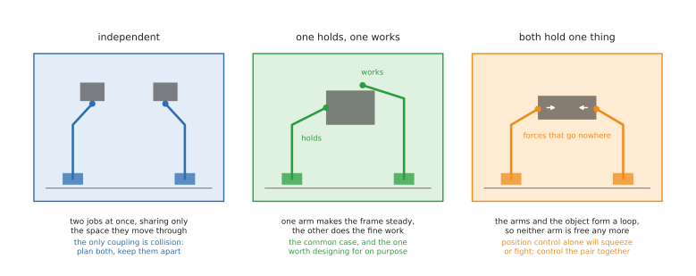
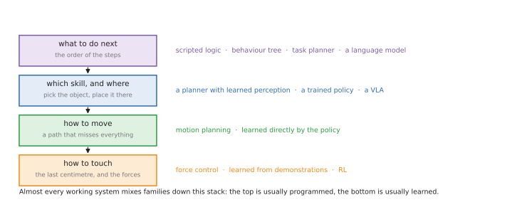
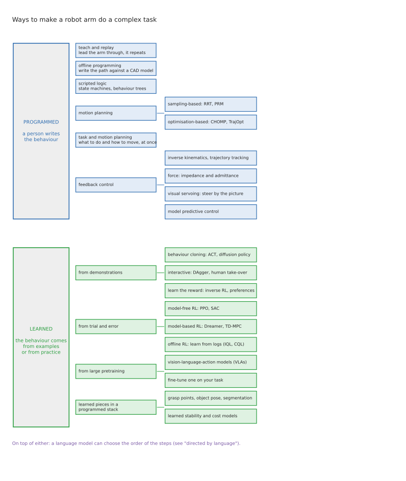
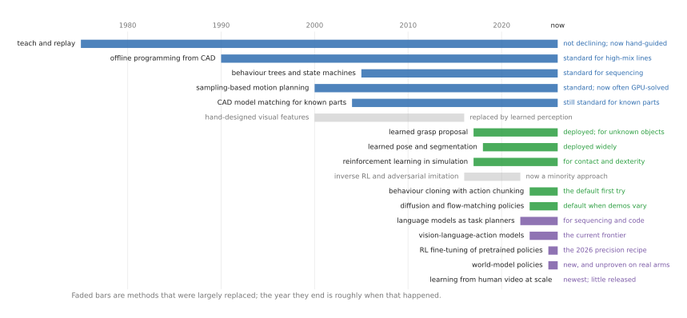

# Ways to programme or train two arms working together

One arm picks things up and puts them down. Two arms can do the things that
actually fill a working day: hold a garment open and fold it, steady a housing
while driving a screw into it, pass a part from one hand to the other to get a
better grip, carry something too big for one gripper. The moment you have two
arms the question stops being "how do I move the arm" and becomes "how do these
two get one job done between them" — and that is a genuinely different problem,
with its own failure modes and its own literature.

These three documents are a map of the ways people answer it. This one is the
map itself: what two arms are for, the jobs they are bought to do, the ways they
can be coordinated, and — once you know those — which method suits which task.
The other two take the methods one at a time.

**Who this is for.** Someone who can picture an arm moving and knows roughly what
a camera and a joint angle are, but who has not yet had to choose between these
approaches. You do not need to have used any of them.

**The short answer, before the long one.** The two families are *programming*,
where a person writes down what the arms should do, and *training*, where the
behaviour comes from examples or practice. Programming is precise, inspectable
and safe, and cannot cope with variety. Training copes with variety, needs a
great deal of data, and cannot tell you why it failed. Every serious system uses
both: it programmes the parts that are easy to say and trains the parts that are
not. With two arms there is a third decision on top — **which arm does what, and
how tightly the two must be tied together** — and it shapes everything else.

**A note on honesty.** Robotics is full of impressive demonstrations that are not
deployed anywhere, and unglamorous methods that run half the world's factories.
Two-arm work is worse than most for this, because a second arm doubles the cost
and the software difficulty, so the bar for using one in production is high and
much of the exciting work is research. Where a method is only a laboratory
result, this doc says so, and
[section 9](#9-what-is-current-and-what-is-fading) lists what was checked and
when.

## The three documents

**This document — the map.** Why two arms at all, the tasks, the three kinds of
coordination, and the grid saying which method suits which task. Read it first,
and possibly only.

**[Programmed methods](programmed-methods.md).** Behaviour a person writes down:
teaching, offline programming, behaviour trees, motion planning, task and motion
planning, and feedback control. This is what runs in factories today.

**[Learned methods](learned-methods.md).** Behaviour that comes from data:
imitation learning, reinforcement learning, large pretrained policies, learned
components inside a conventional system, and language models as planners. This is
where two-arm work is actually happening.

Each method in those two documents answers the same four questions: which tasks
it suits, **what changes when there are two arms instead of one**, what its status
is in 2026 — standard, fading, research-only or brand new — and which well-known
piece of open code to look at.

## Contents

1. [Why two arms, and when one is better](#1-why-two-arms-and-when-one-is-better)
2. [The tasks two arms are asked to do](#2-the-tasks-two-arms-are-asked-to-do)
3. [The five things that make a task hard](#3-the-five-things-that-make-a-task-hard)
4. [The three ways two arms can be coordinated](#4-the-three-ways-two-arms-can-be-coordinated)
5. [The layers of a two-arm system](#5-the-layers-of-a-two-arm-system)
6. [The family tree](#6-the-family-tree)
7. [Which method for which task](#7-which-method-for-which-task)
8. [The four worked examples](#8-the-four-worked-examples)
9. [What is current, and what is fading](#9-what-is-current-and-what-is-fading)
10. [What two arms cost you, method by method](#10-what-two-arms-cost-you-method-by-method)
11. [What real systems actually do](#11-what-real-systems-actually-do)
12. [Where this repo fits](#12-where-this-repo-fits)

---

## 1. Why two arms, and when one is better

Start with the question that decides whether any of the rest applies, because a
second arm is not free. It doubles the hardware, doubles the number of joints
some piece of software has to reason about, adds a collision problem that did not
exist before, and — as every method section below will show — makes almost
everything harder. It has to earn that.

**The cheap alternative is a fixture.** A jig, a vice or a clamp is a second hand
that costs a fraction of an arm, never drifts, needs no software, and cannot
collide with anything. Whenever the object is rigid, always the same shape, and
the job repeats often enough to justify making the jig, the sensible engineering
is a fixture and one arm. That is why most robots in factories work alone, and a
doc about two arms should say plainly that two arms are the exception.

Four things a fixture cannot do, and these are where a second arm earns its keep.

**The hold itself has to change during the task.** A fixture grips one way, once.
If the part must be turned over, re-seated, lifted to a new angle or held
differently at each stage, a fixture becomes a *sequence* of fixtures, which is a
machine nobody wants to build. A second arm is a grip that can move.

**The object has no fixed shape.** You cannot build a jig for a shirt. A garment,
a cable, a bag or a sheet takes whatever shape the places you hold it imply, so
holding it in two places is not a convenience — it is the only way to control what
shape it is in. This is the strongest single argument for two arms, and it is why
cloth is the flagship two-arm task.

**The grip has to change mid-task.** Picking something up in the orientation it
happens to be lying in, and then needing a different grip to use it, is extremely
common. With two arms you hand it over in mid-air. With one arm you put it down,
let go, and pick it up again — slower, and sometimes impossible, because the
object may not sit stably in any orientation you can then pick up from.

**Two things must be true at the same moment.** Keeping a cable in tension while
routing it into a clip; holding a lid down while driving the screw that fixes it;
supporting a stone while releasing it at exactly the right instant. No sequence of
one-arm motions is equivalent to two constraints holding simultaneously.

If your task needs none of those four, use one arm and a fixture, and read the
rest of this doc for the method families rather than for the second arm.

## 2. The tasks two arms are asked to do

Here is a spread of real jobs where two arms are the right answer, in four groups
ordered by how much is known in advance. That ordering is not arbitrary: it is
the single best predictor of which method you will end up using. Every row says
**what the second arm is actually for**, because if you cannot answer that for
your own task, the honest conclusion is that you do not need it.

### Where one arm is enough, and two would be waste

Before the four groups, the exclusion. Spot and arc welding, machine tending,
palletising, painting and dispensing, polishing a fixtured part, moving tubes
between laboratory instruments: in all of these the work is held by a jig, the
geometry is known from a drawing, and the job is to be accurate and fast a
million times. There is nothing for a second arm to hold that a fixture is not
already holding better. These tasks are the bulk of installed industrial robots
and they are solved, by the [programmed methods](programmed-methods.md),
and nothing in the rest of this document improves on that. Where two of these
arms do appear near each other, they are usually two independent robots sharing a
cell rather than two arms cooperating on one part.

### Group A: the parts are known, but the fit decides everything

You have the drawings and the parts arrive in feeders, yet the job still fails,
because success is settled in the last millimetre by contact rather than by
position. **This is where most industrial difficulty lives**, and where a second
arm replaces a fixture that would have to keep changing its grip.

| Task | What the two arms do | What makes it hard |
| --- | --- | --- |
| **Screwdriving and packing an assembly** | one arm holds the housing and re-angles it for each fastener; the other picks screws and drives them, then both place the finished unit in its packaging | the tolerance is tighter than the arm's repeatability; twenty steps must all succeed; and the holding arm must not give way when the driving arm pushes |
| **Connector and harness insertion** | one arm holds the cable or connector, the other presents the socket or supports the board | clearances under a millimetre, the contact hidden from view, and now *both* ends of the mating pair can move |
| **Kitting and packing** | one holds the carton open or steadies the tray, the other places items into it | many small motions, items starting in different places, and a container that will not stay open by itself |

### Group B: the objects are known, but their arrangement is not

The catalogue is fixed, or nearly so, but nothing is where you left it. This is
the class that learned perception unlocked, and where machine learning is
genuinely in production today — though usually with one arm doing the picking.

| Task | What the two arms do | What makes it hard |
| --- | --- | --- |
| **Bin picking that needs a re-grip** | one arm extracts the part however it can be reached, then hands it to the other, which takes the grip the next step actually needs | clutter and occlusion, plus a handover in mid-air between two moving grippers |
| **Unloading a dishwasher or a crate** | one holds the rack, door or crate steady, the other lifts items out | clutter, fragility, many steps, and a container that moves if you pull against it |
| **Assembling two parts brought together** | each arm holds one part and they are mated in mid-air, with no fixture at all | the accuracy of two arms relative to *each other*, which is worse than either arm's own repeatability |

### Group C: the object itself has no fixed shape

The object's shape is decided by where you hold it. This group is the reason
two-arm manipulation is a research field rather than a footnote.

| Task | What the two arms do | What makes it hard |
| --- | --- | --- |
| **Laundry folding** | both arms grip the garment; lifting, shaking, flattening and folding are all done by moving the two grip points relative to each other | a cloth has effectively infinite configurations, it changes shape as you grip it, and most of it is hidden under itself |
| **Cable and harness routing** | one arm keeps the cable in tension and feeds it, the other seats it into each clip along the route | the cable moves while you work, tension is invisible, and the task is long, so failures compound |
| **Bag and container handling** | one holds the bag open, the other puts things in | a bag has no shape of its own and closes the moment you let go |

### Group D: the geometry is unknown and physics decides the outcome

The hardest class, and the one this repo's worked example lives in.

| Task | What the two arms do | What makes it hard |
| --- | --- | --- |
| **Stacking irregular stones** | one arm steadies the tower or holds the stone level while the other adjusts and lets go | no model of the object, and success is only known a second after both grippers release |
| **Building from rubble or scrap** | one supports a piece while the other wedges the next in against it | every piece differs, errors accumulate upwards, and support must be released gradually |

---

## 3. The five things that make a task hard

Five properties do most of the work in those tables. Placing a new task on these
five tells you more about which method you need than any amount of reading about
methods.

**How much is known in advance.** Fixtures, drawings and a fixed catalogue of
parts at one end; a jumbled bin or a rough stone at the other. Programmed
methods need this knowledge, and are excellent when it exists.

**How much of the job is contact.** Moving through free space is well understood
and easy to plan. Deciding what to do while pressing one object against another
is neither, because the outcome depends on friction and on contacts you cannot
see. Insertion, polishing, folding and stacking are contact tasks; welding and
palletising are not.

**How many steps, and whether order matters.** Driving one screw is a single
skill. Assembling and packing a component is twenty steps, where step four
quietly ruins step nine. Long tasks need something that keeps track and can
recover.

**How tight the tolerance is.** An arm that repeats to a tenth of a millimetre
still cannot reliably seat a connector with a fifty-micron clearance by position
alone. Once the tolerance is tighter than the accuracy you can achieve, the task
stops being about geometry and becomes about feedback.

**What a failure costs.** Failing to place a stone costs a retry; scratching a
car body costs a great deal. Tasks where failure is cheap and repeatable can be
learned by practice; tasks where it is not must be verified before they run.

---

## 4. The three ways two arms can be coordinated

Two arms can share a job loosely or tightly, and how tightly is the single most
important design decision you will make. It determines whether you can treat the
arms as two ordinary robots that happen to be near each other, or whether you need
software that thinks of them as one machine.

**Independent.** The arms do separate things at the same time — one loads the next
part while the other finishes the last. Nothing but the shared workspace connects
them. This is the easy case: you can use ordinary single-arm methods twice over,
and the only new problem is making sure they do not hit each other. If your task
can be arranged this way, arrange it this way.

**One holds, one works.** One arm grips the workpiece and holds it steady, or
presents it at a convenient angle; the other does the fine work on it. The two
arms have different roles, and the roles are not interchangeable — the holding arm
needs to be stiff and stay put, the working arm needs to be precise and compliant.
This is the most common useful pattern, it covers most of the tasks in [section 2](#2-the-tasks-two-arms-are-asked-to-do),
and it mirrors what people do without thinking: your off hand holds the jar while
your other hand turns the lid. The coupling is real but mild — the working arm
needs to know where the holding arm put things, and the holding arm must not give
way — so the two can still be controlled largely separately.

**Both hold one thing.** Both grippers grip the same rigid object, and now the
arms, the object and the table form a closed loop. This is the case that breaks
ordinary software. If you command each arm to a position independently and the two
commands disagree by even a millimetre, the arms do not split the difference: they
fight, squeezing or stretching the object between them with forces that can be
enormous and that no camera will show you. The object's position is over-specified,
and something has to give — the object, the grippers, or the arms. Handling this
properly means controlling the pair as one system, usually by commanding the
*object's* motion and the squeeze separately, so that the grip force is something
you choose rather than something that emerges from a disagreement.

There is a fourth case that is really a transition between the others: the
**handover**, where an object passes from one gripper to the other. For a moment
both arms hold it, so you are briefly in the closed-chain case, and the difficulty
is concentrated in the instant of release — let go too early and it drops, too
late and the arms fight.

**The practical advice that follows** is to keep the coupling as loose as the task
permits. Arrange the task so the arms are independent where possible, use
hold-and-work where they must cooperate, and accept the closed-chain case only
where the object genuinely has to be carried or stretched by both — because
everything from motion planning to policy learning gets harder in that order.

## 5. The layers of a two-arm system

Underneath the vocabulary, two arms doing a real job answer five questions over
and over, and "which method" usually has a different answer at each. Four of them
a single arm also has to answer. The second one is the one two arms add.

Take the screwdriving-and-packing job from Group A. **What to do next** is the
sequence: fetch the housing, fit the board, drive four screws, clip the lid, put
it in the tray. **Which arm does what** is the new question: the left arm holds
the housing throughout and re-angles it between screws, the right arm does all the
picking and driving, and they swap only when the finished unit is lifted into its
box. **Which skill, and where** turns "drive a screw" into this screw, from this
feeder, into that hole. **How to move** is now two paths that must miss the
fixture, the workpiece, and each other. **How to touch** is the part that actually
decides whether it works: engaging the thread without cross-threading, knowing
from the torque when it is seated — and, in the holding arm, resisting the push
without letting the part shift.

The new layer is worth dwelling on, because it is the one people skip. **Role
assignment is almost always written by hand**, and in a well-designed system it is
written once and never changes: this arm holds, that arm works. Fixing the roles
in advance costs you some flexibility and buys an enormous simplification, because
each arm can then be given a single job that a single-arm method already solves. A
system that decides dynamically which arm should do the next step is more capable
and much harder to build, and outside research it is rare.

In practice the top two layers are nearly always programmed, because a person can
write the sequence and the roles down in a morning, and the bottom layer is
increasingly learned, because nobody can write down what to do in the last
millimetre though they can demonstrate it. The middle layers are contested, and
that contest is most of current robotics research.

Several methods below only ever answer one of the five questions. Comparing a
motion planner with a vision-language-action model is comparing a wheel with a
car.

---

## 6. The family tree

The first split is the one from the introduction: behaviour a person writes,
against behaviour that comes from data. Within the programmed family the
branches run from replaying a recorded motion, through computing motions from a
model, to planning what to do and how to move together. Within the learned
family they are divided by **where the learning signal comes from**: a person's
demonstrations, the robot's own practice, or a large pool of data gathered
elsewhere.

One branch deserves attention up front because it is the quiet workhorse:
*learned pieces inside a programmed system*. Most deployed robots that use
machine learning at all use it that way — a conventional system with one network
doing the perception — rather than the end-to-end approach that gets the
attention.

---

---

## 7. Which method for which task

The direct answer to "is this the right method for this task". Read a row to plan
a system; read a column to see where a method earns its keep.

**★** the usual choice today · **✓** used, and works · **~** emerging, or used in
part · **–** not used

The second column is the coordination type from
[section 4](#4-the-three-ways-two-arms-can-be-coordinated) — **ind** independent,
**hold** one holds while one works, **chain** both hold the same object — because
it predicts the rest of the row better than anything else does.

| Task | Coord. | Teach / offline | Motion planning | Force control | Learned perception | Imitation | RL in sim | Real-robot RL | VLA | Language planner |
| --- | --- | --- | --- | --- | --- | --- | --- | --- | --- | --- |
| **A. Screwdriving and packing** | hold | ★ | ✓ | ★ | ✓ | ~ | ~ | ~ | – | – |
| **A. Connector / harness insertion** | hold | ✓ | ✓ | ★ | ✓ | ✓ | ★ | ★ | ~ | – |
| **A. Kitting and packing** | hold | ✓ | ★ | ~ | ★ | ~ | – | – | ~ | ~ |
| **B. Bin picking with a re-grip** | chain | – | ★ | ✓ | ★ | ~ | ~ | – | ~ | – |
| **B. Unloading a dishwasher or crate** | hold | – | ✓ | ✓ | ✓ | ★ | – | – | ★ | ✓ |
| **B. Mating two held parts** | chain | ~ | ✓ | ★ | ✓ | ✓ | ★ | ★ | ~ | – |
| **C. Laundry folding** | chain | – | ~ | ✓ | ✓ | ★ | ~ | ~ | ★ | ~ |
| **C. Cable and harness routing** | hold | ~ | ✓ | ★ | ✓ | ★ | ~ | ~ | ~ | – |
| **C. Bag and container handling** | hold | – | ✓ | ✓ | ★ | ★ | – | – | ✓ | ~ |
| **D. Stacking irregular stones** | hold | – | ★ | ★ | ✓ | ~ | ~ | ~ | – | ~ |
| **D. Building from rubble** | hold | – | ★ | ✓ | ✓ | ~ | ~ | – | – | ~ |

Four things fall out of the grid.

**Force control is the one column that is never empty.** Whatever else you use,
two arms working on one object means loads passing between them, and something
has to manage that. If you take one thing from this document, take that.

**Group A is where the two families meet.** Force control does the work today,
learned methods are arriving specifically for the precise phase, and the 2026
approach — demonstrations to get the shape of the task, then a short burst of
reinforcement learning to make it reliable — was demonstrated on exactly these
jobs. This is the group to watch if you care about manufacturing.

**Groups C and D cannot be done any other way.** There is no CAD model of a shirt,
and no published system folds laundry by planning. Where the object's shape is
decided by where the two arms hold it, learning is not an improvement but the only
option.

**The "chain" rows are the hard ones, and the pattern is visible.** Where both
arms hold the same object, teaching and offline programming drop out entirely,
force control becomes essential, and the learned methods take over. That is the
whole argument of this document in one column.

---

## 8. The four worked examples

Four concrete jobs, answered directly — including one where the right answer is
not to use two arms at all.

**Picking screws, fitting parts, screwing, and packing the component** — the
known-environment assembly job, and a clear *hold-and-work* task: the left arm
holds the housing and re-angles it, the right arm picks and drives. Programme
almost all of it: the sequence and the role assignment as a behaviour tree, the
motions offline against the CAD model, and the screwdriving with torque and force
control, which is what actually decides success. Make the holding arm stiff and
the driving arm compliant, and do not let the holding arm run position control
against the push. Add learned perception only if the parts arrive unfixtured, and
consider a learned policy
only for a step that keeps failing on contact — cross-threading, or a connector
that will not seat — and then the modern recipe is demonstrations followed by a
short reinforcement-learning burst on the real robot rather than a policy for the
whole job. A single policy trained end to end for twenty steps is the wrong shape,
and there is evidence rather than just intuition behind that: on a benchmark of
real furniture assembly, end-to-end learned policies complete none of the full
assemblies except the very simplest. The sequence is free to write and expensive
to learn.

There is one genuinely deployed learned product in this class worth knowing about.
Micropsi's MIRAI is trained by demonstration over a few days, needs no CAD model
and no camera calibration, runs on ordinary industrial and collaborative arms, and
adjusts the path in real time from camera images; its published customers include a
turbine maker, an appliance maker and a screwdriving-equipment manufacturer. The
detail that makes it instructive is that it can train and run most skills **without
a force-torque sensor** — so what it learned is how to absorb positional variance
and remove fixturing, not how to handle contact. The contact is still force
control underneath. That is a fair summary of where learning has genuinely reached
the factory floor for this task.

**Laundry folding** — the task that justifies two arms more clearly than any
other, because the garment's shape *is* the relation between the two grip points.
Nothing programmed will do this, because there is no model of the object. The
demonstrated approach is a large pretrained policy fine-tuned
on many demonstrations and then improved by practice on the robot, and the
best-reported systems are all closed. The open ones are genuinely usable though:
the winning entry of a 2026 garment-folding competition released its code and
checkpoints, having built on the open π₀.₅ and added a reinforcement-learning
loop over roughly twelve thousand practice episodes, and at least one open
specialist policy reports over 90% on real shirts, skirts, trousers and towels.
Worth knowing as a counterweight: a 2022 system built the classical way —
perception plus planning, with the fold lines given to it — reported 93% success
at thirty to forty folds an hour from a crumpled start. Nobody has run the two
approaches against each other on the same garments, so "learning won here" is the
direction of travel rather than a measured result.

**Welding on an assembly line** — the worked example where the answer is **use one
arm**. The part is in a jig, the seam is on the drawing, and there is nothing for
a second arm to hold that the jig is not already holding more rigidly and more
cheaply. If you catch yourself designing a two-arm welding cell, check whether you
are solving a fixturing problem with software. Teach or offline-programme it: this
has been solved since the 1980s, and the interesting engineering is in fixtures,
seam tracking and cycle time rather than in method choice. The major
vendors' arc-welding products list no machine learning at all; variation is
handled by through-arc and laser seam tracking, which are sensing rather than
learning. The one genuinely AI-forward direction is scan-to-weld — generate the
path from a scan of the actual part, with no CAD and no teaching — and even there
the honest vendors describe themselves as looking for integrators rather than as
deployed at scale.

**Placing rocks one on top of another.** The
[stone stacking doc](../stone-stacking.md) works this through in full. Short
version: the choice of where to place is best answered by searching candidate
poses in a physics engine rather than by learning; the perception — turning rough
stones into shapes — is best learned; and the placement and release want force
control, with a learned policy as a reasonable option for that last centimetre.

The two-arm question here is worth asking carefully, because the honest answer is
that the second arm is a *convenience* rather than a necessity: a stone can be
placed by one arm, and the second arm earns its place by steadying the stack while
the first lets go, and by holding a stone level while it is turned to find the
face that will sit. That makes it hold-and-work, with a brief closed chain during
the release. If you are building this to learn from, note that you could do a
simpler version with one arm — and that the interesting part, knowing when it is
safe to let go, is the part the second arm changes most.

This is the one task on the list where the classical approach is still clearly
ahead, and the evidence is large. An ETH Zurich team put this pipeline on an
autonomous walking excavator and built a **six-metre-high, sixty-five-metre-long
dry-stone wall** out of boulders and demolition debris found on the site: scan
each stone, estimate its weight and centre of gravity, search for a placement,
plan, place. No learned policy anywhere. Learning is only now arriving — a 2026
result used a physics-guided diffusion model to choose placements and reported
being both more robust to disturbance and faster than the geometric method — but
that one is simulation-only with no code released. If you want to stack irregular
objects today, search over scanned geometry.

---

## 9. What is current, and what is fading

Methods rarely die of old age; they are displaced by something that needs less of
what is expensive. This chart is a rough guide to when each became common and
which are now on the way out.

**Clearly superseded, with the evidence.** Isaac Gym, the GPU simulator behind
many reinforcement learning papers, is marked legacy by NVIDIA and its example
repository is archived; Isaac Lab replaced it. The D4RL benchmark suite that
offline reinforcement learning was measured on was formally deprecated in favour
of Minari, and its canonical baseline implementations are archived. SERL was
deprecated by its own authors in favour of HIL-SERL. RT-1 is archived and RT-2
never released code. OpenAI Gym was archived in favour of Gymnasium, and ROS 1
reached end of life in May 2025. Hand-designed visual features were displaced by
learned perception a decade ago, and computing grasps from CAD models has been
displaced **for mixed-item picking** by learned grasp proposal — though not for
known parts, where model matching is still the standard product and the right
engineering choice.

**Quietly fading rather than deprecated.** Several important repositories have
simply stopped: the original ACT implementation has had no commits since 2024,
diffusion_policy since late 2024, Octo since mid-2024, and OpenVLA since March
2025. None carries a deprecation notice. The work moved into LeRobot, which is
where those methods now live and are maintained. The same has happened to the
classical grasping repositories — Contact-GraspNet, the GraspNet baseline,
Dex-Net and `gqcnn` are all quiet or dead — and to PyBullet, which has an enormous
tutorial legacy and about one commit a year. On the industrial side, the
ROS-Industrial vendor drivers for FANUC, Motoman, ABB and KUKA are all dormant
ROS 1 code, and there is **no maintained open-source ROS 2 driver for FANUC or
Motoman at all**, which is a genuine gap rather than an oversight. The calibration
tool most tutorials still recommend, `moveit_calibration`, has had no commits in
a year; use `industrial_calibration` or OpenCV's hand-eye function directly.

**Used less than its reputation suggests.** Task and motion planning remains
largely a research technique. Inverse reinforcement learning and adversarial
imitation are a minority approach for arms, and their main open library has been
untouched since early 2025 — though surveys still treat the family as live, so
"declining" is fairer than "dead".

**The newest things, which a doc written in 2024 would miss entirely.**
Reinforcement learning used to sharpen an already-trained policy rather than to
train one from scratch. World-model policies, which learn to predict what will
happen and act through that prediction, now a first-class category in LeRobot but
not yet proven on production arms. Training on large amounts of ordinary human
video rather than robot demonstrations, where the scaling behaviour looks
promising and almost nothing has been released. Verification at run time — trying
several candidate actions and checking them — where at least one 2026 result
claims that scaling the checking beats scaling the policy. And tactile
foundation models, trained across many different touch sensors at once.

Treat that last paragraph as a weather report rather than a forecast: these are
months old, mostly unreleased, and several will not survive contact with real
deployments.

---

## 10. What two arms cost you, method by method

Eight families on twenty points. The middle block is the one to read if you only
read one: it is what the *second* arm adds to each method's bill, which is the
question this whole document exists to answer.

**How to read it.** Rows 1 to 7 are what a method demands before it will work at
all, and they apply whether you have one arm or two. Rows 8 to 13 are what the
second arm adds. Rows 14 to 20 are what you get back. "Somewhat" means it copes
with variation of a kind it has seen but not with a new kind; "deployed widely"
means you can buy it, "research" means you would build it from papers.

**What the method asks of you in the first place**

| | Teach & replay | Offline prog. + planner | TAMP | Classical control | Imitation | RL (sim → real) | VLA fine-tune | Learned pieces in a classical stack |
| --- | --- | --- | --- | --- | --- | --- | --- | --- |
| **1. What you must supply** | the motion | a CAD model | symbolic rules + geometry | a model of the robot | demonstrations | a reward | demonstrations | labelled data, or a ready model |
| **2. Robot model needed** | no | yes | yes | yes | no | yes, for the simulator | no | no |
| **3. Simulator needed** | no | helpful | helpful | helpful | no | yes, in practice | no | no |
| **4. Training compute** | none | none | none | none | hours on one GPU | days, many GPUs | hours to days | hours |
| **5. Compute when running** | trivial | milliseconds to seconds | seconds or more | trivial | one network pass | one network pass | a large network pass | one network pass |
| **6. Time to something working** | hours | days | weeks | days | weeks | weeks to months | days, if a checkpoint fits | days |
| **7. Who has to be skilled** | an operator | a robot programmer | a researcher | a control engineer | anyone who can do the task | an RL practitioner | an ML engineer | an ML engineer |

**What the second arm adds**

| | Teach & replay | Offline prog. + planner | TAMP | Classical control | Imitation | RL (sim → real) | VLA fine-tune | Learned pieces in a classical stack |
| --- | --- | --- | --- | --- | --- | --- | --- | --- |
| **8. Extra work for the second arm** | teach both, then insert the waits | model both arms, check arm against arm | the search grows sharply | a coordinated controller, written once | collect two-arm demonstrations; the algorithm is unchanged | exploration gets much harder | none worth naming | choose which arm takes which grasp |
| **9. Demonstrations needed** | one per arm, by hand | none | none | none | 50–1000+, and harder to record | none | 10–500, and harder to record | none |
| **10. Handles *independent* arms** | yes | yes | yes | yes | yes | yes | yes | yes |
| **11. Handles *one holds, one works*** | yes, with waits | yes | yes | yes, and needs two different stiffnesses | yes, naturally | yes | yes | yes |
| **12. Handles *both hold one object*** | no | no | rarely | **yes — this is its job** | yes, learned implicitly from demos | yes, in simulation | yes | not applicable |
| **13. How the arms stay in step** | explicit waits you write | synchronisation points in the programme | the planner schedules both | one controller commanding the pair | one policy predicts both arms at once | a shared reward | one policy predicts both arms | your own code decides |

**What you get back**

| | Teach & replay | Offline prog. + planner | TAMP | Classical control | Imitation | RL (sim → real) | VLA fine-tune | Learned pieces in a classical stack |
| --- | --- | --- | --- | --- | --- | --- | --- | --- |
| **14. Objects it has never seen** | no | no | limited | no | somewhat | somewhat | best of these | yes, that is the point |
| **15. Contact-rich work** | poor | poor | poor | good | good | good | good | not applicable |
| **16. Long multi-step tasks** | yes, if nothing varies | yes | yes, by design | no | poor | poor | improving | not applicable |
| **17. Can you see why it failed** | yes | yes | yes | yes | no | no | no | partly |
| **18. Can it be verified for safety** | yes | yes | mostly | yes | weak | weak | weak | inherits the stack's |
| **19. Industrial maturity in 2026** | decades | decades | research | decades | early deployment | niche | early | deployed widely |
| **20. Typical two-arm failure** | the arms collide, or a wait is in the wrong place | the model differed from reality, now twice over | no plan found, or too slow | the pair fight and crush what they hold | the arms drift out of step and drop it | never discovers the coordinated behaviour at all | confidently wrong with both arms at once | the wrong arm was given the grasp |

Read row 12 down the table and the shape of the field appears: the closed-chain
case — both arms holding one object — is handled by exactly two things, a
coordinated controller written by an engineer, or a policy that learned it from
demonstrations. Everything in between is silent on it. Then read rows 17 and 19
together for the familiar trade: the methods you can debug are the ones industry
adopted, because a factory must know why a machine stopped, and the methods that
cope with novelty and contact are the learned ones, which is where the unsolved
tasks are.

---

## 11. What real systems actually do

Almost nothing real uses one method. A few worth understanding properly — and
note the second column of the table, because the pattern in it is the honest
summary of this whole document: **the deployed systems are single-arm, and the
two-arm systems are the learned ones.** Nobody has put a two-armed robot into
production doing coordinated work by programming it, and nobody has needed to,
because the tasks that justify two arms are exactly the tasks that resist being
written down.

**ALOHA with ACT** is the two-arm reference point. Two arms, a pair of leader arms
for a person to drive them with, fifty demonstrations, one policy that outputs
both arms' commands, and no model of anything. It is the counter-example to most
of this document: sometimes copying really is enough, and the fact that it works
at all on two arms is why the field went in this direction.

**A modern bin-picking cell** is a classical system with one learned component.
Planning, collision checking and gripper logic are conventional code; a network
proposes grasps. The objects vary so perception must generalise; the motion does
not, so it stays verifiable. Amazon's published account of its item-stowing
system, with the learned and classical parts listed separately, is the best
worked example of this split anyone has released.

**MIT's Jenga robot** inverts the usual assumption about what to learn. The
strategy and the controller are conventional; what is learned is a model of how
the block responds to being pushed, from vision and force together — the part
nobody can write down.

**MimicGen and its two-arm successor DexMimicGen** use programming to
*manufacture the data that training needs*: a classical routine turns a handful
of demonstrations into thousands by re-composing them around the objects'
positions, and a policy is then trained on that.

**SayCan** pairs a language model with learned skills, and the contribution is
the pairing. The model knows a spill needs a sponge; it has no idea whether the
robot can reach the sponge. Each skill carries a learned estimate of its own
chance of success, and the step chosen must be both sensible and feasible.

**Figure's Helix** splits by speed: a vision-language model at 7–9 Hz to
understand the scene, and a separate visuomotor policy at 200 Hz to move.
Thinking and reacting have different timescales, so they are different models.

| System | Arms | Programmed part | Learned part | Why the split falls there |
| --- | --- | --- | --- | --- |
| Typical industrial cell | one | taught or offline path, force control on insertion | often nothing | nothing varies, so learning buys little and costs verification |
| Bin picking, modern | one | planning, collision checking, gripper logic | grasp proposals, segmentation | objects vary, motions do not |
| [Amazon item stowing](https://arxiv.org/abs/2505.04572) | one | motion planning, grasp planning, force control, a library of named primitives | depth, segmentation, product identity, risk and free-space scoring | 500,000 real stows; 85.86% success; the split is stated by the authors |
| [Micropsi MIRAI](https://www.micropsi-industries.com/) | one | the force control underneath | a visuomotor skill trained by demonstration in days | learning removes positional variance; force control still handles contact |
| [ETH HEAP dry-stone wall](https://ethz.ch/en/news-and-events/eth-news/news/2023/11/autonomous-excavator-constructs-a-six-metre-high-dry-stone-wall.html) | one, on an excavator | all of it: scan, estimate mass, search poses, plan, place | nothing | a 6 m × 65 m wall from found boulders, with no learned policy anywhere |
| [MIT Jenga](https://news.mit.edu/2019/robot-jenga-0130) | one | strategy and control | a model of contact, from vision and force | contact is what cannot be written down |
| [MimicGen](https://mimicgen.github.io/) / [DexMimicGen](https://dexmimicgen.github.io) | two, in the successor | the routine that multiplies demonstrations | the final policy, by imitation | programming manufactures the data training needs |
| [RoboTwin 2.0](https://github.com/RoboTwin-Platform/RoboTwin) | two | expert data generation, randomisation, evaluation | the policies under test | the benchmark is programmed, the subject is learned |
| [SayCan](https://say-can.github.io/) | one | the skill interfaces | the planner, the skills, and the feasibility estimates | the planner must know what is possible |
| [Code as Policies](https://code-as-policies.github.io/) | one | perception and control functions | a language model writes the glue | composition is language-shaped, primitives are not |
| [OpenAI's cube-solving hand](https://arxiv.org/abs/1910.07113) | one hand | the cube solver, a classical algorithm | in-hand finger motion, RL in simulation with heavy randomisation | solving the cube was solved; moving fingers was not |
| [HIL-SERL](https://hil-serl.github.io/) | one | safety limits, resets, the controller underneath | RL on the real robot, with human take-overs | real contact cannot be simulated well enough |
| [Figure's Helix](https://www.figure.ai/news/helix) | two | the low-level stack | a VLM at 7–9 Hz, a visuomotor policy at 200 Hz | thinking and reacting run at different rates |
| [TRI's Large Behavior Models](https://toyotaresearchinstitute.github.io/lbm1/) | two | data collection and evaluation | one diffusion model pretrained on ~1,700 hours, fine-tuned per task | pretraining reportedly cuts the data a new task needs several-fold |
| [ALOHA / ACT](https://tonyzhaozh.github.io/aloha/) | two | almost nothing above the controller | the entire task, from 50 demonstrations | the counter-example: sometimes copying is enough |

---

## 12. Where this repo fits

Nearly everything here sits in the programmed family, deliberately: the learned
methods are easier to understand once you know what they replace, and the pieces
they assume — frames, transforms, depth pictures, message passing — are the same
either way.

- [ROS basics](../ros/ros-basics.md) is the plumbing every method above runs on.
- [The arm area](../arm/overview.md) covers frames, transforms and kinematics:
  the model classical methods need explicitly and learned ones absorb implicitly.
- [The camera area](../camera/basics.md) and
  [finding objects](../camera/finding-objects.md) show a classical perception
  pipeline and a trained model doing the same job, which is the smallest clear
  illustration of the trade this whole doc is about.
- [Two-arm manipulation](../two-arm-manipulation.md) lists the open projects for
  the learned family, in five steps.
- [Stone stacking](../stone-stacking.md) and
  [full training](../full-training/overview.md) take one task and work it through
  the programmed way and then the trained way.

**How to read the numbers in this doc.** Robotics reporting is unusually
unreliable, so it is worth knowing which claims here carry weight. The strongest
are peer-reviewed with the trial counts published: the 100% insertion results from
one to two and a half hours of real-robot practice, the 85.86% over a hundred
thousand real stows, the sixty-five-metre dry-stone wall, the benchmark showing
end-to-end policies failing at furniture assembly, and the evaluation across 1,800
real rollouts whose authors warn that much of the field is measuring noise.
Weaker, and marked as such above, are company blog posts — every "2× throughput"
and "99% accuracy" in this area is self-reported, usually without a denominator.
And at least one very widely repeated statistic, the claim that over 90% of
industrial robots are teach-pendant programmed, traces to a single undated page
that no longer exists; it is not used here.

**What was checked, and when.** The repository statistics, licences and activity
dates in this doc were read from the GitHub API on 19 September 2026, and the
deprecation claims come from the projects' own notices rather than from
summaries. None of the external systems described here were run in this repo; the
links go to the people who built them. Everything inside the repo has been run,
and each doc says so. Project lists go stale quickly — before relying on anything
here, check the licence and the last commit date yourself.
