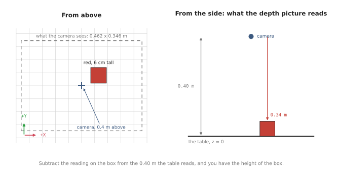
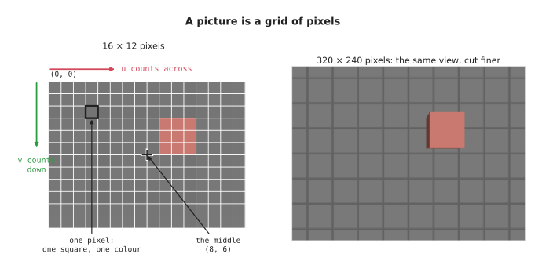
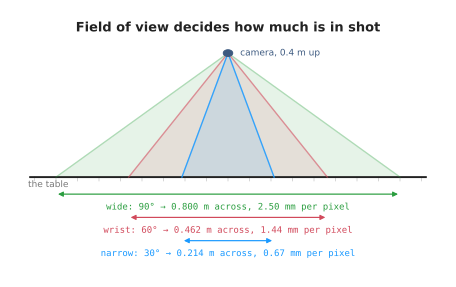
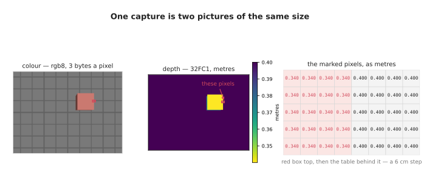
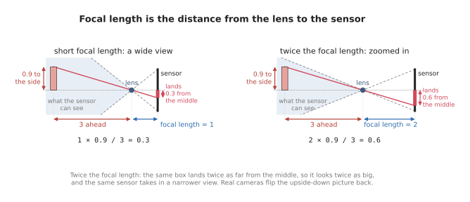
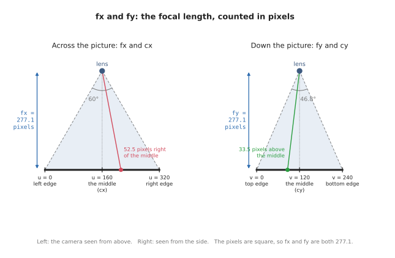
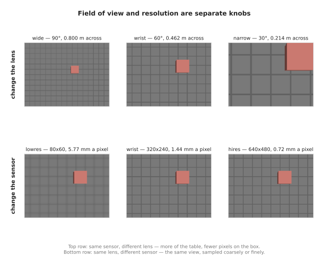

# Cameras: the basics

A robot arm that has to pick something up first has to find it, and the usual
way to find things is with a camera. This doc explains how a camera works,
starting from nothing: what it records, what it loses, how a depth camera gets
the lost part back, and the four numbers that describe a lens. The
[one-box doc](one-box-intro.md) then uses these basics to find a box on a table and
measure it.

Every idea here is shown on one example, which the one-box doc uses too. A red
box, a 6 cm cube, stands on a table, and a depth camera hangs 40 cm above the
middle of the table, looking straight down. The table, the box and the camera
are simulated in Gazebo, a robot simulator, so every picture in this doc is a
real capture from that camera rather than a drawing.



## Contents

1. [What a camera is for](#1-what-a-camera-is-for)
2. [How a camera makes a picture](#2-how-a-camera-makes-a-picture)
   · [A grid of pixels](#a-grid-of-pixels)
   · [Resolution: how many pixels](#resolution-how-many-pixels)
   · [Field of view: how wide it sees](#field-of-view-how-wide-it-sees)
3. [What a picture loses](#3-what-a-picture-loses)
4. [Getting distance back: the depth picture](#4-getting-distance-back-the-depth-picture)
   · [Where the 76,800 readings land](#where-the-76800-readings-land)
   · [Depth is not distance](#depth-is-not-distance)
5. [The cameras used in these docs](#5-the-cameras-used-in-these-docs)
6. [The lens as four numbers](#6-the-lens-as-four-numbers)
   · [What focal length is](#what-focal-length-is)
   · [Why the focal length is counted in pixels](#why-the-focal-length-is-counted-in-pixels)
   · [fx and fy: across and down](#fx-and-fy-across-and-down)
   · [cx and cy: the middle of the picture](#cx-and-cy-the-middle-of-the-picture)
   · [The camera's own axes](#the-cameras-own-axes)
   · [Where 277 comes from](#where-277-comes-from)
7. [Field of view and resolution are separate knobs](#7-field-of-view-and-resolution-are-separate-knobs)
8. [Vocabulary](#8-vocabulary)

---

## 1. What a camera is for

A camera is good at one part of finding the box straight away: it can see what
is on the table. A photo of it shows a red box.

But an ordinary colour photo cannot finish the job. It can tell you that
something red is over there, in that direction. It cannot tell you how far away
it is — and without that, it cannot tell you where the box is, or how tall.

Sections 2 to 4 explain why, using nothing but what a camera physically does.
Sections 5 to 7 then describe the camera used here as numbers, and the
[one-box doc](one-box-intro.md) uses those numbers to get the missing information
back and measure the box.

---

## 2. How a camera makes a picture

A camera is a box with a lens at the front and a flat sensor at the back.

Light bounces off everything in the room. Some of it passes through the lens and
lands on the sensor. The sensor is covered in a grid of tiny light detectors, and
each one records the colour of the light that reached it.

That grid of recordings is the picture.

### A grid of pixels

Each detector gives one square of the picture, called a **pixel** — short for
*picture element*. A pixel holds one colour, and nothing else.



The left picture was taken with a camera only 16 pixels across and 12 down, so
you can see every square. The red box is just a few red squares.

Pixels are numbered from the **top-left** corner:

- `u` counts across, left to right
- `v` counts **down**, top to bottom

So `(0, 0)` is the top-left pixel. The downward `v` is easy to trip over, because
on a graph `y` goes up. In a picture, it goes down.

A pixel is a small square, not a point. Pixel `(3, 2)` covers the square from 3
to 4 across and from 2 to 3 down, so its middle is at `(3.5, 2.5)`. That half
pixel matters later.

### Resolution: how many pixels

**Resolution** is how many pixels a picture has, written width × height. The
camera in this doc is `320 × 240`: 320 across, 240 down, 76,800 pixels in all.

The right picture above is the same view at `320 × 240`. Nothing new came into
the shot. The same table was cut into many more, smaller squares, so the edges
come out sharp.

### Field of view: how wide it sees

**Field of view** is how many degrees across the camera takes in. It is set by
the lens.



A wide lens takes in more of the table. A narrow lens takes in less, as if
zoomed in. The camera in this doc sees 60° across. (The numbers under each lens
come back in section 7.)

Resolution and field of view are two separate things. One decides how much of
the world is in the picture. The other decides how finely it is cut up. That
difference matters a lot when choosing a camera, and section 7 shows why.

---

## 3. What a picture loses

Here is the most important fact about cameras.

**Every pixel looks out along one straight line.** Light reaching a pixel came
from somewhere along that line — and the pixel has no way of knowing where.


The picture shows three points on the same line out of the lens: one near, one
further, one further still. All three land on **the same pixel**. No camera could
tell them apart. (The formula at the bottom is explained in section 6.)

So a pixel does not tell you a place. It tells you a **direction**.

That is what people mean when they say a camera flattens the world. The world
has three dimensions. A picture has two. The one that gets thrown away is
distance.

That has everyday consequences:

- a big thing far away and a small thing close by can look exactly the same
- a colour picture cannot tell you how far away anything is
- so it cannot tell you where anything is, or how big

No clever code can fix this, because the distance was never recorded. The only
way out is to measure it separately.

---

## 4. Getting distance back: the depth picture

A **depth camera** measures the missing distance.

It takes a second picture, the same size as the colour one, through the same
lens, at the same moment. But instead of a colour, each pixel holds a
**distance, in metres**.

So you get **one depth reading for every pixel**. The camera in this doc is
320 × 240 pixels, so one depth picture holds **76,800 readings**. In this scene,
every one of the 76,800 came back with a number.

A camera that gives both pictures together is called **RGB-D**: red, green and
blue for the colour picture, plus D for depth.



Look at the numbers on the right. They are the depth readings for a small patch
of pixels at the edge of the red box. On the box they read `0.340` m. On the
table just behind it they read `0.400` m. (The labels `rgb8` and `32FC1` are the
names ROS gives these two pictures; the
[one-box doc](one-box-intro.md#13-what-one-capture-contains) explains them.)

That 6 cm jump is the red box. **No colour was needed to find it.** The depth
numbers alone say that something sticks up out of the table, and by how much.

### Where the 76,800 readings land

Here is where every reading landed, and what it read:

| Landed on | Readings | The top reads | Height above the table |
| --- | --- | --- | --- |
| the table | 74,176 | 0.400 m | — |
| the red box | 2,624 | 0.340 m | 0.060 m |
| **all of them** | **76,800** | | |

Most readings land on the table, and every one of those reads exactly `0.400` m.

The box gets 2,624 readings. Most of them land on its flat top, and all of those
read the same number: 2,352 readings of `0.340` m. The other 272 land on a thin
strip of the box's side, which the camera catches at its edge. They read a
little more, because the side is further down.

With only one box, finding its readings is easy: **anything that reads less than
the table's `0.400` must be the box.**

Subtract the box's top reading from the table's and you have its height:
`0.400 - 0.340 = 0.060` m, which is 6 cm. **That is half the job done**, from one
picture.

The other half is where the box is. With the two pictures together, each pixel
gives you a **direction** and a **distance**. A direction and a distance are
enough to pin down a point in 3D, and the [one-box doc](one-box-intro.md) turns that
into arithmetic.

### Depth is not distance

One detail catches almost everyone.

**Depth is measured straight ahead, along the way the camera points — not along
the slanted line from the lens to the point.**

That is why the table reads exactly `0.400` m *everywhere*, corners included.
The corners are clearly further from the lens than the middle is. But every
point on the table is 0.40 m *in front of* the camera, measured straight down.

Mix the two up and every point comes out slightly too far away, worst at the
edges of the picture. Getting it right also keeps the maths simple later: the
third coordinate of a point turns out to be just the depth reading.

---

## 5. The cameras used in these docs

With those ideas in place, we can describe the cameras these docs use. There
are two of them, and they have different jobs.

The first is a simulated camera, which takes every picture and gives every number
in these docs. It is a depth camera in Gazebo, a robot simulator, so we can put
it exactly where we want, and it gives both a colour picture and a depth picture
for every shot:

| What | Value | Meaning |
| --- | --- | --- |
| resolution | 320 × 240 | pixels across, pixels down |
| field of view | 60° across | how wide it sees |
| height | 0.40 m | how far above the table it hangs |
| pointing | straight down | at the middle of the table |

The table has a 5 cm grid printed on it, which makes it easy to see how much of
it is in shot. The picture is kept small on purpose: 76,800 pixels are few enough
that every number in these docs can be checked by hand, and every idea works the
same way with more pixels. The one-box project also has a basic 80 × 60 camera
in the same place, small enough to print every one of its pixels in a terminal.

The second is a real camera, the [Raspberry Pi Camera Module
2](https://www.raspberrypi.com/products/camera-module-v2/), which these docs use
whenever they show how things look on real hardware. It is a small, inexpensive
camera that is often fitted to hobby robots, and its maker publishes every
number we need in its [hardware
specifications](https://www.raspberrypi.com/documentation/accessories/camera.html#hardware-specification).
Its field of view across is 62.2°, which is very close to the simulated camera's
60°, so from the same height the two see almost the same patch of table. The big
difference is how finely they cut that patch up, because the real camera has
about 105 times as many pixels:

| What | Simulated camera | Raspberry Pi Camera Module 2 |
| --- | --- | --- |
| resolution | 320 × 240 (76,800 pixels) | 3280 × 2464 (about 8.1 million pixels) |
| field of view | 60° across, 46.8° down | 62.2° across, 48.8° down |
| depth picture | yes | no, colour only |

The last row matters. The Raspberry Pi camera only records colour, so on its own
it cannot measure how far away anything is, which is exactly what section 3
showed a colour picture loses. That makes it a good real example for everything
about the lens and the pixels, but a real robot doing the job in the one-box doc
would need a depth camera as well. Whenever these docs use the real camera, they
also say what that camera can and cannot do.

---

## 6. The lens as four numbers

To do arithmetic with a camera, we have to describe its lens and its sensor as
numbers, and it turns out that four numbers are enough. This section explains
what each of them means, starting with the one that needs the most background,
which is the focal length.

| Number | What it means | Here |
| --- | --- | --- |
| `fx`, `fy` | the **focal length**, counted in pixels: how far the sensor sits behind the lens, which decides how zoomed in the camera is | 277.1 |
| `cx`, `cy` | the middle of the picture, in pixels, where anything straight ahead lands | 160, 120 |

Together these four numbers are called the **intrinsics**, because they are
intrinsic to the camera, meaning that they are part of the device itself. They
do not change when the camera moves around the room, so a camera only has to
measure them once.

### What focal length is

Section 2 described a camera as a box with a lens at the front and a flat
sensor at the back. The **focal length** is the distance between those two: how
far behind the lens the sensor sits, when the camera is focused on something far
away. In the simplest camera of all, a pinhole camera, which is a dark box with a
tiny hole in one side, the focal length is simply the distance from the hole to
the back wall where the picture forms.

Real focal lengths are small, so they are measured in millimetres. A traditional
camera with a "50 mm lens" has its lens about 50 millimetres in front of the
film or the sensor. Small cameras have much shorter focal lengths than that, and
the Raspberry Pi camera from section 5 is a good example. Its [hardware
specifications](https://www.raspberrypi.com/documentation/accessories/camera.html#hardware-specification)
give its focal length as 3.04 mm, which means that its lens sits only 3.04
millimetres in front of its sensor.

The focal length matters because it decides how big things look in the picture.
Light from a point in the scene travels in a straight line through the lens and
lands on the sensor. When the sensor sits further behind the lens, that line has
further to travel after the lens, so it lands further from the middle of the
sensor. The diagram below shows the same box through two lenses. With twice the
focal length, the top of the box lands twice as far from the middle, so the box
looks twice as big. At the same time, the edges of the sensor now catch a
narrower range of directions, so the camera sees less of the scene. That is what
"zoomed in" means, and it is why a longer focal length always goes together with
a narrower field of view.



You may notice that the picture of the box lands upside down on the sensor. That
happens in every camera, because the lines of light cross over at the lens, and
the camera simply turns the picture the right way up before handing it over. The
other diagrams in this doc draw the picture in front of the lens instead, at the
same distance, where it is already the right way up. The triangles, and so the
numbers, are the same either way.

The rule for where a point lands comes from the same triangles as the diagram.
A point that is some distance to the side and some distance ahead lands on the
sensor at:

```
distance from the middle of the sensor = focal length × (distance to the side / distance ahead)
```

The arrows in the diagram mark every number in this rule. The top of the box is
0.9 to the side and 3 ahead, so a focal length of 1 puts it 1 × 0.9 / 3 = 0.3
from the middle, and a focal length of 2 puts it 2 × 0.9 / 3 = 0.6 from the
middle. Those are the two sums written under the two pictures.

### Why the focal length is counted in pixels

The rule above gives its answer in millimetres on the sensor, but a picture never
tells us millimetres. All we can read from a picture is which pixel something
landed on, such as "pixel 212 across", so the arithmetic we need has to connect a
direction in the room with a pixel number. The millimetres on the sensor are only
a step in between, and we never get to see them.

To turn millimetres on the sensor into pixels, we divide by the width of one
pixel. The Raspberry Pi camera's specifications give its pixel size as
1.12 µm × 1.12 µm, where µm stands for micrometres, which are thousandths of a
millimetre. So each pixel is 0.00112 millimetres wide, and a point that lands
1.12 millimetres from the middle of the sensor is 1,000 pixels from the middle of
the picture. We can do the same division to the focal length itself, and that
gives the focal length counted in pixels:

```
focal length in pixels = focal length in millimetres / width of one pixel in millimetres
                       = 3.04 / 0.00112
                       = 2,714 pixels
```

For this camera, the maker publishes both numbers, the focal length in
millimetres and the pixel size, in one table. For other cameras, the pixel size
is listed in the datasheet of the image sensor inside the camera, and it can also
be worked out by dividing the width of the sensor by the number of pixels across
it: the Raspberry Pi camera's sensor is 3.68 millimetres wide and 3,280 pixels
across, and 3.68 / 3,280 gives the same 0.00112 millimetres. Most cameras made for
robots skip all of this and report `fx` and `fy` directly, already counted in
pixels. A camera that does not report them can be measured instead, by taking
pictures of a printed checkerboard and letting a calibration tool work out `fx`
and `fy` from where its corners land.

With the focal length counted in pixels, the rule from the last part gives its
answer in pixels straight away, and that is exactly the form this doc uses:

```
pixels from the middle of the picture = fx × (distance to the side / distance ahead)
```

This is why the arithmetic only needs to know how many pixels from the middle a
given direction lands, and never needs the millimetres. The distance to the lens
and the size of a pixel never matter on their own, only the result of dividing
one by the other. Two cameras with different lenses and different pixels, but
with the same focal length in pixels, take exactly the same picture. So a single
number, in pixels, describes the lens and the sensor together, and it is the
number that a camera reports with every picture.

For the camera in this doc, `fx` is 277.1 pixels. This means that a point which
is 0.1 metres to the side for every metre ahead lands 0.1 × 277.1 = 27.7 pixels
from the middle of the picture. The spot on the red box that the [one-box
doc](one-box-intro.md#11-pixel-plus-depth-gives-back-the-point) measures is 0.1894
metres to the side for every metre ahead, so it lands 0.1894 × 277.1 = 52.5
pixels from the middle. Our camera is simulated, so it has no real lens in
millimetres at all. It is described directly in pixels, which is all the
arithmetic ever needs.

### fx and fy: across and down

The focal length is kept as two numbers because a picture has two directions.
`fx` is the focal length counted in pixel widths, and it is used for positions
across the picture, from left to right. `fy` is the focal length counted in pixel
heights, and it is used for positions down the picture, from top to bottom. The
diagram below shows both on the camera in this doc, first seen from above and
then seen from the side.



In the left half, the picture is 320 pixels wide and sits `fx` = 277.1 pixels in
front of the lens, and the lines from the lens to its two edges make the 60°
field of view. In the right half, the picture is 240 pixels tall and sits `fy` =
277.1 pixels in front of the lens. Because the picture is shorter than it is
wide, the field of view down the picture is only 46.8°. In both halves, the
coloured line is the line of sight to the spot on the red box, which lands 52.5
pixels to the right of the middle and 33.5 pixels above it.

`fx` and `fy` are the same here, and on nearly every camera, because pixels are
square, so a pixel's width and its height are the same. The Raspberry Pi camera
is one of them: its pixels are 1.12 µm by 1.12 µm, so its `fx` and its `fy` are
both 2,714 pixels. The two numbers are still kept separately because the ROS
message keeps them as two, and because a few cameras have pixels that are very
slightly taller than they are wide.

### cx and cy: the middle of the picture

The other two numbers, `cx` and `cy`, say where the middle of the picture is,
counted in pixels from the left edge and from the top edge. It is the pixel where
anything straight ahead of the lens lands, so every other position in the picture
is measured from there. Our picture is 320 by 240 pixels, so its middle is at
`cx = 160` and `cy = 120`, and the diagram above marks it under each picture. On
a real camera these two numbers are usually close to the exact middle but not
quite on it, because the sensor is never perfectly centred behind the lens, and
that is why they are measured and reported rather than assumed. For the Raspberry
Pi camera, the exact middle of its 3280 × 2464 picture is at pixel (1640, 1232),
and calibrating a real one would give numbers close to those, but not exactly
equal to them.

### The camera's own axes

To say where something is relative to the camera, we need the camera's own axes.
They are chosen to match the picture:

- **X** points right, the same way as `u`
- **Y** points **down**, the same way as `v`
- **Z** points straight ahead, out of the lens

With those axes, a point at `(x, y, z)` in front of the camera lands on this
pixel:

```
u = fx · (x / z) + cx
v = fy · (y / z) + cy
```

In words: how far to the side, **divided by how far ahead**, scaled up by the
focal length, then moved to the middle of the picture. It is the rule from the
last two parts, counted in pixels, with `cx` and `cy` added so that pixels are
counted from the edges of the picture instead of from its middle.

`x / z` is section 3 written as arithmetic. Twice as far away and twice as far
to the side gives the same ratio, so the same pixel. **Dividing by `z` is
exactly where distance gets thrown away.**

This is called **projection**: a 3D point in, a pixel out. It is what taking a
picture does.

### Where 277 comes from

The focal length in pixels follows from the resolution and the field of view, and
the left half of the diagram above shows why. Half the picture's width, which is
160 pixels, and the focal length make a right-angled triangle, and the angle of
that triangle at the lens is half the field of view, which is 30°. So:

```
fx = (width / 2) / tan(field of view / 2)
   = 160 / tan(30°)
   = 277.1
```

The same formula works on a real camera, and it gives us a way to check the
Raspberry Pi numbers from earlier in this section. Its picture is 3,280 pixels
wide, and its specifications give its field of view as 62.2° across, so:

```
fx = (3280 / 2) / tan(62.2° / 2)
   = 1640 / tan(31.1°)
   = 2,719 pixels
```

That is within 0.2 per cent of the 2,714 pixels we worked out from the
millimetres. The small difference is about what rounding in the published
figures would cause: a focal length printed as 3.04 mm could really be anything
from 3.035 to 3.045 mm, and 3.045 mm would give 2,719 pixels. So two
separate sets of published numbers give the same focal length, which is a good
sign that we have understood what it means.

A real camera reports this number with every picture, so nothing has to work it
out. But the formula shows which way the trade goes: **halve the field of view
and the focal length roughly doubles.** That is because seeing less of the world
means that each degree of it is spread over more pixels.

---

## 7. Field of view and resolution are separate knobs

Section 2 said these are different things. Here is why it matters: mixing them
up is the most common way to choose the wrong camera.



The top row changes the **lens** and keeps the sensor. From 40 cm above the
table:

| Lens | Field of view | `fx` | Sees, across | One pixel covers |
| --- | --- | --- | --- | --- |
| wide | 90° | 160.0 | 0.800 m | 2.50 mm |
| wrist | 60° | 277.1 | 0.462 m | 1.44 mm |
| narrow | 30° | 597.1 | 0.214 m | 0.67 mm |

The bottom row changes the **sensor** and keeps the lens:

| Sensor | Resolution | `fx` | Sees, across | One pixel covers |
| --- | --- | --- | --- | --- |
| lowres | 80 × 60 | 69.3 | 0.462 m | 5.77 mm |
| wrist | 320 × 240 | 277.1 | 0.462 m | 1.44 mm |
| hires | 640 × 480 | 554.3 | 0.462 m | 0.72 mm |

All three sensors see exactly the same 46 cm of table. They only differ in how
many pieces they cut it into.

The Raspberry Pi camera from section 5 shows the same thing on real hardware.
From the same 40 cm above the table, with its `fx` of 2,714 pixels, it sees 0.483
metres across, which is almost the same as the simulated camera's 0.462 metres.
But it cuts that view into 3,280 pixels instead of 320, so one of its pixels
covers only 0.15 millimetres of the table, which is about ten times finer than
the simulated camera's 1.44 millimetres.

The number that decides whether a camera can do a job is the last column: **how
many millimetres one pixel covers**, at the distance you work at. If one pixel
covers 1.4 mm, nothing 1 mm wide can be measured reliably. No code can fix that
afterwards. With the Raspberry Pi camera's 0.15 mm, the same 1 mm feature spans
about seven pixels, which is enough to measure it.

Two things follow that are easy to get wrong:

- **A wide lens is not "more camera".** It spreads the same pixels over more of
  the world, so everything in it is measured more coarsely.
- **More pixels do not show you more.** They cut the same view more finely.

And `fx` on its own tells you nothing. `fx` changes in both tables, for
different reasons. Always read it next to the resolution.

---

## 8. Vocabulary

| Term | Full name | Meaning |
| --- | --- | --- |
| pixel | picture element | one square of a picture, holding one value |
| `u`, `v` | — | a pixel's position: across from the left, down from the top |
| resolution | — | how many pixels, as width × height |
| field of view | — | how many degrees across the camera sees |
| depth | — | distance straight ahead of the camera, not along the slanted line |
| RGB-D | red, green, blue, depth | a camera that gives a colour and a depth picture together |
| focal length | — | how far the sensor sits behind the lens |
| intrinsics | — | `fx`, `fy`, `cx`, `cy`: the lens and sensor, as four numbers |
| `fx`, `fy` | focal length, in pixels | how far the sensor sits behind the lens, counted in pixel widths and heights; it decides how zoomed in the camera is |
| `cx`, `cy` | principal point | the middle of the picture, in pixels |
| projection | — | 3D point in, pixel out. Taking a picture |
| `K` | intrinsic matrix | the four numbers laid out as a 3 × 3 grid, as `CameraInfo` carries them |
| Gazebo | — | the robot simulator that takes the pictures in these docs |

Next: [finding one box](one-box-intro.md), which uses these basics to measure the box.

Previous area: [position, frames and transforms](../arm/overview.md).
