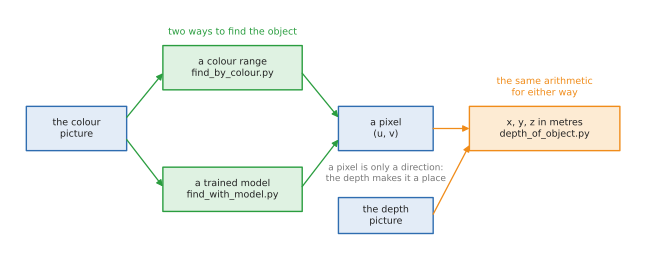
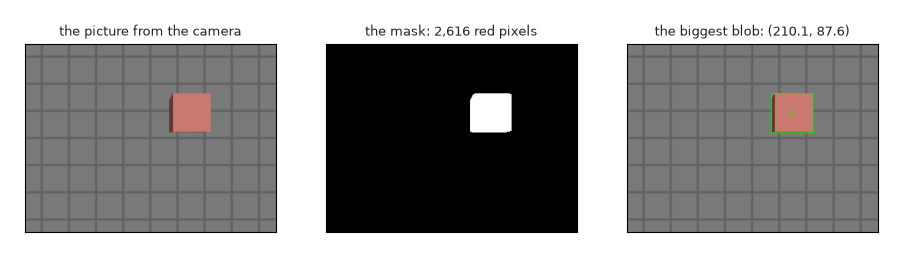
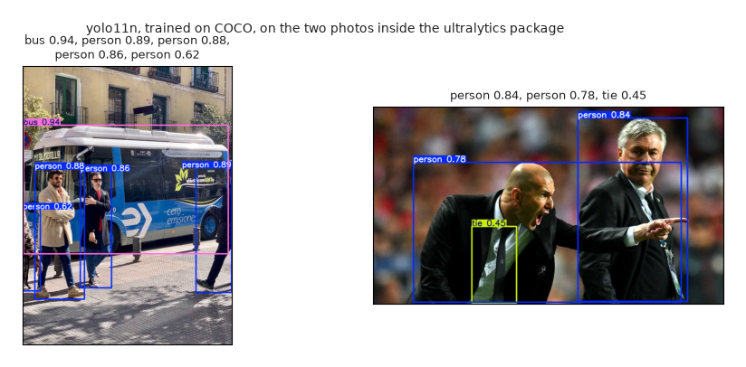
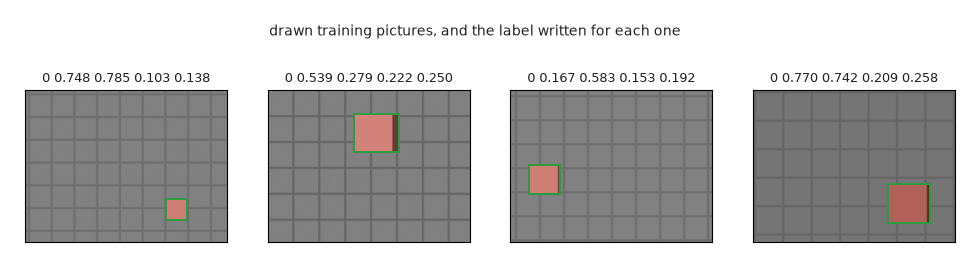
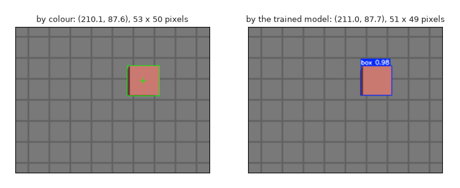

# Finding an object in a picture

A robot that is going to pick something up has to answer two questions about it:
**what is it**, and **where is it**. This doc is about answering both from a
camera picture, with the three tools every project uses: a **colour range**, a
**depth picture**, and a **trained model**. The fourth part trains a model on a
new object, which is what you do when no ready-made model knows the thing your
robot handles.

The code is in [`src/camera/camera_basics/`](../../src/camera/camera_basics/), four small
programs that each print what they are doing, and every number quoted here came
from running them.

## Contents

1. [The three ways, and when each one is used](#1-the-three-ways-and-when-each-one-is-used)
2. [The picture this doc uses](#2-the-picture-this-doc-uses)
3. [Finding it by colour](#3-finding-it-by-colour)
   1. [Why hue, saturation and value](#31-why-hue-saturation-and-value)
   2. [The steps](#32-the-steps)
   3. [Tidying the mask](#33-tidying-the-mask)
   4. [The biggest blob, and its middle](#34-the-biggest-blob-and-its-middle)
   5. [What it prints](#35-what-it-prints)
   6. [When colour stops working](#36-when-colour-stops-working)
4. [Adding depth: from a pixel to metres](#4-adding-depth-from-a-pixel-to-metres)
   1. [A pixel is only a direction](#41-a-pixel-is-only-a-direction)
   2. [Reading the depth safely](#42-reading-the-depth-safely)
   3. [The two lines that do it](#43-the-two-lines-that-do-it)
   4. [How big it is, and how far it stands above the table](#44-how-big-it-is-and-how-far-it-stands-above-the-table)
5. [Finding it with a trained model](#5-finding-it-with-a-trained-model)
   1. [What a model is, and what YOLO is](#51-what-a-model-is-and-what-yolo-is)
   2. [The three lines that matter](#52-the-three-lines-that-matter)
   3. [Confidence, and the threshold](#53-confidence-and-the-threshold)
   4. [A model only knows what it was trained on](#54-a-model-only-knows-what-it-was-trained-on)
   5. [How fast it is](#55-how-fast-it-is)
6. [Training a model of your own](#6-training-a-model-of-your-own)
   1. [The four ingredients](#61-the-four-ingredients)
   2. [The pictures, and their labels](#62-the-pictures-and-their-labels)
   3. [The dataset file](#63-the-dataset-file)
   4. [Fine-tuning: why 80 pictures are enough](#64-fine-tuning-why-80-pictures-are-enough)
   5. [What training prints, and what the scores mean](#65-what-training-prints-and-what-the-scores-mean)
   6. [The test that matters](#66-the-test-that-matters)
   7. [What a real project does differently](#67-what-a-real-project-does-differently)
7. [Running it](#7-running-it)
8. [Where to go next](#8-where-to-go-next)

---

## 1. The three ways, and when each one is used

Finding an object splits into two halves that are easy to mix up. **Which pixels
is it on** is answered either by a colour range or by a model. **Where is it in
metres** is answered by the depth picture, and that half is the same whichever
way the pixels were found.



| | Finds it by | Good at | Bad at | Needs |
| --- | --- | --- | --- | --- |
| **a colour range** | the colour of each pixel | anything of one strong colour; a millisecond of work; nothing to install | anything the same colour as its surroundings; changing light | OpenCV and NumPy |
| **a trained model** | patterns learned from labelled pictures | naming what a thing is: person, cup, chair, your own parts | needing training pictures for anything it has not seen; tens of milliseconds | PyTorch and ultralytics |
| **the depth picture** | how far ahead each pixel is | turning a pixel into a position in metres | saying *what* the thing is: it has no idea | a depth camera |

Real robots use all three together. A typical picking robot runs a model to find
and name the objects, reads the depth inside each box to place them in the room,
and uses a colour check on top, because a coloured marker or a known part colour
is the cheapest way to tell two otherwise identical objects apart.

The first two programs here need only OpenCV and NumPy and run in this repo's
usual environment. The two model programs need PyTorch, which is large, so it
lives in a separate pixi environment called `vision`
([section 7](#7-running-it)).

---

## 2. The picture this doc uses

Everything is done on one frame recorded from the camera area's Gazebo
simulation: a camera 0.40 m above a table, looking straight down at a red box
6 cm across. It is kept in `src/camera/camera_basics/data/` as three plain files, so
this folder needs no ROS and no simulator running:

| File | What it holds |
| --- | --- |
| `table_colour.png` | the colour picture, 320 × 240 pixels, three bytes per pixel |
| `table_depth.npz` | the depth picture: one distance in metres per pixel, as 32-bit decimals |
| `table_camera.json` | the lens: `fx` 277.1, `fy` 277.1, `cx` 160.0, `cy` 120.0, in pixels |

On a real robot those three arrive from the camera driver as two
`sensor_msgs/Image` messages and one `sensor_msgs/CameraInfo`, and `cv_bridge`
turns the pictures into exactly these arrays. The
[ROS camera doc](../ros/ros-camera.md#2-the-cameras-two-message-classes)
explains those messages, and the
[camera basics](basics.md#6-the-lens-as-four-numbers) explain where `fx`, `fy`,
`cx` and `cy` come from and why the focal length is counted in pixels.

---

## 3. Finding it by colour

This is the oldest way, and it is still everywhere: a coloured ball in a
football robot, a coloured marker on a tool, a red button, a green crop against
brown soil. It needs no model and no training, and it takes about a millisecond.
The code is `find_by_colour.py`.

### 3.1 Why hue, saturation and value

A pixel's three numbers are usually red, green and blue. That is a bad way to
ask "is this pixel red", because when the light changes, all three change
together: the same red box is (202, 121, 112) in the light and perhaps
(120, 70, 65) in shadow. Testing "red above 150" would find the first and miss
the second.

**HSV** splits the same colour into three more useful numbers:

- **hue**: which colour it is, going round the colour circle. OpenCV keeps it in
  0 to 179, which is half of the usual 0 to 360 degrees, so that it fits in one
  byte. Red is at 0, green near 60, blue near 120.
- **saturation**: how strong the colour is, 0 to 255. Grey has saturation 0.
- **value**: how bright it is, 0 to 255.

In shadow, a red object keeps its hue and only loses value. That is why robot
code thresholds in HSV. In this picture the box has hue 3 and saturation about
120, while the table is grey, which means saturation 0, so even the saturation
alone would separate them.

Red has one quirk: it sits at both ends of the hue circle, just above 0 and just
below 179, so it needs two ranges where other colours need one.

```python
LOW_RED: NDArray[np.uint8] = np.array([0, 80, 40], dtype=np.uint8)
HIGH_RED: NDArray[np.uint8] = np.array([10, 255, 255], dtype=np.uint8)
LOW_RED_WRAPPED: NDArray[np.uint8] = np.array([170, 80, 40], dtype=np.uint8)
HIGH_RED_WRAPPED: NDArray[np.uint8] = np.array([179, 255, 255], dtype=np.uint8)
```

### 3.2 The steps

In words, before any code:

```text
read the picture
convert it to hue, saturation and value
mask = the pixels whose hue, saturation and value are in the range we want
tidy the mask: drop specks, fill small holes
blobs = the separate patches of the mask
take the biggest blob
its middle is where the object is
```



And in OpenCV, which is the same seven lines:

```python
hsv: NDArray[np.uint8] = as_picture(cv2.cvtColor(bgr, cv2.COLOR_BGR2HSV))
mask: NDArray[np.uint8] = as_picture(cv2.inRange(hsv, LOW_RED, HIGH_RED))
wrapped: NDArray[np.uint8] = as_picture(cv2.inRange(hsv, LOW_RED_WRAPPED, HIGH_RED_WRAPPED))
return as_picture(cv2.bitwise_or(mask, wrapped))
```

`cv2.inRange` gives a **mask**: an array the size of the picture holding 255
where the pixel is inside the range and 0 where it is not. `cv2.bitwise_or`
keeps a pixel that matched either of the two red ranges.

One thing to know before your first OpenCV program: `cv2.imread` gives each
pixel's three numbers in the order **blue, green, red**, not red, green, blue.
It is an old habit of the library, it is why the code above converts with
`COLOR_BGR2HSV` rather than `COLOR_RGB2HSV`, and getting it wrong swaps red and
blue everywhere.

### 3.3 Tidying the mask

A real camera's mask is never as clean as the one in the picture above. Single
pixels flicker on where a pixel is nearly the right colour, and a highlight on
a shiny object leaves a hole in the middle of it. Two standard operations fix
both, and they come as a pair in every vision project:

```python
brush: NDArray[np.uint8] = as_picture(
    cv2.getStructuringElement(cv2.MORPH_ELLIPSE, (5, 5)))
opened: NDArray[np.uint8] = as_picture(cv2.morphologyEx(mask, cv2.MORPH_OPEN, brush))
return as_picture(cv2.morphologyEx(opened, cv2.MORPH_CLOSE, brush))
```

**Opening** shrinks the mask and then grows it again, which removes anything
smaller than the brush and leaves everything else the size it was. **Closing**
does the reverse, growing then shrinking, which fills holes smaller than the
brush. The brush here is a 5 × 5 ellipse, so specks and holes up to about five
pixels across disappear. On this already clean picture the tidying only changes
the mask from 2,624 pixels to 2,616.

### 3.4 The biggest blob, and its middle

`cv2.findContours` traces the outline of every separate patch in the mask.
`RETR_EXTERNAL` keeps only the outer outlines, so a hole inside the object does
not count as a second blob, and `CHAIN_APPROX_SIMPLE` stores the corners of each
outline rather than every pixel along it.

```python
contours: Sequence[cv2.typing.MatLike]
contours, _ = cv2.findContours(mask, cv2.RETR_EXTERNAL, cv2.CHAIN_APPROX_SIMPLE)
if not contours:
    return None
biggest: cv2.typing.MatLike = max(contours, key=cv2.contourArea)
```

Taking the biggest is the usual rule when there is one object to find; with
several, you keep every blob above a size and treat each as one object.

Its middle comes from the blob's **moments**, which are sums over the pixels of
the shape. `m00` is its area, `m10` is the sum of every pixel's column number,
and `m01` the sum of every row number, so `m10 / m00` and `m01 / m00` are the
average column and row: the middle of the shape.

```python
moments: dict[str, float] = cv2.moments(biggest)
return Found(u=moments['m10'] / moments['m00'], v=moments['m01'] / moments['m00'],
             left=left, top=top, width=width, height=height, pixels=pixels)
```

That average is steadier than the middle of the bounding box, because one stray
pixel at the edge moves the box but hardly moves the average of thousands of
pixels.

### 3.5 What it prints

```
--- 1. The picture ---
table_colour.png: 320 x 240 pixels, uint8, three colours per pixel

--- 2. The mask: the pixels of the colour we want ---
pixels matching red: 2,624 before tidying, 2,616 after

--- 3. The object ---
middle at pixel u = 210.1, v = 87.6
bounding box: 53 x 50 pixels, top-left corner at (184, 63)
the blob covers 2,518 pixels
```

The 2,624 red pixels are the same 2,624 the camera area counts on this box from
the depth side, which is a good sign that the colour range is neither greedy nor
mean. The blob covers 2,518 rather than 2,616 because `cv2.contourArea` measures
the area inside the traced outline, which cuts the corners of a stepped pixel
edge, while the mask count is of pixels.

The middle, `(210.1, 87.6)`, sits a little left of the box top's own middle at
`(212.5, 86.5)`, because the mask also covers the darker side face of the box
that the camera can see down the left edge. That is worth remembering: a colour
blob is the *visible* object, sides and all, not its top face.

### 3.6 When colour stops working

Colour is the first thing to try and the first thing to break:

- another red thing comes into view, and the biggest blob is now the wrong one
- the light changes enough to push the hue out of the range, especially outdoors
- the object is a colour something else in the room shares, or has no strong
  colour at all, which is true of most real objects
- two objects of the same colour touch, and become one blob

The fixes are the same everywhere: pick colours you control (marked parts,
coloured bins), keep the light constant, and when that is not possible, use a
model, which is [section 5](#5-finding-it-with-a-trained-model).

---

## 4. Adding depth: from a pixel to metres

The code is `depth_of_object.py`, which finds the box with the code above and
then answers "where is it, in metres".

### 4.1 A pixel is only a direction

Everything along one line from the lens lands on the same pixel, whether it is
5 cm or 5 m away, so a pixel on its own cannot say where anything is. A **depth
camera** fills in the missing number: as well as the colour picture, it reports
for every pixel how far ahead the surface is, in metres. The
[camera basics](basics.md#4-getting-distance-back-the-depth-picture) explain how
such a camera works and why the reading is "how far ahead", not "how far away".

### 4.2 Reading the depth safely

Two things make this more than reading one pixel.

A depth camera cannot measure everywhere. A shiny surface, a dark one, an edge
or something too close gives no reading, and those pixels come back as **NaN**,
"not a number". Any average that includes a NaN is NaN, so they have to be
dropped.

And the pixels at the edge of an object are unreliable: the beam half hits the
object and half the table behind it, so the reading lands somewhere between the
two. One such reading spoils an average, but hardly moves a **median**, the
middle value when they are sorted.

```python
readings: NDArray[np.float32] = depth[(mask > 0) & np.isfinite(depth)]
if readings.size == 0:
    raise ValueError('the camera measured none of the object')
return float(np.median(readings))
```

`(mask > 0) & np.isfinite(depth)` is one NumPy mask built from two: the pixels
that are part of the object **and** were measured. The
[NumPy doc](../numpy/numpy-intro.md#42-boolean-masks) explains masks.

### 4.3 The two lines that do it

This is the whole of a depth camera:

```python
x: float = (u - lens.cx) * z / lens.fx
y: float = (v - lens.cy) * z / lens.fy
return x, y, z
```

`u - cx` is how many pixels right of the middle of the picture the object is.
Dividing by `fx` turns pixels into an angle, and multiplying by the depth turns
the angle into metres sideways. The same happens downwards with `fy`, and
straight ahead is the depth itself. The
[one-box intro](one-box-intro.md#11-pixel-plus-depth-gives-back-the-point) works
through the same four steps with a diagram, and `measure.py` in the camera area
does it for all 76,800 pixels at once.

```
--- 3. Where the object is, in metres ---
pixel (210.1, 87.6) at 0.340 m -> x = +0.061 m, y = -0.040 m, z = 0.340 m
```

Those are the camera's own axes: x to its right, y down, z straight ahead.
Because this camera looks straight down, x and y run along the table and z is
the height of the camera above what it sees. To say where the box is in the
*room* instead, the robot asks TF for the transform between the camera's frame
and the room's, and multiplies; that is
[section 1.2 of the one-box intro](one-box-intro.md#12-where-the-camera-is).

### 4.4 How big it is, and how far it stands above the table

A size in pixels becomes a size in metres the same way, and the height above the
table is the difference of two depths:

```
--- 2. How far away the object is ---
the object, over 2,616 pixels: 0.340 m
the table, everywhere else:          0.400 m

--- 4. How big the object is ---
bounding box 53 x 50 pixels at 0.340 m -> 6.5 x 6.1 cm
it stands 6.0 cm above the table (0.400 - 0.340 m)
```

The box is a 6 cm cube, so 6.0 cm above the table is exactly right, and the
6.5 × 6.1 cm face is a little over because the bounding box includes that
visible side face again. A grasp planner would take the height to decide how far
down to reach, and the size to decide how wide to open the gripper.

---

## 5. Finding it with a trained model

The code is `find_with_model.py`.

### 5.1 What a model is, and what YOLO is

A **model** is a program whose behaviour was learned from labelled examples
rather than written by hand. You give it a picture; it gives back a list of
boxes, each with a **label** saying what it thinks is there, and a
**confidence** between 0 and 1 saying how sure it is.

**YOLO** — "you only look once" — is the detector most robotics projects reach
for, and the version used here is **yolo11n** from
[Ultralytics](https://docs.ultralytics.com/). It is famous for a good reason:
one pass over the picture finds everything in it, which is fast enough for a
live camera even without a graphics card, and the whole model is one file of
5.6 MB. The `n` is for nano, the smallest of a family that goes up to `x`, which
is far more accurate and far slower.

It was trained on **COCO**, a public collection of about 120,000 labelled
photos, and so it can name the 80 everyday classes COCO covers:

```
--- 1. The model ---
yolo11n.pt: 5.6 MB, 80 classes it can name
the first ten: person, bicycle, car, motorcycle, airplane, bus, train, truck, boat, traffic light
```

The 80 include people, vehicles, animals, and enough household things —
`bottle`, `cup`, `bowl`, `chair`, `laptop`, `scissors` — that a table-top robot
can get quite far before it needs to train anything of its own.

### 5.2 The three lines that matter

```python
model: YOLO = YOLO(str(WEIGHTS))
...
return model(picture, conf=CONFIDENCE, verbose=False)[0]  # type: ignore[index,return-value]
```

Load the weights, call the model with a picture, take the result for that
picture. `YOLO(path)` downloads the weights the first time, 5.4 MB, into
`models/`. A ROS node does exactly this in its camera callback, passing the
array `cv_bridge` gives it instead of a path.

The two photos below ship inside the ultralytics package, so they are always
there to try things on:



```
--- 2. A street photo ---
  label       sure     middle (u, v)     box (w x h)
  bus         0.94  ( 400.0,  478.9)     792 x 499
  person      0.89  ( 740.4,  636.8)     139 x 484
  person      0.88  ( 143.4,  651.9)     192 x 505
  person      0.86  ( 283.8,  634.6)     121 x 452
  person      0.62  (  34.5,  714.2)      69 x 316
  took 47 ms to look, on the processor, for a 810 x 1080 picture

--- 3. A football photo ---
  label       sure     middle (u, v)     box (w x h)
  person      0.84  ( 948.3,  376.5)     400 x 669
  person      0.78  ( 636.9,  459.0)     977 x 512
  tie         0.45  ( 443.0,  577.5)     163 x 280
```

Each box comes as `xywh`, its middle and its size in pixels, or as `xyxy`, its
two corners. A middle pixel is exactly what
[section 4](#4-adding-depth-from-a-pixel-to-metres) turns into metres, so a
model's box and a colour blob feed the same two lines of arithmetic.

### 5.3 Confidence, and the threshold

Every detection carries a confidence, and `conf=0.25` throws away anything
below that. The threshold is a real decision, not a detail:

- **lower** finds more, and starts inventing things that are not there
- **higher** is surer, and starts missing things that are

0.25 is the usual starting point. A robot that must never grab at nothing runs
higher; one that must never miss a person runs lower and checks the doubtful
ones another way. Notice the fourth person in the street photo at 0.62, half
hidden at the edge, and the `tie` at 0.45 in the football photo: the model is
telling you which answers it is not sure about, and that number is worth using
rather than ignoring.

### 5.4 A model only knows what it was trained on

Run the same model on this doc's table picture and it finds nothing at all:

```
--- 4. The table from the simulation ---
  nothing found
```

Two reasons, and both matter in practice. COCO has no class for "box", so there
is no right answer available to it. And the picture is a simulator's render of a
plain grey table, which looks nothing like the photos it learned from.

This is the single most important thing to understand about models: outside what
it was trained on, a model is not merely worse, it is blind. If your robot
handles brake discs, or seed trays, or your own 3D-printed parts, no public
model knows them, and you train one. That is the next section.

### 5.5 How fast it is

47 milliseconds for a 810 × 1080 photo, on this Mac mini's processor, with no
graphics card. That is about 20 pictures a second, which is enough for a robot
arm that moves at human speed. Projects that need more speed make the pictures
smaller, use a graphics card, or run the model on every third or fifth frame and
track the object in between.

---

## 6. Training a model of your own

The code is `train_a_model.py`. It teaches yolo11n to find this robot's box, and
takes about three minutes on this Mac mini's processor.

### 6.1 The four ingredients

Training anything needs the same four things:

1. **pictures** of the object, from the angles and in the light the robot will
   see it in
2. **labels**: for every picture, which class each object is and where it is
3. **a dataset file** saying where the pictures are and what the classes are
   called
4. **a starting model**, which is trained a little further on your pictures

### 6.2 The pictures, and their labels

The pictures here are drawn by the program itself, to look like the simulated
table: a grey table with grid lines, a red box of a random size somewhere on it,
one darker side face, a little variation in the light and a little noise. They
are drawn at twice the size and shrunk, which softens every edge the way a
camera does; hard, perfectly sharp edges are one of the things that make drawn
pictures unlike real ones.

Drawing them keeps the example offline and quick, and it means the labels are
exactly right, because the program knows where it put the box.



A **YOLO label** is one line per object, and five numbers:

```
labels/train/000.txt says: 0 0.121094 0.177083 0.126562 0.162500
```

The class number, then the middle across, the middle down, the width and the
height, each divided by the picture's width or height so that they all lie
between 0 and 1. Dividing like that means the same label still fits after the
picture is made bigger or smaller, which training does all the time. The label
file has the same name as its picture, with `.txt` instead of `.png`, and lives
in a `labels` folder beside the `images` one.

The 80 pictures are split into 64 to learn from and 16 to be tested on:

```
64 pictures to learn from and 16 to be tested on, in <repo>/src/camera/camera_basics/datasets/box
```

The **val** (validation) pictures are never learned from. They are how you find
out whether the model learned the object or simply memorised the training
pictures, which is the difference between a model that works on your robot and
one that only works on your laptop.

### 6.3 The dataset file

```
path: <repo>/src/camera/camera_basics/datasets/box
train: images/train
val: images/val
names:
  0: box
```

That is the whole of it: where the pictures are, which folders are which, and
the name of each class number. (`<repo>` stands for wherever you cloned this
repo; the file holds the full path, because that is what ultralytics expects.) Every YOLO dataset you will meet, including the
public ones, is described by a file of this shape.

### 6.4 Fine-tuning: why 80 pictures are enough

Training starts from `yolo11n.pt`, the model that already learned on COCO's
120,000 photos, rather than from nothing. That is called **fine-tuning**, or
transfer learning, and it is what almost everyone does.

The reason it works is that most of what a detector knows is not about buses or
people: it is about edges, corners, surfaces and shadows, and those are the same
in every picture. Only the last part of the model has to learn "what a box looks
like, and that it is called box". Training from nothing would need tens of
thousands of pictures and a day on a graphics card; fine-tuning needs 80
pictures and three minutes.

An **epoch** is one pass through all the training pictures. After each one the
model is scored on the val pictures, and the best scoring version is kept:

```python
model.train(data=str(yaml), epochs=epochs, imgsz=WIDTH, batch=8, device='cpu',
            project=str(RUNS), name='box', exist_ok=True, seed=0, plots=False,
            verbose=False, val=True)
```

`imgsz` is the size the pictures are scaled to, `batch` is how many are looked
at together before the model is nudged, and `device='cpu'` says to use the
processor; a machine with a graphics card would say `device=0` and finish in
seconds.

### 6.5 What training prints, and what the scores mean

```
40 epochs completed in 0.051 hours.

mAP50    0.995   how well the boxes it draws match the
                  labels, counting a box right when it overlaps the true
                  one by more than half. 1.000 is perfect.
mAP50-95 0.982   the same, averaged over stricter and
                  stricter overlaps: the number papers quote.
```

**mAP** is mean average precision, the standard score for a detector. Counting a
box as right when it overlaps the true box by more than half gives mAP50;
averaging that over overlap thresholds from 50 % up to 95 % gives mAP50-95,
which is the number model releases quote. On drawn pictures of one simple object
these scores are near perfect, as you would expect; on a real dataset of real
objects, 0.6 to 0.9 is a good result.

A shorter training is worth trying, to see what "not yet trained" looks like:
after 12 epochs the same run still scores mAP50 0.995 on the val pictures, and
yet it finds nothing in the real picture below. The boxes it draws are in the
right places, but it is not *sure* of them, and the confidences stay under the
0.25 threshold. Ranking and confidence are two different things.

### 6.6 The test that matters

The model learned only from drawn pictures. The picture it is finally tried on
is the recorded frame from the simulated camera, which it has never seen, and
which was made by a completely different program:



```
--- 5. The trained model on the real recorded picture ---
the trained weights are runs/box/weights/best.pt, 5.4 MB
box 0.98 at pixel (211.0, 87.7), 51 x 49 pixels
find_by_colour.py says   (210.1, 87.6), 53 x 50 pixels
```

It finds the box with 0.98 confidence, within a pixel of where the colour method
puts it. Two very different methods agreeing to within a pixel is the most
useful kind of check you can run on perception code, and it is why this folder
keeps both.

The trained weights land in `runs/box/weights/best.pt`. That file is the model:
copy it to the robot, load it with `YOLO('best.pt')`, and the three lines from
[section 5.2](#52-the-three-lines-that-matter) now find your object.

### 6.7 What a real project does differently

The shape of the work is the same; the pictures are not.

- **Take real photos**, of the real object, on the real table, in the light the
  robot will work in, from every side and distance it will see. A few hundred is
  a normal starting point for one object.
- **Label them** in a tool: Label Studio, CVAT and Roboflow are the usual ones.
  They draw boxes with the mouse and write exactly the label files above.
- **Vary them** while training. Ultralytics already flips, shifts, scales and
  recolours the pictures for you, which is why 80 pictures stretch as far as they
  do here.
- **Keep a val set that is honest**: pictures from a different session, not
  frames taken a tenth of a second apart from the training ones, which the model
  can memorise.
- **Try the official tiny example** to see the same steps with photographs:
  `ultralytics` ships `coco8`, a dataset of 8 real labelled photos, and
  `model.train(data='coco8.yaml', epochs=3)` downloads it and runs.

---

## 7. Running it

```
make camera.colour     # find the box by colour, then measure it with the depth picture
make camera.model      # find objects with YOLO, a ready-made model
make camera.train      # teach YOLO this robot's box, from 80 drawn pictures (~3 minutes)
```

The same commands without make, which is also how to pass arguments:

```
pixi run python src/camera/camera_basics/find_by_colour.py
pixi run python src/camera/camera_basics/depth_of_object.py
pixi run -e vision python src/camera/camera_basics/find_with_model.py
pixi run -e vision python src/camera/camera_basics/train_a_model.py 12     # fewer epochs
```

`-e vision` picks the second pixi environment, the one with PyTorch and
ultralytics in it. It is kept separate because PyTorch is a large download with
its own opinions about which NumPy to use, and the ROS environment has to keep
working. The first run of either model command downloads the 5.4 MB of YOLO
weights into `src/camera/camera_basics/models/`.

Everything the programs produce — the weights, the drawn dataset, the training
run and the annotated pictures in `out/` — is ignored by git and remade by
running them again.

---

## 8. Where to go next

- [Camera basics](basics.md) — what a picture is, what it loses, what a depth
  picture adds, and where the four lens numbers come from.
- [Locating a single box: the idea](one-box-intro.md) — the same arithmetic as
  section 4, for every pixel at once, and how the points move into the room.
- [Locating a single box: the code](one-box-code.md) — the ROS version of all
  this: a node that subscribes to the camera, measures the box and publishes
  what it found.
- [ROS camera](../ros/ros-camera.md) — the messages a camera sends, and the
  smallest node that receives them.
- [NumPy for robotics](../numpy/numpy-intro.md) — masks, medians and the
  array arithmetic used throughout this doc.
