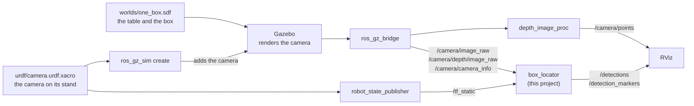
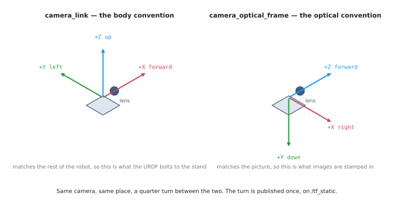
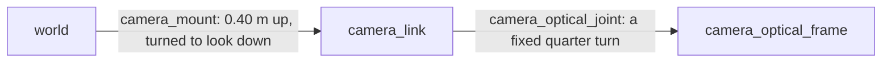

# Finding one box: the code

This doc is the second half of finding one box. The
[one-box intro](one-box-intro.md) explains the problem and does the calculations
that turn the camera's pictures into the box's position and height. This doc
turns those calculations into code. Section 1 writes them as pseudo code, section
2 explains the basics of each library the real code uses, and section 3 does the
calculations in Python with those libraries, on a real capture from the
simulation. The rest describes the project itself, `src/camera_one_box`: how its
pieces connect, how to run it, where things are in the code, and the gotchas
found while building it.

## Contents

1. [Pseudo code](#1-pseudo-code)
   - [1.1 One pixel into one point](#11-one-pixel-into-one-point)
   - [1.2 From the camera into the room](#12-from-the-camera-into-the-room)
   - [1.3 Measuring the box](#13-measuring-the-box)
2. [The libraries the code uses](#2-the-libraries-the-code-uses)
   - [2.1 ROS 2 and rclpy: nodes, topics and messages](#21-ros-2-and-rclpy-nodes-topics-and-messages)
   - [2.2 Launch files: starting everything together](#22-launch-files-starting-everything-together)
   - [2.3 URDF, xacro and robot_state_publisher: describing the robot](#23-urdf-xacro-and-robot_state_publisher-describing-the-robot)
   - [2.4 tf2: where every frame is](#24-tf2-where-every-frame-is)
   - [2.5 Gazebo, ros_gz_sim and ros_gz_bridge: the simulated world](#25-gazebo-ros_gz_sim-and-ros_gz_bridge-the-simulated-world)
   - [2.6 cv_bridge and image_geometry: pictures and lenses](#26-cv_bridge-and-image_geometry-pictures-and-lenses)
   - [2.7 message_filters: messages that belong together](#27-message_filters-messages-that-belong-together)
   - [2.8 depth_image_proc: the point cloud](#28-depth_image_proc-the-point-cloud)
   - [2.9 vision_msgs, visualization_msgs and RViz: saying what was found](#29-vision_msgs-visualization_msgs-and-rviz-saying-what-was-found)
   - [2.10 rosbag2: recording and replaying](#210-rosbag2-recording-and-replaying)
   - [2.11 NumPy and SciPy: the maths](#211-numpy-and-scipy-the-maths)
3. [Python code](#3-python-code)
   - [3.1 Reading the capture](#31-reading-the-capture)
   - [3.2 One pixel into one point](#32-one-pixel-into-one-point)
   - [3.3 From the camera into the room](#33-from-the-camera-into-the-room)
   - [3.4 Every pixel at once](#34-every-pixel-at-once)
   - [3.5 Measuring the box](#35-measuring-the-box)
4. [The project: how it runs](#4-the-project-how-it-runs)
   - [4.1 The pieces](#41-the-pieces)
   - [4.2 The camera's two frames](#42-the-cameras-two-frames)
   - [4.3 The topics](#43-the-topics)
   - [4.4 Settings you can change](#44-settings-you-can-change)
5. [Running it](#5-running-it)
   - [5.1 The simulation](#51-the-simulation)
   - [5.2 Every pixel of the basic camera](#52-every-pixel-of-the-basic-camera)
   - [5.3 What is being published](#53-what-is-being-published)
6. [Working on the code](#6-working-on-the-code)
   - [6.1 Layout](#61-layout)
   - [6.2 Changing things](#62-changing-things)
7. [Notes and gotchas](#7-notes-and-gotchas)
8. [Vocabulary](#8-vocabulary)

---

## 1. Pseudo code

The pseudo code below repeats the calculations from the [one-box
intro](one-box-intro.md#1-calculations) without the explanations, so that the
whole job can be seen in one place. It is split into the same pieces as the
intro, so each piece can be read side by side with the part that explains it.

### 1.1 One pixel into one point

This piece follows the four steps from [section 1.1 of the
intro](one-box-intro.md#11-pixel-plus-depth-gives-back-the-point), in the same
order. It starts from one pixel and its depth reading, and it ends with a point
measured from the camera.

```
the goal: turn one pixel on the red box into one point, measured from the camera

what we start with:
    u, v        which pixel: how far across from the left, and how far down from the top
    depth       the depth reading at that pixel, in metres
    fx, fy      the focal length, in pixels            (the four lens numbers)
    cx, cy      the middle of the picture, in pixels   (the four lens numbers)

step 1: how far is the pixel from the middle of the picture?
    pixels_right = u - cx
    pixels_down  = v - cy

step 2: how much does one pixel cover, at that distance?
    size_across = depth / fx
    size_down   = depth / fy

step 3: turn pixels into metres
    x = pixels_right * size_across
    y = pixels_down  * size_down

step 4: how far in front of the camera?
    z = depth

the answer is the point (x, y, z)
```

### 1.2 From the camera into the room

This piece follows [section 1.2 of the
intro](one-box-intro.md#12-where-the-camera-is). It starts from the point that
1.1 gives back, which is measured from the camera, and it ends with the same
point measured in the room.

```
the goal: move one point from the camera's axes into the room's axes

what we start with:
    x, y, z             the point, measured from the camera           (from 1.1)
    camera_to_world     where the camera is, and which way it points  (intro, 1.2)
        right           the camera's right, as a direction in the room      first column
        down            the camera's down, as a direction in the room       second column
        forward         the camera's forward, as a direction in the room    third column
        position        where the camera is, in the room                    last column

start at the camera:
    point_in_room = position

walk along the camera's own three directions:
    point_in_room = point_in_room + x * right
    point_in_room = point_in_room + y * down
    point_in_room = point_in_room + z * forward

the answer is point_in_room
```

### 1.3 Measuring the box

This last piece is the whole job from [section 1.4 of the
intro](one-box-intro.md#14-the-box-measured). It runs the two pieces above for
every pixel, and then keeps and averages the top of the box.

```
the goal: find where the box is on the table, and how tall it is

what we start with:
    the depth picture from one capture
    the four lens numbers, and camera_to_world

step 1: turn every pixel into a point in the room
    points = an empty list
    for each pixel in the depth picture:
        u, v  = the middle of that pixel
        point = one pixel into one point         (1.1)
        point = from the camera into the room    (1.2)
        add point to points

step 2: keep the points standing on the table
    standing = the points whose z is more than 0.01 above the table

step 3: keep only the top of the box
    top_height = the highest z among the standing points
    top        = the standing points whose z is within a millimetre of top_height

step 4: average the top
    middle = the average x and the average y of the points in top
    height = top_height

the answer is the middle of the box, and its height
```

---

## 2. The libraries the code uses

The pseudo code in section 1 needs nothing but arithmetic, but the real code has
to do much more than arithmetic. It has to receive pictures from a camera, know
where the camera is, keep the messages that belong together in step, and hand
its answer to the rest of the robot. Robot projects do not write any of that from
scratch. They use a small set of standard libraries, the same ones found in
almost every ROS project, and this section explains the basics of each one, so
that the Python code in section 3 and the project in section 4 are easy to
follow.

The table gives an overview, and the parts after it take each library in turn.

| Library | What it does for us | Where this project uses it |
| --- | --- | --- |
| rclpy | makes a Python program a ROS node, which can send and receive messages | every node |
| launch | starts all the programs together, with their settings | `launch/one_box.launch.py` |
| URDF, xacro and robot_state_publisher | describe the robot, here a camera on a stand, and publish where its parts are | `urdf/camera.urdf.xacro` |
| tf2 | keeps track of where every frame is, and moves points between them | `box_locator.py`, section 3.3 |
| Gazebo, ros_gz_sim and ros_gz_bridge | simulate the world and the camera, and connect them to ROS | `worlds/one_box.sdf`, `config/bridge.yaml` |
| cv_bridge | turns picture messages into NumPy arrays | `box_locator.py`, `show_pixels.py` |
| image_geometry | reads the four lens numbers out of the camera info | `box_locator.py`, section 3.2 |
| message_filters | pairs up messages taken at the same moment | `box_locator.py`, `show_pixels.py`, `save_snapshot.py` |
| depth_image_proc | turns a depth picture into a point cloud | the launch file |
| vision_msgs, visualization_msgs and RViz | say what was found, and show it | `box_locator.py`, `config/one_box.rviz` |
| rosbag2 | records messages and plays them back | `save_snapshot.py`, the tests |
| NumPy and SciPy | do arithmetic on whole pictures at once, and handle rotations | `measure.py` |

### 2.1 ROS 2 and rclpy: nodes, topics and messages

ROS 2, the Robot Operating System, is not an operating system like macOS. It is a
set of libraries and tools for writing robot software, and its central idea is
that a robot's software should be split into many small programs, called
**nodes**, each with one job. One node talks to the camera, another finds the
box, another plans how the arm should move. They run at the same time, and they
talk to each other by sending **messages** on named channels called **topics**,
such as `/camera/image_raw`. A node that sends on a topic **publishes** to it, and
a node that receives from it **subscribes** to it. Neither side needs to know who
is on the other end, which is what lets one part be swapped for another, such as
a real camera for a simulated one, without changing the rest.

Every message has a fixed type, defined in a package, so that the sender and the
receiver agree on what it holds. A picture is a `sensor_msgs/Image`, which holds
the picture's width and height, an `encoding` saying what each pixel's numbers
mean, and the numbers themselves as a long list of bytes. The camera's lens
arrives as a `sensor_msgs/CameraInfo`, which holds the four lens numbers, among
other things. Almost every message that describes the world starts with a
**header**, which says when the message was true (its timestamp) and which frame
its numbers are measured in.

**rclpy** is the ROS library for Python. A node is a Python class that extends
rclpy's `Node` class, and the Node gives it the methods it needs to take part:
`create_subscription()` and `create_publisher()` to receive and send,
`declare_parameter()` to read settings, and `get_logger()` to print messages
marked with the node's name. The functions a node hands to ROS, such as the one
that should run when a picture arrives, are called **callbacks**. Here is a whole
node, which prints a line for every colour picture the camera sends:

```python
import rclpy
from rclpy.node import Node
from sensor_msgs.msg import Image


class Watcher(Node):
    def __init__(self):
        super().__init__('watcher')                        # the node's name
        self.create_subscription(Image, '/camera/image_raw', self.on_picture, 10)

    def on_picture(self, msg):                             # a callback
        self.get_logger().info(f'a {msg.width} x {msg.height} picture, encoded as {msg.encoding}')


rclpy.init()
rclpy.spin(Watcher())      # wait for messages, and call on_picture for each one
```

With the simulation running, it prints this five times a second, once for every
picture, until it is stopped with Ctrl-C:

```
[INFO] [1789420219.552595000] [watcher]: a 320 x 240 picture, encoded as rgb8
```

`rclpy.init()` starts ROS for the program, and `rclpy.spin()` keeps the program
running, waiting for messages and calling the callbacks as they arrive. The last
argument of `create_subscription()`, the 10, is how many messages ROS keeps
waiting if the callback is slow, before it starts dropping the oldest ones. The
box locator in `box_locator.py` is built the same way, only with more to do in
its callback.

### 2.2 Launch files: starting everything together

A robot needs many programs running at once, and starting each one by hand, in
its own terminal, with the right settings, would be slow and easy to get wrong.
A **launch file** describes all of them in one place, and `ros2 launch` starts
them together and stops them together:

```
ros2 launch camera_one_box one_box.launch.py
```

A launch file is a Python file with a function called
`generate_launch_description()`, which returns a list of things to start. Each
`Node(...)` in the list starts one ROS program, with its settings, and other
entries can include another package's launch file, run an ordinary command, or
declare **launch arguments**, the settings you can pass on the command line as
`name:=value`. This project's launch file, `launch/one_box.launch.py`, has a
comment on every part of it.

### 2.3 URDF, xacro and robot_state_publisher: describing the robot

Before anything can say where the camera is, something has to describe the
robot: its parts, and how they are joined. **URDF**, the Unified Robot
Description Format, is the XML format ROS uses for that. A URDF file lists
**links**, which are the rigid parts, and **joints**, which say how each link is
attached to the one before it. A joint can turn, like an arm's elbow, slide, or be
fixed. Here the robot is just a camera on a stand, so it has three links, `world`,
`camera_link` and `camera_optical_frame`, joined by two fixed joints:

```xml
<joint name="camera_mount" type="fixed">
  <parent link="world"/>
  <child link="camera_link"/>
  <origin xyz="0 0 $(arg mount_height)" rpy="0 ${pi / 2} ${pi / 2}"/>
</joint>
```

The `origin` says where the child sits compared with its parent: `xyz` is the
shift, in metres, and `rpy` is the turn, as roll, pitch and yaw in radians. The
`$(arg ...)` and `${...}` parts are **xacro**, short for XML macros. Plain URDF
cannot have variables or arithmetic, so robot descriptions are usually written in
xacro and turned into plain URDF just before they are used. Here, that lets the
launch file pass in the camera's height, resolution and field of view.

**robot_state_publisher** is a standard node that reads the description and
publishes where every link is, on TF (section 2.4). A fixed joint never moves, so
it publishes those once, on `/tf_static`. It also publishes the description
itself, on `/robot_description`, which is where Gazebo and RViz read it from.

### 2.4 tf2: where every frame is

A **frame** is a set of axes: a starting point and three directions. Every
position a robot works with is measured in some frame, such as the room
(`world`), the camera (`camera_optical_frame`) or the arm's gripper, and the same
point has different numbers in each of them. **tf2**, usually just called TF, is
the part of ROS that keeps track of how every frame sits compared with every
other one. The frames form a tree, in which each frame has exactly one parent,
and TF can join the steps along the tree to answer a question about any two
frames. The **transform** between two frames is a shift and a turn: the one-box
intro's `camera_to_world` is the transform from the camera's frame to the
room's.

In Python, the library is `tf2_ros`. A `Buffer` stores the transforms, a
`TransformListener` fills the buffer by listening to TF's topics, and
`lookup_transform()` answers the question:

```python
from rclpy.time import Time
from tf2_ros import Buffer, TransformListener

tf_buffer = Buffer()
tf_listener = TransformListener(tf_buffer, node)     # node: the node to listen with
tf = tf_buffer.lookup_transform('world', 'camera_optical_frame', Time())
```

The answer is the transform that moves a point from the second frame into the
first, and `Time()` asks for the latest one known. TF gives the turn as a
**quaternion**, four numbers `(x, y, z, w)` that describe a rotation without the
awkward cases three angles have. `tf2_geometry_msgs` adds the step that moves one
point with a transform, which section 3.3 uses.

### 2.5 Gazebo, ros_gz_sim and ros_gz_bridge: the simulated world

**Gazebo** is the robot simulator most ROS projects use. It simulates physics, so
that things fall and collide, and it renders sensors, so that a simulated camera
takes pictures of the simulated world. A Gazebo world is described in **SDF**,
the Simulation Description Format, which is XML like URDF but can describe a whole
world: here, `worlds/one_box.sdf` holds the table, the box and a light. The
camera's own settings are in its URDF, in `<sensor>` blocks inside `<gazebo>`
tags, which Gazebo reads and ROS ignores.

Gazebo is a separate program with its own message system, so two packages
connect it to ROS. **ros_gz_sim** starts Gazebo from a launch file, and its
`create` command adds a robot to a running world from the robot's description.
**ros_gz_bridge** copies messages between Gazebo's topics and ROS topics. It is
told what to copy by `config/bridge.yaml`, one entry per topic, naming the topic
and its message type on each side:

```yaml
- ros_topic_name: /camera/depth/image_raw
  gz_topic_name: /camera/depth_image
  ros_type_name: sensor_msgs/msg/Image
  gz_type_name: gz.msgs.Image
  direction: GZ_TO_ROS
```

Gazebo also keeps its own clock, which starts at zero when the simulation starts.
The bridge copies it onto `/clock`, and every node is started with `use_sim_time`,
which tells it to read the time from there, so that all the timestamps agree.

### 2.6 cv_bridge and image_geometry: pictures and lenses

A picture message holds its pixels as a long list of bytes. To do arithmetic on
the pixels, the code needs them as a NumPy array, with one row of the array for
each row of pixels, and **cv_bridge** does that conversion. It is called a bridge
because it connects ROS pictures to OpenCV, the standard library for pictures,
which uses the same arrays. The second argument names the encoding the code
expects, so cv_bridge can check the picture really is that:

```python
from cv_bridge import CvBridge

depth = CvBridge().imgmsg_to_cv2(depth_msg, desired_encoding='32FC1')
depth[86, 212]           # 0.34: the depth reading at row 86, column 212, in metres
```

**image_geometry** holds the camera's lens. Its `PinholeCameraModel` reads a
camera info message, and then gives the four lens numbers from the basics as
`fx()`, `fy()`, `cx()` and `cy()`. It also does the two calculations every camera
program needs: `project_3d_to_pixel()` works out which pixel a point lands on,
and `project_pixel_to_3d_ray()` works out the direction a pixel looks in, which
section 3.2 uses.

```python
from image_geometry import PinholeCameraModel

camera = PinholeCameraModel()
camera.from_camera_info(info_msg)
camera.fx(), camera.cx()         # (277.1..., 160.0)
```

### 2.7 message_filters: messages that belong together

The camera publishes the depth picture and the camera info as two separate
messages, on two topics, and an ordinary subscription calls its callback for each
one on its own. But a depth picture only makes sense next to the lens numbers it
was taken with, so the code needs the two that belong together.
**message_filters** does that. Its `Subscriber` works like an ordinary
subscription, but it passes each message on to a filter, and a
`TimeSynchronizer` is a filter that waits until it has one message from each
subscriber with the same timestamp, and then calls one callback with all of them:

```python
import message_filters

depth = message_filters.Subscriber(node, Image, '/camera/depth/image_raw')
info = message_filters.Subscriber(node, CameraInfo, '/camera/camera_info')
pairs = message_filters.TimeSynchronizer([depth, info], queue_size=10)
pairs.registerCallback(on_picture)       # on_picture(depth_msg, info_msg)
```

Gazebo stamps all of a camera's messages with exactly the same time, so an exact
match works here. A real camera may stamp its colour and depth pictures a
fraction of a second apart, and code for one usually uses
`ApproximateTimeSynchronizer` instead, which pairs messages whose timestamps are
close.

### 2.8 depth_image_proc: the point cloud

Turning a depth picture into a point cloud, one point per pixel, is needed so
often that ROS has a standard package for it, **depth_image_proc**. Its
`PointCloudXyzrgbNode` reads a depth picture, a colour picture and the camera
info, and publishes a `sensor_msgs/PointCloud2`, with a position and a colour for
every point. It does the calculation from section 1.1 of the
[one-box intro](one-box-intro.md#11-pixel-plus-depth-gives-back-the-point) for
every pixel, and leaves the points measured from the camera, for RViz or any
other node to move with TF.

It is written as a **component**: a node that is loaded into a container process
instead of running as its own program, which is how ROS usually runs image
processing, because several components in one container can pass large messages
such as pictures without copying them. The launch file loads it into a container,
and **remaps** its fixed input names, such as `rgb/image_rect_color`, to this
project's topics.

### 2.9 vision_msgs, visualization_msgs and RViz: saying what was found

Once the box has been measured, the answer has to go somewhere, in a form other
nodes understand. **vision_msgs** is the standard set of messages for things a
robot has detected. A `Detection3D` describes one object: its **bounding box**,
which is the smallest box around it, given by its middle and its size, and a
**hypothesis**, which says what the object is and how sure the detector is. A
`Detection3DArray` holds everything found in one picture. A grasp planner, the
part of an arm's software that decides how to pick something up, reads these.

**RViz** is the 3D viewer that comes with ROS. Each of its displays subscribes to
a topic and draws what arrives: the point cloud, the pictures, the frames on TF,
and the robot from its description. RViz cannot draw a detection directly, so the
box locator also publishes the box as a **marker** from **visualization_msgs**,
which is a simple shape, here a see-through cube, that RViz draws where the
marker says. The layout of RViz's windows and displays is saved in
`config/one_box.rviz`.

### 2.10 rosbag2: recording and replaying

**rosbag2** records messages from any topics into a file, called a **bag**, and
plays them back later exactly as they were sent. Because the other nodes cannot
tell a played-back message from a live one, bags are the usual way to develop and
test perception code without the robot, or here, without Gazebo. From the
command line, `ros2 bag record` and `ros2 bag play` do that, and `ros2 bag info`
shows what a bag holds:

```
ros2 bag info src/camera_one_box/test/data/one_box
```

For the capture the tests use, that lists the four messages it holds, one on
each topic:

```
Topic: /camera/camera_info | Type: sensor_msgs/msg/CameraInfo | Count: 1 | Serialization Format: cdr
Topic: /camera/depth/image_raw | Type: sensor_msgs/msg/Image | Count: 1 | Serialization Format: cdr
Topic: /camera/image_raw | Type: sensor_msgs/msg/Image | Count: 1 | Serialization Format: cdr
Topic: /tf_static | Type: tf2_msgs/msg/TFMessage | Count: 1 | Serialization Format: cdr
```

The bags here use **MCAP**, the standard file format for ROS 2 bags, and CDR is
the byte format ROS 2 sends messages in. `rosbag2_py` is the Python side of the
same tool: `save_snapshot.py` uses its writer to record one capture, and the
tests and section 3.1 use its reader to play it back.

### 2.11 NumPy and SciPy: the maths

**NumPy** is the standard Python library for arrays of numbers. Its point is
that one line of arithmetic works on a whole array at once: when `depth` is the
240 × 320 depth picture, `depth / 277.1` divides all 76,800 readings, with no
Python loop, and it runs far faster than a loop would. `measure.py` is written
this way throughout. It also uses NumPy's way of picking out values: `points[:,
2]` is the third number of every point, which is its height, and
`points[points[:, 2] > 0.01]` keeps only the points higher than a centimetre.

**SciPy** is a larger library of scientific tools built on NumPy, and this
project uses one piece of it, `Rotation`, which converts between the different
ways of writing down a turn. `Rotation.from_quat(q).as_matrix()` turns TF's
quaternion into the 3 × 3 table of directions that `camera_to_world` needs.

---

## 3. Python code

The Python code below does the same calculations once more, in the same pieces
as the pseudo code, so each piece can be matched with the pseudo code above it.
Most pieces first write the step out by hand, and then do it again with the
library that a real robot project would use, which is also what the project's
own code uses.

The pieces work on a real capture from the Gazebo camera, recorded into a
rosbag, which is the usual way to keep camera data for testing. It lives in
`src/camera_one_box/test/data/one_box`, and the project's tests use the same one.
To try the pieces yourself, run `make shell`, start `python` from the top of the
repo, and paste them in order, because the later pieces use what the earlier
ones made.

### 3.1 Reading the capture

A rosbag stores each message exactly as it travelled over ROS, so reading one
back gives the same messages the box locator receives: the colour picture, the
depth picture, the camera info with the four lens numbers, and the static
transforms that say where the camera is.

```python
import rosbag2_py
from rclpy.serialization import deserialize_message
from rosidl_runtime_py.utilities import get_message

reader = rosbag2_py.SequentialReader()
reader.open(rosbag2_py.StorageOptions(uri='src/camera_one_box/test/data/one_box',
                                      storage_id='mcap'),
            rosbag2_py.ConverterOptions('', ''))
types = {topic.name: topic.type for topic in reader.get_all_topics_and_types()}
capture = {}
while reader.has_next():
    topic, data, _ = reader.read_next()
    capture[topic] = deserialize_message(data, get_message(types[topic]))
print(sorted(capture))
```

When it runs, it prints the four topics the capture holds:

```
['/camera/camera_info', '/camera/depth/image_raw', '/camera/image_raw', '/tf_static']
```

### 3.2 One pixel into one point

The first version writes the four steps from [section 1.1 of the
intro](one-box-intro.md#11-pixel-plus-depth-gives-back-the-point) out one line
at a time, so that each step can be seen and checked on its own. It uses the
same numbers as [section 1.1 of the
intro](one-box-intro.md#11-pixel-plus-depth-gives-back-the-point), and it prints
the same answer.

```python
def pixel_to_point(u, v, depth, fx, fy, cx, cy):
    """Turn one pixel and its depth reading into a 3D point, measured from the camera."""
    pixels_right = u - cx             # step 1: how far right of the middle, in pixels
    pixels_down = v - cy              #         how far below the middle, in pixels
    size_across = depth / fx          # step 2: how much one pixel covers, in metres
    size_down = depth / fy
    x = pixels_right * size_across    # step 3: pixels into metres
    y = pixels_down * size_down
    z = depth                         # step 4: straight ahead is the depth itself
    return x, y, z


x, y, z = pixel_to_point(u=212.5, v=86.5, depth=0.340, fx=277.1, fy=277.1, cx=160, cy=120)
print(f'x = {x:+.4f} m, y = {y:+.4f} m, z = {z:+.4f} m')
```

When it runs, it prints:

```
x = +0.0644 m, y = -0.0411 m, z = +0.3400 m
```

A real project reads the four lens numbers from the camera info instead of
typing them in, and the standard way to do that in Python is `image_geometry`.
Its `PinholeCameraModel` holds the lens, and `project_pixel_to_3d_ray()` turns a
pixel into a direction: a line from the lens, one metre long, pointing at that
pixel. Stretching the line until it is as far ahead as the depth reading gives
the point. The depth picture itself comes from `cv_bridge`, which turns an image
message into a NumPy array.

```python
from cv_bridge import CvBridge
from image_geometry import PinholeCameraModel

camera = PinholeCameraModel()
camera.from_camera_info(capture['/camera/camera_info'])        # fx, fy, cx, cy
depth = CvBridge().imgmsg_to_cv2(capture['/camera/depth/image_raw'],
                                 desired_encoding='32FC1')

u, v = 212.5, 86.5
d = float(depth[int(v), int(u)])                   # 0.340, read from the depth picture
ray = camera.project_pixel_to_3d_ray((u, v))       # the direction, one metre long
point = [c * d / ray[2] for c in ray]              # stretched until it is d ahead
print(f'x = {point[0]:+.4f} m, y = {point[1]:+.4f} m, z = {point[2]:+.4f} m')
```

It prints the same point, because it is the same calculation:

```
x = +0.0644 m, y = -0.0411 m, z = +0.3400 m
```

### 3.3 From the camera into the room

This piece takes the point from 3.2 and moves it into the room. It writes the
walk from [section 1.2 of the intro](one-box-intro.md#12-where-the-camera-is)
out in full, with the four columns of `camera_to_world` typed in by hand.

```python
def camera_to_room(point, right, down, forward, position):
    """Start at the camera, then walk x along its right, y along its down, z along its forward."""
    x, y, z = point
    return (
        position[0] + x * right[0] + y * down[0] + z * forward[0],
        position[1] + x * right[1] + y * down[1] + z * forward[1],
        position[2] + x * right[2] + y * down[2] + z * forward[2],
    )


right = (1, 0, 0)         # the first three columns of camera_to_world:
down = (0, -1, 0)         # which way the camera's right, down and forward
forward = (0, 0, -1)      # point in the room
position = (0, 0, 0.40)   # the last column: where the camera is

room = camera_to_room((0.0644, -0.0411, 0.340), right, down, forward, position)
print(f'in the room: x = {room[0]:+.4f} m, y = {room[1]:+.4f} m, z = {room[2]:+.4f} m')
```

When it runs, it prints the point from [section 1.2 of the
intro](one-box-intro.md#12-where-the-camera-is), with the height of the box as
its last number:

```
in the room: x = +0.0644 m, y = +0.0411 m, z = +0.0600 m
```

A real project asks TF instead. The capture holds the static transforms that
robot_state_publisher published, so they can go into a TF buffer and be looked
up as if the robot were running. `tf2_geometry_msgs` then moves a point from one
frame to another, given the transform between them.

```python
from geometry_msgs.msg import PointStamped
from rclpy.time import Time
import tf2_geometry_msgs
from tf2_ros import Buffer

tf_buffer = Buffer()
for transform in capture['/tf_static'].transforms:
    tf_buffer.set_transform_static(transform, 'recorded')
camera_to_world = tf_buffer.lookup_transform('world', 'camera_optical_frame', Time())

spot = PointStamped()
spot.header.frame_id = 'camera_optical_frame'
spot.point.x, spot.point.y, spot.point.z = point
p = tf2_geometry_msgs.do_transform_point(spot, camera_to_world).point
print(f'in the room: x = {p.x:+.4f} m, y = {p.y:+.4f} m, z = {p.z:+.4f} m')
```

It prints the same point in the room, `(+0.0644, +0.0411, +0.0600)`.

### 3.4 Every pixel at once

A real program wants every pixel rather than just one, and NumPy can work out
all 76,800 of them in a single calculation. The formula does not change at all.
The only difference is that `u`, `v` and `depth` become whole grids of numbers,
one for every pixel, instead of single numbers.

```python
import numpy as np

rows, cols = depth.shape
v, u = np.mgrid[0:rows, 0:cols] + 0.5              # every pixel's middle
x = (u - camera.cx()) * depth / camera.fx()
y = (v - camera.cy()) * depth / camera.fy()
z = depth
print(depth.shape, x[86, 212].round(4), y[86, 212].round(4), z[86, 212].round(4))
```

It prints the size of the picture, and then our pixel's point once again:

```
(240, 320) 0.0644 -0.0411 0.34
```

These lines are `depth_to_points()` in the project's `measure.py`. The result is
one point for every pixel, measured from the camera, which is the point cloud from
[section 1.3 of the intro](one-box-intro.md#13-what-one-capture-contains).

### 3.5 Measuring the box

This last piece is the whole job from [section 1.4 of the
intro](one-box-intro.md#14-the-box-measured), and it follows the four steps of
the pseudo code in section 1.3. It moves every point into the room with the
transform from 3.3, turned into the table from [section 1.2 of the
intro](one-box-intro.md#12-where-the-camera-is) by `transform_matrix()`.

```python
from camera_one_box.measure import depth_to_points, measure_box, to_world, transform_matrix

t, q = camera_to_world.transform.translation, camera_to_world.transform.rotation
matrix = transform_matrix((t.x, t.y, t.z), (q.x, q.y, q.z, q.w))

# step 1: every pixel becomes a point in the room
points = to_world(depth_to_points(depth, camera.fx(), camera.fy(), camera.cx(), camera.cy()),
                  matrix)
# step 2: keep the points standing more than a centimetre above the table
standing = points[points[:, 2] > 0.01]
# step 3: keep the top, the points within a millimetre of the highest one
top_z = standing[:, 2].max()
top = standing[standing[:, 2] > top_z - 0.001]
# step 4: the average of the top is the middle of the box
print(f'{len(points):,} points, {len(standing):,} standing on the table, {len(top):,} on the top')
print(f'middle = ({top[:, 0].mean():+.3f}, {top[:, 1].mean():+.3f}) m, height = {top_z:.3f} m')
```

When it runs, it finds the points from [section 1.4 of the
intro](one-box-intro.md#14-the-box-measured) and prints the answer:

```
76,800 points, 2,582 standing on the table, 2,401 on the top
middle = (+0.064, +0.040) m, height = 0.060 m
```

The project does steps 2 to 4 in `measure_box()`, which the box locator calls on
every picture:

```python
box = measure_box(points)
print(f'middle = ({box.x:+.3f}, {box.y:+.3f}) m, height = {box.height:.3f} m')
```

It gives the same answer, `middle = (+0.064, +0.040) m, height = 0.060 m`.

---

## 4. The project: how it runs

The sections so far are about the code that does the calculations. This section
is the practical side: how the pieces of the `camera_one_box` project fit
together, which topics carry the pictures, and what you can change without
editing any code.

### 4.1 The pieces

The project has the usual shape of a simulated robot. Every piece is a standard
ROS 2 or Gazebo tool except one, the box locator, which is the project's own
code, and the launch file `launch/one_box.launch.py` starts them all together.



Each piece has one job, and they hand their work on in this order:

1. **The camera description**, `urdf/camera.urdf.xacro`, says where the camera
   is and what it sees. It is written in xacro, which is URDF with variables,
   the same format used to describe a robot arm. It describes a camera on a
   fixed stand, 0.40 metres above the table, and its two `<sensor>` blocks tell
   Gazebo what each camera should see.
2. **robot_state_publisher** reads that description and publishes its frames
   on TF, so that every other node can ask where the camera is.
3. **Gazebo** loads the world, `worlds/one_box.sdf`, which holds the table, the
   box and a light. `ros_gz_sim create` then adds the camera to the world from
   the same description, the way a robot arm would be added. On macOS, Gazebo
   runs without its window, because there the window has to be a separate
   process.
4. **ros_gz_bridge** copies the camera's pictures from Gazebo's own message
   system onto ROS topics, as listed in `config/bridge.yaml`. It uses the same
   topic names a real camera driver uses, so any ROS tool that works with a real
   camera works with this one. It also copies `/clock`, Gazebo's simulated time,
   which every node in the launch file uses.
5. **depth_image_proc** turns the depth picture into a point cloud. It is the
   standard ROS package for this, and it runs inside a component container,
   which is how ROS runs image-processing nodes efficiently.
6. **box_locator** is the project's own node. It takes each depth picture
   together with its camera info, asks TF where the camera is, measures the box
   with `measure.py`, and publishes the answer.
7. **RViz** shows all of it: the frames, the camera on its stand, the point cloud,
   both pictures, and the measured box.

### 4.2 The camera's two frames

[Section 6 of the basics](basics.md#6-the-lens-as-four-numbers) gave the
camera's axes as X right, Y down and Z forward, to match the picture. The rest of
a robot uses a different habit, X forward, Y left and Z up, and ROS keeps both,
as two frames in the same place.



| Frame | Axes | Used for |
| --- | --- | --- |
| `camera_link` | X forward, Y left, Z up | attaching the camera to the stand, like any other part of a robot |
| `camera_optical_frame` | X right, Y down, Z forward | stamping the pictures, so that the formulas stay short |

The two frames are joined by a fixed quarter turn that never changes. As a
quaternion it is `(-0.5, 0.5, -0.5, 0.5)`, the same on every ROS camera, although
robot_state_publisher happens to publish it with every sign flipped, as
`(0.5, -0.5, 0.5, -0.5)`. That is the same turn, because a quaternion and its
negative always describe the same rotation. The whole chain of frames looks like
this:



Both joints are fixed, so robot_state_publisher publishes them once, on
`/tf_static`. Gazebo stamps every picture with `camera_optical_frame`, because the
camera description sets `<gz_frame_id>` to it.

**This is the most common camera bug in ROS.** If a picture is stamped with
`camera_link` instead of the optical frame, nothing complains. The point cloud
just comes out lying on its side, turned a quarter turn, and it looks like a
mistake in your own maths.

### 4.3 The topics

These are the topics the running project publishes, and who publishes each one:

| Topic | Type | Published by | What it carries |
| --- | --- | --- | --- |
| `/camera/image_raw` | `sensor_msgs/Image`, `rgb8` | ros_gz_bridge | the colour picture, 320 × 240 |
| `/camera/depth/image_raw` | `sensor_msgs/Image`, `32FC1` | ros_gz_bridge | the depth picture, in metres |
| `/camera/camera_info` | `sensor_msgs/CameraInfo` | ros_gz_bridge | the four lens numbers, as `K` |
| `/camera/points` | `sensor_msgs/PointCloud2` | depth_image_proc | one point per pixel, measured from the camera |
| `/basic_camera/...` | the same three | ros_gz_bridge | the same, from the 80 × 60 basic camera |
| `/tf_static` | `tf2_msgs/TFMessage` | robot_state_publisher | the camera's two fixed joints |
| `/clock` | `rosgraph_msgs/Clock` | ros_gz_bridge | Gazebo's simulated time |
| `/detections` | `vision_msgs/Detection3DArray` | box_locator | the measured box, for the rest of the robot |
| `/detection_markers` | `visualization_msgs/MarkerArray` | box_locator | the same box, drawn as a cube in RViz |

`/detections` is the topic a grasp planner would read. `vision_msgs` is the
standard set of messages for things a robot has detected, so the box arrives as a
bounding box, with its middle, its size and a label, in the `world` frame.

### 4.4 Settings you can change

The launch file takes a few arguments, so the camera can be changed without
editing any code. Pass them after the launch command, as `name:=value`:

```
ros2 launch camera_one_box one_box.launch.py hfov_deg:=90 rviz:=false
```

| Argument | Default | What it does |
| --- | --- | --- |
| `width` | 320 | pixels across |
| `height` | 240 | pixels down |
| `hfov_deg` | 60 | how wide the camera sees, in degrees. Try 90 for wide, or 30 for zoomed in |
| `rviz` | true | open RViz |
| `gui` | false | also open Gazebo's own window |

The box locator has three parameters of its own:

| Parameter | Default | What it does |
| --- | --- | --- |
| `world_frame` | `world` | the frame the box is reported in |
| `table_z` | 0.0 | how high the table top is |
| `min_height` | 0.01 | how far above the table a point must be to count as the box |

How high the stand holds the camera is the argument `mount_height` in the
camera description, which is 0.40 metres unless you change its default in
`urdf/camera.urdf.xacro`.

---

## 5. Running it

The project has three commands. The first one starts everything, and the other
two look at it while it runs.

### 5.1 The simulation

```
make camera.one_box
```

This builds the workspace and starts the launch file from section 4.1. Gazebo
takes a few seconds to load the world and add the camera, and then the box
locator starts printing what it measures, every two seconds:

```
box: middle (+0.064, +0.040) m, height 0.060 m, from 2,401 points on its top
```

RViz opens at the same time. It shows the grid, the frames `world`,
`camera_link` and `camera_optical_frame`, and the camera on its stand. Under the
camera it shows the point cloud, in colour, and the measured box as a see-through
cube around the red box. The colour picture and the depth picture have a panel
each. Press Ctrl-C in the terminal to stop everything.

### 5.2 Every pixel of the basic camera

```
make camera.pixels
```

Run this in a second terminal while the simulation is running. It waits for one
picture from the 80 × 60 basic camera, prints the colour picture and the depth
picture one coloured square per pixel, and then prints the actual depth readings
for a small patch on the left edge of the box:

```
              43     44     45     46     47     48     49     50
  row 19   0.400  0.400  0.400  0.373  0.340  0.340  0.340  0.340
  row 20   0.400  0.400  0.400  0.373  0.340  0.340  0.340  0.340
  row 21   0.400  0.400  0.400  0.373  0.340  0.340  0.340  0.340
  row 22   0.400  0.400  0.400  0.373  0.340  0.340  0.340  0.340
  row 23   0.400  0.400  0.400  0.373  0.340  0.340  0.340  0.340
```

The table reads 0.400, the top of the box reads 0.340, and the one column in
between is the side of the box, which the camera catches at an angle. The
pictures use 24-bit colour, which almost every modern terminal shows. If yours
prints strange characters instead, try a different terminal.

### 5.3 What is being published

```
make camera.check
```

Run this in a second terminal while the simulation is running, too. It lists the
topics, prints the camera info with the four lens numbers, and then prints one
message from each picture topic and one detection, with the large arrays of
numbers left out. If nothing is running, it says so, and tells you to start the
simulation first.

---

## 6. Working on the code

### 6.1 Layout

```
src/camera_one_box/
  README.md                          the commands, the main files and this layout
  launch/one_box.launch.py           starts everything in section 4.1 together
  urdf/camera.urdf.xacro             the camera on its stand, and its two sensors
  worlds/one_box.sdf                 the table and the box, for Gazebo
  worlds/textures/table_grid.png     the 5 cm grid printed on the table
  config/bridge.yaml                 which Gazebo topics become which ROS topics
  config/one_box.rviz                the saved RViz layout
  camera_one_box/box_locator.py      the node: finds the box and publishes it
  camera_one_box/measure.py          the maths, with no ROS in it
  camera_one_box/show_pixels.py      prints every pixel of the basic camera
  camera_one_box/save_snapshot.py    records one capture into a rosbag
  test/test_measure.py               checks the maths on a recorded capture
  test/data/one_box/                 that capture
docs/
  camera/basics.md                   the basics
  camera/one-box-intro.md            the problem, and the calculations
  camera/one-box-code.md             this file
  diagrams/record_camera.py          records the captures the diagrams use
  diagrams/camera.py                 draws the diagrams from those captures
  diagrams/captures/camera/          the captures
  images/camera/basics/              the pictures in the basics
  images/camera/one-box-intro/       the pictures in the intro
  images/camera/one-box-code/        the pictures in this file
```

The split between `box_locator.py` and `measure.py` is deliberate. The node only
does ROS work: it receives messages, looks up TF and publishes results. All of
the maths is in `measure.py`, which works on plain NumPy arrays, so the tests can
check it on a recorded capture without starting Gazebo or ROS.

### 6.2 Changing things

**Move the box.** Its size and position are in `worlds/one_box.sdf`. Change
them, restart the simulation, and the box locator measures the new box. The tests
check the numbers in this doc against the recorded capture, so they keep passing
until you record a new one.

**Change the camera.** The launch arguments in section 4.4 change the
resolution and the field of view. Anything else, such as how often it takes a
picture or how near and far it can measure, is in the `<sensor>` block of
`urdf/camera.urdf.xacro`.

**Record a new capture.** With the simulation running, this saves one capture
into a rosbag, which is what the tests replay:

```
pixi run bash -c 'source install/setup.bash && \
  ros2 run camera_one_box save_snapshot src/camera_one_box/test/data/one_box'
```

It will not overwrite an existing folder, so delete the old one first.

**Redraw the pictures in these docs.** They are drawn from real captures, so
after changing the world or the camera, record the captures again and redraw:

```
pixi run python docs/diagrams/record_camera.py
pixi run python docs/diagrams/camera.py
```

**Use a real camera.** The box locator only reads the topics in section 4.3 and
the camera's frames on TF, so it works with any depth camera whose ROS driver
publishes the same topics and frames. Most do. The Raspberry Pi camera from
[section 5 of the basics](basics.md#5-the-cameras-used-in-these-docs) is not
enough on its own: its usual ROS 2 driver,
[`camera_ros`](https://github.com/christianrauch/camera_ros), runs on a Raspberry
Pi because the camera plugs into the Pi's camera connector, and it publishes the
colour picture on `/camera/image_raw` and the camera info on
`/camera/camera_info`, but nothing for depth, because the camera cannot measure
it.

---

## 7. Notes and gotchas

**Gazebo prints "Unable to load Ogre Plugin" on macOS.** Gazebo's renderer looks
for a Vulkan plugin, and macOS does not have Vulkan. It falls back to Metal,
Apple's own graphics system, and the cameras work, so this error can be ignored.

**Stopping with Ctrl-C can report "process has died, exit code -2".** When you
press Ctrl-C, the terminal sends the stop signal to every process, and the launch
system sends it again to each node it started. A Python node that is already
shutting down when the second signal arrives stops at once, and the launch
system reports that as a death. It is not a crash, and nothing is lost.

**Gazebo's own point cloud lies on its side.** Gazebo's depth camera can publish
a point cloud directly, but its points use the camera body's axes, X forward,
while they are stamped with the optical frame, Z forward. RViz would draw them
turned a quarter turn. That is why the project builds the cloud from the depth
picture with depth_image_proc instead, which is also how a real robot does it.

**Half a pixel.** Gazebo and these docs measure a pixel's position from its
top-left corner, so the middle of pixel number 212 is at 212.5, and Gazebo's
camera info puts `cx` at 160, the exact middle of a 320-pixel picture. OpenCV and
depth_image_proc follow a different habit, where pixel number 212 sits at
position 212. Their points therefore come out shifted by half a pixel, 0.6 mm
here. That is too small to see in RViz, but it is why `measure.py` adds 0.5.

**Every node uses Gazebo's clock.** The launch file sets `use_sim_time` on every
node, so that they all read the time from `/clock`, which Gazebo publishes. A
node that used the computer's clock instead would stamp its messages with a
different time from the pictures, and TF would refuse to look up transforms at
times it has never heard of.

**There is no lens distortion here.** Real lenses bend straight lines, wide ones
especially. Calibrating a camera gives five numbers describing the bend, which
`CameraInfo` carries as `d`. Gazebo's camera is perfect, so they are all zero,
and its pictures are already rectified, which is why the launch file can hand
the raw pictures to depth_image_proc. On a real camera they are not zero, and
ignoring them causes errors near the edges of the picture. The Raspberry Pi
camera is no exception, so measuring anything with it would start with
calibrating it.

**`16UC1` uses `0` for "no reading", and `32FC1` uses `NaN`**, which is short for
*not a number*. If a program forgets that `0` means missing, every hole in the
depth picture turns into a point sitting exactly inside the lens.

**`step` in an image message is the number of bytes in one row**, not the number
of pixels. If it is wrong, the picture comes out sheared diagonally. cv_bridge
handles this, which is one reason to use it rather than reading the bytes by
hand.

**Depth cameras have a range.** Anything too near or too far comes back with no
reading. This camera's range is 0.05 to 3.0 metres, set by `<clip>` in the camera
description.

**Gazebo lights the scene.** The colours in the pictures are not the colours in
the world file, because Gazebo shades each surface by how much light reaches it.
The table's grey, 148 in its texture, comes out as 121 in the picture, and the
side of the box facing away from the light is darker than its top.

---

## 8. Vocabulary

| Term | Full name | Meaning |
| --- | --- | --- |
| ROS | Robot Operating System | the libraries and tools most robot software is built on |
| node | — | one running ROS program, with one job |
| topic | — | a named channel that nodes send messages on |
| message | — | one piece of data sent on a topic, with a fixed type such as `sensor_msgs/Image` |
| callback | — | a function a node hands to ROS, which ROS calls when something arrives |
| launch file | — | a Python file that starts many nodes together |
| TF | transform | the part of ROS that keeps track of where every frame is |
| optical frame | — | the camera's picture-matching axes: X right, Y down, Z forward |
| quaternion | — | four numbers `(x, y, z, w)` that describe a turn |
| URDF | Unified Robot Description Format | the file format that describes a robot's links and joints |
| xacro | XML macros | URDF with variables and arguments, so one file can describe many setups |
| SDF | Simulation Description Format | Gazebo's file format for a whole world |
| component | — | a node loaded into a shared container process, as image processing usually is |
| rosbag | — | a recording of ROS messages, played back later. This project's are in the MCAP format |
| detection | — | something a robot has found, with where it is and what it is |
| use_sim_time | — | a setting that makes a node read the time from the simulator |

Previous: [the one-box intro](one-box-intro.md), which does the calculations this
code carries out.
