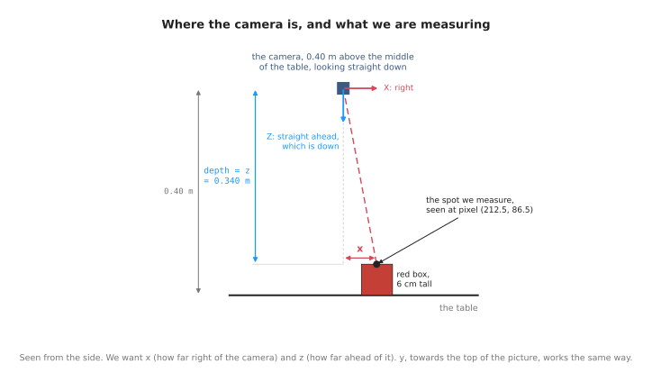
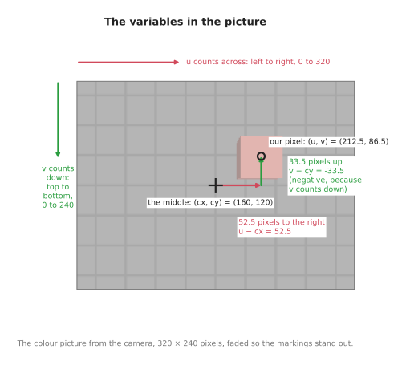
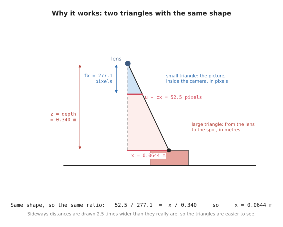
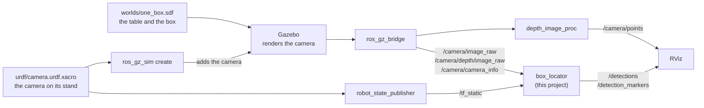
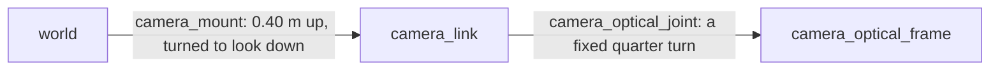

# Finding one box with a camera

## The problem

A box is sitting on a table, and a robot arm has to pick it up. Before it can,
the arm needs to know two things about the box: **where it is** on the table, and
**how tall it is**, so that it knows how far down to reach.

In this doc we measure both with one depth camera. The camera hangs 40 cm above
the middle of the table and looks straight down, and it is the only thing doing
the measuring: nothing tells it where the box is, or how big it is.


The box is a 6 cm cube, and its middle is 6.5 cm to the right of the middle of the
table and 4 cm towards the top of the picture. We know those numbers because we
built the scene, but the camera does not, which makes it a fair test: by the end
of the doc, the camera's own measurement should match them.

Why use a camera for this? Because the robot cannot know ahead of time what will
be on the table, or where. Someone may have moved the box since last time. A
camera sees the whole table at once, in a fraction of a second, without touching
anything.

The table, the box and the camera are simulated in Gazebo, the robot simulator
most ROS projects use, and the code that finds the box is a small ROS 2 project,
`src/camera_one_box`, laid out the way a real robot arm's perception code is. The
pictures and numbers in this doc all come from that simulation.

This doc builds on [the basics](basics.md), which explain what a camera records
and the four numbers that describe its lens. Its first three sections go from
ideas to code: section 1 does the calculations, section 2 writes them as pseudo
code, and section 3 as Python, using the same libraries as the project. The rest
describes the project itself: how its pieces connect, how to run it, and where
things are in the code.

## Contents

1. [Calculations](#1-calculations)
   - [1.1 Pixel plus depth gives back the point](#11-pixel-plus-depth-gives-back-the-point)
     · [What we are doing](#what-we-are-doing)
     · [The variables](#the-variables)
     · [Why the calculation works](#why-the-calculation-works)
     · [Step by step](#step-by-step)
     · [The same steps as three formulas](#the-same-steps-as-three-formulas)
   - [1.2 Where the camera is](#12-where-the-camera-is)
     · [camera_to_world](#camera_to_world)
     · [Where the numbers come from](#where-the-numbers-come-from)
   - [1.3 What one capture contains](#13-what-one-capture-contains)
   - [1.4 The box, measured](#14-the-box-measured)
2. [Pseudo code](#2-pseudo-code)
   - [2.1 One pixel into one point](#21-one-pixel-into-one-point)
   - [2.2 From the camera into the room](#22-from-the-camera-into-the-room)
   - [2.3 Measuring the box](#23-measuring-the-box)
3. [Python code](#3-python-code)
   - [3.1 Reading the capture](#31-reading-the-capture)
   - [3.2 One pixel into one point](#32-one-pixel-into-one-point)
   - [3.3 From the camera into the room](#33-from-the-camera-into-the-room)
   - [3.4 Every pixel at once](#34-every-pixel-at-once)
   - [3.5 Measuring the box](#35-measuring-the-box)
4. [The project: how it runs](#4-the-project-how-it-runs)
   - [4.1 The pieces](#41-the-pieces)
   - [4.2 The camera's two frames](#42-the-cameras-two-frames)
   - [4.3 The topics](#43-the-topics)
   - [4.4 Settings you can change](#44-settings-you-can-change)
5. [Running it](#5-running-it)
   - [5.1 The simulation](#51-the-simulation)
   - [5.2 Every pixel of the basic camera](#52-every-pixel-of-the-basic-camera)
   - [5.3 What is being published](#53-what-is-being-published)
6. [Working on the code](#6-working-on-the-code)
   - [6.1 Layout](#61-layout)
   - [6.2 Changing things](#62-changing-things)
7. [Notes and gotchas](#7-notes-and-gotchas)
8. [Vocabulary](#8-vocabulary)

---

## 1. Calculations

[The basics](basics.md) showed that each pixel gives a direction, and that the
depth picture gives a distance for every pixel. This section turns those two
facts into arithmetic, in four parts that build on one another. Section 1.1
turns one pixel and its depth reading into a point measured from the camera.
Section 1.2 moves that point into the room, using where the camera is and which
way it points. Section 1.3 shows everything one capture contains, including the
point cloud, which is every pixel turned into a point at once. Section 1.4 then
uses all of this to measure the red box: where it is on the table, and how tall
it is.

### 1.1 Pixel plus depth gives back the point

This is the part that the basics have been building up to, so it is worth
taking slowly, one idea at a time.

#### What we are doing

Before any calculation, it helps to picture the scene. The camera hangs 40
centimetres above the middle of the table, and it points straight down at it.
The red box stands on the table a little to one side of the middle, and because
the box is 6 centimetres tall, its top is 34 centimetres below the camera.
Because the camera points straight down, anything "in front of the camera" is
really below it, and we will keep using the phrase "in front of" because that
is how a camera sees the world.



In this section we pick one small spot on the top of the red box, and we work
out exactly where that spot is, measured from the camera. We want three
distances, all in metres. The first is how far the spot is to the right of the
camera, which we call `x`. The second is how far it is towards the bottom of
the picture, which we call `y`. The third is how far it is in front of the
camera, which we call `z`. The picture above shows `x` and `z` from the side,
while `y` runs across the table at right angles to the page, so it does not
show up in a side view.

We need these numbers because a robot arm cannot move to a pixel. A pixel only
tells us where the box appears in the picture, but the arm has to know where the
box really is in space, so turning pixels into distances is the step that
connects what the camera sees to what the arm can do.

The camera has already given us everything we need to find those three
distances, in two pictures taken at the same moment. The colour picture tells us
which pixel the spot appears in, and [section 3 of the
basics](basics.md#3-what-a-picture-loses) showed that a pixel tells us a
direction, meaning one straight line out from the lens. The depth picture tells
us, for that same pixel, how far away the surface is, as [section 4 of the
basics](basics.md#4-getting-distance-back-the-depth-picture) explained. Once we
know which line to follow and how far to go along it, we arrive at exactly one
point, and that point is the spot on the box.

#### The variables

To do the calculation we use seven numbers that we already know, and we get
three numbers back. Before using them, it is worth knowing what each one means
and where it comes from, so this part goes through them one by one, starting
with the picture itself.



A position in the picture is described by two directions, and it helps to name
them clearly. **Across** means along the width of the picture, from its left
edge to its right edge. **Down** means along the height of the picture, from
its top edge to its bottom edge. These are the two directions you would use to
describe a place on a printed photo lying on a desk, and in this picture
"across" is the camera's right, while "down" is towards the bottom of the
picture.

The first two numbers, `u` and `v`, say which pixel we are looking at. The number
`u` counts pixels across the picture, starting from 0 at the left edge and going
up to 320 at the right edge. The number `v` counts pixels down the picture,
starting from 0 at the top edge and going up to 240 at the bottom edge. The spot
we chose appears at `u = 212.5` and `v = 86.5`, which is on the top of the red
box. Both numbers end in `.5` because a pixel is a small square rather than a
point, and we want the middle of that square: pixel number 212 covers the strip
from 212 to 213, so its middle is at 212.5.

The next two numbers, `cx` and `cy`, give the position of the middle of the
picture. The picture is 320 pixels wide and 240 pixels tall, so its middle is at
`cx = 160` across and `cy = 120` down. The middle matters because anything
exactly in front of the camera appears there, which makes it the natural place
to measure every other pixel from, and the diagram above shows it as a cross.

The fifth number is the `depth` reading for our pixel, which we read from the
depth picture at the same `u` and `v`. For our pixel it is `0.340` metres. As
[section 4 of the basics](basics.md#4-getting-distance-back-the-depth-picture)
explained, this distance is measured straight out in the direction the camera
points, and not along the slanted line from the lens to the spot. That detail is
what will make the last step of the calculation so simple.

The last two numbers, `fx` and `fy`, are the focal length of the lens, measured
in pixels, which [section 6 of the basics](basics.md#6-the-lens-as-four-numbers)
introduced. They describe how zoomed in the camera is, and they have a simple
meaning that we will rely on in a moment: a point that is as far to the side of
the camera as it is in front of it appears exactly `fx` pixels from the middle
of the picture. In our camera both numbers are `277.1`, and they are equal
because the pixels are square.

The three numbers that come out, `x`, `y` and `z`, are the distances described
at the start of this section. They are measured along the camera's own axes from
[section 6 of the basics](basics.md#6-the-lens-as-four-numbers), which point the
same ways as the picture: `x` points across, to the right, `y` points down the
picture, and `z` points straight out of the lens.

Here are all ten together, for looking things up later:

| Name | What it is | Where it comes from | For our pixel |
| --- | --- | --- | --- |
| `u` | the pixel's position across the picture, counted from the left edge | the pixel we picked | 212.5 |
| `v` | the pixel's position down the picture, counted from the top edge | the pixel we picked | 86.5 |
| `cx` | the middle of the picture, across | the four lens numbers ([section 6 of the basics](basics.md#6-the-lens-as-four-numbers)) | 160 |
| `cy` | the middle of the picture, down | the four lens numbers | 120 |
| `depth` | how far in front of the camera the spot is, in metres | the depth picture, at the same pixel | 0.340 |
| `fx` | the focal length across, in pixels | the four lens numbers | 277.1 |
| `fy` | the focal length down, in pixels | the four lens numbers | 277.1 |
| `x` | **answer:** how far to the right of the camera, in metres | worked out below | |
| `y` | **answer:** how far towards the bottom of the picture, in metres | worked out below | |
| `z` | **answer:** how far in front of the camera, in metres | worked out below | |

#### Why the calculation works

Before doing any arithmetic, it helps to see why the calculation works, because
then each step will make sense instead of being a rule to memorise. The reason
is that there are two triangles with exactly the same shape.



Light from the spot on the box travels to the camera in a straight line, passes
through the lens, and lands on the picture inside the camera. That one straight
line makes two triangles. The small triangle is inside the camera, between the
lens and the picture. Its long side, pointing straight out of the lens, is the
focal length `fx`, and its short side, pointing across, is how far the pixel is
from the middle of the picture, which is `u - cx`. The large triangle is outside
the camera, between the lens and the spot. Its long side, pointing straight out
of the lens, is the depth `z`, and its short side, pointing across, is `x`, the
distance we want to find.

Both triangles have a right angle, and both have the same angle at the lens,
because the light travels in one straight line. Two triangles with the same
angles always have the same shape, even when one is much bigger than the other,
and even when one is measured in pixels while the other is measured in metres.
Because the shapes are the same, the short side divided by the long side gives
the same answer in both triangles:

```
(u - cx) / fx  =  x / z
```

For our pixel, the left side is `52.5 / 277.1`, which is about `0.19`. This
number is the direction from [section 3 of the
basics](basics.md#3-what-a-picture-loses), written as a number: it says that the
line from the lens moves 0.19 metres to the right for every metre it goes
forwards. Since we know the line goes 0.340 metres forwards before it reaches
the box, we can find how far to the right it has moved by that point, and that
is exactly `x`. The steps below do this calculation carefully, and the same
reasoning, turned on its side, gives `y` from `v` and `cy`.

#### Step by step

We can now work through the calculation for the spot on the red box, one step
at a time, using the numbers from the table above.

**Step 1: find how far the pixel is from the middle of the picture.** Both
triangles start from the line that points straight out of the lens, and that
line lands on the middle of the picture. So the first thing we need is the
number of pixels between our pixel and the middle, first across and then down:

```
pixels to the right of the middle = u - cx = 212.5 - 160 =  52.5
pixels below the middle           = v - cy =  86.5 - 120 = -33.5
```

The first result tells us that the pixel is 52.5 pixels to the right of the
middle. The second result is negative because `v` counts downwards and 86.5 is
smaller than 120, which means that our pixel is 33.5 pixels *above* the middle
rather than below it.

**Step 2: find how much of the table one pixel covers at that distance.** A
pixel does not cover a fixed amount of the world, because a camera takes in more
of the world the further away it looks. When a pixel looks at something close to
the camera, it covers a tiny patch, and when the same pixel looks at something
far away, it covers a much larger patch. The triangles tell us exactly how
large the patch is. Since `fx` pixels in the picture match a distance across
that is equal to the depth, a single pixel matches a distance of the depth
divided by `fx`:

```
one pixel covers = depth / fx = 0.340 / 277.1 = 0.001227 metres
```

This means that at the height of the box top, each pixel covers about 1.2
millimetres. It is the same idea as the last column of the tables in [section 7
of the basics](basics.md#7-field-of-view-and-resolution-are-separate-knobs),
where one pixel covered 1.44 millimetres of the table, which is 0.40 metres
away. The box top is 6 centimetres closer to the camera than the table, so each
of its pixels covers a little less.

**Step 3: turn the distance in pixels into a distance in metres.** We now know
that the pixel is 52.5 pixels to the right of the middle, and that each pixel
covers 0.001227 metres at that distance. Multiplying these two numbers together
gives the distance to the right in metres, and doing the same with the pixels
below the middle gives the distance down the picture:

```
x = pixels to the right × one pixel =  52.5 × 0.001227 = +0.0644 metres
y = pixels below        × one pixel = -33.5 × 0.001227 = -0.0411 metres
```

**Step 4: find how far in front of the camera the spot is.** This last distance
needs no calculation at all, because it is the depth reading itself:

```
z = depth = 0.340 metres
```

This is where the detail from [section 4 of the
basics](basics.md#4-getting-distance-back-the-depth-picture) pays off. The depth
is measured straight out from the lens, rather than along the slanted line, so
it is already the long side of the large triangle, and we can use it exactly as
it is.

When we put the three results together, the spot is at `(+0.0644, -0.0411,
0.340)` metres, measured from the camera. In everyday terms, the spot on top of
the red box is 6.4 centimetres to the right of the camera, 4.1 centimetres
towards the top of the picture, and 34 centimetres in front of the camera. The
value of `y` is negative, and that is correct, because `y` measures distance
towards the bottom of the picture, while this spot sits towards the top.

#### The same steps as three formulas

The four steps are usually written in a shorter form, as three formulas. The
first two formulas do steps 1, 2 and 3 in one line each, one for `x` and one for
`y`, and the third formula is step 4:

```
x = (u - cx) · depth / fx
y = (v - cy) · depth / fy
z =  depth
```

Turning a pixel and a depth back into a point in this way is called
**deprojection**, because it undoes what the camera did when it took the
picture. It is the exact reverse of the formula in [section 6 of the
basics](basics.md#6-the-lens-as-four-numbers), which starts from a point and
works out which pixel that point lands on. We can check this by putting our
answer back into that formula: `277.1 × 0.0644 / 0.340 + 160` comes to 212.5,
which is the pixel we started from. The two formulas are really one formula,
read in two directions.

One small detail is worth repeating, because it causes real mistakes. If we used
the corner of the pixel, 212, instead of its middle, 212.5, the answer would move
by half a pixel. That sounds too small to matter, but at the edge of a box, half
a pixel can be the difference between a point on the box and a point on the
table behind it.

The picture below shows the whole journey in one place: the pixel and its depth
on the left, the arithmetic we have just done in the middle, and, on the right,
the point placed in the room. That last part is still to come.


The point we have found is measured from the camera, not from the room. To use
it, the robot also needs to know where the camera is and which way it points,
and section 1.2 explains that step next. The same four steps appear again as
pseudo code in section 2.1 and as Python code in section 3.2.

### 1.2 Where the camera is

The point we found in section 1.1 is measured from the camera, so what it really
says is "34 centimetres in front of me, and a little to the right". That is not
yet useful to the arm, because the arm needs to know where things are in the
room, not where they are compared with the camera. To turn one into the other,
we also need to know where the camera is and which way it points, and together
those two things are called the camera's **pose**. Every picture has to come
with the pose it was taken from, because without it, the picture's numbers
cannot be placed anywhere in the room.

#### camera_to_world

The pose is usually kept as one table of numbers, called **camera_to_world**,
because it takes a point measured from the camera and gives the same point
measured in the room, which is also called the world. For the camera in this
doc, which hangs 40 centimetres above the middle of the table and looks straight
down, the table is:

|  | camera's RIGHT | camera's DOWN | camera's FORWARD | camera's POSITION |
| --- | :---: | :---: | :---: | :---: |
| world x | 1 | 0 | 0 | 0.00 |
| world y | 0 | −1 | 0 | 0.00 |
| world z | 0 | 0 | −1 | 0.40 |
|  | 0 | 0 | 0 | 1 |

The table is easiest to read one column at a time. The last column says where
the camera is, measured in metres from the middle of the table, and it shows
that the camera is 0.40 metres straight up. The first three columns are
directions, and each of them says which way one of the camera's own axes points
in the room. The camera's right points along the room's x, so the first column
is `(1, 0, 0)`. The camera's down, towards the bottom of the picture, points
along the room's negative y, so the second column is `(0, −1, 0)`. The camera's
forward points straight down at the table, which is the room's negative z, so
the third column is `(0, 0, −1)`. The bottom row is always `0 0 0 1` and carries
no information of its own. It is only there so that a computer can do the
turning and the shifting in a single multiplication.

This is the same idea as a transform in the [arm area](../arm/overview.md): a
turn and a shift, kept together.

Using the table is simpler than it looks. We start at the camera's position,
then walk `x` along the camera's right, `y` along its down, and `z` along its
forward, and wherever we end up is the point in the room. For the spot on the
red box, we start at the camera, 0.40 metres above the middle of the table.
Walking 0.0644 metres along the camera's right moves us 0.0644 metres along the
room's x. Walking −0.0411 metres along the camera's down means walking 0.0411
metres the opposite way, which is towards the room's positive y. Finally,
walking 0.340 metres along the camera's forward takes us 0.340 metres straight
down, which leaves us 0.060 metres above the table. So the spot is at
`(+0.0644, +0.0411, +0.0600)` in the room.

That last number, 0.060 metres, is exactly the height of the red box, even
though nothing in the calculation was told how tall the box is. The height came
from the depth reading and the camera's pose alone. Notice also that `y` changed
sign on the way into the room. For this camera, "down the picture" points along
the room's negative y, so a spot towards the top of the picture has a positive
y in the room.

#### Where the numbers come from

Nobody types this table in. In the project, it comes from the camera's
description, the file `urdf/camera.urdf.xacro`, which says where the stand holds
the camera. Its joint `camera_mount` puts `camera_link` 0.40 metres above the
middle of the table, turned a quarter turn down so that the lens looks at the
table, and a quarter turn around so that the room's +Y comes out at the top of
the picture. A second joint turns `camera_optical_frame` so that its axes match
the picture, as [section 4.2](#42-the-cameras-two-frames) explains.

robot_state_publisher reads that description and publishes both joints on TF,
the part of ROS that keeps track of where every frame is. When the box locator
needs `camera_to_world`, it asks TF for the transform from `world` to
`camera_optical_frame`, and TF joins the two joints together. The answer comes
back as a translation and a quaternion rather than a table, and the function
`transform_matrix()` in `measure.py` turns it into exactly the table above.

### 1.3 What one capture contains

So far we have used two pictures from each capture: the colour picture and the
depth picture. A real camera, and the ROS messages that carry its pictures, can
give the same shot in a few more forms, all the same size and all describing the
same pixels. ROS tells them apart by their **encoding**, which is a short name
that says what the numbers in each pixel mean. The encodings are worth knowing,
because reading a picture in the wrong encoding is one of the most common bugs
in camera code.

| Picture | Encoding | Each pixel holds | At the red box pixel |
| --- | --- | --- | --- |
| colour | `rgb8` | red, green, blue, 0 to 255 each | `(202, 121, 112)` |
| grey | `mono8` | brightness, 0 to 255 | `144` |
| depth | `32FC1` | distance, in metres | `0.3400` |
| depth | `16UC1` | distance, in whole millimetres | `340` |

The **colour** picture, `rgb8`, is what most people mean by "a camera". Each
pixel holds three numbers from 0 to 255, one each for red, green and blue. On its
own it is the least useful picture for our job, because it gives directions and
appearance but no measurements.

The **grey** picture, `mono8`, holds a single brightness number for each pixel,
so it is a third of the size of the colour picture. A lot of vision work, such as
finding edges and corners or following something as it moves, never looks at
colour, so the smaller picture is enough. The brightness is not the plain
average of red, green and blue, because the human eye is much more sensitive to
green than to blue. To match what a person sees, grey weights them `0.299` for
red, `0.587` for green and `0.114` for blue.

The **depth** picture comes in two forms, and they are easy to mix up. `32FC1`
holds the distance in metres, as a decimal number, while `16UC1` holds the same
distance in whole millimetres. They are the same measurement written in two
ways, but if a program reads one as the other, every distance comes out a
thousand times too big or too small.

A colour-only camera, such as the Raspberry Pi camera from [section 5 of the
basics](basics.md#5-the-cameras-used-in-these-docs), gives only the first two
forms, colour and grey. It has no depth to report, so it never produces either
of the depth forms.

One more thing comes out of the same shot, and for a robot it is the most useful
one: a **point cloud**. A point cloud is what we get when we take every pixel
that has a depth reading and turn it into a point, with the calculation from
section 1.1. In the project, a standard ROS package called `depth_image_proc`
does this for all 76,800 pixels and publishes the result on `/camera/points`.
It leaves the points measured from the camera, and RViz moves them into the room
using TF, exactly as section 1.2 describes. Here are two points, worked out with
the calculation from section 1.1 and moved into the room:

| Landed on | x | y | z |
| --- | --- | --- | --- |
| the table, at pixel (0.5, 0.5) | −0.230 | 0.172 | 0.000 |
| the red box, at pixel (212.5, 86.5) | 0.064 | 0.041 | 0.060 |

In every point, `z` is the height of whatever that pixel landed on, which is 0
for the table and 0.060 for the red box. This is the form the rest of a robot
wants, because a picture is a grid of directions, while a point cloud is a
collection of places, and places can be grouped, measured and picked up. This is
also where a colour-only camera falls short: the Raspberry Pi camera has no depth
reading for any of its pixels, so it cannot make a point cloud on its own.

A real depth camera never fills in every pixel. Shiny, dark or see-through
surfaces, and anything too near or too far away, come back with no reading at
all. Gazebo's camera fills in every pixel in this scene, but the project's code
still treats a missing reading as missing: `depth_to_points()` keeps it as NaN,
and `measure_box()` leaves NaN points out, rather than filling them with a
made-up value, because a made-up value would put a surface where there is none.

### 1.4 The box, measured

Everything is now in place to measure the box. Section 1.1 showed how to turn one
pixel into a point measured from the camera, and section 1.2 showed how to move
that point into the room, so measuring the whole box needs only four steps.

The first step is to turn every pixel into a point in the room, using the
calculations from sections 1.1 and 1.2. The second step is to keep only the
points that stand more than a centimetre above the table. With one box on the
table, those are the points on the box: 2,582 of them. They are a few fewer than
the 2,624 readings that landed on the box, because the lowest part of its side
is less than a centimetre above the table, and it is left out along with the
table. The third step is to keep only the highest of those points, the ones
within a millimetre of the highest, because those are the top of the box. This
step is needed because the thin strip of the box's side from
[section 4 of the basics](basics.md#4-getting-distance-back-the-depth-picture)
also stands above the table, but lower than the top. That leaves 2,401 points:
the 2,352 on the top itself and 49 from the very top of the side. The fourth step
is to average the points that are left. The average position of the top is the
middle of the box, and the height of the top is how tall the box is.

Nothing about the box was looked up along the way. The answer comes only from the
depth readings, the four lens numbers, and where the camera was.

The table below compares the answer with the true values, which we know because
we built the scene. Positions are in metres from the middle of the table, which
is the spot straight under the camera.

| Box | Measured middle | True middle | Measured height | True height |
| --- | --- | --- | --- | --- |
| red | (+0.064, +0.040) | (+0.065, +0.040) | 0.060 m | 0.060 m |

The middle is within a millimetre of the truth, and the height is exact, so the
red box has been measured from one picture. In the project, this calculation is
`measure_box()` in `camera_one_box/measure.py`. The `box_locator` node runs it on
every picture the camera sends, prints the answer in the terminal, and publishes
it for the rest of the robot. Sections 2 and 3 show the same four steps as pseudo
code and as Python.

---

## 2. Pseudo code

The pseudo code below repeats the calculations from section 1 without the
explanations, so that the whole job can be seen in one place. It is split into
the same pieces as section 1, so each piece can be read side by side with the
part that explains it.

### 2.1 One pixel into one point

This piece follows the four steps from section 1.1, in the same order. It starts
from one pixel and its depth reading, and it ends with a point measured from the
camera.

```
the goal: turn one pixel on the red box into one point, measured from the camera

what we start with:
    u, v        which pixel: how far across from the left, and how far down from the top
    depth       the depth reading at that pixel, in metres
    fx, fy      the focal length, in pixels            (the four lens numbers)
    cx, cy      the middle of the picture, in pixels   (the four lens numbers)

step 1: how far is the pixel from the middle of the picture?
    pixels_right = u - cx
    pixels_down  = v - cy

step 2: how much does one pixel cover, at that distance?
    size_across = depth / fx
    size_down   = depth / fy

step 3: turn pixels into metres
    x = pixels_right * size_across
    y = pixels_down  * size_down

step 4: how far in front of the camera?
    z = depth

the answer is the point (x, y, z)
```

### 2.2 From the camera into the room

This piece follows section 1.2. It starts from the point that 2.1 gives back,
which is measured from the camera, and it ends with the same point measured in
the room.

```
the goal: move one point from the camera's axes into the room's axes

what we start with:
    x, y, z             the point, measured from the camera           (from 2.1)
    camera_to_world     where the camera is, and which way it points  (section 1.2)
        right           the camera's right, as a direction in the room      first column
        down            the camera's down, as a direction in the room       second column
        forward         the camera's forward, as a direction in the room    third column
        position        where the camera is, in the room                    last column

start at the camera:
    point_in_room = position

walk along the camera's own three directions:
    point_in_room = point_in_room + x * right
    point_in_room = point_in_room + y * down
    point_in_room = point_in_room + z * forward

the answer is point_in_room
```

### 2.3 Measuring the box

This last piece is the whole job from section 1.4. It runs the two pieces above
for every pixel, and then keeps and averages the top of the box.

```
the goal: find where the box is on the table, and how tall it is

what we start with:
    the depth picture from one capture
    the four lens numbers, and camera_to_world

step 1: turn every pixel into a point in the room
    points = an empty list
    for each pixel in the depth picture:
        u, v  = the middle of that pixel
        point = one pixel into one point         (2.1)
        point = from the camera into the room    (2.2)
        add point to points

step 2: keep the points standing on the table
    standing = the points whose z is more than 0.01 above the table

step 3: keep only the top of the box
    top_height = the highest z among the standing points
    top        = the standing points whose z is within a millimetre of top_height

step 4: average the top
    middle = the average x and the average y of the points in top
    height = top_height

the answer is the middle of the box, and its height
```

---

## 3. Python code

The Python code below does the same calculations once more, in the same pieces
as the pseudo code, so each piece can be matched with the pseudo code above it.
Most pieces first write the step out by hand, and then do it again with the
library that a real robot project would use, which is also what the project's
own code uses.

The pieces work on a real capture from the Gazebo camera, recorded into a
rosbag, which is the usual way to keep camera data for testing. It lives in
`src/camera_one_box/test/data/one_box`, and the project's tests use the same one.
To try the pieces yourself, run `make shell`, start `python` from the top of the
repo, and paste them in order, because the later pieces use what the earlier
ones made.

### 3.1 Reading the capture

A rosbag stores each message exactly as it travelled over ROS, so reading one
back gives the same messages the box locator receives: the colour picture, the
depth picture, the camera info with the four lens numbers, and the static
transforms that say where the camera is.

```python
import rosbag2_py
from rclpy.serialization import deserialize_message
from rosidl_runtime_py.utilities import get_message

reader = rosbag2_py.SequentialReader()
reader.open(rosbag2_py.StorageOptions(uri='src/camera_one_box/test/data/one_box',
                                      storage_id='mcap'),
            rosbag2_py.ConverterOptions('', ''))
types = {topic.name: topic.type for topic in reader.get_all_topics_and_types()}
capture = {}
while reader.has_next():
    topic, data, _ = reader.read_next()
    capture[topic] = deserialize_message(data, get_message(types[topic]))
print(sorted(capture))
```

When it runs, it prints the four topics the capture holds:

```
['/camera/camera_info', '/camera/depth/image_raw', '/camera/image_raw', '/tf_static']
```

### 3.2 One pixel into one point

The first version writes the four steps from section 1.1 out one line at a time,
so that each step can be seen and checked on its own. It uses the same numbers
as section 1.1, and it prints the same answer.

```python
def pixel_to_point(u, v, depth, fx, fy, cx, cy):
    """Turn one pixel and its depth reading into a 3D point, measured from the camera."""
    pixels_right = u - cx             # step 1: how far right of the middle, in pixels
    pixels_down = v - cy              #         how far below the middle, in pixels
    size_across = depth / fx          # step 2: how much one pixel covers, in metres
    size_down = depth / fy
    x = pixels_right * size_across    # step 3: pixels into metres
    y = pixels_down * size_down
    z = depth                         # step 4: straight ahead is the depth itself
    return x, y, z


x, y, z = pixel_to_point(u=212.5, v=86.5, depth=0.340, fx=277.1, fy=277.1, cx=160, cy=120)
print(f'x = {x:+.4f} m, y = {y:+.4f} m, z = {z:+.4f} m')
```

When it runs, it prints:

```
x = +0.0644 m, y = -0.0411 m, z = +0.3400 m
```

A real project reads the four lens numbers from the camera info instead of
typing them in, and the standard way to do that in Python is `image_geometry`.
Its `PinholeCameraModel` holds the lens, and `project_pixel_to_3d_ray()` turns a
pixel into a direction: a line from the lens, one metre long, pointing at that
pixel. Stretching the line until it is as far ahead as the depth reading gives
the point. The depth picture itself comes from `cv_bridge`, which turns an image
message into a NumPy array.

```python
from cv_bridge import CvBridge
from image_geometry import PinholeCameraModel

camera = PinholeCameraModel()
camera.from_camera_info(capture['/camera/camera_info'])        # fx, fy, cx, cy
depth = CvBridge().imgmsg_to_cv2(capture['/camera/depth/image_raw'],
                                 desired_encoding='32FC1')

u, v = 212.5, 86.5
d = float(depth[int(v), int(u)])                   # 0.340, read from the depth picture
ray = camera.project_pixel_to_3d_ray((u, v))       # the direction, one metre long
point = [c * d / ray[2] for c in ray]              # stretched until it is d ahead
print(f'x = {point[0]:+.4f} m, y = {point[1]:+.4f} m, z = {point[2]:+.4f} m')
```

It prints the same point, because it is the same calculation:

```
x = +0.0644 m, y = -0.0411 m, z = +0.3400 m
```

### 3.3 From the camera into the room

This piece takes the point from 3.2 and moves it into the room. It writes the
walk from section 1.2 out in full, with the four columns of `camera_to_world`
typed in by hand.

```python
def camera_to_room(point, right, down, forward, position):
    """Start at the camera, then walk x along its right, y along its down, z along its forward."""
    x, y, z = point
    return (
        position[0] + x * right[0] + y * down[0] + z * forward[0],
        position[1] + x * right[1] + y * down[1] + z * forward[1],
        position[2] + x * right[2] + y * down[2] + z * forward[2],
    )


right = (1, 0, 0)         # the first three columns of camera_to_world:
down = (0, -1, 0)         # which way the camera's right, down and forward
forward = (0, 0, -1)      # point in the room
position = (0, 0, 0.40)   # the last column: where the camera is

room = camera_to_room((0.0644, -0.0411, 0.340), right, down, forward, position)
print(f'in the room: x = {room[0]:+.4f} m, y = {room[1]:+.4f} m, z = {room[2]:+.4f} m')
```

When it runs, it prints the point from section 1.2, with the height of the box
as its last number:

```
in the room: x = +0.0644 m, y = +0.0411 m, z = +0.0600 m
```

A real project asks TF instead. The capture holds the static transforms that
robot_state_publisher published, so they can go into a TF buffer and be looked
up as if the robot were running. `tf2_geometry_msgs` then moves a point from one
frame to another, given the transform between them.

```python
from geometry_msgs.msg import PointStamped
from rclpy.time import Time
import tf2_geometry_msgs
from tf2_ros import Buffer

tf_buffer = Buffer()
for transform in capture['/tf_static'].transforms:
    tf_buffer.set_transform_static(transform, 'recorded')
camera_to_world = tf_buffer.lookup_transform('world', 'camera_optical_frame', Time())

spot = PointStamped()
spot.header.frame_id = 'camera_optical_frame'
spot.point.x, spot.point.y, spot.point.z = point
p = tf2_geometry_msgs.do_transform_point(spot, camera_to_world).point
print(f'in the room: x = {p.x:+.4f} m, y = {p.y:+.4f} m, z = {p.z:+.4f} m')
```

It prints the same point in the room, `(+0.0644, +0.0411, +0.0600)`.

### 3.4 Every pixel at once

A real program wants every pixel rather than just one, and NumPy can work out
all 76,800 of them in a single calculation. The formula does not change at all.
The only difference is that `u`, `v` and `depth` become whole grids of numbers,
one for every pixel, instead of single numbers.

```python
import numpy as np

rows, cols = depth.shape
v, u = np.mgrid[0:rows, 0:cols] + 0.5              # every pixel's middle
x = (u - camera.cx()) * depth / camera.fx()
y = (v - camera.cy()) * depth / camera.fy()
z = depth
print(depth.shape, x[86, 212].round(4), y[86, 212].round(4), z[86, 212].round(4))
```

It prints the size of the picture, and then our pixel's point once again:

```
(240, 320) 0.0644 -0.0411 0.34
```

These lines are `depth_to_points()` in the project's `measure.py`. The result is
one point for every pixel, measured from the camera, which is the point cloud from
section 1.3.

### 3.5 Measuring the box

This last piece is the whole job from section 1.4, and it follows the four steps
of the pseudo code in section 2.3. It moves every point into the room with the
transform from 3.3, turned into the table from section 1.2 by
`transform_matrix()`.

```python
from camera_one_box.measure import depth_to_points, measure_box, to_world, transform_matrix

t, q = camera_to_world.transform.translation, camera_to_world.transform.rotation
matrix = transform_matrix((t.x, t.y, t.z), (q.x, q.y, q.z, q.w))

# step 1: every pixel becomes a point in the room
points = to_world(depth_to_points(depth, camera.fx(), camera.fy(), camera.cx(), camera.cy()),
                  matrix)
# step 2: keep the points standing more than a centimetre above the table
standing = points[points[:, 2] > 0.01]
# step 3: keep the top, the points within a millimetre of the highest one
top_z = standing[:, 2].max()
top = standing[standing[:, 2] > top_z - 0.001]
# step 4: the average of the top is the middle of the box
print(f'{len(points):,} points, {len(standing):,} standing on the table, {len(top):,} on the top')
print(f'middle = ({top[:, 0].mean():+.3f}, {top[:, 1].mean():+.3f}) m, height = {top_z:.3f} m')
```

When it runs, it finds the points from section 1.4 and prints the answer:

```
76,800 points, 2,582 standing on the table, 2,401 on the top
middle = (+0.064, +0.040) m, height = 0.060 m
```

The project does steps 2 to 4 in `measure_box()`, which the box locator calls on
every picture:

```python
box = measure_box(points)
print(f'middle = ({box.x:+.3f}, {box.y:+.3f}) m, height = {box.height:.3f} m')
```

It gives the same answer, `middle = (+0.064, +0.040) m, height = 0.060 m`.

---

## 4. The project: how it runs

Sections 1 to 3 are the ideas. This section is the practical side: how the
pieces of the `camera_one_box` project fit together, which topics carry the
pictures, and what you can change without editing any code.

### 4.1 The pieces

The project has the usual shape of a simulated robot. Every piece is a standard
ROS 2 or Gazebo tool except one, the box locator, which is the project's own
code, and the launch file `launch/one_box.launch.py` starts them all together.



Each piece has one job, and they hand their work on in this order:

1. **The camera description**, `urdf/camera.urdf.xacro`, says where the camera
   is and what it sees. It is written in xacro, which is URDF with variables,
   the same format used to describe a robot arm. It describes a camera on a
   fixed stand, 0.40 metres above the table, and its two `<sensor>` blocks tell
   Gazebo what each camera should see.
2. **robot_state_publisher** reads that description and publishes its frames
   on TF, so that every other node can ask where the camera is.
3. **Gazebo** loads the world, `worlds/one_box.sdf`, which holds the table, the
   box and a light. `ros_gz_sim create` then adds the camera to the world from
   the same description, the way a robot arm would be added. On macOS, Gazebo
   runs without its window, because there the window has to be a separate
   process.
4. **ros_gz_bridge** copies the camera's pictures from Gazebo's own message
   system onto ROS topics, as listed in `config/bridge.yaml`. It uses the same
   topic names a real camera driver uses, so any ROS tool that works with a real
   camera works with this one. It also copies `/clock`, Gazebo's simulated time,
   which every node in the launch file uses.
5. **depth_image_proc** turns the depth picture into a point cloud. It is the
   standard ROS package for this, and it runs inside a component container,
   which is how ROS runs image-processing nodes efficiently.
6. **box_locator** is the project's own node. It takes each depth picture
   together with its camera info, asks TF where the camera is, measures the box
   with `measure.py`, and publishes the answer.
7. **RViz** shows all of it: the frames, the camera on its stand, the point cloud,
   both pictures, and the measured box.

### 4.2 The camera's two frames

[Section 6 of the basics](basics.md#6-the-lens-as-four-numbers) gave the
camera's axes as X right, Y down and Z forward, to match the picture. The rest of
a robot uses a different habit, X forward, Y left and Z up, and ROS keeps both,
as two frames in the same place.


| Frame | Axes | Used for |
| --- | --- | --- |
| `camera_link` | X forward, Y left, Z up | attaching the camera to the stand, like any other part of a robot |
| `camera_optical_frame` | X right, Y down, Z forward | stamping the pictures, so that the formulas stay short |

The two frames are joined by a fixed quarter turn that never changes. As a
quaternion it is `(-0.5, 0.5, -0.5, 0.5)`, the same on every ROS camera, although
robot_state_publisher happens to publish it with every sign flipped, as
`(0.5, -0.5, 0.5, -0.5)`. That is the same turn, because a quaternion and its
negative always describe the same rotation. The whole chain of frames looks like
this:



Both joints are fixed, so robot_state_publisher publishes them once, on
`/tf_static`. Gazebo stamps every picture with `camera_optical_frame`, because the
camera description sets `<gz_frame_id>` to it.

**This is the most common camera bug in ROS.** If a picture is stamped with
`camera_link` instead of the optical frame, nothing complains. The point cloud
just comes out lying on its side, turned a quarter turn, and it looks like a
mistake in your own maths.

### 4.3 The topics

These are the topics the running project publishes, and who publishes each one:

| Topic | Type | Published by | What it carries |
| --- | --- | --- | --- |
| `/camera/image_raw` | `sensor_msgs/Image`, `rgb8` | ros_gz_bridge | the colour picture, 320 × 240 |
| `/camera/depth/image_raw` | `sensor_msgs/Image`, `32FC1` | ros_gz_bridge | the depth picture, in metres |
| `/camera/camera_info` | `sensor_msgs/CameraInfo` | ros_gz_bridge | the four lens numbers, as `K` |
| `/camera/points` | `sensor_msgs/PointCloud2` | depth_image_proc | one point per pixel, measured from the camera |
| `/basic_camera/...` | the same three | ros_gz_bridge | the same, from the 80 × 60 basic camera |
| `/tf_static` | `tf2_msgs/TFMessage` | robot_state_publisher | the camera's two fixed joints |
| `/clock` | `rosgraph_msgs/Clock` | ros_gz_bridge | Gazebo's simulated time |
| `/detections` | `vision_msgs/Detection3DArray` | box_locator | the measured box, for the rest of the robot |
| `/detection_markers` | `visualization_msgs/MarkerArray` | box_locator | the same box, drawn as a cube in RViz |

`/detections` is the topic a grasp planner would read. `vision_msgs` is the
standard set of messages for things a robot has detected, so the box arrives as a
bounding box, with its middle, its size and a label, in the `world` frame.

### 4.4 Settings you can change

The launch file takes a few arguments, so the camera can be changed without
editing any code. Pass them after the launch command, as `name:=value`:

```
ros2 launch camera_one_box one_box.launch.py hfov_deg:=90 rviz:=false
```

| Argument | Default | What it does |
| --- | --- | --- |
| `width` | 320 | pixels across |
| `height` | 240 | pixels down |
| `hfov_deg` | 60 | how wide the camera sees, in degrees. Try 90 for wide, or 30 for zoomed in |
| `rviz` | true | open RViz |
| `gui` | false | also open Gazebo's own window |

The box locator has three parameters of its own:

| Parameter | Default | What it does |
| --- | --- | --- |
| `world_frame` | `world` | the frame the box is reported in |
| `table_z` | 0.0 | how high the table top is |
| `min_height` | 0.01 | how far above the table a point must be to count as the box |

How high the stand holds the camera is the argument `mount_height` in the
camera description, which is 0.40 metres unless you change its default in
`urdf/camera.urdf.xacro`.

---

## 5. Running it

The project has three commands. The first one starts everything, and the other
two look at it while it runs.

### 5.1 The simulation

```
make camera.one_box
```

This builds the workspace and starts the launch file from section 4.1. Gazebo
takes a few seconds to load the world and add the camera, and then the box
locator starts printing what it measures, every two seconds:

```
box: middle (+0.064, +0.040) m, height 0.060 m, from 2,401 points on its top
```

RViz opens at the same time. It shows the grid, the frames `world`,
`camera_link` and `camera_optical_frame`, and the camera on its stand. Under the
camera it shows the point cloud, in colour, and the measured box as a see-through
cube around the red box. The colour picture and the depth picture have a panel
each. Press Ctrl-C in the terminal to stop everything.

### 5.2 Every pixel of the basic camera

```
make camera.pixels
```

Run this in a second terminal while the simulation is running. It waits for one
picture from the 80 × 60 basic camera, prints the colour picture and the depth
picture one coloured square per pixel, and then prints the actual depth readings
for a small patch on the left edge of the box:

```
              43     44     45     46     47     48     49     50
  row 19   0.400  0.400  0.400  0.373  0.340  0.340  0.340  0.340
  row 20   0.400  0.400  0.400  0.373  0.340  0.340  0.340  0.340
  row 21   0.400  0.400  0.400  0.373  0.340  0.340  0.340  0.340
  row 22   0.400  0.400  0.400  0.373  0.340  0.340  0.340  0.340
  row 23   0.400  0.400  0.400  0.373  0.340  0.340  0.340  0.340
```

The table reads 0.400, the top of the box reads 0.340, and the one column in
between is the side of the box, which the camera catches at an angle. The
pictures use 24-bit colour, which almost every modern terminal shows. If yours
prints strange characters instead, try a different terminal.

### 5.3 What is being published

```
make camera.check
```

Run this in a second terminal while the simulation is running, too. It lists the
topics, prints the camera info with the four lens numbers, and then prints one
message from each picture topic and one detection, with the large arrays of
numbers left out. If nothing is running, it says so, and tells you to start the
simulation first.

---

## 6. Working on the code

### 6.1 Layout

```
src/camera_one_box/
  README.md                          the commands, the main files and this layout
  launch/one_box.launch.py           starts everything in section 4.1 together
  urdf/camera.urdf.xacro             the camera on its stand, and its two sensors
  worlds/one_box.sdf                 the table and the box, for Gazebo
  worlds/textures/table_grid.png     the 5 cm grid printed on the table
  config/bridge.yaml                 which Gazebo topics become which ROS topics
  config/one_box.rviz                the saved RViz layout
  camera_one_box/box_locator.py      the node: finds the box and publishes it
  camera_one_box/measure.py          the maths from section 1, with no ROS in it
  camera_one_box/show_pixels.py      prints every pixel of the basic camera
  camera_one_box/save_snapshot.py    records one capture into a rosbag
  test/test_measure.py               checks the maths on a recorded capture
  test/data/one_box/                 that capture
docs/
  camera/basics.md                   the basics
  camera/one-box.md                  this file
  diagrams/record_camera.py          records the captures the diagrams use
  diagrams/camera.py                 draws the diagrams from those captures
  diagrams/captures/camera/          the captures
  images/camera/basics/              the pictures in the basics
  images/camera/one-box/             the pictures in this file
```

The split between `box_locator.py` and `measure.py` is deliberate. The node only
does ROS work: it receives messages, looks up TF and publishes results. All of
the maths is in `measure.py`, which works on plain NumPy arrays, so the tests can
check it on a recorded capture without starting Gazebo or ROS.

### 6.2 Changing things

**Move the box.** Its size and position are in `worlds/one_box.sdf`. Change
them, restart the simulation, and the box locator measures the new box. The tests
check the numbers in this doc against the recorded capture, so they keep passing
until you record a new one.

**Change the camera.** The launch arguments in section 4.4 change the
resolution and the field of view. Anything else, such as how often it takes a
picture or how near and far it can measure, is in the `<sensor>` block of
`urdf/camera.urdf.xacro`.

**Record a new capture.** With the simulation running, this saves one capture
into a rosbag, which is what the tests replay:

```
pixi run bash -c 'source install/setup.bash && \
  ros2 run camera_one_box save_snapshot src/camera_one_box/test/data/one_box'
```

It will not overwrite an existing folder, so delete the old one first.

**Redraw the pictures in these docs.** They are drawn from real captures, so
after changing the world or the camera, record the captures again and redraw:

```
pixi run python docs/diagrams/record_camera.py
pixi run python docs/diagrams/camera.py
```

**Use a real camera.** The box locator only reads the topics in section 4.3 and
the camera's frames on TF, so it works with any depth camera whose ROS driver
publishes the same topics and frames. Most do. The Raspberry Pi camera from
[section 5 of the basics](basics.md#5-the-cameras-used-in-these-docs) is not
enough on its own: its usual ROS 2 driver,
[`camera_ros`](https://github.com/christianrauch/camera_ros), runs on a Raspberry
Pi because the camera plugs into the Pi's camera connector, and it publishes the
colour picture on `/camera/image_raw` and the camera info on
`/camera/camera_info`, but nothing for depth, because the camera cannot measure
it.

---

## 7. Notes and gotchas

**Gazebo prints "Unable to load Ogre Plugin" on macOS.** Gazebo's renderer looks
for a Vulkan plugin, and macOS does not have Vulkan. It falls back to Metal,
Apple's own graphics system, and the cameras work, so this error can be ignored.

**Stopping with Ctrl-C can report "process has died, exit code -2".** When you
press Ctrl-C, the terminal sends the stop signal to every process, and the launch
system sends it again to each node it started. A Python node that is already
shutting down when the second signal arrives stops at once, and the launch
system reports that as a death. It is not a crash, and nothing is lost.

**Gazebo's own point cloud lies on its side.** Gazebo's depth camera can publish
a point cloud directly, but its points use the camera body's axes, X forward,
while they are stamped with the optical frame, Z forward. RViz would draw them
turned a quarter turn. That is why the project builds the cloud from the depth
picture with depth_image_proc instead, which is also how a real robot does it.

**Half a pixel.** Gazebo and these docs measure a pixel's position from its
top-left corner, so the middle of pixel number 212 is at 212.5, and Gazebo's
camera info puts `cx` at 160, the exact middle of a 320-pixel picture. OpenCV and
depth_image_proc follow a different habit, where pixel number 212 sits at
position 212. Their points therefore come out shifted by half a pixel, 0.6 mm
here. That is too small to see in RViz, but it is why `measure.py` adds 0.5.

**Every node uses Gazebo's clock.** The launch file sets `use_sim_time` on every
node, so that they all read the time from `/clock`, which Gazebo publishes. A
node that used the computer's clock instead would stamp its messages with a
different time from the pictures, and TF would refuse to look up transforms at
times it has never heard of.

**There is no lens distortion here.** Real lenses bend straight lines, wide ones
especially. Calibrating a camera gives five numbers describing the bend, which
`CameraInfo` carries as `d`. Gazebo's camera is perfect, so they are all zero,
and its pictures are already rectified, which is why the launch file can hand
the raw pictures to depth_image_proc. On a real camera they are not zero, and
ignoring them causes errors near the edges of the picture. The Raspberry Pi
camera is no exception, so measuring anything with it would start with
calibrating it.

**`16UC1` uses `0` for "no reading", and `32FC1` uses `NaN`**, which is short for
*not a number*. If a program forgets that `0` means missing, every hole in the
depth picture turns into a point sitting exactly inside the lens.

**`step` in an image message is the number of bytes in one row**, not the number
of pixels. If it is wrong, the picture comes out sheared diagonally. cv_bridge
handles this, which is one reason to use it rather than reading the bytes by
hand.

**Depth cameras have a range.** Anything too near or too far comes back with no
reading. This camera's range is 0.05 to 3.0 metres, set by `<clip>` in the camera
description.

**Gazebo lights the scene.** The colours in the pictures are not the colours in
the world file, because Gazebo shades each surface by how much light reaches it.
The table's grey, 148 in its texture, comes out as 121 in the picture, and the
side of the box facing away from the light is darker than its top.

---

## 8. Vocabulary

| Term | Full name | Meaning |
| --- | --- | --- |
| deprojection | — | pixel and depth in, 3D point out: the reverse of taking a picture |
| pose | — | where the camera is, and which way it points |
| camera_to_world | — | the pose, as a table of numbers |
| point cloud | — | a collection of 3D points, made from a depth picture |
| encoding | — | what the numbers in an image message mean: `rgb8`, `32FC1`, and so on |
| optical frame | — | the camera's picture-matching axes: X right, Y down, Z forward |
| TF | transform | the part of ROS that keeps track of where every frame is |
| URDF | Unified Robot Description Format | the file format that describes a robot's links and joints |
| xacro | XML macros | URDF with variables and arguments, so one file can describe many setups |
| SDF | Simulation Description Format | Gazebo's file format for a whole world |
| rosbag | — | a recording of ROS messages, played back later. This project's are in the MCAP format |
| detection | — | something a robot has found, with where it is and what it is |
| use_sim_time | — | a setting that makes a node read the time from the simulator |

Previous: [the basics](basics.md), which explain what a camera records and the
four numbers that describe its lens.
