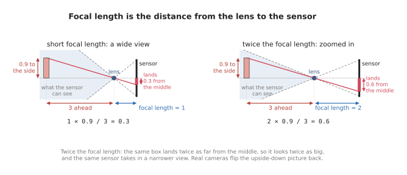
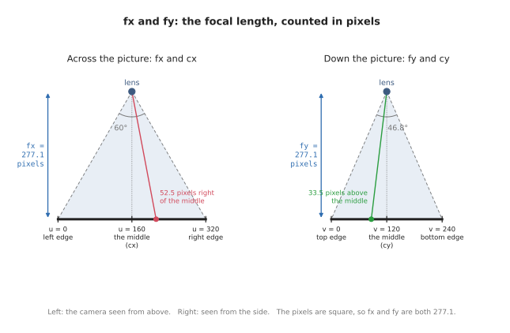
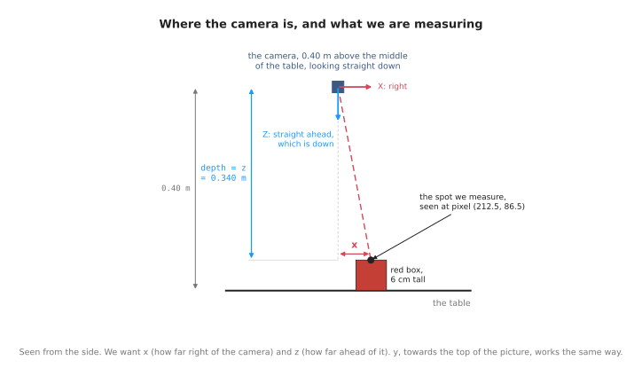
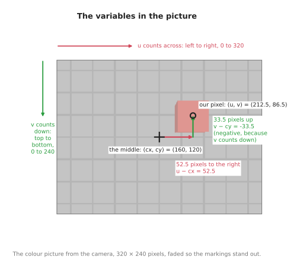
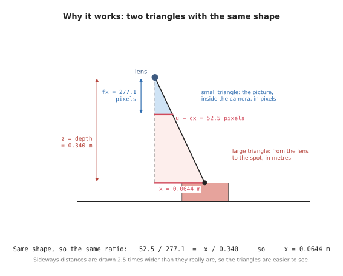
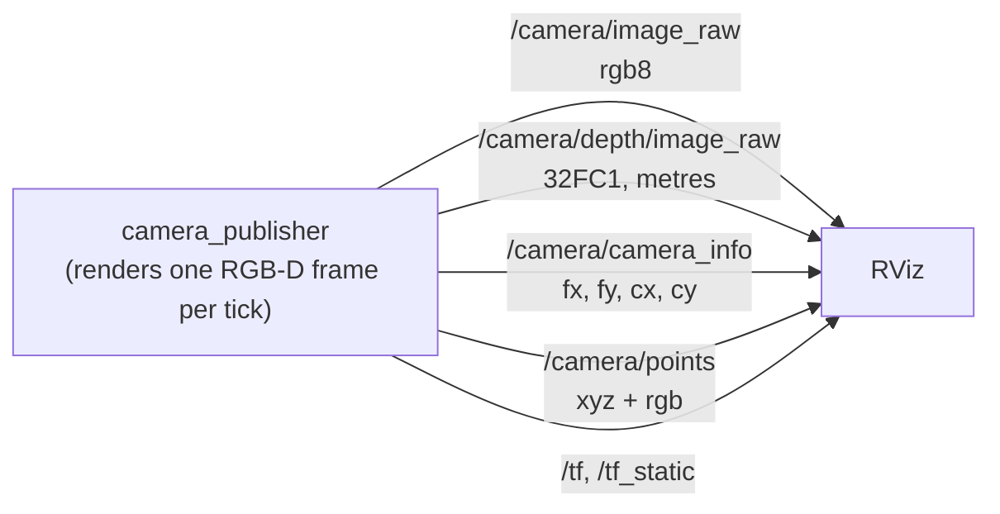
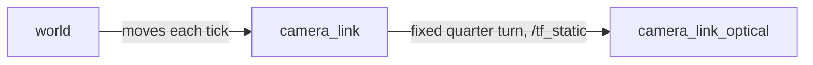

# Cameras: pictures, and the points inside them

## The problem

Three boxes are sitting on a table, and a robot arm has to pick them up.

Before it can, the arm needs to know two things about each box:

- **where it is** on the table
- **how tall it is**, so it knows how far down to reach

In this doc we will measure both, for all three boxes, using one camera. The
camera hangs 40 cm above the middle of the table and looks straight down. It is
the only thing doing the measuring. Nothing tells it where the boxes are, or how
big they are.


The boxes are cuboids: plain rectangular blocks, standing upright.

| Box | Footprint | Height | Seen from above |
| --- | --- | --- | --- |
| red | 6 × 6 cm | 6 cm | top right of the middle |
| green | 5 × 5 cm | 9 cm | top left of the middle |
| blue | 9 × 5 cm | 4 cm | bottom left of the middle |

We know those numbers because we built the scene. The camera does not. That
makes it a fair test: by the end of the doc, the camera's own measurements should
match this table.

Why use a camera for this? Because the robot cannot know ahead of time what will
be on the table, or where. Someone may have moved a box since last time. A camera
sees the whole table at once, in a fraction of a second, without touching
anything.

We will get there in two steps:

- **Part 1: locating a single box.** Just the red box on the table. Every idea
  about cameras is explained on this simplest case, ending with the red box
  measured.
- **Part 2: locating three boxes.** Put the other two back. Most of Part 1
  carries over unchanged, so this part is only about what is new: telling the
  boxes apart.

The pictures in this doc are not drawn by hand. They are taken by the code this
area describes, and so are the numbers beside them.

## Contents

**[Part 1: locating a single box](#part-1-locating-a-single-box)**

1. [Basics](#1-basics)
   - [1.1 What a camera is for](#11-what-a-camera-is-for)
   - [1.2 How a camera makes a picture](#12-how-a-camera-makes-a-picture)
     · [A grid of pixels](#a-grid-of-pixels)
     · [Resolution: how many pixels](#resolution-how-many-pixels)
     · [Field of view: how wide it sees](#field-of-view-how-wide-it-sees)
   - [1.3 What a picture loses](#13-what-a-picture-loses)
   - [1.4 Getting distance back: the depth picture](#14-getting-distance-back-the-depth-picture)
     · [Where the 76,800 readings land](#where-the-76800-readings-land)
     · [Depth is not distance](#depth-is-not-distance)
   - [1.5 The camera used in this doc](#15-the-camera-used-in-this-doc)
   - [1.6 The lens as four numbers](#16-the-lens-as-four-numbers)
     · [What focal length is](#what-focal-length-is)
     · [Why the focal length is counted in pixels](#why-the-focal-length-is-counted-in-pixels)
     · [fx and fy: across and down](#fx-and-fy-across-and-down)
     · [cx and cy: the middle of the picture](#cx-and-cy-the-middle-of-the-picture)
     · [The camera's own axes](#the-cameras-own-axes)
     · [Where 277 comes from](#where-277-comes-from)
   - [1.7 Field of view and resolution are separate knobs](#17-field-of-view-and-resolution-are-separate-knobs)
2. [Calculations](#2-calculations)
   - [2.1 Pixel plus depth gives back the point](#21-pixel-plus-depth-gives-back-the-point)
     · [What we are doing](#what-we-are-doing)
     · [The variables](#the-variables)
     · [Why the calculation works](#why-the-calculation-works)
     · [Step by step](#step-by-step)
     · [The same steps as three formulas](#the-same-steps-as-three-formulas)
   - [2.2 Where the camera is](#22-where-the-camera-is)
     · [camera_to_world](#camera_to_world)
     · [Pointing it somewhere](#pointing-it-somewhere)
   - [2.3 What one capture contains](#23-what-one-capture-contains)
   - [2.4 The box, measured](#24-the-box-measured)
3. [Pseudo code](#3-pseudo-code)
   - [3.1 One pixel into one point](#31-one-pixel-into-one-point)
   - [3.2 From the camera into the room](#32-from-the-camera-into-the-room)
   - [3.3 Measuring the box](#33-measuring-the-box)
4. [Python code](#4-python-code)
   - [4.1 One pixel into one point](#41-one-pixel-into-one-point)
   - [4.2 From the camera into the room](#42-from-the-camera-into-the-room)
   - [4.3 Every pixel at once](#43-every-pixel-at-once)
   - [4.4 Measuring the box](#44-measuring-the-box)

**[Part 2: locating three boxes](#part-2-locating-three-boxes)**

5. [Telling the boxes apart](#5-telling-the-boxes-apart)
6. [The three boxes, measured](#6-the-three-boxes-measured)
7. [Why one picture is not enough](#7-why-one-picture-is-not-enough)

**[Reference: ROS, running and the code](#reference-ros-running-and-the-code)**

8. [Publishing it to ROS](#8-publishing-it-to-ros)
   · [Two sets of camera axes](#two-sets-of-camera-axes)
   · [How the pieces connect](#how-the-pieces-connect)
   · [Settings you can change](#settings-you-can-change)
9. [Running it](#9-running-it)
   · [Checking it works](#checking-it-works)
   · [Commands](#commands)
10. [Working on the code](#10-working-on-the-code)
   · [Layout](#layout)
   · [Changing things](#changing-things)
11. [Notes and gotchas](#11-notes-and-gotchas)
12. [Vocabulary](#12-vocabulary)

---

## Part 1: locating a single box

We start with the simplest version of the problem, where only the red box is on
the table, standing exactly where it stands in the full scene. It is a 6 cm cube.


This part is split into four sections, and each one builds on the one before it.
Section 1 explains the basics of cameras, using this one box. Section 2 does the
calculations that turn pixels into points in the room, and it ends with the box
measured. Sections 3 and 4 then show the same calculations again, first as
pseudo code and then as Python code that you can run.

---

### 1. Basics

Before we can calculate anything, we need a few ideas about what a camera does
and what it records. This section builds them up one at a time: what a camera is
for, how it makes a picture, what the picture loses, how a depth camera gets
that back, and the four numbers that describe the lens.

#### 1.1 What a camera is for

A camera is good at one part of this job straight away: it can see what is on
the table. A photo of it shows a red box.

But an ordinary colour photo cannot finish the job. It can tell you that
something red is over there, in that direction. It cannot tell you how far away
it is — and without that, it cannot tell you where the box is, or how tall.

Sections 1.2 to 1.4 explain why, using nothing but what a camera physically does.
The rest of Part 1 gets the missing information back, and then uses it to
measure the box.

#### 1.2 How a camera makes a picture

A camera is a box with a lens at the front and a flat sensor at the back.

Light bounces off everything in the room. Some of it passes through the lens and
lands on the sensor. The sensor is covered in a grid of tiny light detectors, and
each one records the colour of the light that reached it.

That grid of recordings is the picture.

##### A grid of pixels

Each detector gives one square of the picture, called a **pixel** — short for
*picture element*. A pixel holds one colour, and nothing else.


The left picture was taken with a camera only 16 pixels across and 12 down, so
you can see every square. The red box is just a few red squares.

Pixels are numbered from the **top-left** corner:

- `u` counts across, left to right
- `v` counts **down**, top to bottom

So `(0, 0)` is the top-left pixel. The downward `v` is easy to trip over, because
on a graph `y` goes up. In a picture, it goes down.

A pixel is a small square, not a point. Pixel `(3, 2)` covers the square from 3
to 4 across and from 2 to 3 down, so its middle is at `(3.5, 2.5)`. That half
pixel matters later.

##### Resolution: how many pixels

**Resolution** is how many pixels a picture has, written width × height. The
camera in this doc is `320 × 240`: 320 across, 240 down, 76,800 pixels in all.

The right picture above is the same view at `320 × 240`. Nothing new came into
the shot. The same table was cut into many more, smaller squares, so the edges
come out sharp.

##### Field of view: how wide it sees

**Field of view** is how many degrees across the camera takes in. It is set by
the lens.


A wide lens takes in more of the table. A narrow lens takes in less, as if
zoomed in. The camera in this doc sees 60° across. (The numbers under each lens
come back in section 1.7.)

Resolution and field of view are two separate things. One decides how much of
the world is in the picture. The other decides how finely it is cut up. That
difference matters a lot when choosing a camera, and section 1.7 shows why.

#### 1.3 What a picture loses

Here is the most important fact about cameras.

**Every pixel looks out along one straight line.** Light reaching a pixel came
from somewhere along that line — and the pixel has no way of knowing where.


The picture shows three points on the same line out of the lens: one near, one
further, one further still. All three land on **the same pixel**. No camera could
tell them apart. (The formula at the bottom is explained in section 1.6.)

So a pixel does not tell you a place. It tells you a **direction**.

That is what people mean when they say a camera flattens the world. The world
has three dimensions. A picture has two. The one that gets thrown away is
distance.

That has everyday consequences:

- a big thing far away and a small thing close by can look exactly the same
- a colour picture cannot tell you how far away anything is
- so it cannot tell you where anything is, or how big

No clever code can fix this, because the distance was never recorded. The only
way out is to measure it separately.

#### 1.4 Getting distance back: the depth picture

A **depth camera** measures the missing distance.

It takes a second picture, the same size as the colour one, through the same
lens, at the same moment. But instead of a colour, each pixel holds a
**distance, in metres**.

So you get **one depth reading for every pixel**. The camera in this doc is
320 × 240 pixels, so one depth picture holds **76,800 readings**. In this scene,
every one of the 76,800 came back with a number.

A camera that gives both pictures together is called **RGB-D**: red, green and
blue for the colour picture, plus D for depth.


Look at the numbers on the right. They are the depth readings for a small patch
of pixels at the edge of the red box. On the box they read `0.340` m. On the
table just behind it they read `0.400` m. (The labels `rgb8` and `32FC1` are the
names ROS gives these two pictures; section 2.3 explains them.)

That 6 cm jump is the red box. **No colour was needed to find it.** The depth
numbers alone say that something sticks up out of the table, and by how much.

##### Where the 76,800 readings land

Here is where every reading landed, and what it read:

| Landed on | Readings | The top reads | Height above the table |
| --- | --- | --- | --- |
| the table | 74,176 | 0.400 m | — |
| the red box | 2,624 | 0.340 m | 0.060 m |
| **all of them** | **76,800** | | |

Most readings land on the table, and every one of those reads exactly `0.400` m.

The box gets 2,624 readings. Most of them land on its flat top, and all of those
read the same number: 2,352 readings of `0.340` m. The other 272 land on a thin
strip of the box's side, which the camera catches at its edge. They read a
little more, because the side is further down.

With only one box, finding its readings is easy: **anything that reads less than
the table's `0.400` must be the box.** Part 2 shows why that stops working with
more than one.

Subtract the box's top reading from the table's and you have its height:
`0.400 - 0.340 = 0.060` m, which is 6 cm. **That is half the job done**, from one
picture.

The other half is where the box is. With the two pictures together, each pixel
gives you a **direction** and a **distance**. A direction and a distance are
enough to pin down a point in 3D, and section 2 turns that into arithmetic.

##### Depth is not distance

One detail catches almost everyone.

**Depth is measured straight ahead, along the way the camera points — not along
the slanted line from the lens to the point.**

That is why the table reads exactly `0.400` m *everywhere*, corners included.
The corners are clearly further from the lens than the middle is. But every
point on the table is 0.40 m *in front of* the camera, measured straight down.

Mix the two up and every point comes out slightly too far away, worst at the
edges of the picture. Getting it right also keeps the maths simple later: the
third coordinate of a point turns out to be just the depth reading.

#### 1.5 The camera used in this doc

With those ideas in place, here is the camera that the rest of the doc uses:

| What | Value | Meaning |
| --- | --- | --- |
| resolution | 320 × 240 | pixels across, pixels down |
| field of view | 60° across | how wide it sees |
| height | 0.40 m | how far above the table it hangs |
| pointing | straight down | at the middle of the table |

The table has a 5 cm grid printed on it, which makes it easy to see how much of
it is in shot.

These numbers are realistic. Small RGB-D cameras like this get mounted next to
a robot gripper, looking down at whatever it is about to pick up.

#### 1.6 The lens as four numbers

To do arithmetic with a camera, we have to describe its lens and its sensor as
numbers, and it turns out that four numbers are enough. This section explains
what each of them means, starting with the one that needs the most background,
which is the focal length.

| Number | What it means | Here |
| --- | --- | --- |
| `fx`, `fy` | the **focal length**, counted in pixels: how far the sensor sits behind the lens, which decides how zoomed in the camera is | 277.1 |
| `cx`, `cy` | the middle of the picture, in pixels, where anything straight ahead lands | 160, 120 |

Together these four numbers are called the **intrinsics**, because they are
intrinsic to the camera, meaning that they are part of the device itself. They
do not change when the camera moves around the room, so a camera only has to
measure them once.

##### What focal length is

Section 1.2 described a camera as a box with a lens at the front and a flat
sensor at the back. The **focal length** is the distance between those two: how
far behind the lens the sensor sits, when the camera is focused on something far
away. In the simplest camera of all, a pinhole camera, which is a dark box with a
tiny hole in one side, the focal length is simply the distance from the hole to
the back wall where the picture forms.

Real focal lengths are small, so they are measured in millimetres. A traditional
camera with a "50 mm lens" has its lens about 50 millimetres in front of the film
or the sensor. Small cameras have much shorter focal lengths than that. This doc
uses the [Raspberry Pi Camera Module 2](https://www.raspberrypi.com/products/camera-module-v2/)
as its real example, because it is a small camera that is often fitted to hobby
robots, and because its maker publishes every number we need in its
[hardware specifications](https://www.raspberrypi.com/documentation/accessories/camera.html#hardware-specification).
Its lens sits only 3.04 millimetres in front of its sensor, so its focal length
is 3.04 mm.

The focal length matters because it decides how big things look in the picture.
Light from a point in the scene travels in a straight line through the lens and
lands on the sensor. When the sensor sits further behind the lens, that line has
further to travel after the lens, so it lands further from the middle of the
sensor. The diagram below shows the same box through two lenses. With twice the
focal length, the top of the box lands twice as far from the middle, so the box
looks twice as big. At the same time, the edges of the sensor now catch a
narrower range of directions, so the camera sees less of the scene. That is what
"zoomed in" means, and it is why a longer focal length always goes together with
a narrower field of view.



You may notice that the picture of the box lands upside down on the sensor. That
happens in every camera, because the lines of light cross over at the lens, and
the camera simply turns the picture the right way up before handing it over. The
other diagrams in this doc draw the picture in front of the lens instead, at the
same distance, where it is already the right way up. The triangles, and so the
numbers, are the same either way.

The rule for where a point lands comes from the same triangles as the diagram.
A point that is some distance to the side and some distance ahead lands on the
sensor at:

```
distance from the middle of the sensor = focal length × (distance to the side / distance ahead)
```

The arrows in the diagram mark every number in this rule. The top of the box is
0.9 to the side and 3 ahead, so a focal length of 1 puts it 1 × 0.9 / 3 = 0.3
from the middle, and a focal length of 2 puts it 2 × 0.9 / 3 = 0.6 from the
middle. Those are the two sums written under the two pictures.

##### Why the focal length is counted in pixels

The rule above gives its answer in millimetres on the sensor, but a picture never
tells us millimetres. All we can read from a picture is which pixel something
landed on, such as "pixel 212 across", so the arithmetic we need has to connect a
direction in the room with a pixel number. The millimetres on the sensor are only
a step in between, and we never get to see them.

To turn millimetres on the sensor into pixels, we divide by the width of one
pixel. The Raspberry Pi camera's specifications give its pixel size as
1.12 µm × 1.12 µm, where µm stands for micrometres, which are thousandths of a
millimetre. So each pixel is 0.00112 millimetres wide, and a point that lands
1.12 millimetres from the middle of the sensor is 1,000 pixels from the middle of
the picture. We can do the same division to the focal length itself, and that
gives the focal length counted in pixels:

```
focal length in pixels = focal length in millimetres / width of one pixel in millimetres
                       = 3.04 / 0.00112
                       = 2,714 pixels
```

For this camera, the maker publishes both numbers, the focal length in
millimetres and the pixel size, in one table. For other cameras, the pixel size
is listed in the datasheet of the image sensor inside the camera, and it can also
be worked out by dividing the width of the sensor by the number of pixels across
it: the Raspberry Pi camera's sensor is 3.68 millimetres wide and 3,280 pixels
across, and 3.68 / 3,280 gives the same 0.00112 millimetres. Most cameras made for
robots skip all of this and report `fx` and `fy` directly, already counted in
pixels. A camera that does not report them can be measured instead, by taking
pictures of a printed checkerboard and letting a calibration tool work out `fx`
and `fy` from where its corners land.

With the focal length counted in pixels, the rule from the last part gives its
answer in pixels straight away, and that is exactly the form this doc uses:

```
pixels from the middle of the picture = fx × (distance to the side / distance ahead)
```

This is why the arithmetic only needs to know how many pixels from the middle a
given direction lands, and never needs the millimetres. The distance to the lens
and the size of a pixel never matter on their own, only the result of dividing
one by the other. Two cameras with different lenses and different pixels, but
with the same focal length in pixels, take exactly the same picture. So a single
number, in pixels, describes the lens and the sensor together, and it is the
number that a camera reports with every picture.

For the camera in this doc, `fx` is 277.1 pixels. This means that a point which
is 0.1 metres to the side for every metre ahead lands 0.1 × 277.1 = 27.7 pixels
from the middle of the picture. The spot on the red box that section 2.1 measures
is 0.1894 metres to the side for every metre ahead, so it lands
0.1894 × 277.1 = 52.5 pixels from the middle. Our camera is simulated, so it has
no real lens in millimetres at all. It is described directly in pixels, which is
all the arithmetic ever needs.

##### fx and fy: across and down

The focal length is kept as two numbers because a picture has two directions.
`fx` is the focal length counted in pixel widths, and it is used for positions
across the picture, from left to right. `fy` is the focal length counted in pixel
heights, and it is used for positions down the picture, from top to bottom. The
diagram below shows both on the camera in this doc, first seen from above and
then seen from the side.



In the left half, the picture is 320 pixels wide and sits `fx` = 277.1 pixels in
front of the lens, and the lines from the lens to its two edges make the 60°
field of view. In the right half, the picture is 240 pixels tall and sits `fy` =
277.1 pixels in front of the lens. Because the picture is shorter than it is
wide, the field of view down the picture is only 46.8°. In both halves, the
coloured line is the line of sight to the spot on the red box, which lands 52.5
pixels to the right of the middle and 33.5 pixels above it.

`fx` and `fy` are the same here, and on nearly every camera, because pixels are
square, so a pixel's width and its height are the same. They are still kept as
two numbers because the ROS message keeps them as two, and because a few cameras
have pixels that are very slightly taller than they are wide.

##### cx and cy: the middle of the picture

The other two numbers, `cx` and `cy`, say where the middle of the picture is,
counted in pixels from the left edge and from the top edge. It is the pixel where
anything straight ahead of the lens lands, so every other position in the picture
is measured from there. Our picture is 320 by 240 pixels, so its middle is at
`cx = 160` and `cy = 120`, and the diagram above marks it under each picture. On
a real camera these two numbers are usually close to the exact middle but not
quite on it, because the sensor is never perfectly centred behind the lens, and
that is why they are measured and reported rather than assumed.

##### The camera's own axes

To say where something is relative to the camera, we need the camera's own axes.
They are chosen to match the picture:

- **X** points right, the same way as `u`
- **Y** points **down**, the same way as `v`
- **Z** points straight ahead, out of the lens

With those axes, a point at `(x, y, z)` in front of the camera lands on this
pixel:

```
u = fx · (x / z) + cx
v = fy · (y / z) + cy
```

In words: how far to the side, **divided by how far ahead**, scaled up by the
focal length, then moved to the middle of the picture. It is the rule from the
last two parts, counted in pixels, with `cx` and `cy` added so that pixels are
counted from the edges of the picture instead of from its middle.

`x / z` is section 1.3 written as arithmetic. Twice as far away and twice as far
to the side gives the same ratio, so the same pixel. **Dividing by `z` is
exactly where distance gets thrown away.**

This is called **projection**: a 3D point in, a pixel out. It is what taking a
picture does.

##### Where 277 comes from

The focal length in pixels follows from the resolution and the field of view, and
the left half of the diagram above shows why. Half the picture's width, which is
160 pixels, and the focal length make a right-angled triangle, and the angle of
that triangle at the lens is half the field of view, which is 30°. So:

```
fx = (width / 2) / tan(field of view / 2)
   = 160 / tan(30°)
   = 277.1
```

The same formula works on a real camera, and it gives us a way to check the
Raspberry Pi numbers from earlier in this section. Its picture is 3,280 pixels
wide, and its specifications give its field of view as 62.2° across, so:

```
fx = (3280 / 2) / tan(62.2° / 2)
   = 1640 / tan(31.1°)
   = 2,719 pixels
```

That is within 0.2 per cent of the 2,714 pixels we worked out from the
millimetres. The small difference is about what rounding in the published
figures would cause: a focal length printed as 3.04 mm could really be anything
from 3.035 to 3.045 mm, and 3.045 mm would give 2,719 pixels. So two
separate sets of published numbers give the same focal length, which is a good
sign that we have understood what it means.

A real camera reports this number with every picture, so nothing has to work it
out. But the formula shows which way the trade goes: **halve the field of view
and the focal length roughly doubles.** That is because seeing less of the world
means that each degree of it is spread over more pixels.

#### 1.7 Field of view and resolution are separate knobs

Section 1.2 said these are different things. Here is why it matters: mixing them
up is the most common way to choose the wrong camera.


The top row changes the **lens** and keeps the sensor. From 40 cm above the
table:

| Lens | Field of view | `fx` | Sees, across | One pixel covers |
| --- | --- | --- | --- | --- |
| wide | 90° | 160.0 | 0.800 m | 2.50 mm |
| wrist | 60° | 277.1 | 0.462 m | 1.44 mm |
| narrow | 30° | 597.1 | 0.214 m | 0.67 mm |

The bottom row changes the **sensor** and keeps the lens:

| Sensor | Resolution | `fx` | Sees, across | One pixel covers |
| --- | --- | --- | --- | --- |
| lowres | 80 × 60 | 69.3 | 0.462 m | 5.77 mm |
| wrist | 320 × 240 | 277.1 | 0.462 m | 1.44 mm |
| hires | 640 × 480 | 554.3 | 0.462 m | 0.72 mm |

All three sensors see exactly the same 46 cm of table. They only differ in how
many pieces they cut it into.

The number that decides whether a camera can do a job is the last column: **how
many millimetres one pixel covers**, at the distance you work at. If one pixel
covers 1.4 mm, nothing 1 mm wide can be measured reliably. No code can fix that
afterwards.

Two things follow that are easy to get wrong:

- **A wide lens is not "more camera".** It spreads the same pixels over more of
  the world, so everything in it is measured more coarsely.
- **More pixels do not show you more.** They cut the same view more finely.

And `fx` on its own tells you nothing. `fx` changes in both tables, for
different reasons. Always read it next to the resolution.

---

### 2. Calculations

The basics showed that each pixel gives a direction, and that the depth picture
gives a distance for every pixel. This section turns those two facts into
arithmetic, in four parts that build on one another. Section 2.1 turns one pixel
and its depth reading into a point measured from the camera. Section 2.2 moves
that point into the room, using where the camera is and which way it points.
Section 2.3 shows everything one capture contains, including the point cloud,
which is every pixel turned into a point at once. Section 2.4 then uses all of
this to measure the red box: where it is on the table, and how tall it is.

#### 2.1 Pixel plus depth gives back the point

This is the part that the basics have been building up to, so it is worth
taking slowly, one idea at a time.

##### What we are doing

Before any calculation, it helps to picture the scene. The camera hangs 40
centimetres above the middle of the table, and it points straight down at it.
The red box stands on the table a little to one side of the middle, and because
the box is 6 centimetres tall, its top is 34 centimetres below the camera.
Because the camera points straight down, anything "in front of the camera" is
really below it, and we will keep using the phrase "in front of" because that
is how a camera sees the world.



In this section we pick one small spot on the top of the red box, and we work
out exactly where that spot is, measured from the camera. We want three
distances, all in metres. The first is how far the spot is to the right of the
camera, which we call `x`. The second is how far it is towards the bottom of
the picture, which we call `y`. The third is how far it is in front of the
camera, which we call `z`. The picture above shows `x` and `z` from the side,
while `y` runs across the table at right angles to the page, so it does not
show up in a side view.

We need these numbers because a robot arm cannot move to a pixel. A pixel only
tells us where the box appears in the picture, but the arm has to know where the
box really is in space, so turning pixels into distances is the step that
connects what the camera sees to what the arm can do.

The camera has already given us everything we need to find those three
distances, in two pictures taken at the same moment. The colour picture tells us
which pixel the spot appears in, and section 1.3 showed that a pixel tells us a
direction, meaning one straight line out from the lens. The depth picture tells
us, for that same pixel, how far away the surface is, as section 1.4 explained.
Once we know which line to follow and how far to go along it, we arrive at
exactly one point, and that point is the spot on the box.

##### The variables

To do the calculation we use seven numbers that we already know, and we get
three numbers back. Before using them, it is worth knowing what each one means
and where it comes from, so this part goes through them one by one, starting
with the picture itself.



A position in the picture is described by two directions, and it helps to name
them clearly. **Across** means along the width of the picture, from its left
edge to its right edge. **Down** means along the height of the picture, from
its top edge to its bottom edge. These are the two directions you would use to
describe a place on a printed photo lying on a desk, and in this picture
"across" is the camera's right, while "down" is towards the bottom of the
picture.

The first two numbers, `u` and `v`, say which pixel we are looking at. The number
`u` counts pixels across the picture, starting from 0 at the left edge and going
up to 320 at the right edge. The number `v` counts pixels down the picture,
starting from 0 at the top edge and going up to 240 at the bottom edge. The spot
we chose appears at `u = 212.5` and `v = 86.5`, which is on the top of the red
box. Both numbers end in `.5` because a pixel is a small square rather than a
point, and we want the middle of that square: pixel number 212 covers the strip
from 212 to 213, so its middle is at 212.5.

The next two numbers, `cx` and `cy`, give the position of the middle of the
picture. The picture is 320 pixels wide and 240 pixels tall, so its middle is at
`cx = 160` across and `cy = 120` down. The middle matters because anything
exactly in front of the camera appears there, which makes it the natural place
to measure every other pixel from, and the diagram above shows it as a cross.

The fifth number is the `depth` reading for our pixel, which we read from the
depth picture at the same `u` and `v`. For our pixel it is `0.340` metres. As
section 1.4 explained, this distance is measured straight out in the direction the
camera points, and not along the slanted line from the lens to the spot. That
detail is what will make the last step of the calculation so simple.

The last two numbers, `fx` and `fy`, are the focal length of the lens, measured
in pixels, which section 1.6 introduced. They describe how zoomed in the camera
is, and they have a simple meaning that we will rely on in a moment: a point that
is as far to the side of the camera as it is in front of it appears exactly `fx`
pixels from the middle of the picture. In our camera both numbers are `277.1`,
and they are equal because the pixels are square.

The three numbers that come out, `x`, `y` and `z`, are the distances described at
the start of this section. They are measured along the camera's own axes from
section 1.6, which point the same ways as the picture: `x` points across, to the
right, `y` points down the picture, and `z` points straight out of the lens.

Here are all ten together, for looking things up later:

| Name | What it is | Where it comes from | For our pixel |
| --- | --- | --- | --- |
| `u` | the pixel's position across the picture, counted from the left edge | the pixel we picked | 212.5 |
| `v` | the pixel's position down the picture, counted from the top edge | the pixel we picked | 86.5 |
| `cx` | the middle of the picture, across | the four lens numbers (section 1.6) | 160 |
| `cy` | the middle of the picture, down | the four lens numbers | 120 |
| `depth` | how far in front of the camera the spot is, in metres | the depth picture, at the same pixel | 0.340 |
| `fx` | the focal length across, in pixels | the four lens numbers | 277.1 |
| `fy` | the focal length down, in pixels | the four lens numbers | 277.1 |
| `x` | **answer:** how far to the right of the camera, in metres | worked out below | |
| `y` | **answer:** how far towards the bottom of the picture, in metres | worked out below | |
| `z` | **answer:** how far in front of the camera, in metres | worked out below | |

##### Why the calculation works

Before doing any arithmetic, it helps to see why the calculation works, because
then each step will make sense instead of being a rule to memorise. The reason
is that there are two triangles with exactly the same shape.



Light from the spot on the box travels to the camera in a straight line, passes
through the lens, and lands on the picture inside the camera. That one straight
line makes two triangles. The small triangle is inside the camera, between the
lens and the picture. Its long side, pointing straight out of the lens, is the
focal length `fx`, and its short side, pointing across, is how far the pixel is
from the middle of the picture, which is `u - cx`. The large triangle is outside
the camera, between the lens and the spot. Its long side, pointing straight out
of the lens, is the depth `z`, and its short side, pointing across, is `x`, the
distance we want to find.

Both triangles have a right angle, and both have the same angle at the lens,
because the light travels in one straight line. Two triangles with the same
angles always have the same shape, even when one is much bigger than the other,
and even when one is measured in pixels while the other is measured in metres.
Because the shapes are the same, the short side divided by the long side gives
the same answer in both triangles:

```
(u - cx) / fx  =  x / z
```

For our pixel, the left side is `52.5 / 277.1`, which is about `0.19`. This
number is the direction from section 1.3, written as a number: it says that the
line from the lens moves 0.19 metres to the right for every metre it goes
forwards. Since we know the line goes 0.340 metres forwards before it reaches
the box, we can find how far to the right it has moved by that point, and that
is exactly `x`. The steps below do this calculation carefully, and the same
reasoning, turned on its side, gives `y` from `v` and `cy`.

##### Step by step

We can now work through the calculation for the spot on the red box, one step
at a time, using the numbers from the table above.

**Step 1: find how far the pixel is from the middle of the picture.** Both
triangles start from the line that points straight out of the lens, and that
line lands on the middle of the picture. So the first thing we need is the
number of pixels between our pixel and the middle, first across and then down:

```
pixels to the right of the middle = u - cx = 212.5 - 160 =  52.5
pixels below the middle           = v - cy =  86.5 - 120 = -33.5
```

The first result tells us that the pixel is 52.5 pixels to the right of the
middle. The second result is negative because `v` counts downwards and 86.5 is
smaller than 120, which means that our pixel is 33.5 pixels *above* the middle
rather than below it.

**Step 2: find how much of the table one pixel covers at that distance.** A
pixel does not cover a fixed amount of the world, because a camera takes in more
of the world the further away it looks. When a pixel looks at something close to
the camera, it covers a tiny patch, and when the same pixel looks at something
far away, it covers a much larger patch. The triangles tell us exactly how
large the patch is. Since `fx` pixels in the picture match a distance across
that is equal to the depth, a single pixel matches a distance of the depth
divided by `fx`:

```
one pixel covers = depth / fx = 0.340 / 277.1 = 0.001227 metres
```

This means that at the height of the box top, each pixel covers about 1.2
millimetres. It is the same idea as the last column of the tables in section 1.7,
where one pixel covered 1.44 millimetres of the table, which is 0.40 metres
away. The box top is 6 centimetres closer to the camera than the table, so each
of its pixels covers a little less.

**Step 3: turn the distance in pixels into a distance in metres.** We now know
that the pixel is 52.5 pixels to the right of the middle, and that each pixel
covers 0.001227 metres at that distance. Multiplying these two numbers together
gives the distance to the right in metres, and doing the same with the pixels
below the middle gives the distance down the picture:

```
x = pixels to the right × one pixel =  52.5 × 0.001227 = +0.0644 metres
y = pixels below        × one pixel = -33.5 × 0.001227 = -0.0411 metres
```

**Step 4: find how far in front of the camera the spot is.** This last distance
needs no calculation at all, because it is the depth reading itself:

```
z = depth = 0.340 metres
```

This is where the detail from section 1.4 pays off. The depth is measured straight
out from the lens, rather than along the slanted line, so it is already the long
side of the large triangle, and we can use it exactly as it is.

When we put the three results together, the spot is at `(+0.0644, -0.0411,
0.340)` metres, measured from the camera. In everyday terms, the spot on top of
the red box is 6.4 centimetres to the right of the camera, 4.1 centimetres
towards the top of the picture, and 34 centimetres in front of the camera. The
value of `y` is negative, and that is correct, because `y` measures distance
towards the bottom of the picture, while this spot sits towards the top.

##### The same steps as three formulas

The four steps are usually written in a shorter form, as three formulas. The
first two formulas do steps 1, 2 and 3 in one line each, one for `x` and one for
`y`, and the third formula is step 4:

```
x = (u - cx) · depth / fx
y = (v - cy) · depth / fy
z =  depth
```

Turning a pixel and a depth back into a point in this way is called
**deprojection**, because it undoes what the camera did when it took the
picture. It is the exact reverse of the formula in section 1.6, which starts
from a point and works out which pixel that point lands on. We can check this by
putting our answer back into that formula: `277.1 × 0.0644 / 0.340 + 160` comes
to 212.5, which is the pixel we started from. The two formulas are really one
formula, read in two directions.

One small detail is worth repeating, because it causes real mistakes. If we used
the corner of the pixel, 212, instead of its middle, 212.5, the answer would move
by half a pixel. That sounds too small to matter, but at the edge of a box, half
a pixel can be the difference between a point on the box and a point on the
table behind it.

The picture below shows the whole journey in one place: the pixel and its depth
on the left, the arithmetic we have just done in the middle, and, on the right,
the point placed in the room. That last part is still to come.


The point we have found is measured from the camera, not from the room. To use
it, the robot also needs to know where the camera is and which way it points,
and section 2.2 explains that step next. The same four steps appear again as
pseudo code in section 3.1 and as Python code in section 4.1.

#### 2.2 Where the camera is

The point we found in section 2.1 is measured from the camera, so what it really
says is "34 centimetres in front of me, and a little to the right". That is not
yet useful to the arm, because the arm needs to know where things are in the
room, not where they are compared with the camera. To turn one into the other,
we also need to know where the camera is and which way it points, and together
those two things are called the camera's **pose**. Every picture has to come
with the pose it was taken from, because without it, the picture's numbers
cannot be placed anywhere in the room.

##### camera_to_world

The pose is usually kept as one table of numbers, called **camera_to_world**,
because it takes a point measured from the camera and gives the same point
measured in the room, which is also called the world. For the camera in this
doc, which hangs 40 centimetres above the middle of the table and looks straight
down, the table is:

|  | camera's RIGHT | camera's DOWN | camera's FORWARD | camera's POSITION |
| --- | :---: | :---: | :---: | :---: |
| world x | 1 | 0 | 0 | 0.00 |
| world y | 0 | −1 | 0 | 0.00 |
| world z | 0 | 0 | −1 | 0.40 |
|  | 0 | 0 | 0 | 1 |

The table is easiest to read one column at a time. The last column says where
the camera is, measured in metres from the middle of the table, and it shows
that the camera is 0.40 metres straight up. The first three columns are
directions, and each of them says which way one of the camera's own axes points
in the room. The camera's right points along the room's x, so the first column
is `(1, 0, 0)`. The camera's down, towards the bottom of the picture, points
along the room's negative y, so the second column is `(0, −1, 0)`. The camera's
forward points straight down at the table, which is the room's negative z, so
the third column is `(0, 0, −1)`. The bottom row is always `0 0 0 1` and carries
no information of its own. It is only there so that a computer can do the
turning and the shifting in a single multiplication.

This is the same idea as a transform in the [arm area](../arm/overview.md): a
turn and a shift, kept together.

Using the table is simpler than it looks. We start at the camera's position,
then walk `x` along the camera's right, `y` along its down, and `z` along its
forward, and wherever we end up is the point in the room. For the spot on the
red box, we start at the camera, 0.40 metres above the middle of the table.
Walking 0.0644 metres along the camera's right moves us 0.0644 metres along the
room's x. Walking −0.0411 metres along the camera's down means walking 0.0411
metres the opposite way, which is towards the room's positive y. Finally,
walking 0.340 metres along the camera's forward takes us 0.340 metres straight
down, which leaves us 0.060 metres above the table. So the spot is at
`(+0.0644, +0.0411, +0.0600)` in the room.

That last number, 0.060 metres, is exactly the height of the red box, even
though nothing in the calculation was told how tall the box is. The height came
from the depth reading and the camera's pose alone. Notice also that `y` changed
sign on the way into the room. For this camera, "down the picture" points along
the room's negative y, so a spot towards the top of the picture has a positive
y in the room.

##### Pointing it somewhere

The code does not ask for these three directions to be typed in by hand. It is
told where the camera is and what it is looking at, and it works out the three
directions from those in three steps. First, forward is the arrow from the
camera to the thing it is looking at. Second, right is the direction at right
angles to both forward and a chosen "up", which is given as a hint. Third, down
is the direction at right angles to both forward and right, so once the first
two are known, there is only one possible answer for it.

The "up" hint only decides which way up the picture comes out, because a camera
turned around the direction it looks at still sees the same things, only
rotated. The hint must not point the same way as forward, because then there is
no single direction at right angles to both of them. A camera looking straight
down is exactly that case if the hint is the room's z, so the code refuses to
guess and raises an error rather than quietly producing nonsense. The default
hint is the room's y, which works for the camera in this doc.

#### 2.3 What one capture contains

So far we have used two pictures from each capture: the colour picture and the
depth picture. A real camera, and the ROS messages that carry its pictures, can
give the same shot in a few more forms, all the same size and all describing the
same pixels. ROS tells them apart by their **encoding**, which is a short name
that says what the numbers in each pixel mean. The encodings are worth knowing,
because reading a picture in the wrong encoding is one of the most common bugs
in camera code.

| Picture | Encoding | Each pixel holds | At the red box pixel |
| --- | --- | --- | --- |
| colour | `rgb8` | red, green, blue, 0 to 255 each | `(196, 64, 54)` |
| grey | `mono8` | brightness, 0 to 255 | `102` |
| depth | `32FC1` | distance, in metres | `0.3400` |
| depth | `16UC1` | distance, in whole millimetres | `340` |

The **colour** picture, `rgb8`, is what most people mean by "a camera". Each
pixel holds three numbers from 0 to 255, one each for red, green and blue. On its
own it is the least useful picture for our job, because it gives directions and
appearance but no measurements.

The **grey** picture, `mono8`, holds a single brightness number for each pixel,
so it is a third of the size of the colour picture. A lot of vision work, such as
finding edges and corners or following something as it moves, never looks at
colour, so the smaller picture is enough. The brightness is not the plain
average of red, green and blue, because the human eye is much more sensitive to
green than to blue. To match what a person sees, grey weights them `0.299` for
red, `0.587` for green and `0.114` for blue.

The **depth** picture comes in two forms, and they are easy to mix up. `32FC1`
holds the distance in metres, as a decimal number, while `16UC1` holds the same
distance in whole millimetres. They are the same measurement written in two
ways, but if a program reads one as the other, every distance comes out a
thousand times too big or too small.

One more thing comes out of the same shot, and for a robot it is the most useful
one: a **point cloud**. A point cloud is what we get when we take every pixel
that has a depth reading, turn it into a point with the calculation from section
2.1, and move that point into the room with section 2.2. Taking every fourth
pixel across and every fourth pixel down gives 4,800 points. Here are two of
them, in room coordinates:

| Landed on | x | y | z |
| --- | --- | --- | --- |
| table | −0.230 | 0.172 | 0.000 |
| red box | 0.035 | 0.068 | 0.060 |

In every point, `z` is the height of whatever that pixel landed on, which is 0
for the table and 0.060 for the red box. This is the form the rest of a robot
wants, because a picture is a grid of directions, while a point cloud is a
collection of places, and places can be grouped, measured and picked up.

A real depth camera never fills in every pixel. Shiny, dark or see-through
surfaces, and anything too near or too far away, come back with no reading at
all. In this area those pixels stay missing rather than being filled with a
made-up value, because a made-up value would put a surface where there is none.

#### 2.4 The box, measured

Everything is now in place to measure the box. Section 2.1 showed how to turn one
pixel into a point measured from the camera, and section 2.2 showed how to move
that point into the room, so measuring the whole box needs only four steps.

The first step is to pick out the pixels that landed on the box. With only one
box on the table this is easy, because any pixel that reads less than the
table's `0.400` metres must be on the box. The second step is to turn each of
those pixels into a point in the room, using the calculations from sections 2.1
and 2.2. The third step is to keep only the highest points, because those are
the top of the box. This step is needed because the thin strip of the box's side
from section 1.4 also reads less than `0.400`, but its points sit lower than the
top, so keeping only the highest points leaves them out. The fourth step is to
average the points that are left. The average position of the top is the middle
of the box, and the height of the top is how tall the box is.

Nothing about the box was looked up along the way. The answer comes only from the
box's pixels, their depth readings, the four lens numbers, and where the camera
was.

The table below compares the answer with the true values, which we know because
we built the scene. Positions are in metres from the middle of the table, which
is the spot straight under the camera.

| Box | Measured middle | True middle | Measured height | True height |
| --- | --- | --- | --- | --- |
| red | (+0.064, +0.040) | (+0.065, +0.040) | 0.060 m | 0.060 m |

The middle is within a millimetre of the truth, and the height is exact, so the
red box has been measured from one picture. In the code, this whole calculation
is `Capture.measure()` in `camera.py`, and its answer is the last thing that
Part 1 of `make camera.learn` prints. Sections 3 and 4 show the same four steps
as pseudo code and as Python.

---

### 3. Pseudo code

The pseudo code below repeats the calculations from section 2 without the
explanations, so that the whole job can be seen in one place. It is split into
the same pieces as section 2, so each piece can be read side by side with the
part that explains it.

#### 3.1 One pixel into one point

This piece follows the four steps from section 2.1, in the same order. It starts
from one pixel and its depth reading, and it ends with a point measured from the
camera.

```
the goal: turn one pixel on the red box into one point, measured from the camera

what we start with:
    u, v        which pixel: how far across from the left, and how far down from the top
    depth       the depth reading at that pixel, in metres
    fx, fy      the focal length, in pixels            (the four lens numbers)
    cx, cy      the middle of the picture, in pixels   (the four lens numbers)

step 1: how far is the pixel from the middle of the picture?
    pixels_right = u - cx
    pixels_down  = v - cy

step 2: how much does one pixel cover, at that distance?
    size_across = depth / fx
    size_down   = depth / fy

step 3: turn pixels into metres
    x = pixels_right * size_across
    y = pixels_down  * size_down

step 4: how far in front of the camera?
    z = depth

the answer is the point (x, y, z)
```

#### 3.2 From the camera into the room

This piece follows section 2.2. It starts from the point that 3.1 gives back,
which is measured from the camera, and it ends with the same point measured in
the room.

```
the goal: move one point from the camera's axes into the room's axes

what we start with:
    x, y, z             the point, measured from the camera           (from 3.1)
    camera_to_world     where the camera is, and which way it points  (section 2.2)
        right           the camera's right, as a direction in the room      first column
        down            the camera's down, as a direction in the room       second column
        forward         the camera's forward, as a direction in the room    third column
        position        where the camera is, in the room                    last column

start at the camera:
    point_in_room = position

walk along the camera's own three directions:
    point_in_room = point_in_room + x * right
    point_in_room = point_in_room + y * down
    point_in_room = point_in_room + z * forward

the answer is point_in_room
```

#### 3.3 Measuring the box

This last piece is the whole job from section 2.4. It runs the two pieces above
for every pixel on the box, and then keeps and averages the top.

```
the goal: find where the box is on the table, and how tall it is

what we start with:
    the depth picture from one capture
    the four lens numbers, and camera_to_world

step 1: pick out the box's pixels
    box_pixels = every pixel whose depth reading is less than the table's 0.400

step 2: turn each of them into a point in the room
    points = an empty list
    for each pixel in box_pixels:
        u, v  = the middle of that pixel
        point = one pixel into one point         (3.1)
        point = from the camera into the room    (3.2)
        add point to points

step 3: keep only the top of the box
    top_height = the highest z among the points
    top        = the points whose z is within a millimetre of top_height

step 4: average the top
    middle = the average x and the average y of the points in top
    height = top_height

the answer is the middle of the box, and its height
```

---

### 4. Python code

The Python code below does the same calculations once more, in the same pieces
as the pseudo code, so each piece can be matched with the pseudo code above it.
Every piece runs as it is, and each one prints the numbers that section 2 worked
out by hand. The pieces that import `camera_basics` need the workspace set up,
so run them in the shell that `make shell` opens.

#### 4.1 One pixel into one point

The first version writes the four steps from section 2.1 out one line at a time,
so that each step can be seen and checked on its own. It uses the same numbers
as section 2.1, and it prints the same answer.

```python
def pixel_to_point(u, v, depth, fx, fy, cx, cy):
    """Turn one pixel and its depth reading into a 3D point, measured from the camera."""
    pixels_right = u - cx             # step 1: how far right of the middle, in pixels
    pixels_down = v - cy              #         how far below the middle, in pixels
    size_across = depth / fx          # step 2: how much one pixel covers, in metres
    size_down = depth / fy
    x = pixels_right * size_across    # step 3: pixels into metres
    y = pixels_down * size_down
    z = depth                         # step 4: straight ahead is the depth itself
    return x, y, z


x, y, z = pixel_to_point(u=212.5, v=86.5, depth=0.340, fx=277.1, fy=277.1, cx=160, cy=120)
print(f'x = {x:+.4f} m, y = {y:+.4f} m, z = {z:+.4f} m')
```

When it runs, it prints:

```
x = +0.0644 m, y = -0.0411 m, z = +0.3400 m
```


This area's own code does the same calculation in `CameraConfig.deproject()`,
inside `camera.py`. The next example uses it on a real capture, and it reads the
depth from the depth picture instead of typing it in, which is how the
calculation is used in practice.

```python
from camera_basics.camera import capture, ONE_BOX_SCENE, TOP_DOWN, WRIST

shot = capture(ONE_BOX_SCENE, WRIST, TOP_DOWN)
depth = shot.depth_at(212.5, 86.5)              # 0.340, read from the depth picture
point = WRIST.deproject(212.5, 86.5, depth)     # the same four steps, in camera.py
```

It gives the same point, `(+0.0644, -0.0411, +0.3400)`.

#### 4.2 From the camera into the room

This piece takes the point from 4.1 and moves it into the room. It writes the
walk from section 2.2 out in full, with the four columns of `camera_to_world`
typed in by hand.

```python
def camera_to_room(point, right, down, forward, position):
    """Start at the camera, then walk x along its right, y along its down, z along its forward."""
    x, y, z = point
    return (
        position[0] + x * right[0] + y * down[0] + z * forward[0],
        position[1] + x * right[1] + y * down[1] + z * forward[1],
        position[2] + x * right[2] + y * down[2] + z * forward[2],
    )


right = (1, 0, 0)         # the first three columns of camera_to_world:
down = (0, -1, 0)         # which way the camera's right, down and forward
forward = (0, 0, -1)      # point in the room
position = (0, 0, 0.40)   # the last column: where the camera is

room = camera_to_room((0.0644, -0.0411, 0.340), right, down, forward, position)
print(f'in the room: x = {room[0]:+.4f} m, y = {room[1]:+.4f} m, z = {room[2]:+.4f} m')
```

When it runs, it prints the point from section 2.2, with the height of the box
as its last number:

```
in the room: x = +0.0644 m, y = +0.0411 m, z = +0.0600 m
```

The library does the same walk in `Pose.to_world()`, and `TOP_DOWN` is the pose
of the camera in this doc, so it gives the same point:

```python
from camera_basics.camera import TOP_DOWN

room = TOP_DOWN.to_world((0.0644, -0.0411, 0.340))    # (+0.0644, +0.0411, +0.0600)
```

#### 4.3 Every pixel at once

A real program usually wants every pixel rather than just one, and NumPy can
work out all 76,800 of them in a single calculation. The formula does not change
at all. The only difference is that `u`, `v` and `depth` become whole grids of
numbers, one for every pixel, instead of single numbers. Like the library
example in section 4.1, this piece carries on from the capture `shot` made
there.

```python
import numpy as np

depth = np.array([[np.nan if d is None else d for d in row] for row in shot.depth])
v, u = np.mgrid[0:depth.shape[0], 0:depth.shape[1]] + 0.5     # every pixel's middle
x = (u - WRIST.cx) * depth / WRIST.fx
y = (v - WRIST.cy) * depth / WRIST.fy
z = depth
```

The result is one point for every pixel, measured from the camera, and moving
each of them into the room, as in section 4.2, gives the point cloud from section
2.3. Any pixel without a depth reading is stored as `nan`, which stands for "not
a number", so that it can never turn into a point that was not really measured.
Looking up our pixel, `(212.5, 86.5)`, in these grids gives the same point,
`(+0.0644, -0.0411, +0.3400)`, once again. The library can also do the whole
thing in one call: `shot.point_cloud(step=4)` gives the 4,800 points from section
2.3, already moved into the room.

#### 4.4 Measuring the box

This last piece is the whole job from section 2.4, written out in full. It
carries on from the capture `shot` in section 4.1, and it follows the four steps
of the pseudo code in section 3.3.

```python
TABLE_DEPTH = 0.400

# steps 1 and 2: every pixel nearer than the table becomes a point in the room
points = []
for row in range(WRIST.height_px):
    for col in range(WRIST.width_px):
        depth = shot.depth[row][col]
        if depth is None or depth > TABLE_DEPTH - 0.001:    # no reading, or the table
            continue
        point = WRIST.deproject(col + 0.5, row + 0.5, depth)    # the middle of the pixel
        points.append(TOP_DOWN.to_world(point))

# step 3: keep only the top, the points within a millimetre of the highest one
top_z = max(p[2] for p in points)
top = [p for p in points if p[2] > top_z - 0.001]

# step 4: the average of the top is the middle of the box
x = sum(p[0] for p in top) / len(top)
y = sum(p[1] for p in top) / len(top)
print(f'{len(points)} points on the box')
print(f'middle = ({x:+.3f}, {y:+.3f}) m, height = {top_z:.3f} m')
```

When it runs, it finds the same 2,624 readings on the box as section 1.4, and it
prints the answer from section 2.4:

```
2624 points on the box
middle = (+0.064, +0.040) m, height = 0.060 m
```

The library does all four steps in `Capture.measure()`, so the whole calculation
can also be done in one line:

```python
print(shot.measure('red'))    # (x, y, height), in metres: about (0.064, 0.040, 0.060)
```

There is one difference, and it does not change the answer here. Instead of the
depth rule in step 1, `measure()` picks out the box's pixels by name, using the
mask that Part 2 explains. With one box both ways pick the same pixels, but with
three boxes the depth rule stops working, as Part 2 shows.

---

## Part 2: locating three boxes

Now we put the green and blue boxes back, exactly as in the problem at the top.


Almost nothing from Part 1 changes. The camera is the same, and so are its four
numbers, its pose, and the arithmetic that turns a pixel into a point. The red
box reads exactly what it read before.

Only one thing breaks, and this part is about that.

### 5. Telling the boxes apart

In Part 1, finding the box was easy: anything reading less than the table's
`0.400` was the box.

With three boxes, that rule finds all three at once. It says these 7,903 pixels
are not the table, but not which box each one belongs to. Measure that lump the
Part 1 way and it goes wrong: keeping the highest points finds only the tallest
box, the green one, and the other two vanish.

So before any box can be measured, its pixels have to be sorted out from the
others. The result is called a **mask**: for every pixel, which box it landed
on.


Here is how the 76,800 readings split up now:

| Landed on | Readings | The top reads | Height above the table |
| --- | --- | --- | --- |
| the table | 68,897 | 0.400 m | — |
| green box | 2,456 | 0.310 m | 0.090 m |
| red box | 2,624 | 0.340 m | 0.060 m |
| blue box | 2,823 | 0.360 m | 0.040 m |
| **all of them** | **76,800** | | |

The red box still has exactly 2,624 readings, the same as in Part 1. The two new
boxes take their readings away from the table instead: 74,176 in Part 1, 68,897
now.

Where does the mask come from? Here the simulator knows it for free, because it
knows what every line of sight hit. A real camera has to work it out, and the
usual clues are:

- **colour**: red pixels are probably the red box
- **jumps in depth**: where the depth changes suddenly, one object ends and
  another begins

Working this out is called **segmentation**. On a real camera it is the hard
part, and a large share of real vision work is doing it well. This doc takes the
mask as given, so that it can stay about the camera.

---

### 6. The three boxes, measured

With the mask, each box gets its own pixels. Each one is then measured exactly as
the red box was in section 2.4: turn its pixels into points, keep its top, and
average.

| Box | Measured middle | True middle | Measured height | True height |
| --- | --- | --- | --- | --- |
| red | (+0.064, +0.040) | (+0.065, +0.040) | 0.060 m | 0.060 m |
| green | (−0.060, +0.048) | (−0.060, +0.048) | 0.090 m | 0.090 m |
| blue | (−0.040, −0.062) | (−0.040, −0.062) | 0.040 m | 0.040 m |

Every middle is within a millimetre of the truth, and every height is exact.
That is the problem from the top of the doc, solved: where each box is and how
tall it is, from one picture.

The red box comes out exactly as it did in Part 1, to the last digit. The other
two boxes did not disturb it, which is the whole point of telling them apart.

---

### 7. Why one picture is not enough

Move the camera and the same scene reads differently.

| Where the camera is | Depth readings run | What it sees |
| --- | --- | --- |
| straight down | 0.310 m to 0.400 m | the tops of things, and a table that reads the same everywhere |
| leaning in about 20° | 0.306 m to 0.505 m | some of the sides, and a table that slopes across the picture |

From straight above you mostly see tops, and a tall box can hide a short one
behind it. The tilted view sees some sides instead, and finds what was hidden.
Its table no longer reads one number, because the far edge really is further
away.

Neither view is better. They see different things. That is why a robot that
wants to measure something usually takes two or three pictures from different
places. Each picture carries its own `camera_to_world`, so the points from every
view land in the same room coordinates and simply add together.

---

## Reference: ROS, running and the code

The two parts above are the ideas. This part is the practical side: how the same
pictures go out over ROS, how to run everything, and where things are in the
code.

### 8. Publishing it to ROS

Everything so far is plain Python. `camera.py` does not use ROS at all.

The node next to it, `camera_publisher.py`, is only packaging. It takes the same
pictures and puts them on topics in the shape the rest of ROS expects. Swap the
simulated scene for a real camera and those topics stay the same, so anything
built on them keeps working.

#### Two sets of camera axes

Section 1.6 gave the camera's axes as X right, Y down, Z forward, to match the
picture. The rest of a robot uses a different habit: X forward, Y left, Z up.

ROS keeps both, as two frames in the same place:


| Frame | Axes | Used for |
| --- | --- | --- |
| `camera_link` | X forward, Y left, Z up | attaching the camera to the robot, like any other part |
| `camera_link_optical` | X right, Y down, Z forward | stamping the pictures, so the formulas stay short |

Between them is a fixed quarter turn that never changes. ROS publishes it once,
on `/tf_static`, as the quaternion `(-0.5, 0.5, -0.5, 0.5)` — the same four
numbers on every ROS camera. Frames that use the picture's axes are named
`..._optical` by habit, so nobody has to guess which is which.

**This is the most common camera bug in ROS.** Stamp an image in `camera_link`
instead of the optical frame and nothing complains. The point cloud just comes
out lying on its side, turned a quarter turn, and it looks like a mistake in your
own maths.

#### How the pieces connect



The frames:



`world` stays still, and RViz draws everything from it. `camera_link` circles
slowly, always looking at the middle of the table. `camera_link_optical` is a
quarter turn from it and never moves relative to it.

Two things about this are the whole lesson:

**Every message carries the same timestamp.** A depth picture only makes sense
next to the four numbers and the pose it was taken with. Anything downstream
matches the topics up by their timestamp, so they have to agree.

**The point cloud is published from the camera's point of view**, and left
there, exactly as a real camera driver does. RViz moves it into the room by
looking up TF. Nothing recalculates the points when the camera moves — the same
idea as the [rviz area](../rviz/overview.md), where the ball never moves but its
frame does.

#### Settings you can change

They are node settings, so no code needs editing:

| Setting | Default | What it does |
| --- | --- | --- |
| `width_px` | 160 | picture width |
| `height_px` | 120 | picture height |
| `hfov_deg` | 60.0 | field of view across. Try 90 for wide, 30 for zoomed in |
| `camera_height_m` | 0.40 | how far above the table it hangs |
| `orbit_radius_m` | 0.13 | how far it leans out from straight above |
| `orbit_period_s` | 20.0 | seconds for one circle |
| `cloud_step` | 2 | use every Nth pixel for the point cloud |
| `publish_rate_hz` | 2.0 | pictures per second |
| `world_frame` | `world` | name of the still frame |
| `camera_frame` | `camera_link` | the robot-style frame |
| `optical_frame` | `camera_link_optical` | the frame pictures are stamped in |

The demo runs at `160 × 120` and two pictures a second, on purpose. Each pixel
is worked out in plain Python, one at a time, so resolution is what costs time.
Doubling both the width and the height does four times the work.

---

### 9. Running it

Two commands. Start with the first:

```
make camera.learn
```

It runs the two parts in order, prints them in the terminal, and exits.

Part 1, one box:

- the four numbers for each lens, and how much each one covers
- `camera_to_world`
- a capture drawn in text characters, and where its depth readings land
- one pixel worked through to a point, and a point cloud
- the encodings side by side, and the same shot through three lenses
- the box, measured, next to its true size

Part 2, three boxes:

- which box each pixel landed on
- where the depth readings land now
- all three boxes, measured, next to their true sizes
- the same scene from two positions

```
make camera.demo
```

This one opens RViz. You should see:

- a **point cloud** of the table and the three boxes, in colour, rebuilt twice a
  second
- two **image** panels: colour and depth
- the camera's **frames** circling the scene once every 20 seconds
- a 5 cm **grid**

In the terminal:

```
[camera_publisher-1] [INFO] [camera_publisher]: Publishing 160x120 RGB-D at 2 Hz:
                            fx = 138.6 px, 60° across, 2.89 mm per pixel
[rviz2-2] [INFO] [rviz2]: Stereo is NOT SUPPORTED
[rviz2-2] [INFO] [rviz2]: OpenGl version: 2.1 (GLSL 1.2)
```

The last two lines look like problems. They are not — they are normal on a Mac.

Press Ctrl-C to stop.

#### Checking it works

Leave `make camera.demo` running. In a second terminal:

```
make camera.check
```

It lists the topics, prints the four numbers the camera reports, and shows one
message from each of the other topics with their big arrays hidden. You should
see:

- `/camera/image_raw`, `/camera/depth/image_raw`, `/camera/camera_info` and
  `/camera/points` in the list
- `k:` on the camera info, holding `fx`, `cx`, `fy` and `cy`
- `encoding: rgb8` on the colour picture and `encoding: 32FC1` on the depth one
- `frame_id: camera_link_optical` on all three

If the images appear but the point cloud does not, check the Fixed Frame under
Global Options in RViz. It must be `world`.

If the point cloud appears but lies on its side, pictures are being stamped in
`camera_link` instead of the optical frame. See
[two sets of camera axes](#two-sets-of-camera-axes).

#### Commands

```
make camera.learn    part 1 then part 2, in the terminal
make camera.demo     build, then start the node and RViz
make camera.check    show what it is publishing (run the demo first)
```

Everything else is repo-wide:

```
make build     rebuild after you change code
make test      run the tests
make lint      check code style
make shell     a shell with ROS ready, for typing ros2 commands
```

---

### 10. Working on the code

#### Layout

```
docs/
  camera/overview.md                           this file
  diagrams/camera.py                           redraws the pictures in it
  images/camera/                               the pictures
src/camera_basics/
  camera_basics/camera.py                      the camera itself. No ROS in it
  camera_basics/problems/one_box.py            part 1: every idea, on one box
  camera_basics/problems/three_boxes.py        part 2: three boxes, what changes
  camera_basics/camera_publisher.py            the node. Only packaging
  launch/camera_demo.launch.py                 starts the node and RViz together
  rviz/camera_demo.rviz                        the saved RViz layout
  test/test_camera.py                          tests for the camera
  test/test_problems.py                        checks both parts print what this doc quotes
```

#### Changing things

**Change the lens.** `CONFIGS` in `camera.py` holds the five compared in
section 1.7. Add one, or pass a different field of view to the demo:

```
pixi run bash -c 'source install/setup.bash && \
  ros2 launch camera_basics camera_demo.launch.py hfov_deg:=90.0'
```

**Change the scene.** `ONE_BOX_SCENE` is the red box alone, used in Part 1, and
`TABLE_SCENE` is all three, used in Part 2. Add a box or change a height, and
every picture and number here follows.

**Change a problem.** Each part is one file in `problems/`, and each prints its
own sections in order. They only drive `camera.py` and print what comes out, so a
new experiment is a new file next to them.

**Change what a capture gives you.** The methods on `Capture` — `mono8`,
`depth_millimetres`, `mask`, `point_cloud`, `measure` — are each a few lines
over the same stored pixels. A new one goes next to them.

**Use a real camera.** `camera.py` never imports ROS, and the node only ever
calls `capture()`. Replace that one call with a real camera's feed and nothing
else in the node changes.

If you change the lens, the resolution or the scene, redraw the pictures. They
are taken by the code, so they go out of date otherwise:

```
pixi run python docs/diagrams/camera.py
```

---

### 11. Notes and gotchas

**The pictures are made by ray casting.** For each pixel, the code sends a line
out through the lens, finds the first thing it hits, and records its colour and
distance. That is the reverse of how light really travels, and much easier to
compute, but it gives the same picture.

**There is no lens distortion here.** Real lenses bend straight lines, wide ones
especially. Calibrating a camera gives five numbers describing the bend, which
`CameraInfo` carries as `d`. This camera is perfect, so they are all zero. On a
real camera they are not, and ignoring them causes errors near the edges of the
picture.

**`16UC1` uses `0` for "no reading", and `32FC1` uses `NaN`** — short for *not a
number*. Forget that `0` means missing, and every hole in the depth picture turns
into a point sitting exactly inside the lens.

**The colour in a point cloud is stored oddly.** Each point's colour is packed
into four bytes labelled as a decimal number, but the bytes are really
`0x00RRGGBB`. That is what RViz expects, so that is what the node writes.

**`step` in an image message is the number of bytes in one row**, not the number
of pixels. Get it wrong and the picture comes out sheared diagonally.

**Depth cameras have a range.** Too close and too far both come back empty. The
near limit is why a camera pushed right up against something sees nothing at
all.

---

### 12. Vocabulary

| Term | Full name | Meaning |
| --- | --- | --- |
| pixel | picture element | one square of a picture, holding one value |
| `u`, `v` | — | a pixel's position: across from the left, down from the top |
| resolution | — | how many pixels, as width × height |
| field of view | — | how many degrees across the camera sees |
| depth | — | distance straight ahead of the camera, not along the slanted line |
| RGB-D | red, green, blue, depth | a camera that gives a colour and a depth picture together |
| intrinsics | — | `fx`, `fy`, `cx`, `cy`: the lens and sensor, as four numbers |
| `fx`, `fy` | focal length | how far the sensor sits behind the lens, counted in pixels; it decides how zoomed in the camera is |
| `cx`, `cy` | principal point | the middle of the picture, in pixels |
| projection | — | 3D point in, pixel out. Taking a picture |
| deprojection | — | pixel and depth in, 3D point out. The reverse |
| pose | — | where the camera is, and which way it points |
| camera_to_world | — | the pose, as a table of numbers |
| point cloud | — | a collection of 3D points, made from a depth picture |
| mask | — | for every pixel, which object it landed on |
| segmentation | — | working out the mask from a real camera's pictures |
| cuboid | — | a plain rectangular block, like the three boxes here |
| encoding | — | what the numbers in an image message mean: `rgb8`, `32FC1`, and so on |
| optical frame | — | the camera's picture-matching axes: X right, Y down, Z forward |
| `K` | intrinsic matrix | the four numbers laid out as a 3 × 3 grid, as `CameraInfo` carries them |

Previous area: [position, frames and transforms](../arm/overview.md), which
builds the transform maths used in section 2.2 to move a point from the camera
into the room.
