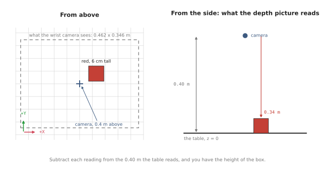
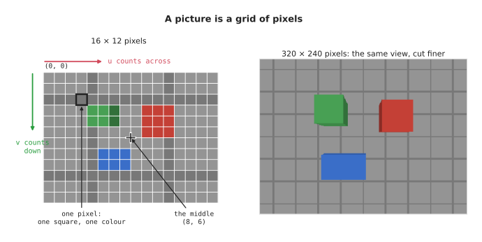
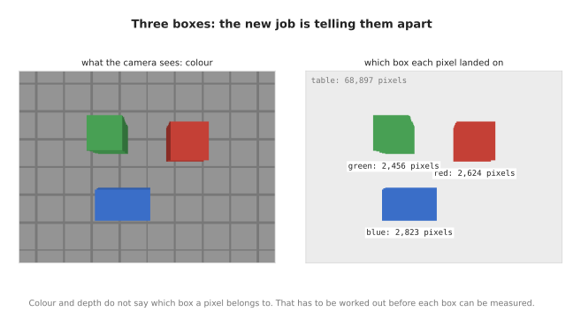
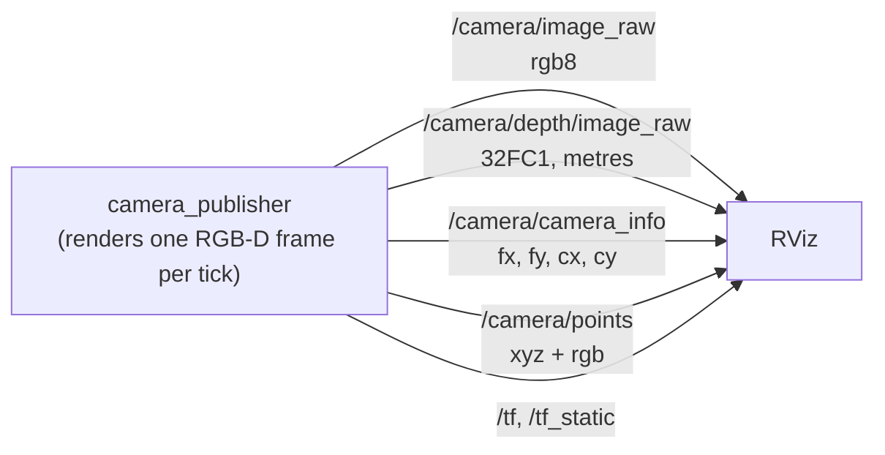
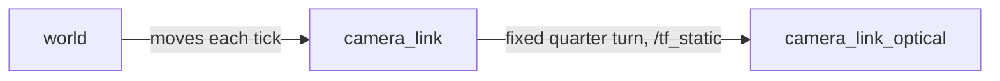

# Cameras: pictures, and the points inside them

## The problem

Three boxes are sitting on a table, and a robot arm has to pick them up.

Before it can, the arm needs to know two things about each box:

- **where it is** on the table
- **how tall it is**, so it knows how far down to reach

In this doc we will measure both, for all three boxes, using one camera. The
camera hangs 40 cm above the middle of the table and looks straight down. It is
the only thing doing the measuring. Nothing tells it where the boxes are, or how
big they are.


The boxes are cuboids: plain rectangular blocks, standing upright.

| Box | Footprint | Height | Seen from above |
| --- | --- | --- | --- |
| red | 6 × 6 cm | 6 cm | top right of the middle |
| green | 5 × 5 cm | 9 cm | top left of the middle |
| blue | 9 × 5 cm | 4 cm | bottom left of the middle |

We know those numbers because we built the scene. The camera does not. That
makes it a fair test: by the end of the doc, the camera's own measurements should
match this table.

Why use a camera for this? Because the robot cannot know ahead of time what will
be on the table, or where. Someone may have moved a box since last time. A camera
sees the whole table at once, in a fraction of a second, without touching
anything.

We will get there in two steps:

- **Part 1: one box.** Just the red box on the table. Every idea about cameras
  is explained on this simplest case, ending with the red box measured.
- **Part 2: three boxes.** Put the other two back. Most of Part 1 carries over
  unchanged, so this part is only about what is new: telling the boxes apart.

The pictures in this doc are not drawn by hand. They are taken by the code this
area describes, and so are the numbers beside them.

## Contents

**[Part 1: one box](#part-1-one-box)**

1. [What a camera is for](#1-what-a-camera-is-for)
2. [How a camera makes a picture](#2-how-a-camera-makes-a-picture)
   · [A grid of pixels](#a-grid-of-pixels)
   · [Resolution: how many pixels](#resolution-how-many-pixels)
   · [Field of view: how wide it sees](#field-of-view-how-wide-it-sees)
3. [What a picture loses](#3-what-a-picture-loses)
4. [Getting distance back: the depth picture](#4-getting-distance-back-the-depth-picture)
   · [Where the 76,800 readings land](#where-the-76800-readings-land)
   · [Depth is not distance](#depth-is-not-distance)
5. [The camera used in this doc](#5-the-camera-used-in-this-doc)
6. [The lens as four numbers](#6-the-lens-as-four-numbers)
   · [The camera's own axes](#the-cameras-own-axes)
   · [Where 277 comes from](#where-277-comes-from)
7. [Field of view and resolution are separate knobs](#7-field-of-view-and-resolution-are-separate-knobs)
8. [Pixel plus depth gives back the point](#8-pixel-plus-depth-gives-back-the-point)
9. [Where the camera is](#9-where-the-camera-is)
   · [camera_to_world](#camera_to_world)
   · [Pointing it somewhere](#pointing-it-somewhere)
10. [What one capture contains](#10-what-one-capture-contains)
11. [The box, measured](#11-the-box-measured)

**[Part 2: three boxes](#part-2-three-boxes)**

12. [Telling the boxes apart](#12-telling-the-boxes-apart)
13. [The three boxes, measured](#13-the-three-boxes-measured)
14. [Why one picture is not enough](#14-why-one-picture-is-not-enough)

**[Reference: ROS, running and the code](#reference-ros-running-and-the-code)**

15. [Publishing it to ROS](#15-publishing-it-to-ros)
    · [Two sets of camera axes](#two-sets-of-camera-axes)
    · [How the pieces connect](#how-the-pieces-connect)
    · [Settings you can change](#settings-you-can-change)
16. [Running it](#16-running-it)
    · [Checking it works](#checking-it-works)
    · [Commands](#commands)
17. [Working on the code](#17-working-on-the-code)
    · [Layout](#layout)
    · [Changing things](#changing-things)
18. [Notes and gotchas](#18-notes-and-gotchas)
19. [Vocabulary](#19-vocabulary)

---

## Part 1: one box

Start with the simplest version of the problem: only the red box, on its own,
exactly where it stands in the full scene. It is a 6 cm cube.



Everything in this part is shown on this one box: what a camera does, what it
loses, how depth gets it back, and how a pixel becomes a point. It ends with the
box measured.

## 1. What a camera is for

A camera is good at one part of this job straight away: it can see what is on
the table. A photo of it shows a red box.

But an ordinary colour photo cannot finish the job. It can tell you that
something red is over there, in that direction. It cannot tell you how far away
it is — and without that, it cannot tell you where the box is, or how tall.

Sections 2 to 4 explain why, using nothing but what a camera physically does.
The rest of Part 1 gets the missing information back, and then uses it to
measure the box.

---

## 2. How a camera makes a picture

A camera is a box with a lens at the front and a flat sensor at the back.

Light bounces off everything in the room. Some of it passes through the lens and
lands on the sensor. The sensor is covered in a grid of tiny light detectors, and
each one records the colour of the light that reached it.

That grid of recordings is the picture.

### A grid of pixels

Each detector gives one square of the picture, called a **pixel** — short for
*picture element*. A pixel holds one colour, and nothing else.



The left picture was taken with a camera only 16 pixels across and 12 down, so
you can see every square. The red box is just a few red squares.

Pixels are numbered from the **top-left** corner:

- `u` counts across, left to right
- `v` counts **down**, top to bottom

So `(0, 0)` is the top-left pixel. The downward `v` is easy to trip over, because
on a graph `y` goes up. In a picture, it goes down.

A pixel is a small square, not a point. Pixel `(3, 2)` covers the square from 3
to 4 across and from 2 to 3 down, so its middle is at `(3.5, 2.5)`. That half
pixel matters later.

### Resolution: how many pixels

**Resolution** is how many pixels a picture has, written width × height. The
camera in this doc is `320 × 240`: 320 across, 240 down, 76,800 pixels in all.

The right picture above is the same view at `320 × 240`. Nothing new came into
the shot. The same table was cut into many more, smaller squares, so the edges
come out sharp.

### Field of view: how wide it sees

**Field of view** is how many degrees across the camera takes in. It is set by
the lens.


A wide lens takes in more of the table. A narrow lens takes in less, as if
zoomed in. The camera in this doc sees 60° across. (The numbers under each lens
come back in section 7.)

Resolution and field of view are two separate things. One decides how much of
the world is in the picture. The other decides how finely it is cut up. That
difference matters a lot when choosing a camera, and section 7 shows why.

---

## 3. What a picture loses

Here is the most important fact about cameras.

**Every pixel looks out along one straight line.** Light reaching a pixel came
from somewhere along that line — and the pixel has no way of knowing where.


The picture shows three points on the same line out of the lens: one near, one
further, one further still. All three land on **the same pixel**. No camera could
tell them apart. (The formula at the bottom is explained in section 6.)

So a pixel does not tell you a place. It tells you a **direction**.

That is what people mean when they say a camera flattens the world. The world
has three dimensions. A picture has two. The one that gets thrown away is
distance.

That has everyday consequences:

- a big thing far away and a small thing close by can look exactly the same
- a colour picture cannot tell you how far away anything is
- so it cannot tell you where anything is, or how big

No clever code can fix this, because the distance was never recorded. The only
way out is to measure it separately.

---

## 4. Getting distance back: the depth picture

A **depth camera** measures the missing distance.

It takes a second picture, the same size as the colour one, through the same
lens, at the same moment. But instead of a colour, each pixel holds a
**distance, in metres**.

So you get **one depth reading for every pixel**. The camera in this doc is
320 × 240 pixels, so one depth picture holds **76,800 readings**. In this scene,
every one of the 76,800 came back with a number.

A camera that gives both pictures together is called **RGB-D**: red, green and
blue for the colour picture, plus D for depth.


Look at the numbers on the right. They are the depth readings for a small patch
of pixels at the edge of the red box. On the box they read `0.340` m. On the
table just behind it they read `0.400` m. (The labels `rgb8` and `32FC1` are the
names ROS gives these two pictures; section 10 explains them.)

That 6 cm jump is the red box. **No colour was needed to find it.** The depth
numbers alone say that something sticks up out of the table, and by how much.

### Where the 76,800 readings land

Here is where every reading landed, and what it read:

| Landed on | Readings | The top reads | Height above the table |
| --- | --- | --- | --- |
| the table | 74,176 | 0.400 m | — |
| the red box | 2,624 | 0.340 m | 0.060 m |
| **all of them** | **76,800** | | |

Most readings land on the table, and every one of those reads exactly `0.400` m.

The box gets 2,624 readings. Most of them land on its flat top, and all of those
read the same number: 2,352 readings of `0.340` m. The other 272 land on a thin
strip of the box's side, which the camera catches at its edge. They read a
little more, because the side is further down.

With only one box, finding its readings is easy: **anything that reads less than
the table's `0.400` must be the box.** Part 2 shows why that stops working with
more than one.

Subtract the box's top reading from the table's and you have its height:
`0.400 - 0.340 = 0.060` m, which is 6 cm. **That is half the job done**, from one
picture.

The other half is where the box is. With the two pictures together, each pixel
gives you a **direction** and a **distance**. A direction and a distance are
enough to pin down a point in 3D, and sections 5 to 9 turn that into arithmetic.

### Depth is not distance

One detail catches almost everyone.

**Depth is measured straight ahead, along the way the camera points — not along
the slanted line from the lens to the point.**

That is why the table reads exactly `0.400` m *everywhere*, corners included.
The corners are clearly further from the lens than the middle is. But every
point on the table is 0.40 m *in front of* the camera, measured straight down.

Mix the two up and every point comes out slightly too far away, worst at the
edges of the picture. Getting it right also keeps the maths simple later: the
third coordinate of a point turns out to be just the depth reading.

---

## 5. The camera used in this doc

With the basics in place, here is the camera the rest of the doc uses:

| What | Value | Meaning |
| --- | --- | --- |
| resolution | 320 × 240 | pixels across, pixels down |
| field of view | 60° across | how wide it sees |
| height | 0.40 m | how far above the table it hangs |
| pointing | straight down | at the middle of the table |

The table has a 5 cm grid printed on it, which makes it easy to see how much of
it is in shot.

These numbers are realistic. Small RGB-D cameras like this get mounted next to
a robot gripper, looking down at whatever it is about to pick up.

---

## 6. The lens as four numbers

To do arithmetic with a camera, its lens and sensor have to be described as
numbers. It takes exactly four:

| Number | What it means | Here |
| --- | --- | --- |
| `cx`, `cy` | the middle of the picture, in pixels. Straight ahead lands here | 160, 120 |
| `fx`, `fy` | the **focal length**, in pixels: how zoomed in the lens is | 277.1 |

Together they are called the **intrinsics**, because they are intrinsic to the
camera: part of the device itself. They do not change when the camera moves.

`fx` and `fy` are the same here, and on nearly every camera, because pixels are
square. They are kept as two numbers because the ROS message keeps them as two.

"Focal length in pixels" sounds odd, since lenses are measured in millimetres.
It is a useful shortcut. What the arithmetic needs to know is how many pixels a
given angle covers, and that depends on the lens and the sensor together. One
number, in pixels, covers both.

### The camera's own axes

To say where something is relative to the camera, we need the camera's own axes.
They are chosen to match the picture:

- **X** points right, the same way as `u`
- **Y** points **down**, the same way as `v`
- **Z** points straight ahead, out of the lens

With those axes, a point at `(x, y, z)` in front of the camera lands on this
pixel:

```
u = fx · (x / z) + cx
v = fy · (y / z) + cy
```

In words: how far to the side, **divided by how far ahead**, scaled up by the
focal length, then moved to the middle of the picture.

`x / z` is section 3 written as arithmetic. Twice as far away and twice as far
to the side gives the same ratio, so the same pixel. **Dividing by `z` is
exactly where distance gets thrown away.**

This is called **projection**: a 3D point in, a pixel out. It is what taking a
picture does.

### Where 277 comes from

The focal length follows from the resolution and the field of view. Half the
picture's width and half its field of view make a right-angled triangle with the
focal length:

```
fx = (width / 2) / tan(field of view / 2)
   = 160 / tan(30°)
   = 277.1
```

A real camera reports this number with every picture, so nothing has to work it
out. But the formula shows which way the trade goes: **halve the field of view
and the focal length roughly doubles.** Seeing less of the world means each
degree of it is spread over more pixels.

---

## 7. Field of view and resolution are separate knobs

Section 2 said these are different things. Here is why it matters: mixing them
up is the most common way to choose the wrong camera.


The top row changes the **lens** and keeps the sensor. From 40 cm above the
table:

| Lens | Field of view | `fx` | Sees, across | One pixel covers |
| --- | --- | --- | --- | --- |
| wide | 90° | 160.0 | 0.800 m | 2.50 mm |
| wrist | 60° | 277.1 | 0.462 m | 1.44 mm |
| narrow | 30° | 597.1 | 0.214 m | 0.67 mm |

The bottom row changes the **sensor** and keeps the lens:

| Sensor | Resolution | `fx` | Sees, across | One pixel covers |
| --- | --- | --- | --- | --- |
| lowres | 80 × 60 | 69.3 | 0.462 m | 5.77 mm |
| wrist | 320 × 240 | 277.1 | 0.462 m | 1.44 mm |
| hires | 640 × 480 | 554.3 | 0.462 m | 0.72 mm |

All three sensors see exactly the same 46 cm of table. They only differ in how
many pieces they cut it into.

The number that decides whether a camera can do a job is the last column: **how
many millimetres one pixel covers**, at the distance you work at. If one pixel
covers 1.4 mm, nothing 1 mm wide can be measured reliably. No code can fix that
afterwards.

Two things follow that are easy to get wrong:

- **A wide lens is not "more camera".** It spreads the same pixels over more of
  the world, so everything in it is measured more coarsely.
- **More pixels do not show you more.** They cut the same view more finely.

And `fx` on its own tells you nothing. `fx` changes in both tables, for
different reasons. Always read it next to the resolution.

---

## 8. Pixel plus depth gives back the point

This is the section the rest of the area exists for.

A pixel is a direction. A depth reading is the distance that was thrown away.
Put the distance back, and the 3D point comes back.


Turn the two formulas from section 6 around:

```
x = (u - cx) · depth / fx
y = (v - cy) · depth / fy
z =  depth
```

This is called **deprojection**: a pixel and a depth in, a 3D point out. The
reverse of taking a picture.

Here it is for one pixel on top of the red box:

```
pixel (212.5, 86.5), depth 0.340 m

x = (212.5 - 160) · 0.340 / 277.1 = +0.0644 m
y = (86.5 - 120)  · 0.340 / 277.1 = -0.0411 m
z =                                 +0.3400 m
```

So that spot on the red box is:

- 6.4 cm to the right of the camera
- 4.1 cm towards the top of the picture
- 34 cm in front of it

Three things to notice:

- **`y` is negative.** The camera's Y points down the picture. This pixel is
  *above* the middle — `86.5` is less than `120` — so it comes out negative.
  Nothing is wrong.
- **The `.5` in the pixel** is the middle of the pixel, as section 2 said. At the
  edge of a box, half a pixel is the difference between measuring the box and
  measuring the table behind it.
- **It goes both ways.** Put `(0.0644, -0.0411, 0.340)` back into the formula in
  section 6 and pixel `(212.5, 86.5)` comes straight back. It is one formula,
  read in two directions.

The answer is still measured from the camera. A robot needs it in the room — and
for that, it needs to know where the camera is.

---

## 9. Where the camera is

The point above is "34 cm in front of me". To know where that is in the room,
you also need to know where "me" is, and which way it faces.

That is the camera's **pose**: where it is, and which way it points. Every
picture has to carry it, or its numbers cannot be placed anywhere.

### camera_to_world

The pose is kept as one table of numbers, called **camera_to_world**. For the
camera in this doc, looking straight down from 40 cm up:

|  | camera's RIGHT | camera's DOWN | camera's FORWARD | camera's POSITION |
| --- | :---: | :---: | :---: | :---: |
| world x | 1 | 0 | 0 | 0.00 |
| world y | 0 | −1 | 0 | 0.00 |
| world z | 0 | 0 | −1 | 0.40 |
|  | 0 | 0 | 0 | 1 |

How to read it:

- **The last column is where the camera is**, in metres: 0.40 m above the middle
  of the table.
- **The first three columns are directions.** They say which way the camera's
  right, down and forward point in the room. Forward is `(0, 0, −1)`: straight
  down.
- **The bottom row is always `0 0 0 1`.** It carries no information. It is there
  so that turning and shifting can be done in one step.

It is the same idea as a transform in the [arm area](../arm/overview.md): a turn
and a shift, kept together.

Using it is simpler than it looks. Start at the camera's position. Walk `x`
along the camera's right, `y` along its down, and `z` along its forward. Where
you end up is the point in the room.

Do that with the red box point from section 8 and it lands at
`(+0.0644, +0.0411, +0.0600)` in the room. That `z` of `0.060` m is exactly the
height of the red box — and nothing in the calculation was told the height.

The `y` changed sign on the way. For this camera, "down the picture" is world
`−Y`, so a point towards the top of the picture has a positive `y` in the room.

### Pointing it somewhere

Given a place to put the camera and a thing to look at, its three axes follow:

1. **forward** is the arrow from the camera to the thing it looks at
2. **right** is at right angles to forward and to "up"
3. **down** is then at right angles to both

"Up" only decides which way up the picture comes out. It must not point the
same way as forward. A camera looking straight down is exactly that case, so
there the code refuses to guess rather than quietly producing nonsense.

---

## 10. What one capture contains

One shot through one lens at one moment gives several pictures, all the same
size, all describing the same pixels. ROS names each kind by its **encoding**:
what the numbers in each pixel mean.

| Picture | Encoding | Each pixel holds | At the red box pixel |
| --- | --- | --- | --- |
| colour | `rgb8` | red, green, blue, 0 to 255 each | `(196, 64, 54)` |
| grey | `mono8` | brightness, 0 to 255 | `102` |
| depth | `32FC1` | distance, in metres | `0.3400` |
| depth | `16UC1` | distance, in whole millimetres | `340` |

**Colour** is what people usually mean by "a camera". On its own it is the least
useful here: direction and appearance, but no measurements.

**Grey** is a third of the data, and a lot of vision work — finding edges and
corners, tracking — never looks at colour. It is not the plain average of red,
green and blue. The eye is much more sensitive to green, so grey weights them
`0.299` red, `0.587` green and `0.114` blue.

**Depth** comes in two forms. `32FC1` holds metres as decimal numbers. `16UC1`
holds whole millimetres. They are the same measurement — but read one as the
other and everything is out by a factor of a thousand.

One more thing comes out of the same shot: **a point cloud**. That is every
pixel with a depth reading, deprojected into a 3D point with section 8's
arithmetic. Taking every fourth pixel across and down gives 4,800 points. Two of
them, in room coordinates:

| Landed on | x | y | z |
| --- | --- | --- | --- |
| table | −0.230 | 0.172 | 0.000 |
| red box | 0.035 | 0.068 | 0.060 |

Every `z` is the height of what that pixel landed on. This is the form the rest
of a robot wants. A picture is a grid of directions; a point cloud is a
collection of places, and places can be grouped, measured and picked up.

A real depth camera never fills in every pixel. Shiny, dark or see-through
surfaces, and anything out of range, come back with no reading. Here those stay
missing rather than being filled with a made-up value, because a made-up value
would put a surface where there is none.

---

## 11. The box, measured

Everything is now in place to measure the box. It takes four steps:

1. take the pixels that landed on the box — with one box, the ones reading less
   than `0.400`
2. turn each one into a point in the room, with sections 8 and 9
3. keep only the highest points: that is the box's top
4. average them

The average of the top is the middle of the box. The height of the top is how
tall the box is. The strip of side from section 4 sits lower than the top, so
step 3 leaves it out.

Nothing about the box was looked up. The answer comes only from its pixels, the
depth readings, the four lens numbers, and where the camera was.

Positions are in metres from the middle of the table, the spot straight under
the camera:

| Box | Measured middle | True middle | Measured height | True height |
| --- | --- | --- | --- | --- |
| red | (+0.064, +0.040) | (+0.065, +0.040) | 0.060 m | 0.060 m |

The middle is within a millimetre of the truth, and the height is exact. One box,
measured from one picture.

This is `Capture.measure()` in `camera.py`, and it is the last thing Part 1 of
`make camera.learn` prints.

---

## Part 2: three boxes

Now put the green and blue boxes back, exactly as in the problem at the top.


Almost nothing from Part 1 changes. The camera is the same, and so are its four
numbers, its pose, and the arithmetic that turns a pixel into a point. The red
box reads exactly what it read before.

Only one thing breaks, and this part is about that.

## 12. Telling the boxes apart

In Part 1, finding the box was easy: anything reading less than the table's
`0.400` was the box.

With three boxes, that rule finds all three at once. It says these 7,903 pixels
are not the table, but not which box each one belongs to. Measure that lump the
Part 1 way and it goes wrong: keeping the highest points finds only the tallest
box, the green one, and the other two vanish.

So before any box can be measured, its pixels have to be sorted out from the
others. The result is called a **mask**: for every pixel, which box it landed
on.



Here is how the 76,800 readings split up now:

| Landed on | Readings | The top reads | Height above the table |
| --- | --- | --- | --- |
| the table | 68,897 | 0.400 m | — |
| green box | 2,456 | 0.310 m | 0.090 m |
| red box | 2,624 | 0.340 m | 0.060 m |
| blue box | 2,823 | 0.360 m | 0.040 m |
| **all of them** | **76,800** | | |

The red box still has exactly 2,624 readings, the same as in Part 1. The two new
boxes take their readings away from the table instead: 74,176 in Part 1, 68,897
now.

Where does the mask come from? Here the simulator knows it for free, because it
knows what every line of sight hit. A real camera has to work it out, and the
usual clues are:

- **colour**: red pixels are probably the red box
- **jumps in depth**: where the depth changes suddenly, one object ends and
  another begins

Working this out is called **segmentation**. On a real camera it is the hard
part, and a large share of real vision work is doing it well. This doc takes the
mask as given, so that it can stay about the camera.

---

## 13. The three boxes, measured

With the mask, each box gets its own pixels. Each one is then measured exactly as
the red box was in section 11: turn its pixels into points, keep its top, and
average.

| Box | Measured middle | True middle | Measured height | True height |
| --- | --- | --- | --- | --- |
| red | (+0.064, +0.040) | (+0.065, +0.040) | 0.060 m | 0.060 m |
| green | (−0.060, +0.048) | (−0.060, +0.048) | 0.090 m | 0.090 m |
| blue | (−0.040, −0.062) | (−0.040, −0.062) | 0.040 m | 0.040 m |

Every middle is within a millimetre of the truth, and every height is exact.
That is the problem from the top of the doc, solved: where each box is and how
tall it is, from one picture.

The red box comes out exactly as it did in Part 1, to the last digit. The other
two boxes did not disturb it, which is the whole point of telling them apart.

---

## 14. Why one picture is not enough

Move the camera and the same scene reads differently.

| Where the camera is | Depth readings run | What it sees |
| --- | --- | --- |
| straight down | 0.310 m to 0.400 m | the tops of things, and a table that reads the same everywhere |
| leaning in about 20° | 0.306 m to 0.505 m | some of the sides, and a table that slopes across the picture |

From straight above you mostly see tops, and a tall box can hide a short one
behind it. The tilted view sees some sides instead, and finds what was hidden.
Its table no longer reads one number, because the far edge really is further
away.

Neither view is better. They see different things. That is why a robot that
wants to measure something usually takes two or three pictures from different
places. Each picture carries its own `camera_to_world`, so the points from every
view land in the same room coordinates and simply add together.

---

## Reference: ROS, running and the code

The two parts above are the ideas. This part is the practical side: how the same
pictures go out over ROS, how to run everything, and where things are in the
code.

## 15. Publishing it to ROS

Everything so far is plain Python. `camera.py` does not use ROS at all.

The node next to it, `camera_publisher.py`, is only packaging. It takes the same
pictures and puts them on topics in the shape the rest of ROS expects. Swap the
simulated scene for a real camera and those topics stay the same, so anything
built on them keeps working.

### Two sets of camera axes

Section 6 gave the camera's axes as X right, Y down, Z forward, to match the
picture. The rest of a robot uses a different habit: X forward, Y left, Z up.

ROS keeps both, as two frames in the same place:


| Frame | Axes | Used for |
| --- | --- | --- |
| `camera_link` | X forward, Y left, Z up | attaching the camera to the robot, like any other part |
| `camera_link_optical` | X right, Y down, Z forward | stamping the pictures, so the formulas stay short |

Between them is a fixed quarter turn that never changes. ROS publishes it once,
on `/tf_static`, as the quaternion `(-0.5, 0.5, -0.5, 0.5)` — the same four
numbers on every ROS camera. Frames that use the picture's axes are named
`..._optical` by habit, so nobody has to guess which is which.

**This is the most common camera bug in ROS.** Stamp an image in `camera_link`
instead of the optical frame and nothing complains. The point cloud just comes
out lying on its side, turned a quarter turn, and it looks like a mistake in your
own maths.

### How the pieces connect



The frames:



`world` stays still, and RViz draws everything from it. `camera_link` circles
slowly, always looking at the middle of the table. `camera_link_optical` is a
quarter turn from it and never moves relative to it.

Two things about this are the whole lesson:

**Every message carries the same timestamp.** A depth picture only makes sense
next to the four numbers and the pose it was taken with. Anything downstream
matches the topics up by their timestamp, so they have to agree.

**The point cloud is published from the camera's point of view**, and left
there, exactly as a real camera driver does. RViz moves it into the room by
looking up TF. Nothing recalculates the points when the camera moves — the same
idea as the [rviz area](../rviz/overview.md), where the ball never moves but its
frame does.

### Settings you can change

They are node settings, so no code needs editing:

| Setting | Default | What it does |
| --- | --- | --- |
| `width_px` | 160 | picture width |
| `height_px` | 120 | picture height |
| `hfov_deg` | 60.0 | field of view across. Try 90 for wide, 30 for zoomed in |
| `camera_height_m` | 0.40 | how far above the table it hangs |
| `orbit_radius_m` | 0.13 | how far it leans out from straight above |
| `orbit_period_s` | 20.0 | seconds for one circle |
| `cloud_step` | 2 | use every Nth pixel for the point cloud |
| `publish_rate_hz` | 2.0 | pictures per second |
| `world_frame` | `world` | name of the still frame |
| `camera_frame` | `camera_link` | the robot-style frame |
| `optical_frame` | `camera_link_optical` | the frame pictures are stamped in |

The demo runs at `160 × 120` and two pictures a second, on purpose. Each pixel
is worked out in plain Python, one at a time, so resolution is what costs time.
Doubling both the width and the height does four times the work.

---

## 16. Running it

Two commands. Start with the first:

```
make camera.learn
```

It runs the two parts in order, prints them in the terminal, and exits.

Part 1, one box:

- the four numbers for each lens, and how much each one covers
- `camera_to_world`
- a capture drawn in text characters, and where its depth readings land
- one pixel worked through to a point, and a point cloud
- the encodings side by side, and the same shot through three lenses
- the box, measured, next to its true size

Part 2, three boxes:

- which box each pixel landed on
- where the depth readings land now
- all three boxes, measured, next to their true sizes
- the same scene from two positions

```
make camera.demo
```

This one opens RViz. You should see:

- a **point cloud** of the table and the three boxes, in colour, rebuilt twice a
  second
- two **image** panels: colour and depth
- the camera's **frames** circling the scene once every 20 seconds
- a 5 cm **grid**

In the terminal:

```
[camera_publisher-1] [INFO] [camera_publisher]: Publishing 160x120 RGB-D at 2 Hz:
                            fx = 138.6 px, 60° across, 2.89 mm per pixel
[rviz2-2] [INFO] [rviz2]: Stereo is NOT SUPPORTED
[rviz2-2] [INFO] [rviz2]: OpenGl version: 2.1 (GLSL 1.2)
```

The last two lines look like problems. They are not — they are normal on a Mac.

Press Ctrl-C to stop.

### Checking it works

Leave `make camera.demo` running. In a second terminal:

```
make camera.check
```

It lists the topics, prints the four numbers the camera reports, and shows one
message from each of the other topics with their big arrays hidden. You should
see:

- `/camera/image_raw`, `/camera/depth/image_raw`, `/camera/camera_info` and
  `/camera/points` in the list
- `k:` on the camera info, holding `fx`, `cx`, `fy` and `cy`
- `encoding: rgb8` on the colour picture and `encoding: 32FC1` on the depth one
- `frame_id: camera_link_optical` on all three

If the images appear but the point cloud does not, check the Fixed Frame under
Global Options in RViz. It must be `world`.

If the point cloud appears but lies on its side, pictures are being stamped in
`camera_link` instead of the optical frame. See
[two sets of camera axes](#two-sets-of-camera-axes).

### Commands

```
make camera.learn    part 1 then part 2, in the terminal
make camera.demo     build, then start the node and RViz
make camera.check    show what it is publishing (run the demo first)
```

Everything else is repo-wide:

```
make build     rebuild after you change code
make test      run the tests
make lint      check code style
make shell     a shell with ROS ready, for typing ros2 commands
```

---

## 17. Working on the code

### Layout

```
docs/
  camera/overview.md                           this file
  diagrams/camera.py                           redraws the pictures in it
  images/camera/                               the pictures
src/camera_basics/
  camera_basics/camera.py                      the camera itself. No ROS in it
  camera_basics/problems/one_box.py            part 1: every idea, on one box
  camera_basics/problems/three_boxes.py        part 2: three boxes, what changes
  camera_basics/camera_publisher.py            the node. Only packaging
  launch/camera_demo.launch.py                 starts the node and RViz together
  rviz/camera_demo.rviz                        the saved RViz layout
  test/test_camera.py                          tests for the camera
  test/test_problems.py                        checks both parts print what this doc quotes
```

### Changing things

**Change the lens.** `CONFIGS` in `camera.py` holds the five compared in
section 7. Add one, or pass a different field of view to the demo:

```
pixi run bash -c 'source install/setup.bash && \
  ros2 launch camera_basics camera_demo.launch.py hfov_deg:=90.0'
```

**Change the scene.** `ONE_BOX_SCENE` is the red box alone, used in Part 1, and
`TABLE_SCENE` is all three, used in Part 2. Add a box or change a height, and
every picture and number here follows.

**Change a problem.** Each part is one file in `problems/`, and each prints its
own sections in order. They only drive `camera.py` and print what comes out, so a
new experiment is a new file next to them.

**Change what a capture gives you.** The methods on `Capture` — `mono8`,
`depth_millimetres`, `mask`, `point_cloud`, `measure` — are each a few lines
over the same stored pixels. A new one goes next to them.

**Use a real camera.** `camera.py` never imports ROS, and the node only ever
calls `capture()`. Replace that one call with a real camera's feed and nothing
else in the node changes.

If you change the lens, the resolution or the scene, redraw the pictures. They
are taken by the code, so they go out of date otherwise:

```
pixi run python docs/diagrams/camera.py
```

---

## 18. Notes and gotchas

**The pictures are made by ray casting.** For each pixel, the code sends a line
out through the lens, finds the first thing it hits, and records its colour and
distance. That is the reverse of how light really travels, and much easier to
compute, but it gives the same picture.

**There is no lens distortion here.** Real lenses bend straight lines, wide ones
especially. Calibrating a camera gives five numbers describing the bend, which
`CameraInfo` carries as `d`. This camera is perfect, so they are all zero. On a
real camera they are not, and ignoring them causes errors near the edges of the
picture.

**`16UC1` uses `0` for "no reading", and `32FC1` uses `NaN`** — short for *not a
number*. Forget that `0` means missing, and every hole in the depth picture turns
into a point sitting exactly inside the lens.

**The colour in a point cloud is stored oddly.** Each point's colour is packed
into four bytes labelled as a decimal number, but the bytes are really
`0x00RRGGBB`. That is what RViz expects, so that is what the node writes.

**`step` in an image message is the number of bytes in one row**, not the number
of pixels. Get it wrong and the picture comes out sheared diagonally.

**Depth cameras have a range.** Too close and too far both come back empty. The
near limit is why a camera pushed right up against something sees nothing at
all.

---

## 19. Vocabulary

| Term | Full name | Meaning |
| --- | --- | --- |
| pixel | picture element | one square of a picture, holding one value |
| `u`, `v` | — | a pixel's position: across from the left, down from the top |
| resolution | — | how many pixels, as width × height |
| field of view | — | how many degrees across the camera sees |
| depth | — | distance straight ahead of the camera, not along the slanted line |
| RGB-D | red, green, blue, depth | a camera that gives a colour and a depth picture together |
| intrinsics | — | `fx`, `fy`, `cx`, `cy`: the lens and sensor, as four numbers |
| `fx`, `fy` | focal length | how zoomed in the lens is, in pixels |
| `cx`, `cy` | principal point | the middle of the picture, in pixels |
| projection | — | 3D point in, pixel out. Taking a picture |
| deprojection | — | pixel and depth in, 3D point out. The reverse |
| pose | — | where the camera is, and which way it points |
| camera_to_world | — | the pose, as a table of numbers |
| point cloud | — | a collection of 3D points, made from a depth picture |
| mask | — | for every pixel, which object it landed on |
| segmentation | — | working out the mask from a real camera's pictures |
| cuboid | — | a plain rectangular block, like the three boxes here |
| encoding | — | what the numbers in an image message mean: `rgb8`, `32FC1`, and so on |
| optical frame | — | the camera's picture-matching axes: X right, Y down, Z forward |
| `K` | intrinsic matrix | the four numbers laid out as a 3 × 3 grid, as `CameraInfo` carries them |

Previous area: [position, frames and transforms](../arm/overview.md), which
builds the transform maths used in section 9 to move a point from the camera
into the room.
