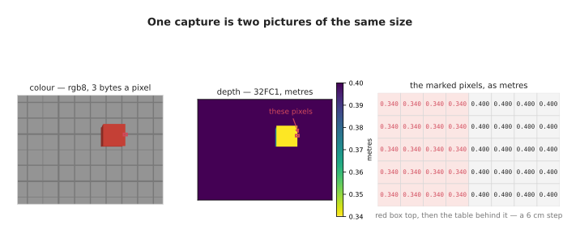
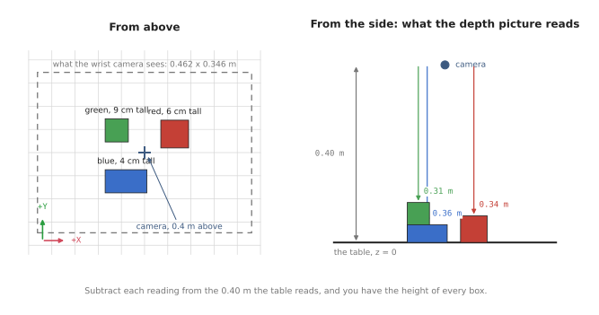
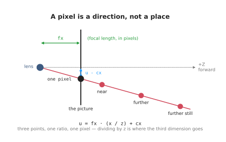
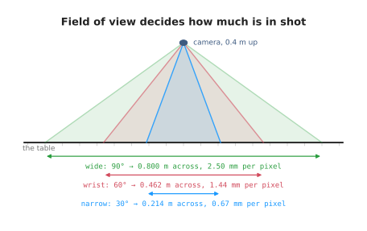
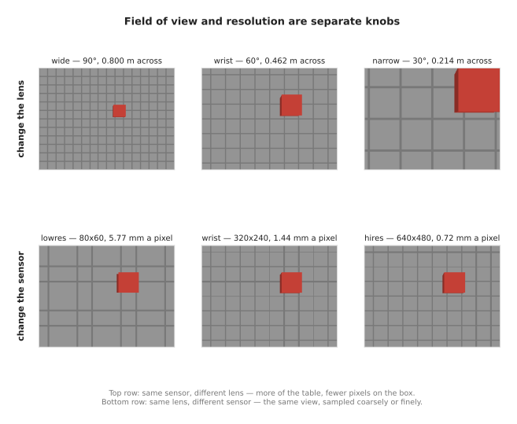
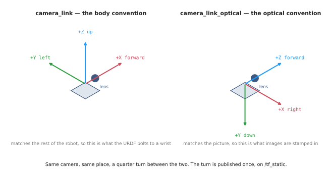
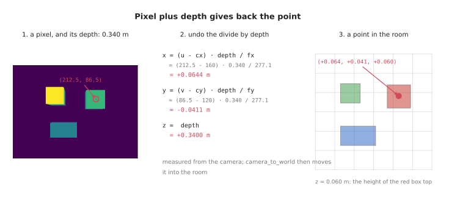
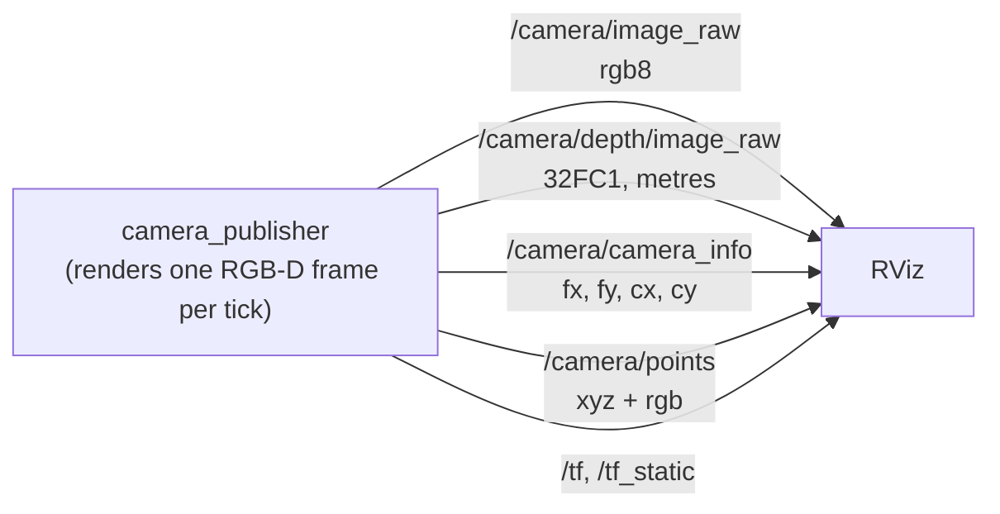
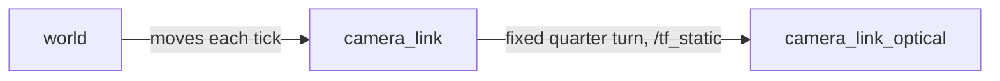

# Cameras: pictures, and the points inside them

A camera is the sensor a robot uses to find out what is in front of it. This
area is about the small piece of arithmetic that makes that possible.

A camera flattens. The world is 3D, a picture is 2D, and taking a picture throws
the third dimension away. Everything below is about what survives that, what it
costs, and how a second picture — a **depth** picture — puts back what was lost.



## The camera used in this doc

One camera, photographing one scene, throughout. It is worth fixing before going
on:

| Name | What it is | Value |
| --- | --- | --- |
| picture size | pixels across and down | 320 × 240 |
| `hfov` | how many degrees across it sees | 60°, fixed |
| `fx`, `fy` | focal length, in pixels | 277.1 |
| `cx`, `cy` | the middle of the picture | 160, 120 |
| height | how far above the table it sits | 0.40 m |

The scene is a grey table with a 5 cm grid printed on it and three boxes
standing on it: **red** 6 cm tall, **green** 9 cm, **blue** 4 cm.



Those numbers are not arbitrary. 320 pixels across 60° gives
`160 / tan(30°) ≈ 277`, which is close to what the small RGB-D cameras bolted
next to a gripper actually report, and 40 cm above the table is roughly where
such a camera sits when it looks at what the gripper is about to pick up.

The pictures in this document are not drawn by hand. They are taken by the code
this document describes, on the scene it defines. So are the numbers beside
them.

## Contents

1. [The question this area answers](#1-the-question-this-area-answers)
2. [A pixel is a direction, not a place](#2-a-pixel-is-a-direction-not-a-place)
   · [The four numbers](#the-four-numbers)
   · [Where 277 comes from](#where-277-comes-from)
   · [Vocabulary](#vocabulary)
3. [Configuring it: two separate knobs](#3-configuring-it-two-separate-knobs)
   · [Field of view: how much is in shot](#field-of-view-how-much-is-in-shot)
   · [Resolution: how finely it is sampled](#resolution-how-finely-it-is-sampled)
   · [Why they are worth keeping apart](#why-they-are-worth-keeping-apart)
4. [Where the camera is](#4-where-the-camera-is)
   · [Two conventions, on purpose](#two-conventions-on-purpose)
   · [camera_to_world](#camera_to_world)
   · [Pointing it somewhere](#pointing-it-somewhere)
5. [Different kinds of capture](#5-different-kinds-of-capture)
   · [Colour](#colour)
   · [Depth](#depth)
   · [Grey, and depth in millimetres](#grey-and-depth-in-millimetres)
   · [A mask](#a-mask)
   · [A point cloud](#a-point-cloud)
6. [Pixel plus depth gives back the point](#6-pixel-plus-depth-gives-back-the-point)
   · [The arithmetic](#the-arithmetic)
   · [Depth is not distance](#depth-is-not-distance)
7. [Why one picture is not enough](#7-why-one-picture-is-not-enough)
8. [Publishing it to ROS](#8-publishing-it-to-ros)
   · [How the pieces connect](#how-the-pieces-connect)
   · [Settings you can change](#settings-you-can-change)
9. [Running it](#9-running-it)
10. [Working on the code](#10-working-on-the-code)
11. [Notes and gotchas](#11-notes-and-gotchas)

---

## 1. The question this area answers

A robot arm is about to pick something up. Before it can, somebody has to answer:

- **What is on the table?**
- **Where is it**, in the same coordinates the arm moves in?
- **How big is it**, so the gripper opens far enough?

A camera seems like the obvious way to find out, and it is. But a colour picture
on its own cannot answer any of the three. It can tell you *something red is
over there, in that direction*, and no more. It cannot tell you how far away the
red thing is, and therefore it cannot tell you where it is or how big it is.

That is not a limitation of the code. It is what flattening means, and the next
section is about why.

The way out is a second picture, taken through the same lens at the same moment,
where each pixel holds a distance instead of a colour. With those two together,
every pixel becomes a point you can measure. That is the whole of this area, and
[`camera.py`](../../src/camera_basics/camera_basics/camera.py) is the whole of
it in one file, with no ROS in it.

---

## 2. A pixel is a direction, not a place

Take three points: one 1 m away and 25 cm off to the side, one 2 m away and
50 cm off to the side, one 4 m away and a metre off to the side.

All three land on the same pixel.



They have to. They are on the same line out of the lens, so no camera could tell
them apart. A pixel does not name a place. It names a **direction**, and
everything along that direction shares it.

As arithmetic, for a point measured in the camera's own axes:

```
u = fx · (x / z) + cx
v = fy · (y / z) + cy
```

`x / z` is the whole idea. Twice as far away for twice the offset is the same
ratio, so it is the same pixel. **Dividing by `z` is where the third dimension
goes.**

Everything awkward about cameras follows from that one division:

- a colour camera cannot measure size or distance, only direction
- a big thing far away and a small thing close by look identical
- to get a position back you have to supply the `z` that was divided out

### The four numbers

`fx`, `fy`, `cx`, `cy` are called the **intrinsics**, because they are intrinsic
to the camera itself — its lens and its sensor — and do not change when it
moves. A driver reports them with every frame, and they are all you need.

| Number | What it is | Here |
| --- | --- | --- |
| `cx`, `cy` | the middle of the picture, in pixels. Straight ahead lands here | 160, 120 |
| `fx`, `fy` | the focal length, **in pixels**: how zoomed in the lens is | 277.1 |

Focal length measured in pixels sounds like a category error — a lens is
measured in millimetres. It is a shortcut, and a good one. What the arithmetic
needs to know is *how many pixels a given angle covers*, which mixes the lens
and the sensor together. Folding both into one number, measured in pixels, means
nothing downstream ever has to know either separately.

`fx` and `fy` are equal here, and on essentially every camera you will meet,
because pixels are square. They are kept apart anyway, because the message
format keeps them apart.

### Where 277 comes from

A camera `width` pixels across, seeing `hfov` degrees across, is a triangle. Half
the width is the opposite side, the focal length is the adjacent side, and half
the field of view is the angle between them:

```
fx = (width / 2) / tan(hfov / 2)
   = 160 / tan(30°)
   = 277.1
```

In a real run nothing calculates this. The driver sends it with every frame and
the code reads it. It is worth being able to derive because it says which way the
trade goes: **halve the field of view and the focal length roughly doubles.**
Seeing less of the world means each degree of it covers more pixels.

### Vocabulary

| Term | Full name | Meaning |
| --- | --- | --- |
| intrinsics | — | `fx`, `fy`, `cx`, `cy`: the lens and sensor, as four numbers |
| `fx`, `fy` | focal length | how zoomed in the lens is, measured in pixels |
| `cx`, `cy` | principal point | the middle of the picture, in pixels |
| fov | field of view | how many degrees across the picture covers |
| projection | — | 3D point in, pixel out. The flattening |
| deprojection | — | pixel plus depth in, 3D point out. The reverse |
| RGB-D | red green blue, depth | a camera giving a colour and a depth picture together |
| depth | — | distance along the way the camera looks, not along the slanted line |
| optical frame | — | the camera's own axes: X right, Y down, Z forward |
| point cloud | — | a bag of 3D points, what a depth picture becomes |
| encoding | — | what the bytes in an image message mean: `rgb8`, `32FC1`, … |
| intrinsic matrix | `K` | the four numbers laid out as a 3 × 3, as `CameraInfo` carries them |

---

## 3. Configuring it: two separate knobs

There are two things you can change about a camera before you have changed
anything else, and they are independent. Confusing them is the most common way
to buy the wrong camera.

### Field of view: how much is in shot

How many degrees across the lens takes in. It decides **how much of the world is
in the picture**, and nothing else.



From 40 cm above the table:

| Lens | Field of view | `fx` | Sees, across | Per pixel |
| --- | --- | --- | --- | --- |
| wide | 90° | 160.0 | 0.800 m | 2.50 mm |
| wrist | 60° | 277.1 | 0.462 m | 1.44 mm |
| narrow | 30° | 597.1 | 0.214 m | 0.67 mm |

How much fits is `distance × width / fx`. Note that it grows with distance: twice
as far away means twice as much in shot, which is the same fact as the previous
section from the other end.

### Resolution: how finely it is sampled

How many pixels the sensor has. It decides **how finely whatever is in shot gets
sampled**, and nothing else.

| Sensor | Size | `fx` | Sees, across | Per pixel | Pixels |
| --- | --- | --- | --- | --- | --- |
| lowres | 80 × 60 | 69.3 | 0.462 m | 5.77 mm | 4,800 |
| wrist | 320 × 240 | 277.1 | 0.462 m | 1.44 mm | 76,800 |
| hires | 640 × 480 | 554.3 | 0.462 m | 0.72 mm | 307,200 |

All three see exactly the same 46 cm of table. They differ only in how many
pieces they cut it into.

### Why they are worth keeping apart



The top row changes the lens and keeps the sensor. The bottom row changes the
sensor and keeps the lens. Both change `fx` — which is why `fx` on its own tells
you nothing until you also know the picture size.

The number that actually matters for a job is the last column of both tables:
**millimetres per pixel at the distance you work at.** If one pixel covers
1.4 mm, nothing 1 mm wide is going to be measured reliably, whatever the code
does afterwards. That single number is what decides whether a camera can do what
you want, and it is a property of the lens, the sensor and the working distance
together.

Two things follow that are easy to get wrong:

- **A wide lens is not "more camera".** It spreads the same pixels over more
  world, so everything in it is measured more coarsely. Wide sees more, badly.
- **More pixels do not help you see more.** They cut the same view more finely.
  A 640 × 480 camera and an 80 × 60 camera with the same lens are pointed at
  exactly the same patch of table.

Note also that the vertical field of view is not a free choice. With square
pixels it falls out of the width, the height and the horizontal field of view:
the 320 × 240 camera above sees 60° across and 46.8° down, and no setting
changes that except changing one of the three.

---

## 4. Where the camera is

A picture says *this is 34 cm in front of me*. To know where that is in the room,
you also have to know where "me" was, and which way it faced. So a capture that
does not carry the camera's pose is not much use, and every real driver ships one
alongside every frame.

### Two conventions, on purpose

ROS uses two different sets of axes for cameras, at the same time, in the same
place.



| Frame | Axes | Why |
| --- | --- | --- |
| `camera_link` | X forward, Y left, Z up | matches the rest of the robot, so the URDF bolts this to a wrist |
| `camera_link_optical` | X right, Y down, Z forward | matches the picture, so images are stamped in this |

The optical one looks wrong until you notice where it comes from: in an image,
pixel `(0, 0)` is the **top** left and `v` counts downwards. Keeping the camera's
axes in step with the picture is exactly what lets the two formulas in section 2
be as short as they are. Rewrite them for a forward-is-X frame and they grow
minus signs everywhere.

So both conventions are kept, each doing the job it is natural for, with a fixed
quarter turn between them. The turn never changes, so it is published once, on
`/tf_static`, as the quaternion `(-0.5, 0.5, -0.5, 0.5)`. That is worth
recognising on sight: four halves with alternating signs, and it is the same on
every ROS camera there has ever been. Frames using the optical convention are
named `..._optical_frame` or `..._optical` by tradition, precisely so that nobody
has to guess which of the two a frame means.

**This is the single most common camera bug in ROS.** Stamp an image in
`camera_link` instead of the optical frame and nothing errors. The point cloud
simply comes out lying on its side, rotated a quarter turn, and it looks like a
maths bug in your own code.

### camera_to_world

Where the camera is, as one 4 × 4 table of numbers. For the top-down camera:

|  | camera's RIGHT | camera's DOWN | camera's FORWARD | camera's POSITION |
| --- | :---: | :---: | :---: | :---: |
| world x | 1 | 0 | 0 | 0.00 |
| world y | 0 | −1 | 0 | 0.00 |
| world z | 0 | 0 | −1 | 0.40 |
|  | 0 | 0 | 0 | 1 |

How to read it:

- **The last column is where the camera is**, in metres. 0.40 m above the middle
  of the table.
- **The first three columns are directions**, saying which way the camera's
  right, down and forward point in the room. Forward is `(0, 0, −1)`: straight
  down. Down-the-picture is world `−Y`, which is another way of saying world
  `+Y` comes out at the top of the picture.
- **The bottom row is always `0 0 0 1`.** It carries no information. It is there
  so that turning a point and shifting it become one multiplication instead of
  two steps.

Applying it is simpler than the table makes it look. Start at the camera, then go
`x` along its right, `y` along its down, `z` along its forward. That is all a
rotation ever does: the three columns are three directions to walk in.

Going the other way — a point in the room, measured from the camera — is three
dot products, because the three axes are perpendicular and one unit long. That
makes the inverse of the rotation the same numbers read the other way round,
which is a very unusual thing to be able to say about an inverse.

### Pointing it somewhere

Given a place to stand and a thing to look at, the three axes follow:

1. **forward** is the arrow from the camera to what it is looking at.
2. **right** is perpendicular to forward and to an "up" hint.
3. **down** is then forced, perpendicular to the other two.

The up hint only decides which way up the picture comes out; spinning a camera
about the direction it looks rotates the picture but does not change what is in
it. It must not be parallel to the viewing direction, which is exactly the case
for a camera looking straight down — there, world `+Z` is the wrong hint and the
code raises rather than quietly producing nonsense.

---

## 5. Different kinds of capture

One shot through one lens at one moment. Out of it come several different
pictures, all the same size, all describing the same pixels.

### Colour

Three bytes a pixel: red, green, blue, each 0 to 255. ROS calls this encoding
`rgb8`. The grey table reads `(148, 148, 148)`.

This is the picture people mean when they say "camera", and on its own it is the
least useful of the ones here. It tells you direction and appearance, and no
geometry at all.

### Depth

One number a pixel: how far away that pixel is, in metres. ROS calls this
encoding `32FC1` — 32-bit float, one channel.

From the top-down camera:

| What | Depth reads | Table minus that |
| --- | --- | --- |
| table | 0.400 m | — |
| green box top | 0.310 m | 0.090 m |
| red box top | 0.340 m | 0.060 m |
| blue box top | 0.360 m | 0.040 m |

Subtract each reading from the table's and you have the height of every box, to
the millimetre, from one picture. **That jump in the numbers is how a box shows
up.** No colour was involved.

Two things about that table are worth pausing on.

The first: the table reads 0.400 m *everywhere*, corners included, even though
the corners are further from the lens than the middle is. That is not a rounding
artefact — see [depth is not distance](#depth-is-not-distance) below.

The second: a real depth camera never fills in every pixel. Shiny surfaces, dark
surfaces, glass and anything past the sensor's range come back with no reading at
all, and code that assumes a number is always there breaks the first time it
meets a window. Missing readings are kept as missing here rather than clamped to
the near or far limit, because clamping invents surfaces that are not there.

### Grey, and depth in millimetres

Two more views of the same shot, both of which you will meet:

| Encoding | Per pixel | Bytes for 320 × 240 | At one sample pixel |
| --- | --- | --- | --- |
| `rgb8` | 3 bytes: r, g, b | 230,400 | `(196, 64, 54)` |
| `mono8` | 1 byte: brightness | 76,800 | `102` |
| `32FC1` | 4 bytes: metres | 307,200 | `0.3400 m` |
| `16UC1` | 2 bytes: millimetres | 153,600 | `340 mm` |

**Grey is not the average of the three.** The eye is far more sensitive to green
than to blue, so brightness that matches what a person sees weights them 0.299,
0.587 and 0.114. A third each gives a picture that is technically an average and
looks wrong. It is worth having anyway: a third of the data, and plenty of vision
work — edges, corners, tracking — never looks at colour at all.

**`32FC1` and `16UC1` are the same measurement in different clothes**, and mixing
them up is a thousand-fold error that will look like a wildly broken calibration.
Which one you get depends on the camera, so both are worth recognising. They also
disagree about how to say "no reading": `32FC1` uses `NaN`, `16UC1` uses `0`.
Forget the second and every hole in the depth picture turns into a point sitting
exactly inside the lens.

### A mask

Which pixels belong to which object — 2,624 of them are the red box here.

This one is a cheat. It is free in a simulator, which knows what every ray hit,
and on a real camera it is the hard part. It is also what the colour picture is
usually *for*: pick out the pixels belonging to the thing you care about, then
read only their depths. Having the true answer to hand is what makes a scene like
this useful for checking working code.

### A point cloud

Every pixel that has a depth reading, turned back into a 3D point. A 320 × 240
picture is 76,800 of them; taking every fourth pixel in each direction gives
4,800, which is plenty for most purposes.

| Landed on | x | y | z |
| --- | --- | --- | --- |
| table | −0.230 | 0.172 | 0.000 |
| green | −0.084 | 0.071 | 0.090 |
| red | 0.035 | 0.068 | 0.060 |
| blue | −0.082 | −0.037 | 0.040 |

Every `z` is the height of the thing that pixel landed on. Nothing measured
those heights — they fall out of one depth reading per pixel and the arithmetic
in the next section.

This is the form the rest of a robot actually wants. A picture is a grid of
directions; a point cloud is a bag of places, and places are what you can group,
measure and grasp.

---

## 6. Pixel plus depth gives back the point

This is the section the rest of the area exists for.

Section 2 said a pixel is a direction, and that the third dimension was lost in
a division. The depth reading is the missing number. Put it back and the point
comes back.



### The arithmetic

Turn the two projection formulas around:

```
x = (u - cx) · depth / fx
y = (v - cy) · depth / fy
z =  depth
```

Worked through for one pixel on top of the red box:

```
pixel (212.5, 86.5), depth 0.340 m

x = (212.5 - 160) · 0.340 / 277.1 = +0.0644 m
y = (86.5 - 120)  · 0.340 / 277.1 = -0.0411 m
z =                                 +0.3400 m
```

Those three are measured from the camera. Push them through `camera_to_world`
and you get `(+0.0644, +0.0411, +0.0600)` in the room — and `z = 0.060 m` is
exactly the height of the red box top, which nothing in the calculation was told.

Project it again and pixel `(212.5, 86.5)` comes straight back. The round trip
closes because the two formulas are one formula read in both directions.

Two details worth noticing in that arithmetic:

- **`y` is negative from the camera and positive in the room.** Nothing is
  wrong. The camera's `+Y` is *down the picture*, and this pixel is above the
  middle of the picture. Moving into the room flips it, because for this camera
  down-the-picture is world `−Y`.
- **The `+ 0.5` in the pixel.** Pixel `(0, 0)` covers the square from 0 to 1, so
  its middle is at `(0.5, 0.5)`. Half a pixel sounds like a rounding detail; at
  the edge of a box it is the difference between measuring the box and measuring
  the table behind it.

### Depth is not distance

The one thing most likely to bite you here.

**Depth is measured along the direction the camera looks — not along the slanted
line from the lens to the point.**

That is why the whole table reads exactly 0.400 m from the top-down camera, when
the corners are plainly further from the lens than the middle is. It is also
what the deprojection above assumes. Feed it a straight-line distance and every
point comes out slightly too far away, worst at the edges of the picture, in a
way that looks like a lens distortion problem and is not.

The convention is not an accident: it is what makes `z = depth` the third line
of the deprojection instead of something involving a square root.

---

## 7. Why one picture is not enough

Move the camera and the same scene reads differently.

| Viewpoint | Depth readings run | What you see |
| --- | --- | --- |
| straight down | 0.310 m to 0.400 m | tops of things, and a flat table everywhere |
| leaning in ~20° | 0.306 m to 0.505 m | some of the sides, and a table that slopes across the picture |

From straight above you mostly see tops, and a tall box can hide a short one
behind it. The tilted view sees some of the sides instead, and picks up what was
hidden. Its table no longer reads one number, because the far edge really is
further away than the near edge.

Neither view is better. They see different things, which is why a robot that
wants to measure something usually takes two or three pictures from different
places and puts the points together. Since every capture carries its own
`camera_to_world`, points from different viewpoints land in the same room
coordinates and simply add up.

There is one more reason to move: the boxes near the edge of the picture show a
sliver of their own sides even to the top-down camera, because rays away from the
middle look outward at a slant. Which surfaces a camera can see is a property of
where it is standing, and no amount of resolution changes it.

---

## 8. Publishing it to ROS

Everything above is plain Python. `camera.py` has no ROS in it at all. The node
next to it is only packaging: it takes those pictures and puts them on topics in
the shape the rest of the ecosystem expects.

That split is the point. Swap the ray-cast scene for a Gazebo plugin or a real
RealSense driver and the topics below do not change, which is why a pipeline
written against them keeps working.

### How the pieces connect



The frames:



`world` stays still and RViz draws everything from it. `camera_link` walks slowly
round, always looking at the middle of the table. `camera_link_optical` is a
quarter turn from it and never moves relative to it — that is exactly why it goes
out on `/tf_static` rather than every frame.

Two things about that graph are the whole lesson:

**Everything carries the same timestamp.** A depth picture is only meaningful
next to the intrinsics that produced it and the pose it was taken from. Anything
downstream matches the four topics up by their stamp, so they have to agree.

**The point cloud is published in camera coordinates**, stamped in the optical
frame, and left there — exactly as a real driver does. RViz moves it by looking
up TF. Nothing re-computes the points when the camera moves. That is the same
lesson as the [rviz](../rviz/overview.md) area, where the ball never moves and
its frame does.

### Settings you can change

No maths to edit. They are node parameters:

| Setting | Default | What it does |
| --- | --- | --- |
| `width_px` | 160 | picture width. Every pixel is a ray, so this costs CPU |
| `height_px` | 120 | picture height |
| `hfov_deg` | 60.0 | field of view. Try 90 for wide, 30 for a zoom |
| `camera_height_m` | 0.40 | how far above the table it sits |
| `orbit_radius_m` | 0.13 | how far it leans out from straight above |
| `orbit_period_s` | 20.0 | seconds for one lap |
| `cloud_step` | 2 | take every Nth pixel for the point cloud |
| `publish_rate_hz` | 2.0 | frames per second |
| `world_frame` | `world` | name of the still frame |
| `camera_frame` | `camera_link` | the body-convention frame |
| `optical_frame` | `camera_link_optical` | the frame images are stamped in |

The demo runs at 160 × 120 and 2 frames a second on purpose. Every pixel is one
ray traced in plain Python, so the resolution is the cost. Raising `width_px` to
320 quadruples the work.

---

## 9. Running it

Two commands. Start with the first:

```
make camera.learn
```

It prints the whole thing: the intrinsics table, what each lens buys you,
`camera_to_world`, a capture drawn in the terminal in ASCII, the depth numbers,
one pixel worked through to a point, the encodings side by side, and the same
scene from two viewpoints and through three lenses. It takes about a second and
then exits.

```
make camera.demo
```

This one opens RViz. Expect:

- a **PointCloud2** of the table and the three boxes, in colour, rebuilt twice a
  second
- two **Image** panels, colour and depth
- the camera's **frames** walking slowly round the scene, once every 20 seconds
- a 5 cm **grid**

In the terminal:

```
[camera_publisher-1] [INFO] [camera_publisher]: Publishing 160x120 RGB-D at 2 Hz:
                            fx = 138.6 px, 60° across, 2.89 mm per pixel
[rviz2-2] [INFO] [rviz2]: Stereo is NOT SUPPORTED
[rviz2-2] [INFO] [rviz2]: OpenGl version: 2.1 (GLSL 1.2)
```

Those last two lines look like problems and are not. They are normal on a Mac.

Press Ctrl-C to stop.

### Checking it works

Leave `make camera.demo` running. In a second terminal:

```
make camera.check
```

It lists the topics, then prints the intrinsics the camera is reporting, and one
message from each of the other three with their big arrays hidden. You should
see `/camera/image_raw`, `/camera/depth/image_raw`, `/camera/camera_info` and
`/camera/points` in the list, `k:` on the camera info holding `fx`, `cx`, `fy`
and `cy`, `encoding: rgb8` on the colour image, `encoding: 32FC1` on the depth
one, and `frame_id: camera_link_optical` on all three.

If the point cloud is missing from RViz but the images are there, check the
Fixed Frame under Global Options. It must be `world`. If the cloud appears but
lies on its side, something is stamping images in `camera_link` rather than the
optical frame — see [two conventions](#two-conventions-on-purpose).

### Commands

```
make camera.learn    the walkthrough, in the terminal
make camera.demo     build, then start the node and RViz
make camera.check    show what it is publishing (run the demo first)
```

Everything else is repo-wide:

```
make build     rebuild after you change code
make test      run the tests
make lint      check code style
make shell     a shell with ROS ready, for typing ros2 commands
```

---

## 10. Working on the code

### Layout

```
docs/
  camera/overview.md                           this file
  diagrams/camera.py                           redraws the pictures in it
  images/camera/                               the pictures
src/camera_basics/
  camera_basics/camera.py                      the camera. No ROS in it
  camera_basics/camera_publisher.py            the node. Only packaging
  launch/camera_demo.launch.py                 starts the node and RViz together
  rviz/camera_demo.rviz                        the saved RViz layout
  test/test_camera.py                          the tests
```

Every area follows that shape: one package under `src/`, one folder under
`docs/`, and its pictures under `docs/images/<area>/`.

### Changing things

**Change the lens.** `CONFIGS` in `camera.py` holds the five compared in
section 3. Add one, or pass `hfov_deg` to the demo:

```
pixi run bash -c 'source install/setup.bash && \
  ros2 launch camera_basics camera_demo.launch.py hfov_deg:=90.0'
```

**Change the scene.** `TABLE_SCENE` is three `Box`es on a plane. Add a fourth,
or change a height, and every picture and every number in this document follows.

**Change what a capture gives you.** The methods on `Capture` — `mono8`,
`depth_millimetres`, `mask`, `point_cloud` — are each a few lines over the same
stored pixels. A new one goes next to them.

**Swap the camera for a real one.** `camera.py` never imports ROS, and the node
only ever calls `capture()`. Replace that one call with a driver subscription
and nothing else in the node changes.

If you change the lens, the resolution or the scene, redraw the pictures in this
file — they are taken by the code, not drawn by hand, so they will be wrong
otherwise:

```
pixi run python docs/diagrams/camera.py
```

---

## 11. Notes and gotchas

**The pictures are rendered by ray casting**, one ray per pixel, in plain
Python: send a ray out through each pixel, see what it hits first, write down the
colour and the distance. That is the reverse of how light works and much easier
to compute, and for this purpose it gives the same answer. It also has a happy
side effect worth knowing: if the ray's forward component is left at exactly 1,
then however far along it the scene is hit, that distance *is* the depth the
camera reports, with no extra arithmetic.

**There is no lens distortion here.** Real lenses bend straight lines, especially
wide ones, and a calibration produces five numbers describing the bend, which
`CameraInfo` carries in `d`. This camera is ideal, so those are zeros. On a real
camera they are not, and using the raw picture as though they were is a real
source of error near the edges.

**The `rgb` field in a point cloud is a wart.** Colour goes in as four bytes
declared `FLOAT32` but read as `0x00RRGGBB`. It is not a float and never was.
That is what RViz's "Color Transformer: RGB8" expects to find, so that is what
the node writes.

**`step` in an image message is the bytes in one row**, not the pixels. Getting
it wrong shears the picture diagonally, which is at least a recognisable symptom.

**A depth camera's range matters.** Both a near limit and a far one; readings
outside either come back empty. The near limit is why a camera pushed right up
against something sees nothing at all.

**Focal length in pixels tells you nothing on its own.** `fx = 277` is a wide
lens on a 640-pixel sensor and a narrow one on a 160-pixel sensor. Always read
it next to the picture size.

Previous area: [position, frames and transforms](../arm/overview.md), which
builds the transform maths this area uses to move a point from the camera into
the room.
