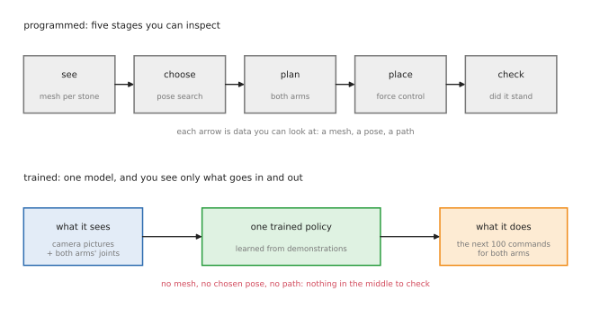
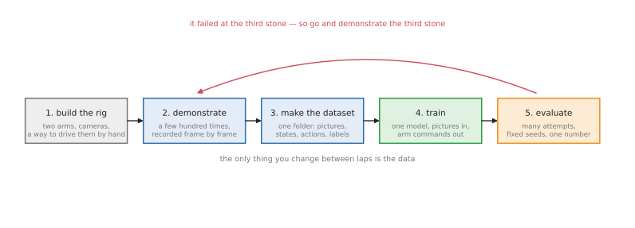

# Training the whole thing: overview

The [stone stacking doc](../stone-stacking.md) offers three ways to build the
system, and this folder takes the second one — **train all of it** — and follows
it from an empty folder to a measured success rate.

"Train all of it" means there is no stone mesh, no search for a stable pose, no
motion planner and no hand-written release. There is one model. It takes camera
pictures and the current joint angles, and it emits joint commands for both
arms. Everything the modular system computes explicitly, this one has to learn
from examples of a person doing the task.

This is not the easiest way to get a tower standing. It is the way that learns
the part nobody can write down — what to do in the last centimetre, when the
stone is touching and about to be let go — and it is the approach behind most of
the two-arm results published since 2023.

## Contents

1. [What is replaced by the model](#1-what-is-replaced-by-the-model)
2. [The five phases](#2-the-five-phases)
3. [What you need before starting](#3-what-you-need-before-starting)
4. [Why it is hard for this particular task](#4-why-it-is-hard-for-this-particular-task)
5. [The one design decision that matters](#5-the-one-design-decision-that-matters)
6. [When to choose this](#6-when-to-choose-this)

---

## 1. What is replaced by the model

In the modular system, every arrow between stages is something you can print: a
mesh, a chosen pose, a planned path, a measured force. When the tower falls, you
look at those and find the stage that was wrong.

In the trained system there is nothing in the middle. The model has an opinion
about where the stone is and how to place it, but that opinion never takes a
form you can read. You see the pictures going in and the commands coming out,
and between them a few million numbers.

That trade is the whole story of this approach. You give up the ability to debug
stage by stage, and you get behaviour that no one had to specify.

## 2. The five phases

1. **Build the rig.** Two arms, cameras that see the work, and a way for a
   person to drive both arms at once.
2. **Demonstrate.** Do the task by hand, over and over, recording everything.
3. **Make the dataset.** Turn those recordings into one folder in a standard
   format, with the failures marked or dropped.
4. **Train.** One model, for a few hours, on the whole dataset.
5. **Evaluate.** Many attempts from fixed starting states, and one honest
   number at the end.

Then round again — and the important part is that **the thing you change is
almost always the data**, not the model. If it drops the third stone, you go and
demonstrate third stones. That loop, not the architecture, is what makes these
systems work.

The next two docs cover the phases in detail:
[collecting the data](collecting-data.md) is phases 1 to 3, and
[training and evaluating](training-and-evaluating.md) is phases 4 and 5.

## 3. What you need before starting

| You need | Why | The cheap version |
| --- | --- | --- |
| two arms, in simulation | so a failed grasp costs nothing | any open pair: two Panda arms, two UR5s, the ALOHA pair |
| two or three cameras | one overhead view cannot see a gripper's contact | one overhead, one on each wrist — all simulated |
| a way to drive both arms by hand | this is what produces the data, and it is the part people underestimate | see [collecting the data](collecting-data.md#2-how-a-person-drives-two-arms) |
| a few hundred demonstrations | a policy can only copy what it has seen | a scripted expert can stand in for a person; same doc, [section 3](collecting-data.md#3-the-fork-a-person-or-a-program) |
| a GPU for a few hours | training is cheap by modern standards, but not free | a rented hour or two; an Apple Silicon Mac works overnight |
| a way to reset the scene | every attempt needs the stones back on the table | trivial in simulation, which is most of why we stay there |

## 4. Why it is hard for this particular task

Stone stacking is at the difficult end of what imitation learning does well, and
it is worth knowing why before spending a week on it.

**The reward comes at the end, and only once.** The policy places a stone over
fifteen seconds, and whether that was right is only known when both grippers let
go. Everything before that looked fine.

**The task is long.** A tower of four stones is four grasps, four placements and
four releases. A policy trained end to end on whole towers needs to get all
twelve right in a row, and errors compound: the published stone-stacking work
reports exactly this, that each stone is harder than the last.

**The demonstrations disagree with each other.** Ask a person to stack the same
stones twice and they will choose different faces and different orders. A policy
trained on contradictory examples averages them, and the average of two good
placements can be a bad one. This is the strongest argument for the design
decision below.

**What matters is invisible.** Whether a stone will hold depends on contacts a
few millimetres across, often hidden by the gripper and the stone itself. The
policy has to infer them from how things move and, ideally, from force.

## 5. The one design decision that matters

**Do not train "build a tower". Train "add one stone".**

Make the policy's job: given the stones on the table and the tower as it stands,
add one more stone and let go. That single decision fixes most of the problems
above:

- **Episodes get short** — about twenty seconds instead of two minutes — so a
  person can record two hundred of them in an afternoon.
- **Every episode has a clean outcome**: the stone stayed, or it did not. That
  is a label, and it arrives twenty seconds after the decision rather than two
  minutes.
- **The hard part gets repeated.** Every episode contains a touch-down and a
  release, which is where the value is, instead of one per tower.
- **Building a tower becomes a loop around the policy**: call it, check whether
  the stone held, call it again. The sequencing — which is easy — stays in
  ordinary code, and the contact behaviour — which is hard — is learned.

You lose the ability to plan two stones ahead. For a first system that is a good
trade, and you can give it back later by conditioning the policy on a goal.

## 6. When to choose this

**Choose training everything when** the difficulty really is in the contact, you
can produce demonstrations cheaply, and you care more about behaviour that works
than about being able to explain it.

**Choose the modular system when** you need to know why it failed, when you have
no way to demonstrate, or when the task is mostly geometry — which stone, which
way up — rather than touch.

**In practice most working systems split it**, exactly as the
[stone stacking doc suggests](../stone-stacking.md#6-programmed-or-trained) and
as the [survey of methods](../arms-training-methods/overview.md#15-what-real-systems-actually-do)
shows across a dozen real systems:
search for the pose with a physics engine, and train the last centimetre. Having
read this folder you will know what the training half costs, which is the
information you need to make that choice honestly.

---

Next: [collecting the data](collecting-data.md).
