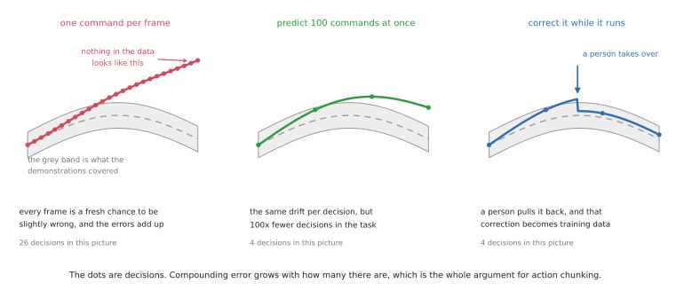
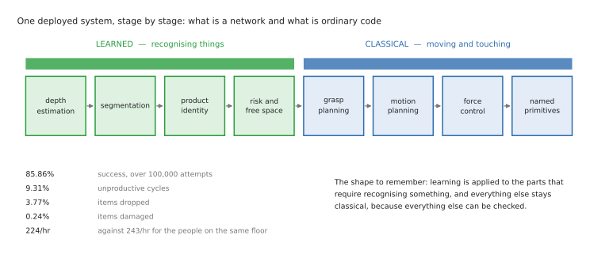

# Learned methods for one arm

These are the methods in which the behaviour comes from data rather than from
somebody writing it down — from demonstrations, from the robot's own practice, or
from a large pool of data that was gathered somewhere else entirely. They cope well
with variety, they need a great deal of data in order to do so, and when they fail
they cannot tell you why.

Read [the overview](overview.md) first if you have not already, and ideally
[the programmed methods](programmed-methods.md) as well, because almost everything
in this document is best understood as a replacement for one specific part of that
stack.

Each method below says which tasks it suits, what its status is in 2026, whether it
is worth your time to learn right now, and which open code to look at. The task
group letters, A to D, come from
[the overview's task catalogue](overview.md#1-what-an-arm-is-actually-asked-to-do).

**A warning about numbers, before you start.** Reporting in this field is unusually
unreliable. Company blog posts quote success rates without ever saying how many
trials they ran. Papers quote an average that quietly hides the one task where the
method failed completely. Demonstration videos are edited. Throughout this document,
wherever a number has a trial count attached to it, that is because the source
published one, and wherever it does not, that absence is itself a finding worth
noticing. It is worth getting into the habit of looking for the denominator before
you look at the percentage.

## Contents

1. [Learning from demonstrations](#1-learning-from-demonstrations)
2. [Learning from trial and error](#2-learning-from-trial-and-error)
3. [Learning from large-scale pretraining](#3-learning-from-large-scale-pretraining)
4. [Learned pieces inside a programmed system](#4-learned-pieces-inside-a-programmed-system)
5. [Directed by language](#5-directed-by-language)
6. [What to take from all five](#6-what-to-take-from-all-five)

---

## 1. Learning from demonstrations

You show the arm the task repeatedly and let the learner copy what you did. This is
the most practical learning method for arms today, and it is the one to start with.

### 1.1 Behaviour cloning

A person performs the task, usually by driving the robot directly, while the
cameras, the joint angles and the commands they gave are all recorded together. A
network is then trained to produce the command that the person gave, given what the
cameras saw at that moment. Nothing at all about the task is described to the
network: not the objects, not the goal, not the physics, not even the fact that
there is a gripper on the end.

The naive version of this has been tried since the 1990s and works poorly, and the
reason why is worth understanding properly, because it explains every fix that came
later. If you ask the network for one command per camera frame, it is being queried
perhaps fifty times a second, and each of those answers is a fresh opportunity to be
slightly wrong. A slightly wrong command puts the arm in a position that is slightly
unlike anything in the training data, and in that slightly unfamiliar position the
next answer is a little worse still. Within a second or two the arm is somewhere no
demonstrator ever took it, and the network has no idea what to do because it has
never seen anything like it. This is called **compounding error**, and it is the
central problem of the entire approach.

Two developments fixed it well enough to matter.

The first is **action chunking**. Instead of predicting the next command, the
network predicts the next hundred commands and plays them all out before looking at
the world again. The argument behind this is pure arithmetic: playing out *k*
commands per decision cuts the number of decisions taken during a task by a factor
of *k*, and compounding error grows with the number of decisions. The effect turns
out to be large. The ACT paper's own ablation study goes from 1% success when
predicting one action at a time to 44% when predicting a hundred, and then falls off
again beyond that, because a policy playing out a very long chunk has stopped
reacting to what it can see. That figure is an average over simulated tasks rather
than a real-robot number. The trade-off is visible in that curve: longer chunks mean
less compounding error and slower reactions, and the best chunk length is a property
of your particular task rather than a universal constant.

The second is **generative action models**, and the problem they solve is that
demonstrators are inconsistent with one another. Ask five people to reach around an
obstacle and some of them will go left while others go right. A network trained to
output a single number per command will average those demonstrations together, and
the average of going left and going right is going straight through the obstacle.
**Diffusion policies** avoid this by generating the whole action sequence in the way
that image models generate pictures, which lets them represent "either this motion
or that one" rather than collapsing everything to the mean. In 2026 the same job is
usually done by **flow matching**, which is a faster relative of diffusion, and which
is the action-generating component inside essentially every current large policy.

It is worth knowing that this is not a settled question. A 2026 study called
[MINERVA](https://arxiv.org/abs/2609.03715) found that flow matching gave no
detectable advantage over plain regression on its benchmarks, while being several
times slower to run. The field is optimising a design choice that it has not fully
justified, which is a useful thing to know before you assume that the more
complicated option must be the right one.

**Where this approach stops.** Copying works well for a single skill and falls apart
over a long sequence. FurnitureBench, a benchmark built around real IKEA-furniture
assembly, is the honest yardstick here: behaviour cloning and offline reinforcement
learning complete none of its full assemblies except the very simplest one, and the
insertion and screwing stages mostly fail outright. A twenty-step job needs
something sitting above the policy that sequences the steps and recovers when one of
them fails, which is why the programmed methods have not gone anywhere and why
[section 5](#5-directed-by-language) exists at all.

**Good for:** the contact-heavy parts of Group A, and Groups C and D, where no model
of the object exists and therefore nothing can be planned in advance.

**Status in 2026:** the default first thing to try for any new learned task.
LeRobot's own documentation calls ACT "our recommended first policy", and that
recommendation is about cost as much as about quality, because it trains in under an
hour on a single consumer graphics card where a large pretrained policy takes a day.

**Worth learning now?** Yes, and this is the one to start with. It is the cheapest
learned method to actually run from end to end, it needs no simulator and no reward
function, and going once around the loop — collect data, train, evaluate, work out
what failed, collect more — will teach you more about why learned robotics is hard
than any amount of reading.

**Code to look at:** [LeRobot](https://github.com/huggingface/lerobot) (27.6k stars,
Apache-2.0, actively developed) is where all of this now lives, and it is the right
place to start. The original implementations are historical rather than current:
[ACT](https://github.com/tonyzhaozh/act) (2.2k stars) has had no commits since 2024,
and [diffusion_policy](https://github.com/real-stanford/diffusion_policy) (4.6k) is
the reference implementation that everyone cites and nobody develops. Neither has
been archived, and both methods are actively maintained inside LeRobot, so saying
that the original codebases are dormant is fairer than saying they were abandoned.
Use LeRobot's versions. [robomimic](https://github.com/ARISE-Initiative/robomimic)
(1.6k) remains the careful study of which implementation details actually matter,
and it is worth reading before you blame your data for a result that is really down
to a hyperparameter.

### 1.2 Interactive imitation: correcting it as it goes

Behaviour cloning has the structural flaw described above: the policy only ever saw
the states that a competent demonstrator put the robot in, so its own small mistakes
take it somewhere unfamiliar where its next action is worse. The fix is direct. You
let the policy drive, you correct it when it goes wrong, and you add those
corrections to the training data.

The reason this works so much better than simply collecting more demonstrations is
worth spelling out. The corrections cover exactly the situations that the policy
actually reaches, which are not the same as the situations a skilled human would
have reached. A few dozen corrections gathered this way are often worth several
hundred fresh demonstrations.

**Good for:** Group A precision work on real hardware, where the last few percent of
reliability is the entire problem.

**Status in 2026:** this is how a good policy is turned into a reliable one, and the
technique has merged with reinforcement learning, in the sense that the human's
take-overs become the learning signal rather than simply being extra data.

The published numbers here are the strongest in this whole document. HIL-SERL
reached 100% success on every task it was tried on, after between one and two and a
half hours of training on the real robot. The tasks were seating RAM in a
motherboard, inserting an SSD and a USB connector, clipping a cable, fitting a
timing belt, and assembling both IKEA panels and a car dashboard — and the strongest
imitation baseline on the same tasks averaged under 50%. That is a peer-reviewed
result published in *Science Robotics*, which is worth noting in a field where most
impressive numbers are self-reported by the company that produced them.

**Worth learning now?** Yes, as the second thing after behaviour cloning. The
pattern of training a mediocre policy and then fixing it interactively is the most
practically useful recipe in current robot learning, and it is one of the few places
where the published results are strong enough to plan around with confidence.

**Code to look at:** [the DAgger paper](https://arxiv.org/abs/1011.0686) for the
original argument, which is short and worth reading in full; and
[HIL-SERL](https://hil-serl.github.io/)
([repository](https://github.com/rail-berkeley/hil-serl), 1.5k stars) for the modern
system, which now ships inside LeRobot. Its predecessor SERL has been formally
deprecated in favour of it, so ignore any tutorial built on SERL.

### 1.3 Learning the goal instead of the motion

There is a third branch worth knowing by name so that you can recognise it and move
on. Rather than copying what the demonstrator did, you try to infer what they were
*trying to achieve* and optimise for that instead, which is **inverse reinforcement
learning**. The appeal is generality, because a learned goal transfers to situations
that a copied motion cannot.

In practice it is a minority approach for arms: the generality is real and so is the
fragility, and the flagship open library
([imitation](https://github.com/HumanCompatibleAI/imitation)) has had no commits
since January 2025. The preference-learning branch of this work found its real home
tuning language models rather than robot arms. Read
[GAIL](https://arxiv.org/abs/1606.03476) if the idea interests you, but do not
expect to meet it in a working arm system.

---

## 2. Learning from trial and error

Reinforcement learning takes the opposite input to imitation. Instead of
demonstrations, you supply a **reward** — a number that says how well things are
going — and the robot tries something, observes what happened, and adjusts. The
appeal of this is that you do not need to be able to do the task yourself. You only
need to be able to recognise success when you see it.

Two difficulties are serious enough to shape everything about how the method is
used. The first is that writing a reward is genuinely hard, because any gap between
what you wrote and what you actually meant will be found and exploited. The
literature is full of robots that learned to knock the target over rather than reach
for it, because the reward measured distance and not contact. The second is that
learning from scratch takes millions of attempts, which no real arm would survive,
so in practice reinforcement learning means working in simulation — and that
introduces a new problem, which is that the simulation is not the world.

Four branches behave differently enough to be worth separating. **Model-free**
methods such as PPO and SAC learn directly from experience with no model of the
world at all, which makes them simple and general and extremely hungry for data.
**Model-based** methods such as Dreamer and TD-MPC learn a model of the world first
and then plan or train inside that model, which makes far better use of each
attempt at the cost of considerably more moving parts. **Offline** methods such as
IQL and CQL learn from a fixed pile of recorded behaviour without practising at all.
And **real-world** reinforcement learning practises on the actual robot, which
solves the fidelity problem and creates every other problem in its place.

Crossing from simulation into reality is a subject in its own right, and the
dominant technique for it is **domain randomisation**. Rather than trying to build
one very accurate simulator, you train across thousands of randomised ones, varying
the friction, the masses, the lighting, the camera position and the control delays,
so that the real world ends up being simply one more variation that the policy has
already coped with. The [original paper](https://arxiv.org/abs/1703.06907) is short
and worth reading in full.

The clearest evidence that any of this works on real arms comes from insertion.
NVIDIA's [IndustReal](https://github.com/NVLabs/industrealkit) line trained entirely
in simulation and transferred to a real Franka arm with no real-world data at all,
reaching between 83% and 99% across 600 trials on parts modelled on a standard
assembly test board. Its successor FORGE improved gear meshing to 98% and nut
threading to 69% while halving the contact forces involved.

The caveats are the interesting part, so read them rather than the headline. The
authors deliberately used no force-torque sensor at all, relying on vision and joint
positions instead, on the grounds that such sensors are "costly, noisy and fragile".
The clearances they worked with were half a millimetre, which is considerably looser
than a real electrical connector. And none of it is deployed in a factory.

**Good for:** Group A contact skills that you can both simulate and score, above all
insertion, and in-hand dexterity more generally.

**Status in 2026, and this has changed recently:** training a policy from scratch
with reinforcement learning is now the exception rather than the rule. The tooling
tells the story clearly enough — LeRobot ships around twenty pretrained and
imitation policies against two reinforcement-learning entries. What reinforcement
learning is increasingly used for instead is fine-tuning a policy that was first
trained from demonstrations, which is covered in
[section 3](#3-learning-from-large-scale-pretraining). Offline reinforcement
learning followed the same path: its benchmark suite was formally deprecated, and
its algorithms reappeared as components inside policy post-training.

One deprecation is worth knowing about specifically. Isaac Gym, the graphics-card
simulator behind a great many reinforcement-learning papers, is officially legacy —
NVIDIA's own page says that it "is no longer supported" — and
[Isaac Lab](https://isaac-sim.github.io/IsaacLab/) (8.2k stars) has replaced it. If
you meet a tutorial that uses Isaac Gym, it is out of date.

**Worth learning now?** Learn what it is and when it applies, and learn the
fine-tuning use specifically. Learning to train from scratch is a substantial
investment — you need a simulator, a reward function and a budget for compute — and
it buys you a technique that the field itself is using less with each passing year.

**Code to look at:** [Stable-Baselines3](https://stable-baselines3.readthedocs.io/)
(13.8k) for the algorithms themselves, which is the cleanest place to actually
understand how they work;
[Isaac Lab](https://github.com/isaac-sim/IsaacLab) and
[MuJoCo Playground](https://github.com/google-deepmind/mujoco_playground) (2.2k) for
where the practising happens, though note that both need an NVIDIA card, so on a Mac
you are limited to plain MuJoCo on the processor; and
[HIL-SERL](https://github.com/rail-berkeley/hil-serl) for reinforcement learning on
a real arm, which is the branch most likely to be useful to you.

---

## 3. Learning from large-scale pretraining

The newest branch borrows the strategy that worked for language. Rather than
training a model for your particular task, you train one large model on as much
robot data as exists, pooled across many different robots and many different tasks,
and then adapt that model to your task using comparatively few examples. These are
**vision-language-action models**, usually shortened to VLAs: camera images and a
sentence go in at one end, and arm commands come out at the other. The sentence is
what lets a single model cover many tasks instead of just one.

The bet behind all of this is that manipulation has shared structure in the way that
language does, so that a model which has already seen a million pick-and-place
motions on other robots starts your task already knowing what a gripper approaching
an object looks like. Whether that bet pays off is now partly measurable, and the
answer is a qualified yes. The most rigorous public evaluation, carried out by
Toyota Research Institute and published in *Science Robotics*, ran 1,800 real
rollouts and 47,000 simulated ones. It found that large-scale pretraining bought a
genuine three-to-five-fold improvement in data efficiency — and yet the pretrained
model beat single-task baselines on only about half of the tasks tested. The
authors' own warning is the part to remember: much of the field may be measuring
statistical noise.

**Status in 2026:** this is the frontier, and it is moving fast enough that specific
model names date quickly. Four things are worth knowing, rather than any particular
model.

**First, what is open and what is not.** The openly released models are π₀, π₀-FAST
and π₀.₅ from [openpi](https://github.com/Physical-Intelligence/openpi) (13.9k
stars, Apache-2.0), and [GR00T N1.7](https://github.com/NVIDIA/Isaac-GR00T) (8.1k),
which is the current version of that line — N1.5 and N1.6 are no longer maintained.
The models that these same groups have published since, including Physical
Intelligence's π\*0.6 and π0.7, have no released code and no released weights, so
read about them but do not plan on using them. This gap between what has been
announced and what can actually be downloaded is the single most common way to waste
a month in this area.

**Second, the previous generation is already historical.** RT-1 has been archived,
RT-2 never released code or weights at all, and Octo has had no commits since
mid-2024. [OpenVLA](https://github.com/openvla/openvla) (7.0k) is the interesting
case, because it is still the most-downloaded robotics model and the baseline in
most papers, and yet it has had no commits since March 2025 and is absent from
LeRobot's policy list entirely. Treat it as a reference point rather than as a
foundation to build on.

**Third, the 2026 recipe for a hard task is a pipeline rather than a model.** You
fine-tune a pretrained policy on roughly fifty demonstrations, run it with real-time
chunking so that a slow model still produces smooth motion, and then use a short
burst of reinforcement learning on the real robot to sharpen up the precise phase.
Physical Intelligence reported exactly this on Group A tasks — driving screws,
fitting zip ties, and inserting Ethernet and power connectors — using about fifteen
minutes of real-world data, or roughly two hours once you include the resets between
attempts. It reached up to three times faster execution and beat human teleoperation
on one of the tasks.

That recipe is worth taking seriously, and the reason is not the individual result.
It is that the same shape of solution turned up four separate times in a single
year, from four different groups, on four different tasks: on laundry and box
assembly, on shoe-lacing, where success went from 46% to 83% after about 150
episodes of practice, on precision insertion, and in the winning entry of a
garment-folding competition. When independent groups converge on the same shape of
solution, that shape is the current state of the art. The Physical Intelligence work
itself is not released; the open equivalent of its last stage is HIL-SERL inside
LeRobot, and in simulation
[SimpleVLA-RL](https://github.com/PRIME-RL/SimpleVLA-RL) (1.9k, MIT).

**Fourth, be careful to separate a demonstration from a deployment.** Almost every
headline VLA result is self-reported by the company that trained the model, and
graded on a rubric rather than reported as a plain success rate. The most useful
public data point is smaller and considerably more honest. A logistics company put a
VLA into production picking for an e-commerce customer in 2026 and reported that it
roughly halved the rate of robot-caused interventions — while stating plainly that
their VLAs are not at 99.9% success on their own, that nobody's customer-deployed
VLAs are, and that a classical stack sits around the model as a "harness", catching
its errors and enforcing safety. That is the accurate picture of VLAs in production
today, and it is a much better thing to have in your head than any leaderboard.

**Good for:** Groups B and C, and any situation where you want one policy to do
several tasks rather than one policy for each task.

**Worth learning now?** Yes to fine-tuning one, and no to training one. Fine-tuning
an open checkpoint on your own small dataset is a realistic project of somewhere
between a weekend and a fortnight, and it is exactly the skill that distinguishes
somebody who has done this from somebody who has read about it. Pretraining your own
is a research programme with a six-figure compute bill attached.

**Code to look at:** [LeRobot](https://github.com/huggingface/lerobot) again, which
hosts twenty registered policy types including the open VLAs, plus
[openpi](https://github.com/Physical-Intelligence/openpi) and
[Isaac-GR00T](https://github.com/NVIDIA/Isaac-GR00T) for the models themselves.

**Data to look at, which matters more here than the code does.**
[Open X-Embodiment](https://github.com/google-deepmind/open_x_embodiment) is the
famous pooled corpus, covering 2.4 million episodes across 72 datasets, and it is
what the first generation of these models was built on. Its composition is worth
knowing before you assume that a model has seen whatever you need it to have seen:
it is almost entirely single-arm, and heavily weighted towards a handful of large
contributors.

---

## 4. Learned pieces inside a programmed system

This is the least glamorous branch and, by a very wide margin, the most deployed.
You keep the classical system — the planner, the controller and the logic, all of
[the programmed methods](programmed-methods.md) — and you replace only the parts
that require *recognising* something.

**Where to grasp.** Given a point cloud of a cluttered bin, a network proposes
places where the gripper could close successfully, ranked by confidence, and a
conventional planner then executes the best one that the arm can actually reach.
This works on objects the system has never seen before, because the network learned
what grippable geometry looks like in general rather than what your particular
product looks like.

**What the object is, and where it is.** Segmentation works out which pixels belong
to which object, and pose estimation works out how that object is oriented. The
recent generation of models does both without being trained on your specific
objects, which removed the step that used to make this approach impractical for
anyone selling more than about ten products.

**Whether something is going to work.** A learned model that scores the candidates
the classical planner generated — will this grasp hold, will this stack stay
standing — is often the highest-value learning in an entire system. The reason is
that the classical part can cheaply generate thousands of candidates and only needs
help choosing between them.

The best evidence in this whole document is for this branch. Amazon published a
detailed account of a system that packs items into fabric storage pods, after more
than half a million real stows in a working fulfilment centre.

It reports 85.86% success over 100,000 attempts, with the failures broken out
honestly: 9.31% unproductive cycles, 3.77% dropped items and 0.24% damage, at a rate
of 224 units per hour against 243 for the humans working the same floor. Most
usefully for anyone trying to learn the shape of these systems, it says exactly
which parts are learned and which are not. Learned: the depth estimation, the
segmentation, the product identification, and the models that score risk and
estimate free space. Classical: the motion planning, the grasp planning, the force
control, and a hand-written library of primitives with names like "approach",
"extend blade", "sweep" and "eject item". That is the shape of essentially every
deployed system that uses machine learning on an arm.

**Good for:** Group B above all, since this is what turned bin picking of mixed
items from a demonstration into a product, and the perception layer of Groups C
and D.

**Status in 2026:** deployed and mature, and the default way to add learning to a
system that already works.

There is one split here that is widely got wrong, so it is worth being careful
about. If you know the part, the industry still matches its CAD model, and the major
3D-vision vendors describe their products in exactly those terms. The reason comes
down to what each method hands back to you. When you match a CAD model against a
depth picture, what you get is the object's full position and orientation — where it
sits along three axes and how it is turned about each of them, which together are
called its six degrees of freedom. You also get something less obvious and more
useful: a number describing how closely the model actually fitted the measured
points. That number is a self-check, because if the fit is poor the number is large,
and the system can stop and say so rather than picking up something it has
misunderstood.

A learned grasp proposer hands back something different: a ranked list of places the
gripper could close, each with a confidence score attached. A confidence score is
the network's own opinion about its own answer, and a network that is wrong is quite
often confidently wrong, so that score is a much weaker guarantee than a measured
geometric fit. Learned grasp proposal therefore took over for unknown and mixed
items, where there is no model to match against and no alternative. Both methods are
current in 2026, and which one you use is decided by whether the object is in your
catalogue, not by which one is more modern.

Either way, the system stays inspectable. When it fails you can look at the proposed
grasps, the estimated pose and the planned path, and see which of them was wrong.
That is why this pattern is deployed and the end-to-end one mostly is not.

The published numbers for unknown-object picking are strong — AnyGrasp reported
clearing bins of over 300 unseen objects at 93.3% success and more than 900 picks an
hour — but it is worth noting that no paper anywhere reports a head-to-head
comparison of a general vision-language-action model against one of these pipelines.
The modular approach wins here by the absence of a challenger rather than by a
measured victory.

**Worth learning now?** Yes — and if you are looking for paid work rather than for
research, this is very likely the most valuable section in this document. It is what
customers actually buy, it is inspectable enough to sell to people who have to
certify things, and it sits on top of skills such as planning, calibration and
control that transfer between jobs.

**Code to look at, with a health warning.** This corner of open source has aged
badly, and the well-known repositories are mostly frozen.
[Contact-GraspNet](https://github.com/NVlabs/contact_graspnet) (532 stars) has not
been touched since 2024 and depends on a long-dead generation of TensorFlow.
[GraspNet-1Billion](https://graspnet.net/) (1.0k) is most valuable now as a dataset
and a benchmark rather than as code. Dex-Net and its `gqcnn` implementation have
both been dead since 2022. And the one with real commercial traction, AnyGrasp,
ships as a licence-gated binary and is not open source at all, despite appearances.
Treat this whole corner as concepts and data rather than as things to build on. The
current research line is diffusion models that generate grasps, of which NVIDIA's
`GraspGen` is the notable example — its source is visible, but it carries a research
licence rather than a permissive one.

For the pieces that are genuinely maintained, use
[FoundationPose](https://github.com/NVlabs/FoundationPose) (3.6k) for pose estimation
without per-object training, and
[Segment Anything](https://github.com/facebookresearch/segment-anything) (54.9k) for
segmentation.

---

## 5. Directed by language

The last branch does not produce any motion at all. It chooses what to do, sitting
above whatever does produce the motion. A language model is given the task in words,
told what skills the robot has available, and asked to decide the order of the steps.

This works better than it sounds as though it should, and the reason is that
sequencing a familiar task is a knowledge problem rather than a physical one, and
knowledge is exactly what a model trained on the internet has. What such a model
does not have is any idea what this particular robot can reach, which is why the
useful designs pair its suggestions with the robot's own estimate of whether each
step is achievable, and then let the two of them vote.

Three shapes are worth knowing. The model can **propose steps** that learned skills
then execute. It can **write code** that calls the robot's perception and control
functions, which is pleasantly debuggable because the output is a short program that
you can read before you run it. Or it can **produce spatial goals** that a
conventional planner then turns into motion.

**Good for:** the sequencing layer of long tasks in Groups B, C and D, and
especially household-style work where the instruction itself varies from one
occasion to the next. For Group A, where the sequence is fixed and known in advance,
a behaviour tree remains the better answer, because it is deterministic, it is free,
and you can prove what it will do.

**Status in 2026:** established in research, and appearing in products for
high-level task selection rather than for anything safety-critical. The sequencing
job is also being absorbed into the large policies themselves, which now take an
instruction directly.

**Worth learning now?** Worth understanding, but not worth specialising in. The
shape of this is changing fast, and the part of it that will still be true in two
years is the principle rather than any implementation: a model that knows what to do
still needs something alongside it that knows what is possible.

**Code to look at:** [SayCan](https://say-can.github.io/),
[Code as Policies](https://code-as-policies.github.io/) and
[VoxPoser](https://voxposer.github.io/) for the three shapes respectively, and
[Inner Monologue](https://innermonologue.github.io/) for the idea of feeding
failures back so that the model can replan.

---

## 6. What to take from all five

**The deployed learning is modular, and the end-to-end learning is research.**
Section 4 contains the best evidence in this document and gets the least attention,
while section 3 has the most attention and the weakest evidence. That is not an
argument against section 3, which is where the field is going, but it should shape
what you choose to build first.

**Demonstrations are the cheap input and rewards are the expensive one.** If you can
do the task yourself, copy it. Reinforcement learning earns its keep as a second
stage that polishes a policy which was demonstrated first, and increasingly not as a
first stage at all.

**The recipe that four independent groups converged on** — pretrain, fine-tune on
roughly fifty demonstrations, then apply a short burst of real-robot reinforcement
learning — is the most useful single thing in this document to remember, because it
tells you what each of the pieces is actually for.

**Every learned method needs the programmed stack underneath it.** The policy
outputs positions and something has to turn those into safe motion; the policy fails
and something has to catch it. The logistics company that put a VLA into production
called that surrounding classical code a "harness", which is exactly the right word
for it.

Next: back to [the overview](overview.md), or on to
[what changes with two arms](../two-arm-training/overview.md).
