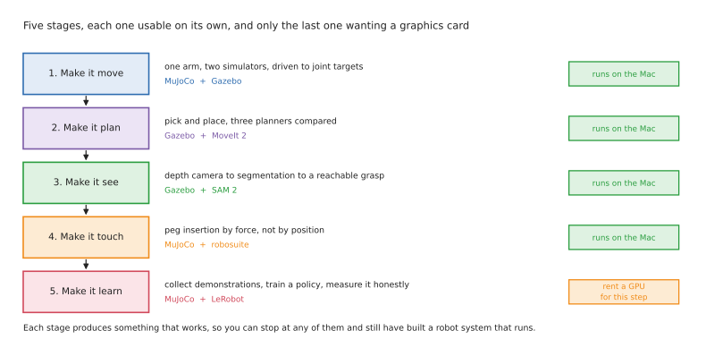

# A learning path for robot arms, in simulation

The rest of this folder explains what the methods are and why the field moves the
way it does. This document is the practical companion to all of that: a five-stage
path that takes you from an arm that does not move to a trained policy with an
honest success rate, entirely in simulation, and almost entirely on a Mac.

Working only in simulation is a deliberate choice rather than a compromise, and it
is worth saying why before you start. Every single thing that makes robot hardware
slow to learn from — the wiring, the calibration, the safety, the resetting of the
workspace between attempts, the waiting for a part to arrive — is absent in
simulation, while almost everything that makes the *software* hard is still present.
You will still have to work out why the planner cannot find a path, why the gripper
jams on the peg, and why the policy drifts away on the fourth attempt. Those are the
problems worth your time, and they are all reproducible at three in the morning with
no robot in the room.

## Contents

1. [The path at a glance](#the-path-at-a-glance)
2. [Why MuJoCo and Gazebo, and why both](#why-mujoco-and-gazebo-and-why-both)
3. [Stage 1: make it move](#stage-1-make-it-move)
4. [Stage 2: make it plan](#stage-2-make-it-plan)
5. [Stage 3: make it see](#stage-3-make-it-see)
6. [Stage 4: make it touch](#stage-4-make-it-touch)
7. [Stage 5: make it learn](#stage-5-make-it-learn)
8. [Where the cloud actually helps](#where-the-cloud-actually-helps)
9. [What this path deliberately leaves out](#what-this-path-deliberately-leaves-out)

---

## The path at a glance

Each stage produces something that works on its own, which matters more than it
sounds. You can stop after any of them and still have built a robot system that
runs, and each one is a thing you can describe to somebody else.

| Stage | What you end up with | The three projects | Core stack | Where it runs |
| --- | --- | --- | --- | --- |
| **1. Make it move** | one arm, alive in two simulators, driven to joint targets | drive joints in MuJoCo · the same arm in Gazebo under `ros2_control` · make both agree | [MuJoCo](https://github.com/google-deepmind/mujoco), [Menagerie](https://github.com/google-deepmind/mujoco_menagerie), [Gazebo](https://github.com/gazebosim/gz-sim), [ros_gz](https://github.com/gazebosim/ros_gz), [ros2_control](https://control.ros.org/jazzy/index.html) | the Mac |
| **2. Make it plan** | pick and place that responds to where things are | MoveIt pick and place · compare three planners over 20 runs · add a fallback grasp | [MoveIt 2](https://moveit.picknik.ai/main/index.html), [OMPL](https://ompl.kavrakilab.org/), Pilz, [Ruckig](https://github.com/pantor/ruckig), [Task Constructor](https://github.com/moveit/moveit_task_constructor) | the Mac |
| **3. Make it see** | picking an object the system has never been shown | depth camera to point cloud · swap colour rules for segmentation · rank grasps and hand one to the planner | [Gazebo sensors](https://gazebosim.org/docs/harmonic/ros2_integration/), `depth_image_proc`, [SAM 2](https://github.com/facebookresearch/sam2), [GraspNet](https://graspnet.net/) | the Mac |
| **4. Make it touch** | a peg that goes in because of force, not because of position | insert by position and watch it jam · add compliance and a search · sweep the stiffness | [MuJoCo](https://github.com/google-deepmind/mujoco), [robosuite](https://robosuite.ai/), [robomimic](https://github.com/ARISE-Initiative/robomimic) | the Mac |
| **5. Make it learn** | a trained policy and an honest number with a denominator | train ACT on a two-arm handover · a long task in LIBERO · fine-tune a pretrained policy | [LeRobot](https://github.com/huggingface/lerobot), [gym-aloha](https://github.com/huggingface/gym-aloha), [LIBERO](https://github.com/Lifelong-Robot-Learning/LIBERO), [SmolVLA](https://huggingface.co/blog/smolvla) | Mac, then a rented GPU |

## Why MuJoCo and Gazebo, and why both

Newcomers usually assume that picking a simulator is like picking a text editor, so
that learning two of them is wasted effort. It is not, because these two are built
for different jobs and the split between them is real.

**[Gazebo](https://github.com/gazebosim/gz-sim) is for simulating a robot
*system*.** It speaks ROS 2 natively through
[ros_gz](https://github.com/gazebosim/ros_gz), it simulates sensors properly — depth
cameras, colour cameras, lidar, with noise — and it runs the same
[`ros2_control`](https://control.ros.org/jazzy/index.html) controllers that a real
arm would run, through
[`gz_ros2_control`](https://github.com/ros-controls/gz_ros2_control). That last point
is the one that matters: the controller code you write against Gazebo is the
controller code you would ship. When the thing you are testing is the *plumbing* —
topics, frames, controllers, cameras, launch files — Gazebo is the right tool.

**[MuJoCo](https://github.com/google-deepmind/mujoco) is for simulating
*physics and policies*.** It was built for contact-rich simulation and for machine
learning, it is fast enough to run many thousands of steps a second, and it is what
essentially every imitation-learning and reinforcement-learning benchmark in this
folder is built on. When the thing you are testing is a controller's response to
contact, or a policy, MuJoCo is the right tool — and you get no real choice about it
anyway, because the benchmarks are written against it.

**The practical reason to learn both** is that they fail differently, and comparing
them teaches you something that neither teaches alone. A model that behaves in
Gazebo and misbehaves in MuJoCo is usually telling you that your contact parameters
are fiction. A controller that works in MuJoCo and falls apart in Gazebo is usually
telling you that your real problem is timing or message plumbing rather than physics.

Both run natively on an Apple Silicon Mac. MuJoCo ships an `osx-arm64` build on
conda-forge, and this repository already runs Gazebo Harmonic on this machine for
[the camera area](../camera/basics.md), so neither is a gamble.

---

## Stage 1: make it move

**Why this stage exists.** You cannot debug anything higher in the stack until you
can send a number to a joint and watch the joint go there. This stage is also where
you learn that a robot model is not one thing: Gazebo and ROS want
[URDF](../arm/overview.md), the Unified Robot Description Format, while MuJoCo wants
MJCF, its own XML format. Understanding that these describe the same arm in
different vocabularies will save you a great deal of confusion later.

### The three projects

**Project one: drive an arm in MuJoCo, in about thirty lines.** Take an existing arm
from [MuJoCo Menagerie](https://github.com/google-deepmind/mujoco_menagerie), which
is DeepMind's collection of carefully tuned models of real robots — a Franka Panda,
a UR5e, a Kinova, and others. Load it, open the viewer, and write a loop that drives
each joint to a target angle. You will immediately notice that the arm sags under
gravity unless you hold it, which is your first lesson in why control exists.

**Project two: the same arm in Gazebo, under ROS control.** Bring the arm up in
Gazebo with [`gz_ros2_control`](https://github.com/ros-controls/gz_ros2_control),
load a joint trajectory controller, and command it from a ROS 2 topic. This is much
more work than project one, and the extra work *is* the lesson: you are now running
the same controller interface that a real arm runs, with a URDF, a controller
configuration file, and a launch file, which is what a real cell looks like.

**Project three: make the two agree.** Command the same joint targets in both
simulators and compare where the gripper ends up. Getting these to match requires
you to understand the model in both formats, and finding out why they disagree is
worth more than either simulator working on its own.

### The stack, and why each piece

| Tool | What it does | Why this one |
| --- | --- | --- |
| [MuJoCo](https://github.com/google-deepmind/mujoco) | physics and a viewer | fast, accurate on contact, and the base of every learning benchmark later in this path |
| [MuJoCo Menagerie](https://github.com/google-deepmind/mujoco_menagerie) | ready models of real arms | tuned by the simulator's authors, so a bad result is your bug rather than the model's |
| [Gazebo](https://github.com/gazebosim/gz-sim) | a simulated world with sensors | the ROS-native simulator, and the one with real sensor models |
| [ros_gz](https://github.com/gazebosim/ros_gz) | bridges Gazebo and ROS 2 topics | the supported path between the two; already in this repo's `pixi.toml` |
| [ros2_control](https://control.ros.org/jazzy/index.html) | the controller framework | the same controllers run in simulation and on real hardware, which is the entire point |
| [gz_ros2_control](https://github.com/ros-controls/gz_ros2_control) | runs those controllers inside Gazebo | lets you use the real controller stack without a real arm |
| [ros2_control_demos](https://github.com/ros-controls/ros2_control_demos) | worked examples | the fastest way to see a correct controller configuration |

### What real products do this

This stage is, industrialised, exactly what offline programming software is.
[RoboDK](https://robodk.com/) and ABB's RobotStudio both model a cell, let you write
motion against the model, and download the result to the real robot — the same idea
as project two, with a commercial interface and vendor-specific output. If you want
to see where this leads commercially, those are the products to look at.

### What "done" looks like

Both simulators hold the same pose when given the same numbers, and you can explain
why the arm sags when you switch the controller off.

---

## Stage 2: make it plan

**Why this stage exists.** Stage 1 replays numbers you chose. This stage is the jump
to a system that responds to where things actually are, which is the single biggest
capability step in this whole path and the one that separates a demonstration from
something useful.

### The three projects

**Project one: a pick and place with MoveIt 2.** Use MoveIt's own maintained
[Panda resources](https://github.com/moveit/moveit_resources) and
[tutorials](https://github.com/moveit/moveit2_tutorials) to plan a motion around an
obstacle and execute it in Gazebo. The goal here is not the pick — it is getting
MoveIt configured, because that configuration is genuinely fiddly and doing it once
is worth a great deal.

**Project two: compare three planners on the same problem, twenty runs each.** Solve
the identical start and goal with a sampling planner from
[OMPL](https://ompl.kavrakilab.org/), with the **Pilz industrial motion planner**
that ships inside MoveIt, and with a straight joint-space move. Record the path
length and the time taken for every run. What you should see is that the sampling
planner gives you a different path each time, while Pilz gives you the same one
every time. That difference is the whole argument between research planning and
industrial planning, and seeing it in your own numbers is far more convincing than
reading about it.

**Project three: add a fallback.** Use
[MoveIt Task Constructor](https://github.com/moveit/moveit_task_constructor) to
build a pick that tries a top grasp first and falls back to a side grasp when the
top one cannot be reached. This teaches you that real robot behaviour is mostly
about what happens when the first choice fails.

### The stack, and why each piece

| Tool | What it does | Why this one |
| --- | --- | --- |
| [MoveIt 2](https://moveit.picknik.ai/main/index.html) | planning, collision checking, execution | the standard, and what you will meet in any ROS job; available for Apple Silicon through RoboStack |
| [OMPL](https://ompl.kavrakilab.org/) | the sampling planners underneath | where RRT and its relatives actually live |
| **Pilz industrial motion planner** | deterministic point-to-point, linear and circular motion | ships inside MoveIt, and is the closest open thing to how a factory arm really moves |
| [Ruckig](https://github.com/pantor/ruckig) | smooth, jerk-limited timing along a path | the difference between a path and a motion a real arm could survive |
| [MoveIt Task Constructor](https://github.com/moveit/moveit_task_constructor) | multi-stage tasks with alternatives | the mainstream way to express "try this, else that" |

### What real products do this

[MoveIt Pro](https://moveitpro.com/) from PickNik is MoveIt productised, with the
configuration and behaviour tooling that the open version makes you build yourself.
[Realtime Robotics](https://www.realtimerobotics.com/) sells motion planning as a
product in its own right, aimed at multi-robot cells where planning fast enough is
the whole problem. Both are useful reference points for what this stage is worth
commercially.

### What "done" looks like

You can state, for a plan that failed, whether it failed because no path exists,
because the goal was unreachable, or because the planner ran out of time.

---

## Stage 3: make it see

**Why this stage exists.** Learned perception is the one place where machine
learning is genuinely deployed on arms today, and the pattern you build here — a
conventional system with one network doing the recognising — is the shape of
essentially every commercial machine-learning robot. This stage is also, if you are
after paid work, the most directly sellable thing in this path.

### The three projects

**Project one: depth to points.** Put a depth camera in Gazebo, publish it into ROS
with [ros_gz](https://github.com/gazebosim/ros_gz), turn the depth picture into a
point cloud with `depth_image_proc`, and find an object by colour and depth. This
repository already does exactly this in
[the camera area](../camera/one-box-intro.md), so start from working code rather
than a blank file.

**Project two: replace the colour rule with a model.** Swap the hand-written colour
threshold for [SAM 2](https://github.com/facebookresearch/sam2), which segments
objects it was never trained on. The comparison is the point of the project: the
colour rule is twenty lines you fully understand and which break the moment the
lighting changes, and the model is a download that works on objects you never
described and which you cannot debug when it is wrong. That trade is the subject of
this entire folder, and here you get to feel it.

**Project three: choose a grasp and execute it.** Generate candidate grasp poses on
the segmented object, filter them for the ones MoveIt can actually reach, and pick
the best one. Most of the engineering here is ordinary code sitting between the
network and the planner, which is exactly where the engineering sits in real
systems too.

### The stack, and why each piece

| Tool | What it does | Why this one |
| --- | --- | --- |
| [Gazebo sensors](https://gazebosim.org/docs/harmonic/ros2_integration/) | simulated depth and colour cameras, with noise | the noise matters; a perfect camera teaches you nothing about a real one |
| `depth_image_proc` | depth picture to point cloud | the standard ROS way, already in this repo's dependencies |
| [SAM 2](https://github.com/facebookresearch/sam2) | segmentation without per-object training | the model that removed the need for a vision engineer per customer |
| [GraspNet-1Billion](https://graspnet.net/) | grasp dataset and benchmark | most valuable now as data to evaluate against rather than as code to run |
| [MoveIt 2](https://moveit.picknik.ai/main/index.html) | executes the chosen grasp | stage 2 pays off here |

A note on what to avoid at this stage.
[FoundationPose](https://github.com/NVlabs/FoundationPose) is the best open
six-degree-of-freedom pose estimator, and it is built around NVIDIA-specific
libraries, so it is not a Mac project — leave it for the cloud, or skip it, because
segmentation plus a point cloud is enough to get a grasp.
[AnyGrasp](https://github.com/graspnet/anygrasp_sdk) has real commercial traction
but ships as a licence-gated binary and is not open source despite appearances.

### What real products do this

This is the most commercially settled stage in the path.
[Photoneo](https://www.photoneo.com/), [Zivid](https://www.zivid.com/) and
[Keyence](https://www.keyence.com/) all sell 3D vision systems whose entire job is
what you are building here. At the far end of the scale,
[Amazon's item-stowing system](https://arxiv.org/abs/2505.04572) is this pattern at
half a million real attempts, and its paper says plainly which parts are learned and
which are conventional, which makes it the best free description of a production
system anywhere.

### What "done" looks like

The arm picks up an object you never described to it, and when it fails you can look
at the proposed grasps and say which one was wrong and why.

---

## Stage 4: make it touch

**Why this stage exists.** Force control is the column that is never empty in
[the method grid](overview.md#5-which-method-for-which-task), it is the answer to
the hardest class of industrial task, and it is the most undersupplied skill in this
whole document. It is also almost impossible to develop an intuition for by reading,
and quite easy to develop by simulating.

### The three projects

**Project one: insert a peg by position, and watch it jam.** Use
[robosuite](https://robosuite.ai/), which is a set of manipulation tasks built on
MuJoCo, and drive a peg into a hole using position control alone. It will jam, and
the contact forces will climb alarmingly. This failure is the point of the project,
because it is the same failure that breaks real parts, and it is not a bug in
anything — it is exactly what a position controller is designed to do.

**Project two: make the arm compliant, and search.** Switch to a controller that
commands *stiffness* rather than position, come in soft, and search in a small
spiral until the forces say the pin has found the hole. This is the single most
reusable idea in contact-rich robotics, and once you have felt it work, the
distinction between commanding a position and commanding a stiffness stops being
abstract.

**Project three: sweep the stiffness and plot it.** Run the insertion at a range of
stiffness values, twenty attempts each, and plot success against stiffness. You
should find a window: too soft and the arm cannot push the pin home, too stiff and
it jams exactly as in project one. Finding that window yourself is worth more than
any explanation of it.

### The stack, and why each piece

| Tool | What it does | Why this one |
| --- | --- | --- |
| [MuJoCo](https://github.com/google-deepmind/mujoco) | the contact physics underneath | Gazebo's contact model is not built for this; MuJoCo's is |
| [robosuite](https://robosuite.ai/) | ready contact tasks, including peg insertion | saves you building a task, and is the benchmark the papers use |
| [robomimic](https://github.com/ARISE-Initiative/robomimic) | careful baselines on those tasks | tells you what a good result even looks like before you chase one |
| [cartesian_controllers](https://github.com/fzi-forschungszentrum-informatik/cartesian_controllers) | Cartesian force and impedance control in ROS | read this for how the real thing is structured, even if you prototype in MuJoCo |

### What real products do this

Every major vendor sells this. FANUC ships force sensors and fitting functions, ABB
has two separate force-control options — one for machining and one that searches for
the right location during assembly — and KUKA has a force-torque package.
[Micropsi's MIRAI](https://www.micropsi-industries.com/) is the interesting learned
case, because it removes positional variance with a trained visuomotor skill while
leaving force control underneath to handle the actual contact. On the research side,
[IndustRealKit](https://github.com/NVLabs/industrealkit) is insertion trained purely
in simulation and transferred to a real arm at 83% to 99% across 600 trials, and it
is the closest thing to a worked answer for this stage.

### What "done" looks like

You can explain, to somebody who has not done it, why a position controller
escalates into a surface, and you have a plot showing the stiffness window for your
own peg.

---

## Stage 5: make it learn

**Why this stage exists.** This is the loop that the whole learned half of the field
runs on: collect data, train, evaluate, work out what failed, collect more of that.
The architectures will be different in eighteen months and the loop will not, which
is why going round it once yourself is worth more than reading about any particular
model.

### The three projects

**Project one: train a policy and measure it properly.**
[gym-aloha](https://github.com/huggingface/gym-aloha) gives you two small MuJoCo
tasks. Collect demonstrations, train an ACT policy with
[LeRobot](https://github.com/huggingface/lerobot), then evaluate it over at least
fifty trials from fixed starting states and write down the number. Reporting an
honest success rate with a denominator is a skill in itself, and most of the field
is bad at it.

**Project two: watch a long task fail.** Move to
[LIBERO](https://github.com/Lifelong-Robot-Learning/LIBERO), which has long
multi-step tasks, and train the same way. It will do noticeably worse, and the
failures will cluster near the end rather than being spread evenly. That is
compounding error, and seeing it in your own evaluation is the fastest way to
understand why
[the programmed methods have not gone anywhere](programmed-methods.md).

**Project three: fine-tune a pretrained policy.** Take
[SmolVLA](https://huggingface.co/blog/smolvla), which was built to be trained and
run on ordinary hardware, and fine-tune it on your own small dataset. Compare it
against the policy you trained from scratch in project one. This is the skill that
currently distinguishes somebody who has done this from somebody who has read about
it, and it is the one project here that genuinely benefits from a rented graphics
card.

### The stack, and why each piece

| Tool | What it does | Why this one |
| --- | --- | --- |
| [LeRobot](https://github.com/huggingface/lerobot) | policies, datasets, training, evaluation | where all of these methods now live and are maintained; there is no close second |
| [gym-aloha](https://github.com/huggingface/gym-aloha) | two small MuJoCo tasks | small enough to iterate on quickly, which is what matters when learning the loop |
| [LIBERO](https://github.com/Lifelong-Robot-Learning/LIBERO) | long multi-step tasks | where the interesting failures are |
| [robomimic](https://github.com/ARISE-Initiative/robomimic) | which implementation details matter | read before blaming your data for a hyperparameter problem |
| [SmolVLA](https://huggingface.co/blog/smolvla) | a pretrained policy sized for ordinary hardware | the only realistic entry point to the pretrained family without a large card |
| [community_dataset_v3](https://huggingface.co/datasets/lerobot/community_dataset_v3) | 791 datasets, 46 robot types, Apache-2.0 | permissively licensed and large, which is rarer than it should be |

### What real products do this

Nothing here is a product you can buy yet, which is itself worth knowing.
[Physical Intelligence](https://github.com/Physical-Intelligence/openpi) publishes
the open π models and the pipeline described in
[the learned-methods document](learned-methods.md#3-learning-from-large-scale-pretraining).
[Figure's Helix](https://www.figure.ai/news/helix) splits the problem by speed,
running a vision-language model slowly for understanding and a separate visuomotor
policy quickly for moving.
[Toyota Research Institute's Large Behavior Models](https://toyotaresearchinstitute.github.io/lbm1/)
is the most rigorous public evaluation anyone has published. Read all three as
demonstrations of where the field is, not as things you could deploy.

### What "done" looks like

You have a success rate with a trial count attached, you can say which stage of the
task the failures cluster in, and you have an opinion about whether more data or
better data would help.

---

## Where the cloud actually helps

Almost all of this path runs on the Mac, and that is worth defending, because a
local loop you can run twenty times in an evening teaches you far more than a cloud
job you run twice. Rent a machine for the specific steps that genuinely need one
rather than as a default.

**Worth renting a graphics card for.** Fine-tuning a pretrained policy in stage 5,
which is the one step where a consumer machine is genuinely the limit. Running
[FoundationPose](https://github.com/NVlabs/FoundationPose) or any other
NVIDIA-specific perception model, if you decide you want six-degree-of-freedom pose
estimation. Anything involving [Isaac Lab](https://github.com/isaac-sim/IsaacLab),
which requires CUDA and will not run on Apple Silicon at all — though note that this
path avoids Isaac entirely, because MuJoCo covers the same ground for what you are
learning.

**Not worth renting for.** Everything in stages 1 to 4. Training an ACT policy on a
small task, which is an hour of compute rather than a day. Any amount of Gazebo,
MoveIt or `ros2_control` work, none of which is compute-bound.

**The habit worth building** is to develop locally at small scale until the pipeline
is correct, and only then rent something to run it at full size. The most common way
to waste cloud credit is to debug in the cloud.

## What this path deliberately leaves out

Being explicit about the gaps matters as much as the content, because you should
know what you will *not* be able to claim at the end of it.

**Real hardware.** Everything above is simulated, which means you will not have met
calibration, and calibration is a large part of what makes real cells hard. If you
later buy a cheap arm, expect that to be the surprise.

**Two arms.** Coordination is a genuinely different problem and it has
[its own folder](../two-arm-training/overview.md). Do this path first; almost every
two-arm method is a single-arm method with a coordination problem added.

**Reinforcement learning from scratch.** It needs a simulator, a reward function and
a compute budget, and the field itself is using it less each year as a first stage.
[Learn the fine-tuning use instead](learned-methods.md#2-learning-from-trial-and-error).

**Isaac Lab and the NVIDIA stack.** Excellent, widely used, and requires hardware you
do not have. MuJoCo teaches the same lessons, and
[MuJoCo Warp](https://github.com/google-deepmind/mujoco_warp) is where the
high-throughput version of that story is going.

---

Back to [the overview](overview.md). For the methods themselves, see
[programmed methods](programmed-methods.md) and
[learned methods](learned-methods.md); for the direction the field is moving, see
[what is changing, and why](what-is-changing.md).
