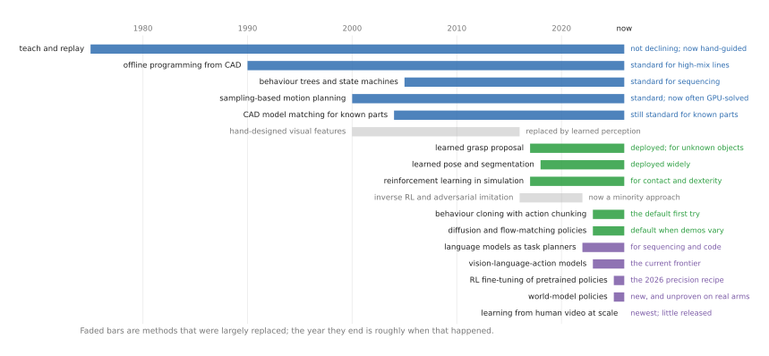

# Ways to programme or train one robot arm

There are perhaps a dozen genuinely different ways to make a robot arm do
something useful, and they are not alternatives to one another in the way that a
list suggests. Some of them decide what to do; some decide how to move; some
decide what to do in the last millimetre when the part is touching. A working
system uses several at once, and most arguments about "planning versus learning"
are really arguments between people talking about different layers.

This document is the map. It sets out the jobs arms are actually bought to do, the
layers of a system, the family tree of methods, and a grid saying which method
suits which job. The two companion documents then take the methods one at a time.

**Who this is for.** Someone who can picture an arm moving and knows roughly what
a camera and a joint angle are, but who has not yet had to choose between these
approaches. You do not need to have used any of them.

## What this is for, and what it is not for

This folder is written for a specific purpose, and saying so changes what is in
it. It is for **learning the field well enough to be useful in it within a year** —
to talk credibly about a robotics project, to scope one, to win service or
consulting work, or to start building something real as the hardware and the models
get cheaper over the next one to three years.

It is **not** a guide to building a production robot this month. That changes two
things throughout. First, every method carries a line saying **whether it is worth
your time to learn right now**, which is a different question from whether it is
good. Some excellent methods are not worth your time, because they are research
techniques that need a team; some unglamorous ones are, because they are what
people are actually paid for. Second, where something is announced but not
downloadable, or demonstrated but not deployed, this document says so plainly. The
gap between a press release and a working system is where most of the wasted
effort in this field goes.

**The short answer, before the long one.** The two families are *programming*,
where a person writes down what the arm should do, and *training*, where the
behaviour comes from examples or practice. Programming is precise, inspectable and
safe, and cannot cope with variety. Training copes with variety, needs a great deal
of data, and cannot tell you why it failed. Every serious system uses both: it
programmes the parts that are easy to say and trains the parts that are not.

## The three documents

**This document — the map.** The tasks, the layers, the family tree, the grid, and
an honest account of what is realistic in the next year. Read it first, and
possibly only.

**[Programmed methods](programmed-methods.md).** Behaviour a person writes down:
teaching, offline programming, behaviour trees, motion planning, task and motion
planning, and feedback control. This is what runs in factories today.

**[Learned methods](learned-methods.md).** Behaviour that comes from data:
imitation learning, reinforcement learning, large pretrained policies, learned
components inside a conventional system, and language models as planners. This is
where the research is.

There is also a companion folder,
**[two-arm training](../two-arm-training/overview.md)**, for what changes when a
second arm is added — which is more than you would guess, and which only makes
sense once the single-arm picture is clear. Start here.

## Contents

1. [What an arm is actually asked to do](#1-what-an-arm-is-actually-asked-to-do)
2. [The five things that make a task hard](#2-the-five-things-that-make-a-task-hard)
3. [The four layers of an arm system](#3-the-four-layers-of-an-arm-system)
4. [The family tree](#4-the-family-tree)
5. [Which method for which task](#5-which-method-for-which-task)
6. [Four worked examples](#6-four-worked-examples)
7. [What is current, and what is fading](#7-what-is-current-and-what-is-fading)
8. [What each method costs you](#8-what-each-method-costs-you)
9. [What real systems actually do](#9-what-real-systems-actually-do)
10. [What you can realistically do in the next year](#10-what-you-can-realistically-do-in-the-next-year)
11. [How to read the numbers in this field](#11-how-to-read-the-numbers-in-this-field)
12. [Where this repo fits](#12-where-this-repo-fits)

---

## 1. What an arm is actually asked to do

Methods are easier to compare once you have real jobs in mind, so here are the
jobs, in four groups ordered by how much is known in advance. That ordering is not
arbitrary — it is the single best predictor of which method you will end up using.

The picture below places them all on the two properties that do the predicting, and
it is worth spending a minute on before the tables, because the four corners want
genuinely different methods and the groups are simply regions of it.

### The solved bulk, which comes before the four groups

Spot and arc welding, machine tending, palletising, painting and dispensing,
polishing a fixtured part, moving tubes between laboratory instruments. In all of
these the work is held by a jig, the geometry comes from a drawing, and the job is
to be accurate and fast a million times over.

These tasks are the great majority of installed industrial robots, and they are
**solved**, by [the programmed methods](programmed-methods.md). Nothing in the
learned-methods document improves on them. It is worth saying this plainly at the
start, because a great deal of writing about robot learning implies that the
existing stuff is obsolete, and in the places where robots actually earn money it
is not remotely obsolete. What is true is that these tasks are a shrinking share of
what people now *want* robots to do, which is why the rest of this document exists.

### Group A: the parts are known, but the fit decides everything

You have the drawings and the parts arrive in feeders, yet the job still fails —
because success is settled in the last millimetre by contact rather than by
position. **This is where most industrial difficulty lives.**

| Task | What makes it hard |
| --- | --- |
| **Connector and harness insertion** | clearances under a millimetre, tighter than the arm's own repeatability, with the contact hidden from view |
| **Screwdriving** | engaging the thread without cross-threading, and knowing from the torque when it is properly seated |
| **Press-fits and snap-fits** | the force needed is large, the tolerance for being off-axis is small, and a failure damages the part |
| **Polishing and deburring** | holding a set contact force along a curved surface, faster than the arm can react |

### Group B: the objects are known, but their arrangement is not

The catalogue is fixed, or nearly so, but nothing is where you left it. This is the
class that learned perception unlocked, and where machine learning is genuinely in
production today.

| Task | What makes it hard |
| --- | --- |
| **Bin picking of mixed items** | clutter, occlusion, and objects whose pose has to be worked out rather than known |
| **Order picking from shelves or totes** | thousands of product types, many of them deformable or shiny, at a rate per hour that matters commercially |
| **Kitting and packing** | many small motions, items starting in different places, a long sequence where one error spoils the tray |
| **Machine tending with unfixtured parts** | the part arrives roughly positioned, and the chuck needs it exactly positioned |

### Group C: the object has no fixed shape

Cloth, cable, food, foam, bags. The object's shape is decided by where you hold it,
so there is no such thing as its pose.

| Task | What makes it hard |
| --- | --- |
| **Cable and harness routing** | the cable moves while you work, tension is invisible, and the task is long so failures compound |
| **Food handling** | every item differs, most are fragile, and hygiene rules constrain the gripper |
| **Garment and fabric handling** | effectively infinite configurations, and most of the object hidden under itself |

### Group D: the geometry is unknown and physics decides the outcome

The hardest class. There is no model of the object at all, and whether the
attempt worked is only known afterwards.

| Task | What makes it hard |
| --- | --- |
| **Harvesting fruit and vegetables** | every specimen differs, the target is occluded by leaves, and it bruises |
| **Handling rubble, scrap or natural material** | no model of any piece, and errors accumulate |
| **Assembling something whose parts do not fit as drawn** | reality and the drawing disagree, and the arm has to find out by touching |

---

## 2. The five things that make a task hard

Five properties do most of the work in those tables. Placing a new task on these
five tells you more about which method you need than any amount of reading about
methods.

**How much is known in advance.** Fixtures, drawings and a fixed catalogue of parts
at one end; a jumbled bin or a rough stone at the other. Programmed methods need
this knowledge, and are excellent when it exists.

**How much of the job is contact.** Moving through free space is well understood
and easy to plan. Deciding what to do while pressing one object against another is
neither, because the outcome depends on friction and on contacts you cannot see.
Insertion, polishing and folding are contact tasks; welding and palletising are
not.

**How many steps, and whether order matters.** Driving one screw is a single skill.
Assembling and packing a component is twenty steps, where step four quietly ruins
step nine. Long tasks need something that keeps track and can recover.

**How tight the tolerance is.** An arm that repeats to a tenth of a millimetre
still cannot reliably seat a connector with a fifty-micron clearance by position
alone. Once the tolerance is tighter than the accuracy you can achieve, the task
stops being about geometry and becomes about feedback.

**What a failure costs.** Failing to place a fruit costs a retry; scratching a car
body costs a great deal. Tasks where failure is cheap and repeatable can be learned
by practice; tasks where it is not must be verified before they run. This one
property explains most of why industry adopts methods slowly.

---

## 3. The four layers of an arm system

An arm doing a real job answers four questions over and over, and "which method"
usually has a different answer at each one. Comparing a motion planner with a
vision-language-action model is comparing a wheel with a car; they answer different
questions.

**What to do next** is the sequence: fetch the board, seat the connector, test it,
put the board in the tray.

**Which skill, and where** turns "seat the connector" into *this* one, from *that*
feeder, into *that* socket — which requires knowing where those things are.

**How to move** is the path from here to there that hits nothing on the way.

**How to touch** is the part that actually decides whether it works: pressing
without bending a pin, feeling for the hole, knowing from the force when it is
seated.

In practice the top layer is nearly always programmed, because a person can write
the sequence down in a morning, and the bottom layer is increasingly learned,
because nobody can write down what to do in the last millimetre though they can
demonstrate it. The middle two layers are contested, and that contest is most of
current robotics research.

---

## 4. The family tree

The first split is the one from the introduction: behaviour a person writes,
against behaviour that comes from data. Within the programmed family the branches
run from replaying a recorded motion, through computing motions from a model, to
planning what to do and how to move together. Within the learned family they are
divided by **where the learning signal comes from**: a person's demonstrations, the
robot's own practice, or a large pool of data gathered elsewhere.

One branch deserves attention up front because it is the quiet workhorse: *learned
pieces inside a programmed system*. Most deployed robots that use machine learning
at all use it that way — a conventional system with one network doing the
perception — rather than the end-to-end approach that gets the attention.

---

## 5. Which method for which task

The direct answer to "is this the right method for this task". Read a row to plan a
system; read a column to see where a method earns its keep.

**★** the usual choice today · **✓** used, and works · **~** emerging, or used in
part · **–** not used

| Task | Teach / offline | Motion planning | Force control | Learned perception | Imitation | RL in sim | Real-robot RL | VLA | Language planner |
| --- | --- | --- | --- | --- | --- | --- | --- | --- | --- |
| **Welding, painting, palletising** | ★ | ✓ | – | – | – | – | – | – | – |
| **A. Connector / harness insertion** | ✓ | ✓ | ★ | ✓ | ✓ | ★ | ★ | ~ | – |
| **A. Screwdriving** | ★ | ✓ | ★ | ✓ | ~ | ~ | ✓ | – | – |
| **A. Polishing and deburring** | ★ | ✓ | ★ | – | – | ~ | ~ | – | – |
| **B. Bin picking of mixed items** | – | ★ | ✓ | ★ | ~ | ~ | – | ~ | – |
| **B. Order picking from shelves** | – | ★ | ✓ | ★ | ~ | – | – | ~ | ~ |
| **B. Kitting and packing** | ✓ | ★ | ~ | ★ | ~ | – | – | ~ | ~ |
| **C. Cable routing** | ~ | ✓ | ★ | ✓ | ★ | ~ | ~ | ~ | – |
| **C. Food handling** | ✓ | ✓ | ✓ | ★ | ✓ | – | – | ~ | – |
| **D. Fruit harvesting** | – | ★ | ✓ | ★ | ~ | ~ | – | ~ | – |
| **D. Unknown-geometry assembly** | – | ★ | ★ | ✓ | ~ | ~ | ~ | – | ~ |

Four things fall out of the grid.

**The first row is the one to keep in mind.** The tasks that pay for most of the
world's robots use two columns and ignore the rest. Any claim that the field has
moved on has to explain that row.

**Learned perception is the column that changed everything.** It is the only
learned column with a ★ anywhere, and it has three. Turning "where is the object"
from an unsolved problem into a solved one is what made Group B commercially real,
and it did so without disturbing anything else in the stack.

**Force control is the answer to Group A.** Whatever else you use, the moment the
job is decided by contact rather than position, something has to manage that
contact. This is also the column where learned methods are now arriving most
credibly.

**Groups C and D are where the learned methods are not optional.** There is no CAD
model of a shirt or a strawberry. Where the object's shape is not knowable in
advance, learning is not an improvement on the alternative, it is the only option.

---

## 6. Four worked examples

**Inserting a connector into a board.** The canonical Group A problem, and the
clearest case where position is not enough: the clearance is tighter than the arm's
repeatability, so a plan that is geometrically perfect still jams. Programme the
approach — teach it or generate it offline — and make the last centimetre a force
problem: come in compliant, search in a small spiral or Lissajous pattern until the
force signature says the pin has found the hole, then push. This is a solved
problem that vendors sell as a product, and it is also the task where learned
methods have their strongest published numbers, so it is the best place to compare
the two families honestly. If you want a project that teaches you the most per hour
spent, this is it.

**Bin picking of mixed items.** The Group B problem, and the template for every
deployed system that uses machine learning. A depth camera sees the bin, a network
proposes grasps, ordinary code chooses the best reachable one, a planner moves
there, and force control handles the extraction. Nothing is end-to-end and nothing
needs to be. The learning is confined to the one part that needed recognising, the
rest stays inspectable, and when it fails you can look at the proposed grasps and
see which was wrong.

**Polishing a curved part.** The example where the interesting engineering is not
in the arm at all. The path comes from CAD or from a scan; the contact force has to
be held constant along a surface that is never quite where the model says. In
practice the force loop usually lives in a compliant flange bolted between the arm
and the tool, because it can react far faster than the arm can. Worth knowing
because it is a case where the right answer is mechanical, and no amount of
learning changes that.

**Picking a strawberry.** The Group D problem, and the one that shows where the
field genuinely is. Every fruit is a different shape, half of them are behind
leaves, the ripeness has to be judged, and squeezing too hard destroys the product
you are trying to sell. Perception is learned, because nothing else works on a
natural object. The approach is planned. The grasp and the cut want force control,
and a learned policy is a reasonable option for the final approach. This is also a
useful sanity check on hype: fruit harvesting has had serious money and serious
research for over a decade, and it is still hard, for reasons that are physical
rather than algorithmic.

---

## 7. What is current, and what is fading

Methods rarely die of old age; they are displaced by something that needs less of
what is expensive. This chart is a rough guide to when each became common and which
are now on the way out.

**Clearly superseded, with the evidence.** Isaac Gym, the GPU simulator behind many
reinforcement-learning papers, is marked legacy by NVIDIA and its example
repository is archived; Isaac Lab replaced it. The D4RL benchmark suite that
offline reinforcement learning was measured on was formally deprecated in favour of
Minari. SERL was deprecated by its own authors in favour of HIL-SERL. RT-1 is
archived and RT-2 never released code. OpenAI Gym was archived in favour of
Gymnasium, and ROS 1 reached end of life in May 2025. Hand-designed visual features
were displaced by learned perception a decade ago.

**Quietly fading rather than deprecated.** Several important repositories have
simply stopped: the original ACT implementation has had no commits since 2024,
diffusion_policy since late 2024, Octo since mid-2024, and OpenVLA since March
2025. None carries a deprecation notice. The work moved into LeRobot, which is
where those methods now live and are maintained. The same has happened to the
classical grasping repositories — Contact-GraspNet, the GraspNet baseline, Dex-Net
and `gqcnn` are all quiet or dead — and to PyBullet, which has an enormous tutorial
legacy and about one commit a year.

On the industrial side, the ROS-Industrial vendor drivers for FANUC, Motoman, ABB
and KUKA are all dormant ROS 1 code, and there is **no maintained open-source ROS 2
driver for FANUC or Motoman at all**, which is a genuine gap rather than an
oversight. The calibration tool most tutorials still recommend,
`moveit_calibration`, has had no commits in a year; use `industrial_calibration` or
OpenCV's hand-eye function directly.

**Displaced only in part, and this one is widely got wrong.** Computing grasps from
CAD models has been displaced **for mixed-item picking** by learned grasp proposal
— but not for known parts, where model matching is still the standard product and
the right engineering choice, because it gives a full pose with a residual you can
check.

**Used less than its reputation suggests.** Task and motion planning remains
largely a research technique. Inverse reinforcement learning and adversarial
imitation are a minority approach for arms, and their main open library has been
untouched since early 2025 — though surveys still treat the family as live, so
"declining" is fairer than "dead".

**The newest things, which a doc written in 2024 would miss entirely.**
Reinforcement learning used to sharpen an already-trained policy rather than to
train one from scratch. World-model policies, which learn to predict what will
happen and act through that prediction, now a first-class category in LeRobot but
not yet proven on production arms. Training on large amounts of ordinary human
video rather than robot demonstrations, where the scaling behaviour looks promising
and almost nothing has been released. Verification at run time — trying several
candidate actions and checking them — where at least one 2026 result claims that
scaling the checking beats scaling the policy. And tactile foundation models,
trained across many different touch sensors at once.

Treat that last paragraph as a weather report rather than a forecast: these are
months old, mostly unreleased, and several will not survive contact with real
deployments.

---

## 8. What each method costs you

Eight families on seventeen points. Rows 1 to 7 are what a method demands before it
will work at all. Rows 8 to 17 are what you get back. "Somewhat" means it copes
with variation of a kind it has seen but not with a new kind; "deployed widely"
means you can buy it, "research" means you would build it from papers.

**What the method asks of you**

| | Teach & replay | Offline prog. + planner | TAMP | Classical control | Imitation | RL (sim → real) | VLA fine-tune | Learned pieces in a classical stack |
| --- | --- | --- | --- | --- | --- | --- | --- | --- |
| **1. What you must supply** | the motion | a CAD model | symbolic rules + geometry | a model of the robot | demonstrations | a reward | demonstrations | labelled data, or a ready model |
| **2. Robot model needed** | no | yes | yes | yes | no | yes, for the simulator | no | no |
| **3. Simulator needed** | no | helpful | helpful | helpful | no | yes, in practice | no | no |
| **4. Training compute** | none | none | none | none | hours on one GPU | days, many GPUs | hours to days | hours |
| **5. Compute when running** | trivial | milliseconds to seconds | seconds or more | trivial | one network pass | one network pass | a large network pass | one network pass |
| **6. Time to something working** | hours | days | weeks | days | weeks | weeks to months | days, if a checkpoint fits | days |
| **7. Who has to be skilled** | an operator | a robot programmer | a researcher | a control engineer | anyone who can do the task | an RL practitioner | an ML engineer | an ML engineer |

**What you get back**

| | Teach & replay | Offline prog. + planner | TAMP | Classical control | Imitation | RL (sim → real) | VLA fine-tune | Learned pieces in a classical stack |
| --- | --- | --- | --- | --- | --- | --- | --- | --- |
| **8. Objects it has never seen** | no | no | limited | no | somewhat | somewhat | best of these | yes, that is the point |
| **9. Positions it has never seen** | no | yes, with sensing | yes | yes, with sensing | somewhat | somewhat | yes | yes |
| **10. Contact-rich work** | poor | poor | poor | good | good | good | good | not applicable |
| **11. Long multi-step tasks** | yes, if nothing varies | yes | yes, by design | no | poor | poor | improving | not applicable |
| **12. Can you see why it failed** | yes | yes | yes | yes | no | no | no | partly |
| **13. Can it be verified for safety** | yes | yes | mostly | yes | weak | weak | weak | inherits the stack's |
| **14. Cost to change the task** | re-teach it | edit and re-simulate | edit the domain model | re-tune | collect new demos | new reward, retrain | fine-tune again | often nothing |
| **15. Industrial maturity in 2026** | decades | decades | research | decades | early deployment | niche | early | deployed widely |
| **16. Typical failure** | the world moved and it did not notice | the model differed from reality | no plan found, or too slow | oscillation, or the wrong stiffness | drifts into a state no demo covered | learned to exploit the reward | confidently wrong | the perception was right and the choice was not |
| **17. Worth learning now** | understand it | **yes** | read about it | **yes** | **yes** | the fine-tuning use | **yes** | **yes** |

Read rows 12 and 15 together and the familiar trade appears: the methods you can
debug are the ones industry adopted, because a factory must be able to say why a
machine stopped, and the methods that cope with novelty and contact are the learned
ones, which is where the unsolved tasks are. Read row 17 on its own if you are
deciding where to spend the next six months.

---

## 9. What real systems actually do

Almost nothing real uses one method. A few worth understanding properly, because
the pattern across them is more informative than any individual system.

**A modern bin-picking cell** is a classical system with one learned component.
Planning, collision checking and gripper logic are conventional code; a network
proposes grasps. The objects vary so perception must generalise; the motion does
not, so it stays verifiable.

**MIT's Jenga robot** inverts the usual assumption about what to learn. The
strategy and the controller are conventional; what is learned is a model of how the
block responds to being pushed, from vision and force together — the part nobody
can write down.

**MimicGen** uses programming to *manufacture the data that training needs*: a
classical routine turns a handful of demonstrations into thousands by re-composing
them around the objects' positions, and a policy is then trained on that.

**SayCan** pairs a language model with learned skills, and the contribution is the
pairing rather than either half. The model knows a spill needs a sponge; it has no
idea whether the robot can reach the sponge. Each skill carries a learned estimate
of its own chance of success, and the step chosen must be both sensible and
feasible.

| System | Programmed part | Learned part | Why the split falls there |
| --- | --- | --- | --- |
| Typical industrial cell | taught or offline path, force control on insertion | often nothing | nothing varies, so learning buys little and costs verification |
| Bin picking, modern | planning, collision checking, gripper logic | grasp proposals, segmentation | objects vary, motions do not |
| [Amazon item stowing](https://arxiv.org/abs/2505.04572) | motion planning, grasp planning, force control, a library of named primitives | depth, segmentation, product identity, risk and free-space scoring | 500,000 real stows; 85.86% success; the split is stated by the authors |
| [Micropsi MIRAI](https://www.micropsi-industries.com/) | the force control underneath | a visuomotor skill trained by demonstration in days | learning removes positional variance; force control still handles contact |
| [ETH HEAP dry-stone wall](https://ethz.ch/en/news-and-events/eth-news/news/2023/11/autonomous-excavator-constructs-a-six-metre-high-dry-stone-wall.html) | all of it: scan, estimate mass, search poses, plan, place | nothing | a 6 m × 65 m wall from found boulders, with no learned policy anywhere |
| [MIT Jenga](https://news.mit.edu/2019/robot-jenga-0130) | strategy and control | a model of contact, from vision and force | contact is what cannot be written down |
| [MimicGen](https://mimicgen.github.io/) | the routine that multiplies demonstrations | the final policy, by imitation | programming manufactures the data training needs |
| [SayCan](https://say-can.github.io/) | the skill interfaces | the planner, the skills, and the feasibility estimates | the planner must know what is possible |
| [Code as Policies](https://code-as-policies.github.io/) | perception and control functions | a language model writes the glue | composition is language-shaped, primitives are not |
| [OpenAI's cube-solving hand](https://arxiv.org/abs/1910.07113) | the cube solver, a classical algorithm | in-hand finger motion, RL in simulation with heavy randomisation | solving the cube was solved; moving fingers was not |
| [HIL-SERL](https://hil-serl.github.io/) | safety limits, resets, the controller underneath | RL on the real robot, with human take-overs | real contact cannot be simulated well enough |

The pattern is consistent enough to state as a rule: **learning is applied to the
part that requires recognising or reacting to something, and everything else stays
classical, because everything else can be checked.**

### One sector, as a lesson in reading the industry

Truck unloading and depalletising is worth a paragraph, because it is the sector
with the most published numbers and the pattern in them is more instructive than
any of the numbers themselves.

Boston Dynamics' Stretch is the only product in the category that ever published
cumulative counts: **one million customer boxes** by September 2023, **two million**
by the end of that year, and a **700 cases per hour** figure co-signed by a
logistics customer in May 2025 — co-signing being what makes it the best-evidenced
throughput claim in the sector. One retail customer reported that **one or two
people now process 10,000 cases a day where twelve to fifteen were needed before**,
which is the most concrete productivity claim anywhere in this document.

And then it stopped. No cumulative count has been published since the end of 2023,
no fleet size has ever been published, and the throughput figures that circulate —
700, 800 and 1,200 cases per hour — contradict each other, as do two different
battery-life figures from the vendor's own materials and the trade press. Of the
competitors, one publishes a genuinely well-formed number (**400–1,500 picks per
hour, explicitly labelled as production deployments rather than demonstrations,
with the dependency on freight type named**), one publishes capability ratings with
no site or averaging window, one published nothing operational at all, and one has
a parked domain.

**Across every vendor in the category, not one publishes an error rate per N cases,
a damage rate, or cumulative uptime hours.** The lesson is not that these products
do not work — they clearly do. It is that the one company being transparent quietly
stopped being transparent, nobody replaced it, and this is the normal state of
evidence in commercial robotics. Calibrate your expectations accordingly when a
supplier shows you a number.

---

## 10. What you can realistically do in the next year

Everything above is about methods. This section is about what you can actually get
your hands on, because the gap between reading about this field and having done any
of it is the gap that matters, and in 2026 it is unusually cheap to cross.

**The hardware barrier has fallen by about two orders of magnitude in three years.**
The open low-cost arm designs — the SO-100 and SO-101 family and their relatives —
put a working 6-joint arm with a gripper in the low hundreds of dollars, and
[LeRobot](https://github.com/huggingface/lerobot) supports them directly. A leader
arm and a follower arm together is a teleoperation rig you can collect real
demonstrations on. These are not toys in the sense that matters: they are the
hardware a large fraction of 2026's published low-cost-manipulation work runs on.

They *are* toys in the sense that they carry a few hundred grams and repeat to
about a millimetre. You will not do connector insertion on one. What you will do is
the whole loop — build, calibrate, teleoperate, record, train, evaluate, fail,
collect more data — and that loop is the thing worth learning, because it is
identical on a thirty-thousand-dollar arm.

**Sourcing note for India, since prices there are usually the blocker.** A
community guide,
[so101-india-guide](https://github.com/prathamv0811/so101-india-guide), documents
building the SO-101 leader-and-follower pair entirely from Indian suppliers —
Feetech STS3215 servos from Evelta, driver boards and power supplies from Robu.in,
local 3D printing — for roughly **₹25,000–27,000 excluding tax**, with no customs
and no import risk. That is about 1.3× the US parts cost rather than the 2× an
import would carry. The prices there were last verified in April 2026, so check
them; the point is that the channel exists.

**Compute: rent, do not buy.** This is the clearest financial advice in these
documents. An ACT policy trains in well under an hour on a single consumer GPU,
which a rented cloud instance gives you for the price of a coffee. A large
pretrained policy needs considerably more memory than any consumer card has. And
buying edge hardware got materially worse in 2026: NVIDIA raised Jetson prices by
up to 101% in July, unannounced — the Orin Nano Super developer kit went from $249
to $399 and the AGX Thor kit from $3,499 to $5,499. Any tutorial quoting the old
numbers is stale. Plan a laptop plus a rented GPU, and revisit in a year.

**A genuinely new option worth knowing: you can collect data without owning a
robot.** [Grabette](https://huggingface.co/blog/grabette) (Apache-2.0, July 2026) is
a **€490** handheld recorder — cameras, an inertial sensor and a gripper encoder —
that you hold in your hand and use to do the task yourself. Browser-based
reconstruction turns the recording into 6-degree-of-freedom trajectories in LeRobot
format. A matching **€120** gripper puts the same jaws on a robot later. If your
constraint is that you have no arm yet, this removes it.

**Data is no longer scarce, which is new.** There are now over seventy-seven
thousand datasets on the Hugging Face Hub carrying the LeRobot tag. The one to
start from is
[`lerobot/community_dataset_v3`](https://huggingface.co/datasets/lerobot/community_dataset_v3)
— 791 datasets, 46 robot types, 235 contributors, Apache-2.0. Check licences before
you build anything commercial on a dataset: several of the large and attractive
ones are non-commercial.

**A caution about following tutorials.** The ALOHA-era Trossen hardware that most
2023–2025 tutorials target is discontinued, and the ROS packages underneath it have
not had a meaningful commit in over a year — with no deprecation notice anywhere
saying so. This is the general shape of the problem in this field: things go stale
quietly. Check the last commit date before you invest a weekend.

**So, concretely, a realistic year.** Learn the programmed stack first, because it
is what people are paid for and it is what the learned methods replace. Build or
buy a cheap arm and go round the imitation-learning loop once, end to end, on a
task you choose — that single experience is worth more in a conversation with a
client than any amount of reading. Then fine-tune an open pretrained checkpoint on
your own small dataset, because that is the skill that currently separates people
who have done this from people who have read about it. Do not attempt to pretrain a
model, build a simulator, or buy edge hardware.

### And be honest about where the paid work is

This deserves evidence rather than opinion, because it is the question that decides
how you spend a year. The evidence is unambiguous and slightly uncomfortable:
**the paid work is still classical automation.**

**First, a warning about the numbers people quote.** LinkedIn's public job-search
endpoint does not honour quoted phrases, so searching `"imitation learning"` in the
United States returns the same 11,000+ result count as searching `"PLC"`. Any
analysis built on those headline counts is meaningless, and several circulating
ones are.

**Counted properly, the learned methods barely appear in hiring at all.** Across
**6,766 job posts** in Hacker News "Who is hiring?" threads from January 2025 to
September 2026 — about the most artificial-intelligence-forward hiring corpus that
exists — the counts are: "robot" 224 posts (3.3%), computer vision 132, ROS 21,
**imitation learning 4**, and **vision-language-action, diffusion policy and
behaviour cloning zero each**. Within the 224 robotics posts specifically, the stack
actually asked for is ROS, C++ and Python, motion planning and sensors. A separate
count of 1,900 live German-market postings found the same shape, with one striking
addition: **CE marking appears in 4.0% of all postings, more often than the word
"robot" does.**

Read those zeros carefully, because they are the useful part. Both corpora
*under-sample* traditional integrators, so the low counts for FANUC, KUKA and the
machine-vision vendors are a sampling artefact rather than evidence of no demand.
But both corpora are *biased towards* AI-forward employers, and the
vision-language-action count is still zero. That is a real negative result, not an
absence of data.

**There is also no services market for this yet.** No company could be found selling
vision-language-action or imitation-learning deployment as a paid engagement. The
firms doing this work build and sell robots, or sell robots as a service; they do
not bill days. The one documented on-site pilot — a large manufacturer fine-tuning
an open policy in its own plant — consumed ten hours and 2,535 episodes of data
collection across iterative rounds and ended without a publishable success rate. If
there is an adjacent niche today it is **data collection, teleoperation
infrastructure and evaluation**, not policy training.

**Meanwhile the classical market is growing and changing shape.** North American
robot orders in the first half of 2026 were 17,995 units and $1.166 billion, up 2.0%
in units and 6.6% in value — but the composition moved sharply: automotive
manufacturer orders **fell 25%**, while semiconductors and electronics rose 35% and
life sciences and pharmaceuticals rose 32%. Non-automotive is now 56% of units.
Collaborative robots were 15.4% of units but only 9.8% of revenue, and they are
concentrated exactly in those growing sectors. (That data is a voluntary survey of
member suppliers run by a trade body that advocates for automation — directionally
useful, not audited. Treat it accordingly.)

**And there is a specific, dated, compelled opportunity.** The robot safety
standards ISO 10218-1 and ISO 10218-2 were republished in February 2025, with
European and British adoptions the following month, displacing editions that had
stood since 2011. Separately, the European Union's Machinery Regulation
[(EU) 2023/1230](https://eur-lex.europa.eu/legal-content/EN/TXT/?uri=CELEX%3A32023R1230)
becomes mandatory on **20 January 2027**, replacing the 2006 Machinery Directive —
and its recitals name artificial intelligence and robotics as the reason the old
directive needed replacing. A new standard edition plus a hard regulatory deadline
is a two-year window of billable compliance work on every robot cell placed on the
European market. Set against CE marking appearing in 4% of German postings, that is
the best-evidenced services opportunity in this whole document, and it has nothing
to do with machine learning.

**What to do with that.** The classical skills are what you can sell now; the
learned ones are what make you useful as they arrive. Those are not in tension, and
the ordering is the point: build the first, keep current with the second. What you
should not do is bet a year on a services market that the hiring data says does not
exist yet.

One thing this document will not give you is a billing rate. No credible public
benchmark for integrator or consultant rates exists — the trade bodies' salary and
utilisation surveys are all member-gated, and every public figure traces to a vendor
blog with no methodology. Anyone quoting you one is guessing.

---

## 11. How to read the numbers in this field

Robotics reporting is unusually unreliable, and developing an eye for it is worth
as much as learning any single method. Four habits.

**Look for the denominator.** A 90% success rate over ten trials and over a
thousand trials are different claims, and only one of them means anything. The
strongest results cited in these documents publish their trial counts: 100,000 real
stows, 600 insertion trials, 1,800 real rollouts with confidence intervals. Where a
number appears with no denominator anywhere in the source, treat it as marketing.

**Read the table, not the abstract.** Averages hide the task that failed. It is
routine for a paper's headline figure to cover the four tasks that worked and omit
the two that did not, and the omitted ones are usually the interesting ones.

**Separate a demonstration from a deployment.** "We showed this working" and "this
runs every day in a customer's building" are separated by about two orders of
magnitude of reliability. The gap between 90% and the 99.9% a commercial process
needs is most of the remaining work in this field.

**Separate announced from downloadable.** Several of the most impressive 2026
models have no released code or weights. Read about them; do not plan on using
them. Check the repository's last commit date and its licence before you build
anything on it — research licences that forbid commercial use are common and easy
to miss.

One widely repeated statistic is worth naming as a warning: the claim that over 90%
of industrial robots are teach-pendant programmed traces to a single undated page
that no longer exists. It is not used in these documents, and when you meet a
statistic with no denominator and no date, this is what is usually behind it.

---

## 12. Where this repo fits

Nearly everything in this repository sits in the programmed family, deliberately:
the learned methods are easier to understand once you know what they replace, and
the pieces they assume — frames, transforms, depth pictures, message passing — are
the same either way.

- [ROS basics](../ros/ros-basics.md) is the plumbing every method above runs on.
- [The arm area](../arm/overview.md) covers frames, transforms and kinematics: the
  model classical methods need explicitly and learned ones absorb implicitly.
- [The camera area](../camera/basics.md) and
  [finding objects](../camera/finding-objects.md) show a classical perception
  pipeline and a trained model doing the same job, which is the smallest clear
  illustration of the trade this whole document is about.
- [Stone stacking](../stone-stacking.md) and
  [full training](../full-training/overview.md) take one task and work it through
  the programmed way and then the trained way.
- [Two-arm training](../two-arm-training/overview.md) is the companion folder for
  what a second arm changes.

**What was checked, and when.** The repository statistics, licences and activity
dates in this document were read from the GitHub API in September 2026, and the
deprecation claims come from the projects' own notices rather than from summaries.
None of the external systems described here were run in this repo; the links go to
the people who built them. Project lists go stale quickly — before relying on
anything here, check the licence and the last commit date yourself.
