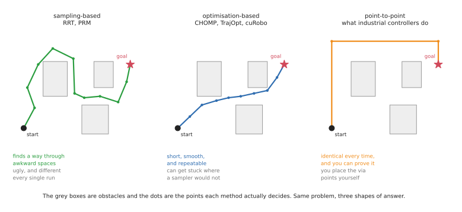
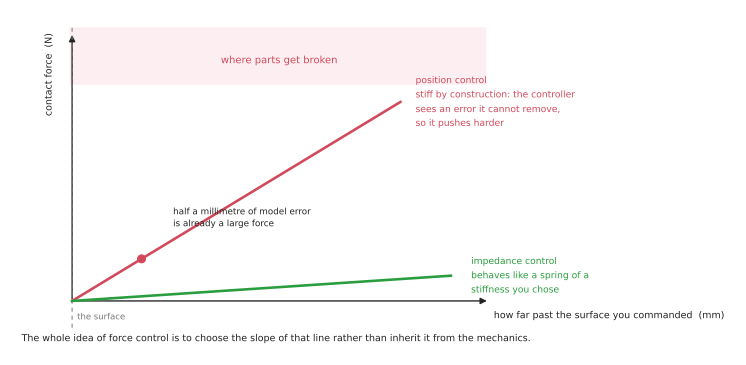

# Programmed methods for one arm

These are the methods in which a person writes down what the arm should do. They
give you precision, they give you a system you can inspect and check, and they are
what runs in essentially every factory in the world today. What they cannot give
you is any ability to cope with variety, because everything they know had to be
written down in advance by somebody.

That last point about factories is the reason this document comes before the one on
learned methods. It is tempting, in 2026, to skip straight past all of this, because
the learned methods are where the exciting results are. But almost all of the arms
that are actually working for a living are programmed ones, almost all of the paid
work involves them, and — this is the part that people tend to miss — the learned
methods become far easier to understand once you know exactly what it is they are
replacing. When you read that a policy outputs joint commands, what that means is
that it is standing in for a trajectory controller. When you read that a
vision-language-action model does the whole task, what it is standing in for is a
behaviour tree plus a planner. If you do not know what a trajectory controller or a
behaviour tree is, neither of those sentences tells you anything.

Read [the overview](overview.md) first if you have not already, because it sets out
the tasks these methods are for, the layers of a system that they fill, and a grid
showing which method suits which task.

## Contents

1. [Teach and replay](#1-teach-and-replay)
2. [Offline programming](#2-offline-programming)
3. [Scripted logic: state machines and behaviour trees](#3-scripted-logic-state-machines-and-behaviour-trees)
4. [Motion planning](#4-motion-planning)
5. [Task and motion planning](#5-task-and-motion-planning)
6. [Feedback control](#6-feedback-control)
7. [What to take from all six](#7-what-to-take-from-all-six)

The order runs roughly from the method that needs the least machinery to the one
that needs the most. Each section says which tasks the method suits, what its status
is in 2026, whether it is worth your time to learn right now, and which open code to
look at. The task group letters, A to D, are the ones from
[the overview's task catalogue](overview.md#1-what-an-arm-is-actually-asked-to-do).

---

## 1. Teach and replay

An operator drives the arm to a position using a handheld control box called a
**teach pendant**, presses a button to record where the arm is, and then repeats
that until the whole motion has been stored. The recorded positions are called
**waypoints**, and playing them back in order is the programme. On newer arms you
can simply push the arm around with your hands instead of driving it with buttons,
which is a good deal quicker, and that variant is called **lead-through** or
**kinesthetic teaching**.

It is worth being clear about how little this method assumes, because the list is
remarkably short. There is no model of the robot, no camera, no simulation, no
programmer and no mathematics anywhere in it. An operator who already understands
the job can teach a new motion in an afternoon, and if part of the motion turns out
to be wrong, they simply re-teach the waypoint that was wrong and carry on. That is
a genuinely good property, and it is the reason the method has survived for fifty
years without anyone managing to replace it.

What it assumes instead is that the world never changes. Every waypoint is just a
set of joint angles, recorded once, and it means nothing beyond "put the joints
here". Move the fixture two centimetres to the left and every waypoint in the
programme is now wrong, and — this is the important part — nothing in the system
knows that. The arm will drive confidently into where the part used to be.

**Good for:** Group A tasks where the part is held in a jig and the motion is the
same every time, which in a factory describes most of them.

**Useless for:** anything in Groups B, C or D, because there is nothing stable to
record against. If the object moves, a recording of where it used to be is no help
at all.

**Status in 2026.** Not declining, and being made easier rather than being replaced.
You will meet the claim that "over 90% of industrial robots are programmed by teach
pendant" in a dozen places, but every one of those traces back to the same undated
trade-association page, which now returns a 403 error, and the academic version of
the claim dates from 2012. There is no trustworthy current public figure, and this
document is not going to invent one.

What can be said from vendor material is more interesting anyway. Collaborative-robot
welding is growing quickly, and its entire selling point is that you hand-guide the
torch along the seam and press start — which amounts to more teaching being done by
less specialised people, not less teaching. The one genuine case where teaching was
replaced is palletising, and even there it was replaced by a wizard that computes
the stacking pattern from the dimensions of the box, rather than by anything learned.

**Worth learning now?** Not as a technique, because there is nothing much to learn,
which is rather the point of it. But it is very much worth understanding, because it
is the baseline that every other method in these documents is implicitly competing
against. When somebody proposes a learned policy for a task, the first honest
question to ask is whether simply teaching it would have worked, and the answer is
more often yes than the proposal tends to suggest.

**Code to look at:** none worth naming. This lives entirely inside vendor software,
and every vendor's is different from every other's.

## 2. Offline programming

This is the same idea as teaching, but done in software rather than on the factory
floor. You build a model of the workcell as CAD geometry — the robot, the fixture,
the part and the tooling — then write the motion against that model, simulate it to
check that nothing collides with anything, and finally download the finished
programme to the real robot.

The reason this exists is economic rather than technical. Teaching by hand requires
the production line to stop while you do it, and a line that has stopped is not
making anything. Offline programming lets the programme for the next product be
written while the current product is still being built.

This is how car bodies get welded, and the pipeline is worth knowing because it is
the single largest use of robot arms anywhere on earth. The spot-welding programmes
in a body shop are generated from CAD in tools such as DELMIA, Process Simulate or
ABB RobotStudio, downloaded to the line, and then touched up by hand once on the
real cell. There is no sensing and no learning anywhere in that chain, and there
does not need to be, because the part is held in a jig and the jig is what makes the
geometry true.

The weakness of this approach is inherited directly from its strength. The programme
is correct with respect to the model, which is not quite the same as being correct.
A fixture sitting three millimetres from where the drawing says it should be becomes
an error at run time, and the arm has no way of noticing. Closing that gap between
the model and reality is what calibration is for, and calibration turns out to be a
surprisingly large part of what commissioning a real cell actually involves.

Where the part itself varies rather than the fixture, the fix is still classical
sensing rather than learning. Arc welding handles variation with through-arc seam
tracking, with touch sensing and with laser seam trackers, and the major vendors'
arc-welding product pages describe no machine learning at all.

The axis that is genuinely moving here is the shift from CAD-based to scan-based
programming. Instead of working from a drawing, you scan the actual part, generate
the toolpath from that scan, and skip both the drawing and the teaching. Path
Robotics does this for welding with no CAD model at all, and ROS-Industrial's
Scan-N-Plan is the open demonstration of the same idea. It is worth being clear
about what this is and is not: it removes the requirement for a CAD model, and it is
still programming. Nothing anywhere in it is a learned policy.

**Good for:** the planned motions of Group A, and any cell where the layout is fixed
and the sequence is known in advance.

**Status in 2026:** standard, and the backbone of high-mix production.

**Worth learning now?** Yes, and this is probably the least fashionable advice in
this document. Offline programming, and the calibration that makes it work, are a
large fraction of what robot integrators are actually paid to do, and the skill
transfers directly to any arm from any vendor. It is also the fastest way to develop
an intuition for why geometry is hard, which is worth having before you meet the
methods that try to avoid geometry altogether.

**Code to look at:** the mainstream tools here are commercial, and
[RoboDK](https://robodk.com/) is the accessible one to try. The industrial
process-path stack does have a serious open counterpart that is worth knowing about:
[Tesseract](https://github.com/tesseract-robotics/tesseract) provides the planning
environment and the solvers, and has been used on real sanding and painting
programmes; [Noether](https://github.com/ros-industrial/noether) generates toolpaths
from the surface mesh of a part; and
[scan_n_plan_workshop](https://github.com/ros-industrial-consortium/scan_n_plan_workshop)
wires the whole chain — scan, reconstruct, generate the toolpath, plan the motion,
execute it — into a single working example. Be warned that Tesseract ships no
packaged binaries, so you will be building it from source.

## 3. Scripted logic: state machines and behaviour trees

Real tasks are not single motions. They are sequences with conditions attached to
them: if the gripper is empty, pick something up; if the pick failed, retry it; if
it has failed three times, stop and call somebody. Something in the system has to
hold that structure, and there are two standard answers to the question of what.

A **state machine** is a set of named states — "approaching", "gripping",
"retreating" — together with rules for moving between them. It is easy to understand
when you have five states, and it becomes unreadable at fifty, because the number of
possible transitions grows with the square of the number of states.

A **behaviour tree** arranges the same task as a tree of nodes which is "ticked"
repeatedly, perhaps fifty times a second. Each node reports one of exactly three
things back to its parent: success, failure, or "still running". Composite nodes
then combine their children in useful ways. A **sequence** node runs its children in
order until one of them fails. A **fallback** node tries each child in turn until
one of them succeeds, which is precisely the shape of "try the normal thing, and if
that fails, try the recovery". Behaviour trees came originally from video games, and
they were adopted in robotics for one specific property: they stay readable at fifty
branches, and you can add a new recovery behaviour without having to rewrite
anything around it.

That property matters considerably more than it sounds like it should. Most of the
code in a working robot system is not the happy path at all — it is what happens
when the happy path fails — and a structure that lets you keep adding failure
handling without the whole thing collapsing under its own weight is worth a great
deal.

**Good for:** the sequencing layer of every task in every group, and especially the
twenty-step jobs in Group A where a small mistake at step four quietly ruins step
nine.

**Status in 2026:** standard, and the default answer for the top layer of a system.
The only thing now competing for this job is a language model, covered in
[directed by language](learned-methods.md#5-directed-by-language) — and even where a
language model is used, the tree usually remains underneath as the thing that
actually runs, with the model choosing which subtree to invoke.

**Worth learning now?** Yes, and it is cheap to learn. An afternoon with
BehaviorTree.CPP's examples will teach you more about how robot software is really
organised than a month of reading about policies will.

**Code to look at:** [BehaviorTree.CPP](https://www.behaviortree.dev/)
([repository](https://github.com/BehaviorTree/BehaviorTree.CPP), 4.2k stars, active)
is the standard, and its Groot editor lets you watch the tree tick in real time,
which is far and away the best way to understand what they are doing.
[py_trees](https://py-trees.readthedocs.io/) is the Python and ROS equivalent, and
the easier place to start if you are more comfortable in Python.

## 4. Motion planning

Given where the arm is now and where you want the gripper to end up, find a path
that gets it there and collides with nothing on the way. The planner needs a model
of the robot — a URDF file, of the kind built up in this repository's
[arm area](../arm/overview.md) — and a model of the surroundings, which usually
comes from a depth camera turned into a map of which parts of space are occupied.

The problem is much harder than that description makes it sound, and it is worth
understanding why. A six-joint arm has a six-dimensional space of possible
configurations, one dimension per joint, and every obstacle in the world carves some
complicated forbidden region out of that space. Those regions have no simple
description at all: a plain rectangular box sitting on a table becomes, once you
translate it into joint angles, a shape that nobody could draw. So planners do not
attempt to describe the free space. They explore it instead.

**Sampling-based planners** — RRT, the rapidly-exploring random tree, and PRM, the
probabilistic roadmap — throw random configurations at the space, discard the ones
that collide with something, and connect up the survivors until a path from start to
goal emerges. They are very good at finding *a* path through awkward spaces, and
they have two annoying properties that follow directly from being random. The path
is usually ugly, wandering off on unnecessary detours, and it is different every
time you run the planner. The ugliness can be fixed with a smoothing pass
afterwards. The non-determinism cannot be fixed, and it is a genuine problem for
anyone who has to validate a cell and prove what it will do.

**Optimisation-based planners** — CHOMP, TrajOpt, and the modern solvers that run on
graphics cards — take a different approach. They start from a guess at the entire
path, often just a straight line in joint space that goes through all the obstacles,
and then push it away from those obstacles while simultaneously keeping it short and
smooth. The paths that come out are far nicer, and the same problem gives the same
answer every time. The cost is that the method can get stuck in a local minimum,
finding no path in a situation where a sampler would eventually have stumbled on one.

There is a third family, and it is the one that learners consistently miss while
industry uses it constantly. Industrial controllers mostly do not plan at all. They
execute **point-to-point, linear and circular** motions between taught poses,
computed deterministically, following a speed profile that the controller
guarantees. If you have only ever met sampling planners you will find this
surprisingly limited. If you have ever had to certify a cell you will find it
indispensable, because the arm does exactly the same thing every single time and you
can therefore prove what it will do. MoveIt 2 ships this as the **Pilz industrial
motion planner**, and it is the closest thing in open source to how a real factory
arm actually moves.

**Good for:** Groups A, B and C, and the "how to move" layer of Group D. Motion
planning is the piece that lets a system respond to where things actually are rather
than replaying a recording of where they once were, and that is the single biggest
jump in capability over teach and replay.

**Status in 2026:** standard and healthy. The live development is in speed, where
planners running on graphics cards now replan continuously, many times a second,
rather than planning once and then executing. That changes the planner from
something that produces a path into something that produces a reaction, which is a
genuinely different capability rather than just a faster version of the old one.

**Worth learning now?** Yes. This is the single most useful technical skill in this
document if you are after paid work, because every system needs it and it is fiddly
enough that people will pay for somebody who has done it before. It also happens to
be the part of the stack that the learned methods have not displaced.

**Code to look at:** [MoveIt 2](https://moveit.ai/)
([repository](https://github.com/moveit/moveit2), 2.0k stars, active) wraps both of
the main families and is what you will meet in practice;
[OMPL](https://ompl.kavrakilab.org/) (2.2k) provides the samplers underneath it; and
[cuRobo](https://curobo.org/) ([repository](https://github.com/NVlabs/curobo), 1.9k)
is the graphics-card planner, and is what "replan continuously" means in practice.
Two further pieces are worth knowing beyond the obvious ones: the Pilz industrial
motion planner inside MoveIt 2, described above, and
[Ruckig](https://github.com/pantor/ruckig), which works out the timing along a path
so that the arm accelerates smoothly rather than jerking. Between them those two are
much closer to how a factory arm really moves than a randomised sampler is.

## 5. Task and motion planning

Sometimes the question of what to do and the question of how to move cannot be
separated from each other. To put a mug in the sink you may first have to move the
pan that is in the way — but whether you have to move it depends on the geometry,
and whether you *can* move it depends on whether a collision-free path exists for
the pan. Deciding the sequence without checking the geometry gives you plans that
turn out to be impossible to execute, and checking the geometry requires knowing the
sequence first.

Task and motion planning, almost always shortened to **TAMP**, searches both at
once. A symbolic layer proposes sequences of actions — "move the pan, then place the
mug" — and a geometric layer tests whether each proposed action is physically
achievable, feeding the failures back so that the symbolic layer can try something
else instead.

That makes it the most capable purely-programmed approach there is for long tasks,
and it is worth knowing why almost nobody uses it. Somebody has to sit down and
write a symbolic model of the domain, listing every action along with its
preconditions and its effects, and that is expensive. Industry uses behaviour trees
instead, for the straightforward reason that a tree is free to write and a domain
model is not, and the research energy has largely moved to language models doing the
same sequencing job with far less modelling effort.

So read enough to know what TAMP is and why it has not taken over, and do not invest
further unless you are going into research. The honest signal is that the
well-documented reference implementation,
[PDDLStream](https://github.com/caelan/pddlstream), last had a commit in 2023.

## 6. Feedback control

Underneath every method in this document and in the next one, something has to
convert an intention into actual currents in actual motors, and then react to what
happens as a result. This is the layer that people skip over and then discover the
hard way. Four ideas matter here.

**Inverse kinematics and trajectory tracking** work out which joint angles will put
the gripper where you want it, and then drive the joints along the path to get
there. This is the subject of this repository's [arm area](../arm/overview.md), and
it is the minimum you need in order to make an arm do anything at all.

**Force control** matters the moment the arm touches something, and it is the most
important idea in this section.

Consider what happens when you command the arm to go to a position that is one
millimetre inside a rigid steel surface. The controller sees a position error that
it cannot remove, so it increases the command in order to close that error. The
error is still there, because the steel has not moved, so it increases the command
again. This is how arms break things, and the crucial point is that it is not a bug.
It is precisely what a position controller is supposed to do.

The alternative is to stop commanding a position and start commanding how the arm
should respond to force — to make it behave like a spring whose stiffness you have
chosen, so that a millimetre of unexpected contact produces a modest push rather
than an escalating one. That is **impedance control**, and its close relative is
**admittance control**, which measures the force first and moves in response to it,
rather than commanding a motion and letting the force follow. If you learn one thing
from this document, learn the difference between commanding a position and
commanding a stiffness.

**Visual servoing** closes the loop on the camera rather than on the joint encoders.
You measure the difference between what the camera currently sees and what it ought
to see when the job is done, and you move so as to reduce that difference. Its great
virtue is that it sidesteps a whole class of calibration errors, because it never
needs to know where the object is in world coordinates — only whether the picture is
getting closer to the target picture.

**Model predictive control** repeatedly solves a short optimisation problem: given
where I am now, and given a model of how this system moves, what is the best
sequence of commands over the next second or so? It then executes only the first
command in that sequence, throws the rest away, and solves the whole thing again.
That sounds wasteful, and the waste is the entire point, because re-solving from the
current state is how the controller absorbs everything its model got wrong.

**Good for:** Group A is force control's home — insertion, screwdriving, polishing,
and anything else where one part is pressed against another — and it underlies the
release in Group D. It is also the bottom layer beneath every learned method, because
a policy that outputs positions still needs something below it that will not snap the
part.

**Status in 2026:** standard, essential, and still the answer to contact-rich
assembly. Every major vendor sells this as a product: force sensors and fitting
functions from FANUC, two separate force-control options from ABB — one for machining
and one that searches for the right location during assembly without jamming the part
— KUKA's force-torque package, and joint-torque impedance control on arms that sense
torque in every joint.

One detail is worth absorbing, because it tells you something real about the physics.
For polishing and deburring, the force loop usually does not live in the arm at all.
It lives in a **compliant flange**, which is a small spring-loaded device bolted
between the arm and the tool that holds a set force over a few millimetres of travel.
It does this far faster than the arm itself could, and one vendor markets it
explicitly as a loop that works independently of the robot — which is the industry
quietly conceding that a big six-axis arm is simply too heavy and too slow to control
contact well. No learned policy changes that physics.

Visual servoing is the one piece in this section that has narrowed over time. It
survives in specific niches, while the general case moved to learned perception
feeding a planner.

**Worth learning now?** Force control, yes, emphatically, and it is the most
undersupplied skill of the lot. Contact-rich assembly is where both the unsolved
industrial problems and the interesting learned methods live, and you cannot evaluate
either of them without understanding what the controller underneath is actually
doing.

**Code to look at:** [ros2_control](https://control.ros.org/)
([repository](https://github.com/ros-controls/ros2_control), active), which includes
a ready-made admittance controller; [Drake](https://drake.mit.edu/) and
[Pinocchio](https://github.com/stack-of-tasks/pinocchio) for the model-based side;
[ViSP](https://visp.inria.fr/) for visual servoing; and
[MuJoCo MPC](https://github.com/google-deepmind/mujoco_mpc), which lets you watch
predictive control working interactively and is by far the fastest way to develop an
intuition for it.

Be aware of where the open stack stops, because the boundary is abrupt.
`ros2_control` gives you admittance control and a force-torque broadcaster, and
beyond that — hybrid force-position control, contact-rich assembly strategies, seam
tracking — you either write it yourself or you buy it from the robot vendor. That gap
is real, and it is the main reason that serious contact work still runs on vendor
software.

---

## 7. What to take from all six

Three things, if you are reading this in order to decide where to spend your time.

**The top and bottom of the stack are solved, and the middle is contested.** Nobody
is seriously trying to replace behaviour trees at the top or trajectory controllers
at the bottom. Everything in the learned-methods document is competing for the middle
of the stack: deciding which skill to use and where, how to move, and how to touch.

**Programmed methods fail loudly and learned methods fail quietly.** When a taught
programme goes wrong, you know which waypoint was responsible. When a planner cannot
find a path, it says so and stops rather than doing something unpredictable. That
property is why industry adopted these methods in the first place and why it has been
slow to replace them, and it is worth weighing carefully before you propose replacing
one.

**The two families are not really alternatives so much as layers.** Almost every real
system that uses machine learning turns out to be one of these programmed stacks with
a network substituted in for the part that required recognising something. That
pattern, covered in
[learned pieces inside a programmed system](learned-methods.md#4-learned-pieces-inside-a-programmed-system),
is the most deployed use of machine learning on robot arms by a very wide margin —
and it only makes sense to you if you know the stack that it is sitting inside.

Next: [learned methods](learned-methods.md), or back to
[the overview](overview.md).
