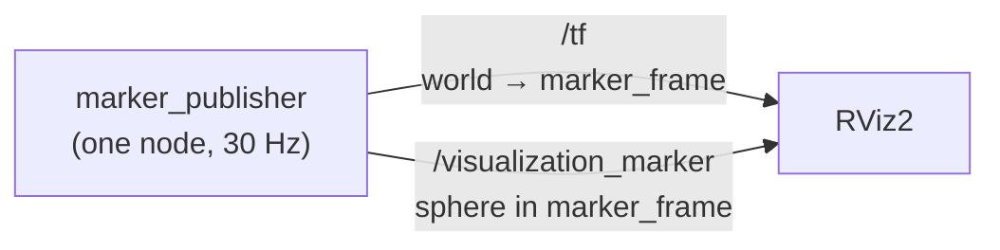

# Overview

A ROS 2 Jazzy workspace for learning RViz, running natively on macOS.

One node publishes a coordinate frame that orbits the origin, and a marker
attached to that frame. In RViz you see a blue sphere circling a grid.


The sphere is a `visualization_msgs/Marker` sitting at the **origin of
`marker_frame`**. It never moves in its own frame. RViz animates it by looking
up where `marker_frame` currently is, which is how a real robot's meshes move
too — you publish transforms, not new positions for every part.

## How the pieces connect



The TF tree is two frames deep:


`world` is the fixed frame RViz renders against. `marker_frame` moves.

## The motion


A 2 m radius circle, one lap every 6 seconds, counter-clockwise. The frame's
+X axis stays tangent to the path, so it points the way it is travelling.

Both numbers are node parameters, so nothing is hardcoded into the geometry:

| Parameter | Default |
| --- | --- |
| `orbit_radius_m` | 2.0 |
| `orbit_period_s` | 6.0 |
| `publish_rate_hz` | 30.0 |
| `marker_diameter_m` | 0.4 |
| `world_frame` / `marker_frame` | `world` / `marker_frame` |

## What to expect when you run it

```
make demo
```

The first ever run downloads ROS 2 — several GB, several minutes. After that
the build takes about a second and RViz takes roughly ten seconds to appear.

In the terminal:

```
[marker_publisher-1] [INFO] [marker_publisher]: Publishing TF 'world' -> 'marker_frame'
                            and markers on 'visualization_marker' at 30 Hz
[rviz2-2] [INFO] [rviz2]: Stereo is NOT SUPPORTED
[rviz2-2] [INFO] [rviz2]: OpenGl version: 2.1 (GLSL 1.2)
```

Those two RViz lines are normal on macOS, not errors.

In the window: a dark grid, a blue sphere going round once every six seconds,
and a small set of red/green/blue axes riding along with it. The Displays
panel on the left lists Grid, TF and Marker, all with no warning triangles.

Ctrl-C in the terminal stops both.

### Checking it actually works

With `make demo` running, in a second terminal:

```
make topics     # expect /tf, /tf_static, /visualization_marker
make tf         # expect translations whose x,y always sum to a radius of 2.0
make marker     # expect type: 2 (SPHERE), frame_id: marker_frame
```

If `make tf` prints transforms but RViz shows nothing, the usual cause is the
Fixed Frame — it must be `world`, under Global Options.

## Commands

Run `make` for the full list.

```
make demo      build, then launch the node and RViz together
make build     rebuild after changing code
make test      run the unit tests
make lint      check code style
make shell     shell with ROS sourced, for plain ros2 commands
```

With the demo running: `make topics`, `make marker`, `make tf`,
`make frames` (TF tree as a PDF), `make graph` (rqt_graph).

## Layout

```
pixi.toml                              dependencies and tasks
Makefile                               entry point for everything
docs/
  overview.md                          this file
  diagrams.py                          regenerates the images below
  images/overview/                     scene.svg, motion.svg
src/rviz_basics/
  rviz_basics/marker_publisher.py      the node
  launch/marker_demo.launch.py         starts the node and RViz
  rviz/marker_demo.rviz                saved RViz layout
  test/                                unit tests
```

## Adding to it

**A node:** add the module under `rviz_basics/`, register it in `setup.py`
under `console_scripts`, then `make build`.

**A package:** create `src/<name>/` with its own `package.xml` and `setup.py`.
`make build` finds it automatically.

**A ROS dependency:** add `ros-jazzy-<name>` to `pixi.toml` and the plain name
to `package.xml`.

**A different motion:** `circular_orbit()` in `marker_publisher.py` is a plain
function of time, radius and period, with no ROS types in it. Replace it and
nothing else changes. Then regenerate the diagrams:

```
pixi run python docs/diagrams.py
```

## Notes

Python 3.12, setuptools `<80` and pytest `<8` are pinned on purpose. Each one
breaks the build if loosened — the reasons are in `pixi.toml`.

ROS 2 packages come from [RoboStack](https://robostack.github.io), because
there are no official ROS 2 binaries for macOS. Nothing is installed
system-wide; it all lives in `.pixi/`.

Closing the `make graph` window prints a non-zero exit warning. That is an rqt
bug on macOS, not a problem here.

Commit `pixi.lock` — it is what makes the environment reproducible.
